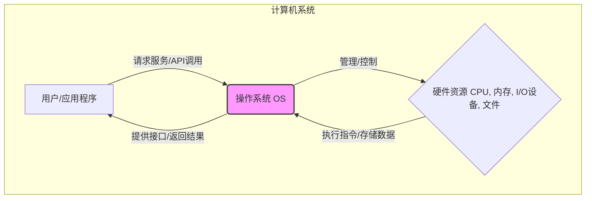
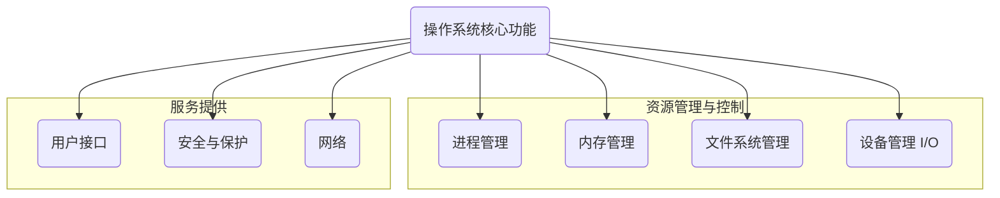

# 第一章：操作系统导论

本章作为操作系统的入门，将引导读者理解操作系统的基本概念、作用、发展历程以及核心功能。我们将探讨不同类型的操作系统，分析其内部结构，并了解现代操作系统的关键特性。

## 1.1 操作系统的定义与作用

**定义：** 操作系统（Operating System, OS）是管理计算机硬件与软件资源，并为用户和应用程序提供服务接口的系统软件。它是计算机系统中最基本、最重要的系统软件之一。

我们可以从两个视角来理解操作系统：

1.  **用户视角 (User View):** 对于用户而言，操作系统是他们与计算机硬件交互的接口。它隐藏了底层硬件的复杂性，提供了更方便、易用的操作环境。例如，图形用户界面 (GUI) 允许用户通过点击图标和菜单来操作计算机，而不是输入复杂的命令。操作系统使得用户可以轻松地运行应用程序、管理文件、访问网络等。
2.  **系统视角 (System View):** 从计算机系统的角度看，操作系统是一个**资源管理器 (Resource Manager)**。计算机系统拥有多种资源，如中央处理器 (CPU) 时间、内存空间、文件存储空间、输入/输出 (I/O) 设备等。操作系统负责有效地分配和管理这些资源，解决资源冲突，确保计算机系统高效、有序地运行。同时，操作系统也是一个**控制程序 (Control Program)**，它控制着应用程序的执行，防止错误和不当操作损害系统。

**作用：**

*   **资源管理:** 高效管理 CPU、内存、存储、I/O 设备等硬件资源，并将其分配给需要的进程。
*   **提供接口:** 为用户提供用户接口（如命令行 CLI、图形界面 GUI），为应用程序提供应用程序编程接口 (API)，使它们能使用系统资源。
*   **程序控制:** 控制程序的执行，管理进程和线程，处理并发操作。
*   **抽象化:** 将底层复杂的硬件操作抽象成简单、一致的操作接口。例如，无论硬盘的具体型号如何，文件读写操作对应用程序来说是相似的。
*   **错误处理与保护:** 检测和处理系统运行中的错误，提供安全机制保护系统资源不被非法访问和破坏。



上图简要展示了操作系统在用户/应用程序与硬件资源之间的核心地位。

## 1.2 操作系统的发展历程

操作系统的发展与计算机硬件技术的发展紧密相连，大致可以分为以下几个阶段：

1.  **早期系统 (无操作系统, 1940s-1950s):**
    *   程序员直接操作硬件，通过插拔线、开关等方式编程。
    *   效率极低，一次只能运行一个程序，CPU 利用率非常低。
    *   出现了简单的工具库，如 I/O 控制子程序。

2.  **批处理系统 (Batch Processing Systems, 1950s-1960s):**
    *   **目的:** 提高 CPU 利用率。
    *   **方式:** 将用户作业成批输入，由操作员统一加载到磁带上，操作系统按顺序读取并执行作业。
    *   **特点:** 作业自动转换，减少了人工干预时间，提高了吞吐量。但用户无法与程序交互，调试困难，周转时间长。
    *   **简单批处理:** 一次只装入一个作业。
    *   **多道批处理 (Multiprogramming):** 内存中同时驻留多个作业，当一个作业等待 I/O 时，CPU 可以切换到执行另一个作业，显著提高了 CPU 和 I/O 设备的利用率。这是操作系统发展的一个重要里程碑。

3.  **分时系统 (Time-Sharing Systems, 1960s-1970s):**
    *   **目的:** 提供人机交互能力。
    *   **方式:** 将 CPU 时间划分为短的时间片 (Time Slice)，轮流分配给各个终端用户。
    *   **特点:** 用户可以通过终端与系统进行交互，感觉像是独占计算机。响应时间快，允许多个用户同时使用计算机。引入了进程调度、内存管理、并发控制等关键技术。代表系统：CTSS, Multics, UNIX。

4.  **实时系统 (Real-Time Systems, 1970s-至今):**
    *   **目的:** 满足对响应时间有严格要求的应用场景（如工业控制、航空航天）。
    *   **特点:** 必须在规定的时间内完成特定任务。分为**硬实时** (必须严格满足时间限制) 和**软实时** (允许偶尔超时)。需要特殊的调度算法和高可靠性。

5.  **个人计算机操作系统 (Personal Computer OS, 1970s末-至今):**
    *   随着微处理器的出现，个人计算机 (PC) 普及。
    *   早期 PC 操作系统功能简单 (如 CP/M, MS-DOS)，后来发展出强大的图形界面操作系统 (如 macOS, Windows)。
    *   注重易用性、用户体验和多媒体支持。

6.  **分布式与网络操作系统 (Distributed and Network OS, 1980s-至今):**
    *   **网络操作系统:** 使得网络中的计算机可以共享资源（如文件、打印机）。用户知道资源在哪台机器上。
    *   **分布式操作系统:** 将多台计算机连接起来，形成一个统一的系统。用户感觉不到多台机器的存在，资源分布是透明的。提高了系统的计算能力、可靠性和可扩展性。

7.  **嵌入式与移动操作系统 (Embedded and Mobile OS, 1990s-至今):**
    *   **嵌入式操作系统:** 运行在嵌入式设备（如家电、汽车、工业控制器）中，通常资源受限，对实时性、可靠性、功耗有特定要求。
    *   **移动操作系统:** 运行在智能手机、平板电脑等移动设备上，注重触控交互、应用生态、移动网络和电源管理。代表：Android, iOS。

## 1.3 操作系统的分类

操作系统可以根据不同的标准进行分类：

| 分类标准       | 类型                   | 主要特点                                                     | 示例             |
| :------------- | :--------------------- | :----------------------------------------------------------- | :--------------- |
| **用户数量**   | 单用户操作系统         | 一次只允许一个用户登录和使用                                   | MS-DOS           |
|                | 多用户操作系统         | 允许多个用户同时登录和使用                                   | UNIX, Linux, Windows Server |
| **任务数量**   | 单任务操作系统         | 一次只能运行一个程序                                           | MS-DOS           |
|                | 多任务操作系统         | 允许同时运行多个程序 (宏观上并发，微观上可能串行或并行)       | Windows, macOS, Linux |
| **处理方式**   | 批处理操作系统         | 成批处理作业，无交互性                                       | 早期的 IBM OS/360 |
|                | 分时操作系统           | 提供人机交互，多用户共享主机，响应时间快                   | UNIX, Linux      |
|                | 实时操作系统           | 对响应时间有严格要求，高可靠性                             | VxWorks, QNX     |
| **体系结构**   | 分布式操作系统         | 管理物理上分离的多台计算机，用户视为单一系统，资源透明共享     | Amoeba, Plan 9   |
|                | 网络操作系统           | 连接网络中的计算机，提供网络服务和资源共享，用户需指定资源位置 | Novell NetWare, Windows NT |
| **应用领域**   | 桌面操作系统           | 用于个人计算机，注重易用性和多媒体                             | Windows, macOS, Ubuntu |
|                | 服务器操作系统         | 用于服务器，注重稳定性、性能、安全性和并发处理能力             | Windows Server, Red Hat Enterprise Linux, FreeBSD |
|                | 嵌入式操作系统         | 用于嵌入式设备，资源受限，常有实时性或低功耗要求           | FreeRTOS, Embedded Linux |
|                | 移动操作系统           | 用于智能手机、平板，注重触控、移动性、应用生态、低功耗       | Android, iOS     |

**需要注意：** 现代操作系统通常融合了多种类型的特点。例如，Windows 和 Linux 既是多用户、多任务的，也支持分时特性，并且可以作为网络或服务器操作系统使用。

### 1.3.1 批处理操作系统
主要用于早期大型机，处理大量重复性计算任务，追求高吞吐量。

### 1.3.2 分时操作系统
允许多个用户通过终端同时与计算机交互，共享系统资源。关键在于快速的任务切换和响应。

### 1.3.3 实时操作系统 (RTOS)
核心是**可预测性**和**及时性**。用于对时间要求苛刻的场景。
*   **硬实时:** 任务必须在截止时间 (Deadline) 前完成，否则会导致系统失败。 (如：飞行控制系统)
*   **软实时:** 偶尔错过截止时间不会导致灾难性后果，但会降低系统性能。(如：在线视频播放)

### 1.3.4 分布式操作系统
管理一组通过网络连接的独立计算机，使它们像一个单一的、统一的计算系统一样工作。用户无需关心任务在哪台机器上执行或数据存储在哪里。实现复杂，但可提供高可用性和可扩展性。

### 1.3.5 网络操作系统
侧重于网络通信和资源共享（文件、打印机等）。用户需要明确指定远程资源的位置。是在独立操作系统的基础上增加了网络服务功能。

### 1.3.6 嵌入式操作系统
为特定硬件和应用设计的操作系统，通常裁剪了不需要的功能，资源占用小，效率高，可能需要实时能力。

### 1.3.7 移动操作系统
为移动设备优化，特点包括触摸界面、传感器支持、应用商店、电源管理和无线连接。

## 1.4 操作系统的主要功能

操作系统作为资源管理器和控制程序，其核心功能可以概括为以下几个方面：



1.  **进程管理 (Process Management):**
    *   进程是程序的一次执行过程，是系统进行资源分配和调度的基本单位。
    *   **功能:** 进程的创建与撤销、进程的挂起与激活、进程状态转换、进程调度（决定哪个进程获得 CPU）、进程同步与互斥、进程间通信 (IPC)。 (详见第二章)

2.  **内存管理 (Memory Management):**
    *   内存是 CPU 能直接访问的存储介质，是稀缺资源。
    *   **功能:** 内存分配与回收（为进程分配所需内存空间，在其结束后回收）、地址映射（将程序的逻辑地址转换为物理地址）、内存保护（防止进程访问不属于它的内存区域）、内存扩充（利用虚拟内存技术，提供比物理内存更大的地址空间）。 (详见第四章)

3.  **文件系统管理 (File System Management):**
    *   文件是数据的逻辑组织形式。
    *   **功能:** 文件的创建、删除、读写、修改操作；目录（文件夹）的管理；文件存储空间的管理（分配、回收）；文件的逻辑结构与物理结构的转换；文件共享与保护。 (详见第五章)

4.  **设备管理 (Device Management / I/O Management):**
    *   管理计算机的各种输入/输出设备（键盘、鼠标、显示器、打印机、磁盘驱动器等）。
    *   **功能:** 设备分配与回收；设备驱动（提供与具体设备交互的接口）；缓冲管理（缓解 CPU 与 I/O 设备速度不匹配的问题）；I/O 控制（处理 I/O 请求，完成实际的 I/O 操作）；设备无关性（让应用程序使用逻辑设备名进行操作，屏蔽物理设备细节）。 (详见第六章)

5.  **用户接口 (User Interface):**
    *   提供用户与操作系统交互的方式。
    *   **类型:**
        *   **命令行接口 (CLI - Command Line Interface):** 用户通过输入文本命令进行操作。 (如：Bash, PowerShell)
        *   **图形用户界面 (GUI - Graphical User Interface):** 用户通过窗口、图标、菜单、鼠标等进行操作。(如：Windows 桌面, macOS Aqua)
        *   **批处理接口:** 用户预先编写作业控制脚本。
        *   **系统调用接口 (System Call Interface):** 应用程序通过系统调用请求操作系统服务。这是程序与 OS 交互的主要方式。

6.  **其他功能:**
    *   **网络通信:** 支持 TCP/IP 等网络协议，实现网络连接和数据传输。
    *   **安全与保护:** 提供认证机制、访问控制、内存保护、文件权限等，确保系统和用户数据的安全。
    *   **错误处理:** 检测硬件故障、软件错误，并采取相应措施，尽可能保证系统稳定运行。

## 1.5 操作系统结构

操作系统的内部组织方式影响其效率、可维护性和可扩展性。常见的结构有：

1.  **单体结构 (Monolithic Structure):**
    *   **特点:** 整个操作系统是一个单一的、巨大的可执行程序。所有功能模块（进程管理、内存管理、文件系统、设备驱动等）都编译在内核中，运行在内核态。模块间通过简单的函数调用进行交互。
    *   **优点:** 模块间通信效率高，结构简单直接。
    *   **缺点:** 结构庞大，耦合度高，一个模块的错误可能导致整个系统崩溃；难以修改、扩展和维护。
    *   **示例:** 早期的 UNIX, MS-DOS, Linux (虽然 Linux 采用了模块化设计，但其核心仍是单体结构)。

    ```mermaid
    graph TD
        subgraph Kernel Space (内核态)
            direction LR
            SysCall(系统调用接口) --- PM(进程管理)
            SysCall --- MM(内存管理)
            SysCall --- FS(文件系统)
            SysCall --- IO(设备驱动)
            PM --- MM --- FS --- IO --- PM
        end
        UserApp(用户应用程序) -->|系统调用| SysCall;
        KernelSpace --> Hardware(硬件)

        style KernelSpace fill:#eee,stroke:#333
    ```

2.  **分层结构 (Layered Structure):**
    *   **特点:** 将操作系统功能划分为若干层次。每一层只依赖于其紧邻的下层提供的服务，并向其上层提供服务。层级结构清晰。
    *   **优点:** 易于设计、实现和调试（一次关注一层）；易于维护和扩展（修改一层不影响其他层，只要接口不变）。
    *   **缺点:** 层级划分困难；系统效率可能较低（请求需要穿越多个层次）。
    *   **示例:** THE 系统。

    ```mermaid
    graph TD
        User(用户程序) --> L5(用户界面);
        L5 --> L4(I/O 管理);
        L4 --> L3(进程通信);
        L3 --> L2(内存管理);
        L2 --> L1(进程调度);
        L1 --> L0(硬件抽象层);
        L0 --> Hardware(硬件);

        style L0 fill:#f9f
        style L1 fill:#ccf
        style L2 fill:#fcc
        style L3 fill:#cff
        style L4 fill:#ffc
        style L5 fill:#cfc
    ```

3.  **微内核结构 (Microkernel Structure):**
    *   **特点:** 将尽可能多的操作系统服务（如文件系统、设备驱动、网络协议栈）移出内核，作为运行在用户态的服务器进程来实现。内核只保留最核心的功能（如进程/线程管理、内存管理基础、IPC）。
    *   **优点:** 内核精简，可靠性高（一个服务进程崩溃不影响内核）；灵活性和可扩展性好（易于添加、删除、修改服务）；便于移植。
    *   **缺点:** 用户态服务与内核、服务与服务之间需要通过 IPC 通信，性能开销较大。
    *   **示例:** Mach, QNX, Minix 3, Windows NT (混合结构，但受微内核思想影响)。

    ```mermaid
    graph TD
        subgraph User Space
            UserApp(用户应用程序)
            FS(文件服务器)
            Net(网络服务器)
            Dev(设备驱动服务器)
        end
        subgraph Kernel Space 
            IPC(进程间通信)
            Mem(基本内存管理)
            Sched(线程调度)
        end
        UserApp -->|系统调用/IPC| IPC
        FS -->|IPC| IPC
        Net -->|IPC| IPC
        Dev -->|IPC| IPC
        IPC --> Mem & Sched
        Mem & Sched --> Hardware(硬件)

        style KernelSpace fill:#eee,stroke:#333
    ```

4.  **外核结构 (Exokernel Structure):**
    *   **思想:** 操作系统应尽可能少地对硬件资源进行抽象，将硬件资源的物理细节直接暴露给应用程序（通过安全的库操作系统 LibOS）。内核只负责资源的保护和复用。
    *   **优点:** 应用程序可以根据自身需求定制资源管理策略，实现极致性能。
    *   **缺点:** 编程复杂性高，应用程序需要处理底层细节；安全性难以保证。
    *   **研究性:** 更多是研究项目，商业应用较少。

5.  **虚拟机结构 (Virtual Machine Structure):**
    *   **思想:** 在物理硬件之上运行一个虚拟机监视器 (VMM) 或 Hypervisor，它创建多个虚拟机 (VM) 的抽象。每个 VM 看起来都像一个独立的物理机器，可以在其上运行各自的操作系统（客户 OS）。
    *   **VMM 的作用:** 管理物理资源，并在多个 VM 之间进行分配和隔离。
    *   **优点:** 隔离性好，一个 VM 的问题不影响其他 VM；可以在一台物理机上运行不同类型的操作系统；便于服务器整合、测试和开发。
    *   **缺点:** 存在一定的性能损耗（虚拟化开销）。
    *   **示例:** VMware, KVM, Xen, Hyper-V。（详见第七章）

    ```mermaid
    graph TD
        subgraph VM1
            App1(应用) --> OS1(客户 OS 1)
        end
        subgraph VM2
            App2(应用) --> OS2(客户 OS 2)
        end
        subgraph VM3
            App3(应用) --> OS3(客户 OS 3)
        end

        VMM(虚拟机监视器 / Hypervisor)

        OS1 --> VMM
        OS2 --> VMM
        OS3 --> VMM
        VMM --> Hardware(物理硬件)

        style VMM fill:#f9f,stroke:#333
    ```

现代操作系统往往采用**混合结构 (Hybrid Structure)**，结合了不同结构的优点。例如，Linux 和 Windows 核心是单体的，但支持动态加载模块（类似微内核的灵活性）；macOS 的 XNU 内核结合了 Mach 微内核和 BSD 单内核的特性。

## 1.6 现代操作系统特性

现代操作系统除了具备上述基本功能和结构外，通常还具备以下一些重要特性：

*   **多任务与多线程:** 支持同时运行多个程序，并将程序细分为更小的执行单元（线程）以提高并发性和响应性。
*   **虚拟内存:** 通过将部分程序和数据存储在磁盘上，提供远大于物理内存的可用地址空间。
*   **图形用户界面 (GUI):** 提供直观易用的图形化操作方式。
*   **网络功能:** 内建强大的网络协议栈，支持各种网络应用和服务。
*   **安全性:** 提供用户认证、访问控制、加密、防火墙等机制保护系统安全。
*   **可扩展性:** 支持添加新硬件、新功能模块。
*   **可移植性:** 能够在不同类型的硬件平台上运行（需要一定的修改）。
*   **电源管理:** 尤其在移动和嵌入式设备上，优化能源消耗。
*   **虚拟化支持:** 支持运行虚拟机或容器。
*   **文件系统增强:** 支持日志、快照、加密等高级文件系统特性。

## 1.7 总结与展望

本章我们初步认识了操作系统，理解了它是管理计算机软硬件资源、提供服务接口的核心系统软件。我们回顾了操作系统的发展如何与计算机技术相互促进，从简单的批处理到复杂、功能强大的现代操作系统。我们学习了操作系统的不同分类方法，掌握了其核心功能：进程管理、内存管理、文件系统管理、设备管理和用户接口。此外，我们还探讨了单体、分层、微内核等不同的操作系统结构，并了解了现代操作系统所具备的关键特性。

操作系统是计算机科学中最核心、最复杂的领域之一。理解操作系统的工作原理，对于编写高效、可靠的软件，设计强大的计算系统至关重要。

在接下来的章节中，我们将深入探讨本章提到的各个核心功能模块，揭示它们内部的实现机制和设计思想。下一章，我们将聚焦于操作系统的基本执行单位——进程与线程。 