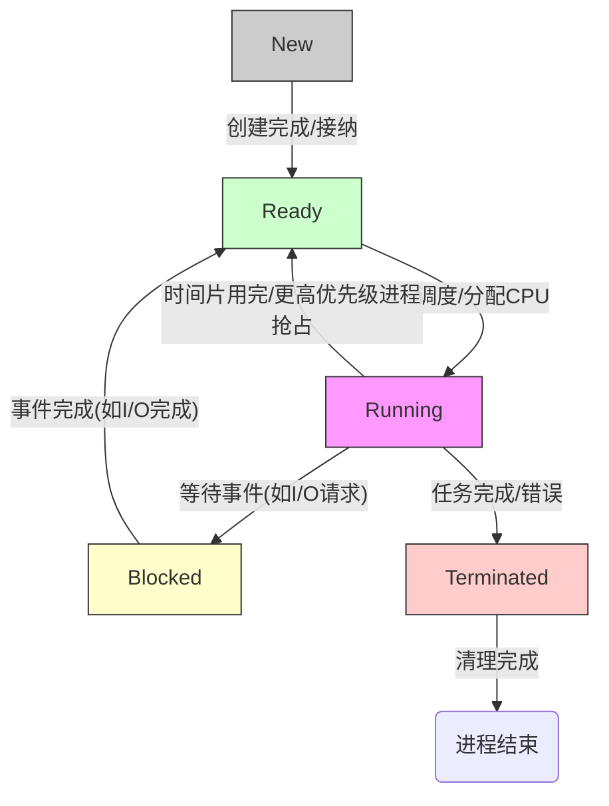
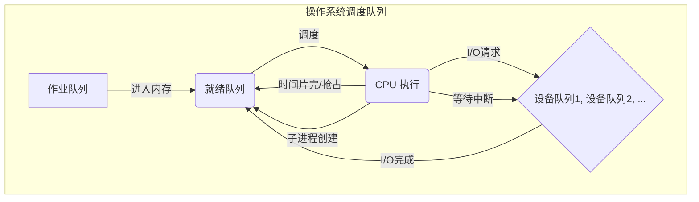
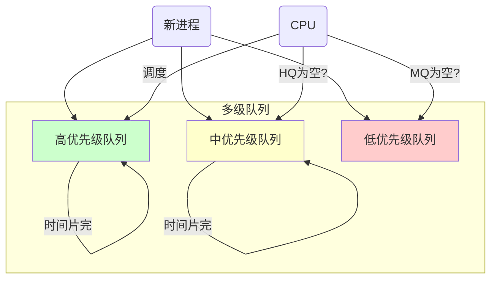
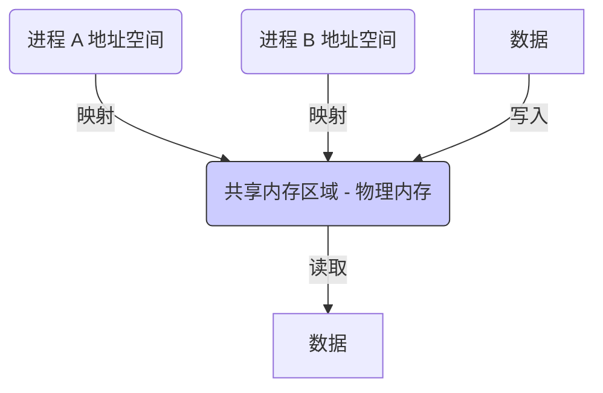
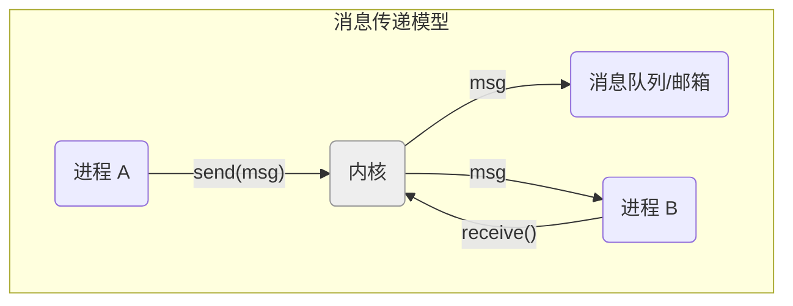

# 第二章：进程与线程

在第一章我们了解了操作系统是资源管理器，而 CPU 时间是最核心的资源之一。为了让多个程序能够并发执行，共享 CPU 资源，操作系统引入了进程和线程的概念。本章将深入探讨进程和线程的原理、管理、调度以及它们之间的关系。

## 2.1 进程的概念

### 2.1.1 进程的定义与特征

程序（Program）是静态的指令集合，通常存储在磁盘上（例如，一个可执行文件 `.exe` 或 `a.out`）。而**进程（Process）** 是程序的一次动态执行过程。它是操作系统进行资源分配和调度的基本单位。

可以将程序比作菜谱，而进程则是厨师按照菜谱做菜的整个活动过程。同一份菜谱可以被用来做多次菜（一个程序可以运行多次，产生多个进程）。

**进程的主要特征：**

1.  **动态性:** 进程是程序的一次执行，有生命周期（创建、执行、消亡），是动态产生和消亡的。程序是静态的。
2.  **并发性:** 多个进程可以在宏观上同时执行（在单核 CPU 上是交替执行，在多核 CPU 上可以并行执行），这是操作系统引入进程的重要原因。
3.  **独立性:** 进程是系统进行资源分配和调度的独立单位。每个进程拥有自己独立的地址空间、代码、数据和系统资源（如打开的文件、设备等）。一个进程的失败通常不会直接影响其他进程。
4.  **异步性:** 进程按各自独立的、不可预知的速度向前推进。进程间的执行顺序和时间是不确定的，需要同步机制来协调。
5.  **结构性:** 进程由程序段、数据段和进程控制块 (PCB) 组成。

### 2.1.2 进程状态与转换

进程在其生命周期中会经历不同的状态。常见的进程状态有：

1.  **新建态 (New):** 进程正在被创建，尚未准备好执行。操作系统需要分配资源、创建 PCB 等。
2.  **就绪态 (Ready):** 进程已获得除 CPU 之外的所有必需资源，一旦获得 CPU 时间片，即可立即执行。所有就绪进程通常排在一个队列（就绪队列）中。
3.  **运行态 (Running):** 进程正在 CPU 上执行。在单核系统中，任何时刻最多只有一个进程处于运行态。
4.  **阻塞态/等待态 (Blocked / Waiting):** 进程因等待某个事件（如等待 I/O 操作完成、等待某个信号、等待资源可用）而暂时停止执行。即使 CPU 空闲，阻塞态进程也无法执行。
5.  **终止态 (Terminated):** 进程执行完毕或因错误而中止，正在被操作系统清理（回收资源）。

**进程状态转换图:**



*   **New -> Ready:** 进程创建完成，资源基本分配到位，等待调度。
*   **Ready -> Running:** 调度程序选中该进程，分配 CPU。
*   **Running -> Ready:** 时间片用完，或被更高优先级的进程抢占。
*   **Running -> Blocked:** 进程需要等待外部事件，主动放弃 CPU。
*   **Running -> Terminated:** 进程正常结束或异常终止。
*   **Blocked -> Ready:** 等待的事件发生，进程重新具备运行条件，但不立即执行，需等待调度。

### 2.1.3 进程控制块 (PCB)

操作系统为了管理进程，需要为每个进程维护一个数据结构，称为**进程控制块 (Process Control Block, PCB)**，也称为任务控制块 (TCB) 或进程描述符 (Process Descriptor)。PCB 是进程存在的唯一标识，包含了操作系统管理进程所需的全部信息。

**PCB 通常包含以下信息：**

1.  **进程标识符 (PID):** 唯一的进程 ID。
2.  **进程状态:** 当前进程所处的状态（新建、就绪、运行、阻塞、终止）。
3.  **程序计数器 (PC):** 指向进程下一条要执行的指令的地址。
4.  **CPU 寄存器:** 各种通用寄存器、累加器、栈指针、状态字等的副本。当进程切换时，这些信息需要保存，以便将来恢复执行。
5.  **CPU 调度信息:** 进程优先级、调度队列指针、时间片大小等。
6.  **内存管理信息:** 指向进程地址空间的页表或段表的指针、基址/限长寄存器等。
7.  **记账信息:** CPU 使用时间、执行时间限制、用户 ID、组 ID 等。
8.  **I/O 状态信息:** 分配给进程的 I/O 设备列表、打开的文件列表等。
9.  **上下文信息:** 指向 PCB 数据结构的指针，用于组织进程队列（如就绪队列、阻塞队列）。

PCB 是操作系统进行进程切换（Context Switch）的关键。当 CPU 从一个进程切换到另一个进程时，操作系统需要：
1.  **保存**当前运行进程的上下文（寄存器值、PC、状态等）到其 PCB 中。
2.  **加载**即将运行进程的上下文从其 PCB 到 CPU 寄存器中。
进程切换是有开销的，因为它涉及纯粹的系统管理工作，不能执行用户任务。频繁的切换会降低系统效率。

## 2.2 进程调度

在多道程序环境下，内存中通常有多个就绪进程。当 CPU 空闲时，操作系统需要从就绪队列中选择一个进程来运行。这个选择过程就是**进程调度 (Process Scheduling)**。负责调度的程序模块称为**调度程序 (Scheduler)**。

### 2.2.1 调度队列与调度器

操作系统维护着不同的进程队列：

*   **作业队列 (Job Queue):** 系统中所有进程的集合。
*   **就绪队列 (Ready Queue):** 内存中所有处于就绪状态、等待 CPU 的进程的集合。通常实现为链表，PCB 头部包含指向下一个 PCB 的指针。
*   **设备队列 (Device Queues):** 因等待某个特定 I/O 设备而阻塞的进程队列。每个设备都有自己的设备队列。



根据调度发生的时机和功能，调度器可以分为：

1.  **长期调度器 (Long-term Scheduler) / 作业调度器:**
    *   **作用:** 从外存的作业后备队列中选择作业调入内存，为其创建进程并放入就绪队列。
    *   **控制对象:** 作业。
    *   **运行频率:** 较低（作业完成或系统负载变化时）。
    *   **目标:** 控制进入系统的**多道程序度**（内存中进程的数量），平衡 CPU 密集型和 I/O 密集型作业。分时系统通常没有或很少使用长期调度器。
2.  **中期调度器 (Medium-term Scheduler) / 交换调度器:**
    *   **作用:** 将暂时不运行的进程（如阻塞时间过长、优先级低）从内存换出到外存（挂起），以减少多道程序度，腾出内存；在需要时再将其换入内存。
    *   **控制对象:** 挂起/活动进程。
    *   **运行频率:** 中等。
    *   **目标:** 提高内存利用率和系统吞吐量。
3.  **短期调度器 (Short-term Scheduler) / CPU 调度器:**
    *   **作用:** 从内存的就绪队列中选择一个进程，将 CPU 分配给它。
    *   **控制对象:** 就绪进程。
    *   **运行频率:** 非常高（时钟中断、I/O 中断、系统调用后都可能触发）。
    *   **目标:** 提高 CPU 利用率和系统响应速度。**通常我们说的进程调度主要指短期调度。**

### 2.2.2 调度时机与切换

**CPU 调度发生的时机：**

1.  进程从运行态 -> 等待态（如发起 I/O 请求）。
2.  进程从运行态 -> 就绪态（如时间片用完）。
3.  进程从等待态 -> 就绪态（如 I/O 操作完成）。
4.  进程终止。

对于情况 1 和 4，必须进行调度选择新进程。对于情况 2 和 3，可以选择继续运行当前进程（非抢占式）或选择新进程（抢占式）。

*   **非抢占式调度 (Non-preemptive):** 一旦 CPU 分配给一个进程，该进程将一直持有 CPU 直到它自愿释放（终止或进入等待态）。实现简单，但可能导致短进程等待长进程，响应时间差。
*   **抢占式调度 (Preemptive):** 当前运行的进程可以被操作系统强制剥夺 CPU 使用权，分配给其他进程（如更高优先级进程就绪、当前进程时间片用完）。可以提供更好的响应时间，但实现复杂，需要处理上下文切换和并发访问共享数据的问题。

**进程切换 (Context Switch):** 将 CPU 的控制权从一个进程转移到另一个进程的过程。这包括保存当前进程的上下文到其 PCB，并加载新进程的上下文到 CPU。切换过程由操作系统的**分派程序 (Dispatcher)** 完成。分派程序需要尽可能快，因为切换期间 CPU 是空闲的。

### 2.2.3 调度目标

不同的系统对调度算法有不同的要求。常见的调度目标（准则）有：

*   **CPU 利用率 (CPU Utilization):** 使 CPU 尽可能处于"忙碌"状态。\( \text{利用率} = \frac{\text{CPU 忙碌时间}}{\text{总时间}} \)。
*   **系统吞吐量 (Throughput):** 单位时间内完成的进程数量。
*   **周转时间 (Turnaround Time):** 进程从提交到完成所花费的总时间。\( T_{\text{周转}} = T_{\text{完成}} - T_{\text{提交}} \)。包括等待进入内存、在就绪队列等待、CPU 执行和 I/O 执行的时间。
*   **等待时间 (Waiting Time):** 进程在就绪队列中等待 CPU 的总时间。CPU 调度算法主要影响等待时间。
*   **响应时间 (Response Time):** 从提交请求到产生第一次响应所花费的时间（不是指到输出完成）。在分时系统中尤其重要。

**目标通常是：** 最大化 CPU 利用率和吞吐量，最小化周转时间、等待时间和响应时间。这些目标有时会相互冲突（例如，减少平均等待时间可能会增加最大等待时间）。

### 2.2.4 调度算法

以下介绍几种经典的 CPU 调度算法：

#### 2.2.4.1 先来先服务 (First-Come, First-Served, FCFS)

*   **思想:** 按进程到达就绪队列的先后顺序进行调度。非抢占式。
*   **实现:** 用 FIFO 队列管理就绪进程。
*   **优点:** 实现简单，公平（按到达顺序）。
*   **缺点:**
    *   平均等待时间可能很长，波动大。
    *   **护航效应 (Convoy Effect):** 一个 CPU 密集型长进程会阻塞其后所有 I/O 密集型短进程，导致 CPU 和设备利用率下降。
    *   不利于交互式系统。

**示例:**
进程 | 到达时间 | 需要 CPU 时间
------- | -------- | -------------
P1 | 0 | 24
P2 | 0 | 3
P3 | 0 | 3

FCFS 调度顺序: P1 -> P2 -> P3
等待时间: P1=0, P2=24, P3=27
平均等待时间: (0 + 24 + 27) / 3 = 17

如果顺序是 P2 -> P3 -> P1:
等待时间: P1=6, P2=0, P3=3
平均等待时间: (6 + 0 + 3) / 3 = 3 （显著改善）

#### 2.2.4.2 最短作业优先 (Shortest Job First, SJF)

*   **思想:** 选择就绪队列中**下一次 CPU 执行时间**最短的进程进行调度。
*   **类型:**
    *   **非抢占式 SJF:** 一旦进程获得 CPU，会一直运行到完成本次 CPU 执行。
    *   **抢占式 SJF (Shortest Remaining Time First, SRTF):** 如果一个新到达的进程比当前运行进程剩余的 CPU 时间还要短，则抢占当前进程。
*   **优点:** 理论上可以证明，对于给定的一批进程，SJF (特别是 SRTF) 具有**最小的平均等待时间**。
*   **缺点:**
    *   **难以预测:** 无法精确知道下一个 CPU burst 的长度，通常只能基于历史数据进行估计。
    *   **饥饿 (Starvation):** 长进程可能永远得不到 CPU 时间，如果不断有短进程到达。

**示例 (非抢占式 SJF):**

进程 | 到达时间 | 需要 CPU 时间
------- | -------- | -------------
P1 | 0 | 7|
P2 | 2 | 4|
P3 | 4 | 1|
P4 | 5 | 4|

调度顺序: P1 (0-7) -> P3 (7-8) -> P2 (8-12) -> P4 (12-16)
等待时间: P1=0, P2=8-2=6, P3=7-4=3, P4=12-5=7
平均等待时间: (0 + 6 + 3 + 7) / 4 = 4

**示例 (抢占式 SJF / SRTF):**
(同上)
调度过程:
- 0: P1 运行 (剩余 7)
- 2: P2 到达 (剩余 4)。P1(剩余 5) > P2(剩余 4)。P2 运行。
- 4: P3 到达 (剩余 1)。P2(剩余 2) > P3(剩余 1)。P3 运行。
- 5: P4 到达 (剩余 4)。P3 运行中。
- 5+: P3 完成。比较 P1(剩余 5), P2(剩余 2), P4(剩余 4)。P2 运行。
- 7: P2 完成。比较 P1(剩余 5), P4(剩余 4)。P4 运行。
- 11: P4 完成。P1 运行。
- 16: P1 完成。

执行顺序片段: P1(0-2), P2(2-4), P3(4-5), P2(5-7), P4(7-11), P1(11-16)
等待时间: P1=(11-2)+(0-0)=9, P2=(5-4)=1, P3=(4-4)=0, P4=(7-5)=2
平均等待时间: (9 + 1 + 0 + 2) / 4 = 3

#### 2.2.4.3 优先级调度 (Priority Scheduling)

*   **思想:** 为每个进程分配一个优先级，CPU 分配给具有最高优先级的就绪进程。
*   **类型:**
    *   **非抢占式:** 高优先级进程不能抢占正在运行的低优先级进程。
    *   **抢占式:** 当一个更高优先级的进程到达时，可以抢占当前运行的低优先级进程。
*   **优先级确定:**
    *   **静态优先级:** 创建时指定，运行期间不变。
    *   **动态优先级:** 运行期间可以调整（如根据等待时间、资源使用情况）。
*   **优点:** 可以灵活地根据任务的重要性来分配 CPU。
*   **缺点:**
    *   **饥饿:** 低优先级进程可能永远无法运行（**无限阻塞**）。
    *   **解决方案:** **老化 (Aging)** - 逐渐增加等待时间过长进程的优先级。
*   **SJF 可以看作一种优先级调度**，优先级取决于下一次 CPU burst 的长度。

#### 2.2.4.4 时间片轮转 (Round Robin, RR)

*   **思想:** 主要为分时系统设计。将 CPU 时间划分为固定长度的小时间片 (Time Quantum / Time Slice)，通常为 10-100 毫秒。就绪队列按 FIFO 组织。调度程序选择队首进程，让其运行最多一个时间片。
    *   如果进程在一个时间片内完成，则自愿释放 CPU。
    *   如果时间片用完但进程未完成，则发生时钟中断，操作系统将该进程移到就绪队列末尾，并调度队首进程。
*   **类型:** 抢占式。
*   **优点:** 公平，响应时间较快，没有饥饿问题。
*   **缺点:**
    *   **性能依赖于时间片大小 q:**
        *   **q 太大:** 退化为 FCFS。
        *   **q 太小:** 进程切换过于频繁，上下文切换开销增大，系统有效效率降低。
    *   平均周转时间通常比 SJF 长。
*   **经验法则:** 时间片长度应略大于典型交互所需的时间，使得大部分 CPU burst 能在一个时间片内完成。

**示例 (时间片 q = 4):**

进程 | 到达时间 | 需要 CPU 时间
------- | -------- | -------------
P1 | 0 | 24
P2 | 0 | 3
P3 | 0 | 3

调度顺序: P1(0-4), P2(4-7), P3(7-10), P1(10-14), P1(14-18), P1(18-22), P1(22-26), P1(26-30)
等待时间: P1=(10-4)+(26-14)=6+12=18?  不，要算总等待。P1在0开始，7结束第一轮，10开始第二轮，...  P1 等待时间 = (4-0) + (7-4) + (10-7) = ... 这算法不对。
正确计算等待时间：进程在就绪队列中的总时间。
P1: (0) -> 运行 4ms -> (4) 到队尾 -> P2运行(4-7) -> P3运行(7-10) -> P1运行(10-14) -> (14)到队尾 -> P1运行(14-18) ...
P1 等待时间 = (10-4) + (14-10+P2时间+P3时间 - P1已运行时间？) 还是不对。

换种方式算: P1 完成时间 30。 P1 周转时间 30。 P1 等待时间 = 周转时间 - Burst 时间 = 30 - 24 = 6。 (不对，这是 FCFS 的结果)

再来一次:
Gantt 图: | P1 (4) | P2 (3) | P3 (3) | P1 (4) | P1 (4) | P1 (4) | P1 (4) | P1 (4) |
时间点:  0        4        7       10       14       18       22       26       30
P1 完成时间: 30。周转时间 30。等待时间 = 30 - 24 = 6 (这个计算仅在P1连续运行才对)
P1 在就绪队列的时间：(4-4)=0, (7-7)=0, (10-10)=0... 不对。

P1 在 (4ms) 时被 P2 抢占，等待到 10ms。等待时间 = 10 - 4 = 6
P1 在 (14ms) 时完成第二段，等待到 ? 需要看队列。假设没新进程，它又到队尾。
P1 在 10ms 运行到 14ms。
P1 在 14ms 运行到 18ms。
P1 在 18ms 运行到 22ms。
P1 在 22ms 运行到 26ms。
P1 在 26ms 运行到 30ms。
P1 总等待时间 = (10 - 4) + (14 - 14) + ... ? 这个计算逻辑有问题。

**正确计算等待时间 = 完成时间 - 到达时间 - CPU 执行时间**
P1 完成时间: 30, 到达时间: 0, CPU 时间: 24. 等待时间 = 30 - 0 - 24 = 6.
P2 完成时间: 7, 到达时间: 0, CPU 时间: 3. 等待时间 = 7 - 0 - 3 = 4.
P3 完成时间: 10, 到达时间: 0, CPU 时间: 3. 等待时间 = 10 - 0 - 3 = 7.
平均等待时间 = (6 + 4 + 7) / 3 = 17 / 3 = 5.67

#### 2.2.4.5 多级队列调度 (Multilevel Queue Scheduling)

*   **思想:** 将就绪队列划分为多个独立的队列，每个队列有自己的调度算法。例如：
    *   前台队列（交互式进程）：通常采用 RR 算法。
    *   后台队列（批处理进程）：通常采用 FCFS 算法。
*   **队列间调度:**
    *   **固定优先级抢占:** 前台队列优先级高于后台队列。只有前台队列为空时，才调度后台进程。如果后台进程运行时有前台进程到达，则抢占后台进程。可能导致后台进程饥饿。
    *   **时间片轮转:** 给每个队列分配一定的 CPU 时间比例。例如，前台队列 80%，后台队列 20%。



#### 2.2.4.6 多级反馈队列调度 (Multilevel Feedback Queue Scheduling)

*   **思想:** 允许进程在不同队列之间移动。这是最通用的 CPU 调度算法之一，也相对复杂。
*   **目的:** 结合不同调度算法的优点，适应不同类型进程的需求，并防止饥饿。
*   **实现:**
    *   设置多个就绪队列，优先级从高到低。
    *   新进程首先进入最高优先级队列。
    *   高优先级队列通常分配较短的时间片，低优先级队列分配较长的时间片。
    *   如果进程在一个队列的时间片内未完成，则降级到下一个较低优先级队列。
    *   最低优先级队列通常采用 FCFS。
    *   为了防止饥饿，等待时间过长的低优先级进程可以升级到较高优先级队列（老化）。
*   **参数定义复杂:** 需要确定队列数量、每个队列的调度算法、升级/降级策略、新进程入口队列等。

```mermaid
graph TD
    subgraph 多级反馈队列
        Q0[队列0 (RR, q=8ms)]
        Q1[队列1 (RR, q=16ms)]
        Q2[队列2 (FCFS)]
    end

    New(新进程) --> Q0;
    Q0 -- 时间片用完 --> Q1;
    Q1 -- 时间片用完 --> Q2;
    Q2 -- 长时间等待 --> Q0; (老化)

    CPU(CPU) -->|调度| Q0;
    CPU -->|Q0为空?| Q1;
    CPU -->|Q1为空?| Q2;

    style Q0 fill:#cfc
    style Q1 fill:#ffc
    style Q2 fill:#fcc
```

### 2.2.5 实时调度

实时操作系统 (RTOS) 对调度有特殊要求，必须保证任务在截止时间 (Deadline) 前完成。

*   **硬实时系统:** 必须满足截止时间。调度算法需要具有**可预测性**。
    *   **静态优先级调度 (Rate Monotonic, RM):** 根据任务的周期分配优先级，周期越短，优先级越高。最优的静态优先级算法。
    *   **动态优先级调度 (Earliest Deadline First, EDF):** 截止时间最早的任务具有最高优先级。理论上最优的动态优先级算法。
*   **软实时系统:** 尽力满足截止时间，允许偶尔超时。可以使用优先级调度，并确保关键实时进程具有高优先级。

### 2.2.6 调度算法评估

评估调度算法性能的方法：

1.  **确定性建模 (Deterministic Modeling):**
    *   输入预先定义的进程负载（到达时间、CPU burst 长度）。
    *   模拟算法执行，计算性能指标（等待时间、周转时间等）。
    *   简单快速，但结果只对特定负载有效。
2.  **排队论建模 (Queueing Models):**
    *   使用数学方法（概率分布描述到达率和服务率）分析队列行为。
    *   可以得到算法在某些条件下的平均性能，但模型可能过于简化。
3.  **模拟 (Simulation):**
    *   编写程序模拟操作系统行为（时钟、事件、调度器、进程状态）。
    *   使用随机数生成器或**跟踪驱动 (Trace-driven)**（记录真实系统活动）来模拟进程负载。
    *   更灵活、更精确，但实现复杂，运行耗时。
4.  **实际系统实现 (Implementation):**
    *   在真实操作系统中实现算法，在实际负载下测量性能。
    *   最准确，但成本最高，难度最大。

## 2.3 进程间通信 (Inter-Process Communication, IPC)

进程是独立的资源单位，拥有独立的地址空间。但很多时候，并发执行的进程需要相互协作或交换信息。操作系统需要提供机制允进程进行通信和同步，这就是**进程间通信 (IPC)**。

常见的 IPC 机制：

### 2.3.1 共享内存 (Shared Memory)

*   **思想:** 允许多个进程将同一块物理内存区域映射到它们各自的地址空间中。进程可以直接读写这块共享内存来进行通信。
*   **特点:**
    *   **速度快:** 数据无需在用户态和内核态之间复制，是最高效的 IPC 方式之一。
    *   **需要同步:** 多个进程并发访问共享内存时，需要使用同步机制（如信号量、互斥锁）来避免竞争条件。
    *   **实现:** 通常需要系统调用来创建和附加共享内存段。



### 2.3.2 消息传递 (Message Passing)

*   **思想:** 进程通过操作系统提供的两个基本原语进行通信：`send(message)` 和 `receive(message)`。进程间不直接共享地址空间。
*   **特点:**
    *   **实现简单:** 对于进程来说，接口清晰。
    *   **适合分布式:** 可以在不同计算机上的进程间使用。
    *   **开销较大:** 消息的发送和接收通常涉及系统调用和内核的数据拷贝。
*   **通信方式:**
    *   **直接通信:** `send(P, message)` 发送给进程 P，`receive(Q, message)` 从进程 Q 接收。需要明确指定对方进程。
    *   **间接通信:** 通过**邮箱 (Mailbox)** 或**端口 (Port)** 进行通信。每个邮箱有唯一 ID。`send(A, message)` 发送到邮箱 A，`receive(A, message)` 从邮箱 A 接收。发送者和接收者无需知道对方是谁。允许多对一、一对多、多对多通信。
*   **同步方式:**
    *   **阻塞发送 (Blocking Send):** 发送者阻塞，直到消息被接收者接收。
    *   **非阻塞发送 (Non-blocking Send):** 发送者发送消息后立即返回。
    *   **阻塞接收 (Blocking Receive):** 接收者阻塞，直到有消息可用。
    *   **非阻塞接收 (Non-blocking Receive):** 接收者尝试接收，如果没有消息则立即返回（可能返回一个空消息或错误码）。



### 2.3.3 管道 (Pipe)

*   **思想:** 一种半双工（数据只能单向流动）的通信通道，通常用于具有亲缘关系（父子进程）的进程间通信。表现为内存中的一个缓冲区。
*   **特点:**
    *   数据像水流一样先进先出 (FIFO)。
    *   提供流式接口，一端写入，另一端读取。
    *   缓冲区大小有限。写入端在缓冲区满时阻塞，读取端在缓冲区空时阻塞。
*   **类型:**
    *   **匿名管道 (Anonymous Pipe):**
        *   只能用于父子进程或兄弟进程之间（通过 `fork` 继承文件描述符）。
        *   生命周期随进程结束而结束。
        *   通过 `pipe()` 系统调用创建，返回两个文件描述符：一个用于读，一个用于写。
    *   **命名管道 (Named Pipe / FIFO):**
        *   可以在无亲缘关系的进程之间通信。
        *   以文件系统中的一个特殊文件形式存在。
        *   通过 `mkfifo()` 创建。

**示例 (Shell 中的匿名管道):** `ls -l | grep ".txt"`
`ls -l` 进程的输出通过管道作为 `grep ".txt"` 进程的输入。

### 2.3.4 信号量 (Semaphore)

虽然主要用于**同步**（将在下一章详细讨论），但信号量也可以用于进程间通信，传递简单的信号或计数信息。例如，一个进程可以通过 V 操作（增加信号量）通知另一个等待 P 操作（减少信号量）的进程某个事件已发生。

### 2.3.5 套接字 (Socket)

*   **思想:** 最初为网络通信设计，但也可用于同一台机器上不同进程间的通信（使用 Unix 域套接字）。
*   **特点:**
    *   提供了双向通信的能力。
    *   接口通用，既可用于本地 IPC，也可用于网络 IPC。
    *   提供了面向连接 (TCP) 和无连接 (UDP) 的服务。
*   **工作流程:** 服务器创建套接字、绑定地址、监听连接、接受连接；客户端创建套接字、连接服务器、收发数据。

## 2.4 线程的概念

### 2.4.1 线程的引入与优势

传统的进程模型（有时称为**重型进程 Heavyweight Process**）有两个主要特征：资源所有权（拥有独立的地址空间和资源）和调度执行（是 CPU 调度的单位）。但在许多场景下，这两个特征可以分离。例如，一个复杂的应用程序（如 Web 服务器）可能需要同时处理多个客户端请求，如果为每个请求创建一个独立的进程：

*   **开销大:** 创建和销毁进程、进行进程切换的开销很大（需要切换整个地址空间、保存大量状态）。
*   **通信复杂:** 进程间通信相对低效。

为了解决这些问题，引入了**线程 (Thread)**，有时称为**轻型进程 (Lightweight Process, LWP)**。

**线程是进程内的一个执行单元，是 CPU 调度的基本单位。**

一个进程可以包含多个线程，这些线程：

*   **共享**进程的地址空间（代码段、数据段）、全局变量、打开的文件、信号处理器等资源。
*   **拥有**自己独立的：
    *   线程 ID (TID)
    *   程序计数器 (PC)
    *   寄存器集合
    *   栈 (Stack)：用于存储局部变量和函数调用信息。

**多线程的优势：**

1.  **响应度高:** 一个线程阻塞（如等待 I/O）不影响其他线程的执行，提高了应用程序的响应速度（尤其对于 GUI 程序）。
2.  **资源共享:** 线程默认共享进程资源，使得线程间通信（通过共享内存）非常高效，无需复杂的 IPC 机制。
3.  **经济性:** 创建和切换线程的开销远小于进程。创建线程比创建进程快很多，上下文切换也更快（因为地址空间不变，只需切换 PC、寄存器、栈）。
4.  **利用多核处理器:** 多线程可以在多核 CPU 上实现真正的并行执行，提高计算密集型任务的吞吐量。

```mermaid
graph TD
    subgraph 单线程进程
        P1(进程)
        P1_Code[代码]
        P1_Data[数据]
        P1_Files[文件]
        P1_Stack[栈]
        P1_Regs[寄存器]
        P1_PC[PC]
        P1 --> P1_Code & P1_Data & P1_Files & P1_Stack & P1_Regs & P1_PC
    end

    subgraph 多线程进程
        P2(进程)
        P2_Code[代码]
        P2_Data[数据]
        P2_Files[文件]

        subgraph Thread 1
            T1_Stack[栈]
            T1_Regs[寄存器]
            T1_PC[PC]
        end
        subgraph Thread 2
            T2_Stack[栈]
            T2_Regs[寄存器]
            T2_PC[PC]
        end
        subgraph Thread 3
            T3_Stack[栈]
            T3_Regs[寄存器]
            T3_PC[PC]
        end

        P2 --> P2_Code & P2_Data & P2_Files
        P2 --> Thread1 & Thread2 & Thread3
        Thread1 --> T1_Stack & T1_Regs & T1_PC
        Thread2 --> T2_Stack & T2_Regs & T2_PC
        Thread3 --> T3_Stack & T3_Regs & T3_PC
    end

    style P1_Code fill:#eee; style P2_Code fill:#eee
    style P1_Data fill:#eee; style P2_Data fill:#eee
    style P1_Files fill:#eee; style P2_Files fill:#eee

    style T1_Stack fill:#cfc; style T1_Regs fill:#cfc; style T1_PC fill:#cfc
    style T2_Stack fill:#ffc; style T2_Regs fill:#ffc; style T2_PC fill:#ffc
    style T3_Stack fill:#ccf; style T3_Regs fill:#ccf; style T3_PC fill:#ccf
```

### 2.4.2 用户级线程与内核级线程

线程的实现主要有两种方式：在用户空间实现（用户级线程）和在内核空间实现（内核级线程）。

**用户级线程 (User-Level Threads, ULT):**

*   **实现:** 线程的管理（创建、销毁、调度、同步）完全由用户空间的线程库（如 POSIX Pthreads 库的某些实现）来完成，内核对用户级线程一无所知。内核仍然只管理进程。
*   **优点:**
    *   **切换快:** 线程切换不需要进入内核，只需保存和恢复少量寄存器和栈指针，速度非常快。
    *   **与 OS 无关:** 可以在不支持线程的操作系统上实现。
    *   **灵活:** 应用程序可以自定义调度算法。
*   **缺点:**
    *   **阻塞问题:** 如果一个用户级线程发起阻塞式系统调用（如 `read`），整个进程都会被阻塞，即使其他线程可以运行。
    *   **无法利用多核:** 内核只将 CPU 分配给进程，一个进程内的多个用户级线程无法在多核上并行执行。

**内核级线程 (Kernel-Level Threads, KLT):**

*   **实现:** 线程的管理由操作系统内核完成。内核知道每个线程的存在，并对其进行调度。线程是内核调度的基本单位。
*   **优点:**
    *   **阻塞不成问题:** 一个线程阻塞不会影响同一进程中的其他线程。
    *   **利用多核:** 内核可以将同一进程的不同线程调度到不同的 CPU 核心上并行执行。
*   **缺点:**
    *   **切换开销大:** 线程切换需要进入内核模式，开销比用户级线程大（但仍远小于进程切换）。
    *   创建和销毁线程的开销也比用户级线程大。

**总结对比:**

| 特性         | 用户级线程 (ULT)                 | 内核级线程 (KLT)                 |
| :----------- | :------------------------------- | :------------------------------- |
| **管理方**   | 用户空间线程库                   | 操作系统内核                     |
| **内核感知** | 否                               | 是                               |
| **切换开销** | 非常小 (用户态)                  | 较大 (内核态)                    |
| **创建开销** | 非常小                           | 较大                             |
| **阻塞影响** | 阻塞整个进程                     | 只阻塞当前线程                   |
| **多核利用** | 无法并行                         | 可以并行                         |
| **依赖 OS**  | 不依赖 (库实现)                  | 依赖 OS 支持                     |

### 2.4.3 多线程模型

为了结合用户级线程和内核级线程的优点，出现了几种不同的映射模型：

1.  **多对一模型 (Many-to-One):**
    *   **映射:** 多个用户级线程映射到一个内核级线程。
    *   **实现:** 用户级线程库实现。
    *   **优缺点:** 同纯用户级线程。一个线程阻塞导致整个进程阻塞，无法利用多核。
    *   **示例:** 早期的 Green Threads (Solaris)。

    ```mermaid
    graph TD
        subgraph User Space
            ULT1(User Thread)
            ULT2(User Thread)
            ULT3(User Thread)
        end
        subgraph Kernel Space
            KLT1(Kernel Thread)
        end
        ULT1 & ULT2 & ULT3 --> KLT1

        style KLT1 fill:#f9f
    ```

2.  **一对一模型 (One-to-One):**
    *   **映射:** 每个用户级线程映射到一个独立的内核级线程。
    *   **实现:** 内核级线程实现。
    *   **优缺点:** 解决了阻塞和多核利用问题，并发度高。但创建用户线程需要创建对应的内核线程，开销较大，可能限制系统线程总数。
    *   **示例:** Windows NT/XP/7/..., Linux (通过 `clone` 实现)。

    ```mermaid
    graph TD
        subgraph User Space
            ULT1(User Thread)
            ULT2(User Thread)
            ULT3(User Thread)
        end
        subgraph Kernel Space
            KLT1(Kernel Thread)
            KLT2(Kernel Thread)
            KLT3(Kernel Thread)
        end
        ULT1 --> KLT1;
        ULT2 --> KLT2;
        ULT3 --> KLT3;

        style KLT1 fill:#f9f
        style KLT2 fill:#cfc
        style KLT3 fill:#ffc
    ```

3.  **多对多模型 (Many-to-Many):**
    *   **映射:** 多个用户级线程多路复用（multiplex）到同样数量或更少数量的内核级线程上。内核只管理内核级线程，用户线程库负责将用户线程映射到可用的内核线程。
    *   **优点:**
        *   结合了多对一和一对一的优点。
        *   创建用户线程开销小。
        *   一个线程阻塞不会阻塞整个进程。
        *   可以在多核上并行。
        *   允许应用程序创建任意多的用户线程，而内核线程数量可以受限。
    *   **缺点:** 实现复杂。
    *   **变种: 两级模型 (Two-level Model):** 类似多对多，但允许一个用户线程绑定到一个特定的内核线程（类似一对一）。
    *   **示例:** Solaris (早期版本), HP-UX, Tru64 UNIX。现在不太常用，Linux 和 Windows 主要采用一对一模型。

    ```mermaid
    graph TD
        subgraph User Space
            ULT1(User Thread)
            ULT2(User Thread)
            ULT3(User Thread)
            ULT4(User Thread)
        end
        subgraph Kernel Space
            KLT1(Kernel Thread)
            KLT2(Kernel Thread)
        end
        ULT1 & ULT2 --> KLT1;
        ULT3 & ULT4 --> KLT2;
        ULT1 -.-> KLT2; # Dotted line indicates potential mapping change
        ULT3 -.-> KLT1; # Dotted line indicates potential mapping change

        style KLT1 fill:#f9f
        style KLT2 fill:#cfc
    ```

## 2.5 线程管理

### 2.5.1 线程的创建与销毁

线程库提供了创建和管理线程的 API。常见的线程库有：

*   **POSIX Pthreads:** POSIX 标准定义的线程 API，广泛用于 UNIX 类系统 (Linux, macOS)。
*   **Windows API:** Windows 提供的原生线程 API。
*   **Java Threads:** Java 语言内置的线程 API（通常基于底层 OS 线程实现）。

**主要操作:**

*   **创建 (Create):** 创建一个新的线程，通常需要指定线程要执行的函数。
*   **退出 (Exit / Terminate):** 线程完成任务后自行终止。
*   **等待 (Join):** 一个线程可以等待另一个线程结束。
*   **取消 (Cancel):** 一个线程可以请求取消另一个线程。

**线程创建示例 (Pthreads 伪代码):**
```c
#include <pthread.h>
#include <stdio.h>

void *thread_function(void *arg) {
    printf("Hello from the new thread!\n");
    // Do work
    pthread_exit(NULL); // Thread terminates itself
}

int main() {
    pthread_t tid; // Thread ID
    int result;

    // Create a new thread executing thread_function
    result = pthread_create(&tid, NULL, thread_function, NULL);
    if (result != 0) {
        // Error handling
    }

    printf("Hello from the main thread!\n");

    // Wait for the created thread to finish
    pthread_join(tid, NULL);

    printf("Thread finished.\n");
    return 0;
}
```

### 2.5.2 线程同步与互斥

由于线程共享进程的地址空间和资源，并发访问共享数据时可能会导致**竞争条件 (Race Condition)** 和不一致的结果。因此，必须使用**同步机制**来确保线程安全。

常见的线程同步机制包括：

*   **互斥锁 (Mutex / Lock):** 保证同一时刻只有一个线程能访问临界区（访问共享资源的代码段）。
*   **条件变量 (Condition Variable):** 允许线程等待某个特定条件变为真。通常与互斥锁配合使用。
*   **信号量 (Semaphore):** 控制对有限资源的访问数量，或用于线程间的信号通知。
*   **读写锁 (Read-Write Lock):**允许多个线程同时读共享数据，但只允许一个线程写。适用于读多写少的场景。

**这些同步机制将在下一章"并发与同步"中详细讨论。**

**线程带来的问题:**

*   **fork() 语义:** 当多线程进程中的一个线程调用 `fork()` 时，新进程是复制所有线程还是只复制调用 `fork()` 的那个线程？不同系统实现不同（通常只复制调用者）。
*   **exec() 语义:** 调用 `exec()` 会用新程序替换整个进程，所有线程都会消失。
*   **信号处理:** 当一个信号发送给进程时，应该由哪个线程处理？（所有线程？特定线程？调用者？）
*   **线程取消:** 如何安全地终止一个线程？（异步取消 vs. 延迟取消）
*   **线程局部存储 (Thread-Local Storage, TLS):** 提供一种机制，让每个线程拥有自己私有的全局变量副本。

## 2.6 进程与线程的比较

| 特性           | 进程 (Process)                      | 线程 (Thread)                        |
| :------------- | :---------------------------------- | :----------------------------------- |
| **定义**       | 程序的一次执行，资源分配的基本单位    | 进程内的一个执行流，CPU 调度的基本单位 |
| **资源拥有**   | 拥有独立的地址空间、资源 (文件等)   | 共享进程的地址空间和资源             |
| **独立性**     | 强，一个进程崩溃一般不影响其他进程    | 弱，一个线程崩溃可能导致整个进程崩溃 |
| **系统开销**   | 创建、销毁、切换开销大              | 创建、销毁、切换开销小               |
| **并发性**     | 进程间并发                          | 进程内并发                           |
| **通信**       | 需要 IPC (共享内存, 消息传递, 管道等) | 可直接读写共享内存，通信高效         |
| **包含关系**   | 一个进程至少包含一个线程            | 线程属于某个进程                     |
| **调度单位**   | 早期是调度单位，现在通常是线程      | CPU 调度的基本单位                   |

**何时使用进程 vs. 线程？**

*   **使用多进程:**
    *   需要强隔离性，一个任务的失败不应影响其他任务。
    *   任务之间关联度低，不需要频繁共享数据。
    *   利用多台机器进行分布式计算。
*   **使用多线程:**
    *   任务之间需要共享大量数据或频繁通信。
    *   追求高并发和快速响应，对性能要求高。
    *   需要充分利用多核 CPU 的计算能力。
    *   应用程序内部存在多个逻辑上独立的执行流。

## 2.7 总结

本章我们深入学习了操作系统中两个核心概念：进程和线程。

*   **进程**是资源分配的基本单位，拥有独立的地址空间。我们了解了进程的状态、PCB、以及各种进程调度算法（FCFS, SJF, Priority, RR, Multilevel Queues）的目标和特点，还有进程间通信 (IPC) 的常用机制（共享内存、消息传递、管道等）。
*   **线程**是 CPU 调度的基本单位，是进程内的一个执行流，共享进程资源但拥有独立的执行上下文（PC、寄存器、栈）。我们探讨了引入线程的优势（高响应、资源共享、经济性、利用多核），用户级线程与内核级线程的区别，以及它们之间的映射模型（多对一、一对一、多对多）。最后比较了进程和线程的差异和适用场景。

理解进程和线程是掌握操作系统并发编程的基础。线程虽然带来了性能优势，但也引入了并发访问共享资源带来的同步问题。下一章，我们将聚焦于解决这些并发问题的关键技术——同步与互斥。 