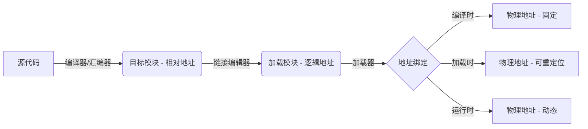
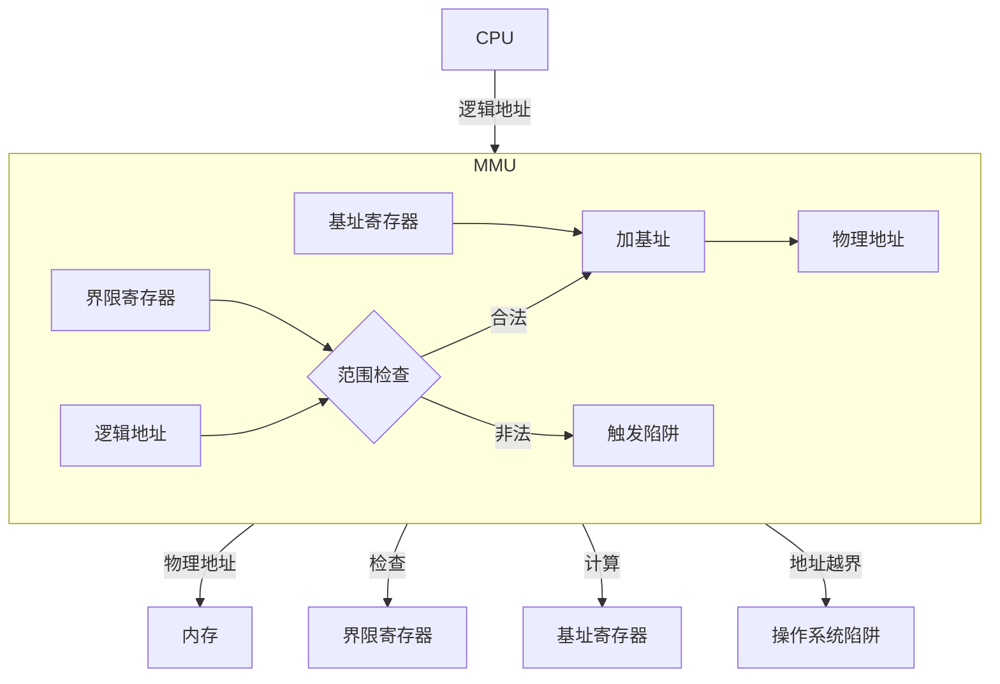
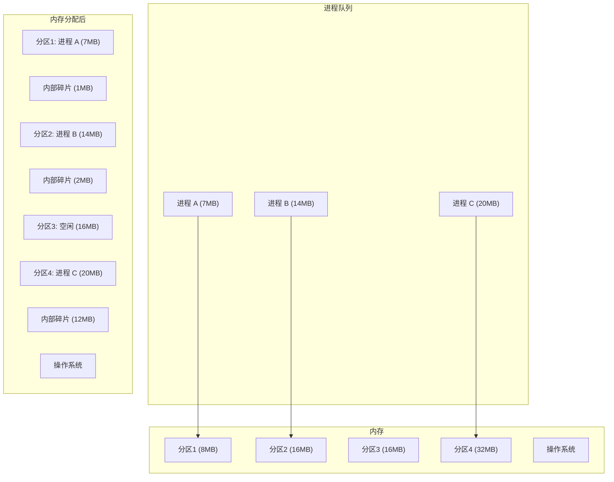
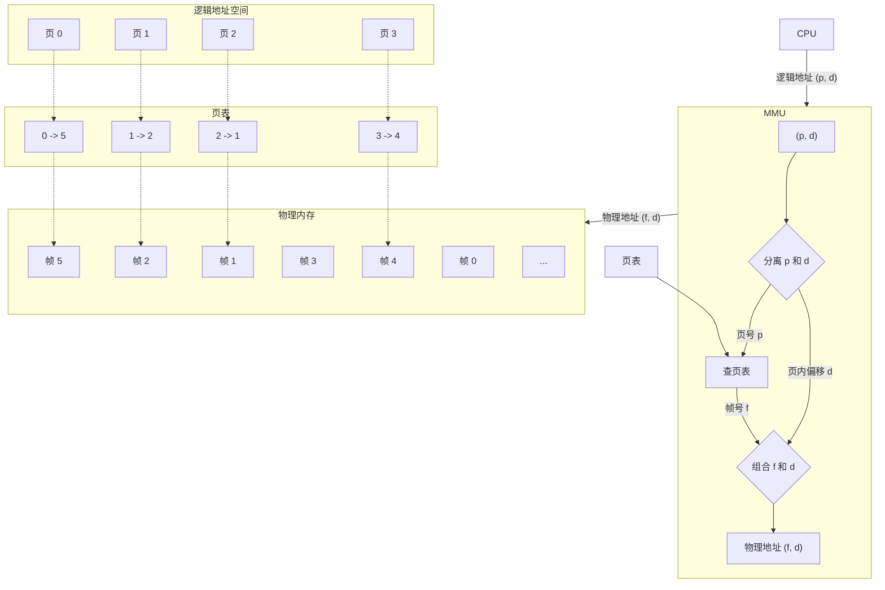
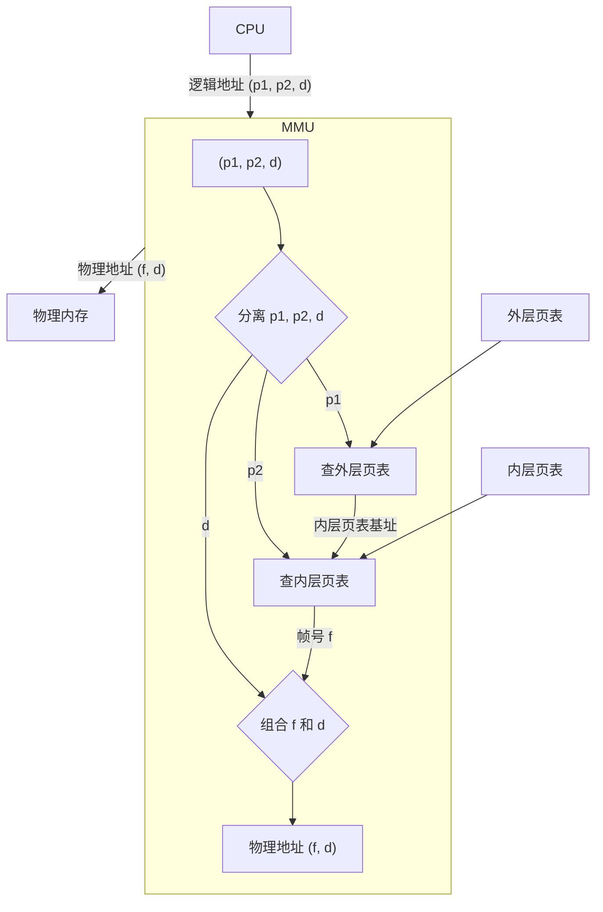
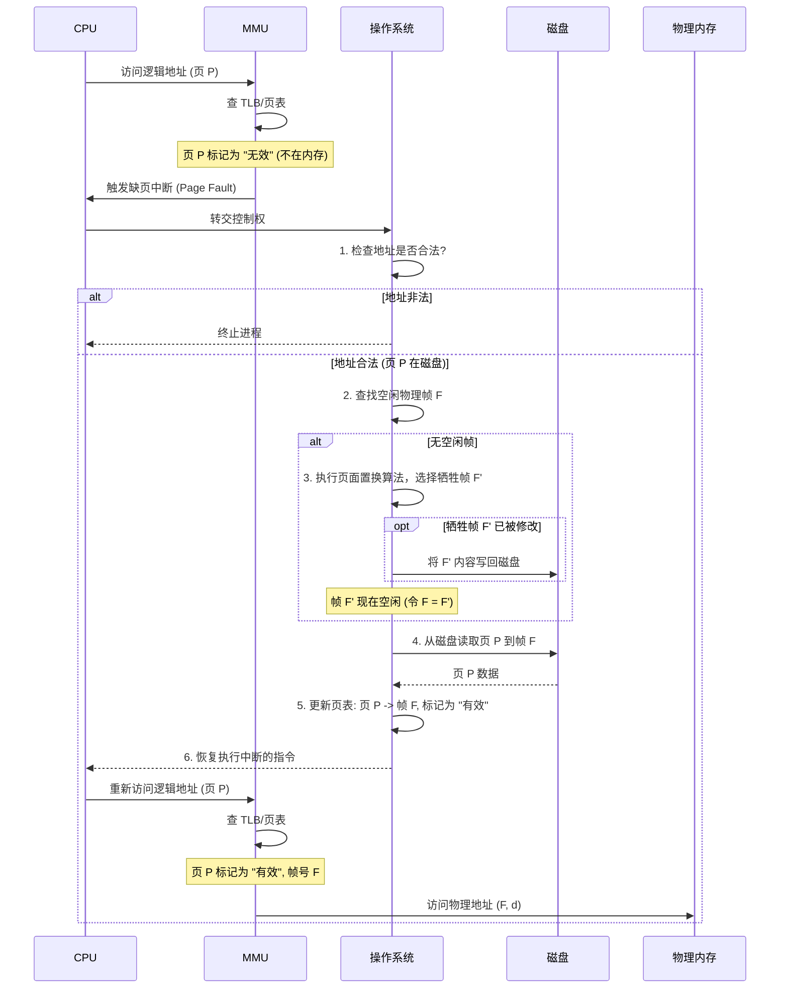
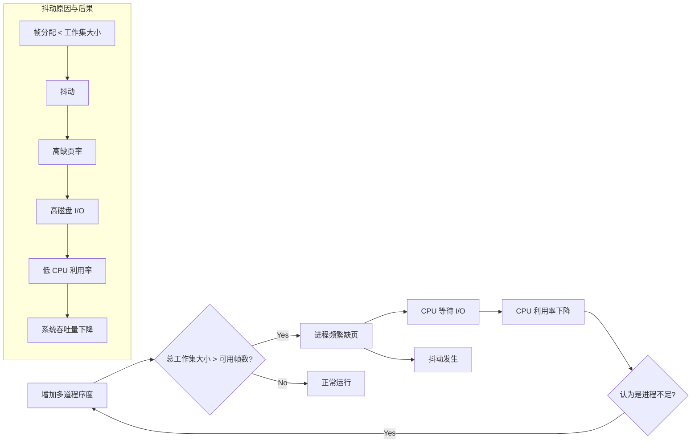
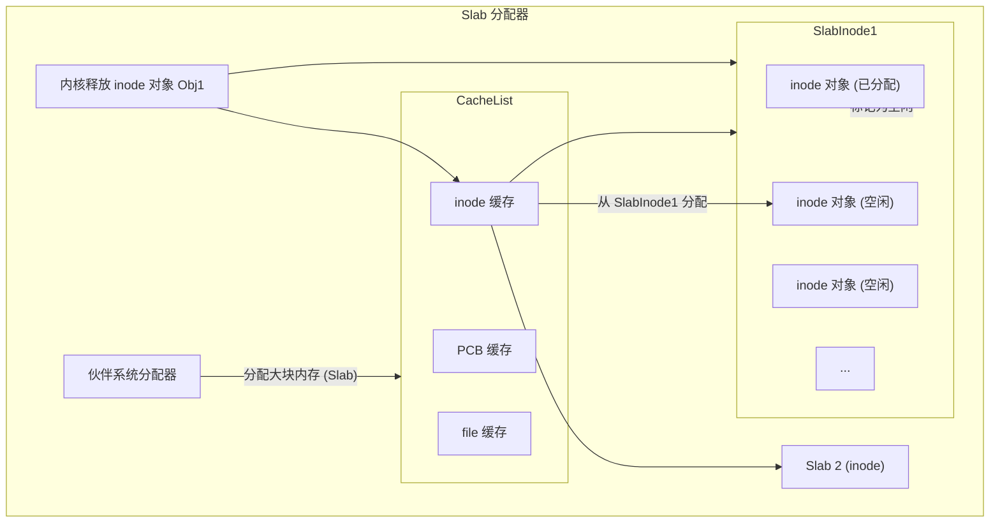

# 第四章：内存管理

内存是计算机系统中一种宝贵且必不可少的资源。CPU 能够直接访问的存储只有主存（通常指 DRAM）和 CPU 内部的寄存器、高速缓存。程序必须先装入内存才能被 CPU 执行。操作系统的一个核心职责就是有效地管理内存资源，为多个并发执行的进程分配空间，并提供保护机制。

本章将详细探讨内存管理的各种策略和技术，从基础概念到复杂的虚拟内存机制。

## 4.1 内存管理基础

内存是计算机系统的核心资源之一，用于存储正在执行的程序指令和数据。内存管理是操作系统的核心功能，负责有效地分配和管理内存资源，以允许多个进程安全、高效地共享内存。

### 4.1.1 地址空间与地址绑定

*   **地址空间 (Address Space)**: 操作系统为每个进程分配一个独立的地址空间。这是一个进程可用的内存地址集合。地址空间通常从 0 开始，最大可达某个上限。
*   **地址绑定 (Address Binding)**: 将程序指令和数据从某种地址形式（如源代码中的符号地址、编译后的相对地址）映射到最终的物理内存地址的过程。地址绑定可以在不同阶段进行：
    *   **编译时绑定**: 如果编译时就知道进程将在内存中的哪个位置，编译器可以直接生成绝对代码。如果起始地址改变，需要重新编译。
    *   **加载时绑定**: 如果编译时不知道进程的驻留位置，编译器会生成可重定位代码。加载程序在将程序加载到内存时，将逻辑地址转换为物理地址。
    *   **运行时绑定**: 大多数现代操作系统采用此方式。如果进程在执行期间可以在内存中移动，则需要运行时绑定。绑定过程延迟到运行时才进行。这需要硬件支持，例如基址寄存器和界限寄存器或内存管理单元 (MMU)。



### 4.1.2 逻辑地址与物理地址

*   **逻辑地址 (Logical Address)**: 由 CPU 生成的地址，也称为虚拟地址。它是进程地址空间中的地址。程序员和编译器通常处理逻辑地址。
*   **物理地址 (Physical Address)**: 内存硬件实际使用的地址，指向物理内存单元（如内存芯片上的某个存储位置）。
逻辑地址空间和物理地址空间可能不同。运行时绑定方案中，逻辑地址和物理地址在运行时才进行转换。

### 4.1.3 内存管理单元 (MMU)

内存管理单元 (Memory Management Unit, MMU) 是一个硬件设备，负责将 CPU 发出的逻辑地址实时转换为物理地址。
MMU 的基本工作方式（以简单的基址/界限寄存器为例）：
1.  CPU 生成一个逻辑地址。
2.  MMU 检查该逻辑地址是否在进程的合法范围内（例如，使用界限寄存器）。如果地址非法，MMU 会触发一个陷阱（trap）给操作系统（地址越界错误）。
3.  如果地址合法，MMU 将逻辑地址加上一个基址寄存器的值（该寄存器存储了进程在物理内存中的起始地址），得到最终的物理地址。
4.  MMU 将物理地址发送到内存总线上。


现代 MMU 通常使用更复杂的技术，如分页或分段，来实现更灵活和高效的内存管理。

### 4.1.4 动态加载与动态链接

*   **动态加载 (Dynamic Loading)**: 为了更好地利用内存空间，一个程序模块（如函数或库）只有在被调用时才会被加载到内存中。这可以加快程序启动速度，并节省内存，因为不是所有模块都会被执行。
*   **动态链接 (Dynamic Linking)**: 与动态加载类似，但链接过程被推迟到运行时。程序在编译链接时，并不将库代码完全复制到可执行文件中，而只是包含库函数的存根 (stub)。当程序第一次调用库函数时，存根代码会检查该库是否已加载到内存。如果未加载，系统会加载该库；然后，存根代码会替换为库函数的实际地址，并执行该函数。后续调用将直接跳转到库函数。使用动态链接库 (DLLs 或 Shared Objects) 可以节省磁盘空间和内存，因为多个进程可以共享同一个库的副本。

## 4.2 连续内存分配

在早期的操作系统或简单的系统中，内存被划分为若干连续的部分，每个进程占用其中一个连续的内存区域。

### 4.2.1 固定分区分配 (Fixed Partition Allocation)

将内存预先划分为若干个**大小固定**的分区。每个分区只能容纳一个进程。当进程到达时，系统将其分配到一个大小足够容纳它的空闲分区。
*   **优点**: 实现简单，开销小。
*   **缺点**:
    *   **分区大小固定**: 大进程可能无法装入任何分区；小进程装入大分区会造成**内部碎片 (Internal Fragmentation)**（分区内未使用的空间）。
    *   **限制了进程数量**: 分区数量固定，限制了同时运行的进程数。



### 4.2.2 可变分区分配 (Variable Partition Allocation)

内存被视为一个大的可用块（空闲区）。当进程需要内存时，操作系统从空闲区中查找一个足够大的连续块分配给它。进程结束时，其占用的内存块被释放并归还到空闲区。
*   **优点**: 更加灵活，减少了内部碎片。
*   **缺点**: 随着进程的加载和释放，内存中会散布许多不连续的小空闲块，导致**外部碎片 (External Fragmentation)**（总空闲空间足够，但没有单个连续的空闲块能满足新进程的需求）。

**空闲块分配策略**: 当需要为进程分配内存时，如何在多个可用的空闲块中选择？
*   **首次适应 (First-Fit)**: 从头开始查找，选择第一个足够大的空闲块。速度快。
*   **最佳适应 (Best-Fit)**: 查找所有空闲块，选择大小与需求最接近（最小且足够大）的空闲块。试图保留大的空闲块，但可能产生许多难以利用的极小碎片。
*   **最差适应 (Worst-Fit)**: 查找所有空闲块，选择最大的空闲块。试图避免产生小碎片，但可能导致大的空闲块迅速耗尽。

模拟表明，首次适应和最佳适应在时间和空间利用率方面通常优于最差适应。首次适应通常更快。

### 4.2.3 内存碎片问题

*   **内部碎片 (Internal Fragmentation)**: 分配给进程的内存块大于进程实际需要的空间，导致块**内部**产生未使用的空间。固定分区和分页（最后一页）会产生内部碎片。
*   **外部碎片 (External Fragmentation)**: 内存中存在足够的总空闲空间，但它们不连续，分散成许多小块，无法满足较大进程的内存请求。可变分区和分段可能产生外部碎片。

**衡量碎片**: 50% 规则 - 一种经验观察，如果采用首次适应策略，经过一段时间后，丢失的内存（由于碎片）大约是已分配内存的一半，即大约 \( \frac{1}{3} \) 的内存可能因为碎片而无法使用。

### 4.2.4 碎片整理 (Compaction)

解决外部碎片的一种方法是**碎片整理**或**内存紧缩**。通过移动内存中的进程，将所有空闲块合并成一个大的连续空闲块。
*   **实现**: 需要所有进程的地址都是动态重定位的（运行时绑定）。成本高昂，因为需要移动大量数据，并且在整理期间系统性能会下降甚至暂停服务。通常只在必要时（如无法满足内存请求时）才执行。

## 4.3 分页 (Paging)

分页是一种非连续内存分配技术，它允许进程的物理地址空间是非连续的。它克服了连续分配的主要问题（外部碎片），并成为现代操作系统中最常用的内存管理方案之一。

### 4.3.1 基本分页原理

*   **物理内存**: 被划分为固定大小的块，称为**帧 (Frame)** 或**页框**。帧的大小是硬件的幂，通常为 4KB、8KB 或更大。
*   **逻辑内存 (进程地址空间)**: 也被划分为相同大小的块，称为**页 (Page)** 或**页面**。
*   **映射**: 当进程需要执行时，它的页被加载到内存中任何可用的帧中。操作系统维护一个**页表 (Page Table)**，记录每个页到物理帧的映射关系。

**地址转换过程**:
1.  CPU 生成一个逻辑地址，分为两部分：**页号 (Page Number, p)** 和**页内偏移 (Page Offset, d)**。页号作为页表的索引。
2.  MMU 使用页号 `p` 查找页表，找到对应的**帧号 (Frame Number, f)**。
3.  MMU 将帧号 `f` 与页内偏移 `d` 组合起来，形成最终的**物理地址**。

**公式**:
逻辑地址 = (页号 p, 页内偏移 d)
物理地址 = (帧号 f, 页内偏移 d) = (页表\[p], d)

其中，如果逻辑地址空间大小为 \(2^m\)，页面大小为 \(2^n\)，则：
*   页号 `p` 占 \(m-n\) 位。
*   页内偏移 `d` 占 \(n\) 位。



**优点**:
*   消除了外部碎片。
*   允许共享代码页（例如，多个进程可以共享 C 库的只读代码页）。
*   实现虚拟内存的基础。

**缺点**:
*   可能产生内部碎片（在最后一个页）。
*   页表本身需要占用内存空间。
*   地址转换需要额外的内存访问（访问页表），可能降低访存速度。

### 4.3.2 页表结构

页表存储了逻辑页到物理帧的映射。对于地址空间非常大的现代系统（如 64 位系统），简单的线性页表会变得异常庞大，占用大量内存。例如，一个 64 位地址空间、4KB 页面的系统，理论上需要 \(2^{64} / 2^{12} = 2^{52}\) 个页表项。如果每个页表项 8 字节，则页表大小为 \(2^{52} \times 8 = 32\) PB！这是不现实的。因此，需要更有效的页表结构。

#### 4.3.2.1 层次页表 (Hierarchical Paging)

将逻辑地址空间划分为多个层次的页表。最常见的是两级页表。
*   **逻辑地址结构**: (外层页号 p1, 内层页号 p2, 页内偏移 d)
*   **地址转换**:
    1.  使用 `p1` 索引外层页表（Page Directory），找到内层页表的基地址。
    2.  使用 `p2` 索引内层页表（Page Table），找到目标物理帧号 `f`。
    3.  组合 `f` 和 `d` 得到物理地址。


*   **优点**: 只有被使用的内层页表才需要分配内存，大大节省了页表占用的空间。对于稀疏使用的地址空间非常有效。
*   **缺点**: 每次地址转换需要多次内存访问（两级页表需要两次，三级需要三次...），增加了访存开销。

对于 64 位系统，两级页表可能仍然不够，可能需要三级、四级甚至更多级页表。

#### 4.3.2.2 哈希页表 (Hashed Page Tables)

处理大于 32 位的地址空间常用此方法。
*   将虚拟页号进行哈希计算，得到一个值。
*   该值作为索引在一个哈希表（Hash Table）中查找。哈希表的每个桶（bucket）包含一个链表，存储了所有哈希到该桶的页表项。
*   页表项包含：虚拟页号、映射的物理帧号、指向链表下一个元素的指针。
*   地址转换时，计算虚拟页号的哈希值，然后在对应桶的链表中搜索匹配的虚拟页号，找到对应的物理帧号。

```mermaid
graph TD
    subgraph "逻辑地址 (p, d)"
        direction LR
        VirtPageNum["虚拟页号 p"]
        Offset["偏移 d"]
    end

    VirtPageNum --> HashFunc[哈希函数];
    HashFunc -- 哈希值 --> HashTable[哈希表];

    subgraph HashTable
        Bucket0["桶 0"]
        Bucket1["桶 1"]
        BucketN["..."]
    end

    Bucket1 --> Element1["(p1, f1, next)"];
    Element1 --> Element2["(p_k, f_k, next)"];
    Element2 --> Null1["NULL"];

    HashTable -- 搜索链表 --> MatchedElement["匹配的页表项 (p, f, next)"];
    MatchedElement -- 帧号 f --> Combine{组合 (f, d)};
    Offset --> Combine;
    Combine --> PhysicalAddr["物理地址 (f, d)"];
```
*   **变种**: 簇哈希页表 (Clustered Hashed Page Tables)，每个桶存储多个页表项，适用于稀疏地址空间。

#### 4.3.2.3 反向页表 (Inverted Page Tables)

传统页表是每个进程一个，页表大小与进程逻辑地址空间大小相关。反向页表是系统中**只有一个**页表，页表大小与物理内存大小相关。
*   页表的每一项（索引是物理帧号）存储了占用该帧的进程 ID 和逻辑页号。
*   地址转换时，给定逻辑地址 (进程ID, 页号 p, 偏移 d)，需要在整个反向页表中搜索匹配的 (进程ID, p) 项。
*   为了加速搜索，通常会结合哈希表使用。

```mermaid
graph TD
    CPU -- "逻辑地址 (pid, p, d)" --> MMU;

    subgraph MMU
        CombinePIDP["组合 (pid, p)"] --> HashFunc[哈希函数];
        HashFunc -- 哈希值 --> HashAnchorTable[哈希锚点表];
        HashAnchorTable -- 指针 --> InvertedPageTable[反向页表];
        InvertedPageTable -- "搜索 (pid, p)" --> FoundEntry{"找到匹配项?"};
        FoundEntry -- Yes --> FrameNum["帧号 f (即索引)"];
        FoundEntry -- No --> PageFault[页错误];
        FrameNum --> CombineFD{组合 (f, d)};
        InputOffset["偏移 d"] --> CombineFD;
        CombineFD --> Output["物理地址 (f, d)"];
    end

    MMU -- "物理地址 (f, d)" --> 物理内存;
    CPU -- "进程ID pid" --> CombinePIDP;
    InputP["页号 p"] --> CombinePIDP;

    subgraph 反向页表 (按帧号索引)
        direction LR
        Frame0["帧 0: (pid_a, p_x)"]
        Frame1["帧 1: (pid_b, p_y)"]
        FrameF["帧 f: (pid, p)"]
        FrameN["..."]
    end

```
*   **优点**: 页表大小固定，与物理内存大小成正比，大大减少了页表内存开销。
*   **缺点**: 地址转换时的搜索过程更复杂，开销更大。共享页面实现困难。

### 4.3.3 转换检测缓冲区 (TLB)

为了解决页表查找（尤其是多级页表）带来的额外内存访问开销问题，引入了 **转换检测缓冲区 (Translation Lookaside Buffer, TLB)**。
*   TLB 是一个**高速的、小型的、硬件实现的关联内存 (associative memory)**，可以并行搜索。
*   它缓存了近期使用过的页表项（页号到帧号的映射）。
*   **工作流程**:
    1.  CPU 生成逻辑地址 (p, d)。
    2.  MMU 首先在 TLB 中查找页号 `p`。
    3.  **TLB 命中 (Hit)**: 如果找到 `p`，直接从 TLB 获取对应的帧号 `f`，计算物理地址 (f, d)。速度非常快。
    4.  **TLB 未命中 (Miss)**: 如果 TLB 中没有 `p`：
        a.  MMU 需要访问内存中的页表（可能多次，取决于页表结构）找到帧号 `f`。
        b.  将找到的 (p, f) 映射关系存入 TLB（可能替换掉一个旧的条目）。
        c.  使用 `f` 计算物理地址 (f, d)。

```mermaid
graph TD
    CPU -- "逻辑地址 (p, d)" --> MMU;

    subgraph MMU
        Input["(p, d)"] --> Extract{分离 p 和 d};
        Extract -- 页号 p --> TLBLookup{在 TLB 中查找 p?};
        TLBLookup -- 命中 (Hit) --> TLBEntry["获取帧号 f (来自 TLB)"];
        TLBLookup -- 未命中 (Miss) --> PageTableLookup[访问内存页表];
        PageTableLookup -->|找到 p->f| FrameNum;
        FrameNum --> CombineFD{组合 (f, d)};
        Extract -- 页内偏移 d --> CombineFD;
        CombineFD --> Output["物理地址 (f, d)"];
    end

    MMU -- "物理地址 (f, d)" --> 物理内存;
    TLB[TLB 硬件缓存] --> TLBLookup;
    PageTable[内存中的页表] --> PageTableLookup;
```
*   TLB 的命中率非常关键。如果 TLB 命中率高（例如 99%），则平均访存时间接近于一次内存访问时间 + TLB 查找时间。如果命中率低，则性能会急剧下降。
*   TLB 的管理：TLB 条目何时失效？（例如，页表项被修改、进程上下文切换时）。需要硬件或操作系统来处理 TLB 的一致性。上下文切换时，通常需要**刷新 (flush)** TLB（清空全部或部分条目）。

### 4.3.4 内存保护

内存保护确保一个进程不能访问不属于它的内存空间。分页机制天然支持内存保护：
*   **页表项中的保护位**: 页表的每个条目除了包含帧号外，通常还包含一些控制位，如：
    *   **有效/无效位 (Valid/Invalid Bit)**: 标记该页是否在进程的逻辑地址空间内（有效），或者是否已加载到物理内存中（在虚拟内存中使用）。访问无效页会触发陷阱（页错误）。
    *   **读/写/执行位 (Read/Write/Execute Bit)**: 控制对该页的访问权限。例如，代码页可以设为只读和可执行，数据页可以设为可读写。试图进行非法操作（如写入只读页）会触发陷阱。
*   **地址空间隔离**: 由于每个进程有自己的页表（或通过反向页表中的 PID 区分），MMU 在转换地址时自动将进程限制在分配给它的物理帧内。

### 4.3.5 分页的优缺点

**优点**:
*   **消除外部碎片**: 物理内存以帧为单位分配，逻辑上连续的页可以映射到物理上不连续的帧。
*   **允许共享**: 多个进程的页表项可以指向同一个物理帧（例如共享库代码），节省内存。
*   **支持虚拟内存**: 是实现虚拟内存的关键技术。
*   **良好的内存利用率**: 相比固定分区，内部碎片仅限于最后一页。

**缺点**:
*   **内部碎片**: 平均而言，每个进程会浪费半个页面的内部碎片。
*   **页表开销**: 页表本身需要占用内存空间，对于大地址空间可能非常可观（尽管有层次页表等优化）。
*   **地址转换开销**: 每次访存都需要查找页表（即使有 TLB 缓存，TLB Miss 仍有开销）。
*   **不直观**: 页面的划分对程序员不透明，不像分段那样符合程序的逻辑结构。

## 4.4 分段 (Segmentation)

分段是另一种内存管理方案，它更符合用户或程序员看待程序的方式。程序通常由多个逻辑意义上独立的段组成，如代码段、数据段、堆栈段等。

### 4.4.1 基本分段原理

*   **逻辑地址**: 由一个二元组构成：**(段号 s, 段内偏移 d)**。
*   **段表 (Segment Table)**: 每个进程有一个段表。段表的每个条目对应一个段，包含：
    *   **段基址 (Base)**: 该段在物理内存中的起始地址。
    *   **段界限 (Limit)**: 该段的长度。
*   **地址转换**:
    1.  CPU 生成逻辑地址 (s, d)。
    2.  MMU 使用段号 `s` 索引段表，找到对应条目。
    3.  MMU 检查段内偏移 `d` 是否在合法范围内：`0 <= d < Limit`。如果 `d >= Limit`，则触发陷阱（地址越界）。
    4.  如果合法，物理地址 = 段基址 Base + 段内偏移 d。

```mermaid
graph TD
    CPU -- "逻辑地址 (s, d)" --> MMU;

    subgraph MMU
        direction LR
        Input["(s, d)"] --> Extract{分离 s 和 d};
        Extract -- 段号 s --> SegmentTableLookup[查段表];
        SegmentTableLookup -- 获取 Base 和 Limit --> Check{检查 d < Limit?};
        Extract -- 段内偏移 d --> Check;
        Check -- 合法 (Yes) --> Add[计算 Base + d];
        Check -- 非法 (No) --> Trap[触发陷阱];
        Add --> Output["物理地址"];
    end

    MMU -- 物理地址 --> 物理内存;
    SegmentTable[段表] --> SegmentTableLookup;

    subgraph 逻辑地址空间 (分段)
        CodeSegment["代码段 (段 0)"]
        DataSegment["数据段 (段 1)"]
        StackSegment["堆栈段 (段 2)"]
        ...
    end

    subgraph 物理内存 (非连续)
        Free1["空闲"]
        Seg0["段 0 映射区"]
        Free2["空闲"]
        Seg2["段 2 映射区"]
        Seg1["段 1 映射区"]
        Free3["空闲"]
        ...
    end

    subgraph 段表
        Entry0["0 -> (Base0, Limit0)"]
        Entry1["1 -> (Base1, Limit1)"]
        Entry2["2 -> (Base2, Limit2)"]
        ...
    end

    CodeSegment -.-> Entry0;
    DataSegment -.-> Entry1;
    StackSegment -.-> Entry2;

    Entry0 -.-> Seg0;
    Entry1 -.-> Seg1;
    Entry2 -.-> Seg2;
```

### 4.4.2 段表

段表存储了进程所有段的基址和界限信息。与页表类似，段表也需要存储在内存中。通常使用**段表基址寄存器 (STBR)** 指向当前进程段表在内存中的位置，**段表长度寄存器 (STLR)** 限制段号的范围。

**段表项**除了基址和界限，也可能包含保护位（读/写/执行权限）和有效位等。

### 4.4.3 分段的优缺点

**优点**:
*   **符合逻辑**: 段的划分匹配程序的自然结构（代码、数据、堆栈），便于程序员理解和组织。
*   **易于共享**: 可以方便地共享整个段（例如，共享代码段）。只需在不同进程的段表中让对应表项指向同一个物理内存区域即可。
*   **易于保护**: 可以对不同类型的段（代码、数据）设置不同的保护权限。
*   **动态增长**: 段的大小可以根据需要动态改变（例如堆栈段）。

**缺点**:
*   **外部碎片**: 由于段的大小可变且不同，连续分配和释放段会导致物理内存产生外部碎片。这是分段的主要缺点。
*   **内存管理复杂**: 分配算法（首次适应、最佳适应等）和碎片整理需求使得内存管理比分页更复杂。
*   **段大小限制**: 段的最大长度受段表项中界限字段的位数限制。

### 4.4.4 分页与分段的结合 (段页式管理)

为了结合分页（消除外部碎片、内存利用率高）和分段（符合逻辑、易于共享和保护）的优点，一些系统采用了**段页式管理 (Segmented Paging)**。Intel x86 架构就是一个典型例子（尽管在 64 位模式下分段的作用被大大削弱）。

*   **逻辑地址**: (段号 s, 页号 p, 页内偏移 d)
*   **地址转换**:
    1.  使用段号 `s` 查找段表，得到该段对应的**页表的基址**和长度。
    2.  使用页号 `p` 索引该段的页表，找到对应的物理**帧号 f**。
    3.  组合帧号 `f` 和页内偏移 `d` 得到最终物理地址。

```mermaid
graph TD
    CPU -- "逻辑地址 (s, p, d)" --> MMU;

    subgraph MMU
        Input["(s, p, d)"] --> ExtractSPD{分离 s, p, d};
        ExtractSPD -- 段号 s --> SegmentLookup[查段表];
        SegmentLookup -- 页表基址 --> PageLookup[查该段的页表];
        ExtractSPD -- 页号 p --> PageLookup;
        PageLookup -- 帧号 f --> CombineFD{组合 (f, d)};
        ExtractSPD -- 页内偏移 d --> CombineFD;
        CombineFD --> Output["物理地址 (f, d)"];
    end

    MMU -- 物理地址 --> 物理内存;
    SegmentTable[段表] --> SegmentLookup;
    PageTables[各段的页表] --> PageLookup;
```
*   **优点**: 结合了分段和分页的优点。段提供逻辑分组和保护，页消除外部碎片。
*   **缺点**: 地址转换开销更大（需要访问段表和页表），管理更复杂，段表和页表都需要占用内存。

**表格：分页 vs. 分段 vs. 段页式**

| 特性           | 分页 (Paging)                     | 分段 (Segmentation)               | 段页式 (Segmented Paging)         |
| -------------- | --------------------------------- | --------------------------------- | --------------------------------- |
| **用户视角**   | 透明 (地址空间是连续的线性空间)     | 不透明 (地址空间是段的集合)       | 不透明 (地址空间是段的集合)       |
| **地址**       | (页号, 页内偏移)                  | (段号, 段内偏移)                  | (段号, 页号, 页内偏移)          |
| **基本单位**   | 页 (固定大小)                     | 段 (可变大小, 逻辑单位)           | 页 (固定大小)                     |
| **外部碎片**   | 无                                | 有                                | 无                                |
| **内部碎片**   | 有 (最后一页)                     | 无 (理论上)                       | 有 (段内最后一页)                 |
| **共享**       | 页级共享 (较复杂)                 | 段级共享 (方便)                   | 段级/页级共享 (灵活但复杂)      |
| **保护**       | 页级保护                          | 段级保护 (更符合逻辑)             | 段级/页级保护 (更灵活)          |
| **实现复杂度** | 相对简单                          | 较复杂 (分配/回收/碎片整理)       | 非常复杂                          |
| **地址转换开销**| 访问页表 (+TLB)                   | 访问段表 (+TLB)                   | 访问段表 + 页表 (+TLB)          |

## 4.5 虚拟内存 (Virtual Memory)

虚拟内存是一种允许进程在执行时无需将其所有部分都加载到物理内存中的技术。它极大地扩展了可用内存的概念，使得程序可以拥有比物理内存大得多的逻辑地址空间。

### 4.5.1 虚拟内存的概念与优势

*   **概念**: 将用户逻辑内存与物理内存分离。逻辑地址空间可以远大于物理内存。程序的部分内容可以存储在磁盘上（如交换空间或内存映射文件），仅在需要时才加载到物理内存中。
*   **优势**:
    *   **更大的地址空间**: 程序不再受物理内存大小的限制。
    *   **更高的并发度**: 更多进程可以同时在内存中部分驻留并运行。
    *   **更快的进程创建**: 加载进程的部分内容即可开始执行，剩余部分按需加载。
    *   **内存共享**: 不同进程可以共享物理内存中的相同页面（如共享库）。
    *   **简化的内存管理**: 程序员可以假设拥有一个巨大的、连续的地址空间。

虚拟内存通常基于**分页**或**段页式**系统实现。

### 4.5.2 请求调页 (Demand Paging)

这是实现虚拟内存最常用的方法。
*   **基本思想**: 只有在进程实际需要访问某个页面时，才将其从磁盘加载到物理内存（一个空闲帧）中。这种"懒加载"策略避免了加载永远不会使用的页面。
*   **实现机制**:
    *   **页表扩展**: 页表项中增加一个**有效/无效位 (Valid/Invalid Bit)** 或称为**存在位 (Present Bit)**。
        *   **有效 (Valid/Present)**: 表示该页在逻辑地址空间中，并且**当前在物理内存中**。页表项包含有效的帧号。
        *   **无效 (Invalid/Absent)**: 表示该页或者不在进程逻辑地址空间内，或者在逻辑空间内但**当前不在物理内存中**（可能在磁盘上）。
    *   **缺页中断 (Page Fault)**: 当进程访问一个标记为"无效"的页面时，MMU 会检测到这种情况并触发一个**缺页中断 (Page Fault)** 陷阱，将控制权交给操作系统。
*   **缺页中断处理流程**:
    1.  **检查地址合法性**: 操作系统检查引起中断的逻辑地址是否在进程的合法地址空间内。如果非法，则终止进程。
    2.  **查找空闲帧**: 操作系统在物理内存中查找一个空闲的物理帧。
    3.  **如果没有空闲帧**: 需要执行**页面置换算法**（见 4.5.4），选择一个"牺牲"帧，将其内容写回磁盘（如果被修改过），然后将该帧标记为空闲。
    4.  **页面调入**: 从磁盘（如交换区或文件）读取所需的页面到找到的空闲帧中。这是一个耗时的 I/O 操作。
    5.  **更新页表**: 修改页表项，将该页标记为"有效"，并填入分配的帧号。
    6.  **恢复执行**: 回到触发中断的指令处，重新执行该指令。此时地址转换可以成功完成。



### 4.5.3 写时复制 (Copy-on-Write, COW)

一种优化技术，常用于进程创建（如 `fork()` 系统调用）和共享内存。
*   **基本思想**: 当一个进程（父进程）创建一个新进程（子进程）时，不立即复制父进程的整个地址空间。而是让父、子进程共享相同的物理页面，并将这些共享页面标记为**只读**。
*   **写操作处理**: 只有当父进程或子进程**试图写入**某个共享页面时，才会触发一个保护性陷阱（类似缺页中断）。操作系统此时才真正复制该页面，为进行写操作的进程分配一个新的物理帧，并将修改后的页面内容放入新帧。然后更新该进程的页表项指向新帧，并将新旧两个页面都标记为可写。
*   **优点**:
    *   显著加快进程创建速度，因为避免了大量不必要的页面复制（很多时候子进程会立即执行 `exec()` 加载新程序，之前的复制就浪费了）。
    *   节省内存，只有被写入的页面才需要复制。

```mermaid
graph TD
    subgraph "fork() 之前"
        P["父进程"]
        PageTableP["父进程页表"]
        PhysicalPage["物理页面 A"]
        P -- "页 X -> A" --> PageTableP;
        PageTableP --> PhysicalPage;
    end

    subgraph "fork() 之后 (COW)"
        P_after["父进程"]
        C["子进程"]
        PageTableP_after["父进程页表"]
        PageTableC["子进程页表"]
        PhysicalPage_shared["物理页面 A (只读)"]

        P_after -- "页 X -> A (只读)" --> PageTableP_after;
        C -- "页 X -> A (只读)" --> PageTableC;
        PageTableP_after --> PhysicalPage_shared;
        PageTableC --> PhysicalPage_shared;
    end

    subgraph "子进程写入页 X"
        P_write["父进程"]
        C_write["子进程"]
        PageTableP_write["父进程页表"]
        PageTableC_write["子进程页表"]
        PhysicalPage_orig["物理页面 A (父, 可写)"]
        PhysicalPage_copy["物理页面 A' (子, 可写)"]

        Note over C_write: 子进程写页 X -> 保护陷阱
        Note over C_write: OS 复制页面 A -> A'
        P_write -- "页 X -> A (可写)" --> PageTableP_write;
        C_write -- "页 X -> A' (可写)" --> PageTableC_write;
        PageTableP_write --> PhysicalPage_orig;
        PageTableC_write --> PhysicalPage_copy;
    end
```

### 4.5.4 页面置换算法 (Page Replacement Algorithms)

当发生缺页中断且没有空闲物理帧时，操作系统必须选择一个当前在内存中的页面（牺牲页）将其换出到磁盘，以便腾出帧来加载所需的页面。页面置换算法的目标是选择一个**未来最不可能被访问**的页面进行置换，以最小化缺页中断率。

#### 4.5.4.1 先进先出 (FIFO) 算法

*   **思想**: 选择**最早进入**内存的页面进行置换。实现简单，使用一个队列记录页面加载顺序。
*   **缺点**: 可能置换掉经常使用的页面。存在 **Belady 异常**: 对于某些访问序列，增加分配的物理帧数反而可能导致缺页中断次数增加。

#### 4.5.4.2 最优 (OPT / MIN) 算法

*   **思想**: 选择**未来最长时间内不会被访问**的页面进行置换。
*   **优点**: 缺页中断率最低，是理论上最优的算法。
*   **缺点**: **无法实现**，因为操作系统无法预知未来程序对页面的访问情况。主要用作衡量其他算法性能的基准。

#### 4.5.4.3 最近最少使用 (LRU) 算法

*   **思想**: 选择**过去最长时间没有被访问**的页面进行置换。基于"局部性原理"的假设：过去最少使用的页面，在未来也可能最少使用。
*   **优点**: 性能接近 OPT，且没有 Belady 异常。
*   **缺点**: 实现开销大。需要记录每个页面的访问时间或维护一个按访问时间排序的列表/栈。
    *   **计数器实现**: 为每个页表项关联一个时间戳/计数器。每次访问页面时更新其时间戳。置换时查找时间戳最小的页面。开销大（更新、搜索）。
    *   **栈实现**: 维护一个页面栈。页面被访问时，将其移到栈顶。栈底的页面是 LRU 页面。移动操作开销大。

#### 4.5.4.4 LRU 近似算法

由于 LRU 实现开销大，实践中常用其近似算法。这些算法通常利用页表项中的**引用位 (Reference Bit)**。
*   **引用位**: 硬件在页面被访问（读或写）时自动设置该位为 1。操作系统可以周期性地清零引用位。

*   **附加引用位算法 (Additional Reference Bits Algorithm)**:
    *   为每个页面维护一个固定长度（如 8 位）的移位寄存器。
    *   定时器中断周期性地触发：将每个页面的引用位移入其对应寄存器的最高位，并将寄存器内容右移一位。引用位本身清零。
    *   寄存器中的值近似反映了页面的近期使用情况（值越小，表示越久未被使用）。置换时选择值最小的页面。

*   **二次机会算法 (Second-Chance Algorithm) / 时钟算法 (Clock Algorithm)**:
    *   将所有页面组织成一个循环队列（像钟面），有一个指针指向下一个要检查的候选页面。
    *   需要置换时，从指针位置开始检查页面的引用位：
        *   如果引用位为 0：选中该页进行置换。
        *   如果引用位为 1：给该页"第二次机会"，将其引用位清零，指针移动到下一个页面，继续检查。
    *   **增强型二次机会算法**: 同时考虑引用位和**修改位 (Modify Bit / Dirty Bit)**（硬件在页面被写入时设置此位为 1）。优先置换未被修改的页面，因为无需写回磁盘，开销更小。
        *   分类页面：(引用位, 修改位)
            *   (0, 0): 最近未访问，未修改 -> 最佳置换选择
            *   (0, 1): 最近未访问，已修改 -> 次佳选择 (需要写回)
            *   (1, 0): 最近已访问，未修改 -> 再次佳
            *   (1, 1): 最近已访问，已修改 -> **最差替换**
        *   算法会进行多轮扫描，按优先级查找牺牲页。

```mermaid
graph TD
    subgraph 时钟算法 (Clock Algorithm)
        direction LR
        Ptr[指针] --> PageA;
        PageA --> PageB;
        PageB --> PageC;
        PageC --> PageD;
        PageD --> PageA;

        subgraph PageA
            RefA[引用位=1]
        end
        subgraph PageB
            RefB[引用位=0]
        end
        subgraph PageC
            RefC[引用位=1]
        end
        subgraph PageD
            RefD[引用位=0]
        end
    end

    Note over Ptr: 开始检查 PageA
    Note over PageA: RefA=1 -> 清零 RefA, Ptr 指向 PageB
    Note over PageB: RefB=0 -> 选择 PageB 置换
```

#### 4.5.4.5 最不常用 (LFU) 算法

*   **思想**: 选择**过去访问次数最少**的页面进行置换。认为访问次数少的页面可能不再需要。
*   **实现**: 需要为每个页面维护一个访问计数器。
*   **缺点**:
    *   实现开销大（维护计数器）。
    *   可能置换掉刚加载进来但尚未频繁使用的页面。
    *   无法很好地适应程序行为的变化（早期频繁访问但后来不再使用的页面，计数器值很高，难以被置换）。

#### 4.5.4.6 最常使用 (MFU) 算法

*   **思想**: 选择**过去访问次数最多**的页面进行置换。基于的假设是：访问次数最多的页面可能已经使用完毕。
*   **实际应用**: 较少使用，性能通常不如 LRU 或 LFU。

**总结**: LRU 近似算法（尤其是时钟算法及其增强版）是现代操作系统中最常用的页面置换策略，它们在性能和实现开销之间取得了较好的平衡。

### 4.5.5 帧分配策略 (Frame Allocation)

当系统中有多个进程运行时，需要决定为每个进程分配多少物理帧。
*   **最少帧数**: 必须为每个进程分配足够运行其指令的最少帧数（取决于体系结构，例如，一条指令可能需要同时访问指令本身和操作数）。
*   **分配策略**:
    *   **平均分配 (Equal Allocation)**: 将可用帧（除去操作系统占用的）平均分配给 n 个进程，每个进程 \(m/n\) 帧。简单但不公平，未考虑进程大小和优先级。
    *   **比例分配 (Proportional Allocation)**: 根据每个进程的虚拟内存大小（或优先级）按比例分配帧。\(a_i = (s_i / S) \times m\)，其中 \(a_i\) 是进程 \(i\) 分配的帧数，\(s_i\) 是其大小，\(S\) 是所有进程总大小，\(m\) 是总可用帧数。更合理。
*   **全局置换 vs. 局部置换**:
    *   **全局置换 (Global Replacement)**: 当一个进程发生缺页中断需要置换时，它可以从**所有**物理帧中选择一个牺牲帧（即使该帧属于另一个进程）。优点是灵活性高，高优先级进程可以"抢占"低优先级进程的帧。缺点是一个进程的缺页行为会受其他进程影响，难以控制。
    *   **局部置换 (Local Replacement)**: 当一个进程需要置换时，它只能从**分配给它自己的**那些帧中选择牺牲帧。优点是进程的性能更可预测，不受其他进程干扰。缺点是可能导致资源利用不充分（某个进程帧很多但空闲，另一个进程帧很少但频繁缺页）。

现代通用操作系统通常采用全局或半全局的置换策略，结合优先级等因素。

### 4.5.6 抖动 (Thrashing)

*   **定义**: 如果一个进程没有获得足够多的帧来容纳其当前活跃使用的页集合，它会持续地发生缺页中断。每次中断都需要换出一个可能很快又要用到的页面，再换入一个新页面。这导致 CPU 大部分时间都在处理缺页中断和页面调度，而不是执行有效计算，系统吞吐量急剧下降。这种情况称为**抖动**。
*   **原因**: 分配给进程的帧数过少，无法覆盖其**工作集 (Working Set)** 或 **常驻集 (Resident Set)**（即进程在某个时间段内频繁访问的页面集合）。
*   **现象**: CPU 利用率低，磁盘 I/O（用于页面换入换出）非常繁忙，系统响应缓慢。
*   **检测与处理**:
    *   **工作集模型**: 尝试估计每个进程的工作集大小（在时间窗口 \(\Delta\) 内访问的页面集合），并确保分配给进程的帧数不少于其工作集大小。如果总需求超过可用帧数，则需要**暂停**某些进程（降低多道程序度），释放它们的帧给活动进程，以缓解抖动。
    *   **缺页率监控 (Page Fault Frequency, PFF)**: 监控每个进程的缺页率。
        *   如果缺页率过高，说明帧数不足，需要为其分配更多帧。
        *   如果缺页率过低，说明可能分配了过多帧，可以适当回收一些帧。
        *   设置缺页率的上限和下限阈值来动态调整帧分配。



## 4.6 内核内存管理

操作系统内核本身也需要内存来存储其代码、数据结构（如进程控制块、页表、文件描述符等）。内核内存管理与用户进程内存管理有一些不同之处：
*   **连续性要求**: 某些硬件设备（如 DMA 控制器）或内核数据结构可能需要物理上连续的内存块。
*   **大小不一**: 内核请求的内存大小可能很小（如几十字节的数据结构）也可能很大（如缓冲区）。
*   **性能敏感**: 内核内存分配和释放必须非常高效。

常用的内核内存分配机制：
*   **伙伴系统 (Buddy System)**:
    *   将物理内存按 2 的幂次方大小（如 4KB, 8KB, 16KB, ..., 1MB）分成块列表。
    *   当需要分配大小为 S 的块时，查找大小为 \(2^k\) (其中 \(2^{k-1} < S \le 2^k\)) 的最小可用块。
    *   如果找到，直接分配。
    *   如果没找到，查找下一个更大的块 \(2^{k+1}\)，将其分裂成两个大小为 \(2^k\) 的"伙伴"块，一个分配出去，另一个放入 \(2^k\) 的空闲列表。如果 \(2^{k+1}\) 也没有，继续向上查找并分裂。
    *   释放内存时，检查其伙伴块是否也空闲。如果是，则合并成一个更大的块，并尝试与新块的伙伴合并，递归进行。
    *   **优点**: 合并效率高，能较好地处理不同大小的请求。
    *   **缺点**: 存在内部碎片（分配的块大小总是 2 的幂）。

```mermaid
graph TD
    subgraph "伙伴系统: 分配 70KB (需要 128KB 块)"
        FreeList["空闲列表"] -- 查找 128KB --> NotFound1{"找到 128KB?"};
        NotFound1 -- No --> Find256KB["查找 256KB"];
        Find256KB --> NotFound2{"找到 256KB?"};
        NotFound2 -- No --> Find512KB["查找 512KB"];
        Find512KB --> Found512KB["找到 512KB 块 A"];
        Found512KB --> Split512["分裂 A 为 B (256KB) + C (256KB)"];
        Split512 --> UseB["使用 B (256KB)"];
        Split512 --> AddC["C 加入 256KB 空闲列表"];
        UseB --> Split256["分裂 B 为 D (128KB) + E (128KB)"];
        Split256 --> AllocateD["分配 D (128KB)"];
        Split256 --> AddE["E 加入 128KB 空闲列表"];
    end
    subgraph "伙伴系统: 释放 D (128KB)"
        ReleaseD["释放 D (128KB)"] --> FindBuddyE["查找伙伴 E (128KB)"];
        FindBuddyE --> FoundBuddyE{"E 空闲?"};
        FoundBuddyE -- Yes --> MergeDE["合并 D, E 为 B (256KB)"];
        MergeDE --> FindBuddyC["查找伙伴 C (256KB)"];
        FindBuddyC --> FoundBuddyC{"C 空闲?"};
        FoundBuddyC -- Yes --> MergeBC["合并 B, C 为 A (512KB)"];
        MergeBC --> AddA["A 加入 512KB 空闲列表"];
        FoundBuddyE -- No --> AddD["D 加入 128KB 空闲列表"];
        FoundBuddyC -- No --> AddB["B 加入 256KB 空闲列表"];
    end
```



*   **Slab 分配器 (Slab Allocator)**:
    *   针对频繁分配和释放的**特定大小**的内核对象（如 PCB、inode、文件对象等）进行优化。
    *   **基本思想**: 将伙伴系统分配的大块内存（称为 Slab）进一步细分成许多个固定大小的小对象槽位。
    *   维护每种类型对象的**缓存 (Cache)**。每个缓存包含一个或多个 Slab。
    *   分配对象时，直接从对应类型的缓存中的 Slab 里取出一个空闲槽位。
    *   释放对象时，将其归还到原来的 Slab 中。
    *   **优点**:
        *   **消除内部碎片**: Slab 内的对象大小精确匹配。
        *   **速度快**: 分配和释放非常快，因为对象已预先初始化（可选），且无需查找合适大小的块。
        *   **缓存友好**: 相关对象可能在内存中聚集，提高缓存命中率。
    *   **代表**: Linux 内核广泛使用 Slab (或其变种 Slub, Slob) 分配器。



## 4.7 总结

内存管理是操作系统中最基本也是最复杂的功能之一。本章探讨了内存管理的目标、挑战以及各种技术演进：
*   **基础概念**: 逻辑地址与物理地址的分离是核心，MMU 负责地址转换。地址绑定时机决定了灵活性。
*   **连续分配**: 固定分区简单但有内部碎片，可变分区灵活但有外部碎片。碎片整理代价高昂。
*   **分页**: 通过将内存划分为固定大小的页和帧，消除了外部碎片，是现代虚拟内存的基础。但也引入了页表开销和内部碎片。TLB 用于加速地址转换。多级页表、哈希页表、反向页表用于处理大地址空间。
*   **分段**: 将内存按逻辑单元划分，符合程序结构，易于共享和保护，但存在外部碎片。
*   **段页式**: 结合分段和分页优点，但实现复杂，开销更大。
*   **虚拟内存**: 允许进程使用大于物理内存的地址空间，通过请求调页实现。核心在于缺页中断处理和页面置换。
*   **页面置换算法**: FIFO 简单但有 Belady 异常，OPT 最优但无法实现，LRU 性能好但开销大，LRU 近似算法（如时钟算法）是常用折衷方案。
*   **帧分配与抖动**: 合理的帧分配策略和避免抖动（如使用工作集模型或 PFF）对系统性能至关重要。
*   **内核内存管理**: 常用伙伴系统和 Slab 分配器来高效管理内核所需内存。

有效的内存管理策略需要在空间利用率、时间开销、实现复杂度以及对上层应用的支持（如共享、保护）之间做出权衡。现代操作系统大多采用基于分页的虚拟内存技术，并结合 TLB、多级页表/反向页表、LRU 近似置换算法、写时复制以及专门的内核分配器（如 Slab）来提供高效、灵活且健壮的内存管理服务。 