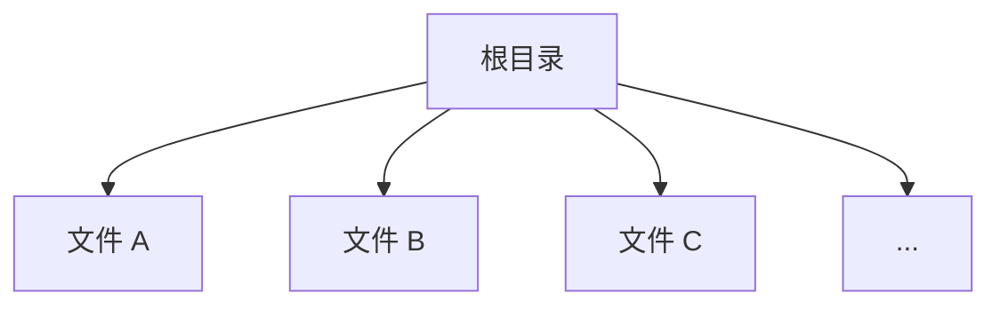
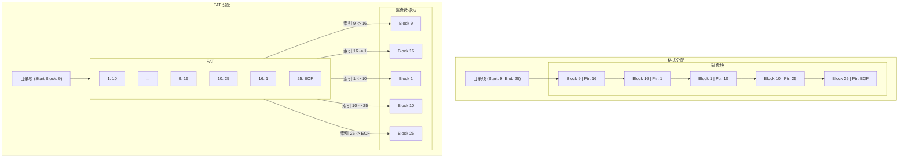

# 第五章：文件系统

文件系统是操作系统中负责管理和组织持久性存储（如硬盘、SSD、U 盘等）上的数据的一种机制。它提供了用户和应用程序创建、读取、写入、删除和查找文件的抽象接口，屏蔽了底层存储设备的复杂性。

## 5.1 文件概念

从用户角度看，文件是逻辑存储单元的最小集合，是存储在二级存储器上的相关信息的命名集合。

### 5.1.1 文件属性

操作系统将文件视为具有特定属性的实体。这些属性（也称为元数据 metadata）包括：

*   **名称 (Name):** 用户可读的文件标识符。
*   **标识符 (Identifier):** 文件系统内部使用的唯一标签（通常是数字），用于唯一标识文件。
*   **类型 (Type):** 用于支持不同类型文件的系统（如图标、关联程序）。
*   **位置 (Location):** 指向文件在存储设备上位置的指针。
*   **大小 (Size):** 文件当前的大小（字节、字或块数）。
*   **保护 (Protection):** 访问控制信息，规定谁可以读、写、执行等。
*   **时间戳 (Timestamps):** 创建时间、最后修改时间、最后访问时间等。
*   **用户标识 (User Identification):** 文件所有者、所属组等。

这些属性通常存储在**目录结构**中，目录结构本身也存储在二级存储器上。

### 5.1.2 文件操作

操作系统提供了一组基本的文件操作（通常通过系统调用实现）：

*   **创建 (Create):** 在文件系统中查找空间，并在目录中为新文件创建条目。
*   **写入 (Write):** 根据文件名和写入位置（写指针），将数据写入文件。
*   **读取 (Read):** 根据文件名和读取位置（读指针），从文件读取数据。
*   **定位 (Seek / Reposition):** 移动文件指针到指定位置，用于随机访问。
*   **删除 (Delete):** 释放文件占用的空间，并从目录中删除条目。
*   **截断 (Truncate):** 保留文件属性，但将文件长度设为 0，释放其空间。
*   **打开 (Open):** 在进行读写操作前，需要打开文件。操作系统将文件的属性和磁盘地址信息从磁盘加载到内存（通常在一个称为**打开文件表**的结构中），并返回一个**文件描述符 (File Descriptor)** 或**文件句柄 (File Handle)** 给进程。后续操作使用该描述符，避免了每次都搜索文件名。
*   **关闭 (Close):** 当进程完成文件操作后，需要关闭文件。操作系统将内存中打开文件表的相关条目移除，释放资源。

### 5.1.3 文件类型

操作系统可以通过文件扩展名（如 `.txt`, `.exe`, `.jpg`）或其他方式识别文件类型。

*   **普通文件 (Regular Files):** 包含用户数据（文本、二进制代码、图像等）。
*   **目录文件 (Directory Files):** 包含文件系统结构信息，维护一组文件及其属性的映射。
*   **字符特殊文件 (Character Special Files):** 与串行 I/O 设备（如终端、打印机）相关联，数据按字符流传输。
*   **块特殊文件 (Block Special Files):** 与块 I/O 设备（如磁盘驱动器）相关联，数据按固定大小的块传输。
*   **其他类型:** 符号链接 (Symbolic Links)、管道 (Pipes)、套接字 (Sockets) 等。

### 5.1.4 文件结构

文件内部的数据如何组织？

*   **无结构 (Sequence of Bytes/Words):** 最常见的方式。操作系统不关心文件内容，将其视为字节流（如 Unix, Windows）。内容的解释由应用程序负责。
*   **简单记录结构 (Simple Record Structure):** 文件是一系列固定长度或可变长度的记录。操作系统提供读/写指定记录的操作。
*   **复杂结构:** 如索引顺序文件、B+ 树结构文件。通常由数据库管理系统实现，操作系统仅提供基础支持。

## 5.2 访问方法

文件存储信息，这些信息必须能被访问和读取。访问方法决定了数据如何从文件中读写。

### 5.2.1 顺序访问 (Sequential Access)

*   **模式:** 文件信息按顺序处理。读操作自动前进文件指针，写操作总是在文件末尾追加或覆盖。
*   **最常用:** 简单直观，适用于编辑器、编译器等大多数应用场景。
*   **示例:** `read next`, `write next`

### 5.2.2 直接访问 (Direct Access) / 随机访问 (Random Access)

*   **模式:** 文件由固定长度的逻辑记录组成，可以快速按任意顺序读写任何记录，无需按顺序访问。
*   **实现:** 文件被视为编号逻辑块或记录的数组。通过提供块号或记录号作为参数进行访问。
*   **示例:** `read n`, `write n`, `position to n` (n 是块/记录号)
*   **应用:** 数据库、大型科学计算等需要快速访问特定位置数据的场景。

### 5.2.3 索引访问 (Indexed Access)

*   **模式:** 在直接访问的基础上，为文件建立一个**索引 (Index)**，索引包含了指向文件中各个块或记录的指针。查找记录时，先搜索索引找到对应的指针，然后通过指针直接访问数据块。
*   **优点:** 对于需要基于关键字查找记录的大文件非常高效。
*   **缺点:** 索引本身需要占用额外空间，并需要维护。
*   **实现:** 可以有单级索引、多级索引等。

## 5.3 目录结构

文件系统通常包含大量文件。需要一种结构来组织和定位这些文件，这就是目录结构。

### 5.3.1 单层目录 (Single-Level Directory)

*   **结构:** 所有文件都在同一个目录下。
*   **优点:** 实现简单。
*   **缺点:** 文件命名冲突（所有文件名必须唯一）；难以组织大量文件。



### 5.3.2 双层目录 (Two-Level Directory)

*   **结构:** 每个用户拥有自己的**用户文件目录 (User File Directory, UFD)**。系统维护一个**主文件目录 (Master File Directory, MFD)**，MFD 包含指向每个 UFD 的条目。
*   **优点:** 解决了命名冲突问题（不同用户可以有同名文件）；文件查找更高效。
*   **缺点:** 用户间文件共享困难；用户无法组织自己的文件（UFD 内部仍是单层）。

```mermaid
graph TD
    MFD["主文件目录 (MFD)"] --> UFD_User1["UFD (User1)"];
    MFD --> UFD_User2["UFD (User2)"];
    MFD --> ...;

    UFD_User1 --> FileA1[文件 A];
    UFD_User1 --> FileB1[文件 B];

    UFD_User2 --> FileA2[文件 A]; // 允许同名
    UFD_User2 --> FileC2[文件 C];
```

### 5.3.3 树形目录 (Tree-Structured Directory)

*   **结构:** 最常用、最自然的结构。允许用户创建子目录来组织文件，形成树状结构。
*   **概念:** 每个目录可以包含文件和其他目录（子目录）。有一个**根目录 (Root Directory)**。
*   **路径 (Pathname):** 文件可以通过从根目录开始的**绝对路径 (Absolute Path)** 或从当前目录开始的**相对路径 (Relative Path)** 来定位。
    *   绝对路径示例: `/home/user/documents/report.txt`
    *   相对路径示例 (假设当前目录是 `/home/user`): `documents/report.txt`
*   **优点:** 结构清晰，组织灵活，易于管理和查找文件。
*   **缺点:** 文件共享仍然不够灵活（虽然可以通过指定路径访问他人文件，但不直观）。

```mermaid
graph TD
    Root["/"] --> bin[/bin];
    Root --> home[/home];
    Root --> etc[/etc];

    home --> user1[/home/user1];
    home --> user2[/home/user2];

    user1 --> docs[/home/user1/docs];
    user1 --> code[/home/user1/code];
    user1 --> file1["file1.txt"];

    docs --> report["report.pdf"];
    code --> prog1["prog.c"];

    subgraph "树形结构"
        Root;
        bin; home; etc;
        user1; user2;
        docs; code; file1;
        report; prog1;
    end
```

### 5.3.4 无环图目录 (Acyclic-Graph Directory)

*   **结构:** 在树形结构的基础上，允许目录包含指向**其他目录或文件**的链接 (Link) 或指针。这使得同一个文件或子目录可以出现在文件系统的多个位置，方便共享。
*   **关键:** 必须是**无环图 (Acyclic)**，即不允许形成循环引用（一个目录成为其自身的祖先），否则遍历和删除操作会变得极其复杂甚至无限循环。
*   **实现:**
    *   **硬链接 (Hard Link):** 多个目录条目直接指向同一个文件的物理数据块（或 inode）。只有当所有链接都被删除时，文件才真正被删除（通过引用计数）。
    *   **符号链接 (Symbolic Link / Soft Link):** 创建一个特殊类型的文件，其内容是另一个文件的路径名。访问符号链接时，系统会沿着路径找到目标文件。
*   **优点:** 共享灵活方便。
*   **缺点:** 删除文件时需要小心（硬链接需要引用计数，删除符号链接不影响目标文件，但目标文件被删会导致链接失效）。需要检测和避免循环。

```mermaid
graph TD
    Root["/"] --> DirA[/DirA];
    Root --> DirB[/DirB];

    DirA --> FileX["FileX"];
    DirA --> SubDir[/DirA/SubDir];

    DirB --> LinkToSubDir((Link to SubDir));
    DirB --> LinkToFileX((Link to FileX));
    DirB --> FileY["FileY"];

    LinkToSubDir -.-> SubDir;
    LinkToFileX -.-> FileX;

    subgraph "无环图结构 (使用链接)"
        Root; DirA; DirB;
        FileX; SubDir; FileY;
        LinkToSubDir; LinkToFileX;
    end
```

### 5.3.5 通用图目录 (General Graph Directory)

*   **结构:** 允许目录结构中存在**循环**。增加了共享的灵活性，但带来了严重的问题。
*   **问题:**
    *   **遍历困难:** 算法需要记录已访问节点以避免无限循环。
    *   **删除复杂:** 引用计数可能不足以判断何时可以删除文件（例如，两个文件互相链接）。需要**垃圾回收 (Garbage Collection)** 机制来检测和回收不再可达的文件和目录。
*   **应用:** 很少在通用操作系统中使用，因其复杂性和性能开销。

## 5.4 文件系统挂载 (Mounting)

*   **概念:** 现代操作系统允许将多个物理或逻辑存储设备（如不同的硬盘分区、U 盘、网络共享）整合到一个统一的文件系统命名空间中。这个过程称为**挂载 (Mounting)**。
*   **过程:**
    1.  操作系统提供一个根文件系统，位于启动设备上。
    2.  当需要访问其他文件系统（如 U 盘）时，将其**挂载**到根文件系统或已挂载文件系统中的一个**空目录**（称为**挂载点 Mount Point**）上。
    3.  挂载后，该文件系统的内容就通过挂载点目录可见，成为整个文件系统树的一部分。
*   **卸载 (Unmount):** 当不再需要访问时，可以卸载文件系统。

```mermaid
graph TD
    subgraph "挂载前"
        Root["根文件系统 (/)"] --> mnt[/mnt (空目录)];
        Root --> usr[/usr];
        Root --> ...;

        USB_Root["U 盘文件系统 (根)"] --> data["data"];
        USB_Root --> photos["photos"];
    end

    subgraph "挂载后 (将 U 盘挂载到 /mnt)"
        Root_Mounted["根文件系统 (/)"] --> mnt_Mounted[/mnt (挂载点)];
        Root_Mounted --> usr_Mounted[/usr];
        Root_Mounted --> ...;

        mnt_Mounted --> data_Mounted["data (来自 U 盘)"];
        mnt_Mounted --> photos_Mounted["photos (来自 U 盘)"];

        style mnt_Mounted fill:#ccf, stroke:#333;
    end
```

## 5.5 文件共享与保护

文件系统需要支持多用户环境下的文件共享，并提供机制来保护文件不被未授权访问。

### 5.5.1 多用户环境下的文件共享

*   **需求:** 允许多个用户访问共享文件，如共享项目文件、公共库等。
*   **挑战:** 如何管理权限，确保只有授权用户可以进行特定操作。
*   **实现:** 通常基于用户身份（用户 ID, 组 ID）和访问权限。

### 5.5.2 访问控制列表 (Access Control List, ACL)

*   **方法:** 为每个文件或目录维护一个列表，指明**哪些用户（或用户组）**可以对其执行**哪些操作**。
*   **结构:** (用户/组, {权限集合}), (用户/组, {权限集合}), ...
    *   示例: `(Alice, {read, write}), (Bob, {read}), (Group_Project, {read, write})`
*   **优点:** 非常灵活，可以精确控制每个用户的权限。
*   **缺点:** ACL 可能很长，管理和存储开销大。

### 5.5.3 Unix 权限模型

*   **方法:** 一种更简洁但稍欠灵活的权限模型，广泛用于 Unix/Linux 系统。
*   **结构:** 为每个文件关联三组权限位：
    *   **所有者 (Owner):** 文件创建者。
    *   **组 (Group):** 与文件关联的用户组。
    *   **其他 (Others / World):** 系统中的其他所有用户。
*   **权限位:** 每组包含三个基本权限：
    *   **读 (Read, r):** 允许读取文件内容或列出目录内容。
    *   **写 (Write, w):** 允许修改文件内容或在目录中创建/删除文件。
    *   **执行 (Execute, x):** 允许执行文件（如果是程序）或进入目录。
*   **表示:** 通常用 9 个权限位表示（如 `rwxr-xr--`），或用八进制数字表示（如 `754`）。
*   **优点:** 实现简单，开销小。
*   **缺点:** 不够灵活，无法为特定用户（非所有者、非同组成员）设置特殊权限（需要 ACL 弥补）。

**表格：Unix 权限示例 (`rwxr-xr--` 或 `754`)**

| 类别    | 读 (r) | 写 (w) | 执行 (x) | 八进制 | 含义                                     |
| ------- | ------ | ------ | -------- | ------ | ---------------------------------------- |
| 所有者  | ✓ (4)  | ✓ (2)  | ✓ (1)    | 7      | 所有者可读、可写、可执行                 |
| 组      | ✓ (4)  | - (0)  | ✓ (1)    | 5      | 同组用户可读、不可写、可执行             |
| 其他    | ✓ (4)  | - (0)  | - (0)    | 4      | 其他用户只可读，不可写、不可执行         |

## 5.6 文件系统实现

将逻辑上的文件和目录结构映射到物理存储设备上。

### 5.6.1 文件系统结构 (分层模型)

文件系统的实现通常采用分层结构：

```mermaid
graph TD
    User[用户应用程序] --> API{系统调用接口 (open, read, write, close...)};
    API --> LFS[逻辑文件系统 Logical File System];
    LFS --> FOS[文件组织模块 File Organization Module];
    FOS --> BFS[基本文件系统 Basic File System];
    BFS --> IOControl[I/O 控制模块 (设备驱动程序)];
    IOControl --> Devices[物理设备 (磁盘, SSD)];

    subgraph OS 内核
        LFS -- 管理元数据 (目录结构, FCB) --> Metadata;
        FOS -- 逻辑块 <-> 物理块映射 --> BlockMapping;
        BFS -- 发送通用命令给驱动 --> DriverCmds;
        IOControl -- 与硬件交互 --> HWInterface;
    end
```

*   **逻辑文件系统 (Logical File System):** 处理用户可见的抽象，如目录结构、文件元数据（通过文件控制块 File Control Block, FCB 或 inode 管理）。与文件组织模块交互获取文件块信息。
*   **文件组织模块 (File Organization Module):** 知道文件对应的逻辑块号以及它们在物理存储上的位置（物理块号）。负责逻辑块到物理块的映射和空闲空间管理。
*   **基本文件系统 (Basic File System):** 根据物理块号，向设备驱动程序发出通用的读/写命令。
*   **I/O 控制模块 (I/O Control):** 包含设备驱动程序和中断处理程序，负责与物理设备交互。

### 5.6.2 虚拟文件系统 (Virtual File System, VFS)

*   **目的:** 在支持多种不同类型文件系统（如 ext4, NTFS, FAT32, NFS 等）的操作系统中，提供一个统一的抽象接口给上层应用。
*   **方法:** VFS 定义了一组通用的文件系统操作接口（基于 vnode 或 inode 结构），屏蔽了底层具体文件系统的差异。当进行文件操作时，VFS 调用会转发给对应挂载点上的具体文件系统驱动程序来实现。
*   **优点:** 提供了文件系统的可扩展性和互操作性。

```mermaid
graph TD
    App[应用程序] --> VFS{VFS 接口 (open, read, write...)};
    subgraph 内核
        VFS --> ConcreteFS{具体文件系统判断};
        ConcreteFS -- "/ is ext4" --> Ext4FS[ext4 实现];
        ConcreteFS -- "/mnt/usb is FAT32" --> FAT32FS[FAT32 实现];
        ConcreteFS -- "/nfs/share is NFS" --> NFSClient[NFS 客户端];
        Ext4FS --> IOControl[I/O 控制];
        FAT32FS --> IOControl;
        NFSClient -- 网络 --> NFSServer[NFS 服务器];
        IOControl --> Disk[本地磁盘];
    end
```

### 5.6.3 目录实现

目录用于存储文件名到文件元数据（或其位置）的映射。

*   **线性列表 (Linear List):**
    *   将目录实现为包含 `<文件名, 文件属性/指针>` 条目的列表。
    *   **优点:** 实现简单。
    *   **缺点:** 查找文件慢（需要线性搜索）；删除文件可能需要移动条目或标记为空闲；文件名长度通常受限。
*   **哈希表 (Hash Table):**
    *   使用文件名的哈希值作为索引查找目录条目。
    *   **优点:** 查找速度快（接近 O(1)）。
    *   **缺点:** 需要处理哈希冲突；哈希表大小固定可能导致空间浪费或性能下降。

现代文件系统通常结合使用 B+ 树等更复杂的数据结构来优化目录查找性能。

### 5.6.4 文件分配方法

如何在磁盘（或其他块设备）上为文件分配存储块？

#### 5.6.4.1 连续分配 (Contiguous Allocation)

*   **方法:** 为每个文件分配一组**连续**的物理块。
*   **目录条目:** 只需存储起始块号和文件长度（块数）。
*   **优点:**
    *   实现简单。
    *   读写性能好（特别是顺序读写），因为磁头移动少。
    *   支持直接访问。
*   **缺点:**
    *   **外部碎片:** 难以找到足够大的连续空间分配给新文件或增长的文件。
    *   **文件增长困难:** 文件创建时必须预估大小，后续增长可能需要移动整个文件。
*   **应用:** CD-ROM、DVD 等只读介质，或对性能要求极高的场景。

```mermaid
graph TD
    subgraph 目录
        FileA["File A (Start: 0, Len: 3)"]
        FileB["File B (Start: 5, Len: 2)"]
        FileC["File C (Start: 9, Len: 4)"]
    end
    subgraph 磁盘块
        B0[0]; B1[1]; B2[2]; B3[3]; B4[4]; B5[5]; B6[6]; B7[7]; B8[8]; B9[9]; B10[10]; B11[11]; B12[12]; B13[13]; ...
    end
    FileA -- 分配 --> B0 & B1 & B2;
    %% B3, B4 空闲 (外部碎片) %%
    FileB -- 分配 --> B5 & B6;
    %% B7, B8 空闲 (外部碎片) %%
    FileC -- 分配 --> B9 & B10 & B11 & B12;
    %% B13... 空闲 %%

    style B0 fill:#afa; style B1 fill:#afa; style B2 fill:#afa;
    style B5 fill:#faa; style B6 fill:#faa;
    style B9 fill:#aaf; style B10 fill:#aaf; style B11 fill:#aaf; style B12 fill:#aaf;
```

#### 5.6.4.2 链式分配 (Linked Allocation)

*   **方法:** 文件占用的块可以分散在磁盘各处。每个块包含指向下一个块的指针。
*   **目录条目:** 只需存储起始块号和结束块号。
*   **优点:**
    *   **无外部碎片:** 可以利用任何空闲块。
    *   文件增长容易：只需从空闲列表中取一个块链接到文件末尾。
*   **缺点:**
    *   **不支持高效的直接访问:** 访问第 n 块需要从头遍历 n-1 个指针。
    *   **指针占用空间:** 每个块需要额外空间存储指针。
    *   **可靠性差:** 指针丢失或损坏会导致文件后续部分丢失。
*   **变种: 文件分配表 (File Allocation Table, FAT):** 将所有块的链接指针集中存储在文件系统开头的 **FAT 表**中。目录条目指向 FAT 表中文件的第一个块对应的条目。FAT 表的每个条目存储下一块的编号，或特殊标记（如文件结束、坏块）。
    *   **优点 (相比普通链式):** 指针不占用数据块空间；支持一定程度的直接访问（查找 FAT 表比遍历磁盘块快）。
    *   **缺点:** FAT 表可能很大，需要缓存；FAT 表访问可能成为瓶颈。



#### 5.6.4.3 索引分配 (Indexed Allocation)

*   **方法:** 为每个文件创建一个**索引块 (Index Block)**（或称为 inode - index node）。索引块包含指向文件所有数据块的指针列表。
*   **目录条目:** 包含指向该文件索引块的指针。
*   **优点:**
    *   **无外部碎片。**
    *   **支持高效的直接访问:** 要访问第 n 块，只需在索引块中查找第 n 个指针即可。
*   **缺点:**
    *   **索引块开销:** 每个文件都需要一个索引块，对于小文件来说开销可能较大。
    *   **文件大小限制:** 单个索引块能容纳的指针数量有限，限制了文件最大大小。为了支持大文件，需要采用扩展方案：
        *   **链接索引块 (Linked Scheme):** 将多个索引块链接起来。
        *   **多级索引 (Multilevel Index):** 索引块中的指针指向下一级索引块，而不是数据块（类似多级页表）。
        *   **组合方案 (Combined Scheme):** 如 Unix/Linux inode，索引块中包含一部分直接指向数据块的指针（用于小文件）、一级间接指针、二级间接指针、三级间接指针，可以支持非常大的文件。

```mermaid
graph TD
    Dir["目录项 (-> Inode)"] --> Inode[索引块 (Inode)];

    subgraph Inode
        Ptr0[指针 0] --> DataBlock0[数据块];
        Ptr1[指针 1] --> DataBlock1[数据块];
        Ptr2[指针 2] --> DataBlock2[数据块];
        ...
        PtrN[指针 N] --> DataBlockN[数据块];
    end

    subgraph "Unix Inode (组合方案)"
        DirU["目录项 (-> Inode)"] --> InodeU[Inode];
        InodeU --> DirectPtrs[直接指针 x 12];
        DirectPtrs --> DataBlockDirect[数据块 0-11];
        InodeU --> SingleIndirect[一级间接指针];
        SingleIndirect --> IndexBlock1[索引块 1];
        IndexBlock1 --> DataBlockSingle[数据块 (大量)];
        InodeU --> DoubleIndirect[二级间接指针];
        DoubleIndirect --> IndexBlock2_1[索引块 2.1];
        IndexBlock2_1 --> IndexBlock2_2[索引块 2.2];
        IndexBlock2_2 --> DataBlockDouble[数据块 (更多)];
        InodeU --> TripleIndirect[三级间接指针];
        TripleIndirect --> IndexBlock3_1[...] --> DataBlockTriple[数据块 (海量)];
    end
```

**表格：分配方法比较**

| 特性         | 连续分配         | 链式分配 (FAT)       | 索引分配 (Inode)       |
| ------------ | ---------------- | -------------------- | -------------------- |
| **外部碎片** | 有               | 无                   | 无                   |
| **内部碎片** | 有 (最后块)      | 有 (最后块)          | 有 (最后块 + 索引块) |
| **顺序访问** | 非常高效         | 中等 (FAT 表缓存)    | 较高效               |
| **直接访问** | 非常高效         | 低效 (需查 FAT)      | 非常高效             |
| **文件增长** | 困难             | 容易                 | 较容易 (需索引扩展)  |
| **可靠性**   | 好               | 差 (指针/FAT 损坏)   | 较好 (Inode 损坏严重)|
| **元数据位置**| 目录             | 目录 + FAT 表        | 目录 + Inode         |

### 5.6.5 空闲空间管理

文件系统需要跟踪哪些磁盘块是空闲的，以便进行分配。

*   **位图法 (Bit Vector / Bitmap):**
    *   用一个位图表示所有磁盘块，每个位对应一个块。位为 1 表示已分配，位为 0 表示空闲。
    *   **优点:** 查找连续空闲块相对容易。
    *   **缺点:** 对于大容量磁盘，位图本身可能很大，需要缓存在内存中。
*   **空闲链表法 (Linked Free Space List):**
    *   将所有空闲块用指针链接起来，形成一个链表。只需保存链表头指针。
    *   **优点:** 实现简单，开销小。
    *   **缺点:** 分配效率不高（需要遍历链表），难以分配连续块。
*   **成组链接法 (Grouping):**
    *   对空闲链表的改进。将 n 个空闲块的地址存储在第一个空闲块中，最后一个地址指向下一个包含空闲块地址的块。
    *   **优点:** 一次可以找到多个空闲块，分配效率更高。
*   **计数法 (Counting):**
    *   记录第一个空闲块的地址以及紧随其后的**连续**空闲块的数量。
    *   **优点:** 对于有大量连续空闲空间的情况非常有效。

## 5.7 效率与性能

文件系统的性能对整体系统性能至关重要。

### 5.7.1 磁盘缓存 (Buffer Cache)

*   **目的:** 减少磁盘 I/O 次数，提高访问速度。
*   **方法:** 在内存中开辟一块区域作为磁盘块的缓存。当需要读写磁盘块时，先检查缓存：
    *   **读命中:** 直接从缓存读取。
    *   **读未命中:** 从磁盘读取块到缓存，再提供给请求者。
    *   **写:** 可以采用多种策略（写穿 Write-Through, 写回 Write-Back）。写回通常性能更好，但断电可能丢失数据（需要配合日志等机制）。
*   **缓存替换算法:** 使用 LRU、LFU 等算法管理缓存中的块。
*   **统一缓冲缓存 (Unified Buffer Cache):** 一些系统（如 Linux）将磁盘缓存和虚拟内存的页面缓存统一管理。

### 5.7.2 磁盘调度

虽然属于 I/O 管理范畴（见第六章），但磁盘调度算法（如 FCFS, SSTF, SCAN, C-LOOK）直接影响文件系统的访问性能，通过优化磁头移动来减少寻道时间。

## 5.8 恢复与一致性

系统崩溃（如断电）可能导致文件系统处于不一致状态（如元数据与数据不匹配）。需要机制来保证文件系统的**一致性 (Consistency)** 和**可恢复性 (Recoverability)**。

### 5.8.1 日志文件系统 (Journaling File System)

*   **思想:** 在将修改**实际写入**文件系统（数据块、元数据块）之前，先将要执行的操作（或元数据的修改）记录到一个**日志 (Journal)** 文件中（通常在磁盘上的预留区域）。
*   **过程:**
    1.  **日志写入 (Journal Write):** 将操作（如"在目录 X 中创建文件 Y"，"分配块 B 给文件 Y"）写入日志。
    2.  **提交记录 (Commit Record):** 在日志中写入一个提交记录，表示操作已完整记录。
    3.  **检查点 (Checkpointing) / 实际写入:** 将修改真正写入文件系统的数据块和元数据块。
    4.  **日志清除:** 确认写入完成后，清除日志中的相关条目。
*   **恢复:** 系统崩溃后重启时，检查日志：
    *   如果日志中包含完整的事务（有提交记录），但尚未完成实际写入，则**重做 (Redo)** 日志中的操作，将修改写入文件系统。
    *   如果日志中事务不完整（没有提交记录），则**忽略**该事务，保证文件系统回到崩溃前的状态。
*   **优点:** 极大提高了文件系统的恢复速度和可靠性。只需检查日志即可恢复一致性，无需扫描整个磁盘。
*   **级别:** 可以只记录元数据（Metadata Journaling，更快但可能丢失最近数据），或同时记录元数据和数据（Data Journaling，更安全但更慢）。
*   **示例:** ext3, ext4, NTFS, XFS, JFS。

### 5.8.2 写时复制文件系统 (Copy-on-Write File System)

*   **思想:** 更新数据或元数据时，**从不覆盖**原来的块。而是将修改后的内容写入**新的空闲块**，然后更新指向该块的**上层指针**（如父目录、间接块、超级块）。
*   **原子性:** 文件系统的根指针（超级块）的更新是原子操作。如果在更新过程中崩溃，系统会回滚到上一个一致的状态（旧的根指针）。
*   **快照 (Snapshot):** COW 机制使得创建文件系统快照（某个时间点的只读副本）非常廉价，因为快照只需保存当时的根指针即可。
*   **优点:** 始终保持一致性，无需日志恢复；快照功能强大。
*   **缺点:** 可能产生碎片（旧版本数据块未被立即回收）；对于频繁原地修改的小文件，性能可能不如日志文件系统。
*   **示例:** ZFS, Btrfs, APFS。

## 5.9 案例研究：FAT, NTFS, ext4, ZFS

| 特性              | FAT (FAT32)                                   | NTFS                                          | ext4                                            | ZFS                                                 |
| ----------------- | --------------------------------------------- | --------------------------------------------- | ----------------------------------------------- | --------------------------------------------------- |
| **主要平台**      | Windows (兼容性), U 盘, SD 卡                   | Windows (默认)                                | Linux (常用默认)                                | Solaris, FreeBSD, Linux (通过 ZFS on Linux)         |
| **核心结构**      | 文件分配表 (FAT), 目录                          | 主文件表 (MFT), 目录 (B+树)                   | Inode, 目录 (HTree), 区段 (Extents)             | 池 (Pool), 数据集 (Dataset), 对象集 (Object Set), COW |
| **元数据管理**    | 目录项指向 FAT                                | MFT 记录 (包含小文件数据或指向数据簇)         | Inode (包含直接/间接指针或区段)                 | 对象元数据 (随数据存储), Uberblock (根指针)         |
| **空闲空间管理**  | FAT 表标记                                    | 位图 ($Bitmap 文件)                            | 位图, 组描述符                                  | 空间图 (Space Map)                                  |
| **一致性机制**    | 无 (易损坏)                                   | 日志 ($LogFile), 事务                           | 日志 (元数据或数据)                             | 写时复制 (COW), 事务组 (TXG)                      |
| **主要特性**      | 简单, 兼容性好                                | ACL, 压缩, 加密, 日志, 硬链接, 稀疏文件      | 日志, 区段分配, 延迟分配, 大文件支持, HTree 目录 | COW, 快照, 克隆, 池化存储, 数据校验, RAID-Z, 压缩, 去重 |
| **最大文件/卷大小** | 4GB/2TB (FAT32)                               | 巨大 (理论 2^64 字节)                         | 巨大 (16TB 文件 / 1EB 卷)                       | 极其巨大 (2^128 字节)                               |

## 5.10 总结

文件系统是操作系统与持久存储交互的关键组件，提供了文件抽象和管理机制。
*   **文件概念**包括属性、操作、类型和内部结构。
*   **访问方法**有顺序、直接和索引访问。
*   **目录结构**从简单的单层、双层发展到常用的树形、支持共享的无环图结构。
*   **文件系统挂载**将不同存储设备统一到命名空间。
*   **共享与保护**通过 ACL 或 Unix 权限模型实现。
*   **文件系统实现**涉及分层结构、VFS、目录实现（列表、哈希表）、**文件分配方法**（连续、链式/FAT、索引/inode）和**空闲空间管理**（位图、链表等）。
*   **效率与性能**通过磁盘缓存和调度优化。
*   **恢复与一致性**通过**日志文件系统**或**写时复制文件系统**保证。

理解文件系统的设计和实现对于优化存储使用、保证数据可靠性和提高系统性能至关重要。不同的文件系统在特性、性能和可靠性方面各有侧重，适用于不同的应用场景。 