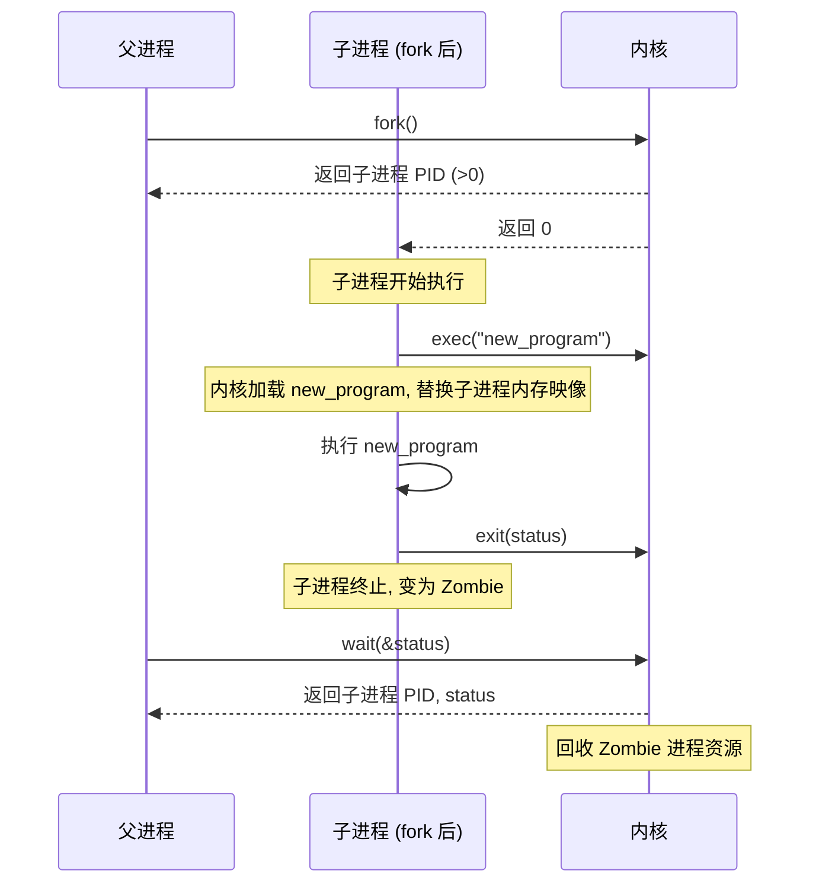

# 第十一章：Linux 操作系统剖析

Linux 是当今最成功、应用最广泛的开源操作系统内核之一，驱动着从嵌入式设备、智能手机 (Android)、个人电脑到大型服务器和超级计算机的各种系统。本章将深入剖析 Linux 的核心设计理念、内核架构以及关键子系统的实现。

## 11.1 Linux 发展历史与哲学

*   **起源:** 由芬兰学生林纳斯·托瓦兹 (Linus Torvalds) 于 1991 年启动，最初是作为一个个人项目，旨在创建一个类 Minix 的、运行在 Intel 386 平台上的免费操作系统内核。
*   **开源模式:** Linux 从一开始就采用开源模式（GPL 许可证），吸引了全球开发者的参与和贡献，快速发展壮大。
*   **与 GNU 结合:** Linux 内核与 GNU 项目提供的各种自由软件工具（如编译器 GCC、命令行工具 Bash、核心库 Glibc 等）结合，构成了完整的 **GNU/Linux** 操作系统。
*   **发行版 (Distribution):** 由于内核本身不包含完整的用户环境，众多组织和社区将 Linux 内核与各种系统软件、应用程序、桌面环境打包，形成了不同的 Linux **发行版**（如 Debian, Ubuntu, Fedora, CentOS, Arch Linux 等），方便用户安装和使用。
*   **设计哲学 (Unix 哲学):**
    *   **一切皆文件 (Everything is a file):** 硬件设备、进程信息、网络连接等都尽可能地通过文件系统接口进行访问。
    *   **小即是美 (Small is beautiful):** 程序应专注于做好一件事。
    *   **组合小程序完成复杂任务:** 通过管道 (Pipe) 和重定向组合简单的命令行工具。
    *   **文本接口优先:** 倾向于使用文本文件进行配置和数据交换。
    *   **自动化:** 强调脚本和自动化的重要性。

## 11.2 Linux 内核架构

Linux 内核采用**宏内核 (Monolithic Kernel)** 架构，但具有**模块化 (Modular)** 设计。

*   **宏内核:** 操作系统的核心功能（进程管理、内存管理、文件系统、设备驱动、网络协议栈）都运行在**内核空间 (Kernel Space)**，具有高性能（函数调用开销小）。
*   **模块化:** 允许在运行时动态加载和卸载**内核模块 (Kernel Module)**（如设备驱动、文件系统类型、网络协议）。这使得内核可以保持相对较小的核心，同时又能支持大量硬件和功能，无需重新编译整个内核。

**主要组成部分:**

```mermaid
graph TD
    UserSpace[用户空间 (应用程序, 库)]
    KernelBoundary[--- 内核空间 ---]
    SCI[系统调用接口 System Call Interface]
    PM[进程管理 Process Management]
    MM[内存管理 Memory Management]
    VFS[虚拟文件系统 Virtual File System]
    IPC[进程间通信 Inter-Process Communication]
    Net[网络协议栈 Networking Stack]
    DD[设备驱动 Device Drivers]
    Arch[体系结构相关代码 Architecture-Dependent Code]
    Hardware[硬件]

    UserSpace -- 系统调用 --> SCI;
    SCI --> PM; SCI --> MM; SCI --> VFS; SCI --> IPC; SCI --> Net;
    PM <--> MM; PM <--> IPC;
    VFS --> DD;
    Net --> DD;
    DD --> Hardware;
    MM --> Arch;
    PM --> Arch;
    Arch --> Hardware;

    subgraph Linux 内核
        SCI; PM; MM; VFS; IPC; Net; DD; Arch;
    end
```

*   **系统调用接口 (SCI):** 用户空间程序进入内核的唯一入口。提供了一组标准的函数接口（如 `open`, `read`, `fork`, `exec` 等）。
*   **进程管理 (PM):** 负责进程和线程的创建、调度、同步、销毁以及进程间通信。
*   **内存管理 (MM):** 管理物理内存和虚拟内存，包括页分配、页表管理、交换空间管理等。
*   **虚拟文件系统 (VFS):** 提供统一的文件系统接口，支持多种具体的文件系统类型（ext4, XFS, Btrfs, NFS 等）。
*   **进程间通信 (IPC):** 提供信号、管道、共享内存、消息队列、套接字等机制。
*   **网络协议栈 (Networking Stack):** 实现 TCP/IP 等网络协议。
*   **设备驱动程序 (DD):** 直接与硬件交互，管理各种设备。
*   **体系结构相关代码 (Arch):** 处理不同 CPU 架构（x86, ARM, PowerPC 等）相关的底层细节。

### 11.2.1 内核模块

*   **概念:** 可以动态加载到运行中内核或从内核移除的代码块，通常用于设备驱动、文件系统或网络协议。
*   **优点:**
    *   **灵活性:** 无需重新编译内核即可添加新硬件或功能支持。
    *   **内核瘦身:** 使基础内核保持较小。
*   **管理:** 使用 `insmod` (加载), `rmmod` (移除), `lsmod` (列出), `modprobe` (智能加载/卸载，处理依赖) 等命令。
*   **接口:** 模块通过内核定义的标准接口与内核其他部分交互。

### 11.2.2 系统调用接口

*   **机制:** 用户程序通过执行特定的**软中断 (Software Interrupt)** 指令（如 x86 上的 `int 0x80` 或更现代的 `syscall` 指令）陷入内核模式。
*   **过程:**
    1.  用户程序将系统调用号和参数放入指定寄存器。
    2.  执行陷入指令。
    3.  CPU 切换到内核模式，跳转到内核预设的入口点。
    4.  内核根据系统调用号在**系统调用表 (System Call Table)** 中找到对应的内核函数。
    5.  执行内核函数。
    6.  将结果放入寄存器。
    7.  执行返回指令，切换回用户模式，返回用户程序。
*   **库封装:** C 库 (Glibc) 提供了对系统调用的封装函数（如 `fork()`, `read()`），隐藏了底层的陷入细节。

## 11.3 进程管理

Linux 将进程视为资源分配的基本单位，将线程（轻量级进程）视为调度的基本单位。

*   **进程表示:** 内核中使用 `task_struct` 结构体（进程描述符）来表示一个进程或线程。它包含了进程状态、调度信息、内存管理信息、打开的文件、信号处理等所有相关信息。
*   **进程状态:** Running, Interruptible Sleep, Uninterruptible Sleep, Stopped, Zombie 等。

### 11.3.1 `fork()`, `exec()`, `wait()`

Linux 创建新进程的主要方式：

*   **`fork()`:** 创建一个与父进程几乎完全相同的新进程（子进程）。子进程拥有父进程地址空间（使用写时复制 COW）、文件描述符等的副本。
    *   `fork()` 对父进程返回子进程的 PID，对子进程返回 0。
*   **`exec()` 系列函数 (如 `execlp`, `execve`):** 在调用进程的上下文中加载并执行一个新的程序。它会**替换**当前进程的内存映像（代码、数据、堆栈），但 PID 和大部分其他属性（如文件描述符，除非设置了 close-on-exec）保持不变。
    *   通常在 `fork()` 之后，由子进程调用 `exec()` 来执行不同的程序。
*   **`wait()` 系列函数 (如 `wait`, `waitpid`):** 父进程调用 `wait()` 来等待其子进程的状态变化（如终止）。这允许父进程获取子进程的退出状态，并回收子进程占用的资源（避免产生僵尸进程 Zombie Process）。



**线程创建:** Linux 使用 `clone()` 系统调用来实现 `fork()` 和线程创建。通过传递不同的标志参数，`clone()` 可以控制父子进程共享资源的程度（如地址空间、文件描述符表、信号处理）。如果共享地址空间，就创建了线程（轻量级进程）。用户态通常使用 `pthread_create()` 库函数，它内部调用 `clone()`。

### 11.3.2 CFS 调度器 (Completely Fair Scheduler)

CFS 是 Linux 内核中用于**普通进程**（非实时进程）的默认调度器。

*   **目标:** 实现**完全公平 (Complete Fairness)**，即理想情况下，在一段时间内，每个可运行进程应该获得等同于 \(1/n\) 的 CPU 时间（n 是可运行进程数）。
*   **核心思想:** 不再使用固定的时间片，而是为每个进程维护一个**虚拟运行时间 (virtual runtime, vruntime)**。调度器总是选择 **vruntime 最小**的进程来运行。
*   **vruntime 计算:** 进程的 vruntime 增长速度与其优先级（nice 值）和负载权重相关。高优先级（nice 值低）的进程 vruntime 增长较慢，从而获得更多 CPU 时间。
*   **数据结构:** 使用**红黑树 (Red-Black Tree)** 来存储所有可运行进程，按 vruntime 排序。选择下一个运行的进程只需找到树的最左节点（vruntime 最小），时间复杂度为 O(log N)。
*   **抢占:** 当一个新进程变为可运行（如从睡眠中唤醒）时，如果它的 vruntime 小于当前正在运行进程的 vruntime，则可能触发抢占。
*   **优点:** 公平性好，交互响应快，扩展性好。

### 11.3.3 命名空间与 Cgroups

这两个特性是 Linux **容器化 (Containerization)** 技术（如 Docker, LXC）的基础。

*   **命名空间 (Namespaces):** 提供资源隔离视图。
    *   **PID Namespace:** 容器内进程有独立的 PID 空间 (从 1 开始)。
    *   **Network Namespace:** 容器有独立的网络设备、IP 地址、路由表、端口号空间。
    *   **Mount Namespace:** 容器有独立的文件系统挂载点视图。
    *   **UTS Namespace:** 独立的主机名和域名。
    *   **User Namespace:** 容器内用户和组 ID 可以映射到宿主机上不同的 ID，实现权限隔离。
    *   **IPC Namespace:** 隔离进程间通信资源 (System V IPC, POSIX 消息队列)。
*   **控制组 (Cgroups):** 提供资源限制和控制。
    *   可以将一组进程组织到一个 Cgroup 中。
    *   可以限制 Cgroup 使用的资源量（如 CPU 时间片、内存上限、磁盘 I/O 带宽、网络带宽）。
    *   可以设置资源优先级。
    *   可以统计资源使用情况。

命名空间提供了"看到"的隔离，Cgroups 提供了"用到"的限制。

## 11.4 内存管理

Linux 内存管理系统复杂而高效，支持虚拟内存、内存分配、页面置换等。

*   **虚拟地址空间布局 (x86-64 典型):**
    *   低地址部分：用户空间（代码、数据、堆、栈、共享库、VDSO）。
    *   高地址部分：内核空间（内核代码、数据、页表映射、直接物理内存映射、vmalloc 区域）。用户空间和内核空间通过页表隔离。
*   **分页:** 采用多级页表（x86-64 通常是 4 级或 5 级）管理虚拟地址到物理地址的映射。利用 TLB 加速转换。
*   **页面分配:**
    *   **伙伴系统 (Buddy System):** 用于管理和分配**物理上连续**的页帧块（大小为 2 的幂）。解决外部碎片问题，合并效率高。
    *   **Slab 分配器 (Slab/Slub/Slob):** 构建在伙伴系统之上，用于高效管理内核中**频繁分配和释放的小对象**（如 `task_struct`, `inode`）。通过缓存和预初始化对象，减少了碎片和分配开销。
*   **页面回收/置换:**
    *   当内存不足时，内核需要回收页面。
    *   **回收匿名页 (Anonymous Pages):** 进程的堆、栈等私有数据页。如果被修改过，需要换出 (Swap Out) 到**交换空间 (Swap Space)**。
    *   **回收文件支持页 (File-Backed Pages):** 如程序代码、内存映射文件、缓冲区缓存。如果未被修改，可以直接丢弃（需要时可从文件重新读入）；如果被修改过，需要写回 (Write Back) 到对应的磁盘文件。
    *   **页面置换算法:** 采用基于**活动/非活动链表 (Active/Inactive Lists)** 的 LRU 近似算法。维护活动链表（近期访问）和非活动链表（较久未访问）。优先从非活动链表中回收页面。通过引用位判断页面活跃度，定期将非活动页移到活动链表，将活动链表中久未访问的页移到非活动链表。

### 11.4.1 Buddy System 与 Slab Allocator

见上一节及 4.6 节描述。Buddy System 负责大块连续物理内存分配，Slab Allocator 负责内核小对象的精细化管理。

### 11.4.2 页表管理

*   每个进程拥有独立的页表结构 (通常共享内核部分页表)。
*   使用多级页表（PGD, P4D, PUD, PMD, PTE）来节省空间，避免为整个巨大虚拟地址空间分配完整页表。
*   写时复制 (COW) 技术在 `fork()` 时共享页表项和物理页面，直到写入时才复制。
*   大页 (Huge Pages): 支持比标准页面（如 4KB）大得多的页面（如 2MB, 1GB），可以减少 TLB Miss 次数，提高访问大内存区域的性能，但可能增加内部碎片。

### 11.4.3 OOM Killer (Out Of Memory Killer)

*   **触发:** 当系统内存（包括交换空间）严重不足，无法满足内核或用户进程的内存分配请求，且无法通过正常页面回收释放足够内存时，OOM Killer 被触发。
*   **机制:** 内核根据一套启发式规则（如进程内存占用、运行时间、优先级、oom_score 等）选择一个"牺牲品"进程，并将其**强制杀死 (kill)**，以释放内存，保证系统关键部分能够继续运行。
*   **目的:** 避免系统完全死锁或崩溃，是一种最后的补救措施。
*   **问题:** OOM Killer 的选择不一定最优，可能杀死重要进程。管理员可以通过调整 `oom_score_adj` 参数影响选择倾向。

## 11.5 文件系统

### 11.5.1 VFS 接口

虚拟文件系统 (Virtual File System, VFS) 是 Linux 文件系统的核心抽象层。

*   **目标:** 提供统一的文件和文件系统操作接口给用户空间程序和内核其他部分，屏蔽底层具体文件系统的实现差异。
*   **关键对象:**
    *   **超级块对象 (Superblock Object):** 代表一个已挂载的文件系统实例。
    *   **索引节点对象 (Inode Object):** 代表一个具体的文件（普通文件、目录、设备文件等），包含文件的元数据（权限、大小、时间戳、数据块指针等）。
    *   **目录项对象 (Dentry Object):** 代表一个目录条目（文件名与其对应 Inode 的链接），用于路径名查找。Dentry 缓存 (dcache) 加速路径解析。
    *   **文件对象 (File Object):** 代表一个进程打开的文件实例，包含文件指针、访问模式等信息。
*   **操作:** VFS 定义了一组标准操作函数指针集合（如 `superblock_operations`, `inode_operations`, `dentry_operations`, `file_operations`），具体文件系统需要实现这些接口。

### 11.5.2 ext4 文件系统详解

ext4 (Fourth Extended Filesystem) 是许多 Linux 发行版的默认文件系统，是 ext2/ext3 的演进。

*   **主要特性:**
    *   **日志 (Journaling):** 继承自 ext3，通过日志保证元数据一致性，加快崩溃后恢复速度。支持多种日志模式 (journal, ordered, writeback)。
    *   **区段 (Extents):** 替代传统的直接/间接块指针，用区段（连续物理块的范围）来表示大文件的数据块分配。减少了元数据开销，提高了大文件性能。
    *   **延迟分配 (Delayed Allocation, Allocate-on-flush):** 写数据时不立即分配物理块，等到数据要刷写到磁盘时（如 `fsync()` 或缓存写回）才分配。这使得分配器能掌握更多信息，做出更优化的（更连续的）块分配决策，减少碎片。
    *   **大文件系统支持:** 支持最大 1 EB 的卷和 16 TB 的文件。
    *   **目录索引 (HTree):** 对大目录使用类似 B 树的 HTree 索引，加速目录内文件查找。
    *   **预分配 (Preallocation):** 允许应用程序预留文件空间。
    *   **多块分配器 (Multiblock Allocator):** 一次分配多个块，提高效率，减少碎片。

### 11.5.3 Btrfs 与 ZFS (on Linux) 简介

*   **Btrfs (B-tree Filesystem):**
    *   下一代写时复制 (COW) 文件系统，由 Oracle 发起，现为社区驱动。
    *   **特性:** 内建快照 (Snapshot)、子卷 (Subvolume)、校验和 (Checksum) 保证数据完整性、内建 RAID 支持 (0, 1, 10, 5, 6)、透明压缩、在线碎片整理、SSD 优化。
    *   **目标:** 取代 ext4 和提供更高级的存储管理功能。
    *   **现状:** 功能丰富，但部分高级特性（如 RAID 5/6）的稳定性仍受关注。
*   **ZFS (Zettabyte File System):**
    *   由 Sun Microsystems 开发 (现属 Oracle)，也是先进的 COW 文件系统。
    *   **特性:** 强大的数据完整性保护（端到端校验和）、存储池化 (Pooled Storage)、廉价快照与克隆、透明压缩、内建 RAID-Z (类似 RAID 5/6 但避免了写漏洞)、重复数据删除 (Deduplication)。
    *   **ZFS on Linux (ZoL):** 由于许可证问题 (CDDL vs GPL)，ZFS 不能直接进入 Linux 内核，但可以通过 ZoL 项目作为内核模块使用，功能完整且稳定。
    *   **应用:** 企业存储、数据归档、需要高可靠性和数据完整性的场景。

## 11.6 I/O 系统

Linux I/O 系统负责管理块设备和字符设备。

### 11.6.1 块设备层与字符设备层

*   **块设备 (Block Device):** 以固定大小的块进行访问，可随机寻址（如硬盘、SSD）。内核提供块设备层进行缓冲、调度。
*   **字符设备 (Character Device):** 以字节流方式访问，通常不可寻址（如终端、串口、鼠标）。内核提供字符设备接口。
*   **设备文件:** 在 `/dev` 目录下，通过特殊设备文件（主设备号 Major Number 标识驱动程序，次设备号 Minor Number 标识具体设备单元）来访问设备。

### 11.6.2 I/O 调度器 (Block I/O Scheduler)

位于块设备层，用于对发往块设备的 I/O 请求进行排序和合并，以优化性能（特别是 HDD 的寻道时间）。

*   **目的:** 减少寻道时间、提高吞吐量、保证公平性、提供低延迟。
*   **Linux 内核中常见的调度器 (不同内核版本有所变化):**
    *   **NOOP (No Operation):** 最简单的调度器，仅做简单的请求合并。适用于无寻道开销的设备（如 SSD、RAM Disk）或底层已有智能调度器（如硬件 RAID 卡）。
    *   **Deadline:** 为每个请求设置读/写超时期限。优先满足快到期的请求，避免饥饿。对读操作有更高优先级，适合数据库等读敏感应用。
    *   **CFQ (Completely Fair Queuing):** 为每个进程维护一个 I/O 请求队列，尝试公平地分配 I/O 带宽给各个进程。适合桌面和混合负载环境。
    *   **BFQ (Budget Fair Queuing):** CFQ 的改进版，基于时间而非请求数量进行公平调度，旨在提供更低的延迟和更好的交互性。
    *   **Kyber:** 基于令牌桶的请求分发机制，旨在提供可预测的低延迟，适用于现代高速 NVMe SSD。
    *   **MQ (Multi-Queue Block Layer):** 现代 Linux 内核引入了多队列块层，允许为每个 CPU 核心或硬件队列分配独立的请求队列和调度器，以提高在多核 CPU 和高速 NVMe SSD 上的并行处理能力和性能。

## 11.7 网络栈

Linux 拥有非常成熟和功能丰富的网络协议栈，支持 TCP/IP 协议族及大量其他网络协议。

*   **分层结构 (大致对应 OSI/TCP/IP 模型):**
    *   **套接字接口层 (Socket Layer):** 提供给用户空间的 API (socket, bind, connect, send, recv 等)。
    *   **协议层 (Protocol Layer):** 实现具体的网络协议，如 TCP, UDP, IP, ICMP, ARP 等。
    *   **网络设备接口层 (Network Device Interface):** 通过统一的接口 (如 `net_device` 结构) 与各种网络设备驱动程序交互。
    *   **设备驱动层 (Device Driver Layer):** 控制具体的网络硬件（如以太网卡、WiFi 适配器）。
*   **核心数据结构:** `sk_buff` (Socket Buffer) 用于在各层之间传递网络数据包及其元数据。
*   **Netfilter / iptables / nftables:** 内核内置的包过滤和网络地址转换 (NAT) 框架，是实现防火墙的基础。
*   **性能优化:** 零拷贝 (Zero-copy)、NAPI (New API for network drivers)、Receive Packet Steering (RPS)、TCP 拥塞控制算法 (Cubic, BBR) 等。

## 11.8 安全机制 (SELinux, AppArmor)

Linux 提供了多种安全增强机制。

*   **标准权限模型:** 基于用户/组/其他的读/写/执行权限 (Discretionary Access Control, DAC)。
*   **强制访问控制 (Mandatory Access Control, MAC):**
    *   **目的:** 提供比标准 DAC 更严格、更细粒度的访问控制，强制实施系统级的安全策略，限制进程（即使是 root 进程）的行为。
    *   **SELinux (Security-Enhanced Linux):**
        *   由 NSA 开发，基于标签 (Label) 和策略 (Policy) 的 MAC 系统。
        *   为所有主体（进程）和客体（文件、端口等）打上安全标签（上下文 Context）。
        *   通过安全策略规则库定义不同标签之间允许的交互。
        *   非常强大和灵活，但策略配置复杂。
        *   常见于 RHEL/CentOS/Fedora。
    *   **AppArmor:**
        *   由 Novell 发起，基于路径名 (Pathname) 的 MAC 系统。
        *   为每个应用程序定义一个配置文件 (Profile)，限制该程序可以访问的文件路径、网络权限、能力 (Capabilities) 等。
        *   配置相对 SELinux 更简单易懂。
        *   常见于 Ubuntu/Debian/SUSE。
*   **能力 (Capabilities):** 将传统的 root 超级用户的权限划分成更小的、独立的权限单元（如 `CAP_NET_BIND_SERVICE` 允许绑定小于 1024 的端口，`CAP_SYS_TIME` 允许修改系统时间）。允许进程只获取它完成任务所必需的最小权限，而不是完整的 root 权限。

## 11.9 总结

Linux 是一个功能强大、灵活且广泛应用的开源操作系统内核。
*   其**宏内核模块化**架构在性能和灵活性之间取得了平衡。
*   **进程管理**以 `fork`/`exec`/`wait` 为基础，CFS 调度器保证了公平性，命名空间和 Cgroups 支撑了容器化。
*   **内存管理**采用分页、伙伴系统、Slab 分配器和 LRU 近似页面回收策略，并通过 OOM Killer 处理极端情况。
*   **VFS** 提供了统一的文件系统接口，支持 ext4, Btrfs, ZFS 等多种文件系统，各有特点。
*   **I/O 系统**区分块设备和字符设备，通过 I/O 调度器优化块设备访问。
*   **网络栈**功能完善，性能优异。
*   **安全机制**除了标准的 DAC，还包括强大的 MAC 框架（SELinux, AppArmor）和能力机制。

对 Linux 内核关键子系统的理解，有助于更好地使用、配置、排错和开发基于 Linux 的系统。 