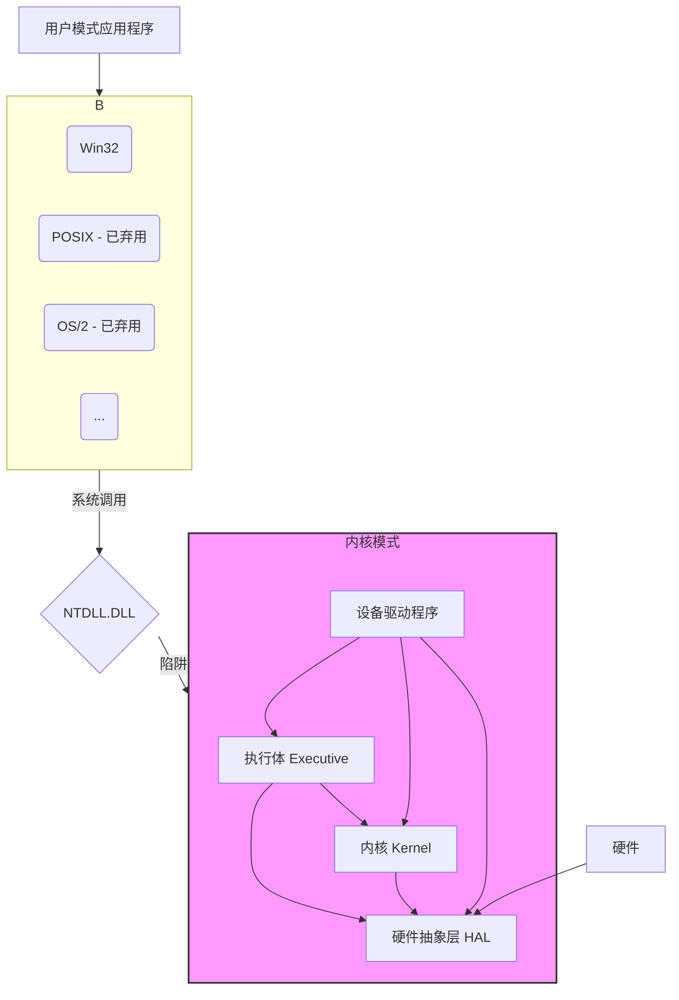
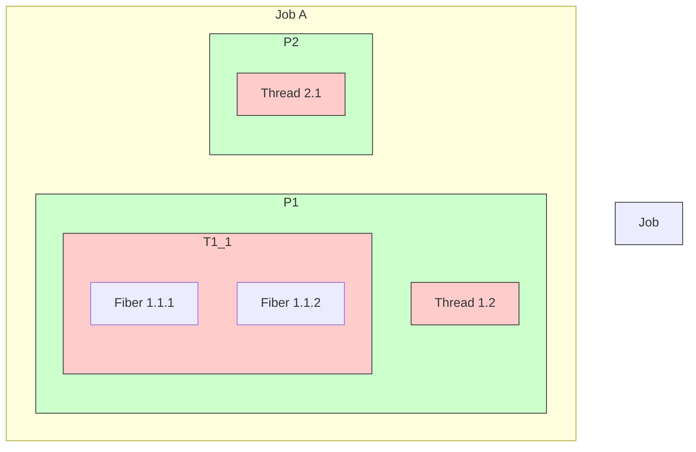
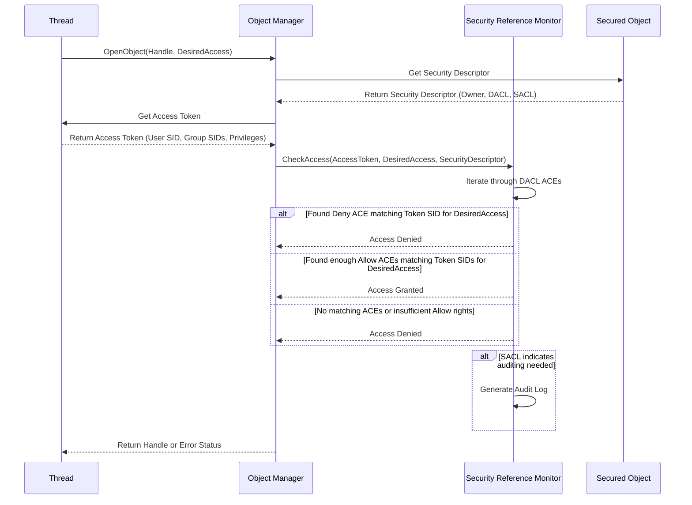

# 第十二章：Windows 操作系统剖析

Windows 作为全球桌面操作系统市场的领导者，其内部架构和设计理念对现代计算产生了深远影响。本章将深入剖析 Windows 操作系统的核心组件、管理机制以及关键特性，帮助读者理解其复杂而强大的内部世界。

## 12.1 Windows 发展历史与版本

Windows 的历史可以追溯到 1985 年发布的 Windows 1.0，最初是作为 MS-DOS 的图形用户界面扩展。经过多年的发展，Windows 经历了多个重要的里程碑：

-   **早期版本 (Windows 1.0 - 3.x):** 基于 MS-DOS，提供基本的图形界面和多任务能力（协作式）。
-   **Windows 9x (95, 98, Me):** 引入了 32 位计算，改进了用户界面（开始菜单、任务栏），但仍部分依赖 16 位代码和 MS-DOS。
-   **Windows NT (New Technology):** 与 9x 系列并行发展，是一个完全 32 位的、从头设计的操作系统，具有更高的稳定性、安全性和可移植性。NT 架构奠定了现代 Windows 的基础。关键版本包括 NT 3.1, 3.51, 4.0。
-   **Windows 2000:** 基于 NT 架构，面向商业用户，引入了活动目录 (Active Directory)。
-   **Windows XP:** 合并了 9x 系列的用户友好性和 NT 系列的稳定性，成为历史上最受欢迎的 Windows 版本之一。
-   **Windows Vista:** 尝试引入新的用户界面 (Aero) 和安全特性 (UAC)，但因性能和兼容性问题受到批评。
-   **Windows 7:** 对 Vista 进行了改进和优化，广受好评。
-   **Windows 8/8.1:** 引入了适用于触摸屏的 Metro UI (后称 Modern UI)，但开始菜单的移除引起争议。
-   **Windows 10:** 回归了传统的桌面体验，融合了 Modern UI 应用，并转变为"服务模式"(Windows as a Service, WaaS)，持续接收功能更新。
-   **Windows 11:** 在 Windows 10 的基础上，对 UI 进行了现代化改造，提升了安全要求，并优化了对新硬件的支持。

微软针对不同市场推出了多个 Windows 版本，主要包括：

-   **Home:** 面向家庭用户。
-   **Pro:** 面向专业人士和小型企业。
-   **Enterprise:** 面向大型企业，提供高级管理和安全功能。
-   **Education:** 面向教育机构。
-   **Server:** 面向服务器环境，提供网络服务、数据管理等功能。
-   **IoT (曾用名 Embedded):** 面向物联网设备和嵌入式系统。

## 12.2 Windows 系统架构

现代 Windows (基于 NT 架构) 采用分层和模块化的设计，旨在实现可移植性、可靠性和安全性。其核心架构可以分为用户模式 (User Mode) 和内核模式 (Kernel Mode)。



**内核模式组件:**

### 12.2.1 HAL (硬件抽象层 - Hardware Abstraction Layer)

-   **作用:** 隔离操作系统内核和底层硬件差异。HAL 提供了一个标准的接口，使得 Windows 内核和设备驱动程序无需关心具体的 CPU 类型、中断控制器、总线等硬件细节。
-   **优势:** 极大地提高了 Windows 的可移植性。只需要为不同的硬件平台提供相应的 HAL，内核和大部分驱动程序就可以保持不变。例如，从 x86 迁移到 ARM 平台，主要修改的是 HAL。
-   **交互:** HAL 直接与硬件交互，并向上层（内核、执行体、驱动程序）提供服务，如中断处理、时钟管理、DMA 控制等。

### 12.2.2 内核 (Kernel - ntoskrnl.exe 的一部分)

-   **作用:** 提供操作系统最基本、最核心的功能。它是整个系统的基础，负责底层的调度、同步和中断处理。
-   **功能:**
    -   **线程调度:** 实现底层的线程调度机制（详见 12.3.2）。
    -   **中断和异常处理:** 分发硬件中断和软件异常给相应的处理程序。
    -   **同步原语:** 提供内核模式下的同步机制，如自旋锁 (Spinlock)、内核调度器对象 (Dispatcher Objects) 等，用于解决并发访问问题。
    -   **时钟管理:** 处理系统时钟中断。
-   **特点:** 内核本身非常小巧，不包含策略，只提供机制。它不直接与用户模式交互，而是通过执行体暴露功能。内核总是驻留在内存中，并且其代码不可分页（Non-paged）。

### 12.2.3 执行体 (Executive - ntoskrnl.exe 的一部分)

-   **作用:** 提供一系列高级服务和管理功能，是内核模式中功能的主要实现者。执行体由多个相对独立的组件构成。
-   **主要组件:**
    -   **对象管理器 (Object Manager):** 负责创建、管理和删除所有内核对象（如文件、进程、线程、注册表键、同步对象等），并负责对象的命名和安全控制。
    -   **进程管理器 (Process Manager):** 创建和终止进程和线程。注意，具体的调度由内核完成。
    -   **内存管理器 (Memory Manager):** 实现虚拟内存管理，包括分页、内存分配、Working Set 管理等（详见 12.4）。
    -   **安全引用监视器 (Security Reference Monitor - SRM):** 强制实施访问控制策略，检查用户或进程是否有权限访问特定对象（详见 12.7）。
    -   **I/O 管理器 (I/O Manager):** 管理设备驱动程序，处理来自用户模式和内核模式的 I/O 请求（详见 12.5.3）。
    -   **即插即用管理器 (PnP Manager):** 负责检测和配置硬件设备，加载相应的驱动程序。
    -   **电源管理器 (Power Manager):** 协调系统的电源状态转换。
    -   **配置管理器 (Configuration Manager):** 管理系统注册表（详见 12.8）。
    -   **本地过程调用 (LPC) Facility:** 在同一台机器上的不同进程（特别是客户端和服务端，如用户程序与环境子系统）之间提供高效的通信机制。
-   **交互:** 执行体组件相互协作，并通过 `ntoskrnl.exe` 导出的函数（`Nt*` 或 `Zw*` 系列）向上层（主要是环境子系统通过 `ntdll.dll`）提供服务。

### 12.2.4 子系统 (Subsystems)

-   **作用:** 为用户应用程序提供运行环境和 API 接口。它们运行在用户模式，充当应用程序和内核模式执行体之间的桥梁。
-   **主要子系统:**
    -   **Win32 子系统:** 最重要的子系统，提供了核心的 Windows API (如 `kernel32.dll`, `user32.dll`, `gdi32.dll` 中的函数)。几乎所有 Windows 应用程序都直接或间接依赖 Win32 API。它负责窗口管理、图形绘制、输入处理等。
    -   **POSIX 子系统 (已弃用):** 提供对 POSIX 标准的部分兼容，允许运行一些 Unix 类型的应用程序。在现代 Windows 中已被 Windows Subsystem for Linux (WSL) 取代。
    -   **OS/2 子系统 (已弃用):** 提供对早期 OS/2 应用程序的兼容性。
    -   **Windows Subsystem for Linux (WSL):** 允许用户在 Windows 上直接运行 Linux 二进制文件。WSL1 通过模拟 Linux 系统调用实现，WSL2 则通过轻量级虚拟机运行完整的 Linux 内核。
-   **交互:** 用户应用程序调用子系统 DLL 提供的 API。子系统 DLL 可能会直接处理某些请求，或者通过 `ntdll.dll` 中的函数调用内核模式的执行体服务来完成更底层的操作。

**用户模式与内核模式的交互:**

用户模式代码不能直接访问内核模式的数据或调用内核模式函数。当用户程序需要操作系统服务时（如打开文件、创建进程），它会调用用户模式库函数（如 Win32 API）。这些库函数通常会通过 `ntdll.dll` 中的特殊接口执行一个 `syscall` 或 `sysenter`（取决于 CPU 架构）指令，触发一个**陷阱 (Trap)**。CPU 控制权转移到内核模式下的系统服务分派器 (System Service Dispatcher)。分派器根据系统调用号查找对应的内核模式函数（通常是执行体组件提供的 `Nt*` 函数），执行请求，然后将结果返回给用户模式调用者。

## 12.3 进程与线程管理

Windows 提供了复杂而灵活的进程和线程模型，以支持各种应用程序的需求。

### 12.3.1 进程、作业、线程、纤程

-   **进程 (Process):**
    -   定义：一个正在执行的程序的实例。它包含了程序代码、数据、资源（如句柄、内存）以及至少一个执行线程。
    -   资源容器：进程是资源分配的基本单位。它拥有独立的虚拟地址空间、文件句柄表、安全上下文等。
    -   创建：通常通过 `CreateProcess` Win32 API 创建。
-   **作业 (Job):**
    -   定义：一个或多个进程的集合，可以作为一个整体进行管理和控制。
    -   用途：允许对一组进程施加统一的限制，如总 CPU 时间、内存使用量、安全约束等。例如，可以创建一个作业，限制其中所有进程的总内存使用不能超过 1GB。当作业被终止时，其中所有进程也会被终止。
    -   管理：通过 `CreateJobObject`, `AssignProcessToJobObject`, `SetInformationJobObject` 等 API 管理。
-   **线程 (Thread):**
    -   定义：进程内部的执行单元，是 CPU 调度的基本单位。
    -   共享资源：同一进程内的所有线程共享该进程的虚拟地址空间、全局变量、文件句柄等资源。
    -   私有资源：每个线程拥有自己独立的线程栈（用于存储局部变量和函数调用信息）、寄存器状态和线程局部存储 (TLS)。
    -   创建：通过 `CreateThread` Win32 API 创建。一个进程至少有一个主线程。
-   **纤程 (Fiber):**
    -   定义：比线程更轻量级的执行单元，完全在用户模式下进行调度，由应用程序显式管理。
    -   调度：操作系统内核不感知纤程的存在。应用程序需要自己实现纤程调度器，通过 `SwitchToFiber` API 在不同纤程之间切换执行权。
    -   用途：适用于需要管理大量执行上下文但又希望避免内核线程切换开销的场景，例如某些高性能服务器或协程库的底层实现。
    -   管理：通过 `CreateFiber`, `ConvertThreadToFiber`, `SwitchToFiber` 等 API 管理。



### 12.3.2 调度算法 (优先级队列)

Windows 使用基于**优先级**的**抢占式**调度算法。内核维护着多个调度队列，每个队列对应一个优先级。

-   **优先级范围:** 0 到 31，数值越大优先级越高。
    -   0: 系统空闲线程使用。
    -   1-15: 普通优先级 (动态优先级)。用户线程和大部分系统线程运行在此范围。
    -   16-31: 实时优先级 (静态优先级)。用于需要立即响应的关键任务，如某些驱动程序或多媒体应用。实时优先级的线程只有在自愿放弃 CPU、等待同步对象或被更高优先级的实时线程抢占时才会停止运行。
-   **调度机制:**
    1.  调度器总是选择**最高优先级**的**就绪 (Ready)** 线程投入运行。
    2.  同一优先级内部，通常采用**时间片轮转 (Round-Robin)** 方式。线程会运行一个时间片 (Quantum)，时间片用完后，如果还有其他同优先级线程就绪，则将其移到该优先级队列末尾，并选择下一个线程运行。
    3.  **抢占:** 如果一个更高优先级的线程变为就绪状态（例如，等待的 I/O 完成了），它会立即抢占当前正在运行的较低优先级线程。
    4.  **优先级提升 (Priority Boost):** 为了改善交互性和响应速度，Windows 会在特定事件发生时临时提升线程的优先级。例如：
        -   当线程完成一个 I/O 操作后。
        -   当线程等待的事件或信号量被触发时。
        -   当前台窗口的线程等待时间过长时。
        提升后的优先级会随着线程运行时间片的消耗而逐渐衰减回其基础优先级。
-   **基础优先级与动态优先级:**
    -   线程有一个**基础优先级 (Base Priority)**，由进程的基础优先级和线程自身的相对优先级决定。
    -   对于普通优先级的线程 (1-15)，其**动态优先级 (Dynamic Priority)** 会在基础优先级附近浮动，受优先级提升机制的影响。
    -   实时优先级的线程 (16-31)，其动态优先级通常等于其基础优先级，不受常规提升机制影响（但某些系统事件仍可能临时提升）。
-   **多处理器调度:** 在多 CPU 系统上，调度器会尝试将线程分配到可用的 CPU 核心上，并考虑**处理器亲和性 (Processor Affinity)**（限制线程只能在指定的 CPU 子集上运行）和 **NUMA (Non-Uniform Memory Access)** 架构（尽量将线程调度到靠近其访问内存的 CPU 上）。

### 12.3.3 UMS (用户模式调度 - User-Mode Scheduling)

-   **背景:** 内核线程调度虽然灵活，但线程切换涉及内核模式转换，开销较大。对于需要极高性能和精细控制调度的应用（如数据库服务器），这种开销可能成为瓶颈。
-   **概念:** UMS 允许应用程序在用户模式下创建和管理自己的线程，并实现自定义的调度策略，绕过内核调度器。
-   **机制:**
    -   应用程序创建一个或多个 UMS 调度器线程。
    -   应用程序创建 UMS 工作线程，这些线程与调度器线程关联。
    -   当 UMS 工作线程需要阻塞（如等待 I/O）或主动让出 CPU 时，它不会直接陷入内核，而是将控制权返回给用户模式的调度器线程。
    -   调度器线程负责决定接下来运行哪个 UMS 工作线程，并通过特定 API 将其切换到 CPU 上执行。内核只负责在调度器线程之间进行切换。
-   **优势:**
    -   **减少内核转换开销:** 大部分调度决策在用户模式完成。
    -   **自定义调度策略:** 应用程序可以根据自身负载特性实现最优的调度算法。
-   **劣势:** 实现复杂，需要应用程序开发者编写调度逻辑。
-   **现状:** UMS 是一个相对底层的技术，主要被一些需要极致性能的中间件或框架使用。对于大多数应用，Windows 默认的内核调度器已经足够高效。

## 12.4 内存管理

Windows 的内存管理器 (Memory Manager) 负责为每个进程提供私有的虚拟地址空间，并管理物理内存的分配与回收。

### 12.4.1 虚拟地址空间布局

每个 32 位进程拥有 4GB 的虚拟地址空间，每个 64 位进程拥有远超物理内存大小的巨大虚拟地址空间（理论上 256TB，实际受硬件和 Windows 版本限制）。虚拟地址空间被划分为用户空间和内核空间。

-   **32 位 Windows:**
    -   默认情况下，低 2GB (0x00000000 - 0x7FFFFFFF) 分配给用户模式代码和数据。
    -   高 2GB (0x80000000 - 0xFFFFFFFF) 保留给内核模式使用，所有进程共享相同的内核空间映射（但通过页表权限隔离）。
    -   可以通过 `/3GB` 启动开关（需应用程序支持）将用户空间扩大到 3GB，内核空间压缩到 1GB。
-   **64 位 Windows:**
    -   用户空间非常大（通常为 128TB 或更高，取决于具体 Windows 版本）。
    -   内核空间也非常大（同样为 128TB 或更高）。
    -   用户空间和内核空间之间有巨大的"空洞"。

**地址空间内容:**

-   **用户空间:**
    -   应用程序代码 (.exe)
    -   动态链接库代码 (.dll)
    -   进程堆 (Heap)
    -   线程栈 (Stack)
    -   内存映射文件
    -   环境变量和命令行参数
-   **内核空间:**
    -   操作系统内核代码 (ntoskrnl.exe)
    -   硬件抽象层 (HAL)
    -   设备驱动程序代码
    -   文件系统缓存
    -   内核分页池 (Paged Pool)：可被换出到磁盘的内核内存。
    -   内核非分页池 (Non-Paged Pool)：必须始终驻留在物理内存中的内核内存（如中断服务例程使用的数据）。
    -   页表本身也存储在内核空间。

### 12.4.2 页表管理与 VAD 树

Windows 使用**分页 (Paging)** 机制将虚拟地址转换为物理地址。

-   **页大小:** 通常是 4KB。也支持大页面 (Large Pages, 2MB 或 1GB) 以减少 TLB Miss 开销，但需要特殊配置和 API 调用。
-   **页表结构:**
    -   **32 位 (未使用 PAE):** 两级页表 (页目录 Page Directory, 页表 Page Table)。
    -   **32 位 (启用 PAE - Physical Address Extension):** 三级页表 (页目录指针表 PDPT, 页目录 PD, 页表 PT)，允许访问超过 4GB 的物理内存。
    -   **64 位:** 四级页表 (PML4, PDPT, PD, PT)。
    -   页表项 (PTE) 包含物理页框号、存在位 (Present)、读/写权限、用户/内核模式访问权限、已访问位 (Accessed)、脏位 (Dirty)、NX 位 (No-Execute) 等控制信息。
-   **VAD (虚拟地址描述符 - Virtual Address Descriptor) 树:**
    -   由于进程的虚拟地址空间可能非常大且稀疏（大部分未被使用），为整个空间维护完整的页表会浪费大量内存。
    -   Windows 内存管理器为每个进程维护一棵**自平衡二叉树 (AVL 树)**，称为 VAD 树。
    -   树中的每个节点 (VAD) 描述了进程地址空间中一段**连续的**、具有**相同属性**（如权限、类型）的虚拟地址范围。例如，一个 VAD 可能描述加载的 DLL 的代码区，另一个 VAD 描述堆的一部分。
    -   当访问一个虚拟地址时，内存管理器首先在 VAD 树中查找对应的 VAD，以确定该地址是否有效以及其属性。如果有效且尚未分配物理内存和页表，内存管理器才会实际创建相应的页表项。
    -   VAD 树使得管理稀疏地址空间更加高效，只有实际使用的地址范围才需要分配页表。

```mermaid
graph TD
    subgraph Process Address Space (Sparse)
        direction LR
        Code --> Data --> Heap --> ... --> Stack
    end

    subgraph VAD Tree (Efficient Representation)
        Root --> VAD_Code
        Root --> VAD_Data
        Root --> VAD_Heap
        Root --> VAD_Stack
        VAD_Heap --> VAD_Heap_Sub1
        VAD_Heap --> VAD_Heap_Sub2
    end

    VAD_Code -- Describes --> Code
    VAD_Data -- Describes --> Data
    VAD_Heap -- Describes --> Heap
    VAD_Stack -- Describes --> Stack

    style VAD Tree fill:#eee,stroke:#333
```

### 12.4.3 Working Set 与内存压缩

-   **工作集 (Working Set):**
    -   定义：一个进程（或系统整体）当前活跃使用的物理内存页的集合。这些是进程最近访问过的页面，被认为是其正常运行所必需的。
    -   管理：内存管理器为每个进程维护一个工作集大小（最小值和最大值）。当物理内存紧张时，内存管理器会尝试**修整 (Trim)** 进程的工作集，即将其不常用的页面（根据页面访问位判断）从工作集中移除。
    -   页面状态：被移出的页面可能会被放到**备用链表 (Standby List)**。如果进程稍后再次访问该页面且它仍在备用链表上，可以快速将其重新加入工作集（软缺页）。如果备用链表上的页面长时间未被访问，则可能被写入分页文件（如果它是脏页）并放到**空闲链表 (Free List)** 或**清零链表 (Zeroed List)** 中，最终被其他进程使用。
    -   工作集模型是 Windows 页面置换策略的核心部分，旨在平衡各个进程的内存需求和系统整体的内存可用性。
-   **内存压缩 (Memory Compression) (Windows 10 及以后):**
    -   背景：将不活跃的内存页写入磁盘（分页）速度较慢。
    -   机制：当内存压力增大时，系统不再直接将不活跃的页换出，而是先尝试在内存中对其进行**压缩**。压缩后的数据仍然存储在 RAM 中，但占用的物理空间更小。这些压缩后的页被存储在一个称为**压缩存储 (Compression Store)** 的特殊内存区域（属于系统进程的工作集）。
    -   优点：访问压缩页比从磁盘读取分页文件快得多。当进程需要访问被压缩的页面时，系统只需在内存中解压缩即可，避免了磁盘 I/O。
    -   权衡：压缩和解压缩需要消耗 CPU 资源。系统会动态决策是压缩页面还是将其写入分页文件。
    -   效果：提高了系统在内存压力下的响应速度，减少了对分页文件的依赖。

## 12.5 文件系统

Windows 支持多种文件系统，其中 NTFS 是最常用和功能最强大的。I/O 管理器负责处理所有文件系统和设备的交互。

### 12.5.1 NTFS 文件系统详解 (MFT, 流, 日志)

NTFS (New Technology File System) 是 Windows NT 及后续版本的默认文件系统。

-   **核心结构: 主文件表 (Master File Table - MFT)**
    -   MFT 本身也是一个文件，是 NTFS 卷的核心。它包含了一系列记录 (通常为 1KB 大小)，每个记录描述卷上的一个文件或目录。
    -   **MFT 记录:** 存储文件的**元数据 (Metadata)**，如文件名、时间戳、访问权限、文件大小等。这些元数据以**属性 (Attributes)** 的形式存储在 MFT 记录中。
    -   **小文件存储:** 对于非常小的文件，其**数据本身**也可以作为 MFT 记录中的一个属性（称为常驻属性 `Resident Attribute`）直接存储，避免了额外的磁盘寻址。
    -   **大文件存储:** 对于较大的文件，MFT 记录中会存储指向文件数据实际存储位置（簇 `Cluster` 的列表或索引）的指针（称为非常驻属性 `Non-Resident Attribute`）。这些指针构成了文件的**数据运行 (Data Runs)**。
    -   MFT 的前若干条记录用于描述 NTFS 文件系统自身的元数据文件，例如 `$MFT` (MFT 自身), `$MFTMirr` (MFT 的关键部分镜像), `$LogFile` (日志文件), `$Volume` (卷信息), `$AttrDef` (属性定义), `.` (根目录), `$Bitmap` (簇分配位图), `$Boot` (引导扇区), `$BadClus` (坏簇列表) 等。
-   **数据流 (Alternate Data Streams - ADS):**
    -   NTFS 允许一个文件包含多个独立的数据流，除了主数据流（我们通常看到的文件内容）外，还可以附加其他命名的数据流。
    -   每个流都有自己的大小和数据。
    -   用途：最初设计用于兼容 Macintosh 的 HFS 文件系统（资源叉），但也可用于存储文件的附加信息（如浏览器存储下载来源信息 `Zone.Identifier`）。
    -   访问：可以通过 `文件名:流名` 的语法访问。例如 `myfile.txt:hiddeninfo`。标准的文件浏览器通常不显示非主数据流。
-   **日志 (Journaling):**
    -   NTFS 是一个**日志文件系统**，具有很高的可靠性和恢复能力。
    -   **机制:** 在对文件系统元数据（如 MFT、目录、分配位图）进行实际更改**之前**，NTFS 会先将描述这些更改的操作记录到一个特殊的日志文件 (`$LogFile`) 中。这被称为**预写日志 (Write-Ahead Logging)**。
    -   **恢复:** 如果在元数据更新过程中系统意外崩溃（如断电），在下次启动时，NTFS 可以检查日志文件。对于已写入日志但未完成的事务，NTFS 可以**重做 (Redo)** 这些操作；对于已开始但未写入日志确认完成的事务，可以**撤销 (Undo)**，从而保证文件系统元数据的一致性，避免了传统文件系统（如 FAT）在崩溃后需要长时间运行 `chkdsk` 进行检查修复的问题。
-   **其他特性:**
    -   **访问控制列表 (ACL):** 提供精细的文件和目录权限控制。
    -   **压缩:** 对文件或目录进行透明压缩以节省磁盘空间。
    -   **加密 (Encrypting File System - EFS):** 对文件进行加密，只有拥有相应密钥的用户才能访问。
    -   **磁盘配额 (Disk Quotas):** 限制用户可以使用的磁盘空间。
    -   **硬链接 (Hard Links) 和 符号链接 (Symbolic Links) / 连接点 (Junction Points):** 提供不同的文件链接方式。
    -   **稀疏文件 (Sparse Files):** 高效存储包含大量零字节的文件。
    -   **卷影复制服务 (Volume Shadow Copy Service - VSS):** 创建文件和卷的时间点快照，用于备份和恢复。
    -   **事务性 NTFS (TxF - 已弃用):** 允许将一系列文件操作组合成原子事务。

### 12.5.2 ReFS 简介 (Resilient File System)

ReFS 是微软在 Windows Server 2012 中引入的新一代文件系统，旨在提高数据的可用性和完整性，并能更好地扩展到大数据集。

-   **主要目标:**
    -   **弹性 (Resiliency):** 重点在于最大限度地提高数据可用性，即使发生硬件故障也能保持在线。
        -   **元数据完整性:** 对所有元数据使用校验和，并结合写时复制 (Copy-on-Write, COW) 或 B+ 树更新策略，避免"原地写入"可能导致的数据损坏（如 Torn Write）。
        -   **数据完整性流 (Integrity Streams):** 可选地对文件数据也进行校验和计算。结合存储空间 (Storage Spaces) 技术，ReFS 可以自动检测并修复数据损坏（如果配置了镜像或奇偶校验）。
        -   **主动错误纠正:** 定期扫描卷以查找潜在的数据损坏并尝试修复。
    -   **可扩展性 (Scalability):** 设计用于处理非常大的数据集和文件大小。支持巨大的卷、文件和目录数量。
    -   **性能:** 针对虚拟化工作负载 (Hyper-V) 进行了优化，如快速 VHDX 文件创建和合并。
-   **与 NTFS 的主要区别:**
    -   **元数据更新:** ReFS 通常使用写时分配 (Allocate-on-Write) 或 B+ 树更新，而不是像 NTFS 那样依赖日志进行元数据恢复（尽管 ReFS 仍有元数据日志以确保原子性）。
    -   **数据完整性:** 内建更强的校验和与自动修复机制（需结合 Storage Spaces）。
    -   **不支持的功能:** ReFS 移除了 NTFS 的一些复杂或较少使用的功能，如备用数据流 (ADS)、对象 ID、短文件名、文件级压缩、文件级加密 (EFS)、磁盘配额、硬链接（早期版本不支持，后期版本有限支持）、事务性 NTFS。
-   **应用场景:** 主要用于需要高可靠性和大容量存储的场景，如 Hyper-V 存储、存储空间直通 (S2D)、备份归档等。它通常不作为桌面系统的启动分区文件系统。

### 12.5.3 I/O 管理器

I/O 管理器是 Windows 执行体的一部分，负责处理所有输入输出请求。

-   **职责:**
    -   提供统一的 I/O API 接口给用户模式和内核模式的其他组件。
    -   管理设备驱动程序（加载、卸载、通信）。
    -   将 I/O 请求路由到正确的设备驱动程序。
    -   管理 I/O 缓冲区和内存。
    -   实现异步 I/O。
    -   与 PnP 管理器和电源管理器协作。
-   **I/O 请求包 (IRP - I/O Request Packet):**
    -   是 I/O 管理器用来描述和跟踪 I/O 请求的核心数据结构。
    -   当一个 I/O 操作被发起时（如 `ReadFile` Win32 API 调用），I/O 管理器会创建一个 IRP。
    -   IRP 包含了操作类型（读、写、设备控制等）、目标设备、缓冲区地址、请求参数等信息。
    -   IRP 会被传递给一个或多个**驱动程序栈 (Driver Stack)**。每个设备通常关联一个驱动程序栈，包含不同层次的驱动程序（如文件系统驱动、卷管理器驱动、磁盘驱动、总线驱动等）。
    -   每个驱动程序处理 IRP（可能修改它、完成它或将其传递给下一层驱动），直到请求最终被硬件处理或完成。
    -   完成后，IRP 会沿着驱动程序栈反向传递回来，最终通知发起请求的线程。
-   **异步 I/O:** Windows 的 I/O 模型本质上是异步的。即使应用程序调用了看似同步的 API（如 `ReadFile`），I/O 管理器通常也会发起一个异步操作。如果数据不在缓存中，发起线程可能会被阻塞，直到 I/O 完成。应用程序也可以显式发起异步 I/O（使用 `OVERLAPPED` 结构），允许发起线程在 I/O 操作进行期间继续执行其他任务，并通过事件、完成端口 (Completion Ports) 或回调函数 (APC) 获得完成通知。

## 12.6 网络

Windows 提供了强大的网络功能，其网络栈是操作系统的重要组成部分。

### 12.6.1 Winsock API (Windows Sockets)

-   **定义:** Winsock 是 Windows 平台上的网络编程接口标准，是伯克利套接字 (Berkeley Sockets) API 的改编和扩展。
-   **作用:** 为应用程序提供了一套标准的函数库，用于访问 TCP/IP 网络服务（以及其他协议），而无需关心底层网络硬件和协议栈的细节。
-   **功能:** 支持创建套接字、绑定地址、监听连接、接受连接、发送和接收数据、域名解析等网络操作。
-   **实现:** Winsock API 函数（位于 `ws2_32.dll`）通常作为用户模式的接口。它们会调用内核模式的网络驱动程序和服务来执行实际的网络通信。
-   **版本:** 主要有 Winsock 1.1 和 Winsock 2.x。Winsock 2 提供了更丰富的功能，如协议无关性、服务质量 (QoS) 支持、多播等。

### 12.6.2 网络驱动程序接口规范 (NDIS - Network Driver Interface Specification)

-   **定义:** NDIS 是 Windows 中网络接口卡 (NIC) 驱动程序和网络协议驱动程序 (如 TCP/IP) 之间的标准接口（规范）。
-   **作用:**
    -   **硬件无关性:** 允许网络协议驱动程序与任何符合 NDIS 规范的 NIC 驱动程序进行通信，而无需了解具体的硬件细节。
    -   **协议无关性:** 允许 NIC 驱动程序为多个网络协议提供服务。
    -   **多层结构:** NDIS 支持分层的网络驱动模型，包括微端口驱动 (Miniport Driver，直接与硬件交互)、协议驱动 (Protocol Driver，实现 TCP/IP 等协议)、中间驱动 (Intermediate Driver，可以插入协议和微端口之间，提供过滤、负载均衡等功能)。
-   **交互:**
    -   上层协议驱动（如 TCP/IP）通过 NDIS 接口向 NIC 微端口驱动发送数据包。
    -   NIC 微端口驱动通过 NDIS 接口将接收到的数据包传递给上层协议驱动。
    -   NDIS 库 (`ndis.sys`) 提供了这两个层次之间通信所需的包装函数和数据结构。

```mermaid
graph TD
    App [用户应用程序] -- Winsock API --> WSockHelper[ws2_32.dll]
    WSockHelper --> AFD [afd.sys 内核模式 Winsock 提供者]
    AFD --> TCPIP [tcpip.sys 协议驱动]

    TCPIP -- NDIS 接口 --> NDISLib[ndis.sys NDIS 库]
    NDISLib -- NDIS 接口 --> Miniport[NIC 微端口驱动]
    Miniport --> NIC[网络接口卡 Hardware]

    style AFD fill:#ccf,stroke:#333
    style TCPIP fill:#ccf,stroke:#333
    style NDISLib fill:#cfc,stroke:#333
    style Miniport fill:#fcc,stroke:#333
```

## 12.7 安全模型

Windows NT 从设计之初就非常注重安全性，其安全模型基于对象和访问控制。

-   **核心组件:**
    -   **安全引用监视器 (SRM - Security Reference Monitor):** 内核模式组件，负责执行访问检查。当进程尝试访问一个受保护的对象时，对象管理器会调用 SRM。
    -   **本地安全认证子系统服务 (LSASS - Local Security Authority Subsystem Service):** 用户模式进程 (`lsass.exe`)，负责处理用户登录认证、管理安全策略、生成访问令牌。
    -   **安全帐户管理器 (SAM - Security Accounts Manager):** 存储本地用户和组帐户的数据库（通常在注册表中，或在域控制器上的 Active Directory 中）。
-   **关键概念:**
    -   **安全标识符 (SID - Security Identifier):** 唯一标识用户、组或计算机的字符串。例如 `S-1-5-21-xxxx-yyyy-zzzz-1001`。
    -   **访问令牌 (Access Token):** 当用户成功登录后，LSASS 会为其创建一个访问令牌。该令牌包含了用户的 SID、用户所属组的 SIDs 以及用户的特权 (Privileges)。进程创建时会继承其父进程（或创建者）的访问令牌。当该进程中的线程尝试访问对象时，系统会使用该线程关联的访问令牌来进行权限检查。
    -   **安全描述符 (Security Descriptor):** 每个受保护的内核对象（文件、注册表键、进程等）都有一个安全描述符。它包含了：
        -   **所有者 (Owner) SID:** 对象的所有者，通常是创建者。所有者通常有权更改对象的权限。
        -   **主要组 (Primary Group) SID:** 主要用于 POSIX 兼容性。
        -   **自由访问控制列表 (DACL - Discretionary Access Control List):** 包含了一系列的访问控制项 (ACE - Access Control Entry)。每个 ACE 指定了一个 SID（用户或组）以及允许 (Allow) 或拒绝 (Deny) 该 SID 对对象执行的操作（如读取、写入、执行）。DACL 是实现自主访问控制的关键。
        -   **系统访问控制列表 (SACL - System Access Control List):** 指定了哪些类型的访问尝试应该被审计（记录到安全日志中）。SACL 用于实现系统审计功能。
-   **访问检查流程:**
    1.  线程尝试打开一个对象（如文件），指定了期望的访问权限（如读、写）。
    2.  对象管理器获取线程的访问令牌和目标对象的安全描述符。
    3.  对象管理器调用安全引用监视器 (SRM)。
    4.  SRM 检查对象的 DACL。它会按顺序检查 DACL 中的每个 ACE。
    5.  首先检查**拒绝 (Deny) ACE**。如果线程访问令牌中的任何 SID (用户或组) 匹配了一个拒绝所需访问权限的 ACE，则访问**立即被拒绝**。
    6.  如果没有匹配的拒绝 ACE，SRM 会累加所有**允许 (Allow) ACE** 中授予的权限，前提是这些 ACE 中的 SID 存在于线程的访问令牌中。
    7.  如果累加的允许权限**包含**了线程请求的所有权限，则访问**被允许**。
    8.  如果检查完所有 ACE 后，请求的权限没有被明确允许，则访问**被拒绝**。
    9.  如果 DACL 为空 (NULL DACL)，则允许所有访问。如果 DACL 为空列表 (Empty DACL)，则拒绝所有访问。
    10. 同时，SRM 会根据 SACL 中的设置，决定是否需要生成审计日志。



## 12.8 注册表 (Registry)

-   **定义:** Windows 注册表是一个层级化的数据库，用于存储操作系统和应用程序的配置信息、硬件设置、用户首选项、安全策略等。
-   **结构:** 注册表由**键 (Keys)**、**子键 (Subkeys)** 和**值 (Values)** 组成，类似于文件系统中的目录和文件。
    -   **键/子键:** 容器节点，可以包含其他子键或值。
    -   **值:** 存储实际的数据。每个值有名称 (Value Name)、类型 (Data Type) 和数据 (Value Data)。常见类型包括字符串 (`REG_SZ`, `REG_EXPAND_SZ`)、二进制 (`REG_BINARY`)、数字 (`REG_DWORD`, `REG_QWORD`) 等。
-   **根键 (Root Keys / Hives):** 注册表有几个预定义的顶级根键：
    -   `HKEY_CLASSES_ROOT (HKCR)`: 文件关联和 COM 对象注册信息（实际是 `HKLM\Software\Classes` 和 `HKCU\Software\Classes` 的合并视图）。
    -   `HKEY_CURRENT_USER (HKCU)`: 当前登录用户的配置信息（实际是 `HKEY_USERS\<User SID>` 的链接）。
    -   `HKEY_LOCAL_MACHINE (HKLM)`: 本地计算机的硬件和软件配置信息，对所有用户生效。其内容存储在 `%SystemRoot%\System32\config` 目录下的多个文件（称为 hive files，如 SAM, SECURITY, SOFTWARE, SYSTEM）。
    -   `HKEY_USERS (HKU)`: 包含计算机上所有已加载用户配置文件的根键，每个用户的配置对应一个以其 SID 命名的子键。
    -   `HKEY_CURRENT_CONFIG (HKCC)`: 当前硬件配置文件的信息（实际是 `HKLM\System\CurrentControlSet\Hardware Profiles\Current` 的链接）。
-   **作用:**
    -   集中存储配置信息，取代了早期 Windows 和 DOS 中分散的 `.ini` 文件。
    -   提供系统范围和用户特定的设置。
    -   硬件检测和驱动加载信息。
    -   安全设置和策略。
    -   应用程序设置。
-   **管理:** 可以通过注册表编辑器 (`regedit.exe`)、组策略 (`gpedit.msc`) 或编程接口 (Win32 Registry API) 进行访问和修改。
-   **注意:** 不正确的修改注册表可能导致系统不稳定甚至无法启动，操作前应谨慎并备份。配置管理器 (Configuration Manager) 是负责管理注册表加载和访问的执行体组件。

## 12.9 总结

Windows 是一个复杂而成熟的操作系统，其设计融合了分层架构、抢占式多任务、虚拟内存、对象管理、精细的安全控制和强大的文件系统。

-   **分层架构 (HAL, Kernel, Executive, Subsystems)** 提供了良好的可移植性和模块化。
-   **进程、线程、作业、纤程** 模型提供了灵活的执行单元管理。基于优先级的抢占式调度确保了系统的响应性。
-   **虚拟内存管理** 通过分页、VAD 树、工作集和内存压缩等技术，高效地管理物理内存并为进程提供隔离的地址空间。
-   **NTFS 文件系统** 以其可靠性（日志）、安全性（ACL）和丰富功能（流、压缩、加密等）成为 Windows 的基石。ReFS 则面向未来的高可用、大规模存储场景。
-   **统一的 I/O 模型** 和 **NDIS 网络架构** 提供了设备无关的访问接口。
-   基于 **SID、访问令牌和安全描述符** 的安全模型提供了强大的访问控制能力。
-   **注册表** 集中管理了系统和应用的配置信息。

理解 Windows 的内部工作原理对于系统管理员、软件开发者和安全研究人员都至关重要。尽管其内部复杂性高，但其模块化的设计和清晰的接口使得对其进行分析和扩展成为可能。随着 Windows 的不断演进（如 WSL、内存压缩、ReFS 的引入），其架构也在持续优化以适应新的硬件和应用需求。 