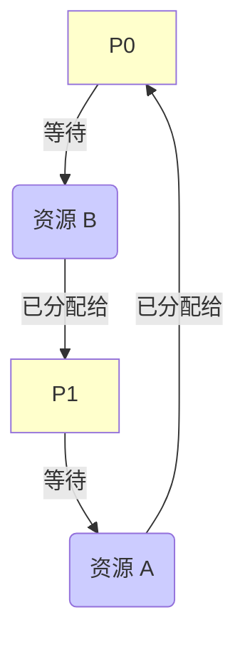

# 第三章：并发与同步

在上一章中，我们学习了进程和线程，它们是操作系统实现并发执行的基础。然而，当多个执行流（进程或线程）同时访问和操作共享资源时，如果没有适当的协调，就可能导致数据不一致、程序错误甚至系统崩溃。本章将深入探讨并发带来的挑战，并介绍用于解决这些问题的核心技术：同步与互斥，以及一个严重的并发问题——死锁。

## 3.1 并发的基本概念

### 3.1.1 并发与并行

首先，需要区分两个密切相关但不同的概念：并发 (Concurrency) 和并行 (Parallelism)。

*   **并发 (Concurrency):** 指**逻辑上**同时处理多个任务的能力。在单核 CPU 系统中，并发通过快速的任务切换（时间片轮转）实现，给人一种多个任务同时运行的错觉，但在任何一个微小时间点上，只有一个任务在真正执行。
*   **并行 (Parallelism):** 指**物理上**同时执行多个任务。这需要有多核处理器或其他并行硬件支持，可以真正地在同一时刻执行多个指令。

**关系:** 并行一定是并发的，但并发不一定是并行的。操作系统需要管理并发执行的实体（进程/线程），无论它们是在单核上交替执行还是在多核上并行执行。

```mermaid
graph TD
    subgraph 单核 CPU (并发)
        direction LR
        T1[Task 1] --> T2[Task 2] --> T1 --> T3[Task 3] --> T2 ...
        CPU1[Core 1]
        CPU1 -.-> T1 & T2 & T3
    end
    subgraph 多核 CPU (并行)
        direction TB
        subgraph Core 1
           P1[Task 1] --> P1 ...
        end
        subgraph Core 2
           P2[Task 2] --> P2 ...
        end
        subgraph Core 3
           P3[Task 3] --> P3 ...
        end
    end
    style 单核 CPU fill:#eee
    style 多核 CPU fill:#eef
```

### 3.1.2 竞争条件与临界区

当多个并发执行的进程/线程访问和操作**共享数据**时，最终结果取决于它们执行的相对顺序，这种情况称为**竞争条件 (Race Condition)**。

**示例：银行账户取款**
假设两个线程 T1 和 T2 同时尝试从共享账户 (balance = 1000) 中取款 100。
理想结果：balance = 800。

可能的执行序列 (假设 `balance -= 100` 分解为 `load`, `sub`, `store` 指令):

| 时间 | T1 (取 100)            | T2 (取 100)            | balance | 说明                           |
| :--- | :--------------------- | :--------------------- | :------ | :----------------------------- |
| t0   | `load R1, balance`     |                        | 1000    | T1 读取 balance (R1=1000)      |
| t1   | `sub R1, 100`          |                        | 1000    | T1 计算新值 (R1=900)         |
| t2   |                        | `load R2, balance`     | 1000    | **切换!** T2 读取 balance (R2=1000) |
| t3   |                        | `sub R2, 100`          | 1000    | T2 计算新值 (R2=900)         |
| t4   |                        | `store R2, balance`    | 900     | T2 写回 balance               |
| t5   | `store R1, balance`    |                        | 900     | **切换!** T1 写回其旧计算结果 | 

**最终结果错误!** balance 应该是 800，但由于竞争条件变成了 900。T2 的操作被 T1 覆盖了。

为了防止竞争条件，我们需要识别并保护访问共享资源的代码段。这段代码称为**临界区 (Critical Section)**。

**临界区问题 (Critical Section Problem):** 设计一套协议，确保当一个进程/线程在执行其临界区代码时，其他进程/线程不能进入它们的临界区。

## 3.2 同步与互斥

为了解决临界区问题并协调并发实体的执行，操作系统和编程语言提供了同步和互斥机制。

### 3.2.1 互斥的概念与要求

**互斥 (Mutual Exclusion):** 保证在任何时刻，最多只有一个进程/线程可以进入临界区访问共享资源。

一个有效的临界区解决方案必须满足以下三个要求：

1.  **互斥 (Mutual Exclusion):** 如果一个进程 P<sub>i</sub> 正在其临界区内执行，那么其他任何进程都不能进入其临界区。
2.  **前进 (Progress):** 如果没有进程在其临界区内执行，并且有若干进程希望进入它们的临界区，那么只有那些不在剩余区 (Remainder Section) 执行的进程可以参与选择下一个进入临界区的进程，并且这个选择不能被无限期地推迟。
3.  **有限等待 (Bounded Waiting):** 从一个进程 P<sub>i</sub> 发出进入临界区的请求，到该请求被允许为止，其他进程允许进入其临界区的次数必须是有限的。（防止饥饿）

### 3.2.2 同步的概念与机制

**同步 (Synchronization):** 比互斥更广泛的概念，指的是协调多个并发进程/线程的执行顺序，以确保它们能够正确地协作完成任务。互斥是同步的一种特殊情况（确保不冲突）。

同步通常用于处理进程/线程间的**依赖关系**。例如，生产者进程生产数据后，消费者进程才能消费数据。

**同步机制**是实现互斥和同步的工具，常见的有：

*   Peterson 算法 (软件方案)
*   硬件原子指令 (Test-and-Set, Swap)
*   信号量 (Semaphore)
*   管程 (Monitor)
*   互斥锁 (Mutex), 条件变量 (Condition Variable), 读写锁 (Read-Write Lock) (常用于线程同步)

## 3.3 解决临界区问题的软件方案

早期尝试主要依赖共享变量来协调。

### 3.3.1 Peterson 算法

Peterson 算法是一个经典的解决**两个进程**临界区问题的软件方案。它使用两个共享变量：

*   `int turn;` : 表示轮到哪个进程进入临界区。
*   `boolean flag[2];` : `flag[i]` 为 true 表示进程 P<sub>i</sub> 希望进入临界区。

**进程 P<sub>i</sub> 的代码 (i=0 或 1, j = 1-i):**

```c
do {
    // Entry Section
    flag[i] = true;  // 表示 Pi 想进入
    turn = j;        // 让对方优先
    while (flag[j] && turn == j) {
        // spin wait: 如果 Pj 也想进，并且轮到 Pj，则 Pi 等待
        ;
    }

    // --- Critical Section --- //
    // ... 访问共享资源 ...

    // Exit Section
    flag[i] = false; // Pi 退出临界区

    // --- Remainder Section --- //

} while (true);
```

**分析:**
*   **互斥:** 如果 P<sub>i</sub> 和 P<sub>j</sub> 同时进入 Entry Section，它们都会设置自己的 flag 为 true。`turn` 最后会被设置为 i 或 j。如果 `turn == j`，P<sub>i</sub> 会在 while 循环等待；如果 `turn == i`，P<sub>j</sub> 会等待。只有一个能跳出循环。
*   **前进:** 如果 P<sub>j</sub> 不想进入 (`flag[j] == false`)，P<sub>i</sub> 不会卡在 while 循环。
*   **有限等待:** P<sub>i</sub> 最多只会在 while 中等待 P<sub>j</sub> 执行一次临界区。因为 P<sub>j</sub> 离开临界区时会设置 `flag[j] = false`，P<sub>i</sub> 就能跳出循环。

**缺点:**
*   只适用于两个进程。
*   依赖于**忙等待 (Busy Waiting)** 或**自旋锁 (Spin Lock)**，即进程在等待时持续消耗 CPU 检测条件，效率低下。
*   在现代乱序执行的处理器上，由于内存读写顺序可能被重排，可能需要内存屏障 (Memory Barrier) 来保证正确性。

## 3.4 解决临界区问题的硬件支持

软件方案通常复杂且效率不高。现代处理器提供硬件级别的支持来简化和加速临界区保护。

### 3.4.1 中断屏蔽

*   **思想:** 在单核处理器上，进入临界区前**禁用中断**，离开临界区后**启用中断**。
*   **效果:** 禁用中断后，时钟中断无法发生，CPU 不会被切换给其他进程，从而保证了当前进程在临界区内执行的原子性。
*   **优点:** 简单有效。
*   **缺点:**
    *   **滥用风险:** 如果临界区过长或忘记开启中断，可能导致系统长时间无响应。
    *   **不适用于多核:** 禁用一个 CPU 的中断无法阻止其他 CPU 上的进程访问共享资源。
    *   **用户态无法使用:** 通常只有内核才能执行禁用/启用中断的特权指令。

### 3.4.2 原子指令 (Atomic Instructions)

处理器提供一些特殊的指令，它们能够**原子地**（不可中断地）执行"读取-修改-写入"操作。常见的原子指令有：

1.  **Test-and-Set Lock (TSL)**
    *   `boolean TestAndSet(boolean *target)`
    *   **功能:** 原子地读取 `*target` 的当前值，然后将其设置为 `true`，并返回读取到的旧值。
    *   **使用:** 用一个共享的布尔变量 `lock` (初始为 `false`)。
        ```c
        // Entry Section
        while (TestAndSet(&lock)) {
            // spin wait if lock was already true
            ;
        }

        // --- Critical Section --- //

        // Exit Section
        lock = false;
        ```

2.  **Compare-and-Swap (CAS)**
    *   `int CompareAndSwap(int *value, int expected, int new_value)`
    *   **功能:** 原子地比较 `*value` 和 `expected`。
        *   如果相等，则将 `*value` 设置为 `new_value`，并返回 1 (或 true)。
        *   如果不相等，则不做任何操作，并返回 0 (或 false)。
    *   **使用 (实现锁):** 用一个共享整数 `lock` (0表示未锁，1表示已锁)。
        ```c
        // Entry Section
        while (CompareAndSwap(&lock, 0, 1) == 0) { // Attempt to acquire lock (set 0 to 1)
            // spin wait if lock is not 0 (already locked)
            ;
        }
        
        // --- Critical Section --- //
        
        // Exit Section
        lock = 0; // Release lock
        ```

3.  **Fetch-and-Add / Atomic Increment/Decrement 等**

**优点:**
*   适用于多核处理器。
*   可以用来构建更复杂的同步原语。

**缺点:**
*   仍然可能涉及忙等待。
*   不能直接保证"有限等待"要求（需要配合其他机制）。
*   实现复杂同步逻辑（如条件等待）仍然困难。

## 3.5 信号量 (Semaphore)

信号量是由荷兰计算机科学家 Edsger Dijkstra 在 1965 年提出的一种强大的同步工具，可以避免忙等待。

### 3.5.1 信号量的定义与操作

信号量 `S` 是一个整数变量，只能通过两个**原子操作**来访问：

1.  **`wait(S)` 或 `P(S)` (来自荷兰语 Proberen, 尝试):**
    ```c
    wait(S) {
        while (S <= 0) {
            // busy wait (原始定义)
            // or block the process/thread (现代实现)
        }
        S--; // 原子操作
    }
    ```
    如果 `S > 0`，则将其减 1 并继续执行。如果 `S <= 0`，则进程/线程**阻塞**（挂起），直到 S 变为正数。

2.  **`signal(S)` 或 `V(S)` (来自荷兰语 Verhogen, 增加):**
    ```c
    signal(S) {
        S++; // 原子操作
        // if any process/thread is blocked on S, wake one up
    }
    ```
    将 S 加 1。如果之前有进程/线程因 `wait(S)` 而阻塞，则唤醒其中一个。

**关键在于 `wait` 和 `signal` 操作必须是原子的。**

**信号量类型:**

*   **计数信号量 (Counting Semaphore):** S 的值可以取任意非负整数。用于表示可用资源的数量。
*   **二进制信号量 (Binary Semaphore) / 互斥量 (Mutex):** S 的值只能是 0 或 1。用于实现互斥。`wait` 操作相当于获取锁，`signal` 操作相当于释放锁。

### 3.5.2 使用信号量解决同步问题 (生产者-消费者问题)

**问题描述:** 一个或多个生产者进程产生数据放入缓冲区，一个或多个消费者进程从缓冲区取出数据消费。缓冲区大小有限。需要保证：
*   生产者不能在缓冲区满时放入数据。
*   消费者不能在缓冲区空时取出数据。
*   对缓冲区的访问是互斥的。

**解决方案 (使用信号量):**
假设缓冲区大小为 `N`。

*   `mutex`: 二进制信号量，用于互斥访问缓冲区，初始值为 1。
*   `empty`: 计数信号量，表示缓冲区空闲单元的数量，初始值为 `N`。
*   `full`: 计数信号量，表示缓冲区已占用单元的数量，初始值为 0。

**生产者代码:**
```c
do {
    // ... produce an item ...

    wait(empty); // 等待有空位 (空位 > 0?)
    wait(mutex); // 获取缓冲区访问权限

    // --- Add item to buffer --- //

    signal(mutex); // 释放缓冲区访问权限
    signal(full);  // 通知有产品了 (产品数 + 1)

} while (true);
```

**消费者代码:**
```c
do {
    wait(full);  // 等待有产品 (产品数 > 0?)
    wait(mutex); // 获取缓冲区访问权限

    // --- Remove item from buffer --- //

    signal(mutex); // 释放缓冲区访问权限
    signal(empty); // 通知有空位了 (空位 + 1)

    // ... consume the item ...

} while (true);
```

**注意 `wait` 操作的顺序:** 必须先 `wait` 资源信号量 (`empty` 或 `full`)，再 `wait` 互斥信号量 (`mutex`)。否则可能导致死锁（例如，生产者拿到 `mutex` 后发现 `empty` 为 0 而阻塞，消费者想消费却拿不到 `mutex`）。

### 3.5.3 使用信号量解决互斥问题

使用一个二进制信号量 `mutex` (初始值为 1) 即可实现临界区互斥：

```c
do {
    wait(mutex); // Acquire lock

    // --- Critical Section --- //

    signal(mutex); // Release lock

    // --- Remainder Section --- //

} while (true);
```

### 3.5.4 信号量的实现

为了避免忙等待，现代信号量的 `wait` 和 `signal` 操作通常这样实现：

*   每个信号量关联一个等待队列（包含等待该信号量的进程 PCB）。
*   **`wait(S)`:**
    *   将 S 的值减 1。
    *   如果 `S < 0`，则将当前进程/线程放入 S 的等待队列，并调用调度程序切换到其他进程（**阻塞**）。`abs(S)` 的值表示等待队列中的进程数。
*   **`signal(S)`:**
    *   将 S 的值加 1。
    *   如果 `S <= 0`，则从 S 的等待队列中移除一个进程/线程，并将其放入就绪队列（**唤醒**）。

这种实现方式将忙等待转化为了阻塞等待，CPU 可以去执行其他任务。

## 3.6 管程 (Monitor)

虽然信号量很强大，但使用时容易出错（例如 `wait`/`signal` 顺序错误、忘记 `signal` 等）。为了更易用地实现同步，Per Brinch Hansen 和 C.A.R. Hoare 提出了**管程 (Monitor)** 的概念。

### 3.6.1 管程的概念与结构

管程是一种**高级程序设计语言构造**，它提供了一种结构化的方式来封装共享数据以及对这些数据的操作，并自动保证**互斥**。

**管程的特点:**

1.  **封装:** 将共享数据（变量）和操作这些数据的过程（函数/方法）封装在一个模块（管程）内部。
2.  **互斥:** 任何时刻最多只有一个进程/线程能在管程内部执行其过程。这是由编译器或运行时系统自动保证的，程序员无需显式编写互斥代码。
3.  **局部数据:** 管程内部的数据只能通过管程提供的过程来访问。

```mermaid
graph TD
    Monitor[管程 (Monitor)]
    subgraph Monitor
        SharedData[共享数据]
        Proc1[过程 1]
        Proc2[过程 2]
        ...
        Init[初始化代码]
        CV1(条件变量 1)
        CV2(条件变量 2)
    end

    P1(进程/线程 A)
    P2(进程/线程 B)
    EntryQueue(入口等待队列)

    P1 -- 调用 Proc1 --> EntryQueue;
    P2 -- 调用 Proc2 --> EntryQueue;
    EntryQueue -->|调度进入| Monitor;
    Monitor -->|执行完毕| Exit(离开管程);

    Proc1 -.-> SharedData;
    Proc2 -.-> SharedData;
    Proc1 -.-> CV1 & CV2;
    Proc2 -.-> CV1 & CV2;

    style Monitor fill:#ccf, stroke:#333
```

### 3.6.2 条件变量 (Condition Variable)

管程只保证了互斥，但有时我们需要让一个正在管程中执行的进程/线程在**某个条件不满足时暂停等待**，并在条件满足时被唤醒。这通过**条件变量 (Condition Variable)** 实现。

每个条件变量 `x` 关联一个等待队列，并支持两个主要操作：

1.  **`x.wait()`:**
    *   调用此操作的进程/线程**立即阻塞**，并被放入条件变量 `x` 的等待队列中。
    *   同时，它**释放管程的互斥权**，允许其他进程/线程进入管程。
2.  **`x.signal()`:**
    *   如果 `x` 的等待队列中有进程/线程正在等待，则唤醒其中**一个**。
    *   **注意:** 被唤醒的进程并不立即执行，而是进入管程的入口等待队列，重新竞争进入管程的权利。
    *   如果 `x` 的等待队列为空，`signal` 操作通常无效果。

**`signal` 操作的语义争议 (Hoare vs. Mesa):**
*   **Hoare 语义 (原始):** `signal` 后，被唤醒者立即抢占当前执行者，获得管程互斥权。当前执行者阻塞。
*   **Mesa 语义 (更常用):** `signal` 后，被唤醒者进入入口队列，当前执行者继续执行。被唤醒者需要重新检查条件 (通常 `wait` 在 `while` 循环中)。

### 3.6.3 使用管程解决同步问题

以**生产者-消费者问题**为例，使用管程（假设 Mesa 语义）：

```java
monitor BoundedBuffer {
    Item buffer[N];
    int count = 0; // Number of items in buffer
    int in = 0, out = 0; // Buffer indices

    condition notFull; // Condition: buffer is not full
    condition notEmpty; // Condition: buffer is not empty

    procedure deposit(Item item) {
        while (count == N) { // Buffer full?
            notFull.wait(); // Wait until buffer is not full
        }
        buffer[in] = item;
        in = (in + 1) % N;
        count++;
        notEmpty.signal(); // Signal that buffer is no longer empty
    }

    procedure remove() returns Item {
        Item item;
        while (count == 0) { // Buffer empty?
            notEmpty.wait(); // Wait until buffer is not empty
        }
        item = buffer[out];
        out = (out + 1) % N;
        count--;
        notFull.signal(); // Signal that buffer is no longer full
        return item;
    }
}
```

**生产者调用 `BoundedBuffer.deposit(item)`**
**消费者调用 `item = BoundedBuffer.remove()`**

管程简化了同步编程，将互斥和条件等待封装起来，减少了程序员出错的可能性。Java 中的 `synchronized` 关键字和 `wait()`, `notify()`, `notifyAll()` 方法就是基于管程思想实现的。

## 3.7 死锁 (Deadlock)

在多道程序系统中，进程/线程需要申请和使用资源（如 CPU、内存、文件、设备）。如果资源分配不当，可能导致一组进程/线程无限期地等待对方持有的资源，从而无法继续执行，这种情况称为**死锁 (Deadlock)**。

### 3.7.1 死锁的概念与产生的必要条件

**定义:** 如果在一个进程集合中，每个进程都在等待只能由该集合中的其他进程才能引发的事件（通常是释放资源），那么该集合中的进程就处于死锁状态。

**死锁产生的四个必要条件 (Coffman 条件):** 必须同时满足！

1.  **互斥 (Mutual Exclusion):** 资源是独占性的，一次只能被一个进程使用。
2.  **占有并等待 (Hold and Wait):** 进程至少占有一个资源，并且正在等待获取其他进程当前占有的资源。
3.  **不可抢占 (No Preemption):** 资源不能被强制从占有它的进程中剥夺，只能由进程自愿释放。
4.  **循环等待 (Circular Wait):** 存在一个等待进程集合 {P<sub>0</sub>, P<sub>1</sub>, ..., P<sub>n</sub>}，使得 P<sub>0</sub> 等待 P<sub>1</sub> 占有的资源，P<sub>1</sub> 等待 P<sub>2</sub> 占有的资源，...，P<sub>n-1</sub> 等待 P<sub>n</sub> 占有的资源，P<sub>n</sub> 等待 P<sub>0</sub> 占有的资源。


*上图展示了一个简单的 P0 和 P1 循环等待资源 A 和 B 的死锁场景。*

### 3.7.2 资源分配图 (Resource-Allocation Graph)

资源分配图是描述进程与资源之间分配和请求关系的有向图，用于可视化和分析死锁。

*   **节点:**
    *   圆形节点 P: 表示进程。
    *   方形节点 R: 表示资源类型。方框内的点表示该类型资源的实例数量。
*   **边:**
    *   **请求边 (Request Edge):** P<sub>i</sub> -> R<sub>j</sub> 表示进程 P<sub>i</sub> 正在请求资源 R<sub>j</sub> 的一个实例。
    *   **分配边 (Assignment Edge):** R<sub>j</sub> -> P<sub>i</sub> 表示资源 R<sub>j</sub> 的一个实例已经分配给了进程 P<sub>i</sub>。

**死锁判定:**
*   **如果图中没有环:** 系统一定**没有**发生死锁。
*   **如果图中有环:**
    *   **每种资源只有一个实例:** **一定**发生死锁。
    *   **每种资源有多个实例:** **可能**发生死锁。（环是死锁的必要非充分条件）

```mermaid
graph TD
    subgraph 资源分配图示例 (有死锁)
        P1 --> R1{Resource 1, 1 instance};
        R1 --> P2;
        P2 --> R2{Resource 2, 1 instance};
        R2 --> P1;
    end
    style R1 fill:#f9f
    style R2 fill:#ccf
```
*上图 R1 和 R2 都只有一个实例，存在环 P1->R1->P2->R2->P1，发生死锁。*

```mermaid
graph TD
    subgraph 资源分配图示例 (无死锁)
        P1 --> R1{Resource 1, 2 instances};
        R1 -- instance 1 --> P2;
        R1 -- instance 2 --> P3;
        P2 --> R2{Resource 2, 1 instance};
        R2 --> P1;
        P3 --> R1; # P3 请求 R1 (但 R1 都被分配了)
    end
    style R1 fill:#f9f
    style R2 fill:#ccf
```
*上图存在环 P1->R1->P2->R2->P1，但 R1 有两个实例。如果 P3 释放 R1 的实例 2，P1 可以获得 R1，然后释放 R2，P2 可以获得 R2，系统不会死锁。*

**处理死锁的方法主要有三种：**

1.  **死锁预防 (Deadlock Prevention):** 破坏死锁产生的四个必要条件之一或多个。
2.  **死锁避免 (Deadlock Avoidance):** 在资源分配前，判断此次分配是否会导致系统进入不安全状态，如果是则拒绝分配。
3.  **死锁检测与恢复 (Deadlock Detection and Recovery):** 允许死锁发生，但系统能检测到死锁，并采取措施解除死锁。

### 3.7.3 死锁预防

通过确保四个必要条件中至少有一个不成立来预防死锁。

1.  **破坏互斥 (Break Mutual Exclusion):**
    *   **方法:** 允许资源共享。例如，只读文件可以共享。
    *   **局限:** 对于打印机、写入文件等本身必须互斥的资源无效。
2.  **破坏占有并等待 (Break Hold and Wait):**
    *   **方法 1:** 要求进程在开始执行前，**一次性申请**所有需要的资源。只有全部分配成功才开始运行。
    *   **方法 2:** 允许进程只持有它当前需要的资源。如果需要新资源，必须先释放当前持有的所有资源，然后重新申请。
    *   **局限:** 资源利用率低（很多资源申请了但暂时不用）；可能导致饥饿（需要稀有资源的进程可能一直等不到）。
3.  **破坏不可抢占 (Break No Preemption):**
    *   **方法 1:** 如果一个持有资源的进程 P<sub>i</sub> 请求另一个不能立即分配的资源，则 P<sub>i</sub> 必须释放当前持有的所有资源。这些资源加入 P<sub>i</sub> 的等待列表。
    *   **方法 2:** 如果进程 P<sub>i</sub> 请求资源 R<sub>j</sub>，而 R<sub>j</sub> 被进程 P<sub>k</sub> 持有，且 P<sub>k</sub> 正在等待其他资源，则可以抢占 P<sub>k</sub> 持有的 R<sub>j</sub> 分配给 P<sub>i</sub>。
    *   **局限:** 实现复杂；只适用于状态易于保存和恢复的资源（如 CPU、内存），不适用于打印机等。
4.  **破坏循环等待 (Break Circular Wait):**
    *   **方法:** 对所有资源类型进行**线性排序** (R<sub>1</sub>, R<sub>2</sub>, ..., R<sub>m</sub>)。要求每个进程按递增顺序申请资源。即，如果进程持有 R<sub>i</sub>，它只能再申请 R<sub>j</sub> (j > i)。
    *   **证明:** 不可能形成循环等待。假设存在循环 P<sub>0</sub> -> P<sub>1</sub> -> ... -> P<sub>n</sub> -> P<sub>0</sub>，P<sub>i</sub> 等待 P<sub>i+1</sub> 持有的资源。设 P<sub>i</sub> 持有 R<sub>a</sub>，请求 P<sub>i+1</sub> 持有的 R<sub>b</sub>。根据规则，必须 `order(R_a) < order(R_b)`。这样推下去，会得到 `order(R_{P0}) < order(R_{P1}) < ... < order(R_{Pn}) < order(R_{P0})`，产生矛盾。
    *   **局限:** 资源排序困难；可能限制资源的正常使用；不方便。

死锁预防通常会降低资源利用率或系统吞吐量。

### 3.7.4 死锁避免 (银行家算法)

死锁避免允许前三个必要条件存在，但在资源分配时动态检查，确保系统**不会进入不安全状态 (Unsafe State)**。

*   **安全状态 (Safe State):** 系统存在一个**安全序列 (Safe Sequence)** <P<sub>1</sub>, P<sub>2</sub>, ..., P<sub>n</sub>>，使得对于每个 P<sub>i</sub>，它将来所需的最大资源量（Max - Allocation）能够被当前可用资源 (Available) 加上所有排在它前面的进程 P<sub>j</sub> (j < i) 持有的资源 (Allocation<sub>j</sub>) 所满足。如果存在这样的序列，系统就能按此序列逐个执行完所有进程，不会死锁。
*   **不安全状态:** 不存在安全序列。**不安全状态不一定会导致死锁**，但系统无法保证能避免死锁。
*   **死锁避免的目标:** 始终保持系统处于安全状态。

**银行家算法 (Banker's Algorithm):** 最著名的死锁避免算法，适用于**每种资源有多个实例**的情况。

**前提:**
*   每个进程必须预先声明它可能需要的**每种资源的最大数量 (Max)**。
*   进程持有资源的时间是有限的。

**数据结构:** (n = 进程数, m = 资源类型数)
*   `Available[m]`: 当前每种资源的可用实例数。
*   `Max[n][m]`: 每个进程 P<sub>i</sub> 对每种资源 R<sub>j</sub> 的最大需求。
*   `Allocation[n][m]`: 每个进程 P<sub>i</sub> 当前已分配到的每种资源 R<sub>j</sub> 的数量。
*   `Need[n][m]`: 每个进程 P<sub>i</sub> 还需要的每种资源 R<sub>j</sub> 的数量。 `Need[i][j] = Max[i][j] - Allocation[i][j]`。

**算法流程:**
1.  **安全性检查算法 (Safety Algorithm):** 判断当前系统状态是否安全。
    a. 初始化 `Work = Available`, `Finish[n] = false` (所有进程未完成)。
    b. 查找是否存在一个进程 P<sub>i</sub> 满足： `Finish[i] == false` 且 `Need[i] <= Work` (向量比较)。
    c. 如果找到这样的 P<sub>i</sub>：
        *   `Work = Work + Allocation[i]` (模拟 P<sub>i</sub> 执行完并释放资源)
        *   `Finish[i] = true`
        *   回到步骤 b。
    d. 如果找不到这样的 P<sub>i</sub>：
        *   如果所有 `Finish[i]` 都为 `true`，则系统处于**安全状态**。
        *   否则，系统处于**不安全状态**。

2.  **资源请求算法 (Resource-Request Algorithm):** 当进程 P<sub>i</sub> 请求资源 `Request[m]` 时：
    a. 检查请求是否合法： `Request[i] <= Need[i]`。若否则出错。
    b. 检查资源是否足够： `Request[i] <= Available`。若否则 P<sub>i</sub> 必须等待。
    c. **试探性分配:** 假装把资源分配给 P<sub>i</sub>：
        *   `Available = Available - Request[i]`
        *   `Allocation[i] = Allocation[i] + Request[i]`
        *   `Need[i] = Need[i] - Request[i]`
    d. **调用安全性检查算法**检查这个新状态是否安全。
    e. **决策:**
        *   如果新状态安全，则**正式分配**资源给 P<sub>i</sub>。
        *   如果新状态不安全，则**拒绝** P<sub>i</sub> 的请求，并**恢复**步骤 c 中的修改。P<sub>i</sub> 继续等待。

**银行家算法的优缺点:**
*   **优点:** 允许进程按需申请资源，资源利用率比死锁预防高；能确保系统不进入死锁状态。
*   **缺点:**
    *   需要预先知道进程的最大资源需求，这在实际中很难。
    *   进程数量和资源类型是固定的。
    *   计算开销较大，每次请求都需要运行安全性检查。
    *   进程持有资源的时间是有限的假设不一定成立。

由于这些限制，银行家算法在通用操作系统中很少使用，但在某些资源分配可预测的专用系统中可能有用。

### 3.7.5 死锁检测与恢复

如果系统既不采用死锁预防也不采用死锁避免，那么就可能发生死锁。这种策略需要提供：
1.  一个**检测算法**来判断系统是否已发生死锁。
2.  一个**恢复算法**来解除死锁。

**死锁检测:**
*   **每种资源只有一个实例:** 使用资源分配图，**检测图中是否存在环**。可以使用标准的图遍历算法（如 DFS）来检测环。时间复杂度 O(n+e)，n 是进程数，e 是边数。
*   **每种资源有多个实例:** 类似银行家算法的安全性检查，但不做预判，而是检测当前状态。
    *   **数据结构:** `Available`, `Allocation`, `Request` (表示当前进程请求的资源)。
    *   **算法:**
        a. 初始化 `Work = Available`, `Finish[n] = false` (假设 `Allocation[i]` 不全为 0 的进程 `Finish` 为 false)。
        b. 查找是否存在一个进程 P<sub>i</sub> 满足： `Finish[i] == false` 且 `Request[i] <= Work`。
        c. 如果找到这样的 P<sub>i</sub>：
            *   `Work = Work + Allocation[i]`
            *   `Finish[i] = true`
            *   回到步骤 b。
        d. 如果找不到这样的 P<sub>i</sub>：
            *   如果存在某个 `Finish[i] == false`，则系统**处于死锁状态**。这些 `Finish[i] == false` 的进程就是死锁进程。
            *   如果所有 `Finish[i]` 都为 `true`，则系统**没有**死锁。
*   **检测频率:** 可以定期运行，或在 CPU 利用率低于某个阈值时运行，或在每次资源请求失败时运行。

**死锁恢复:**
当检测到死锁后，需要采取措施解除。

1.  **进程终止 (Process Termination):**
    *   **终止所有死锁进程:** 简单粗暴，代价大，之前的工作全部丢失。
    *   **一次终止一个进程直到死锁消除:** 需要按某种顺序选择牺牲者（如优先级最低、已运行时间最短、占用资源最少、产生的输出最少等）。每次终止后都需要重新运行检测算法。
2.  **资源抢占 (Resource Preemption):**
    *   **选择牺牲者:** 选择哪个进程的哪些资源被抢占（考虑代价最小化）。
    *   **回滚 (Rollback):** 被抢占资源的进程需要回滚到某个安全状态，并重新执行。可能需要系统支持检查点 (Checkpoint)。
    *   **饥饿问题:** 需要确保同一个进程不会总是被选为牺牲者。

死锁恢复的代价通常很高。

**实际操作系统策略:**
大多数通用操作系统（如 Windows, Linux/UNIX）**基本上忽略死锁问题**。它们认为死锁发生的概率较低，而预防、避免、检测和恢复的代价太高，会影响系统性能。这种策略依赖于程序员来避免死锁，或者在死锁发生时由用户或管理员手动干预（如重启进程或系统）。但在数据库系统等对一致性要求极高的场景，通常会实现死锁检测和恢复机制。

## 3.8 原子事务

原子事务 (Atomic Transaction) 是数据库和某些操作系统（特别是分布式系统）中用于保证数据一致性的重要机制。一个事务是一系列操作的集合，这些操作要么**全部成功执行**，要么**全部不执行**（像一个原子操作一样）。

虽然与本章讨论的底层同步机制（信号量、管程）不同层面，但事务内部通常也需要使用锁等机制来保证并发访问时的数据一致性和隔离性，并且需要处理事务间的死锁问题。

## 3.9 总结

本章探讨了并发执行带来的核心挑战以及相应的解决方案。

*   我们理解了**竞争条件**的产生原因以及**临界区**的概念，明确了解决临界区问题需要满足**互斥、前进、有限等待**三个条件。
*   介绍了解决互斥问题的软件方案 (Peterson)、硬件支持 (中断屏蔽、原子指令)。
*   详细学习了**信号量**，包括其 P/V 操作、计数与二进制类型，以及如何用它解决经典的生产者-消费者同步问题和实现互斥。
*   学习了更高级的同步构造——**管程**，它封装了共享数据和过程，并自动提供互斥，通过**条件变量**实现等待和唤醒机制。
*   深入讨论了**死锁**问题，包括其产生的四个必要条件（互斥、占有并等待、不可抢占、循环等待）、资源分配图。
*   分析了处理死锁的三种策略：
    *   **死锁预防:** 破坏必要条件。
    *   **死锁避免:** 使用银行家算法等确保系统处于安全状态。
    *   **死锁检测与恢复:** 允许死锁发生，然后检测并解除（终止进程或抢占资源）。

并发控制是操作系统设计的核心难点之一。选择合适的同步机制，正确地使用它们，并合理地处理死锁问题，对于构建稳定、高效的多任务系统至关重要。下一章，我们将转向另一个核心资源的管理——内存管理。 