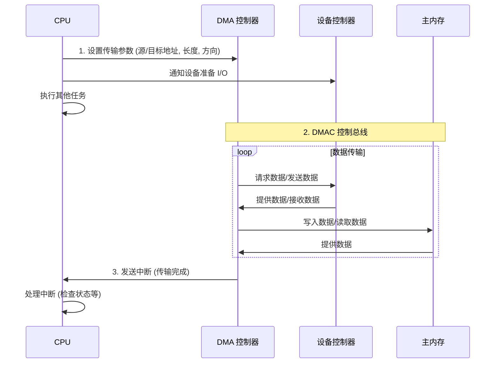
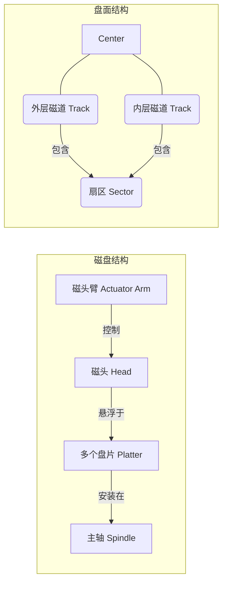

# 第六章：输入/输出管理

输入/输出 (I/O) 管理是操作系统的核心功能之一，负责控制和协调计算机系统与外部设备（如键盘、鼠标、显示器、磁盘、网络接口等）之间的数据交换。有效的 I/O 管理对于系统性能、可靠性和用户体验至关重要。

## 6.1 I/O 硬件基础

理解 I/O 管理首先需要了解相关的硬件组件。

### 6.1.1 I/O 设备分类

I/O 设备种类繁多，可以根据不同特性分类：

*   **按交互对象:**
    *   **人机交互设备:** 键盘、鼠标、显示器、打印机等（速度相对慢，面向用户）。
    *   **机机交互设备:** 磁盘驱动器、网络接口、传感器、控制器等（速度范围广，用于系统间或系统与环境交互）。
    *   **存储设备:** 磁盘、磁带、SSD、光盘驱动器等（用于数据持久化）。
*   **按传输速率:** 从慢速（键盘，几 B/s）到高速（高速网络接口、GPU，几 GB/s）。
*   **按数据传输单位:**
    *   **字符设备 (Character Device):** 以字节流方式传输数据，不可寻址（如键盘、鼠标、串口）。
    *   **块设备 (Block Device):** 以固定大小的数据块（Block）方式传输数据，可寻址（如磁盘、SSD）。
    *   **网络设备 (Network Device):** 以变长报文方式传输数据。

### 6.1.2 总线结构

计算机内部组件（CPU、内存、I/O 设备控制器）通过**总线 (Bus)** 连接。

*   **传统结构:** CPU、内存、I/O 设备共享同一总线（如 PCI 总线）。简单但易产生瓶颈。
*   **现代结构 (典型 PC):**
    *   **内存总线 (Memory Bus):** 高速，连接 CPU 和主内存。
    *   **高速 I/O 总线 (如 PCIe - PCI Express):** 连接高速设备（显卡、高速网卡、NVMe SSD）。通过**桥 (Bridge)** 连接到内存总线。
    *   **低速 I/O 总线 (如 PCI, USB, SATA):** 连接低速设备（传统硬盘、键盘、鼠标、声卡）。通过桥连接到高速 I/O 总线或直接连接到芯片组。

```mermaid
graph TD
    CPU <--> MemBridge[内存桥/北桥];
    MemBridge <--> Memory[主内存];
    MemBridge <--> PCIeBus{高速 I/O 总线 (PCIe)};

    PCIeBus <--> GPU[显卡];
    PCIeBus <--> NVMe[NVMe SSD];
    PCIeBus <--> HighSpeedNIC[高速网卡];
    PCIeBus <--> IOBridge[I/O 桥/南桥];

    IOBridge <--> USBController[USB 控制器];
    IOBridge <--> SATAController[SATA 控制器];
    IOBridge <--> LegacyBus{低速总线 (PCI/LPC...)};

    USBController --> USBPort[USB 设备];
    SATAController --> HDD[硬盘/SATA SSD];
    LegacyBus --> SoundCard[声卡];
    LegacyBus --> SlowNIC[低速网卡];

    subgraph 现代 PC 总线结构示例
        CPU; Memory; MemBridge;
        PCIeBus; GPU; NVMe; HighSpeedNIC; IOBridge;
        LegacyBus; USBController; SATAController; SoundCard; SlowNIC;
        USBPort; HDD;
    end
```

### 6.1.3 控制器与端口

*   **设备控制器 (Device Controller):** 每个 I/O 设备（或一组同类设备）通常有一个设备控制器。这是一个电子部件（通常是芯片或电路板），负责将设备的物理信号转换为操作系统可理解的接口（如寄存器、内存映射区域）。控制器处理设备的具体操作细节，如控制电机、转换串并信号等。
*   **I/O 端口 (I/O Port):** CPU 与设备控制器通信的一种方式。每个控制器有一组端口地址，CPU 通过特殊的 I/O 指令（如 `in`, `out`）读写这些端口来发送命令、读取状态、传输数据。
*   **内存映射 I/O (Memory-Mapped I/O):** 另一种更现代、更常用的通信方式。将设备控制器的寄存器和数据缓冲区**映射**到物理内存地址空间的一部分。CPU 可以像访问普通内存一样，使用标准的加载/存储指令（如 `mov`, `ldr`, `str`）来访问设备控制器，无需特殊 I/O 指令。

### 6.1.4 直接内存访问 (DMA)

对于高速块设备（如磁盘、网络接口），如果让 CPU 负责逐字节或逐字地在内存和设备控制器之间传输数据（称为**程序控制 I/O, Programmed I/O, PIO**），会占用大量 CPU 时间，效率低下。

**直接内存访问 (Direct Memory Access, DMA)** 机制允许设备控制器直接与主内存进行数据传输，**无需 CPU 的干预**（除了初始设置和结束通知）。

*   **DMA 控制器 (DMAC):** 一个专门的硬件模块，负责执行 DMA 传输。
*   **工作流程:**
    1.  **CPU 设置 DMAC:** CPU 告诉 DMAC 要传输的数据的源地址、目标地址、传输长度以及传输方向（读/写设备）。
    2.  **DMAC 执行传输:** DMAC 控制总线，在设备控制器和内存之间直接传输数据。CPU 在此期间可以执行其他任务。
    3.  **DMAC 通知 CPU:** 数据传输完成后，DMAC 通过向 CPU 发送一个**中断 (Interrupt)** 来通知传输已完成。



*   **优点:** 极大提高了大数据量传输的效率，解放了 CPU。
*   **挑战:** DMA 控制器和 CPU 可能竞争内存总线访问权（**周期窃取 Cycle Stealing**）。需要内存管理单元（MMU）配合，确保 DMA 使用物理地址，并处理虚拟地址到物理地址的转换（或使用 IOMMU）。

## 6.2 I/O 软件层次结构

为了管理复杂多样的 I/O 设备并向应用程序提供简洁统一的接口，操作系统中的 I/O 软件通常设计成层次结构。

```mermaid
graph TD
    UserApp[用户应用程序]
    UserLib[用户库函数 (stdio, socket API...)]
    KernelBoundary[--- 内核空间 ---]
    DeviceIndep[独立于设备的 I/O 软件]
    DeviceDrivers[设备驱动程序]
    InterruptHandlers[中断处理程序]
    HardwareBoundary[--- 硬件 ---]
    DeviceCtrl[设备控制器]
    Device[物理设备]

    UserApp --> UserLib;
    UserLib --> SysCall{系统调用接口 (read, write, ioctl...)};
    SysCall --> DeviceIndep;
    DeviceIndep --> DeviceDrivers;
    DeviceDrivers --> InterruptHandlers;
    InterruptHandlers --> DeviceCtrl;
    DeviceCtrl --> Device;
    Device --> DeviceCtrl;
    DeviceCtrl --> InterruptHandlers;
    InterruptHandlers --> DeviceDrivers;
    DeviceDrivers --> DeviceIndep;
    DeviceIndep --> SysCall;

    subgraph 用户空间
        UserApp; UserLib;
    end
    subgraph 内核空间
        SysCall; DeviceIndep; DeviceDrivers; InterruptHandlers;
    end
```

### 6.2.1 中断处理程序 (Interrupt Handlers)

*   **位置:** 最底层，直接与硬件交互。
*   **功能:** 当 I/O 设备完成操作或发生错误时，会向 CPU 发送中断信号。中断处理程序负责捕获中断，保存当前进程状态，识别中断源，并执行相应的处理（如唤醒等待该设备完成的驱动程序）。处理必须非常快。

### 6.2.2 设备驱动程序 (Device Drivers)

*   **位置:** 内核中，与特定类型的设备控制器交互。
*   **功能:** 理解特定设备控制器的寄存器、命令和操作方式。将上层传来的抽象 I/O 请求（如"读取块 5"）转换为具体的设备指令（如向控制器端口写入命令字），启动设备操作，处理中断通知，并将结果和状态返回给上层。每个设备类型都需要一个驱动程序。
*   **特点:** 是操作系统中最容易出错、最需要频繁更新的部分之一，因为硬件种类繁多且不断变化。

### 6.2.3 独立于设备的 I/O 软件 (Device-Independent I/O Software)

*   **位置:** 设备驱动程序之上。
*   **功能:** 提供**统一**的 I/O 接口给内核的其他部分（如文件系统）和用户程序。负责：
    *   **设备命名:** 将抽象设备名（如 `/dev/sda1`）映射到具体驱动程序。
    *   **设备保护:** 检查用户是否有权限访问该设备。
    *   **提供统一的块大小:** 对块设备隐藏不同的物理扇区大小，提供统一的逻辑块大小。
    *   **缓冲 (Buffering):** 见 6.4.2。
    *   **错误报告:** 向上传递来自驱动程序的错误信息。
    *   **分配和释放:** 管理设备的独占访问（如磁带机）。

### 6.2.4 用户空间的 I/O 软件 (User-Space I/O Software)

*   **位置:** 用户空间，通常以库函数形式提供。
*   **功能:**
    *   **库函数 (Library Routines):** 提供方便易用的 I/O 接口给应用程序员（如 C 库中的 `printf()`, `scanf()`, `fopen()`, `fread()`）。这些库函数最终会调用内核提供的系统调用。
    *   **Spooling (假脱机):** 用于管理某些独占使用的慢速设备（如打印机）。当多个进程请求打印时，不是让它们直接访问打印机，而是将打印任务先写入磁盘上的**假脱机目录 (Spool Directory)** 中的文件。一个后台守护进程 (Daemon) 按顺序从目录中读取文件并发送给打印机。这样，应用程序可以快速完成"打印"操作，而打印机可以持续工作。

## 6.3 I/O 请求处理

应用程序发起 I/O 请求后，其执行模式有多种。

### 6.3.1 阻塞 I/O 与 非阻塞 I/O (Blocking vs. Non-blocking I/O)

描述的是应用程序发起 I/O 系统调用后，**是否立即返回**。

*   **阻塞 I/O (Blocking I/O):**
    *   当应用程序发起 I/O 操作（如 `read()`）时，如果数据尚未准备好（如等待网络数据、等待磁盘读取），该系统调用会**阻塞 (Block)** 调用进程，使其进入等待状态，直到操作完成。
    *   简单，但进程在等待期间无法做其他事情。
*   **非阻塞 I/O (Non-blocking I/O):**
    *   当应用程序发起 I/O 操作时，如果数据尚未准备好，系统调用会**立即返回**一个错误码（如 `EWOULDBLOCK` 或 `EAGAIN`），表示操作无法立即完成。
    *   应用程序需要**轮询 (Polling)** 或使用其他机制（如 `select`, `poll`, `epoll`, `kqueue`）来检查 I/O 操作何时完成。
    *   允许应用程序在等待 I/O 时执行其他任务，但轮询可能浪费 CPU 资源。

### 6.3.2 同步 I/O 与 异步 I/O (Synchronous vs. Asynchronous I/O)

描述的是应用程序发起 I/O 操作后，**内核通知应用程序 I/O 完成的方式**，以及**数据在内核空间和用户空间之间复制的时机**。

*   **同步 I/O (Synchronous I/O):**
    *   应用程序发起 I/O 请求后，**必须等待**该 I/O 操作真正完成（数据从内核缓冲区复制到用户缓冲区，或从用户缓冲区复制到内核缓冲区）后，系统调用才返回。
    *   阻塞 I/O 是同步 I/O 的一种。非阻塞 I/O 在轮询并最终等待数据复制完成时也是同步的。
*   **异步 I/O (Asynchronous I/O, AIO):**
    *   应用程序发起 I/O 请求后，系统调用**立即返回**，应用程序可以继续执行其他任务。
    *   内核在后台处理 I/O 操作（包括数据在内核与设备间传输、数据在内核与用户空间间复制）。
    *   当整个 I/O 操作（包括数据复制到用户空间）完成后，内核通过某种机制（如**信号 (Signal)** 或**回调函数 (Callback)**）通知应用程序。
    *   真正的异步，应用程序在发起请求和收到完成通知之间完全无需关心 I/O 过程。

**模型对比:**

| 模型           | 发起调用是否阻塞? | 等待数据是否阻塞? | 等待复制是否阻塞? | 通知机制     | 示例 (Unix/Linux)                        |
| -------------- | ----------------- | ----------------- | ----------------- | ------------ | ---------------------------------------- |
| **阻塞 I/O**   | 是                | 是                | 是                | 返回值       | `read()`, `write()` (默认)               |
| **非阻塞 I/O** | 否                | 否 (需轮询)       | 是 (轮询到后)     | 返回值/轮询  | `read()/write()` (O_NONBLOCK) + `select/poll` |
| **I/O 多路复用**| 是 (select/poll)  | 是 (select/poll)  | 是 (数据可用后)   | select/poll 返回 | `select()`, `poll()`, `epoll()` + `read()/write()` |
| **信号驱动 I/O**| 否                | 否 (等信号)       | 是 (信号触发后)   | 信号         | `sigaction()` + `read()/write()` (O_ASYNC) |
| **异步 I/O**   | 否                | 否                | 否                | 信号/回调    | `aio_read()`, `aio_write()`              |

*(I/O 多路复用和信号驱动有时也被归类为同步 I/O，因为最终的数据复制阶段仍需应用进程参与等待)*

## 6.4 内核 I/O 子系统

内核的 I/O 子系统（主要是独立于设备的部分和驱动程序）提供了多种服务来优化 I/O 操作。

### 6.4.1 I/O 调度 (I/O Scheduling)

*   **目的:** 对于共享的块设备（特别是机械硬盘），通过重新排序 I/O 请求队列来提高整体吞吐量和公平性，减少磁头寻道时间。
*   **实现:** 内核维护一个或多个 I/O 请求队列，并使用调度算法决定下一个要处理的请求。磁盘调度算法将在 6.5.2 详细讨论。

### 6.4.2 缓冲 (Buffering)

*   **目的:**
    *   **处理速度不匹配:** 缓和高速 CPU/内存与慢速 I/O 设备之间的速度差异。
    *   **处理传输大小不匹配:** 适配不同设备（如网络、磁盘）的数据单元大小。
    *   **支持写操作的复制语义 (Copy Semantics):** 应用程序调用 `write()` 后，数据被复制到内核缓冲区，应用程序可以立即继续执行并修改其缓冲区，内核负责将缓冲区内容写入设备。
*   **实现:** 在内存中分配缓冲区，用于临时存储传入或传出的数据。
    *   **单缓冲:** 一个缓冲区。设备填充时，内核处理；内核填充时，设备处理。可能产生等待。
    *   **双缓冲:** 两个缓冲区。设备填充一个时，内核可以处理另一个，反之亦然。实现流水线操作，提高效率。
    *   **循环缓冲:** 多个缓冲区组成的循环队列。更灵活。

### 6.4.3 高速缓存 (Caching)

*   **目的:** 保存最近访问过的磁盘块的副本在内存中，以便快速响应后续的访问请求。
*   **实现:** 类似于缓冲，但缓存主要用于**加速读操作**（和部分写操作）。如果请求的块在缓存中（缓存命中），则直接从内存读取，避免磁盘 I/O。
*   **管理:** 使用 LRU 等替换算法管理缓存内容。写操作通常采用写回策略以提高性能。
*   **与缓冲的关系:** 缓冲和缓存经常结合使用，甚至统一管理（如统一缓冲缓存）。缓冲主要解决速度/大小匹配和复制语义，缓存主要解决读加速。

### 6.4.4 Spooling 与 设备预留

*   **Spooling (假脱机):** 如 6.2.4 所述，通过磁盘缓冲区管理对独占慢速设备的并发访问（如打印机）。
*   **设备预留 (Device Reservation):** 对于某些需要独占访问的设备（如磁带机），操作系统提供机制（如 `ioctl` 系统调用）允许进程显式地请求独占访问，并在使用完毕后释放。防止其他进程干扰。

### 6.4.5 错误处理

*   **重要性:** I/O 操作容易出错（如设备故障、传输错误、介质损坏）。
*   **处理:** I/O 子系统必须能够检测并处理错误。
    *   低级错误（如校验和错误）可能由控制器或驱动程序尝试重试。
    *   无法恢复的错误需要向上传递给应用程序（通常通过系统调用的返回值或错误码 `errno`）。
    *   文件系统层面可能需要进行更复杂的恢复（如使用日志）。

### 6.4.6 I/O 保护

*   **目的:** 防止用户进程直接访问 I/O 端口或内存映射的控制器寄存器，避免干扰操作系统或其他进程。
*   **实现:**
    *   将所有 I/O 操作相关的指令设为**特权指令 (Privileged Instructions)**，只能在内核模式下执行。
    *   用户进程必须通过**系统调用 (System Call)** 请求内核代为执行 I/O 操作。
    *   对于内存映射 I/O，内存管理单元 (MMU) 配合进行保护，阻止用户进程访问映射到内核空间或设备控制器的内存地址。

## 6.5 磁盘结构与调度

磁盘（特别是机械硬盘 HDD）是主要的二级存储设备，其物理特性对 I/O 性能有显著影响。

### 6.5.1 磁盘物理结构 (HDD)

*   **盘片 (Platter):** 一个或多个圆形盘片，双面涂有磁性材料。
*   **磁头 (Head):** 每个盘面对应一个磁头，悬浮在盘面上方读写数据。所有磁头固定在一个**磁头臂 (Actuator Arm)** 上，同步移动。
*   **磁道 (Track):** 盘面上的一圈同心圆。
*   **柱面 (Cylinder):** 所有盘面上半径相同的磁道的集合。
*   **扇区 (Sector):** 磁道被划分成若干个扇区，是磁盘读写的最小物理单位（通常 512B 或 4KB）。
*   **磁盘访问时间 = 寻道时间 + 旋转延迟 + 传输时间**
    *   **寻道时间 (Seek Time):** 将磁头臂移动到目标磁道（柱面）所需的时间。是 HDD 访问时间的主要组成部分，通常为几毫秒。
    *   **旋转延迟 (Rotational Latency):** 等待目标扇区旋转到磁头下方所需的时间。平均为磁盘旋转半圈的时间（如 7200 RPM 磁盘约为 4.17ms）。
    *   **传输时间 (Transfer Time):** 实际读写数据所需的时间。取决于转速和传输数据量，通常远小于前两者。



**固态硬盘 (SSD):** 与 HDD 不同，SSD 使用闪存芯片存储数据，没有移动部件。访问时间主要是电子读写延迟，没有寻道时间和旋转延迟，速度远快于 HDD，且随机访问和顺序访问速度差异不大。但 SSD 有写入寿命限制（擦写次数）和垃圾回收开销。

### 6.5.2 磁盘调度算法

当有多个 I/O 请求等待访问磁盘时，磁盘调度算法决定处理请求的顺序，主要目标是**减少总寻道时间**。

假设请求队列访问的柱面号为：`98, 183, 37, 122, 14, 124, 65, 67`，当前磁头在柱面 `53`。

#### 6.5.2.1 FCFS 调度 (First-Come, First-Served)

*   **方法:** 按请求到达的顺序处理。
*   **优点:** 公平，简单。
*   **缺点:** 效率低，可能导致磁头移动距离很长。
*   **示例:** `53 -> 98 -> 183 -> 37 -> 122 -> 14 -> 124 -> 65 -> 67`
    *   总寻道距离: (98-53) + (183-98) + (183-37) + (122-37) + (122-14) + (124-14) + (124-65) + (67-65) = 45 + 85 + 146 + 85 + 108 + 110 + 59 + 2 = 640 个柱面。

#### 6.5.2.2 SSTF 调度 (Shortest Seek Time First)

*   **方法:** 选择与当前磁头位置**寻道距离最短**的请求进行处理。
*   **优点:** 平均寻道时间短，吞吐量高。
*   **缺点:** 可能导致**饥饿 (Starvation)**，即离当前磁头较远的请求可能长时间得不到服务。
*   **示例:** `53 -> 65 -> 67 -> 37 -> 14 -> 98 -> 122 -> 124 -> 183`
    *   总寻道距离: (65-53) + (67-65) + (67-37) + (37-14) + (98-14) + (122-98) + (124-122) + (183-124) = 12 + 2 + 30 + 23 + 84 + 24 + 2 + 59 = 236 个柱面 (远优于 FCFS)。

#### 6.5.2.3 SCAN 调度 (Elevator Algorithm / 电梯算法)

*   **方法:** 磁头在一个方向上移动（如从外到内），处理沿途所有请求，到达磁盘末端后再反向移动，处理沿途请求。
*   **优点:** 克服了 SSTF 的饥饿问题，寻道时间分布更均匀。
*   **缺点:** 对两端的请求不利（刚经过又要等很久才回来）。
*   **示例 (假设开始向内移动):** `53 -> 37 -> 14 -> (到 0) -> 65 -> 67 -> 98 -> 122 -> 124 -> 183`
    *   总寻道距离: (53-37) + (37-14) + (14-0) + (65-0) + (67-65) + (98-67) + (122-98) + (124-122) + (183-124) = 16 + 23 + 14 + 65 + 2 + 31 + 24 + 2 + 59 = 236 个柱面 (此例中与 SSTF 相同，但不总是)。

#### 6.5.2.4 C-SCAN 调度 (Circular SCAN)

*   **方法:** 对 SCAN 的改进。磁头只在一个方向上处理请求（如从外到内）。到达末端后，**立即快速返回**到起始端，**不处理返回途中的请求**，然后重新开始同方向扫描。
*   **优点:** 提供了比 SCAN 更均匀的等待时间。
*   **示例 (假设向内处理):** `53 -> 37 -> 14 -> (到 0, 快速返回到最外层) -> 183 -> 124 -> 122 -> 98 -> 67 -> 65`
    *   总寻道距离: (53-37) + (37-14) + (14-0) + (199-0) [假设最外层199] + (199-183) + (183-124) + (124-122) + (122-98) + (98-67) + (67-65) = 16 + 23 + 14 + 199 + 16 + 59 + 2 + 24 + 31 + 2 = 386 (通常比 SCAN 略大，但等待时间更公平)。

#### 6.5.2.5 LOOK 与 C-LOOK 调度

*   **方法:** SCAN 和 C-SCAN 的优化。磁头移动到该方向上**最远**的请求处即反向（LOOK）或快速返回（C-LOOK），**不必移动到磁盘的物理末端**。
*   **优点:** 减少了不必要的寻道移动。
*   **C-LOOK 示例 (向内处理):** `53 -> 37 -> 14 -> (不必到 0, 直接快速返回到最远请求 183) -> 183 -> 124 -> 122 -> 98 -> 67 -> 65`
    *   总寻道距离: (53-37) + (37-14) + (183-14) [假设快速返回] + (183-124) + (124-122) + (122-98) + (98-67) + (67-65) = 16 + 23 + 169 + 59 + 2 + 24 + 31 + 2 = 326 (比 C-SCAN 好)。

**选择:** C-LOOK 是现代操作系统中常用的磁盘调度算法，它在吞吐量和公平性之间取得了较好的平衡。对于 SSD，寻道时间几乎为零，调度算法的影响很小，通常使用 FCFS 或简单的 NOOP (No Operation) 调度器。

### 6.5.3 磁盘格式化与引导块

*   **低级格式化 (Low-Level Formatting / 物理格式化):** 在磁盘出厂前或由工具进行。在盘面上划分磁道和扇区，为每个扇区写入头、尾和数据区，包含扇区号、校验和 (ECC) 等信息。标记出厂时的坏扇区。
*   **分区 (Partitioning):** 将磁盘划分为一个或多个逻辑分区。分区表存储在磁盘的特定位置（如 MBR 或 GPT）。
*   **高级格式化 (High-Level Formatting / 逻辑格式化):** 在分区上创建文件系统。写入文件系统的元数据结构（如引导块、超级块、空闲空间信息、根目录等）。
*   **引导块 (Boot Block):** 磁盘的第一个扇区（或分区的第一个扇区）通常是引导块。包含**引导加载程序 (Bootstrap Loader)** 的代码。系统启动时，BIOS/UEFI 会读取引导块代码并执行，该代码负责加载操作系统的内核到内存并启动它。引导块通常独立于文件系统。

### 6.5.4 坏块管理 (Bad Block Management)

*   **原因:** 磁盘介质可能存在缺陷或在使用中损坏，导致某些扇区无法可靠读写。
*   **处理:**
    *   **控制器处理 (常见于现代磁盘/SSD):** 控制器内部维护一个坏块列表，并预留一些备用扇区。当检测到坏块时，控制器自动将坏块地址**重映射 (Remap)** 到一个备用扇区，对操作系统透明。称为**扇区备用 (Sector Sparing)** 或**滑移 (Slipping)**。
    *   **操作系统处理 (较少见):** 如果控制器不支持或操作系统需要管理，文件系统可以在格式化时检测坏块（如 `badblocks` 命令），并在空闲空间管理结构中将其标记为不可用。

## 6.6 RAID 结构

**RAID (Redundant Array of Independent Disks)** 是一种将多个独立的物理磁盘组合起来，形成一个逻辑存储单元的技术，旨在提高性能、可靠性或两者兼备。

### 6.6.1 RAID 级别

不同的 RAID 级别通过不同的数据分布和冗余方式实现不同目标：

*   **RAID 0 (Stripe Set / 条带卷):**
    *   **数据分布:** 数据被分成条带 (Stripe)，**交错**写入多个磁盘。
    *   **冗余:** **无冗余**。
    *   **优点:** 性能高（读写操作可并行在多磁盘上进行）。
    *   **缺点:** 可靠性低（任何一个磁盘故障会导致所有数据丢失）。
    *   **最少磁盘数:** 2
*   **RAID 1 (Mirror Set / 镜像卷):**
    *   **数据分布:** 数据**完全相同**地写入两个（或更多）磁盘（镜像）。
    *   **冗余:** 高冗余。
    *   **优点:** 可靠性高（一个磁盘故障不影响数据可用性）；读性能可能提高（可从任一磁盘读取）。
    *   **缺点:** 成本高（存储效率只有 50%）；写性能可能略有下降（需写入所有磁盘）。
    *   **最少磁盘数:** 2
*   **RAID 5 (Stripe Set with Distributed Parity / 带分布式奇偶校验的条带卷):**
    *   **数据分布:** 数据分条带写入多个磁盘，同时计算**奇偶校验 (Parity)** 信息，并将校验信息**分布式**存储在不同的磁盘上。
    *   **冗余:** 允许**一个**磁盘故障。故障磁盘的数据可以通过其他磁盘上的数据和校验信息重建。
    *   **优点:** 在性能、容量和可靠性之间取得较好平衡。
    *   **缺点:** 写操作较复杂（需要读旧数据、旧校验，计算新校验，写新数据、新校验，称为**读-修改-写**），性能可能受影响；磁盘故障后重建过程会降低性能。
    *   **最少磁盘数:** 3
*   **RAID 6 (Stripe Set with Dual Distributed Parity):**
    *   **数据分布:** 类似于 RAID 5，但使用**两种**独立的奇偶校验信息（如 P+Q 校验），分布式存储。
    *   **冗余:** 允许**两个**磁盘同时故障。
    *   **优点:** 可靠性高于 RAID 5。
    *   **缺点:** 写性能比 RAID 5 更差（计算和写入双重校验）；成本更高（需要两个磁盘容量用于校验）。
    *   **最少磁盘数:** 4
*   **RAID 10 (RAID 1+0 / Stripe of Mirrors):**
    *   **结构:** 先将磁盘两两组成 RAID 1 镜像对，再将这些镜像对组成 RAID 0 条带卷。
    *   **优点:** 兼具 RAID 1 的高可靠性（每个镜像组允许坏一个盘）和 RAID 0 的高性能。
    *   **缺点:** 成本高（存储效率 50%）。
    *   **最少磁盘数:** 4

```mermaid
graph TD
    subgraph RAID 0 (Stripe)
        Disk0["Disk 0: A1, A3, B1, B3..."]
        Disk1["Disk 1: A2, A4, B2, B4..."]
    end
    subgraph RAID 1 (Mirror)
        DiskM0["Disk 0: A1, A2, B1, B2..."]
        DiskM1["Disk 1: A1, A2, B1, B2..."]
    end
    subgraph RAID 5 (Distributed Parity)
        DiskP0["Disk 0: A1, B1, C1, DP..."]
        DiskP1["Disk 1: A2, B2, CP, D1..."]
        DiskP2["Disk 2: A3, BP, C2, D2..."]
        DiskP3["Disk 3: AP, B3, C3, D3..."]
    end
    subgraph RAID 10 (Stripe of Mirrors)
        Mirror1{RAID 1 (Pair 1)}
        Mirror2{RAID 1 (Pair 2)}
        Stripe{RAID 0}

        DiskR10_0["Disk 0: A1, B1..."]
        DiskR10_1["Disk 1: A1, B1..."]
        DiskR10_2["Disk 2: A2, B2..."]
        DiskR10_3["Disk 3: A2, B2..."]

        DiskR10_0 & DiskR10_1 --> Mirror1;
        DiskR10_2 & DiskR10_3 --> Mirror2;
        Mirror1 & Mirror2 --> Stripe;
    end
```

### 6.6.2 RAID 的优缺点

**优点:**
*   **提高性能:** 通过并行读写（RAID 0, 5, 6, 10）。
*   **提高可靠性/容错性:** 通过数据冗余（RAID 1, 5, 6, 10）。
*   **扩展存储容量:** 将多个小磁盘组合成一个大逻辑卷。

**缺点:**
*   **成本:** 需要多个磁盘；冗余级别会降低有效存储容量。
*   **复杂性:** 实现和管理相对复杂。
*   **写惩罚 (Write Penalty):** 对于需要计算和写入校验的级别（RAID 5, 6），写操作性能可能下降。
*   **相关性故障:** 不能防止电源、控制器、软件或人为错误等导致所有磁盘同时失效的问题。

RAID 可以通过**硬件 RAID 控制卡**实现（对 OS 透明），也可以通过**操作系统软件**实现（如 Linux mdadm, Windows 存储空间）。

## 6.7 总结

I/O 管理是连接操作系统与外部世界的桥梁，其设计对系统整体表现有重大影响。
*   **硬件基础**涉及设备分类、总线结构、控制器接口（端口、内存映射）以及用于高效传输的 DMA。
*   **软件层次结构**通过中断处理、设备驱动、独立于设备的软件和用户库函数，实现了对多样化设备的统一管理和抽象。
*   **I/O 请求处理模型**包括阻塞/非阻塞、同步/异步，影响应用程序的编程方式和并发性能。
*   **内核 I/O 子系统**通过调度、缓冲、缓存、Spooling、错误处理和保护等机制优化 I/O 效率和可靠性。
*   **磁盘 (HDD)** 的物理特性（寻道、旋转）催生了各种**磁盘调度算法**（FCFS, SSTF, SCAN, C-SCAN, LOOK, C-LOOK）以优化寻道时间。
*   **磁盘准备**涉及格式化、分区和引导块。
*   **RAID 技术**通过组合多个磁盘来提高性能和/或可靠性，提供了多种级别以满足不同需求。

理解 I/O 系统的各个层面，有助于设计高效的应用程序、配置合理的系统以及诊断性能瓶颈。 