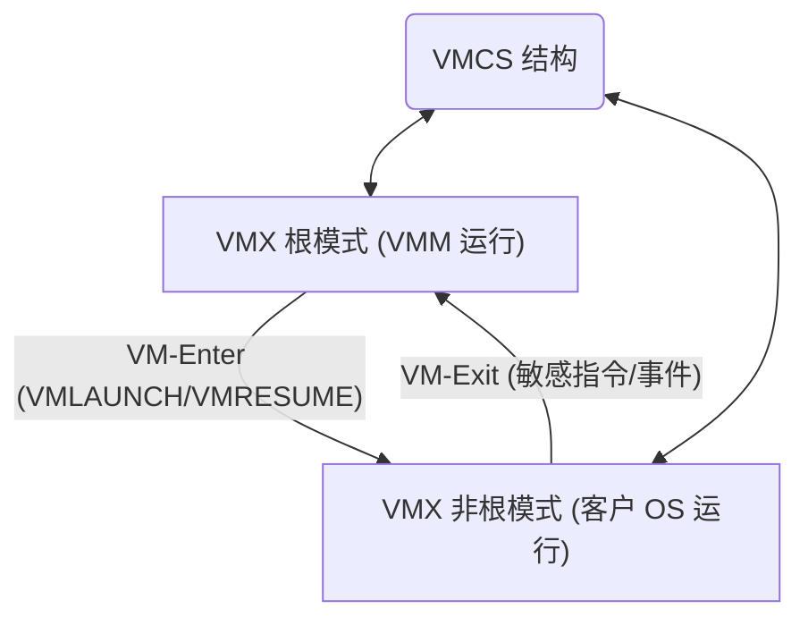
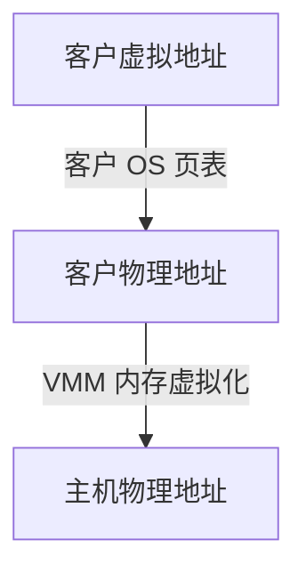
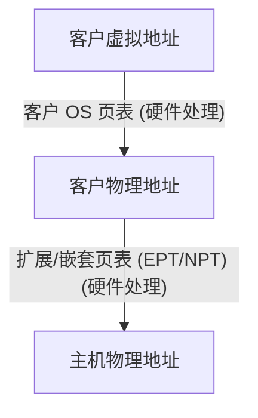

# 第七章：虚拟化技术

虚拟化技术允许在一台物理计算机上运行多个操作系统或应用程序实例，仿佛它们各自独占硬件资源。它是云计算、服务器整合和现代 IT 基础设施的基石。

## 7.1 虚拟化概述

### 7.1.1 虚拟化的概念与优势

*   **概念:** 虚拟化是指通过软件或硬件辅助技术，将物理硬件资源（CPU、内存、存储、网络）抽象出来，创建出逻辑上的、虚拟化的资源视图。这些虚拟资源可以被分配给一个或多个虚拟机 (Virtual Machine, VM) 或容器 (Container)。
*   **核心思想:** 在物理硬件和操作系统/应用程序之间引入一个**虚拟化层 (Virtualization Layer)**，通常称为**虚拟机监视器 (Virtual Machine Monitor, VMM)** 或 **Hypervisor**。
*   **优势:**
    *   **服务器整合 (Server Consolidation):** 在单台物理服务器上运行多个虚拟机，提高硬件利用率，降低硬件、电力和空间成本。
    *   **资源优化:** 动态分配和调整虚拟机的资源，提高资源利用效率。
    *   **隔离性 (Isolation):** 每个虚拟机是独立的，一个虚拟机的故障或安全问题通常不会影响其他虚拟机。
    *   **灵活性与敏捷性:** 快速创建、部署、迁移和复制虚拟机，加快应用部署和测试。
    *   **遗留系统支持:** 在现代硬件上运行旧的或不兼容的操作系统和应用程序。
    *   **灾难恢复:** 虚拟机易于备份和恢复到其他物理主机上。
    *   **沙箱环境 (Sandbox):** 提供安全的隔离环境用于测试、开发或运行不可信应用。

```mermaid
graph TD
    subgraph 传统架构
        App1[应用 1] --> OS1[操作系统 1];
        OS1 --> HW1[物理硬件 1];
        App2[应用 2] --> OS2[操作系统 2];
        OS2 --> HW2[物理硬件 2];
    end
    subgraph 虚拟化架构
        AppV1a[应用 V1a] --> OSV1[操作系统 VM1];
        AppV1b[应用 V1b] --> OSV1;
        AppV2[应用 V2] --> OSV2[操作系统 VM2];
        AppV3[应用 V3] --> OSV3[操作系统 VM3];

        OSV1 --> Hypervisor{Hypervisor (VMM)};
        OSV2 --> Hypervisor;
        OSV3 --> Hypervisor;

        Hypervisor --> HW_Shared[共享物理硬件];
    end
```

### 7.1.2 虚拟化技术分类

虚拟化可以根据不同的维度进行分类：

*   **按虚拟化对象:**
    *   **服务器虚拟化 (Server Virtualization):** 在物理服务器上运行多个操作系统实例（VM）。这是最常见的虚拟化类型。
    *   **桌面虚拟化 (Desktop Virtualization):** 将用户的桌面环境（操作系统、应用、数据）作为虚拟机在数据中心运行，用户通过网络远程访问。
    *   **应用程序虚拟化 (Application Virtualization):** 将应用程序与底层操作系统隔离，使其能在不同系统上运行而无需安装。
    *   **存储虚拟化 (Storage Virtualization):** 将多个物理存储设备池化，提供统一的逻辑存储视图。
    *   **网络虚拟化 (Network Virtualization):** 将物理网络资源（交换机、路由器、防火墙）抽象为逻辑网络服务。
*   **按虚拟化层级/实现方式:**
    *   **完全虚拟化 (Full Virtualization):** VMM 模拟完整的硬件环境，客户操作系统 (Guest OS) 无需修改即可运行。性能可能有损耗（特别是 I/O）。
    *   **半虚拟化 (Paravirtualization, PV):** 需要**修改**客户操作系统内核，使其能感知到自己运行在虚拟环境中，并主动与 VMM 协作。通常性能优于完全虚拟化（特别是 I/O），但兼容性受限。
    *   **硬件辅助虚拟化 (Hardware-Assisted Virtualization):** 利用 CPU 提供的特殊指令集（如 Intel VT-x, AMD-V）来辅助 VMM 处理敏感指令和特权级转换，提高完全虚拟化的性能。
    *   **操作系统级虚拟化 (OS-Level Virtualization / 容器化):** 在宿主操作系统 (Host OS) 内核之上创建多个隔离的用户空间实例（容器）。所有容器共享宿主机的内核，开销极小，启动快，密度高，但只能运行与宿主机内核兼容的操作系统。

## 7.2 CPU 虚拟化

CPU 虚拟化的核心挑战在于如何处理客户操作系统的**敏感指令 (Sensitive Instructions)**（那些试图访问或修改 CPU 特权状态的指令）和**特权指令 (Privileged Instructions)**（只能在最高特权级（Ring 0）执行的指令）。

**x86 架构的挑战:** x86 架构最初并非为虚拟化设计。它有多个特权级（Ring 0-3），但某些敏感指令（如 `popf` 读取标志寄存器）在非 Ring 0 也能执行，只是行为不同，这使得传统的**陷入-模拟 (Trap-and-Emulate)** 方式难以直接应用。

### 7.2.1 特权级与陷入模拟 (Trap-and-Emulate)

*   **理想模型 (非 x86):** VMM 运行在最高特权级，客户操作系统运行在较低特权级。当客户操作系统执行敏感或特权指令时，CPU 自动产生**陷阱 (Trap)**，将控制权交给 VMM。VMM **模拟 (Emulate)** 该指令的行为，然后将控制权返回给客户操作系统。
*   **x86 难题:** 由于某些敏感指令在 Ring 1/3 不会产生陷阱，直接运行客户 OS 在 Ring 1 会导致错误。

### 7.2.2 二进制翻译 (Binary Translation, BT)

*   **早期 x86 虚拟化方案 (如 VMware):** VMM 在运行时动态扫描客户操作系统的代码块。识别出其中的敏感和特权指令，将其**翻译**成能在用户态安全执行的等效指令序列（或产生 Trap 的指令）。非敏感指令则直接在 CPU 上执行。
*   **优点:** 实现了在未经修改的 x86 硬件上进行完全虚拟化。
*   **缺点:** 翻译过程复杂，有运行时开销；需要缓存翻译后的代码块 (Translation Cache)。

### 7.2.3 硬件辅助虚拟化 (Intel VT-x, AMD-V)

现代 CPU 提供了硬件支持来解决 x86 虚拟化难题。

*   **Intel VT-x (VMX):** 引入了两种新的操作模式：
    *   **VMX 根操作模式 (VMX Root Operation):** VMM 运行在此模式，拥有完全控制权（类似 Ring 0）。
    *   **VMX 非根操作模式 (VMX Non-Root Operation):** 客户操作系统运行在此模式（可以运行在 Ring 0-3）。
*   **VM-Exit:** 当客户操作系统执行某些敏感指令或发生特定事件（中断、异常）时，硬件会自动从非根模式**退出 (VM-Exit)** 到根模式，将控制权交给 VMM。
*   **VM-Enter:** VMM 处理完 VM-Exit 事件后，通过 `VMRESUME` 或 `VMLAUNCH` 指令**进入 (VM-Enter)** 非根模式，恢复客户操作系统执行。
*   **VMCS (Virtual Machine Control Structure):** 内存中的数据结构，用于保存和恢复 VMM 和客户机的状态，控制 VM-Exit/VM-Enter 的行为。
*   **AMD-V (SVM):** AMD 的等效技术，使用 `VMRUN` 指令进入客户机，通过 **VMEXIT** 退出。



*   **优点:** 大大简化了 VMM 的设计，减少了二进制翻译的需要，提高了性能。
*   **现代虚拟化:** 目前主流的 VMM（如 KVM, VMware ESXi, Hyper-V）都利用硬件辅助虚拟化技术。

## 7.3 内存虚拟化

内存虚拟化旨在为每个虚拟机提供独立的、从零开始的、连续的物理地址空间（客户物理地址空间, GPA），并将这些虚拟的物理地址映射到底层真实的机器物理地址（主机物理地址, HPA）。

**挑战:** 客户操作系统自己也维护页表，用于将它的虚拟地址 (GVA) 映射到它认为的物理地址 (GPA)。VMM 需要介入这个过程，最终将 GVA 映射到 HPA。



### 7.3.1 影子页表 (Shadow Page Tables)

*   **早期方案 (无硬件辅助):** VMM 为每个虚拟机维护一个**影子页表 (Shadow Page Table)**。这个影子页表直接将客户虚拟地址 (GVA) 映射到主机物理地址 (HPA)。
*   **工作流程:**
    1.  客户操作系统试图访问或修改自己的页表 (GVA -> GPA)。
    2.  VMM 通过写保护等机制捕获这些访问 (Trap)。
    3.  VMM 模拟客户 OS 的页表修改操作，并相应地更新**影子页表** (GVA -> HPA)。
    4.  当客户机运行时，MMU 直接使用 VMM 维护的影子页表进行地址转换。
*   **优点:** MMU 直接使用优化后的映射，地址转换快。
*   **缺点:** 维护影子页表一致性的开销很大（频繁的 Trap 和模拟）。客户 OS 对页表的每次修改都需要 VMM 介入。

### 7.3.2 扩展页表 (EPT) / 嵌套页表 (NPT)

*   **硬件辅助方案 (Intel EPT / AMD NPT/RVI):** CPU 硬件直接支持两级地址转换。
*   **第一级:** 客户操作系统的页表，将 GVA 转换为 GPA。这一过程由客户 OS 自行管理，硬件直接使用。
*   **第二级:** VMM 维护的**扩展页表 (EPT)** 或**嵌套页表 (NPT)**，将 GPA 转换为 HPA。这一转换由硬件 MMU 自动完成，无需 VMM 介入每次 GVA->GPA 的映射。



*   **优点:** 大大减少了 VMM 的介入次数和开销，显著提高了内存虚拟化的性能。
*   **现代标准:** EPT/NPT 是当前主流的内存虚拟化技术。

## 7.4 I/O 虚拟化

I/O 虚拟化旨在让虚拟机能够访问物理 I/O 设备，同时保持虚拟机的隔离性和可迁移性。

**挑战:** 设备种类繁多；性能要求高；需要处理中断和 DMA。

### 7.4.1 全虚拟化 I/O (Emulated Devices)

*   **方法:** VMM **模拟 (Emulate)** 出一个或多个标准的、通用的虚拟设备（如 E1000 网卡、IDE/SATA 磁盘控制器）。客户操作系统加载这些标准设备的驱动程序。
*   **工作流程:** 当客户 OS 访问虚拟设备寄存器或发出 I/O 命令时，触发 VM-Exit，VMM 捕获该操作，模拟设备行为，并代表客户 OS 与物理设备交互。
*   **优点:** 兼容性好，客户操作系统无需修改，可以使用自带的标准驱动。
*   **缺点:** 性能差，因为每次 I/O 操作都需要 VMM 介入和模拟，开销很大。

### 7.4.2 半虚拟化 I/O (Paravirtualized Devices, VirtIO)

*   **方法:** 定义一套新的、专为虚拟化设计的、高效的虚拟设备接口规范（如 **VirtIO**）。客户操作系统需要安装**特殊的半虚拟化驱动 (PV Driver)** 来与这些 VirtIO 设备交互。
*   **工作流程:** PV 驱动知道自己运行在虚拟环境中，它通过与 VMM 之间高效的通信机制（如共享内存环形缓冲区 Hypercall）直接传递 I/O 请求，避免了模拟真实硬件的开销。
*   **优点:** 性能接近原生硬件，远高于全虚拟化 I/O。
*   **缺点:** 需要在客户操作系统中安装特定的 PV 驱动。VirtIO 已成为事实标准，主流 OS 都支持。

```mermaid
graph TD
    subgraph 全虚拟化 I/O
        GuestOS["客户 OS (标准驱动)"] --> VMM_Emulate{VMM 模拟设备};
        VMM_Emulate --> PhysicalDevice[物理设备];
        Note over VMM_Emulate: 频繁 VM-Exit, 开销大
    end
    subgraph 半虚拟化 I/O (VirtIO)
        GuestOS_PV["客户 OS (VirtIO 驱动)"] <-.-> VMM_VirtIO{VMM VirtIO 后端};
        VMM_VirtIO --> PhysicalDevice_PV[物理设备];
        Note over GuestOS_PV, VMM_VirtIO: 高效通信 (共享内存/Hypercall), 开销小
    end
```

### 7.4.3 I/O 直通 (Passthrough, Device Assignment, SR-IOV)

*   **方法:** 将**物理设备**（或其一部分功能）**直接分配**给某个虚拟机独占使用。VMM 基本不参与该设备的数据路径 I/O 操作。
*   **实现:**
    *   **设备直通 (Passthrough):** 将整个 PCIe 设备（如网卡、GPU）分配给一个 VM。需要 **IOMMU** (Intel VT-d / AMD-Vi) 支持，用于 DMA 地址转换和隔离。
    *   **SR-IOV (Single Root I/O Virtualization):** 一种 PCIe 标准。允许单个物理设备（如网卡）呈现为多个独立的**虚拟功能 (Virtual Function, VF)**。每个 VF 可以被直接分配给一个虚拟机，具有接近原生的性能。物理设备本身还保留一个**物理功能 (Physical Function, PF)** 用于管理。
*   **优点:** 提供**最高**的 I/O 性能，接近原生。
*   **缺点:** 牺牲了虚拟化的部分灵活性（如虚拟机迁移、快照可能受限）；一个设备只能分配给一个 VM（SR-IOV 可以缓解）；需要硬件支持 (IOMMU, SR-IOV)。
*   **应用:** 对 I/O 性能要求极高的场景（如高性能计算、网络功能虚拟化 NFV）。

## 7.5 虚拟机监视器 (VMM) / Hypervisor

Hypervisor 是创建和运行虚拟机的核心软件。

### 7.5.1 Type-1 Hypervisor (裸金属 Bare-Metal)

*   **架构:** 直接安装在物理硬件（裸金属）之上，它本身就是一个迷你的操作系统，负责管理硬件资源并运行虚拟机。
*   **示例:** VMware ESXi, Microsoft Hyper-V Server, Xen (作为 Dom0 控制域), KVM (结合 Linux 内核)。
*   **优点:** 性能好（直接访问硬件），安全性高（攻击面小）。
*   **缺点:** 通常需要专门的管理工具；硬件兼容性列表可能有限制。
*   **应用:** 数据中心、企业虚拟化。

```mermaid
graph TD
    VM1[虚拟机 1 (OS + Apps)]
    VM2[虚拟机 2 (OS + Apps)]
    Hypervisor_T1[Type-1 Hypervisor (ESXi, Hyper-V, Xen, KVM/Linux)]
    Hardware[物理硬件]

    VM1 --> Hypervisor_T1;
    VM2 --> Hypervisor_T1;
    Hypervisor_T1 --> Hardware;
```

### 7.5.2 Type-2 Hypervisor (宿主型 Hosted)

*   **架构:** 作为一个**应用程序**安装在传统的宿主操作系统（如 Windows, macOS, Linux）之上。依赖宿主操作系统来管理硬件访问。
*   **示例:** VMware Workstation/Fusion, Oracle VirtualBox, Parallels Desktop, QEMU (无 KVM)。
*   **优点:** 安装简单方便，易于使用，适合个人用户和开发测试。
*   **缺点:** 性能通常低于 Type-1（多了一层宿主 OS 的开销），安全性依赖于宿主 OS。
*   **应用:** 桌面虚拟化、开发、测试。

```mermaid
graph TD
    VM1[虚拟机 1 (Guest OS + Apps)]
    VM2[虚拟机 2 (Guest OS + Apps)]
    Hypervisor_T2[Type-2 Hypervisor App (VirtualBox, VMware Workstation)]
    HostOS[宿主操作系统 (Windows, Linux, macOS)]
    Hardware[物理硬件]

    VM1 --> Hypervisor_T2;
    VM2 --> Hypervisor_T2;
    Hypervisor_T2 --> HostOS;
    HostOS --> Hardware;
```

**KVM (Kernel-based Virtual Machine):** KVM 是一种特殊的 Type-1 Hypervisor。它本身是 Linux 内核的一个模块，利用 Linux 内核来完成 CPU 和内存虚拟化（依赖硬件辅助），并使用 QEMU (通常) 来模拟设备和处理 I/O。因此，运行 KVM 的 Linux 主机既是宿主 OS，其内核本身又构成了 Hypervisor 的核心部分。

## 7.6 容器化技术 (如 Docker)

容器化是另一种实现操作系统级虚拟化的技术，与传统基于 Hypervisor 的虚拟机不同。

### 7.6.1 容器与虚拟机的区别

| 特性         | 虚拟机 (VM)                         | 容器 (Container)                    |
| ------------ | ----------------------------------- | ----------------------------------- |
| **虚拟化层级** | 硬件层 (Hypervisor)                 | 操作系统层                          |
| **包含内容** | 完整的客户操作系统、库、应用程序    | 应用程序及其依赖库                  |
| **内核**     | 每个 VM 有独立的内核                | 所有容器共享宿主机内核              |
| **隔离性**   | 强隔离 (硬件模拟)                   | 较弱隔离 (进程级隔离)               |
| **大小**     | 大 (GB 级别)                        | 小 (MB 级别)                        |
| **启动速度** | 慢 (分钟级)                         | 快 (秒级甚至毫秒级)                 |
| **性能开销** | 相对较高 (Hypervisor 开销)          | 非常低 (接近原生)                   |
| **密度**     | 低 (单机运行 VM 数量有限)           | 高 (单机可运行大量容器)             |
| **运行 OS**  | 可运行不同类型 OS (Linux, Win 等) | 只能运行与宿主机内核兼容的 OS (通常是同类型 Linux 发行版) |

```mermaid
graph TD
    subgraph 虚拟机架构
        AppA1[App A] --> LibsA[Libs] --> GuestOS_A[Guest OS A];
        AppB1[App B] --> LibsB[Libs] --> GuestOS_B[Guest OS B];
        GuestOS_A --> Hypervisor_VM{Hypervisor};
        GuestOS_B --> Hypervisor_VM;
        Hypervisor_VM --> HostOS_VM[Host OS];
        HostOS_VM --> Hardware_VM[Server];
    end
    subgraph 容器架构
        AppC1[App C] --> LibsC[Libs];
        AppD1[App D] --> LibsD[Libs];
        ContainerEngine{Container Engine (Docker)};
        AppC1 & LibsC --> ContainerEngine;
        AppD1 & LibsD --> ContainerEngine;
        ContainerEngine --> HostOS_C[Host OS];
        HostOS_C --> Hardware_C[Server];
        Note over HostOS_C: 所有容器共享此内核
    end
```

### 7.6.2 命名空间 (Namespaces)

*   **核心机制:** Linux 内核提供的**命名空间 (Namespaces)** 是实现容器隔离的关键技术之一。
*   **作用:** 将全局的系统资源（如进程 ID、网络栈、挂载点、用户 ID、IPC 等）进行划分，使得每个容器拥有自己独立的、看似全局的资源视图。
*   **类型:** 主要有 PID Namespace, Network Namespace, Mount Namespace, UTS Namespace (主机名/域名), User Namespace, IPC Namespace, Cgroup Namespace。
*   **示例:** PID Namespace 使容器内的进程拥有自己从 1 开始的进程 ID，看不到宿主机或其他容器的进程。

### 7.6.3 控制组 (Cgroups)

*   **核心机制:** Linux 内核提供的**控制组 (Control Groups, Cgroups)** 用于限制、记录和隔离一组进程所使用的物理资源（CPU、内存、磁盘 I/O、网络带宽等）。
*   **作用:** 确保容器不会耗尽宿主机资源，实现资源配额和优先级控制。
*   **示例:** 可以限制某个容器最多使用 1 个 CPU 核心和 512MB 内存。

### 7.6.4 联合文件系统 (UnionFS)

*   **目的:** 实现容器镜像的分层存储和高效共享。
*   **方法:** 联合文件系统（如 Aufs, OverlayFS）允许将多个只读的文件系统层和一个可写层**叠加 (Overlay)** 在一起，形成一个统一的文件系统视图。
*   **容器镜像:** Docker 等容器技术使用 UnionFS 构建镜像。基础镜像作为只读层，后续的修改或安装的软件在新的只读层上进行。运行容器时，在顶层添加一个可写层用于容器运行时的修改。
*   **优点:** 镜像层可以被多个容器共享，节省磁盘空间；容器创建快（只需添加可写层）。

## 7.7 云计算与虚拟化

虚拟化技术是**云计算 (Cloud Computing)** 的核心使能技术。

*   **IaaS (Infrastructure as a Service):** 云服务商利用服务器虚拟化技术，向用户提供按需分配的虚拟机、存储和网络资源。用户可以在这些虚拟机上部署任意操作系统和应用。
*   **PaaS (Platform as a Service):** 在 IaaS 基础上，云服务商进一步提供操作系统、编程语言执行环境、数据库和中间件等平台级服务。这可能利用虚拟机或容器技术实现。
*   **SaaS (Software as a Service):** 云服务商直接提供应用程序给最终用户（如 Webmail, CRM）。底层的基础设施和平台由服务商管理，大量使用了虚拟化和自动化技术。

虚拟化使得云计算能够实现资源池化、按需自助服务、快速弹性伸缩和可计量服务等关键特征。

## 7.8 案例研究：VMware, KVM, Xen, Docker

| 技术       | 类型             | 主要特点                                                                 | 优点                                      | 缺点                                      |
| ---------- | ---------------- | ------------------------------------------------------------------------ | ----------------------------------------- | ----------------------------------------- |
| **VMware ESXi** | Type-1 Hypervisor | 成熟的商业产品, 功能丰富 (vMotion, HA, DRS), 性能优异, 图形化管理界面    | 稳定可靠, 生态完善, 支持广泛              | 商业授权费用高, 硬件兼容性要求            |
| **KVM**    | Type-1 (Linux 内核模块) | 开源, 整合进 Linux 内核, 利用 QEMU 进行设备模拟, 性能好 (接近原生)        | 免费开源, 灵活性高, 与 Linux 生态紧密集成 | 功能相对 ESXi 可能较少 (需配合管理工具)   |
| **Xen**    | Type-1 Hypervisor | 开源, 支持 PV 和 HVM, Dom0 控制域架构, 曾是许多公有云的基础 (如早期 AWS) | 架构成熟, 性能较好 (尤其 PV)              | 架构相对复杂, 近年 KVM 更流行           |
| **Docker** | 容器化 (OS 级虚拟化) | 轻量级, 快速部署, 分层镜像 (UnionFS), 强大的生态系统 (Dockerfile, Hub) | 启动快, 资源开销小, 密度高, 便于 CI/CD | 隔离性不如 VM, 只能运行 Linux (通常)    |

## 7.9 总结

虚拟化技术通过引入虚拟化层（Hypervisor 或 OS 内核特性），将物理资源抽象为虚拟资源，实现了硬件资源的共享、隔离和高效管理。
*   **CPU 虚拟化**通过陷入模拟、二进制翻译或硬件辅助（VT-x/AMD-V）处理敏感指令。
*   **内存虚拟化**通过影子页表或硬件辅助（EPT/NPT）管理客户机地址空间到主机物理地址的映射。
*   **I/O 虚拟化**提供全虚拟化（兼容性好）、半虚拟化（性能好，如 VirtIO）和设备直通（性能最高）等方案。
*   **Hypervisor** 分为 Type-1（裸金属）和 Type-2（宿主型），各有优劣。
*   **容器化**（如 Docker）是一种轻量级的 OS 级虚拟化技术，利用命名空间和 Cgroups 实现隔离和资源限制，通过联合文件系统管理镜像。
*   虚拟化是**云计算**的核心基础。

理解不同虚拟化技术的原理、优势和局限性，有助于在不同场景下选择和应用合适的技术，以满足性能、隔离性、灵活性和成本等方面的需求。 