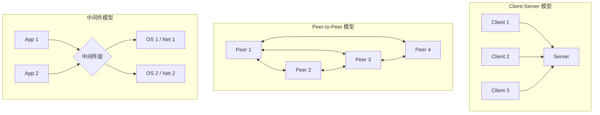
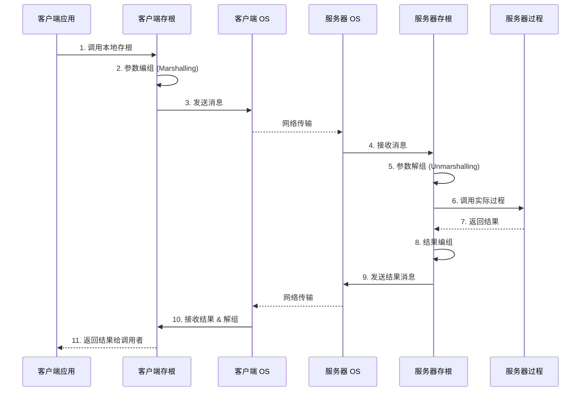
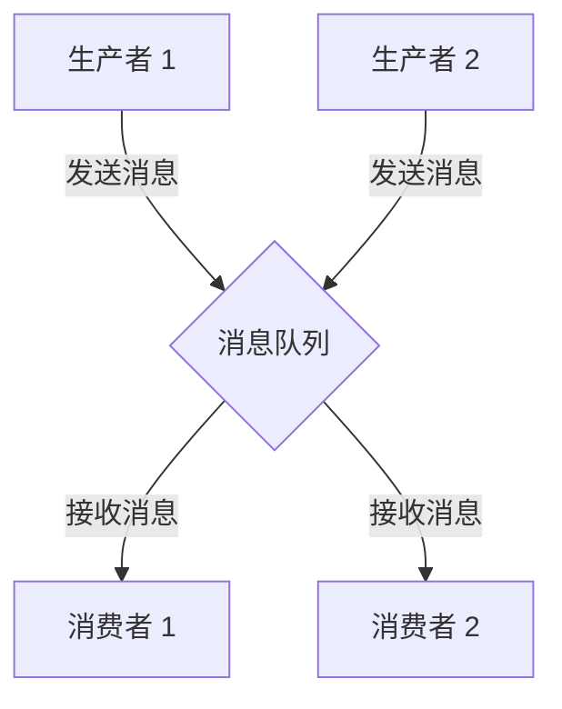
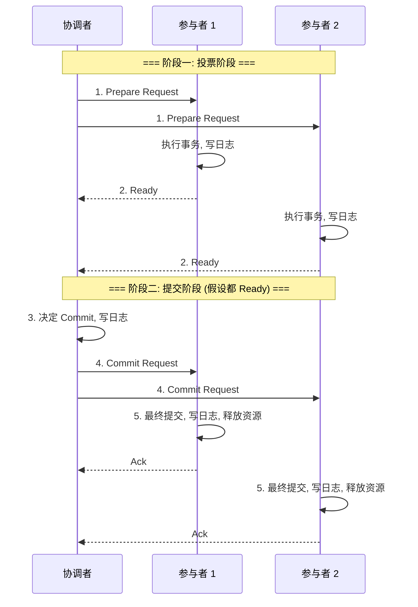

# 第八章：分布式系统

随着计算需求的增长和网络技术的发展，将计算任务和数据分散到多台相互连接的计算机上协同工作，形成了分布式系统。本章将探讨分布式系统的基本概念、关键技术和挑战。

## 8.1 分布式系统概述

### 8.1.1 分布式系统的定义与特征

*   **定义:** 分布式系统是由一组**独立**的计算机（称为**节点 Node**）组成，这些节点通过**网络**互连并相互协作，共同完成任务。从外部用户看来，这个系统就像一个单一的、统一的计算设施。
*   **关键特征:**
    *   **节点自治 (Autonomy):** 每个节点拥有自己的内存、CPU 和操作系统，可以独立运行。
    *   **并发性 (Concurrency):** 多个节点可以同时执行任务。
    *   **无全局时钟 (No Global Clock):** 系统中没有一个所有节点都精确同步的全局时钟。
    *   **节点故障独立性 (Independent Failures):** 单个节点的故障不应导致整个系统崩溃（理想情况下）。
    *   **异构性 (Heterogeneity):** 节点可能具有不同的硬件、操作系统和网络协议（但通常需要中间件来屏蔽差异）。
    *   **资源共享 (Resource Sharing):** 节点可以共享硬件（打印机、存储）、软件（文件、数据库、对象）等资源。

### 8.1.2 分布式系统的目标与挑战

**设计目标:**

*   **资源共享 (Resource Sharing):** 方便用户访问远程资源。
*   **透明性 (Transparency):** 向用户和应用程序隐藏系统的分布式特性，使其像使用单机系统一样。包括：
    *   **访问透明性 (Access):** 隐藏数据表示和资源访问方式的差异。
    *   **位置透明性 (Location):** 隐藏资源物理位置。
    *   **迁移透明性 (Migration):** 资源可以在系统内移动而不影响使用。
    *   **并发透明性 (Concurrency):** 用户感觉不到其他用户并发访问资源。
    *   **故障透明性 (Failure):** 用户感觉不到节点故障（通过冗余和恢复）。
    *   **伸缩透明性 (Scaling):** 系统规模变化不影响使用。
*   **开放性 (Openness):** 易于扩展和修改，遵循标准接口。
*   **可伸缩性 (Scalability):** 系统在规模（节点数、用户数、负载）增加时仍能保持良好性能。
*   **可靠性与可用性 (Reliability & Availability):** 系统能在部分节点故障时继续提供服务。
*   **高性能 (Performance):** 通过并行处理和负载均衡提高处理能力。

**面临挑战:**

*   **复杂性 (Complexity):** 设计、实现和管理分布式系统比单机系统复杂得多。
*   **网络问题:** 网络延迟、带宽限制、不可靠性。
*   **同步与协调:** 缺乏全局时钟导致难以对事件排序和协调节点行为。
*   **一致性 (Consistency):** 维护副本数据之间的一致性。
*   **故障处理 (Fault Tolerance):** 检测节点故障、网络分区，并从中恢复。
*   **安全性 (Security):** 认证、授权、数据加密、防止恶意攻击。

### 8.1.3 分布式系统模型

描述分布式系统结构和交互方式的模型：

*   **客户机/服务器模型 (Client-Server, C/S):**
    *   **结构:** 服务器提供服务，客户机请求服务。
    *   **特点:** 结构清晰，易于管理。服务器可能成为瓶颈或单点故障。
    *   **变种:** 多层 C/S 结构（如三层结构：表示层、逻辑层、数据层）。
*   **对等模型 (Peer-to-Peer, P2P):**
    *   **结构:** 所有节点既是客户机也是服务器，地位对等。
    *   **特点:** 无中心节点，扩展性好，容错性高（理论上）。资源发现和一致性维护更复杂。
    *   **应用:** 文件共享 (BitTorrent)、分布式计算 (SETI@home)、区块链。
*   **基于中间件的模型 (Middleware-Based):**
    *   **结构:** 在异构的操作系统和网络之上提供一个统一的编程接口和运行环境（中间件），屏蔽底层差异。
    *   **示例:** CORBA, DCOM, Java RMI, Web Services, 消息队列。

## 8.2 通信

分布式系统中节点间的通信是基础。

### 8.2.1 RPC (远程过程调用, Remote Procedure Call)

*   **目标:** 使程序员能够像调用本地过程（函数）一样调用远程节点上的过程，隐藏网络通信细节。
*   **工作流程:**
    1.  **客户端调用:** 客户端程序调用一个本地的**存根过程 (Client Stub)**。
    2.  **参数编组 (Marshalling):** 客户端存根将调用参数打包（序列化）成标准格式的消息。
    3.  **网络传输:** 客户端操作系统通过网络将消息发送给服务器端。
    4.  **服务器接收:** 服务器端操作系统接收消息，交给**服务器存根 (Server Stub)**。
    5.  **参数解组 (Unmarshalling):** 服务器存根解包消息，恢复参数。
    6.  **调用本地过程:** 服务器存根调用服务器上实际的过程。
    7.  **结果返回:** 服务器过程执行完毕，将结果返回给服务器存根。
    8.  **结果编组:** 服务器存根将结果打包成消息。
    9.  **网络传输:** 服务器操作系统将结果消息发送回客户端。
    10. **客户端接收与解组:** 客户端操作系统接收消息，客户端存根解包结果。
    11. **返回给调用者:** 客户端存根将结果返回给客户端程序。
*   **关键组件:** 存根（由接口定义语言 IDL 生成）、参数编组/解组、网络传输协议。
*   **语义问题:** 如何处理网络故障？服务器崩溃？（如：最多一次、至少一次、恰好一次语义）

### 8.2.2 RMI (远程方法调用, Remote Method Invocation)

*   **概念:** RPC 的面向对象版本，允许一个对象调用另一个地址空间（通常是远程节点）中的对象的方法。
*   **特点:** 支持传递对象作为参数和返回值。
*   **示例:** Java RMI。

### 8.2.3 消息队列 (Message Queuing, MQ)

*   **模型:** 异步通信模型。发送者将消息放入一个**队列 (Queue)** 中，接收者在方便的时候从队列中取出消息进行处理。
*   **特点:**
    *   **解耦 (Decoupling):** 发送者和接收者无需同时在线，可以独立运行。
    *   **异步性 (Asynchrony):** 发送者发送消息后无需等待响应。
    *   **缓冲 (Buffering):** 队列可以作为缓冲区，处理生产者和消费者速度不匹配的问题。
    *   **可靠性:** 消息队列系统通常提供消息持久化和传输保证。
*   **应用:** 系统集成、微服务通信、事件驱动架构。
*   **示例:** RabbitMQ, Kafka, ActiveMQ, ZeroMQ。

## 8.3 同步与协调

在没有全局时钟和共享内存的情况下，协调分布式系统中多个节点的行为是一个核心挑战。

### 8.3.1 时钟同步

*   **问题:** 分布式系统中每个节点有自己的物理时钟，这些时钟存在漂移 (Drift)，难以保持完全一致。这使得确定事件的全局顺序变得困难。
*   **物理时钟同步:**
    *   **目标:** 使所有节点的物理时钟尽可能接近某个标准时间（如 UTC）。
    *   **方法:** 使用时间服务器（如通过 **NTP - Network Time Protocol**）定期同步各节点时钟。
    *   **局限:** 网络延迟导致无法实现完美的精确同步。
*   **逻辑时钟 (Logical Clocks):**
    *   **目标:** 不追求与物理时间一致，而是定义事件之间的**偏序关系 (Happened-Before Relation, →)**，用于确定事件的因果顺序。
    *   **Lamport 逻辑时钟:**
        *   每个进程 Pi 维护一个计数器 Ci。
        *   规则 1: Pi 中每个事件发生前，Ci 增加 1。
        *   规则 2: Pi 发送消息 m 时，附带时间戳 ts(m) = Ci。
        *   规则 3: Pj 接收消息 m 时，更新 Cj = max(Cj, ts(m)) + 1。
        *   **性质:** 如果事件 a → b (a 发生在 b 之前)，则 C(a) < C(b)。但 C(a) < C(b) **不一定**意味着 a → b（可能并发）。
    *   **向量时钟 (Vector Clocks):**
        *   每个进程 Pi 维护一个向量 Vi[1..n]，n 是系统中的进程数。Vi[j] 表示 Pi 已知的 Pj 发生的事件数量。
        *   规则 1: Pi 中每个事件发生前，Vi[i] 增加 1。
        *   规则 2: Pi 发送消息 m 时，附带向量时间戳 vt(m) = Vi。
        *   规则 3: Pj 接收消息 m 时，先更新 Vj[k] = max(Vj[k], vt(m)[k]) 对所有 k，然后 Vj[j] 增加 1。
        *   **性质:** 事件 a → b **当且仅当** V(a) < V(b)。（V(a) < V(b) 指 V(a) 中每个分量都小于等于 V(b) 的对应分量，且至少有一个分量严格小于）。向量时钟可以精确捕捉因果关系。

### 8.3.2 互斥算法 (Distributed Mutual Exclusion)

*   **问题:** 确保在分布式系统中，同一时刻只有一个进程可以访问共享资源（进入临界区）。
*   **算法分类:**
    *   **集中式算法 (Centralized Algorithm):**
        *   选举一个**协调者 (Coordinator)** 节点。
        *   进程想进入临界区时，向协调者发送请求。
        *   协调者维护一个队列，按顺序授权。进程离开临界区时通知协调者。
        *   **优点:** 简单。
        *   **缺点:** 协调者是单点故障和性能瓶颈。
    *   **分布式算法 (Distributed Algorithms):**
        *   **基于 Lamport 时钟:** 进程想进入临界区时，向所有其他进程发送带时间戳的请求。收到所有其他进程的回复后才能进入。收到请求的进程根据时间戳决定是立即回复还是延迟回复。
        *   **Ricart-Agrawala 算法:** Lamport 算法的优化。同样是广播请求，收到所有回复才能进入。关键在于回复规则：收到请求的进程 Pj，如果它不在临界区且不想进入，则立即回复；如果在临界区，则延迟回复；如果想进入但时间戳比请求者大（或相等且 ID 大），则立即回复，否则延迟回复。
        *   **优点:** 无单点故障。
        *   **缺点:** 通信开销大 (2(n-1) 或更多消息)；一个节点故障可能阻塞所有节点。
    *   **令牌环算法 (Token Ring Algorithm):**
        *   将所有进程组织成一个逻辑环。
        *   一个特殊的**令牌 (Token)** 在环中传递。
        *   只有持有令牌的进程才能进入临界区。
        *   **优点:** 通信开销小 (0 或 1 条消息)；无饥饿。
        *   **缺点:** 令牌丢失或进程故障需要复杂的恢复机制；等待时间可能较长。

### 8.3.3 选举算法 (Election Algorithms)

*   **问题:** 在分布式系统中，许多算法需要一个唯一的协调者（如集中式互斥）。当协调者故障时，需要从剩余节点中选举一个新的协调者。
*   **假设:** 每个进程有一个唯一的 ID。
*   **算法:**
    *   **Bully 算法 (霸道算法):**
        *   当进程 P 发现协调者无响应时，它向所有 ID 比它**大**的进程发送选举消息。
        *   如果在规定时间内没有收到响应，则 P 赢得选举，成为新的协调者，并向所有 ID 比它**小**的进程发送协调者消息。
        *   如果收到 ID 比它大的进程的响应，则 P 退出选举，等待那个 ID 更大的进程成为协调者。
        *   收到选举消息的进程 Q，如果 ID 比 P 大，则回复 P，并自己发起选举（向 ID 比 Q 大的进程发送消息）。
        *   **特点:** ID 最大的进程最终会获胜。
    *   **Ring 算法 (环算法):**
        *   进程组织成逻辑环。
        *   当进程 P 发现协调者故障时，创建一个包含自身 ID 的选举消息，沿环发送给下一个节点。
        *   收到选举消息的进程，将自己的 ID 添加到消息中，继续沿环发送。
        *   当消息传回发起者 P 时，P 发现自己的 ID 在列表中，选举结束。P 从列表中选出 ID 最大的进程作为新的协调者，并沿环发送一个协调者消息。
        *   **特点:** 需要知道环的拓扑结构。

### 8.3.4 分布式事务与两阶段提交 (2PC)

*   **分布式事务:** 涉及多个节点的事务操作，需要保证**原子性 (Atomicity)**，即所有参与节点的操作要么全部成功，要么全部失败。
*   **两阶段提交协议 (Two-Phase Commit, 2PC):** 经典的保证分布式事务原子性的协议。
    *   **角色:** 一个**协调者 (Coordinator)**，多个**参与者 (Participants)**。
    *   **阶段一: 投票阶段 (Voting Phase)**
        1.  协调者向所有参与者发送**准备请求 (Prepare Request)** 消息。
        2.  参与者接收请求后，执行事务操作，并将 Undo 和 Redo 信息写入**本地稳定存储 (日志)**。如果能成功完成操作（预提交），则向协调者发送**准备就绪 (Ready)** 消息；否则发送**拒绝 (Abort)** 消息。
    *   **阶段二: 提交/中止阶段 (Commit/Abort Phase)**
        3.  **协调者决策:**
            *   如果**所有**参与者都回复 Ready，则协调者决定**提交 (Commit)** 事务。将提交记录写入日志。
            *   如果**任何一个**参与者回复 Abort，或者超时未收到所有回复，则协调者决定**中止 (Abort)** 事务。将中止记录写入日志。
        4.  协调者向所有参与者发送**提交 (Commit)** 或**中止 (Abort)** 消息。
        5.  **参与者执行:**
            *   收到 Commit 消息：参与者执行事务的**最终提交**，释放资源，写入提交日志，并向协调者发送**确认 (Acknowledge)** 消息。
            *   收到 Abort 消息：参与者根据日志**回滚 (Rollback)** 事务操作，释放资源，写入中止日志，并向协调者发送确认消息。
    *   **问题:**
        *   **阻塞问题:** 如果协调者在阶段二发送消息前崩溃，所有参与者将处于阻塞状态，无法确定最终结果。
        *   **单点故障:** 协调者是单点故障。
        *   **数据不一致:** 协调者和部分参与者在阶段二崩溃可能导致数据不一致（虽然可以通过恢复日志解决）。
    *   **改进:** 三阶段提交 (3PC) 等，尝试解决阻塞问题，但更复杂。

### 8.3.5 共识算法 (Consensus Algorithms)

*   **问题:** 在可能出现节点故障和网络延迟的异步分布式系统中，让所有**非故障**节点就某个值（如哪个操作先执行、谁是 Leader）达成**一致**的决定。
*   **性质要求 (Safety & Liveness):**
    *   **一致性 (Agreement/Consistency):** 所有非故障节点最终决定相同的值。
    *   **有效性 (Validity/Integrity):** 如果所有节点都提议同一个值 v，那么最终决定的值必须是 v。
    *   **可终止性 (Termination/Liveness):** 所有非故障节点最终都能做出决定。
*   **FLP 不可能原理:** 在一个纯粹的异步系统中（消息传递延迟无上限），即使只有一个节点可能崩溃，也不存在一个确定性的共识算法能同时满足上述三个性质。
*   **常见算法 (通常在部分同步或有故障上限假设下工作):**
    *   **Paxos:** Leslie Lamport 提出，经典但难以理解和实现。通过 Proposer, Acceptor, Learner 角色，经过 Prepare 和 Accept 两个阶段达成共识。有多种变种 (Multi-Paxos, Cheap Paxos)。
    *   **Raft:** Diego Ongaro 和 John Ousterhout 提出，旨在比 Paxos 更易理解和实现。通过 Leader Election, Log Replication, Safety 三个子问题解决共识。节点有 Follower, Candidate, Leader 三种状态。
*   **应用:** 分布式数据库、分布式锁、分布式配置管理、Leader 选举。

## 8.4 分布式文件系统 (DFS)

将文件存储在网络的多个节点上，并提供统一的文件访问接口。

### 8.4.1 DFS 的设计目标

*   **透明性:** 位置透明性、访问透明性等。
*   **并发控制:**允许多个客户端并发访问文件。
*   **可伸缩性:** 支持大量文件和客户端。
*   **容错性:** 部分节点故障不影响系统可用性。
*   **一致性:** 维护文件副本之间的一致性。
*   **安全性:** 控制对文件的访问。

### 8.4.2 命名与透明性

*   **命名:** 如何为分布式系统中的文件和目录命名。
    *   **主机名 + 本地路径:** 如 `machine:/path/to/file`。简单但不透明。
    *   **全局统一命名空间:** 通过**挂载 (Mounting)** 远程目录到本地目录树的方式，将不同服务器上的文件系统组合成一个单一的逻辑树。如 NFS。
*   **位置透明性:** 用户无需知道文件的物理存储位置即可访问。

### 8.4.3 远程文件访问

当客户端访问存储在远程服务器上的文件时：

*   **远程服务模型 (Remote Service Model):** 客户端向服务器发送文件操作请求（如 read, write），服务器执行操作并将结果返回。NFS 主要采用此模型。
*   **数据缓存模型 (Data Caching Model):** 将远程文件的数据块缓存到客户端本地。后续访问可直接使用缓存，减少网络传输。需要处理缓存一致性问题。AFS 采用此模型。

### 8.4.4 缓存机制

*   **位置:** 可以在服务器端内存、客户端内存、客户端磁盘进行缓存。
*   **粒度:** 可以缓存整个文件或文件块。
*   **一致性问题:** 当多个客户端缓存同一文件块，且其中一个客户端修改了该块时，如何确保其他客户端的缓存失效或更新？
    *   **写时通知 (Write-Through with Invalidation):** 客户端修改缓存块时，立即通知服务器。服务器再通知其他缓存了该块的客户端使其缓存失效。
    *   **回写延迟 (Write-Back / Write-Behind):** 客户端修改缓存块后，延迟一段时间再写回服务器。一致性保证较弱，但性能较好。可能需要**租约 (Lease)** 机制（服务器授予客户端缓存一定时间的有效性）。
    *   **基于会话语义 (Session Semantics):** 如 AFS。文件关闭时才将修改写回服务器。同一会话内保证一致，不同客户端可能看到旧数据。

### 8.4.5 一致性与副本管理

*   **副本 (Replication):** 为了提高可用性和容错性，文件或文件块通常会在多个服务器上存储副本。
*   **一致性模型:** 定义了对副本进行读写操作时，操作顺序和可见性的规则。
    *   **强一致性 (Strong Consistency):** 任何读操作都能返回最新写入的结果。
    *   **弱一致性 (Weak Consistency):** 系统不保证后续读操作能立即看到之前的写操作，但最终会看到（**最终一致性 Eventual Consistency**）。
    *   **其他模型:** 顺序一致性、因果一致性、会话一致性等。
*   **副本管理策略:** 如何更新所有副本并保持一致？（如：主从复制、基于 Quorum 的读写）

### 8.4.6 案例研究：NFS, AFS, GFS, HDFS

*   **NFS (Network File System):**
    *   Sun Microsystems 开发，广泛使用的 DFS 标准。
    *   基于 RPC，采用远程服务模型，通常是无状态协议 (Stateless)。
    *   提供挂载机制实现位置透明。
    *   缓存一致性较弱（依赖时间戳或属性检查）。
*   **AFS (Andrew File System):**
    *   卡内基梅隆大学开发，注重可伸缩性和性能。
    *   采用数据缓存模型，缓存整个文件到客户端磁盘。
    *   基于会话语义保证一致性。
    *   有状态协议 (Stateful)。
*   **GFS (Google File System):**
    *   Google 为大规模数据密集型应用设计。
    *   针对大文件（GB/TB 级别）、顺序读写优化。
    *   架构：单一 Master 节点管理元数据，多个 ChunkServer 存储文件块 (Chunk, 64MB)。
    *   Master 是单点故障（有 Shadow Master），但 ChunkServer 故障通过副本恢复。
    *   弱一致性模型（允许并发写，最终一致）。
*   **HDFS (Hadoop Distributed File System):**
    *   受 GFS 启发，Apache Hadoop 项目的核心组件。
    *   类似 GFS 架构：NameNode (元数据)，DataNode (存储块)。
    *   为 MapReduce 等批处理框架优化。
    *   高容错性（默认 3 副本）。
    *   写一次读多次 (Write-Once-Read-Many) 模型。

## 8.5 分布式共享内存 (Distributed Shared Memory, DSM)

*   **目标:** 在没有物理共享内存的分布式系统（节点通过网络连接）中，为程序员提供一个**共享内存的抽象**。
*   **方法:** 操作系统或运行时系统通过软件模拟共享内存。当进程访问一个不在本地内存中的共享数据时，DSM 系统负责从拥有该数据的节点获取数据。
*   **挑战:** 如何维护数据一致性（类似缓存一致性问题）？性能开销（网络通信远慢于内存访问）？
*   **实现:** 可以基于页 (Paging-Based DSM) 或基于对象/变量 (Object-Based / Shared Variable DSM)。需要复杂的**一致性协议 (Coherence Protocol)**（如写失效 Write-Invalidate, 写更新 Write-Update）。
*   **应用:** 并行计算，但因性能和复杂性问题，不如消息传递流行。

## 8.6 分布式调度与负载均衡

*   **分布式调度 (Distributed Scheduling):** 将分布式系统中的任务（进程/线程）分配到不同节点上执行，以优化某些目标（如吞吐量、响应时间、资源利用率）。
*   **负载均衡 (Load Balancing):** 分布式调度的一个重要方面，旨在将工作负载均匀地分配到各个节点，避免某些节点过载而其他节点空闲。
*   **策略:**
    *   **静态策略:** 基于系统平均行为进行预先分配。
    *   **动态策略:** 根据系统当前负载情况动态迁移任务。
        *   **发送者发起 (Sender-Initiated):** 负载高的节点主动寻找负载低的节点迁移任务。
        *   **接收者发起 (Receiver-Initiated):** 负载低的节点主动寻找负载高的节点请求任务。
*   **组件:** 负载收集、分配策略、迁移机制。

## 8.7 容错与恢复

分布式系统必须能够处理部分故障。

*   **故障类型:** 节点崩溃、网络分区、消息丢失/延迟/乱序、拜占庭故障 (节点行为任意恶意)。
*   **容错技术:**
    *   **冗余 (Redundancy):**
        *   **信息冗余:** 如奇偶校验、纠错码。
        *   **时间冗余:** 重试操作。
        *   **物理冗余:** 硬件副本（如 RAID）、软件副本（数据副本、进程副本）。
    *   **故障检测:** 心跳机制 (Heartbeat)、超时 (Timeout)。
    *   **恢复:**
        *   **检查点 (Checkpointing):** 定期保存进程状态到稳定存储。
        *   **消息日志 (Message Logging):** 记录进程间传递的消息。
        *   **回滚恢复 (Rollback Recovery):** 故障后，利用检查点和日志将进程恢复到某个一致的状态。
*   **副本一致性协议:** 如主备份 (Primary-Backup)、基于 Quorum 的协议，用于在有副本的情况下保证读写操作的一致性和容错性。

## 8.8 总结

分布式系统通过网络连接多个自治节点，以实现资源共享、提高性能和可靠性为目标。
*   核心挑战包括**节点异构性、并发控制、缺乏全局时钟、网络不可靠性、节点故障、一致性维护和安全性**。
*   **通信机制**是基础，包括 RPC、RMI 和消息队列等模型。
*   **同步与协调**至关重要，涉及物理/逻辑时钟（Lamport, Vector）、分布式互斥（集中式、分布式、令牌环）、Leader 选举（Bully, Ring）、分布式事务原子性（2PC）以及核心的**共识问题**（Paxos, Raft）。
*   **分布式文件系统**（如 NFS, AFS, GFS, HDFS）通过命名、缓存、副本管理等技术提供透明、可靠的文件访问。
*   **分布式共享内存**尝试提供共享内存抽象，但面临性能和一致性挑战。
*   **分布式调度与负载均衡**旨在优化任务分配和资源利用。
*   **容错与恢复**利用冗余、故障检测和恢复机制（检查点、日志）来处理部分故障。

设计和实现健壮、高效的分布式系统是一个复杂但至关重要的领域，支撑着互联网服务、云计算和大数据处理等众多现代应用。 