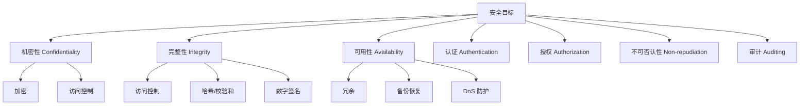
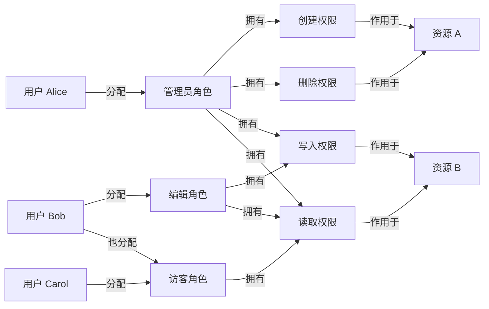

# 第九章：操作系统安全

操作系统作为计算机系统的核心，管理着所有硬件资源和软件执行，其安全性至关重要。本章将探讨操作系统面临的安全威胁、安全目标以及实现这些目标的各种机制和技术。

## 9.1 安全威胁与目标

### 9.1.1 威胁类型

操作系统面临多种安全威胁，意图破坏系统的正常运行或窃取信息：

*   **恶意软件 (Malware):**
    *   **病毒 (Virus):** 依附于其他合法程序传播，通过修改程序代码或文件进行感染。
    *   **蠕虫 (Worm):** 独立的恶意程序，利用网络漏洞自我复制和传播，消耗网络带宽和系统资源。
    *   **木马 (Trojan Horse):** 伪装成合法或有用的程序，但 secretly 执行恶意功能（如窃取密码、创建后门）。
    *   **Rootkit:** 隐藏在操作系统底层（甚至内核或固件中）的恶意软件，旨在获取并维持最高权限（root 或 administrator），并隐藏自身及其他恶意活动。
    *   **勒索软件 (Ransomware):** 加密用户文件或锁定系统，要求支付赎金才能恢复访问。
    *   **间谍软件 (Spyware):** 未经用户同意收集用户信息（浏览习惯、键盘记录等）。
    *   **广告软件 (Adware):** 强制显示广告。
*   **非授权访问 (Unauthorized Access):**
    *   **猜测密码 (Password Guessing):** 尝试常用密码或字典攻击。
    *   **利用漏洞 (Exploiting Vulnerabilities):** 利用操作系统或应用程序的缺陷获取权限。
    *   **社会工程学 (Social Engineering):** 欺骗用户泄露信息或执行恶意操作。
*   **拒绝服务攻击 (Denial of Service, DoS):** 通过消耗系统资源（CPU、内存、网络带宽）或利用协议漏洞，使合法用户无法访问服务。
    *   **分布式拒绝服务 (Distributed Denial of Service, DDoS):** 利用大量被控主机（僵尸网络 Botnet）同时发起 DoS 攻击。
*   **权限提升 (Privilege Escalation):** 低权限用户利用漏洞获取更高权限（如普通用户获取管理员权限）。
*   **数据泄露 (Data Breach):** 未经授权访问、窃取或泄露敏感数据。
*   **物理攻击 (Physical Attack):** 直接接触硬件设备进行破坏或窃取。

### 9.1.2 安全目标 (CIA Triad)

操作系统安全的主要目标通常概括为 CIA 三元组：

*   **机密性 (Confidentiality):** 确保信息只被授权的用户访问，防止信息泄露给未授权实体。
    *   **机制:** 访问控制、加密、身份认证。
*   **完整性 (Integrity):** 确保信息在存储或传输过程中不被未授权修改或破坏，保持信息的准确性和一致性。
    *   **机制:** 访问控制、校验和 (Checksums)、数字签名、哈希函数、日志审计。
*   **可用性 (Availability):** 确保授权用户在需要时能够访问信息和使用资源。
    *   **机制:** 冗余（硬件、数据）、备份与恢复、DoS 防护。

**其他重要目标:**
*   **认证 (Authentication):** 验证用户或进程的身份。
*   **授权 (Authorization) / 访问控制 (Access Control):** 确定已认证用户可以执行哪些操作。
*   **不可否认性 (Non-repudiation):** 确保操作的发起者不能否认其行为（常通过数字签名实现）。
*   **审计 (Auditing):** 记录系统活动，以便事后追踪和分析安全事件。



## 9.2 认证 (Authentication)

验证用户身份的过程，确认"你是你所声称的人"。常见的认证因素：

*   **你知道什么 (Something You Know):**
    *   **密码 (Password):** 最常用但安全性相对较低。易被猜测、窃取或暴力破解。
    *   **个人识别码 (PIN):** 类似密码，通常较短。
    *   **安全问题:** 回答预设的问题。
*   **你拥有什么 (Something You Have):**
    *   **智能卡 (Smart Card):** 嵌入芯片的卡片。
    *   **令牌 (Token):** 如硬件 OTP (One-Time Password) 生成器。
    *   **手机:** 通过短信验证码或认证 App。
    *   **数字证书 (Digital Certificate):** 包含公钥和身份信息的文件。
*   **你是什么 (Something You Are) / 生物识别 (Biometrics):**
    *   **指纹识别 (Fingerprint Recognition):** 常用，但可能被复制。
    *   **面部识别 (Facial Recognition):** 方便，但受光线、角度影响，可能被照片欺骗（需活体检测）。
    *   **虹膜/视网膜扫描 (Iris/Retina Scan):** 精度高，但设备成本高。
    *   **声音识别 (Voice Recognition):** 可能受噪音、模仿影响。
    *   **击键模式 (Keystroke Dynamics):** 分析打字节奏和模式。

### 9.2.1 密码

*   **存储:** 绝不能明文存储密码。应存储**密码哈希 (Password Hash)**，最好是**加盐哈希 (Salted Hash)**。
    *   **哈希:** 使用单向哈希函数（如 SHA-256）计算密码的哈希值。验证时，计算输入密码的哈希值并与存储的哈希值比较。
    *   **盐 (Salt):** 为每个用户生成一个随机的"盐"值，将盐与密码组合后再进行哈希。盐值与哈希值一起存储。盐可以防止**彩虹表 (Rainbow Table)** 攻击（预计算常用密码哈希值）。
*   **策略:** 强制密码复杂度（长度、字符类型）、定期更换、密码历史（防止重复使用旧密码）、账户锁定（防止暴力破解）。

### 9.2.2 生物识别

*   **优点:** 用户无需记忆，不易丢失或被盗。
*   **缺点:**
    *   **错误率:** 存在**错误拒绝率 (False Rejection Rate, FRR)** 和**错误接受率 (False Acceptance Rate, FAR)**。
    *   **不可撤销:** 生物特征泄露后无法更改。
    *   **隐私担忧:** 涉及敏感个人信息。
    *   **可能被欺骗:** 需要活体检测等技术对抗伪造。

### 9.2.3 多因素认证 (Multi-Factor Authentication, MFA)

*   **概念:** 要求用户提供**两个或更多**不同类别的认证因素进行验证，显著提高安全性。
*   **常见组合:** 密码 + 手机验证码/App 推送；密码 + 指纹。
*   **双因素认证 (Two-Factor Authentication, 2FA):** 最常见的 MFA 形式。

## 9.3 访问控制 (Access Control)

确定已认证的用户或主体 (Subject) 能够对哪些客体 (Object，如文件、设备、内存段) 执行哪些操作 (Operation，如读、写、执行)。

### 9.3.1 访问控制矩阵 (Access Matrix)

*   **模型:** 一个抽象模型，用矩阵表示主体、客体和权限。
    *   行代表主体 (用户、进程)。
    *   列代表客体 (文件、资源)。
    *   单元格 `Matrix[S, O]` 包含主体 S 对客体 O 的权限集合。
*   **优点:** 模型清晰，非常灵活。
*   **缺点:** 对于大量主体和客体的系统，矩阵非常稀疏，存储和管理效率低下。

```
          | 文件 A   | 文件 B   | 打印机 L | 设备 D   |
----------|----------|----------|----------|----------|
用户 Alice| r, w     | r        | print    |          |
用户 Bob  | r        | r, w     |          | control  |
进程 P1   | r        | w        |          |          |
用户 Carol|          | r        | print    |          |
```

### 9.3.2 访问控制列表 (Access Control List, ACL)

*   **实现:** 访问控制矩阵按**列**存储。即为**每个客体**维护一个列表，记录哪些主体可以对其执行哪些操作。
*   **结构:** `客体 O: {(主体 S1, {权限集}), (主体 S2, {权限集}), ...}`
*   **示例 (文件 A):** `{(Alice, {r, w}), (Bob, {r}), (P1, {r})}`
*   **优点:** 实现相对直接，易于确定对特定客体的访问权限。
*   **缺点:** 难以快速确定一个主体能访问哪些客体；ACL 可能很长。
*   **应用:** Windows NTFS 文件系统权限。

### 9.3.3 能力表 (Capability Lists, C-Lists)

*   **实现:** 访问控制矩阵按**行**存储。即为**每个主体**维护一个列表，记录它对哪些客体拥有哪些权限（称为**能力 Capability**）。
*   **结构:** `主体 S: {(客体 O1, {权限集}), (客体 O2, {权限集}), ...}`
*   **能力:** 通常是一个受保护的对象，包含客体标识符和权限集，主体持有能力即拥有相应权限。
*   **优点:** 易于确定主体的权限范围；权限传递可以通过传递能力实现。
*   **缺点:** 难以撤销权限（需要找到并销毁所有相关能力）；能力本身需要保护，防止伪造。
*   **应用:** 某些微内核或研究性操作系统。

### 9.3.4 基于角色的访问控制 (Role-Based Access Control, RBAC)

*   **模型:** 在主体和权限之间引入**角色 (Role)** 的概念。
    *   权限被分配给角色。
    *   用户被分配给角色。
    *   用户通过其被分配的角色间接获得权限。
*   **结构:** 用户 <--> 角色 <--> 权限
*   **优点:** 简化了权限管理。当用户职责变化时，只需修改其角色分配；当角色权限变化时，所有扮演该角色的用户权限自动更新。
*   **应用:** 广泛应用于企业应用和数据库系统。



## 9.4 恶意软件防护

操作系统和用户需要采取措施来防御恶意软件。

### 9.4.1 防病毒软件 (Antivirus Software)

*   **功能:** 检测、阻止和移除已知的恶意软件。
*   **方法:**
    *   **基于签名 (Signature-Based):** 维护一个已知恶意软件特征（签名）数据库，扫描文件或内存，匹配签名。
    *   **基于启发式 (Heuristic-Based):** 分析代码结构、行为模式等可疑特征，尝试检测未知的或变种的恶意软件。
    *   **基于行为 (Behavior-Based):** 监控程序运行时的行为，如果发现可疑操作（如修改系统文件、网络连接异常），则进行阻止或警告。
    *   **沙箱 (Sandboxing):** 在隔离的环境中运行可疑程序，观察其行为。
*   **局限:** 签名库需要不断更新；启发式和行为检测可能产生误报 (False Positive) 或漏报 (False Negative)。

### 9.4.2 防火墙 (Firewall)

*   **功能:** 控制进出计算机或网络的网络流量，阻止未经授权的访问。
*   **类型:**
    *   **网络防火墙:** 部署在网络边界的独立设备。
    *   **主机防火墙:** 运行在单台计算机上的软件防火墙（操作系统通常内置）。
*   **方法:** 基于规则过滤网络包，规则可以基于源/目标 IP 地址、端口号、协议类型、应用层数据等。

### 9.4.3 入侵检测系统 (IDS) / 入侵防御系统 (IPS)

*   **IDS (Intrusion Detection System):** 监控网络或系统活动，**检测**可疑的入侵行为或策略违反，并发出警报。
*   **IPS (Intrusion Prevention System):** 在 IDS 的基础上，不仅检测，还能**主动阻止**检测到的威胁（如丢弃恶意数据包、断开连接）。
*   **类型:** 基于网络 (NIDS/NIPS)、基于主机 (HIDS/HIPS)。

## 9.5 内存保护机制

现代操作系统采用多种内存保护技术来增加利用内存漏洞（如缓冲区溢出）进行攻击的难度。

### 9.5.1 地址空间布局随机化 (Address Space Layout Randomization, ASLR)

*   **方法:** 在程序加载时，随机化其内存地址布局（如堆、栈、共享库的基地址）。
*   **目的:** 使攻击者难以预测目标代码或数据的确切内存地址，从而难以构造利用缓冲区溢出等漏洞的攻击载荷 (Exploit Payload)。
*   **有效性:** 需要足够的随机性（熵），并且不能泄露地址信息。

### 9.5.2 数据执行保护 (Data Execution Prevention, DEP) / NX 位

*   **方法:** 硬件支持（CPU 的 **NX 位 - No-Execute Bit** 或 **XD 位 - Execute Disable Bit**）配合操作系统，将内存页标记为**不可执行**。通常，数据段（堆、栈）应标记为不可执行。
*   **目的:** 防止攻击者通过缓冲区溢出等手段向数据区注入恶意代码并执行（称为**代码注入攻击 Shellcode Injection**）。
*   **局限:** 无法防御**返回导向编程 (Return-Oriented Programming, ROP)** 等不直接注入代码的攻击方式（ROP 利用程序中已有的代码片段 Gadgets 来执行恶意逻辑）。

### 9.5.3 Stack Canaries / 栈保护

*   **方法:** 在函数调用栈帧的返回地址之前放置一个随机的、已知的**哨兵值 (Canary)**。在函数返回前，检查该值是否被修改。
*   **目的:** 检测栈缓冲区溢出是否覆盖了函数返回地址。如果 Canary 值被破坏，说明发生了溢出，程序可以异常终止，阻止攻击者控制执行流程。
*   **局限:** 只能检测基于栈的缓冲区溢出；可能被某些技术绕过（如泄露 Canary 值）。

## 9.6 加密技术

加密是保护数据机密性和完整性的基础。

### 9.6.1 对称加密与非对称加密

*   **对称加密 (Symmetric Encryption):**
    *   使用**相同**的密钥进行加密和解密。
    *   **算法示例:** DES, 3DES, AES, RC4, ChaCha20。
    *   **优点:** 速度快，适合加密大量数据。
    *   **缺点:** 密钥分发困难且不安全（需要安全通道传递密钥）；无法用于数字签名。
*   **非对称加密 (Asymmetric Encryption) / 公钥加密 (Public-Key Cryptography):**
    *   使用一对密钥：**公钥 (Public Key)** 和**私钥 (Private Key)**。
    *   公钥可以公开，私钥必须保密。
    *   用公钥加密的数据只能用对应的私钥解密；用私钥加密（签名）的数据可以用公钥验证。
    *   **算法示例:** RSA, Diffie-Hellman (用于密钥交换), ECC (椭圆曲线加密)。
    *   **优点:** 解决了密钥分发问题；可以实现数字签名。
    *   **缺点:** 速度远慢于对称加密。
*   **混合使用:** 实际应用中通常结合使用。例如，用非对称加密安全地协商一个临时的对称密钥，然后用对称密钥加密大量数据（如 TLS/SSL 握手）。

### 9.6.2 数字签名与证书

*   **数字签名 (Digital Signature):** 利用非对称加密实现。
    *   发送方用自己的**私钥**对消息（或消息的哈希值）进行加密（签名）。
    *   接收方用发送方的**公钥**解密签名，并与自己计算的消息哈希值比较。
    *   **目的:** 保证**完整性**（数据未被篡改）、**认证**（确认发送方身份）和**不可否认性**。
*   **数字证书 (Digital Certificate):**
    *   **问题:** 如何信任收到的公钥确实属于声称的实体？
    *   **解决方案:** 由可信的**证书颁发机构 (Certificate Authority, CA)** 颁发数字证书。证书包含实体的公钥、身份信息以及 CA 用其**私钥**对这些信息的签名。
    *   **验证:** 接收方使用 CA 的**公钥**验证证书签名，从而信任证书中的公钥。
    *   **标准:** X.509 是常用的证书格式标准。
    *   **信任链:** 根 CA 证书通常预装在操作系统或浏览器中，形成信任链。

### 9.6.3 全盘加密 (Full Disk Encryption, FDE)

*   **方法:** 加密整个硬盘驱动器（包括操作系统、应用程序和用户数据），通常在操作系统启动前或启动早期进行。
*   **目的:** 保护静态数据的机密性，防止在设备丢失或被盗时数据被直接读取。
*   **实现:** 通常使用对称加密（如 AES），密钥本身需要保护（如存储在 TPM 芯片中，或由用户密码/启动 U 盘派生）。
*   **示例:** BitLocker (Windows), FileVault (macOS), LUKS (Linux)。

## 9.7 系统加固与审计

*   **系统加固 (System Hardening):** 采取一系列措施减少系统的**攻击面 (Attack Surface)**，提高安全性。
    *   **最小化安装:** 只安装必要的软件和服务。
    *   **禁用不必要的服务和端口。**
    *   **及时应用安全补丁和更新。**
    *   **配置强密码策略和访问控制。**
    *   **启用防火墙和安全机制 (ASLR, DEP 等)。**
    *   **限制用户权限 (最小权限原则 Principle of Least Privilege)。**
*   **安全审计 (Security Auditing):**
    *   **目的:** 记录系统活动（如用户登录、文件访问、系统调用、网络连接、权限更改等），用于事后追踪安全事件、分析攻击路径、监控策略遵守情况。
    *   **实现:** 操作系统提供审计日志功能，记录相关事件到安全日志文件中。
    *   **挑战:** 日志量可能很大，需要有效管理、存储和分析；确保日志本身的完整性和安全性。

## 9.8 Windows 与 Linux 安全特性对比

| 特性             | Windows                                      | Linux                                              |
| ---------------- | -------------------------------------------- | -------------------------------------------------- |
| **用户模型**     | SID (安全标识符), 管理员/标准用户           | UID/GID (用户/组 ID), root/普通用户                 |
| **文件权限**     | ACL (精细控制)                               | POSIX 权限 (Owner/Group/Other) + ACL (可选)       |
| **强制访问控制** | Integrity Levels (MIC), AppLocker (应用白名单)| SELinux, AppArmor (基于策略限制进程行为)            |
| **内核保护**     | PatchGuard (内核补丁保护), KASLR             | KASLR (内核地址随机化), Control-Flow Integrity (CFI) | 
| **内存保护**     | ASLR, DEP, CFG (Control Flow Guard), SEHOP | ASLR, DEP, Stack Canaries                           |
| **加密**         | BitLocker (FDE), EFS (文件加密)              | LUKS/dm-crypt (FDE), eCryptfs/fscrypt (文件/目录加密) |
| **防火墙**       | Windows Defender Firewall                    | Netfilter (iptables/nftables), ufw (前端)            |
| **防病毒**       | Windows Defender Antivirus (内置)            | ClamAV (常用开源), 商业产品                        |
| **审计**         | 安全事件日志                                 | auditd, syslog/rsyslog                             |
| **软件源**       | Microsoft Store, 传统安装包                 | 发行版仓库 (包管理器), PPA, 源码编译                 |
| **更新机制**     | Windows Update                               | 包管理器 (apt, yum, dnf...), Livepatch (内核热补丁) |

**总体而言:**
*   Windows 在桌面易用性、ACL 权限、内置防病毒方面有优势，但历史上是恶意软件的主要目标。
*   Linux 以其开源性、灵活性、强大的命令行工具和成熟的强制访问控制框架 (SELinux/AppArmor) 著称，在服务器领域广泛使用。
两者都在不断吸收对方的优点并加强自身的安全机制。

## 9.9 总结

操作系统安全是一个持续对抗的过程，涉及预防、检测和响应各种威胁。
*   理解常见的**安全威胁**（恶意软件、非授权访问、DoS）和核心**安全目标**（机密性、完整性、可用性）是基础。
*   **认证**机制（密码、生物识别、MFA）用于验证身份。
*   **访问控制**模型（矩阵、ACL、能力表、RBAC）用于管理权限。
*   **恶意软件防护**依赖防病毒、防火墙和 IDS/IPS。
*   **内存保护**技术（ASLR, DEP, Canaries）增加了漏洞利用难度。
*   **加密技术**（对称、非对称、数字签名、证书、FDE）保护数据机密性和完整性。
*   **系统加固**和**安全审计**是重要的管理实践。

没有绝对安全的系统，需要在安全性、可用性和易用性之间做出权衡。持续的安全意识、及时的更新、合理的配置和多层次的防御策略是构建相对安全的操作系统的关键。 