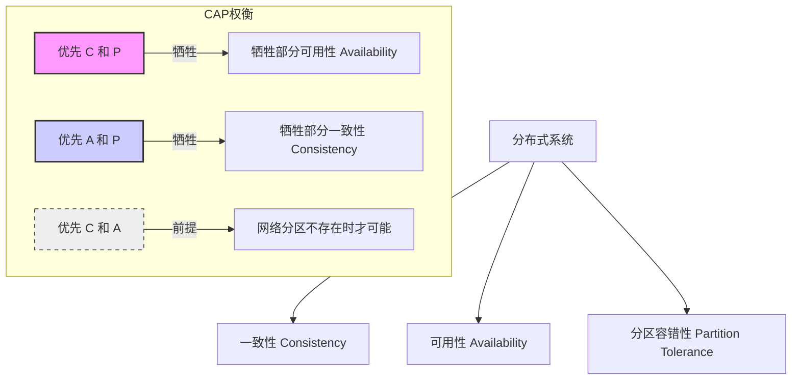
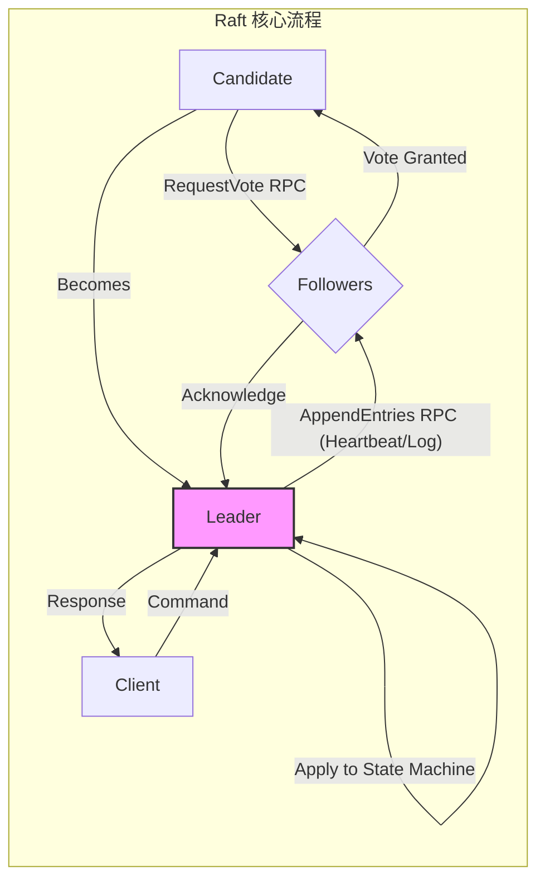
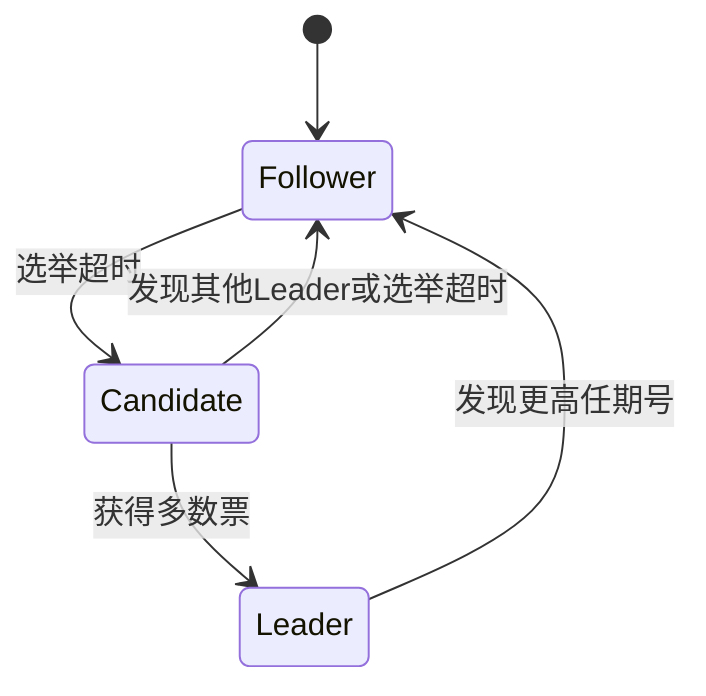
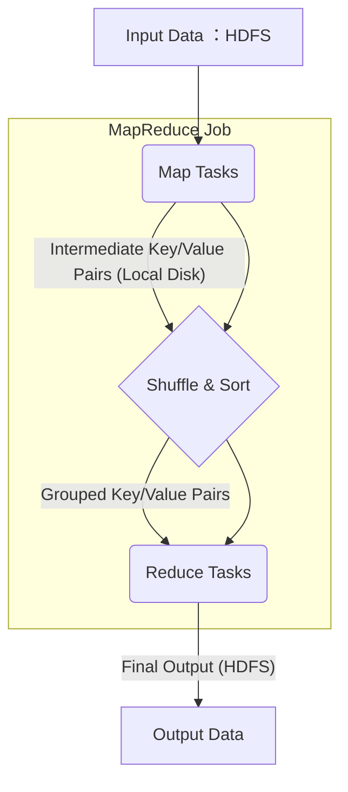
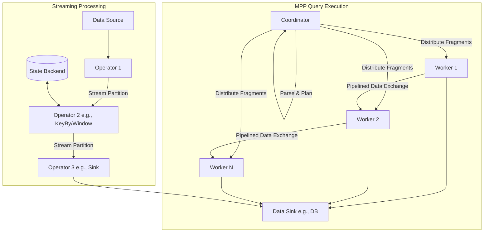
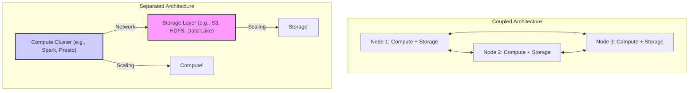
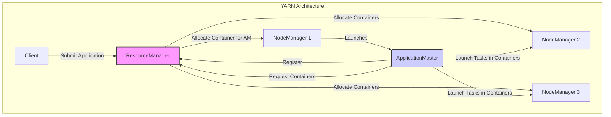

# 第一部分：大数据处理引擎基础 (Foundations of Big Data Processing Engines)

## 第1章：分布式计算基石 (Fundamentals of Distributed Computing)

大数据处理引擎本质上是复杂的分布式系统。它们通过协调多台计算机的资源，共同完成单个节点无法承载的计算任务。因此，在深入探索 Spark、Flink、Presto/Trino 等引擎的内核之前，我们必须首先理解构建这些系统的基石——分布式计算的核心概念、模型和技术。

本章将概述分布式系统的基础理论、大数据处理模式的演进历程、现代架构趋势以及相关的基础技术，为后续章节的深入学习奠定坚实的基础。

### 1.1 分布式系统核心概念

构建可靠、高效的分布式系统面临诸多挑战，其中最为核心的是如何在网络分区、节点故障等异常情况下保证系统的一致性和可用性。以下是一些关键理论和概念：

**1.1.1 CAP 理论**

CAP 理论是分布式系统设计中最基础也最重要的理论之一。它指出，一个分布式系统无法同时满足以下三个特性：

*   **一致性 (Consistency):** 所有节点在同一时间看到的数据是完全一致的。对于写操作，一旦成功返回，后续任何读操作都应读到该写入的值或更新的值。
*   **可用性 (Availability):** 系统对每个请求都能保证在有限时间内返回一个非错误的响应（但不保证获取的是最新数据）。
*   **分区容错性 (Partition Tolerance):** 系统在遇到网络分区（即节点间的网络连接中断，导致系统分裂成多个无法互相通信的子集）时，仍能继续运行。



由于网络分区在分布式环境中是不可避免的（硬件故障、网络拥塞等），因此 **分区容错性 (P) 通常是必须保证的**。这意味着系统设计者必须在一致性 (C) 和可用性 (A) 之间做出权衡：

*   **选择 CP (Consistency + Partition Tolerance):** 当发生网络分区时，系统为了保证数据一致性，可能会拒绝部分请求（牺牲可用性）。例如，某些强一致性的数据库或分布式锁服务会选择 CP。
*   **选择 AP (Availability + Partition Tolerance):** 当发生网络分区时，系统为了保证可用性，会继续处理请求，但这可能导致节点间数据不一致（牺牲一致性）。很多 Web 服务、NoSQL 数据库（如 Cassandra 的某些配置）会倾向于 AP，通过最终一致性等策略来弥补。

需要注意的是，CAP 理论是一个简化的模型，实际系统中的一致性和可用性并非完全的"非黑即白"，存在不同程度的权衡。大数据处理引擎通常需要在保证分区容错性的前提下，根据应用场景对一致性和可用性做出灵活的选择。

**1.1.2 一致性模型 (Consistency Models)**

一致性描述了分布式系统中数据副本的同步程度。CAP 理论中的"一致性"通常指严格的线性一致性 (Linearizability)，但这只是众多一致性模型中的一种。实践中存在多种不同强度的一致性模型：

*   **严格一致性 (Strict Consistency):** 要求任何读操作都能返回最新写入的值，且所有进程看到的写操作顺序完全一致。这需要全局时钟，在实际分布式系统中难以实现。
*   **线性一致性 (Linearizability) / 原子一致性 (Atomic Consistency):** 比严格一致性稍弱，不要求全局时钟。它要求所有操作看起来是按照某个全局的、实时的顺序依次执行的，每个操作都如同在一个单一的副本上瞬间完成。这是非常强的一致性保证。
*   **顺序一致性 (Sequential Consistency):** 要求所有进程看到的写操作顺序保持一致（但不一定是实时的全局顺序），且每个进程内部的操作顺序按程序顺序执行。不同进程看到的全局顺序可能不同，但每个进程看到的顺序是合法的。
*   **因果一致性 (Causal Consistency):** 要求有因果关系的写操作（例如，写 B 依赖于读 A 的结果，则写 A 和写 B 有因果关系）在所有进程中看到的顺序一致。没有因果关系的写操作顺序则不做保证。
*   **最终一致性 (Eventual Consistency):** 最弱的一致性模型之一。系统保证如果没有新的更新，最终所有副本的数据都会达到一致状态，但不保证在中间过程中读取到的数据是最新值。这是许多高可用系统（AP 系统）采用的模型。最终一致性还有不同的变种，如读写一致性 (Read-your-writes)、会话一致性 (Session Consistency) 等。

| 一致性模型        | 保证强度 | 描述                                                                 | 常见应用/场景                     |
| :---------------- | :------- | :------------------------------------------------------------------- | :-------------------------------- |
| 严格一致性        | 最高     | 所有读返回最新写，全局实时顺序                                       | 理论模型，实践中难以实现          |
| 线性一致性        | 很高     | 操作表现为在某个全局时间点原子发生，顺序与实时一致                   | 分布式锁、共识服务 (如 ZooKeeper) |
| 顺序一致性        | 较高     | 所有进程看到的写顺序一致，进程内操作按程序顺序                       | 某些内存模型、简单复制协议        |
| 因果一致性        | 中等     | 有因果关系的写操作顺序一致                                           | 协作编辑、社交网络 Feed (部分)   |
| 最终一致性        | 较低     | 无新更新时，副本最终一致；中间可能读到旧数据                       | DNS、NoSQL数据库 (如 Cassandra)  |

大数据引擎在不同场景下可能采用不同的一致性模型。例如，元数据管理通常需要较强的一致性（如线性一致性或顺序一致性），而大规模数据处理过程中的中间状态或统计聚合可能允许较弱的一致性（如最终一致性）以换取更高的性能和可用性。

**1.1.3 共识协议 (Consensus Protocols)**

在分布式系统中，多个节点需要就某个值（例如，谁是 Leader、某个配置项的值）达成一致，这就是共识问题。共识协议是解决这个问题的算法。

*   **目标：** 确保所有非故障节点最终对同一个值达成一致，并且这个值是某个节点提出的有效值。
*   **挑战：** 节点故障、消息丢失、网络延迟等都可能阻碍共识的达成。
*   **常见协议：**
    *   **Paxos:** 由 Leslie Lamport 提出，是第一个被证明正确的共识算法，但理解和实现相对复杂。有 Basic Paxos, Multi-Paxos 等变种。
    *   **Raft:** 由 Diego Ongaro 和 John Ousterhout 设计，旨在比 Paxos 更易于理解和实现。它通过明确的 Leader 选举、日志复制和安全性机制来达成共识。Raft 被广泛应用于 Etcd、Consul 等系统中。
    *   **ZooKeeper Atomic Broadcast (ZAB):** ZooKeeper 使用的协议，类似于 Paxos，特别为 ZooKeeper 的主备模式和数据同步需求设计。



大数据引擎通常依赖共识协议来实现关键组件的高可用性，例如：

*   **Spark Standalone 模式:** 使用 ZooKeeper 实现 Master 的高可用选举。
*   **Flink:** 使用 ZooKeeper (或 K8s HA 服务) 实现 JobManager 的高可用选举和元数据存储。
*   **Presto/Trino:** Coordinator 的高可用通常依赖外部机制，但内部状态同步或某些场景可能间接用到类似原理。

理解共识协议有助于我们理解大数据引擎如何实现核心管理节点的容错和故障恢复。

**1.1.4 Raft 共识协议的详细原理**

Raft 是一种用于分布式系统中达成共识的协议，由 Diego Ongaro 和 John Ousterhout 设计，目标是比 Paxos 更易于理解和实现。Raft 将复杂的共识问题分解为三个相对独立的子问题：领导人选举、日志复制和安全性。

**基本概念**

* **状态机复制：** Raft 使用复制状态机确保分布式系统中所有节点的一致性。每个节点维护一个日志，包含状态改变的指令序列。
* **节点角色：** Raft 中的节点有三种角色：
  * **领导者 (Leader)** - 处理所有客户端请求，管理日志复制
  * **跟随者 (Follower)** - 响应领导者的请求
  * **候选人 (Candidate)** - 在选举过程中的临时角色

* **任期 (Term)：** Raft 将时间分割为任意长度的任期，每个任期有唯一的递增编号。每个任期最多有一个领导者。



**领导人选举详解**

1. **选举触发**
   * 初始状态下所有节点都是跟随者
   * 如果跟随者在一段时间内（选举超时，通常150-300ms）没有收到领导者的心跳，则转变为候选人
   * 为避免同时选举，每个节点的超时时间是随机的

2. **投票请求**
   * 候选人增加当前任期号并投票给自己
   * 向所有其他节点发送 RequestVote RPC，包含自己的任期号和日志信息
   * 节点收到投票请求后，如果任期号有效且还未投票给其他候选人，同时候选人的日志至少与接收者一样新，则投赞成票

3. **选举结果**
   * 候选人获得多数票（N/2+1）后成为领导者
   * 如果选举超时未获得多数票，则开始新一轮选举
   * 如果发现更高任期的领导者，则转变为跟随者

**日志复制机制**

1. **日志结构**
   * 每个日志条目包含：命令、任期号和索引位置
   * 日志按索引位置顺序编号（从1开始）

2. **日志复制流程**

```
+--------------------------+
| 索引 | 任期 | 命令      |
+--------------------------+
|  1   |  1   | SET x=3   |
|  2   |  1   | SET y=1   |
|  3   |  2   | SET x=1   |
|  4   |  2   | SET y=2   |
+--------------------------+
```

   * Leader 接收客户端命令，将其追加到本地日志
   * Leader 并行向所有 Follower 发送 AppendEntries RPC（包含新日志条目）
   * 当日志被安全复制到多数节点后，Leader 提交该日志条目
   * Leader 通知 Follower 哪些日志条目已被提交
   * 所有节点按顺序将已提交的命令应用到状态机

3. **一致性检查**
   * 每个 AppendEntries RPC 包含 `prevLogIndex` 和 `prevLogTerm`，Follower 必须确认自己在该位置的日志与 Leader 一致
   * 如果一致，追加新日志；不一致，拒绝请求
   * Leader 对每个 Follower 维护 `nextIndex`，表示下一个要发送的日志条目索引
   * 如果 AppendEntries 失败，Leader 递减 `nextIndex` 并重试（日志回溯）

**安全性保证**

1. **选举限制**
   * 只有包含所有已提交日志的节点才能成为 Leader
   * 投票时，候选人的日志必须至少与投票者一样新（先比较最后日志条目的任期号，再比较索引）

2. **提交规则**
   * Leader 只提交当前任期的日志条目
   * 旧任期的日志条目通过复制当前任期的新日志条目来间接提交

3. **日志匹配特性**
   * 如果两个日志包含索引相同且任期相同的条目，则该条目之前的所有条目都相同
   * Leader 从不覆盖或删除自己的日志条目

**集群成员变更**

Raft 通过两阶段方法实现集群成员安全变更：
1. 首先切换到过渡配置（新旧配置并存），称为"共同一致"(joint consensus)
2. 一旦共同一致状态被提交，系统再切换到新配置

**处理成员宕机**

* **Leader 宕机**：启动新一轮选举
* **Follower 宕机**：Leader 继续尝试向其复制日志；系统只要多数节点正常就能继续工作

**实际应用示例**

假设有5个节点的 Raft 集群，节点 S1 是当前 Leader，任期为2：

1. **正常操作**
   * 客户端发送命令 "SET z=5" 到 S1
   * S1 追加到本地日志（索引5，任期2）
   * S1 向 S2-S5 发送 AppendEntries
   * S2, S3, S4 成功复制（即使 S5 失败也无妨）
   * S1 提交索引5并应用命令
   * S1 通知客户端成功，并在下次心跳中通知 Follower 更新提交索引

2. **网络分区**
   * 假设网络分区将集群分为 {S1, S2} 和 {S3, S4, S5}
   * S3超时后发起选举，任期增至3，获得S4, S5选票成为新Leader
   * S1继续认为自己是Leader，但只能与S2通信
   * 当分区恢复后:
     * S1收到含有更高任期的消息
     * S1发现自己已过时，转为Follower
     * 集群在任期3的Leader (S3) 下重新统一

Raft 协议广泛应用于分布式系统，如 etcd、Consul、TiKV等，用于实现服务发现、配置中理、元数据管理等功能。通过其直观的设计，有效解决了分布式一致性的核心问题。

### 1.2 大数据处理模式演进

大数据处理技术并非一蹴而就，其处理模式随着硬件发展、应用需求和理论突破而不断演进。

**1.2.1 MapReduce 时代**

*   **模型:** Google 提出的 MapReduce 是大数据处理的开山之作。它将复杂的并行计算抽象为两个简单的函数：`Map` 和 `Reduce`。
    *   `Map` 函数：对输入数据进行处理，生成中间键值对。
    *   `Reduce` 函数：对具有相同键的中间值进行合并处理，生成最终结果。
*   **特点:**
    *   **简单易用:** 极大地简化了分布式编程。
    *   **高容错性:** 通过任务重试、备份任务等机制保证作业完成。
    *   **良好的扩展性:** 易于扩展到大规模集群。
*   **局限性:**
    *   **高延迟:** 每个 MapReduce 作业都需要将中间结果写入磁盘 (HDFS)，导致 I/O 开销巨大，不适合低延迟和迭代计算场景。
    *   **表达能力有限:** 复杂的计算逻辑需要串联多个 MapReduce 作业，开发效率低。
    *   **资源利用率:** 作业间的资源调度不够灵活。
*   **代表:** Apache Hadoop MapReduce。



**1.2.2 DAG (Directed Acyclic Graph) 引擎时代**

为了克服 MapReduce 的局限性，以 Spark 为代表的新一代引擎引入了 DAG 模型。

*   **模型:** 将复杂的计算任务表示为一个由操作（节点）和数据依赖关系（边）组成的有向无环图。引擎可以根据 DAG 对计算进行优化和调度。
*   **特点:**
    *   **内存计算:** 允许将中间结果缓存在内存中，极大减少了磁盘 I/O，显著提升了迭代计算和交互式查询的性能。
    *   **灵活的表达能力:** DAG 可以表示比 MapReduce 更复杂的计算流程。
    *   **优化空间:** 引擎可以在执行前对整个 DAG 进行优化（如流水线化操作、谓词下推等）。
    *   **统一处理:** 基于 DAG 模型，可以更容易地在同一个引擎中支持批处理、SQL 查询、流处理、机器学习等多种计算范式。
*   **代表:** Apache Spark, Apache Tez (作为 Hadoop MapReduce 的执行引擎改进)。

**1.2.3 MPP (Massively Parallel Processing) 与 Streaming 时代**

随着对低延迟查询和实时处理需求的增长，MPP 架构和流处理引擎得到了快速发展。

*   **MPP 模型:**
    *   **架构:** 通常采用无共享 (Shared-Nothing) 架构，每个节点拥有独立的 CPU、内存和磁盘。数据被分散存储在各个节点，查询时所有节点并行处理自己本地的数据。
    *   **特点:**
        *   **低延迟:** 查询计划被分解成多个片段 (Fragment/Stage)，在节点间以流水线 (Pipelined) 方式执行，避免了 MapReduce 的磁盘写入开销。
        *   **面向 SQL:** 主要针对 SQL 交互式查询场景优化。
        *   **高并发:** 能够支持大量并发用户的查询请求。
    *   **代表:** Presto/Trino, Impala, Greenplum, ClickHouse 等。
*   **Streaming 模型:**
    *   **架构:** 设计用于处理无界数据流，数据到达时立即处理。
    *   **特点:**
        *   **实时性:** 提供毫秒级或秒级的处理延迟。
        *   **状态管理:** 需要强大的状态管理机制来支持复杂的流计算（如窗口聚合、关联）。
        *   **时间语义:** 精确处理事件时间 (Event Time) 和处理时间 (Processing Time)。
        *   **精确一次保证:** 在故障恢复后能保证计算结果的准确性。
    *   **代表:** Apache Flink, Apache Storm, Spark Structured Streaming。



当前，批处理、交互式查询和流处理之间的界限越来越模糊，出现了"批流一体"的趋势，引擎（如 Flink、Spark）试图在统一的架构下高效地支持多种处理模式。

### 1.3 计算与存储分离架构趋势

早期的大数据系统（如 Hadoop HDFS + MapReduce）通常将计算和存储紧密耦合在同一个集群中，数据存储在哪里，计算就在哪里执行（数据本地性 Data Locality）。这种架构虽然在特定场景下有其优势（减少网络传输），但也带来了明显的弊端：

*   **资源扩展不灵活:** 计算资源和存储资源必须按固定比例扩展，无法独立满足不同业务场景的需求（计算密集型 vs 存储密集型）。
*   **运维复杂:** 计算和存储集群互相影响，升级、维护困难。
*   **资源利用率低:** 存储和计算资源无法充分共享和弹性伸缩。

为了解决这些问题，**计算与存储分离 (Compute-Storage Separation)** 架构应运而生，并逐渐成为主流趋势，尤其是在云环境中。



**优势：**

*   **弹性伸缩:** 计算和存储资源可以根据实际需求独立、快速地扩展或缩减。
*   **成本优化:** 可以根据负载动态调整计算资源，按需付费；可以选择更廉价、可靠的对象存储服务。
*   **灵活性:** 可以使用不同的计算引擎（Spark, Flink, Presto 等）访问同一份数据。
*   **简化运维:** 计算和存储可以独立升级和维护。

**挑战：**

*   **网络开销:** 计算节点需要通过网络读取远程存储的数据，可能引入延迟和带宽瓶颈。需要高效的数据读取、缓存和预取机制来缓解。
*   **数据一致性:** 需要处理存储层的最终一致性问题。

现代大数据引擎（Spark, Flink, Presto/Trino）都很好地支持计算与存储分离架构，可以高效地对接各种云存储（如 AWS S3, Azure Blob Storage, Google Cloud Storage）以及分布式文件系统（如 HDFS）。缓存技术（如 Alluxio）也常被用于缓解远程读取的性能问题。

### 1.4 数据序列化与网络传输基础

在分布式计算中，数据需要在不同节点之间进行传输（例如，Shuffle 操作、任务分发、结果回传），或者需要持久化到磁盘/内存。这个过程中，**序列化 (Serialization)** 和 **反序列化 (Deserialization)** 是必不可少的环节。

*   **序列化:** 将内存中的数据结构或对象转换为可以存储或传输的格式（如字节流）。
*   **反序列化:** 将序列化后的数据恢复为内存中的数据结构或对象。

序列化/反序列化的效率和产生的数据大小对分布式系统的整体性能有显著影响。

**常见序列化框架/库：**

*   **Java 原生序列化:** 使用简单，但性能较差，序列化后体积较大，存在安全风险，且版本兼容性问题较多。Spark 默认使用，但通常建议切换到更高效的库。
*   **Kryo:** 一个高性能的 Java 序列化框架，速度快，序列化后体积小。Spark 广泛使用 Kryo 作为替代 Java 序列化的方案。需要注册被序列化的类。
*   **Protobuf (Protocol Buffers):** Google 开发的语言无关、平台无关、可扩展的序列化结构数据的方法。性能好，跨语言支持好，向后兼容性强。常用于 RPC 和持久化存储。
*   **Avro:** Apache Avro 是一个数据序列化系统，设计用于支持大数据处理。它使用 JSON 定义 Schema，数据以二进制格式存储，Schema 与数据分离。适合需要动态 Schema 和强类型检查的场景。
*   **Thrift:** Apache Thrift 是 Facebook 开发的跨语言服务开发框架，包含了一套序列化机制。类似于 Protobuf。
*   **Apache Arrow:** 一个跨语言的、基于内存列式存储的数据格式规范。其核心特点是 **零拷贝 (Zero-Copy)** 读取。数据在内存中以标准化的列式格式组织，不同系统/进程可以直接共享或传输内存中的数据，无需序列化/反序列化开销。Arrow 正在成为大数据系统（如 Spark, Flink, Dremio, Pandas 2.0）之间高效数据交换和内存计算的标准。

以下是 Apache Arrow 零拷贝特性的 Python 代码示例，展示了如何在进程间高效共享数据而无需序列化/反序列化：

```python
# 进程A：创建 Arrow 表并共享内存
import pyarrow as pa
import numpy as np
import pyarrow.plasma as plasma
import uuid

# 创建一个大型数据集
data = np.random.rand(10000000)  # 1千万个随机浮点数
arr = pa.array(data)
batch = pa.RecordBatch.from_arrays([arr], names=['random_values'])
table = pa.Table.from_batches([batch])

# 连接到共享内存服务
client = plasma.connect("/tmp/plasma")  # 共享内存存储路径
object_id = plasma.ObjectID(uuid.uuid4().bytes)

# 将表放入共享内存（无需复制整个数据内容）
buffer = pa.serialize(table).to_buffer()
client.create(object_id, buffer.size)
view = client.seal(object_id)
```

```python
# 进程B：从共享内存读取数据（零拷贝）
import pyarrow as pa
import pyarrow.plasma as plasma

# 连接到相同的共享内存
client = plasma.connect("/tmp/plasma")

# 获取对象ID（通过某种IPC机制传递）
object_id = ... # 从进程A获取的object_id

# 零拷贝方式访问数据
[buffer] = client.get_buffers([object_id])
table = pa.deserialize(buffer)

# 直接访问数据，无需复制
column = table.column('random_values')
values = column.to_numpy()  # 无需复制数据

# 在不复制数据的情况下处理
mean_value = values.mean()  # 计算平均值
```

与传统序列化方式相比，Arrow 的零拷贝优势：

1. **传统方式**: 进程A序列化数据 → 传输数据 → 进程B反序列化数据，需要至少2次内存复制
2. **Arrow方式**: 进程A和B共享相同的内存区域，无需复制数据，直接引用

这在大数据处理中尤为重要，例如当 Spark 执行引擎需要与 Python UDF 交换大量数据时，使用 Arrow 可以显著提升性能（相比传统的 Pickle 序列化可提高 10-100 倍）。Spark、Pandas、Dremio 等多个系统已集成 Arrow 作为数据交换格式。

| 序列化库/格式 | 主要特点                                                     | 优点                                       | 缺点                                       |
| :------------ | :----------------------------------------------------------- | :----------------------------------------- | :----------------------------------------- |
| Java          | JDK 内置                                                     | 使用简单                                   | 性能差，体积大，安全风险，版本兼容性问题   |
| Kryo          | 高性能 Java 库                                               | 速度快，体积小                             | 需要注册类，跨语言支持有限                 |
| Protobuf      | 语言无关，Schema 定义                                        | 高性能，跨语言，向后兼容                     | 需要预定义 .proto 文件                     |
| Avro          | Schema 与数据分离，JSON 定义 Schema                          | 动态 Schema，Schema 演进支持好，压缩率高   | 性能相比 Kryo/Protobuf 可能稍低            |
| Arrow         | 内存列式格式，零拷贝                                         | 极高的数据交换/访问效率，跨语言内存共享    | 序列化到磁盘/网络非其主要优化点            |

**网络传输:**

数据序列化后，需要通过网络在节点间传输。高效的网络传输依赖于底层的网络库和协议。

*   **TCP/IP:** 分布式系统中最常用的传输层协议，提供可靠的数据传输。
*   **Netty:** 一个高性能、异步事件驱动的网络应用框架。它封装了 Java NIO，提供了易于使用的 API 来开发网络服务器和客户端。Spark、Flink、Presto/Trino 等众多大数据引擎都使用 Netty 作为其底层网络通信库，以实现高吞吐、低延迟的数据传输。
*   **RDMA (Remote Direct Memory Access):** 允许一台计算机的内存直接访问另一台计算机的内存，无需操作系统内核介入。可以极大地降低网络延迟和 CPU 开销，但在大数据引擎中应用相对较少，需要特定硬件支持。

高效的序列化和网络传输是大数据引擎性能优化的关键环节之一。

### 1.5 资源管理与调度概览

大数据处理任务通常需要在集群上运行，这需要一个资源管理系统来统一管理集群的计算资源（CPU, Memory 等），并根据应用程序的需求进行分配和调度。

**职责：**

*   **资源抽象:** 将物理节点的资源抽象成统一的单位（如 Container, Slot）。
*   **资源分配:** 根据应用的请求和调度策略，为应用分配资源。
*   **任务调度:** 将应用的计算任务调度到已分配资源的节点上执行。
*   **监控与管理:** 监控资源使用情况和任务执行状态。

**主流资源管理器：**

*   **Apache Hadoop YARN (Yet Another Resource Negotiator):**
    *   **架构:** ResourceManager (全局资源管理器) + NodeManager (节点资源管理器) + ApplicationMaster (应用程序管理器)。
    *   **特点:** 将资源管理和作业调度/监控功能分离。ResourceManager 负责资源分配，每个应用有自己的 ApplicationMaster 负责向 ResourceManager 申请资源并协调任务执行。
    *   **应用:** Hadoop 生态系统的标准资源管理器，被 Spark, Flink 等广泛支持。



*   **Kubernetes (K8s):**
    *   **架构:** Master (API Server, etcd, Scheduler, Controller Manager) + Nodes (Kubelet, Kube-proxy, Container Runtime)。
    *   **特点:** 最初为容器编排设计，功能强大，生态完善。通过 Operator 模式可以很好地管理有状态应用。支持声明式 API。
    *   **应用:** 逐渐成为云原生时代部署和管理大数据应用（包括 Spark, Flink, Presto 等）的主流选择。
*   **Apache Mesos:**
    *   **架构:** Master + Agent + Framework (Application)。
    *   **特点:** 采用两级调度架构。Mesos Master 将资源 Offer 给注册的 Framework (如 Spark, Flink 的调度器)，Framework 根据自身逻辑选择接受哪些 Offer 并在对应的 Agent 上启动任务。
    *   **应用:** 曾经是 Twitter 等公司大规模集群管理的选择，但近年来热度有所下降，部分用户转向 Kubernetes。

大数据引擎通常需要与这些资源管理器进行集成，以获取运行所需的资源。

*   **Spark:** 支持 Standalone (自带简易集群管理器)、YARN、Kubernetes、Mesos 等多种部署模式。
*   **Flink:** 支持 Standalone、YARN、Kubernetes、Mesos (旧版) 等。
*   **Presto/Trino:** 通常独立部署，但也可以通过 Kubernetes 等进行部署和管理。

理解资源管理和调度的基本原理，有助于我们配置和优化大数据作业在集群上的运行。

---

本章介绍了分布式计算的基石，包括核心的 CAP 理论、一致性模型、共识协议，回顾了大数据处理模式从 MapReduce 到 DAG 再到 MPP/Streaming 的演进，探讨了计算存储分离的架构趋势，并概述了数据序列化、网络传输以及资源管理的基础知识。这些概念和技术是理解后续章节中 Spark、Flink、Presto/Trino 等引擎设计与实现的基础。 