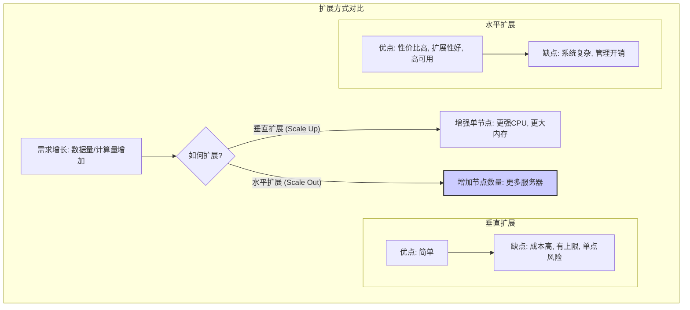
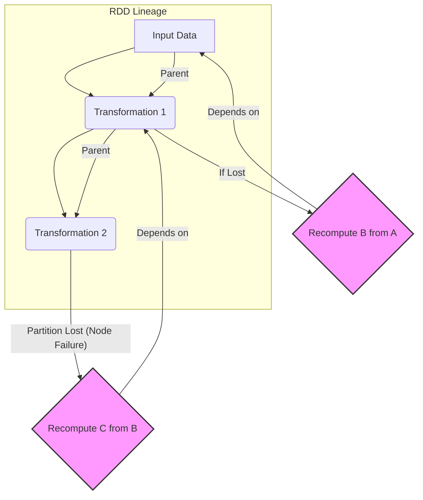
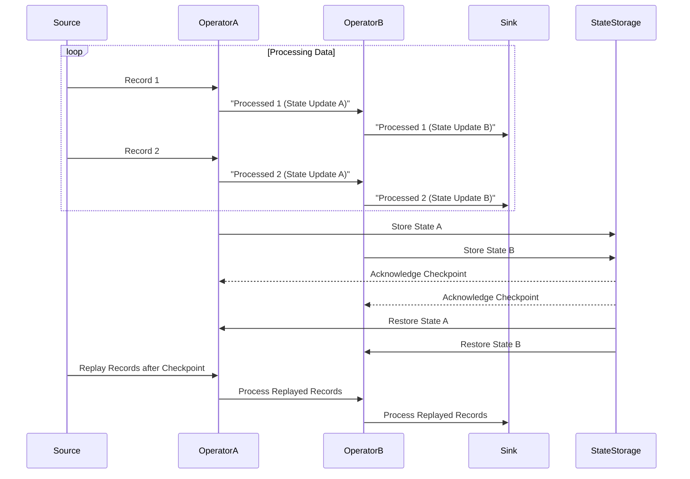
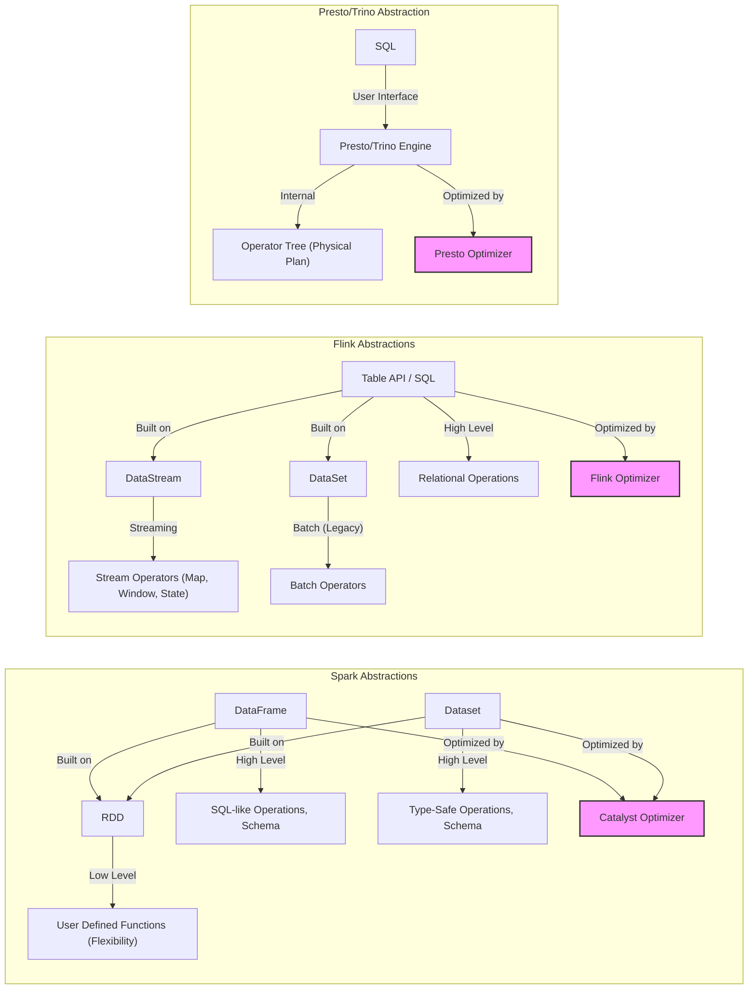
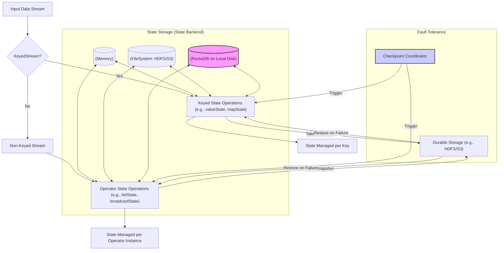
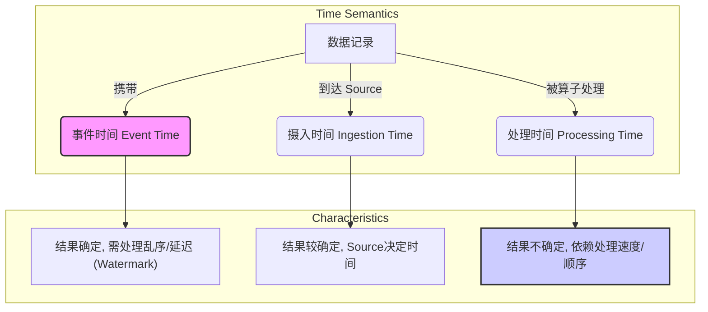

## 第2章：大数据引擎通用设计挑战 (Common Design Challenges)

在了解了分布式计算的基础之后，我们现在将目光投向构建大数据处理引擎本身所面临的核心挑战。无论是 `Spark`、`Flink` 还是 `Presto/Trino`，它们的设计都必须直面一系列共通的技术难题。如何有效地解决这些挑战，决定了引擎的性能、可靠性、易用性以及最终的适用场景。

本章将探讨这些通用设计挑战，包括可扩展性、容错性、性能优化、数据模型抽象、状态管理以及时间语义等关键方面。理解这些挑战以及引擎设计者们为应对挑战所做的权衡，是深入理解各引擎内核差异与特色的前提。

### 2.1 可扩展性 (Scalability): 水平扩展与垂直扩展

可扩展性是衡量大数据引擎处理不断增长的数据量和计算负载能力的核心指标。当数据规模增大或计算需求提升时，系统应能通过增加资源来相应地提升处理能力。可扩展性主要有两种方式：

*   **垂直扩展 (Vertical Scaling / Scaling Up):** 通过增加单个节点的硬件资源（如更强的 `CPU`、更大的内存、更快的磁盘）来提升处理能力。
    *   **优点:** 实现相对简单，无需修改分布式架构。
    *   **缺点:**
        *   **成本高昂:** 高端硬件的价格通常呈指数级增长。
        *   **存在物理上限:** 单个节点的资源终究有限，无法无限扩展。
        *   **单点风险:** 对单个节点的依赖性强。

*   **水平扩展 (Horizontal Scaling / Scaling Out):** 通过增加更多的计算节点（通常是普通的商用服务器）来组成集群，共同分担计算负载，提升整体处理能力。
    *   **优点:**
        *   **成本效益高:** 可以使用大量廉价的商用硬件。
        *   **扩展性好:** 理论上可以通过增加节点数量来线性提升处理能力，上限较高。
        *   **高可用:** 单个节点故障不影响整个集群的运行（需要配合容错机制）。
    *   **缺点:**
        *   **系统复杂性高:** 需要解决节点间通信、任务调度、数据分布、一致性、容错等分布式系统问题。
        *   **管理开销:** 管理大规模集群需要额外的工具和人力。

**大数据处理引擎的设计目标是实现良好的水平扩展性。** 这意味着引擎必须具备以下能力：

*   **数据分区 (Data Partitioning):** 能够将大规模数据集切分成多个小的分区，分布到不同的节点上并行处理。
*   **任务并行 (Task Parallelism):** 能够将计算任务分解成多个可以并行执行的子任务，调度到不同的节点上执行。
*   **负载均衡 (Load Balancing):** 能够将数据和计算负载均匀地分布到集群中的各个节点，避免部分节点过载而其他节点空闲。
*   **高效通信 (Efficient Communication):** 节点间的数据交换（如 `Shuffle`）必须高效，以避免网络成为瓶颈。

`Spark`、`Flink`、`Presto/Trino` 等引擎都采用了基于集群的分布式架构，天然支持水平扩展。它们通过各自的数据抽象（`RDD`, `DataStream`, `RowSet`）和执行模型（`DAG`, `Streaming Graph`, `MPP Stages`）来实现数据的分区和任务的并行化。

### 2.2 容错性 (Fault Tolerance): Checkpointing, Lineage, Task Retry

分布式系统中的节点故障、网络中断是常态而非意外。一个健壮的大数据引擎必须具备容错能力，确保在部分组件发生故障时，计算任务仍能最终完成，并且结果是正确的。

**常见的故障类型：**

*   **节点宕机 (Node Failure):** `Worker` 节点、`Master` 节点（需要高可用机制）可能因硬件故障、软件 `Bug` 或运维操作而失效。
*   **进程崩溃 (Process Crash):** 执行任务的进程（如 `Spark Executor`, `Flink TaskManager`）异常退出。
*   **网络分区 (Network Partition):** 节点间的通信中断。
*   **慢节点 (Straggler):** 某个节点由于硬件性能、负载过高或数据倾斜等原因，执行任务特别缓慢，拖慢整个作业进度。

**核心容错机制：**

大数据引擎通常组合使用以下几种机制来实现容错：

1.  **数据冗余 (Data Redundancy):**
    *   **原理:** 将数据的多个副本存储在不同的节点上（如 `HDFS` 的多副本机制）。当某个节点宕机时，可以从其他副本读取数据。
    *   **应用:** 主要由底层存储系统（如 `HDFS`, `S3`）提供。计算引擎依赖存储层的冗余来保证输入数据的可访问性。

2.  **任务重试 (Task Retry):**
    *   **原理:** 当某个节点上的任务执行失败（如进程崩溃、节点失联），调度器会在另一个健康的节点上重新启动该任务。
    *   **关键:** 任务应该是**幂等 (`Idempotent`)** 的，即重试执行与执行一次的效果相同。对于有副作用（如写入外部系统）的任务，需要特别处理。
    *   **应用:** `Spark`, `Flink`, `Presto/Trino` 都支持任务级别的重试。

3.  **血统/依赖追踪 (Lineage Tracking):**
    *   **原理:** 记录数据集之间的转换依赖关系。`RDD` (`Resilient Distributed Dataset`) 的核心思想就是基于 `Lineage`。如果某个 `RDD` 分区的数据丢失（例如，持有该分区的节点宕机且数据仅在内存中），可以通过其父 `RDD` 和转换操作重新计算生成该分区。
    *   **优点:** 对于无状态或转换代价不高的计算，恢复开销较小。
    *   **缺点:** 如果计算链条很长或转换代价高昂，恢复时间可能很长。
    *   **应用:** `Spark RDD` 的核心容错机制。

4.  **检查点/快照 (Checkpointing / Snapshotting):**
    *   **原理:** 定期将应用程序的状态（包括算子的内部状态、数据流的位置等）持久化到可靠的分布式存储（如 `HDFS`, `S3`）中。当发生故障时，系统可以从最近一次成功的 `Checkpoint` 恢复状态，并从该点继续处理。
    *   **优点:** 恢复速度通常比基于 `Lineage` 的完全重计算快得多，尤其对于状态复杂的长时间运行任务（如流处理）。
    *   **缺点:** `Checkpoint` 操作本身会带来一定的运行时开销（状态持久化）。`Checkpoint` 的频率需要在开销和恢复时间之间做权衡。
    *   **应用:** `Flink` 的核心容错机制（分布式快照算法），`Spark Structured Streaming` 也广泛使用 `Checkpointing` 来保证端到端一致性和状态恢复。

**容错机制的选择与组合：**

*   **`Spark`:** 主要依赖 `RDD Lineage` 进行容错，但也引入了 `Checkpointing` (`RDD Checkpoint`, `Structured Streaming Checkpoint`) 来断开过长的 `Lineage` 或保存流处理状态。
*   **`Flink`:** 主要依赖分布式快照 (`Checkpointing`) 进行容错，确保 `Exactly-Once` 或 `At-Least-Once` 语义。
*   **`Presto/Trino`:** 作为交互式查询引擎，通常采用查询级别的重试或部分任务重试。对于长时间运行的 `ETL` 查询，容错能力相对 `Spark/Flink` 较弱，但也在逐步增强（如 `Trino` 的 `Fault-tolerant execution` 模式尝试引入类似 `Spark` 的机制）。

设计高效且开销合理的容错机制是大数据引擎的核心竞争力之一。

### 2.3 性能优化 (Performance Optimization): I/O, Network, CPU, Memory

性能是衡量大数据引擎优劣的关键指标。用户期望引擎能够尽可能快地完成计算任务。性能优化是一个系统工程，涉及计算过程中的各个环节：

*   **I/O 优化:**
    *   **挑战:** 磁盘 I/O 和网络 I/O 通常是大数据处理的主要瓶颈。
    *   **策略:**
        *   **减少 I/O 操作:** 例如，使用内存计算（缓存中间结果）、算子融合（减少中间结果写盘）、列式存储（只读取需要的列）。
        *   **提高 I/O 效率:** 例如，使用高效的序列化格式（减少数据量）、数据压缩、异步 I/O、利用本地性（将计算移动到数据附近，或使用缓存）。
        *   **并行 I/O:** 同时从多个磁盘或节点读取/写入数据。
        *   **谓词下推 (Predicate Pushdown):** 将过滤条件尽可能地下推到数据源端执行，减少需要读取和传输的数据量。
        *   **分区裁剪 (Partition Pruning):** 根据查询条件只读取相关的分区数据。

*   **网络优化:**
    *   **挑战:** `Shuffle` 操作（节点间数据交换）通常涉及大量的网络传输，是主要的性能瓶颈之一。
    *   **策略:**
        *   **减少 `Shuffle` 数据量:** 例如，在 `Map` 端进行预聚合 (`Combine`)、使用 `Broadcast Join`（将小表广播到所有节点，避免大表 `Shuffle`）、优化 `Join` 策略。
        *   **提高传输效率:** 例如，使用高效的序列化库 (`Kryo`, `Arrow`)、数据压缩、优化网络库 (`Netty`) 参数、使用 `RDMA` (如可行)。
        *   **`Shuffle` 机制优化:** 例如，`Spark` 的 `Sort-based Shuffle`、`Tungsten-Sort`，`Flink` 的 `Credit-based Flow Control`。

*   **`CPU` 优化:**
    *   **挑战:** 对于计算密集型任务，`CPU` 可能成为瓶颈。Java 的 `GC` (Garbage Collection) 开销也可能影响性能。
    *   **策略:**
        *   **代码生成 (Code Generation):** `Spark Tungsten` 项目和 `Flink Table API/SQL` 都采用了运行时代码生成技术，将用户的逻辑（如 `SQL` 查询、`DataFrame` 操作）编译成高效的 `JVM` 字节码或 `C` 代码，减少虚函数调用、利用 `CPU` 寄存器，提升执行效率。
        *   **向量化执行 (Vectorized Execution):** 一次处理一批数据（列存），而不是一次一行，利用 `CPU` 的 `SIMD` (Single Instruction, Multiple Data) 指令，减少函数调用开销，提高 `Cache` 命中率。`Presto/Trino` 和 `Spark/Flink` 的部分算子采用了向量化执行。
        *   **优化 `CPU` 密集型算子:** 对排序、聚合、`Join` 等常用算子进行算法层面的优化。
        *   **减少 `GC` 开销:** 使用堆外内存 (`Off-Heap Memory`)、优化对象分配。

*   **内存优化:**
    *   **挑战:** 内存是宝贵资源，既要充分利用内存加速计算，又要避免 `OOM` (Out of Memory) 错误。
    *   **策略:**
        *   **高效内存管理:** 设计统一的内存管理模型（如 `Spark` 的 `Unified Memory Manager`），在执行内存和存储内存之间动态调整，提高内存利用率。
        *   **堆外内存 (Off-Heap Memory):** 直接在 `JVM` 堆外分配和管理内存，可以避免 `GC` 开销，实现更精细的内存控制，并方便与其他系统（如 `Native` 库、`Arrow`）集成。
        *   **数据结构优化:** 使用更紧凑的数据结构存储数据（如 `Spark Tungsten` 的 `UnsafeRow`）。
        *   **缓存管理:** 高效地缓存常用数据或中间结果。
        *   **数据溢写 (Spilling):** 当内存不足时，能够将部分数据临时写入磁盘，防止 `OOM`，保证任务能继续执行（但会牺牲性能）。

| 优化维度    | 关键挑战         | 常见优化策略                                                   |
| :------ | :----------- | :------------------------------------------------------- |
| `I/O`     | 磁盘/网络瓶颈      | 内存计算, 列式存储, 谓词下推, 分区裁剪, 高效序列化, 压缩, 异步`I/O`, 并行`I/O`          |
| `Network` | `Shuffle` 开销大  | `Map`端预聚合, `Broadcast Join`, 优化`Shuffle`机制, 高效序列化, 压缩, `Netty`优化 |
| `CPU`     | 计算密集, `GC` 开销  | 代码生成, 向量化执行, 算子优化, 减少`GC` (堆外内存)                           |
| `Memory`  | 资源有限, `OOM` 风险 | 统一内存管理, 堆外内存, 紧凑数据结构, 缓存管理, 数据溢写 (`Spilling`)              |

大数据引擎需要在这些方面进行综合优化，并提供参数供用户根据具体场景进行调优。

### 2.4 数据模型与抽象 (Data Models & Abstractions)

为了让用户能够方便、高效地表达计算逻辑，大数据引擎需要提供一套易于理解和使用的数据模型与编程接口（`API`）。好的抽象可以隐藏底层的分布式复杂性，让用户聚焦于业务逻辑。

**常见的抽象层次：**

*   **低级 `API` (Low-Level API):** 提供更底层的控制能力，灵活性高，但使用相对复杂，需要用户自行处理更多细节（如序列化、分区）。
    *   **代表:** `Spark RDD` (`Resilient Distributed Dataset`)。`RDD` 是 `Spark` 最初的核心抽象，代表一个不可变、可分区、可并行计算的分布式元素集合。用户可以直接操作 `RDD`，定义任意的函数进行转换。
*   **高级 `API` (High-Level API):** 基于低级抽象构建，提供更结构化、更易用的接口，通常包含更多的内置优化。
    *   **代表:**
        *   **`Spark DataFrame/Dataset`:** 在 `RDD` 之上引入了 `Schema` (结构信息) 和类 `SQL` 的操作接口。`DataFrame` 是无类型的 (只有 `Row`)，`Dataset` 是强类型的 (`Java/Scala` 对象)。它们允许 `Spark` 通过 `Catalyst` 优化器进行更深层次的查询优化。
        *   **`Flink DataStream API`:** 用于流处理的核心 `API`，提供了丰富的流转换算子（`Map`, `Filter`, `KeyBy`, `Window`, `Connect` 等），并集成了状态管理和时间语义。
        *   **`Flink Table API / SQL`:** 在 `DataStream` 和 `DataSet` (`Flink` 的批处理 `API`) 之上提供关系型查询接口，可以使用 `SQL` 或类似 `DataFrame` 的链式调用来定义计算逻辑，利用内置优化器进行优化。
        *   **`Presto/Trino SQL`:** `Presto/Trino` 主要提供标准 `SQL` 作为其核心交互接口，用户通过 `SQL` 查询数据，引擎负责解析、优化和执行。

**数据模型的影响：**

*   **易用性:** 高级 `API` 通常更易于上手和快速开发。
*   **性能:** 高级 `API` 带有 `Schema` 信息，使得引擎可以进行更有效的优化（如列式处理、代码生成、查询优化）。
*   **灵活性:** 低级 `API` 提供了更大的灵活性，可以实现高级 `API` 难以表达的复杂逻辑。
*   **表达能力:** 不同的抽象适用于不同的计算场景（如 `RDD` 适合非结构化数据和复杂迭代，`DataFrame/SQL` 适合结构化数据分析，`DataStream` 适合流处理）。

现代大数据引擎通常提供多层次的 `API`，让用户可以在易用性、性能和灵活性之间进行选择。

### 2.5 状态管理 (State Management): 无状态 vs 有状态计算

计算任务可以根据是否需要维护和访问跨数据记录的状态，分为无状态计算和有状态计算。

*   **无状态计算 (Stateless Computation):**
    *   **定义:** 每个输入数据的处理是独立的，不依赖于之前处理过的数据。输出仅取决于当前的输入。
    *   **示例:** `map`, `filter`, `flatMap` (对单个元素的操作)。
    *   **特点:** 实现简单，易于并行化，容错恢复直接重算即可。

*   **有状态计算 (Stateful Computation):**
    *   **定义:** 当前数据的处理需要依赖之前处理过的数据所积累的状态。输出不仅取决于当前输入，还取决于历史状态。
    *   **示例:** `reduce`, `aggregate` (需要累加值), 窗口操作 (需要缓存窗口内的数据), `distinct` (需要记录已出现的 `Key`), 机器学习模型训练 (需要维护模型参数), `CEP` (复杂事件处理，需要匹配事件模式)。
    *   **挑战:**
        *   **状态存储:** 如何高效、可靠地存储和访问状态？状态可能非常庞大，远超单个节点的内存容量。
        *   **一致性:** 在分布式环境下，如何保证状态的读写一致性？
        *   **容错:** 发生故障时，如何确保状态能够准确恢复？

**状态管理在流处理中尤为重要和复杂。** `Flink` 以其强大的状态管理能力著称。

**状态管理的解决方案：**

*   **状态后端 (State Backend):** 用于存储状态的组件。
    *   **`MemoryStateBackend`:** 将状态存储在 `TaskManager` 的堆内存中。速度快，但容量受内存限制，且 `JobManager` 宕机可能导致状态丢失（取决于 `Checkpoint` 配置）。适合开发测试或状态很小的场景。
    *   **`FsStateBackend`:** 将状态存储在 `TaskManager` 内存中，并将 `Checkpoint` 持久化到文件系统 (`HDFS`, `S3`)。兼顾性能和可靠性，状态大小受内存限制。
    *   **`RocksDBStateBackend`:** 将状态存储在 `TaskManager` 本地磁盘上的嵌入式 KV 数据库 `RocksDB` 中，并将 `Checkpoint` 持久化到文件系统。可以支持远超内存大小的状态，可靠性高，但状态访问需要序列化/反序列化和磁盘 `I/O` 开销。是生产环境中最常用的选择。
*   **状态类型 (`Flink`):**
    *   **`Keyed State`:** 与 `Key` 相关联的状态，只能用于 `KeyedStream` 上的算子。状态按 `Key` 分区，随数据一起分布在集群中。
    *   **`Operator State`:** 与算子实例相关联的状态，每个算子并行实例维护自己的状态。常用于 `Source/Sink` 等需要记录偏移量或缓存数据的场景。
*   **状态容错:** 通过 `Checkpointing` 机制，定期将状态快照持久化到可靠存储，实现故障恢复时状态的精确还原。

`Spark Structured Streaming` 也提供了状态管理机制，用于支持流式聚合、`Join` 等操作，其状态也通过 `Checkpointing` 来保证容错。

`Presto/Trino` 主要面向无状态的 `SQL` 查询，其状态通常只在单个查询执行期间存在于内存中（如 `Hash Join` 的构建表，聚合的中间结果），一般不跨查询维护持久化状态。

高效、可靠的状态管理是实现复杂大数据应用（尤其是有状态流处理）的关键。

### 2.6 时间语义 (Time Semantics): 处理时间 vs 事件时间

在处理涉及时间的数据时，特别是流处理场景，明确时间的含义至关重要。主要有两种时间语义：

*   **处理时间 (Processing Time):**
    *   **定义:** 数据到达计算引擎并被处理时，处理节点本地的系统时钟时间。
    *   **特点:**
        *   实现简单，无需特殊处理。
        *   结果取决于数据到达的顺序和处理速度，具有不确定性。
        *   对于相同的输入数据流，每次运行的结果可能不同（例如，由于网络延迟变化导致数据乱序到达，或者处理速度变化导致数据落入不同的处理时间窗口）。
    *   **适用场景:** 对实时性要求极高，且能容忍一定结果不精确的场景（如实时监控仪表盘）。

*   **事件时间 (Event Time):**
    *   **定义:** 事件实际发生的时间，通常作为数据记录的一个字段嵌入其中（例如，传感器上报数据的时间戳，用户点击日志的时间戳）。
    *   **特点:**
        *   结果与数据产生的实际时间相关，不受处理延迟和乱序的影响，具有确定性。
        *   对于相同的输入数据流，无论何时、以何种顺序处理，只要使用事件时间，最终结果都是一致的。
        *   实现复杂，需要处理**数据乱序 (Out-of-Order)** 和**延迟到达 (Late Data)** 的问题。
    *   **核心机制:** **`Watermark` (水位线)**。`Watermark` 是一种表示事件时间进展的机制。它告诉系统："时间戳小于等于 `Watermark` 的事件，理论上应该都已经到达了"。引擎使用 `Watermark` 来触发事件时间窗口的计算。需要设置合理的 `Watermark` 生成策略和延迟阈值来平衡结果的完整性和处理的及时性。
    *   **适用场景:** 对结果准确性要求高，需要基于事件发生时间进行分析的场景（如用户行为分析、金融交易分析、物联网数据处理）。

*   **摄入时间 (Ingestion Time):**
    *   **定义:** 数据进入流处理引擎 `Source` 算子时的时间戳。
    *   **特点:** 是处理时间和事件时间的一种折中。比处理时间更可预测（一旦进入系统时间就确定了），但仍不能完全反映事件真实发生时间。实现比事件时间简单。

**引擎支持情况：**

*   **`Flink`:** 对事件时间提供了非常完善的支持，包括灵活的 `Watermark` 生成、窗口机制、迟到数据处理等，是其核心优势之一。
*   **`Spark Structured Streaming`:** 也支持事件时间和 `Watermark`，用于处理乱序数据和状态清理。
*   **`Presto/Trino`:** 作为 `SQL` 查询引擎，主要处理静态数据集或快照数据，时间语义通常由数据本身或查询逻辑（如 `GROUP BY time_column`）决定，不涉及流处理中的 `Watermark` 等复杂机制。

选择合适的时间语义对于保证数据处理结果的准确性和满足业务需求至关重要。

---

本章探讨了大数据引擎设计中普遍存在的六大挑战：可扩展性、容错性、性能优化、数据模型抽象、状态管理和时间语义。不同的引擎针对这些挑战给出了不同的答案，形成了各自的特点和优势。在后续章节中，我们将深入剖析 `Spark`、`Flink` 和 `Presto/Trino` 是如何具体应对这些挑战的。 