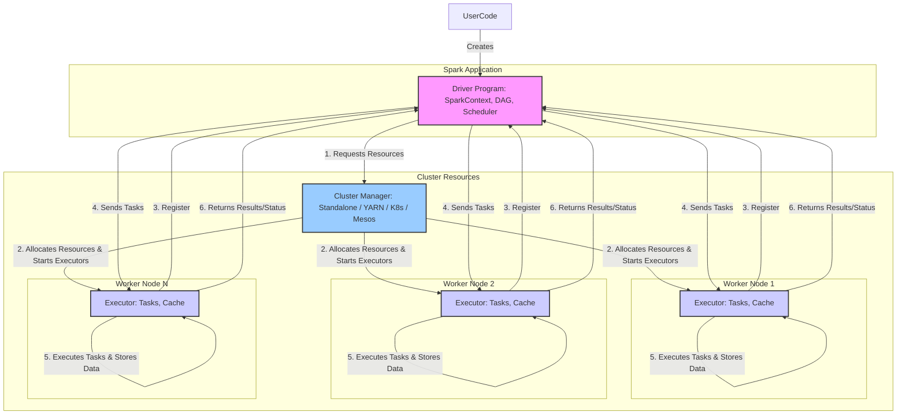
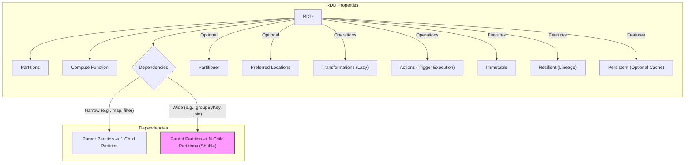
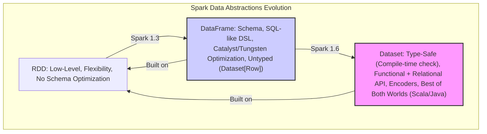
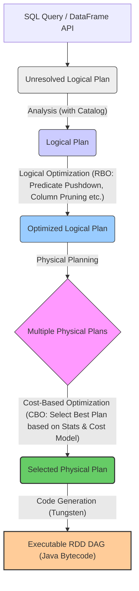

# 第二部分：Spark内核深度解析 (Deep Dive into Spark Kernel)

在了解了大数据处理引擎的通用基础和设计挑战之后，我们正式开始深入探索当今应用最为广泛的大数据处理引擎之一——Apache Spark。Spark 以其强大的内存计算能力、灵活的 API 和对多种计算范式（批处理、交互式查询、流处理、机器学习）的统一支持而备受青睐。

本部分将聚焦于 Spark 的内核机制。我们将从 Spark 的整体架构和核心数据抽象入手，逐步深入其作业执行流程、调度系统、内存管理、Shuffle 机制以及容错和 Structured Streaming 的核心原理。

## 第3章：Spark架构与核心抽象 (Spark Architecture & Core Abstractions)

理解 Spark 的第一步是掌握其宏观架构和赖以构建其强大功能的基础——核心数据抽象。本章将详细介绍 Spark 的集群架构，剖析其最初也是最核心的抽象 RDD，并探讨其向 DataFrame 和 Dataset 演进的历程与原因，最后概述 Spark SQL 及其强大的 Catalyst 优化器。

### 3.1 Spark整体架构 (Driver, Executor, Cluster Manager)

Spark 应用程序运行在一个集群之上，其架构遵循经典的 Master-Slave 模型。一个典型的 Spark 集群包含以下几个关键组件：

*   **Driver Program (驱动程序):**
    *   **角色:** 用户编写的 Spark 应用程序的主入口点，运行 `main` 函数。
    *   **职责:**
        1.  **创建 SparkContext:** SparkContext (或 SparkSession) 是与 Spark 集群交互的入口，负责连接到 Cluster Manager，申请资源，提交作业等。
        2.  **将用户代码转换为作业 (Job):** 将用户定义的 RDD/DataFrame/Dataset 操作（Transformations and Actions）转换为一个或多个 Spark 作业。
        3.  **DAG 生成与优化:** 为每个作业构建逻辑执行计划 (DAG)，并进行初步优化。
        4.  **任务调度:** 与 Cluster Manager 协作，将任务 (Task) 分发到 Executor 上执行。
        5.  **跟踪 Executor 状态:** 监控任务执行情况，处理任务失败和重试。
        6.  **结果回传:** 将 Executor 执行的结果汇总或返回给用户。
    *   **位置:** Driver 可以运行在集群的 Master 节点上（`cluster` 部署模式），也可以运行在集群外部的客户端机器上（`client` 部署模式）。

*   **Executor (执行器):**
    *   **角色:** 在集群的工作节点 (Worker Node) 上运行的进程。
    *   **职责:**
        1.  **执行任务 (Task):** 接收来自 Driver 的任务，并在其分配到的 CPU core 上执行计算。
        2.  **数据存储:** 将 RDD 分区数据或计算的中间结果存储在内存或磁盘上。
        3.  **与 Driver 通信:** 向 Driver 汇报任务状态和执行结果。
    *   **生命周期:** 每个 Spark 应用启动时会创建一组 Executor，它们会持续运行直到应用结束（除非发生故障）。每个 Executor 拥有一定数量的 CPU core 和内存资源。

*   **Cluster Manager (集群管理器):**
    *   **角色:** 负责集群资源的分配和管理。
    *   **职责:** 为 Spark 应用程序分配运行所需的 Worker Node 上的资源（CPU、内存）。
    *   **类型:** Spark 支持多种 Cluster Manager：
        *   **Standalone:** Spark 自带的简易集群管理器，易于部署，适合小型集群或测试。
        *   **Apache Hadoop YARN:** Hadoop 生态系统的标准资源管理器，功能完善，是生产环境中最常用的选择。
        *   **Apache Mesos:** 另一个通用的集群管理器（近年来使用相对减少）。
        *   **Kubernetes (K8s):** 云原生时代流行的容器编排系统，Spark 对 K8s 的支持日益完善，成为重要的部署选项。

**总结运行流程:**

1.  用户提交 Spark 应用程序代码。
2.  Driver Program 启动，创建 SparkContext。
3.  SparkContext 连接到 Cluster Manager。
4.  Cluster Manager 根据 Driver 的请求，在 Worker Node 上分配资源并启动 Executor 进程。
5.  Executor 启动后向 Driver 注册自身。
6.  Driver 将用户代码解析成 RDD 操作，构建 DAG，并将 DAG 划分为 Stages，生成 Tasks。
7.  Driver 将 Tasks 发送给注册的 Executor。
8.  Executor 执行 Tasks，并将结果或状态返回给 Driver。
9.  所有 Tasks 完成后，Driver 可以将结果汇总返回给用户，或者写入外部存储。
10. SparkContext 关闭，释放所有 Executor 和资源。

这个架构使得 Spark 能够有效地将计算任务分布到集群中，并管理资源的分配和任务的执行。

### 3.2 RDD：弹性分布式数据集的设计与实现

RDD (Resilient Distributed Dataset) 是 Spark 1.x 时代最核心的数据抽象，也是理解 Spark 工作原理的基础。尽管 DataFrame/Dataset API 在 Spark 2.x 后成为主流，但它们底层仍然是基于 RDD 实现的。

**RDD 的核心特性：**

1.  **分布式 (Distributed):** 一个 RDD 被划分为多个分区 (Partition)，每个分区可以在集群中的不同节点上并行计算。
2.  **弹性 (Resilient):** RDD 具备容错能力。它通过 **血统 (Lineage)** 来记录 RDD 之间的转换关系。如果某个分区的数据丢失（例如节点故障），Spark 可以根据 Lineage 信息重新计算生成该分区，而无需全局回滚。
3.  **数据集 (Dataset):** RDD 是一个包含数据元素的集合。这些元素可以是任意类型的 Java/Scala/Python 对象。
4.  **不可变 (Immutable):** RDD 一旦创建就不能被修改。对 RDD 的操作（Transformation）会生成一个新的 RDD，而不是在原地修改。这种不可变性简化了并发控制和容错实现。
5.  **惰性求值 (Lazy Evaluation):** 对 RDD 的转换操作 (Transformation, 如 `map`, `filter`) 并不会立即执行，而只是记录下 Lineage。只有当遇到行动操作 (Action, 如 `count`, `collect`, `saveAsTextFile`) 时，Spark 才会真正触发计算。
6.  **(可选) 分区策略 (Partitioning):** 对于键值对 (Key-Value) 类型的 RDD，可以指定分区器 (Partitioner)，如 HashPartitioner 或 RangePartitioner，来控制数据如何根据 Key 分布到不同的分区。这对于优化需要 Shuffle 的操作（如 `reduceByKey`, `join`）至关重要。
7.  **(可选) 持久化 (Persistence):** 用户可以选择将 RDD 的分区数据缓存到内存 (Memory) 或磁盘 (Disk)，或者两者的组合。当后续操作需要再次访问该 RDD 时，可以直接从缓存中读取，避免重复计算，显著提升性能。常用的持久化级别包括 `MEMORY_ONLY`, `MEMORY_AND_DISK`, `DISK_ONLY` 等。

**RDD 的内部表示：**

一个 RDD 对象主要包含以下信息：

*   **分区列表 (List of Partitions):** RDD 如何被划分成多个分区。
*   **计算函数 (Compute Function):** 如何基于父 RDD 的分区计算当前 RDD 的分区。
*   **依赖关系 (Dependencies):** 当前 RDD 依赖于哪些父 RDD。依赖关系分为两种：
    *   **窄依赖 (Narrow Dependency):** 父 RDD 的每个分区最多只被子 RDD 的一个分区使用。例如 `map`, `filter`。窄依赖允许在单个节点上进行流水线 (Pipelined) 计算，无需网络 Shuffle。
    *   **宽依赖 (Wide Dependency / Shuffle Dependency):** 父 RDD 的一个分区可能被子 RDD 的多个分区使用。例如 `groupByKey`, `reduceByKey`, `join` (当 Key 未预先分区时)。宽依赖通常需要进行网络 Shuffle 操作，将相关 Key 的数据汇集到同一个节点进行处理。
*   **(可选) 分区器 (Partitioner):** 对于 Key-Value 型 RDD，记录了使用的分区策略。
*   **(可选) 优先位置 (Preferred Locations):** 对于从 HDFS 等存储读取数据的 RDD，会记录每个分区的优先计算位置（通常是数据所在的节点），以便实现数据本地性 (Data Locality)。

**RDD 的优点：**

*   **灵活性:** 可以处理各种结构化、半结构化和非结构化数据，用户可以定义任意复杂的计算逻辑。
*   **容错性:** 基于 Lineage 的容错机制相对轻量，对于无状态计算很高效。
*   **表达能力强:** 能够很好地支持迭代计算（如机器学习算法）和交互式数据挖掘。

**RDD 的缺点：**

*   **性能:** 相比 DataFrame/Dataset，RDD API 没有利用 Schema 信息，难以进行深度优化（如列式存储、代码生成）。对于需要序列化/反序列化的操作，以及 Python RDD 与 JVM 之间的数据传输，开销较大。
*   **易用性:** 对于常见的结构化数据分析任务，RDD API 相对冗长，不如 SQL 或 DataFrame 直观。

理解 RDD 的设计思想，特别是分区、依赖、Lineage 和惰性求值，是掌握 Spark 作业执行、调度和容错机制的关键。

### 3.3 从RDD到DataFrame/Dataset：演进与优势

虽然 RDD 提供了强大的底层抽象，但在处理结构化数据和进行复杂查询优化方面存在不足。为了克服这些限制并提供更易用、更高性能的 API，Spark 引入了 DataFrame 和 Dataset。

**DataFrame (Spark 1.3+):**

*   **概念:** DataFrame 是一种将数据组织成带命名列的分布式数据集，类似于关系数据库中的表或 R/Python 中的 Data Frame。
*   **特点:**
    *   **Schema 信息:** DataFrame 拥有 Schema，即每列的名称和数据类型。这使得 Spark 可以进行更智能的优化。
    *   **类 SQL 操作:** 提供了一套丰富的 DSL (Domain Specific Language) 操作，类似于 SQL (如 `select`, `filter`, `groupBy`, `agg`, `join`)。
    *   **数据源支持:** 可以轻松地从多种结构化数据源（JSON, Parquet, JDBC, Hive tables 等）创建 DataFrame。
    *   **Catalyst 优化器:** DataFrame 的操作会被 Catalyst 优化器进行分析、优化，并生成高效的物理执行计划。
    *   **Tungsten 项目优化:** 底层受益于 Tungsten 项目的优化，如内存中的列式存储 (Off-Heap)、代码生成等，显著提升性能。
    *   **语言接口:** 在 Scala, Java, Python, R 中都可用。
    *   **类型:** DataFrame 在 Scala/Java API 中是 `Dataset[Row]` 的别名，其中 `Row` 是一个通用的、无类型的 JVM 对象。因此，DataFrame 在编译时缺乏类型安全检查。

**Dataset (Spark 1.6+):**

*   **概念:** Dataset 是 DataFrame API 的扩展，旨在提供 RDD 的强类型优势（编译时类型检查）和 DataFrame 的性能优势（Catalyst 优化）。
*   **特点:**
    *   **强类型 (Type-Safe):** Dataset 是参数化的类型，例如 `Dataset[Person]`。用户可以直接操作 Dataset 中的领域对象（如 `Person` 对象），编译器可以在编译时检查类型错误。
    *   **统一 API:** 提供了函数式 API (类似 RDD，如 `map`, `filter`, `flatMap`) 和关系型 API (类似 DataFrame，如 `select`, `filter`)。
    *   **Encoder:** 使用称为 Encoder 的机制在 JVM 领域对象和 Spark 内部的 Tungsten 二进制格式之间进行高效转换。Encoder 知道对象的结构，可以生成优化的字节码进行序列化/反序列化。
    *   **语言接口:** 主要在 Scala 和 Java 中提供强类型支持。Python 中由于其动态类型特性，DataFrame 仍然是主要接口（虽然内部实现也基于 Dataset）。
    *   **性能:** 兼具 RDD 的类型安全和 DataFrame 的性能优化。

**演进关系:**

可以认为：**DataFrame = Dataset[Row]**

**DataFrame/Dataset 的优势:**

1.  **更高的性能:**
    *   **Catalyst 优化器:** 对结构化查询进行复杂的逻辑和物理优化。
    *   **Tungsten 执行引擎:** 利用内存列式存储、代码生成、减少 GC 等技术，大幅提升 CPU 和内存效率。
    *   **Schema 利用:** 列式处理只访问需要的列，谓词下推更有效。
2.  **更易用的 API:**
    *   类 SQL 的声明式 API 更简洁、直观，尤其适合数据分析师。
    *   丰富的内置函数库。
3.  **统一的数据访问:** 可以无缝对接各种结构化和半结构化数据源。
4.  **编译时类型安全 (Dataset):** 减少运行时错误，提高代码健壮性（主要针对 Scala/Java）。

**何时选择？**

*   **优先使用 DataFrame/Dataset:** 对于绝大多数场景，特别是处理结构化或半结构化数据时，应优先选择 DataFrame/Dataset API，以获得最佳的性能和易用性。
*   **使用 RDD:** 当需要对数据进行非常底层的控制，或者处理完全非结构化的数据（如文本、二进制数据），或者需要实现 DataFrame/Dataset API 无法表达的复杂逻辑时，才考虑直接使用 RDD API。也可以通过 `df.rdd` 或 `ds.rdd` 从 DataFrame/Dataset 获取底层的 RDD 进行操作。

DataFrame 和 Dataset 的引入是 Spark 发展过程中的重要里程碑，它们使得 Spark 在易用性和性能上都得到了极大的提升，巩固了其在大数据处理领域的领先地位。

### 3.4 Spark SQL与Catalyst优化器概览

Spark SQL 是 Spark 中用于处理结构化数据的模块。它不仅允许用户使用 SQL 语句查询数据，还统一了 DataFrame 和 Dataset 的 API 接口。其核心是强大的 **Catalyst 优化器**。

**Spark SQL 功能:**

*   **SQL 查询:** 可以直接在 Spark 应用程序中编写 SQL (或 HiveQL) 查询来操作 DataFrame。
*   **DataFrame/Dataset API:** 提供 Scala, Java, Python, R 的 DSL 接口。
*   **统一数据访问:** 支持从多种数据源（Hive, Parquet, JSON, JDBC, ORC 等）读取和写入数据，并能自动推断 Schema。
*   **Hive 集成:** 可以方便地与现有的 Hive Metastore、数据和 UDF 进行交互。
*   **标准兼容:** 努力兼容 ANSI SQL 标准。

**Catalyst 优化器:**

Catalyst 是 Spark SQL 的核心，负责将用户编写的 SQL 查询或 DataFrame/Dataset 操作转换成高效的物理执行计划。它是一个基于 **规则 (Rule-Based)** 和 **成本 (Cost-Based)** 的可扩展优化器。

**优化流程概览:**

1.  **解析 (Parsing):** 将 SQL 字符串或 DataFrame/Dataset API 调用解析成 **未解析的逻辑计划 (Unresolved Logical Plan)**。此时，只知道操作的结构，但不知道列名、表名是否存在，类型是否匹配等。
2.  **分析 (Analysis):** 利用 **Catalog** (元数据存储，如 Hive Metastore 或内存 Catalog) 中的信息，对未解析的逻辑计划进行分析，绑定表名、列名，检查类型，最终生成 **逻辑计划 (Logical Plan)**。
3.  **逻辑优化 (Logical Optimization):** 应用一系列 **基于规则的优化 (Rule-Based Optimization, RBO)** 到逻辑计划上，例如：
    *   **谓词下推 (Predicate Pushdown):** 将 `filter` 操作尽可能靠近数据源。
    *   **列裁剪 (Column Pruning):** 只扫描和处理查询真正需要的列。
    *   **常量折叠 (Constant Folding):** 预先计算常量表达式 (如 `1+2` 变为 `3`)。
    *   **投影下推 (Projection Pushdown):** 将 `select` 操作下推。
    *   **布尔表达式简化** 等。
    这些规则会反复应用，直到计划不再变化（达到不动点）。
4.  **物理计划生成 (Physical Planning):** 将优化后的逻辑计划转换成一个或多个 **物理计划 (Physical Plan)**。一个逻辑操作可能有多种物理实现方式（例如，Join 可以有 Broadcast Hash Join, Shuffle Hash Join, Sort Merge Join 等）。Catalyst 会生成所有可能的物理计划。
5.  **成本模型优化 (Cost-Based Optimization, CBO):** (如果启用了 CBO 并且有统计信息) 使用 **成本模型** 估算每个物理计划的执行成本（考虑数据大小、基数、资源消耗等），选择成本最低的物理计划作为最终执行计划。
6.  **代码生成 (Code Generation):** 将最终的物理计划（由 RDD 操作组成）通过 Tungsten 引擎转换成高效的 Java 字节码在 Executor 上执行。

**Catalyst 的优势:**

*   **可扩展性:** 易于添加新的优化规则和数据源支持。
*   **语言无关:** 优化器作用于逻辑计划和物理计划树，不依赖于具体的编程语言 API。
*   **自动优化:** 对用户透明，能够自动将用户的声明式查询转换成高效的执行计划。

Catalyst 优化器是 Spark SQL 高性能的关键所在，它使得用户可以用简洁的 SQL 或 DataFrame/Dataset API 编写查询，而引擎则负责底层的复杂优化和高效执行。

---

本章我们了解了 Spark 的宏观架构，包括 Driver、Executor 和 Cluster Manager 的角色与交互。接着深入探讨了 Spark 的核心抽象 RDD 的设计理念及其特性，并分析了其向 DataFrame 和 Dataset 演进的原因与优势。最后，概述了 Spark SQL 模块及其强大的 Catalyst 优化器的工作流程。这些构成了理解 Spark 内核的基础，为后续章节分析作业执行、调度、内存管理等细节奠定了基础。 