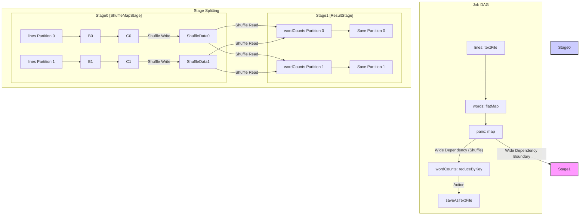
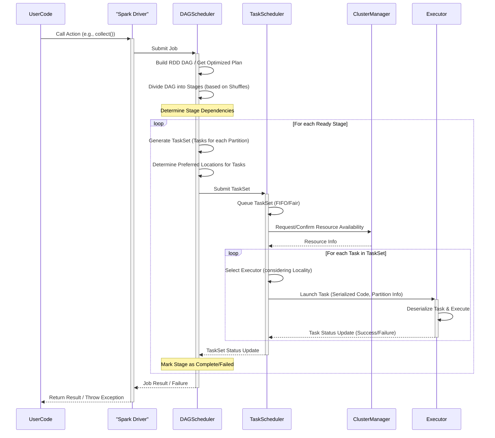

## 第4章：Spark作业执行流程 (Spark Job Execution Flow)

上一章我们了解了 Spark 的静态架构和核心数据抽象（RDD, DataFrame, Dataset）以及强大的 Catalyst 优化器。本章我们将深入探讨 Spark 如何将用户的应用程序代码动态地转化为可以在集群上分布式执行的任务，并最终产出结果。理解作业执行流程是掌握 Spark 性能调优、问题诊断的关键。

我们将沿着一个 Spark 作业从提交到完成的生命周期，依次剖析逻辑计划生成、Catalyst 优化（承接上章）、DAG 的 Stage 划分、Task 的生成与调度，以及最终的任务执行与结果回传过程。

### 4.1 作业提交与逻辑计划生成

Spark 作业的执行始于用户代码中的一个 **行动操作 (Action)**。回顾 RDD 的惰性求值特性，所有的转换操作 (Transformation) 仅仅是构建 RDD 之间的依赖关系 (Lineage)，形成一个计算蓝图（逻辑上的 DAG）。只有当一个 Action 操作被调用时，例如 `count()`, `collect()`, `saveAsTextFile()`, `foreach()` 等，Spark 才会真正开始规划和执行计算。

**流程起点：Action 操作**

1.  **触发 Job:** 当 Driver 端的代码调用一个 Action 操作时，该操作会触发 SparkContext (或 SparkSession) 提交一个 **作业 (Job)**。
2.  **RDD Lineage (或 DataFrame/Dataset 逻辑计划) 回溯:** Spark 从触发 Action 的最终 RDD (或 DataFrame/Dataset) 开始，沿着其 Lineage (依赖关系) 向前回溯，直到遇到数据源 RDD (如从 HDFS 读取数据) 或已被缓存 (Persisted) 的 RDD。
3.  **构建初始 DAG/逻辑计划:** 这个回溯过程形成了该 Job 所需计算的完整 DAG (对于 RDD API) 或初始的逻辑计划 (对于 DataFrame/Dataset API)。

**以 RDD 为例 (Word Count):**

```scala
val lines = sc.textFile("hdfs://...") // HDFS Text File RDD (Source)
val words = lines.flatMap(_.split(" ")) // FlatMappedRDD
val pairs = words.map(word => (word, 1)) // MappedRDD
val wordCounts = pairs.reduceByKey(_ + _) // ShuffledRDD

wordCounts.saveAsTextFile("hdfs://output") // Action: Triggers a Job
```

当 `saveAsTextFile` 被调用时：
*   Spark 知道需要计算 `wordCounts` 这个 RDD。
*   它回溯发现 `wordCounts` 依赖 `pairs` (通过 `reduceByKey`，宽依赖)。
*   `pairs` 依赖 `words` (通过 `map`，窄依赖)。
*   `words` 依赖 `lines` (通过 `flatMap`，窄依赖)。
*   `lines` 是一个数据源 RDD。
*   至此，构建了从 `lines` 到 `wordCounts` 的完整 RDD DAG。

**以 DataFrame/Dataset 为例:**

```scala
val df = spark.read.json("path/to/data.json") // DataFrame (Source)
val filteredDf = df.filter($"age" > 21)
val resultDf = filteredDf.groupBy("city").agg(avg("salary").as("avg_salary"))

resultDf.write.parquet("path/to/output") // Action: Triggers a Job
```

当 `write.parquet` 被调用时：
*   Spark SQL (通过 Catalyst) 将 DataFrame 的链式操作 (`filter`, `groupBy`, `agg`) 解析成一个初始的 **逻辑计划 (Logical Plan)** 树。
*   这个逻辑计划精确地表达了用户的计算意图，但尚未经过优化。

无论是 RDD DAG 还是 DataFrame/Dataset 的逻辑计划，它们都只是计算逻辑的表示，下一步需要对其进行优化。

### 4.2 Catalyst优化器：逻辑优化与物理计划生成 (Rule-based, Cost-based)

对于 DataFrame/Dataset API（以及 Spark SQL 查询），上一步生成的初始逻辑计划会被提交给 Catalyst 优化器进行深度优化。这个过程在第 3.4 节已有概述，这里我们将其置于作业执行流程中再次强调其作用：

1.  **分析 (Analysis):** 解析未绑定的属性和关系，生成 **逻辑计划 (Logical Plan)**。
2.  **逻辑优化 (Logical Optimization):** 应用一系列基于规则的优化 (RBO)，如谓词下推、列裁剪、常量折叠等，生成 **优化后的逻辑计划 (Optimized Logical Plan)**。这一步旨在简化计算逻辑，减少不必要的操作。
3.  **物理计划生成 (Physical Planning):** 将优化后的逻辑计划转换为一个或多个 **物理计划 (Physical Plan)**。例如，逻辑上的 Join 操作可以映射为多种物理 Join 策略（Broadcast Hash Join, Shuffle Hash Join, Sort Merge Join）。
4.  **成本优化 (Cost-Based Optimization, CBO):** 如果启用 CBO 且存在统计信息，Catalyst 会估算不同物理计划的执行成本，选择最优的一个。
5.  **最终物理计划:** 选定的物理计划是一棵由具体 Spark 可执行操作（底层通常对应 RDD 操作）组成的树。

**关键点：** Catalyst 的目标是将用户的高层声明式查询（SQL 或 DataFrame API）转换成尽可能高效的底层执行计划（最终体现为 RDD 的 DAG）。优化过程对用户透明。

对于直接使用 RDD API 的情况，则没有 Catalyst 优化器介入，用户定义的 RDD 操作直接构成了执行的基础 DAG。

### 4.3 DAG划分：Stage的切分原理 (宽依赖与窄依赖)

无论是经过 Catalyst 优化的物理计划（最终仍是 RDD 操作的 DAG）还是用户直接定义的 RDD DAG，下一步都需要将其划分为可以并行执行的任务单元。这个划分过程由 **DAGScheduler** 完成，其核心依据是 RDD 之间的 **依赖关系**，特别是 **宽依赖 (Shuffle Dependency)**。

**划分原则：**

*   **Stage (阶段):** 一个 Stage 包含了一组可以 **流水线式 (Pipelined)** 执行的、**没有 Shuffle** 的窄依赖 RDD 转换操作。
*   **划分边界:** DAG 中每次出现 **宽依赖 (Shuffle Dependency)** 时，就必须划分一个新的 Stage。
*   **原因:** 宽依赖意味着数据需要在节点间进行重新分区和传输（Shuffle），子 Stage 的任务必须等待父 Stage 所有 Shuffle 写出任务完成后才能开始执行（读取 Shuffle 数据）。而 Stage 内部的窄依赖转换可以在同一个任务内连续执行，无需等待或网络传输。

**Stage 类型：**

*   **ShuffleMapStage:** Stage 的最终输出是为下一个 Stage 提供 Shuffle 数据。其任务称为 `ShuffleMapTask`。
*   **ResultStage:** Stage 的计算是为了直接生成最终结果（例如执行 Action 操作如 `count`, `collect`, `saveAsTextFile`）。其任务称为 `ResultTask`。一个 Job 至少包含一个 ResultStage，也可能包含零个或多个 ShuffleMapStage。

**示例 (Word Count RDD DAG):**

回顾之前的 Word Count 例子：
`lines (Source) -> flatMap (Narrow) -> map (Narrow) -> reduceByKey (Wide) -> saveAsTextFile (Action)`



*   `lines -> flatMap -> map` 这些操作都是窄依赖，它们可以在同一个 Stage (Stage 0) 内流水线执行。因为 `reduceByKey` 是一个宽依赖，它需要读取所有 `map` 操作产生的、根据 Key 重新分区的数据，所以在 `map` 和 `reduceByKey` 之间必须划分 Stage。
*   **Stage 0 (ShuffleMapStage):** 负责从 `lines` 计算到 `pairs`，并将 `pairs` 的结果（(word, 1)）根据 `word` 进行 Shuffle 写出（例如，按照 Hash 分区）。
*   **Stage 1 (ResultStage):** 等待 Stage 0 所有任务完成后，读取 Shuffle 数据，执行 `reduceByKey` 操作（在每个分区内对相同 Key 的值进行聚合），最后执行 `saveAsTextFile` 这个 Action 操作，将结果写入 HDFS。

**Stage 划分的重要性：**

*   **并行度:** Stage 内部的任务可以高度并行执行。
*   **调度:** Stage 是 DAGScheduler 向 TaskScheduler 提交任务的基本单位 (TaskSet)。
*   **容错:** 如果一个 Stage 的某个任务失败，只需要重试该任务。如果 Stage 因为节点丢失等原因导致 Shuffle 输出丢失，可能需要重新计算整个 Stage。
*   **性能:** Shuffle 是 Spark 中开销最大的操作之一，Stage 的划分明确了 Shuffle 的边界，有助于理解和优化性能瓶颈。

DAGScheduler 通过分析 RDD 的依赖关系，逆向（从最终 RDD 向前）划分 Stage，确保了任务执行的逻辑正确性和依赖满足。

### 4.4 Task的生成与调度 (DAGScheduler, TaskScheduler)

Stage 划分完成后，Spark 需要将每个 Stage 转换成具体的、可以在 Executor 上执行的 **任务 (Task)**，并进行调度。

**核心组件：**

*   **DAGScheduler (位于 Driver 端):**
    *   **职责:**
        1.  接收 Job 提交请求（由 Action 触发）。
        2.  根据 RDD Lineage 和 Shuffle 边界将 Job 划分为 Stages。
        3.  确定 Stage 之间的依赖关系（父 Stage 必须先执行）。
        4.  为每个 Stage 生成一组 **任务 (Tasks)**，称为 **TaskSet**。Task 的数量通常等于 Stage 末端 RDD 的分区数量。
        5.  决定每个 Task 的 **优先执行位置 (Preferred Locations)**，以最大化数据本地性（例如，HDFS Block 所在的节点，缓存数据所在的节点）。
        6.  将准备好的 TaskSet 提交给 TaskScheduler。
        7.  跟踪 Stage 的完成情况，处理失败的 Stage (可能需要重提交父 Stage) 或失败的任务 (通知 TaskScheduler)。

*   **TaskScheduler (位于 Driver 端，但与 Executor 交互):**
    *   **职责:**
        1.  接收来自 DAGScheduler 的 TaskSet。
        2.  根据集群资源状况 (通过 Cluster Manager 获取) 和调度策略 (FIFO, Fair) 对 TaskSet 排队。
        3.  为每个 Task 选择一个合适的 Executor 进行分配（考虑数据本地性、Executor 负载等）。
        4.  将 Task **启动 (Launch)** 到选定的 Executor 上。
        5.  监控 Task 的执行状态 (Success, Failure)。
        6.  处理 Task 失败：通知 DAGScheduler，并根据策略决定是否以及在何处重试该 Task (通常最多重试几次)。
        7.  处理 Straggler Task (推测执行 Speculative Execution，如果启用)。
    *   **接口:** TaskScheduler 是一个接口，有不同的实现，如 `TaskSchedulerImpl` (与 Standalone, YARN, K8s 等集成)。它通过 `SchedulerBackend` 与具体的 Cluster Manager 通信以获取资源和启动任务。

**Task 生成:**

*   对于一个 Stage，DAGScheduler 会查看其最终 RDD 的分区信息。
*   该 RDD 有多少个分区，DAGScheduler 就会为该 Stage 创建多少个 Task。
*   每个 Task 负责计算其对应 RDD 分区的数据。
*   Task 内部包含了执行该分区计算所需的完整代码（序列化后的闭包）、分区信息、依赖的 Shuffle 数据位置等。



这个流程清晰地展示了 DAGScheduler (负责逻辑层面的 Stage 划分和 Task 生成) 与 TaskScheduler (负责物理层面的资源分配和 Task 分发) 之间的协作关系。

### 4.5 作业执行与结果回传

当 TaskScheduler 将 Task 发送给选定的 Executor 后，实际的计算过程就在 Executor 端开始了。

**Executor 端执行:**

1.  **接收与反序列化:** Executor 的线程池接收到来自 Driver (通过 TaskScheduler) 发送过来的序列化 Task 数据。
2.  **反序列化:** Executor 反序列化 Task 数据，获取需要执行的代码（闭包）、RDD 分区信息、依赖关系以及输入数据的位置（例如 HDFS 文件路径、父 Stage 的 Shuffle 输出地址）。
3.  **获取数据:** Task 开始执行，首先需要获取其处理所需的数据。
    *   如果是 Stage 的第一个 RDD，可能从外部存储（如 HDFS）读取指定分区的数据。
    *   如果依赖于父 Stage 的 Shuffle 输出，则通过 **BlockManager** 从其他 Executor (或本地) 拉取所需的 Shuffle 数据块。
4.  **执行计算:** Task 按照 RDD 的转换逻辑，依次执行计算。如果是窄依赖，数据可以在内存中流水线式处理；如果是 Stage 的第一个操作，则会触发 Shuffle Read。
5.  **存储输出:**
    *   **ShuffleMapTask:** 将计算结果（通常是 Key-Value 对）根据下游 Stage 的分区器进行分区，并将分区后的数据写入本地磁盘的 **Shuffle 文件** 中。写完后，将数据块的位置信息汇报给 Driver 端的 MapOutputTracker。
    *   **ResultTask:** 直接将计算结果返回给 Driver。如果结果集很大，可能会分批次返回或采取其他策略避免 Driver OOM。
6.  **状态汇报:** Task 执行完成后（成功或失败），Executor 将状态汇报给 Driver 端的 TaskScheduler。

**结果回传与 Job 完成:**

*   **中间结果 (Shuffle 数据):** ShuffleMapTask 的结果（数据块位置）由 Executor 汇报给 Driver 端的 **MapOutputTracker**。当子 Stage 的 Task 需要读取 Shuffle 数据时，会向 MapOutputTracker 查询数据的位置，然后直接从持有数据的 Executor 拉取。
*   **最终结果 (Action 操作):** ResultTask 的结果由 Executor 直接发送回 Driver。
    *   对于 `collect()` 等操作，Driver 会收集所有 ResultTask 的结果并在内存中聚合，如果结果集过大可能导致 Driver OOM。
    *   对于 `count()`, `sum()` 等聚合操作，每个 ResultTask 计算其分区的局部结果，Driver 负责将所有局部结果合并得到最终值。
    *   对于 `saveAsTextFile()` 等写入操作，每个 ResultTask 负责将其分区的结果写入目标存储系统的对应分区文件，Driver 只需知道所有任务是否成功完成。
*   **Job 完成:** 当一个 Job 的所有 Stage 都成功完成（特别是最终的 ResultStage 完成）后，DAGScheduler 会标记该 Job 为成功，并将最终结果（或成功状态）返回给调用 Action 操作的用户代码。

**容错处理:**
*   如果 Task 执行失败，TaskScheduler 会尝试在其他 Executor 上重试（默认最多 4 次）。
*   如果 Task 重试多次仍然失败，或者由于 FetchFailure (无法拉取 Shuffle 数据) 导致 Stage 无法进行，TaskScheduler 会通知 DAGScheduler。
*   DAGScheduler 可能会中止整个 Job，或者根据情况尝试重新提交失败 Stage 的父 Stage (如果 Shuffle 数据丢失)。

---

本章详细梳理了 Spark 作业从用户代码中的 Action 操作触发，到最终结果返回或写入的完整执行流程。我们看到了逻辑计划的生成与优化、基于 Shuffle 依赖的 Stage 划分、DAGScheduler 与 TaskScheduler 的协作进行 Task 生成与调度，以及 Executor 端任务执行、Shuffle 处理和结果回传的关键步骤。理解这一流程对于分析 Spark 作业性能、诊断瓶颈以及进行有效调优至关重要。 