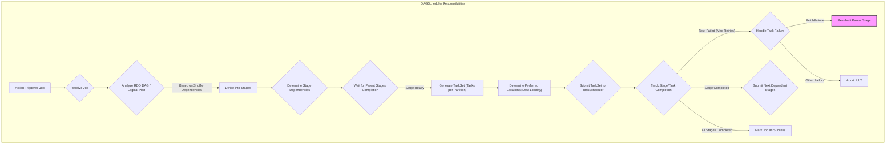
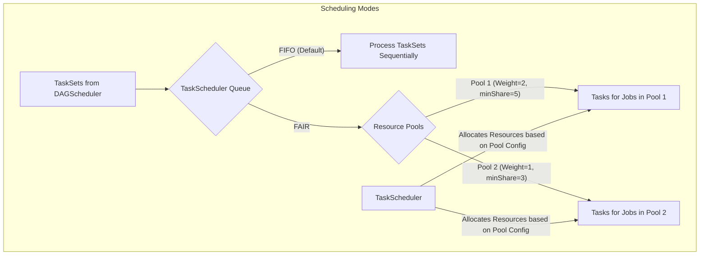
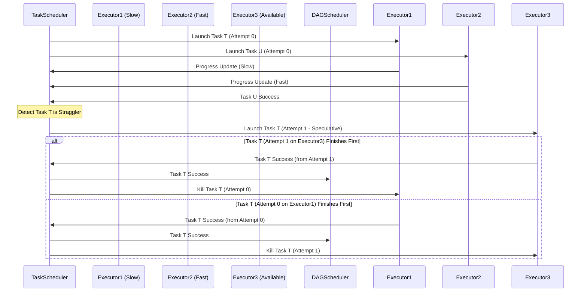
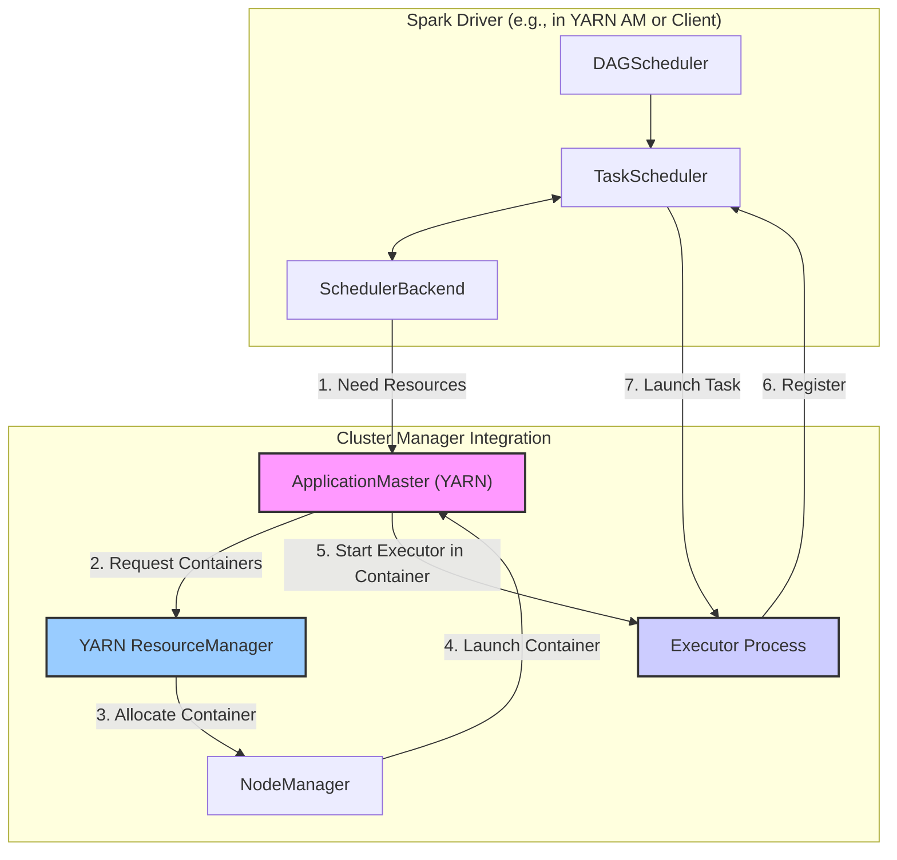

## 第5章：Spark调度系统详解 (Spark Scheduling System in Detail)

在上一章，我们了解了 Spark 作业从 RDD DAG/逻辑计划到 Stage 划分再到 Task 生成的整体流程。这个过程中，调度系统扮演着至关重要的角色，它负责将逻辑上的计算图转化为物理上可在集群中高效、可靠执行的任务流。Spark 的调度系统主要由位于 Driver 端的 DAGScheduler 和 TaskScheduler 两大核心组件构成。

本章将详细剖析这两个组件的内部工作机制、它们之间的交互，以及 Spark 提供的关键调度特性，如推测执行和与外部资源管理器的集成。

### 5.1 DAGScheduler：Stage提交与任务集管理

DAGScheduler 是 Spark 调度系统的 **高级调度层 (High-Level Scheduler)**，它工作在 **逻辑层面**，负责将用户提交的 Job 划分为 Stages，跟踪 Stage 的状态，并将准备好的 TaskSet 提交给底层的 TaskScheduler。

**核心职责回顾与深化：**

1.  **Job 接收与 Stage 划分:**
    *   当 Action 操作触发 Job 提交时，DAGScheduler 接收到请求 (`runJob` 方法)。
    *   它根据最终 RDD/DataFrame 的 Lineage **逆向** 遍历 DAG。
    *   每当遇到 **宽依赖 (ShuffleDependency)** 时，就在此切分出一个新的 Stage。父 Stage (产生 Shuffle 数据的 Stage) 称为 `ShuffleMapStage`，子 Stage (读取 Shuffle 数据的 Stage) 或最终执行 Action 的 Stage 称为 `ResultStage`。
    *   这个过程会递归进行，直到所有依赖的 Stages 都被创建或找到已计算的缓存。
    *   DAGScheduler 会维护 Stages 之间的依赖关系图。

2.  **TaskSet 生成:**
    *   对于一个准备就绪的 Stage (其父 Stages 都已完成)，DAGScheduler 会为其创建一个 **TaskSet**。
    *   TaskSet 包含一组 Task，每个 Task 对应 Stage 最终 RDD 的一个分区。
    *   Task 的数量决定了该 Stage 的**并行度**。
    *   每个 Task 封装了执行该分区计算所需的全部信息：序列化的函数闭包、分区 ID、依赖的 Shuffle 信息、尝试 ID (Attempt ID) 等。

3.  **确定优先位置 (Preferred Locations):**
    *   为了最大化 **数据本地性 (Data Locality)**，减少网络传输开销，DAGScheduler 会为每个 Task 计算其**优先执行位置**。
    *   依据包括：
        *   **数据源位置:** 如果 Stage 读取 HDFS 数据，优先位置是 HDFS Block 所在的节点。
        *   **缓存位置:** 如果 RDD 被缓存，优先位置是缓存数据所在的 Executor 节点。
        *   **父 Stage Shuffle 输出位置:** 对于读取 Shuffle 数据的 Stage，理论上数据分散在各个 Mapper 节点的本地磁盘，但在某些 Shuffle 实现下（如 External Shuffle Service），位置信息可能更集中。
    *   优先位置信息会传递给 TaskScheduler，作为其分配 Task 的重要参考。

4.  **TaskSet 提交:**
    *   一旦 TaskSet 生成完毕，DAGScheduler 就调用 TaskScheduler 的 `submitTasks` 方法，将 TaskSet 提交给低级调度层进行物理调度。

5.  **Stage 状态跟踪与容错:**
    *   DAGScheduler 跟踪每个 Stage 的状态（Running, Completed, Failed）。
    *   当 TaskScheduler 汇报某个 Task 完成时，DAGScheduler 更新 Stage 的内部状态，记录已完成的分区。
    *   当一个 Stage 的所有 Task 都成功完成时，DAGScheduler 标记该 Stage 为 Completed，并查找是否有子 Stage 可以提交。
    *   **处理 Task 失败:** 如果 TaskScheduler 汇报某个 Task 失败（达到最大重试次数），DAGScheduler 会检查失败原因。
        *   如果是 **FetchFailure** (无法拉取父 Stage 的 Shuffle 数据)，通常意味着父 Stage 的 Shuffle 输出丢失（例如 Executor 宕机）。DAGScheduler 会标记父 Stage 为需要重新计算，并重新提交父 Stage。
        *   如果是其他类型的失败，并且是可重试的（例如 Executor 临时故障），DAGScheduler 可能会选择中止整个 Job (取决于配置和失败次数)。
    *   **处理 Stage 失败:** 如果一个 Stage 因为 Task 反复失败或 Shuffle 数据丢失而无法完成，DAGScheduler 会标记该 Stage 为 Failed，并最终导致整个 Job 失败。

DAGScheduler 通过管理 Stage 的生命周期和依赖关系，将复杂的 DAG 计算逻辑有序地转化为可以提交给 TaskScheduler 执行的任务集合。

### 5.2 TaskScheduler：资源分配与任务分发 (FIFO, Fair Scheduler)

TaskScheduler 是 Spark 调度系统的 **低级调度层 (Low-Level Scheduler)**，它直接与 Cluster Manager (通过 SchedulerBackend) 和 Executor 通信，负责 **物理层面** 的资源分配和任务分发。

**核心职责:**

1.  **接收 TaskSet:** 从 DAGScheduler 接收提交的 TaskSet。
2.  **资源管理:** 通过 `SchedulerBackend` 与 Cluster Manager 交互，了解集群中可用的 Executor 资源（节点、CPU cores、内存等）。
3.  **任务排队与调度策略:**
    *   当有多个 Job（或来自同一 Job 的不同 Stage）的 TaskSet 同时等待调度时，TaskScheduler 需要根据配置的 **调度策略 (Scheduling Mode)** 来决定优先调度哪个 TaskSet 中的 Task。
    *   **FIFO (First-In, First-Out):** 默认策略。按照 TaskSet 提交的先后顺序进行调度。简单公平，但可能导致重要的短作业被长时间运行的长作业阻塞。
    *   **FAIR (公平调度):** 将资源以公平的方式分配给不同的 **调度池 (Pool)**。每个 Pool 可以有不同的资源权重 (Weight) 和最小资源保证 (minShare)。可以将不同的 Job 或用户提交到不同的 Pool 中，实现资源隔离和优先级控制。FAIR 模式下，Pool 内部的任务通常也按 FIFO 调度，但可以配置子 Pool 的调度策略。

4.  **任务分配 (Task Assignment):**
    *   当有空闲资源（Executor core）时，TaskScheduler 会从待调度的 TaskSet 中选择一个 Task 进行分配。
    *   **关键考量：数据本地性 (Data Locality)**。TaskScheduler 会根据 DAGScheduler 提供的优先位置信息，尽可能将 Task 分配到数据所在的节点上执行，以减少网络传输。本地性级别从高到低分为：
        *   `PROCESS_LOCAL`: Task 在存储数据的 Executor 进程内执行（最高效）。
        *   `NODE_LOCAL`: Task 在存储数据的节点上的其他 Executor 执行（需要进程间通信或共享内存）。
        *   `NO_PREF`: Task 没有位置偏好。
        *   `RACK_LOCAL`: Task 在数据所在机架 (Rack) 的其他节点上执行（需要机架内网络传输）。
        *   `ANY`: Task 在集群中任意可用节点上执行（需要跨机架网络传输，最低效）。
    *   TaskScheduler 会在不同的本地性级别上**等待一小段时间** (由 `spark.locality.wait` 系列参数控制)，如果无法在更优的本地性级别找到资源，则会降低要求，尝试次优级别，最终在 `ANY` 级别找到可用资源就会分配。这是一种在**等待时间**和**网络开销**之间的权衡。

5.  **任务启动 (Task Launch):**
    *   一旦确定了 Task 和目标 Executor，TaskScheduler 就通过 `SchedulerBackend` 将序列化后的 Task 发送给该 Executor 请求启动。

6.  **状态监控与失败处理:**
    *   接收 Executor 对 Task 执行状态的汇报（Success, Failure）。
    *   **任务重试:** 如果 Task 失败，TaskScheduler 会负责在其内部进行重试（在不同的 Executor 上，如果可能），直到达到最大重试次数 (`spark.task.maxFailures`)。它会记录 Task 的尝试次数。
    *   **黑名单机制 (Blacklisting):** 如果某个 Task 在一个 Executor 上反复失败，或者某个 Executor 因为节点故障等原因导致大量 Task 失败，TaskScheduler 可以将该 Task (针对特定 Executor) 或整个 Executor/Node 加入**黑名单**，在一段时间内避免向其调度任务，以提高 Job 的成功率和稳定性。
    *   **通知 DAGScheduler:** 当 Task 最终成功或达到最大重试次数后仍然失败时，TaskScheduler 将结果通知 DAGScheduler。

TaskScheduler 作为物理执行的"指挥官"，负责将逻辑上的 TaskSet 高效、可靠地映射到实际的集群资源上。

### 5.3 任务推测执行 (Speculative Execution)

推测执行是 Spark 应对 **慢节点 (Straggler)** 问题的一种优化机制。在分布式环境中，由于硬件老化、后台负载、数据倾斜、GC 暂停等原因，某些节点上的 Task 可能执行得异常缓慢，即使它们没有失败，也会严重拖慢整个 Stage 甚至 Job 的完成时间。

**原理:**

1.  **检测慢任务:** TaskScheduler 会持续监控正在运行的任务的进度。它通过比较同一个 Stage 内所有任务的进度，识别出那些进度显著落后于中位数（或其他统计指标）的任务，将其标记为"慢任务"。
2.  **启动备份任务:** 当一个任务被识别为慢任务，并且 Stage 中大部分任务已经完成时，TaskScheduler 会在另一个空闲的 Executor 上启动一个该任务的 **备份副本 (Speculative Copy)**。
3.  **结果采纳:** 哪个任务实例（原始任务或备份任务）先成功完成，其结果就会被采纳，另一个实例则会被杀死。

**优点:**
*   可以显著缩短受慢节点影响的 Job 的执行时间。
*   提高了集群资源的整体利用率。

**缺点与注意事项:**
*   **资源浪费:** 推测执行会启动重复的任务，消耗额外的计算资源。如果集群资源紧张，可能会影响其他任务的执行。
*   **不适用于有副作用的任务:** 如果任务会写入外部系统（如数据库、文件系统），推测执行可能导致数据重复写入或状态不一致。需要确保任务的输出操作是**幂等的 (Idempotent)**，或者使用 Spark 提供的幂等输出机制（如 `FileOutputCommitter`）。
*   **参数调优:** 需要仔细调整相关参数（`spark.speculation`, `spark.speculation.interval`, `spark.speculation.quantile`, `spark.speculation.multiplier`）来平衡收益和开销，避免过于激进或保守的推测。
*   **误判:** 有时任务慢是由于数据倾斜等根本原因，推测执行无法解决问题，反而浪费资源。此时应先解决数据倾斜。

推测执行默认是关闭的 (`spark.speculation=false`)，用户需要根据应用特性和集群状况决定是否开启并进行调优。

### 5.4 调度策略与资源管理集成

Spark 的调度系统并非孤立运行，它需要与底层的 **资源管理器 (Cluster Manager)** 紧密集成，以获取资源、启动 Executor 和监控节点状态。

**集成方式:**

TaskScheduler 通过 **SchedulerBackend** 接口与具体的 Cluster Manager 进行通信。不同的 Cluster Manager 有不同的 SchedulerBackend 实现：

*   **Standalone:** `StandaloneSchedulerBackend` 直接与 Spark Master 和 Worker 通信。
*   **YARN:** `YarnSchedulerBackend` (配合 `YarnClusterScheduler` 或 `YarnClientScheduler`) 与 YARN ResourceManager 和 ApplicationMaster (AM) 交互。
    *   在 YARN `cluster` 模式下，Driver (运行在 AM 中) 通过 AM 向 ResourceManager 申请 Container 启动 Executor。
    *   在 YARN `client` 模式下，Driver 在客户端运行，它通过 AM (运行在集群中) 向 ResourceManager 申请资源。
*   **Kubernetes:** `K8sClusterManager` 和 `KubernetesClusterSchedulerBackend` 与 Kubernetes API Server 交互，创建 Executor Pods。
*   **Mesos:** (类似 YARN) `MesosSchedulerBackend` 与 Mesos Master 交互。

**资源协商过程 (以 YARN 为例):**

1.  TaskScheduler 判断需要更多资源 (例如，有待调度的 Task 但没有空闲 Executor core)。
2.  TaskScheduler 通过 `SchedulerBackend` (YarnSchedulerBackend) 通知 ApplicationMaster。
3.  ApplicationMaster 向 YARN ResourceManager 发出资源请求 (请求指定数量、内存、CPU 的 Container)。
4.  ResourceManager 根据集群资源状况和调度策略 (YARN 的 Capacity Scheduler 或 Fair Scheduler) 在某个 NodeManager 上分配 Container 给 AM。
5.  AM 在获取的 Container 中启动 Executor 进程。
6.  Executor 启动后向 Driver (TaskScheduler) 注册。
7.  TaskScheduler 现在可以将 Task 分配给这个新的 Executor。

**调度策略的协同:**

*   Spark 的调度策略 (FIFO/FAIR) 决定了 **在 Spark 应用内部** 如何分配已获取的资源给不同的 Job/Stage。
*   Cluster Manager 的调度策略 (YARN Capacity/Fair Scheduler, K8s Scheduler) 决定了 **在整个集群层面** 如何将物理资源分配给**不同的 Spark 应用**（以及其他类型的应用）。

这两层调度需要协同工作。例如，在 YARN 上运行多个 Spark 应用时，可以通过 YARN 的队列配置来保证每个应用（或部门）获得一定的资源份额，而在每个 Spark 应用内部，可以使用 Spark 的 FAIR 调度器来管理该应用内部不同 Job 的优先级和资源分配。

理解 Spark 调度系统与资源管理器的集成方式，对于在特定集群环境（如 YARN, K8s）中部署、配置和优化 Spark 应用至关重要。

---

本章深入探讨了 Spark 的两级调度系统：DAGScheduler 负责逻辑层面的 Stage 划分和 TaskSet 生成，TaskScheduler 负责物理层面的资源分配、任务分发和失败重试。我们还分析了推测执行机制及其优缺点，并阐述了 Spark 调度系统如何与 Standalone、YARN、Kubernetes 等不同的资源管理器集成。掌握这些调度细节有助于更深刻地理解 Spark 的并发控制、性能表现和容错行为。 