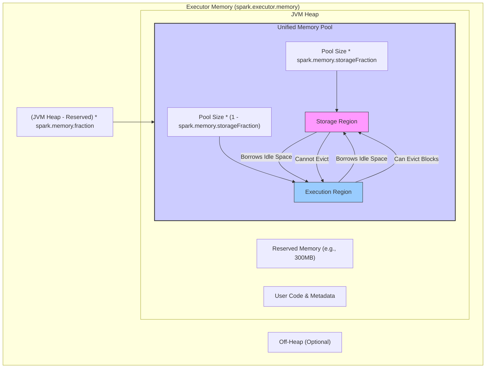

## 第6章：Spark内存管理机制 (Spark Memory Management)

内存是影响 Spark 应用性能最为关键的资源之一。无论是缓存中间数据以加速迭代计算，还是为 Shuffle、排序、聚合等操作提供工作空间，高效的内存利用都至关重要。Spark 的内存管理机制直接关系到任务的执行效率、GC 开销以及是否会发生 OOM (Out Of Memory) 错误。

Spark 的内存管理经历了重要的演进。在 Spark 1.6 之前，执行内存（用于计算）和存储内存（用于缓存 RDD/DataFrame）是静态划分且硬性隔离的，配置复杂且容易导致资源浪费。为了解决这些问题，Spark 1.6 引入了**统一内存管理 (Unified Memory Management)** 模型，实现了两部分内存之间的动态共享，简化了配置并提高了内存利用率。

本章将深入探讨 Spark 的内存管理，重点解析统一内存管理模型、堆内与堆外内存的选择、执行内存与存储内存的功能与交互，以及 Tungsten 项目在内存优化方面的关键作用。

### 6.1 统一内存管理模型 (Unified Memory Management)

统一内存管理模型（自 Spark 1.6 起默认启用）是现代 Spark 内存管理的核心。其设计目标是提供更简单、更灵活、更高效的内存使用方式。

**核心思想：** 将 Executor 的可用内存（JVM 堆内存的一部分）划分为一个统一的区域，并动态地在该区域内为 **执行 (Execution)** 和 **存储 (Storage)** 分配空间。这两部分内存可以根据需要互相"借用"。

**内存区域划分：**

在一个 Spark Executor JVM 进程中，主要的内存区域可以这样划分：

1.  **JVM 堆内存 (Executor Memory):** 由 `-Xmx` 参数设定，是 Executor 进程可用的最大 Java 堆内存。由 `spark.executor.memory` 配置。
2.  **堆外内存 (Off-Heap Memory):** (可选) 通过 `spark.memory.offHeap.enabled` 和 `spark.memory.offHeap.size` 配置，直接由操作系统管理，不受 JVM GC 影响。
3.  **其他内存:** 包括 JVM 自身开销（如 PermGen/Metaspace）、线程栈、代码缓存等。这部分内存通常不由 Spark 直接管理，需要预留出来。

**统一内存管理主要作用于 JVM 堆内存的一部分以及可选的堆外内存。**

**统一内存池 (Unified Memory Pool):**

Spark 会从 JVM 堆内存中划拨出一块专门用于 Spark 计算和存储的区域，这就是统一内存池。其大小由以下参数决定：

*   `spark.memory.fraction` (默认 0.6): 控制用于 Spark 统一管理的内存占可用堆内存（JVM 堆内存 - 300MB 保留内存）的比例。剩余的 (1 - fraction) 部分主要用于用户代码产生的数据结构、Spark 内部元数据等。
*   **可用堆内存:** Spark 假设一个安全的保留区域（默认 300MB，由 `spark.memory.heap.minMetaDataTransfer` 控制，但通常不修改），计算方式为 `(spark.executor.memory - 300MB)`。
*   **统一内存池大小 (On-Heap):** `(spark.executor.memory - 300MB) * spark.memory.fraction`

**内部划分与动态借用:**

统一内存池内部被逻辑上划分为两个区域：

*   **存储内存区域 (Storage Region):** 主要用于缓存 RDD 分区、广播变量等。其初始大小由 `spark.memory.storageFraction` (默认 0.5) 控制，即 `统一内存池大小 * spark.memory.storageFraction`。
*   **执行内存区域 (Execution Region):** 主要用于 Shuffle、Join、Sort、Aggregation 等操作所需的中间缓冲、哈希表等。其初始大小为 `统一内存池大小 * (1 - spark.memory.storageFraction)`。

**关键特性 - 动态借用 (Dynamic Borrowing):**

*   **执行可以借用存储:** 如果执行内存不足，而存储内存区域有空闲，执行任务可以"借用"存储区域的空闲空间。如果存储区域没有空闲空间，但缓存了一些数据块，执行任务可以**强制驱逐 (Evict)** 存储区域中缓存的数据块（通常按 LRU 策略）来获取空间。
*   **存储可以借用执行:** 如果存储内存不足以缓存新的数据块，而执行内存区域有空闲，存储可以"借用"执行区域的空闲空间。
*   **借用限制:** 存储**不能**强制驱逐执行内存中正在使用的数据。一旦执行任务占用了内存（无论是自己的区域还是借来的），这部分内存在任务完成前是不能被存储抢占的。
*   **优先级:** 这种设计隐含地给予了执行内hu存更高的优先级，因为它能强制驱逐存储内存，反之则不行。这符合 Spark 的设计哲学：保证计算任务的顺利执行比保证数据一直被缓存更重要。

**优点:**
*   **简化配置:** 用户只需关注少数几个关键参数 (`spark.executor.memory`, `spark.memory.fraction`, `spark.memory.storageFraction`)。
*   **提高利用率:** 内存可以在执行和存储之间动态共享，避免了静态划分导致的"一边不够用，一边有空闲"的窘境。
*   **更强的鲁棒性:** 执行任务在需要时可以抢占存储内存，降低了因内存不足导致任务失败的风险。

统一内存管理模型是理解 Spark 内存使用的基础框架。

### 6.2 堆内内存 (On-Heap) vs 堆外内存 (Off-Heap)

Spark 允许将统一内存池的一部分或全部配置为使用 **堆外内存 (Off-Heap Memory)**，这是相对于默认的 **堆内内存 (On-Heap Memory)** 而言的。

*   **堆内内存 (On-Heap Memory):**
    *   **位置:** 在 JVM 的堆空间内分配和管理。
    *   **管理:** 由 JVM 负责管理，包括对象的分配和垃圾回收 (GC)。
    *   **优点:**
        *   **使用简单:** Java 开发者熟悉，对象创建和访问直接。
        *   **工具支持:** 易于使用标准的 JVM 工具进行调试和监控 (如 JProfiler, VisualVM)。
    *   **缺点:**
        *   **GC 开销:** 当堆内存中产生大量短生命周期的对象（如 Shuffle 过程中反序列化的对象）时，容易引发频繁且耗时的 Full GC，严重影响性能，甚至导致 Executor 卡顿或崩溃。
        *   **内存碎片:** GC 可能导致内存碎片。
        *   **对象开销:** Java 对象本身有一定的内存开销（对象头等）。
        *   **大小限制:** 受限于 JVM 堆大小 (`-Xmx`)。

*   **堆外内存 (Off-Heap Memory):**
    *   **位置:** 在 JVM 堆之外的本机内存 (Native Memory) 中分配。
    *   **管理:** 由 Spark 直接通过 `sun.misc.Unsafe` API 进行管理（分配和释放）。JVM GC 不会扫描这部分内存。
    *   **配置:** 通过 `spark.memory.offHeap.enabled=true` 启用，并通过 `spark.memory.offHeap.size` 指定大小 (单位字节)。这个大小是**每个 Executor** 的堆外内存限额。
    *   **优点:**
        *   **避免 GC:** 最大的优势在于规避了 JVM GC 对这部分内存的管理，从而消除了因大量对象创建/销毁导致的 GC 停顿，使 Spark 应用运行更稳定，性能更可预测。
        *   **精确控制:** Spark 可以更精确地控制内存布局和访问，为 Tungsten 优化（如序列化、向量化操作）提供了基础。
        *   **可能更大的内存空间:** 理论上可以使用的堆外内存只受节点物理内存限制（但 `spark.memory.offHeap.size` 仍需配置）。
        *   **进程间共享:** (理论上) 堆外内存更容易实现与其他 Native 库或进程的零拷贝数据共享（例如通过 Arrow 格式）。
    *   **缺点:**
        *   **管理复杂:** 需要 Spark 自行管理内存的分配和回收，如果实现不当可能导致内存泄漏。
        *   **序列化开销:** 如果需要在堆内代码（普通 Java/Scala 代码）和堆外内存之间传递数据，可能需要显式的序列化/反序列化操作，带来额外开销。
        *   **调试困难:** 使用标准 JVM 工具调试堆外内存问题相对困难。
        *   **配置大小:** `spark.memory.offHeap.size` 需要用户显式指定，不像堆内存可以完全交给 JVM 管理。

**对比总结:**

| 特性        | 堆内内存 (On-Heap)                 | 堆外内存 (Off-Heap)                                             |
| :-------- | :----------------------------- | :---------------------------------------------------------- |
| **位置**    | JVM Heap                       | Native Memory (OS)                                          |
| **管理**    | JVM (GC)                       | Spark (via `Unsafe`)                                        |
| **GC 影响** | 是                              | 否                                                           |
| **优点**    | 使用简单, 工具支持好                    | 避免 GC, 精确控制, 可能更大空间                                         |
| **缺点**    | GC 开销, 对象开销, 大小受限              | 管理复杂, 序列化开销, 调试困难                                           |
| **配置**    | `spark.executor.memory` (间接影响) | `spark.memory.offHeap.enabled`, `spark.memory.offHeap.size` |
| **适用场景**  | 默认, GC 不是主要瓶颈时                 | GC 频繁且耗时, 需要稳定性能, Tungsten 优化场景, 大内存需求                      |

**如何选择？**

*   **默认使用堆内:** 对于大多数应用，默认的堆内内存管理是简单有效的起点。
*   **考虑堆外:** 当遇到以下情况时，应考虑启用并配置堆外内存：
    *   观察到频繁且耗时的 GC pause (尤其是 Full GC) 严重影响性能。
    *   需要缓存非常大的数据集，超出了合理的 JVM 堆大小范围。
    *   运行大量依赖 Tungsten 优化（如 DataFrame/SQL 操作、Sort-based Shuffle）的作业。
*   **混合使用:** Spark 统一内存管理也支持堆外内存。启用后，Execution 和 Storage 内存都可以利用堆外空间。Tungsten 的许多操作优先使用堆外内存。

需要注意的是，`spark.memory.offHeap.size` 设置的是**额外**的内存，而不是从 `spark.executor.memory` 中划分出来的。因此，启用堆外内存会增加 Executor 的总内存占用。

### 6.3 执行内存 (Execution Memory) 与存储内存 (Storage Memory)

在统一内存管理框架下，虽然内存可以动态借用，但逻辑上仍然区分执行内存和存储内存，它们服务于不同的目的。

**执行内存 (Execution Memory):**

*   **用途:** 为 **Task 在执行期间** 的计算提供内存空间。主要用于：
    *   **Shuffle:** Map 端写出前的缓冲区 (e.g., `ShuffleWriter` 的 buffer)，Reduce 端拉取数据后的缓冲区及反序列化对象。
    *   **排序 (Sort):** 排序算法需要的中间缓冲区。
    *   **聚合 (Aggregation):** 哈希聚合 (Hash Aggregation) 中的哈希表。
    *   **连接 (Join):** 哈希连接 (Hash Join) 中构建哈希表。
    *   其他需要临时缓冲数据的算子。
*   **管理:**
    *   内存分配是 **基于 Task** 的。每个 Task 在运行时向 Executor 的 `MemoryManager` 申请执行内存。
    *   多个 Task **并发** 在同一个 Executor 内运行，它们共享该 Executor 的执行内存区域。
    *   Spark 使用一个 **内存消费者 (Memory Consumer)** 模型，Task 或算子作为消费者向 `TaskMemoryManager` 申请内存页 (Memory Page)。
*   **溢写 (Spilling):**
    *   如果一个 Task 需要的执行内存超过了其当前可分配的额度（无论是自身区域还是从存储借来的），为了防止 OOM 并保证任务能继续，Spark 会触发 **溢写 (Spilling)** 机制。
    *   即将该 Task 持有的一部分内存数据（例如哈希表的部分内容、排序缓冲区的数据）**写入本地磁盘**，释放出内存空间供后续计算使用。
    *   溢写会**显著降低性能**，因为它用磁盘 I/O 替代了内存访问。
    *   常见的溢写场景包括：Shuffle Map 端的聚合/排序缓冲区溢写、Reduce 端的聚合哈希表溢写、排序溢写、Join 构建端哈希表溢写等。
    *   监控 Spark UI 上的 Spill (Memory/Disk) 指标是判断执行内存是否不足的重要依据。

**存储内存 (Storage Memory):**

*   **用途:** 主要用于**跨 Task 或跨 Job** 缓存用户数据，以加速后续访问。主要用于：
    *   **缓存 RDD/DataFrame/Dataset:** 当用户调用 `.persist(StorageLevel)` 或 `.cache()` 时，计算出的 RDD/DataFrame 分区会被存储在该区域。
    *   **广播变量 (Broadcast Variables):** 将 Driver 端的数据广播到所有 Executor 后，这些数据会存储在每个 Executor 的存储内存中（通常是序列化形式）。
*   **管理:**
    *   内存分配是 **基于数据块 (Block)** 的。每个 RDD 分区或广播变量被视为一个 Block。
    *   由 Executor 内部的 **BlockManager** 负责管理这些 Block 的存储、获取和删除。
    *   `BlockManager` 与 Driver 端的 `BlockManagerMaster` 通信，汇报 Block 状态和位置。
*   **驱逐 (Eviction):**
    *   当存储内存不足以容纳新的 Block 时，或者当执行内存需要借用空间时，会触发 **驱逐机制**。
    *   默认使用 **LRU (Least Recently Used)** 策略，驱逐最近最少使用的 Block 来腾出空间。
    *   如果 RDD 的存储级别包含 `_DISK` (如 `MEMORY_AND_DISK`)，被驱逐的 Block 会被写入磁盘；否则（如 `MEMORY_ONLY`），Block 将丢失，下次访问时需要重新计算。
    *   Spark UI 的 Storage 页面可以查看缓存的 RDD、分区大小、内存/磁盘占用以及驱逐情况。

**交互与权衡:**

统一内存管理的核心在于执行内存和存储内存之间的动态平衡。
*   **理想情况:** 内存充足，执行和存储各取所需，互不干扰。
*   **执行内存紧张:** 执行任务会优先占用自身区域，然后尝试借用存储区域的空闲空间，最后强制驱逐缓存的 Block。
*   **存储内存紧张:** 缓存请求会优先占用自身区域，然后尝试借用执行区域的**空闲**空间。**无法**强制回收正在被 Task 使用的执行内存。

这种机制保证了计算任务的优先执行权，但也意味着**过度缓存可能在高并发执行任务时被频繁驱逐，导致缓存效率下降**。因此，需要根据作业特性和集群负载，合理配置 `spark.memory.storageFraction` 以及选择合适的 RDD 存储级别。

### 6.4 Tungsten项目：内存与CPU效率优化 (内存方面)

Tungsten 是 Spark 内部的一个重要项目，其目标是大幅提升 Spark 应用的 CPU 和内存效率，使其性能接近于手动优化代码或 Native 执行引擎。

虽然 Tungsten 涉及代码生成、缓存优化等多个方面，但其在**内存管理和利用**方面的优化是基石：

1.  **显式的内存管理 (Explicit Memory Management):**
    *   Tungsten 大量使用 **堆外内存 (Off-Heap)**，并通过 `sun.misc.Unsafe` API 直接操作内存。
    *   这使得 Spark 可以像 C/C++ 一样，对内存布局进行精确控制，避免 JVM 对象开销和 GC 影响。
    *   例如，排序、聚合、Shuffle 等操作的内部数据结构可以直接在堆外分配和管理。

2.  **紧凑的二进制数据表示 (Compact Binary Formats):**
    *   **动机:** Java 对象（尤其是在堆内）内存开销大（对象头、指针、对齐填充），且在内存中可能不连续，导致 Cache Miss 增多。
    *   **解决方案:** Tungsten 引入了 **`UnsafeRow`** 等二进制格式来存储数据。
        *   `UnsafeRow` 将一行数据（多个字段）序列化成一个连续的字节数组（通常在堆外）。
        *   它不存储 Java 对象，而是直接存储原始类型数据或指向变长数据的指针 (offset/length)。
        *   访问 `UnsafeRow` 中的字段只需要计算偏移量和读取字节，无需对象创建和反序列化。
    *   **优点:**
        *   **极低的内存占用:** 大幅减少了表示相同数据所需的内存。
        *   **高效的序列化/反序列化:** 在序列化形式下即可直接操作数据（例如比较、哈希），避免了昂贵的反序列化过程。
        *   **缓存友好:** 连续的内存布局提高了 CPU Cache 的命中率。

3.  **内存中的列式布局 (In-Memory Columnar Layout):**
    *   虽然 `UnsafeRow` 是按行存储的，但 Tungsten 在处理 DataFrame/Dataset 时，也借鉴了列式存储的思想。
    *   配合代码生成，可以实现**向量化操作 (Vectorized Operations)**，一次处理一批行中同一列的数据，进一步提升 Cache 效率和利用 CPU SIMD 指令。
    *   列式处理也使得谓词下推和列裁剪等优化在内存计算层面更加有效。

4.  **优化的内存分配与使用:**
    *   Tungsten 的执行器代码（如 Sort-based Shuffle 的 `UnsafeShuffleWriter`, Hash Aggregation 的 `UnsafeFixedWidthAggregationMap`）被设计为高度内存感知，尽量重用内存，减少分配开销，并能有效地与溢写机制配合。

**总结:** Tungsten 通过利用堆外内存、设计紧凑的二进制数据格式 (`UnsafeRow`)、实现内存中的列式处理以及优化内存分配，极大地提升了 Spark 在内存密集型操作上的性能，减少了 GC 压力，使得 DataFrame/SQL API 的执行效率远超传统的 RDD API。

---

本章我们深入了解了 Spark 的内存管理机制。从宏观的统一内存管理模型及其动态借用机制，到微观的堆内与堆外内存的特性与权衡，再到执行内存和存储内存的具体用途、管理方式以及溢写/驱逐策略。最后，我们探讨了 Tungsten 项目如何在内存层面进行优化，以实现极致的性能。理解并合理配置 Spark 的内存参数（`spark.executor.memory`, `spark.memory.fraction`, `spark.memory.storageFraction`, `spark.memory.offHeap.enabled`, `spark.memory.offHeap.size`），并监控相关指标（GC 时间、Spill、Block Eviction），是确保 Spark 应用稳定、高效运行的关键实践。 