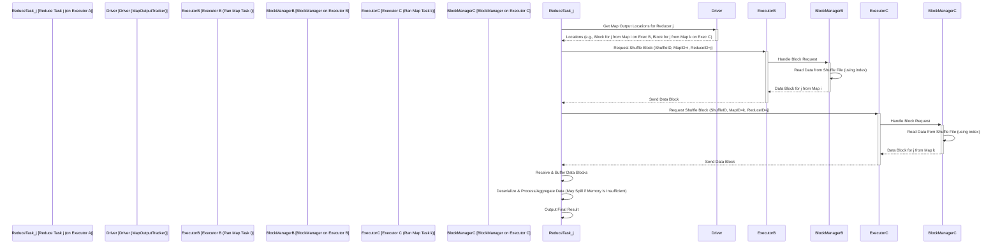

## 第7章：Spark Shuffle详解 (Understanding Spark Shuffle)

在 Spark 的世界里，Shuffle 是一个既核心又常常令人头疼的环节。当我们需要对数据按照 Key 进行重新聚合或关联时，就不可避免地要触发 Shuffle 操作。它涉及到数据的重新分区、网络传输和磁盘 I/O，是许多 Spark 作业性能瓶颈的主要来源。因此，深入理解 Shuffle 的原理、演进过程和优化技巧，对于提升 Spark 应用性能至关重要。

本章将带你深入 Spark Shuffle 的内部，剖析其工作原理和必要性，对比不同 Shuffle 实现（Hash Shuffle 与 Sort Shuffle）的设计与权衡，梳理 Shuffle Read 的流程，并探讨 Spark 在 Shuffle 优化方面所做的努力，包括 Bypass Merge Sort、Tungsten Sort 以及 External Shuffle Service 等关键技术。

### 7.1 Shuffle的原理与必要性

**什么是 Shuffle？**

Shuffle 的中文直译是"洗牌"，在 Spark（以及 MapReduce 等其他分布式计算框架）中，它特指 **将上游 Stage (Map 阶段) 输出的数据按照特定的 Key 进行重新分区，并将相同 Key 的数据发送到下游 Stage (Reduce 阶段) 的同一个 Task 进行处理的过程**。

**为什么需要 Shuffle？**

分布式计算的核心思想是将大规模数据和计算任务分散到集群中的多个节点上并行处理。然而，很多常见的计算操作，如 `reduceByKey`, `groupByKey`, `aggregateByKey`, `join`, `distinct`, `repartition` 等，都需要**汇集具有相同特征（通常是相同的 Key）的数据**到同一个处理单元（Task）才能完成计算。

*   **示例 1: `reduceByKey`**
    假设我们要统计文本中每个单词出现的次数 (Word Count)。Map 阶段 (Stage 0) 的每个 Task 会处理输入文件的一部分，产生 `(word, 1)` 这样的键值对。但同一个单词可能出现在不同节点的 Map Task 输出中。为了计算每个单词的总次数，我们需要将所有具有相同 `word` 的 `(word, 1)` 发送到同一个 Reduce Task (Stage 1)，由该 Task 进行累加。这个**将相同 Key 的数据汇集到一起的过程**就是 Shuffle。
*   **示例 2: `join`**
    假设我们要将两个 RDD (或 DataFrame) `A` 和 `B` 按照 Key 进行 Join。如果 `A` 和 `B` 的分区方式不同，或者 Key 没有预先分区，那么具有相同 Key 的记录可能分散在不同的节点上。为了执行 Join，我们需要将 `A` 和 `B` 中具有相同 Key 的记录都发送到同一个 Task 进行匹配。这也需要 Shuffle。

**Shuffle 的本质：数据重分布**

Shuffle 的本质是打破原有的数据分区，按照新的规则（通常是基于 Key 的 Hash 或范围）进行数据的重新组织和跨节点传输。它发生在**宽依赖 (Wide Dependency / ShuffleDependency)** 的边界。

```mermaid
graph TD
    subgraph Before Shuffle (Map Stage Output)
        N1[Node 1: (K1,V1), (K2,V4)]
        N2[Node 2: (K1,V2), (K3,V5)]
        N3[Node 3: (K2,V3), (K3,V6)]
    end

    subgraph Shuffle Process
        direction LR
        N1 -- K1 --> R1
        N1 -- K2 --> R2
        N2 -- K1 --> R1
        N2 -- K3 --> R3
        N3 -- K2 --> R2
        N3 -- K3 --> R3
        Shuffle[Shuffle: Network Transfer & Partitioning by Key]
    end

    subgraph After Shuffle (Reduce Stage Input)
        R1[Reducer 1 (Handles K1): (K1,V1), (K1,V2)]
        R2[Reducer 2 (Handles K2): (K2,V4), (K2,V3)]
        R3[Reducer 3 (Handles K3): (K3,V5), (K3,V6)]
    end

    Before_Shuffle --> Shuffle --> After_Shuffle
    style Shuffle fill:#f9f,stroke:#333,stroke-width:2px
```

**Shuffle 的代价：**

Shuffle 是 Spark 中**开销最大**的操作之一，因为它通常涉及：

1.  **磁盘 I/O:** Map Task 需要将输出数据写入本地磁盘（作为中间 Shuffle 文件），Reduce Task 需要从磁盘读取这些文件。
2.  **网络 I/O:** Reduce Task 需要通过网络从其他节点拉取属于自己的数据块。
3.  **序列化/反序列化:** 数据在写入磁盘和网络传输前后需要进行序列化和反序列化。
4.  **CPU 计算:** 计算分区、排序（如果需要）、聚合等。
5.  **内存压力:** 需要缓冲区来存储 Map 端输出和 Reduce 端拉取的数据。

因此，**避免不必要的 Shuffle** 或 **优化 Shuffle 过程** 是 Spark 性能调优的核心目标之一。

### 7.2 Hash Shuffle Writer vs Sort Shuffle Writer

Spark 的 Shuffle 写出（Map 端）机制经历了重要的演进。早期的 Spark 版本（1.1 之前）主要使用基于 **Hash** 的 Shuffle (称为 `HashShuffleWriter`)，后来（1.1 及之后）引入并默认使用了基于 **Sort** 的 Shuffle (称为 `SortShuffleWriter`)，并在后续版本中不断优化。

**1. Hash Shuffle (早期版本，现已不常用)**

*   **原理:** 每个 Map Task 为下游 Reduce Stage 的每个 Task 创建一个单独的文件 (Bucket)。Map Task 计算出每条输出记录应该去往哪个 Reduce Task (通常通过 `key.hashCode() % numReducers` 决定)，然后将该记录写入对应 Reduce Task 的文件中。
*   **流程 (简化版):**
    1.  Map Task i 处理其输入分区。
    2.  对于每条输出记录 `(k, v)`，计算其目标 Reduce Task j (`j = hash(k) % R`)。
    3.  将 `(k, v)` 写入为 Reduce Task j 准备的本地文件 `shuffle_i_j.out`。
    4.  Map Task i 完成后，磁盘上会产生 R 个小文件 (R 是 Reduce Task 的数量)。

```mermaid
graph TD
    subgraph Hash Shuffle Writer (Map Task i)
        Input_i[Input Partition i] --> Map_i{Map Function}
        Map_i -- Output (k,v) --> Hash{Calculate target reducer j = hash(k) % R}
        Hash -- Target j=0 --> File_i_0[File for Reducer 0]
        Hash -- Target j=1 --> File_i_1[File for Reducer 1]
        Hash -- Target j=... --> File_i_dots[...]
        Hash -- Target j=R-1 --> File_i_R1[File for Reducer R-1]
    end
```

*   **优点:**
    *   实现相对简单。
    *   避免了排序开销。
*   **缺点:**
    *   **产生大量小文件:** 如果 Map Task 数量 (M) 和 Reduce Task 数量 (R) 都很大，会产生 M * R 个 Shuffle 文件。这会给文件系统带来巨大压力（尤其是在 HDFS 等不擅长处理小文件的系统上），并且导致大量的随机磁盘 I/O，性能低下。
    *   **缓冲内存占用大:** 每个 Map Task 需要为每个 Reduce Task 维护一个写缓冲区，如果 R 很大，内存开销会非常高。
*   **优化 (Consolidated Hash Shuffle):** 为了缓解小文件问题，Spark 曾引入过优化：让同一 Executor 上运行的 Map Tasks (属于同一个 Stage) 共享输出文件。即每个 Executor Core 只为每个 Reduce Task 创建一个文件。这样文件数量减少为 `numExecutorCores * R`。但这仍然是一个很大的数量级，且内存问题依然存在。

**2. Sort Shuffle (Spark 1.1+ 默认)**

*   **原理:** 每个 Map Task 只输出**一个** 数据文件和一个索引文件。它不再为每个 Reduce Task 单独创建文件，而是将所有输出数据写入一个**临时文件**中，并在写入过程中或写入后**根据目标 Reduce Task ID 进行排序**。同时生成一个索引文件，记录每个 Reduce Task 的数据在数据文件中的起始和结束位置 (offset)。
*   **流程 (简化版 - `SortShuffleWriter`):**
    1.  Map Task 处理输入分区。
    2.  将输出记录 `(k, v)` 写入一个内存缓冲区 (e.g., `PartitionedPairBuffer`)。这个缓冲区内部会根据目标 Reduce Task ID 进行分区。
    3.  当缓冲区满时，或者 Map Task 结束时：
        *   对缓冲区内的数据**按照目标 Reduce Task ID** 进行排序。
        *   将排序后的数据 **溢写 (Spill)** 到一个临时的磁盘文件。
    4.  如果发生了多次 Spill，最终需要将所有 Spill 文件**合并 (Merge)** 成一个**最终的数据文件**。合并过程通常是多路归并排序。
    5.  同时生成一个 **索引文件 (.index)**，记录每个 Reduce Task ID 对应的数据块在最终数据文件中的偏移量和长度。

```mermaid
graph TD
    subgraph Sort Shuffle Writer (Map Task i)
        Input_i[Input Partition i] --> Map_i{Map Function}
        Map_i -- Output (k,v) --> Buffer[In-Memory Buffer (Partitioned by Target Reducer ID)]
        Buffer -- Buffer Full or Task End --> Sort{Sort Buffer by Reducer ID}
        Sort --> Spill1[Spill File 1]
        Buffer -- Buffer Full or Task End --> Sort2{...}
        Sort2 --> SpillN[Spill File N]

        Spill1 & SpillN -- Merge --> FinalDataFile[Final Data File (Sorted by Reducer ID)]
        Spill1 & SpillN -- Generate Index --> IndexFile[Index File (.index)]
    end
    style FinalDataFile fill:#ccf,stroke:#333,stroke-width:2px
    style IndexFile fill:#ccf,stroke:#333,stroke-width:2px
```

*   **优点:**
    *   **显著减少文件数量:** 每个 Map Task 只产生两个文件（数据文件和索引文件），避免了 Hash Shuffle 的小文件问题，对文件系统更友好。
    *   **内存使用更可控:** 缓冲区大小可以配置，溢写机制保证了即使内存不足也能完成任务。
    *   **有序性:** 输出数据按 Reduce Task ID 排序，有利于后续的读取和可能的合并操作。
*   **缺点:**
    *   **引入排序开销:** 无论是内存排序还是磁盘文件的归并排序，都会消耗额外的 CPU 和 I/O 资源。
    *   **磁盘 I/O 仍然存在:** Spill 和 Merge 过程仍然涉及磁盘读写。

**Sort Shuffle 的进一步优化 (将在 7.4 节详述):**

*   **BypassMergeSortShuffleWriter:** 对于 Shuffle 依赖的 RDD 分区数较少的情况，可以跳过最终的合并排序步骤，直接将每个分区的 Spill 数据合并后写出，减少排序开销。
*   **UnsafeShuffleWriter (Tungsten Sort):** 利用 Tungsten 项目的优化，直接在序列化的二进制数据 (UnsafeRow) 上进行分区、排序和溢写，避免反序列化开销，并利用堆外内存减少 GC 影响，是当前高性能 Shuffle 的主力。

由于 Sort Shuffle 在文件数量和内存使用方面的巨大优势，它已成为 Spark 默认且推荐的 Shuffle 实现方式。

### 7.3 Shuffle Read 流程

当 Map 阶段 (Shuffle Write) 完成后，下游的 Reduce Stage 就需要开始执行 Shuffle Read 操作，即拉取并处理属于自己的数据。

**核心组件:**

*   **MapOutputTracker (Driver 端):** 存储了每个 ShuffleMapStage 成功完成的 Map Task 输出的 Shuffle 数据块的位置信息 (哪个 Executor 的哪个磁盘文件/索引文件)。
*   **BlockManager (Executor 端):** 负责管理本地和远程的数据块（包括 Shuffle 数据块）。Shuffle Read 请求最终会通过 BlockManager 来获取数据。
*   **Shuffle Reader (Executor 端):** Reduce Task 内部用于读取 Shuffle 数据的组件，如 `ShuffleBlockFetcherIterator`。

**流程:**

1.  **获取 Map 输出位置:** Reduce Task 启动后，首先向 Driver 端的 `MapOutputTracker` 请求获取其需要处理的数据块的位置信息。例如，Reduce Task j 需要知道所有 Map Tasks (i=0 to M-1) 输出的、发往 Reducer j 的数据块都在哪些 Executor 上。
2.  **建立连接与拉取数据:**
    *   Reduce Task (通过 `ShuffleBlockFetcherIterator`) 根据获取到的位置信息，确定需要从哪些远程 Executor (或本地 Executor) 拉取数据。
    *   它会建立网络连接（通常是 Netty 连接池）到目标 Executor 的 `BlockManager`。
    *   并发地向多个目标 Executor 发送数据块请求 (`ShuffleBlockId`)。
3.  **远程 Executor 处理请求:**
    *   目标 Executor 的 `BlockManager` 接收到数据块请求。
    *   根据请求的 `ShuffleBlockId` (包含 Shuffle ID, Map ID, Reduce ID)，找到对应的本地 Shuffle 数据文件和索引文件。
    *   使用索引文件定位到 Reduce Task j 所需的数据在数据文件中的偏移量和长度。
    *   读取相应的数据块，并通过网络连接将其发送回请求的 Reduce Task 所在的 Executor。
4.  **数据接收与处理:**
    *   Reduce Task 所在的 Executor 接收到来自不同节点的数据块。
    *   这些数据块通常会先放入内存缓冲区 (`ShuffleBlockFetcherIterator` 内部管理)。
    *   **聚合/处理:** Reduce Task 从缓冲区中取出数据（通常是 Key-Value 对），进行反序列化，然后执行其计算逻辑，例如：
        *   **聚合 (Aggregation):** 如果需要在 Reduce 端进行聚合（如 `reduceByKey`），通常会使用一个内存中的哈希表或排序结构来合并相同 Key 的值。如果内存不足，这个聚合结构也可能**溢写到磁盘 (Reduce-side Spill)**。
        *   **Join:** 将来自不同父 RDD 的、具有相同 Key 的记录进行匹配。
        *   **直接处理:** 对于 `groupByKey` 等操作，可能直接将相同 Key 的所有 Value 组成一个迭代器交给用户函数处理。
5.  **返回结果:** Reduce Task 完成对其分配到的所有 Key 的处理后，将最终结果输出（例如写入 HDFS 或返回给 Driver）。



**Shuffle Read 的挑战:**
*   **网络拥塞:** 大量的 Reduce Task 同时从多个 Map Task 拉取数据，可能导致网络带宽成为瓶颈。
*   **内存压力:** 需要缓冲区来接收和处理拉取的数据，聚合操作（如 Hash Aggregation）也可能消耗大量内存，导致 OOM 或 Reduce 端 Spill。
*   **磁盘 I/O (远程):** 远程 Executor 需要读取本地磁盘上的 Shuffle 文件。
*   **Fetch Failure:** 如果持有 Shuffle 数据的 Executor 宕机或不可达，会导致 Fetch Failure，进而可能导致 Stage 失败。

优化 Shuffle Read 过程，例如通过有效的内存管理、减少拉取的数据量、提高网络传输效率等，也是 Spark 性能优化的重要方面。

### 7.4 Shuffle优化：BypassMergeSort, Tungsten-Sort, External Shuffle Service

由于 Shuffle 的巨大开销，Spark 引入了多种优化策略来缓解其对性能的影响。

**1. BypassMergeSortShuffleWriter:**

*   **触发条件:** 当 Shuffle Map 阶段的**分区数 (即下游 Reduce Task 数量) 小于**某个阈值 (`spark.shuffle.sort.bypassMergeThreshold`, 默认 200) 时，会自动启用。
*   **原理:** 对于分区数不多的情况，Sort Shuffle 中对所有 Spill 文件进行最终合并排序的代价可能高于直接为每个分区写入单独文件（类似 Hash Shuffle）的代价。BypassMergeSort 就是在这种情况下，**跳过最终的全局排序和合并**。
*   **流程:**
    1.  Map Task 仍然使用内存缓冲区，并根据目标 Reduce Task ID 进行分区。
    2.  当缓冲区满时，**不再进行排序**，而是直接将每个分区的数据分别写入**临时的、对应分区的 Spill 文件**（例如，Reducer 0 的数据写入 spill_0, Reducer 1 的数据写入 spill_1）。
    3.  Map Task 结束时，将所有临时的 Spill 文件**按分区**合并成最终的输出文件。例如，将所有 spill_0 合并成最终给 Reducer 0 的数据文件，将所有 spill_1 合并成最终给 Reducer 1 的数据文件。
*   **效果:** 减少了排序的 CPU 开销，但仍然避免了原始 Hash Shuffle 产生 M*R 个文件的问题（最终文件数是 R）。它结合了 Hash Shuffle 和 Sort Shuffle 的部分优点。

**2. UnsafeShuffleWriter (Tungsten Sort):**

*   **触发条件:** 当满足特定条件时（例如，Shuffle 依赖支持、序列化器支持、非 Map-side 聚合等），Spark 会优先使用基于 Tungsten 优化的 `UnsafeShuffleWriter`。这是现代 Spark (尤其是 DataFrame/SQL) 高性能 Shuffle 的关键。
*   **原理:** 充分利用 Tungsten 项目的优化成果：
    *   **直接操作二进制数据:** 在序列化的二进制数据 (`UnsafeRow`) 上直接进行分区、排序（如果需要）和溢写，避免了昂贵的 Java 对象反序列化开销。
    *   **高效内存管理:** 大量使用堆外内存存储 Shuffle 数据，减少 GC 压力。使用 `TaskMemoryManager` 精确管理内存页。
    *   **缓存友好的排序:** 排序算法（如 `TimSort`）针对二进制数据和 Cache 进行了优化。
    *   **高效溢写:** 溢写过程也直接操作二进制数据。
*   **效果:** 大幅提升了 Shuffle Write 阶段的 CPU 和内存效率，降低了 GC 影响，是性能提升的主要贡献者之一。

**3. External Shuffle Service (外部 Shuffle 服务):**

*   **动机:** 默认情况下，Executor 不仅执行计算任务，还负责存储和提供其产生的 Shuffle 数据。如果 Executor 因为 OOM、节点维护或其他原因退出，其存储的 Shuffle 数据就会丢失，导致需要重新计算产生这些数据的父 Stage，代价高昂。这在需要频繁添加/删除 Executor 的弹性伸缩环境（如 YARN、K8s）中尤其 problematic。
*   **原理:** 引入一个**独立于 Executor 的、长时间运行的辅助服务进程 (Shuffle Service)**，通常在每个 Worker Node 上运行一个。Executor 不再将 Shuffle 数据写入自己的本地磁盘并自己提供服务，而是将 Shuffle 数据块**推送 (push)** 或由 Shuffle Service **拉取 (pull)** 到该节点上的 Shuffle Service 管理的磁盘空间中。当 Reduce Task 需要拉取数据时，它直接连接对应节点上的 Shuffle Service 来获取数据块，而不再依赖于原始产生数据的 Executor 是否存活。
*   **配置:** 通过 `spark.shuffle.service.enabled=true` 启用。在 YARN 模式下，通常需要在 NodeManager 上配置和启动 Shuffle Service。在 K8s 模式下也有相应的实现。
*   **优点:**
    *   **提高容错性:** Executor 退出不影响已产生的 Shuffle 数据，避免了昂贵的 Stage 重算，提高了 Job 的稳定性和成功率。
    *   **支持弹性伸缩:** 可以更安全地动态增删 Executor，而不用担心 Shuffle 数据丢失。
    *   **减少 Executor 负担:** 将提供 Shuffle 数据的 I/O 和网络服务压力转移到独立的 Shuffle Service 进程。
*   **缺点:**
    *   **额外的部署和管理:** 需要额外部署和管理 Shuffle Service 进程。
    *   **可能的网络开销:** 如果 Executor 将数据推送到 Shuffle Service，会增加一次网络传输（虽然通常是本地回环）。
    *   **配置复杂性:** 需要正确配置 Shuffle Service 的端口、存储目录、认证等。

```mermaid
graph TD
    subgraph Default Shuffle (No External Service)
        ExecA[Executor A (Map Task i)] -- Writes --> DiskA[Local Disk on Node A]
        ExecB[Executor B (Reduce Task j)] -- Requests Block --> ExecA
        ExecA -- Reads & Sends --> ExecB
        ExecA -- If Dies --> DataLost[Shuffle Data Lost!]
    end

    subgraph External Shuffle Service
        ExecA2[Executor A (Map Task i)] -- Writes Block --> ESS_A[External Shuffle Service on Node A]
        ESS_A -- Stores --> DiskA2[Disk managed by ESS_A]
        ExecB2[Executor B (Reduce Task j)] -- Requests Block --> ESS_A
        ESS_A -- Reads & Sends --> ExecB2
        ExecA2 -- Can Die Safely --> DataOK[Shuffle Data Still Available via ESS_A]
    end
    style ESS_A fill:#f9f,stroke:#333,stroke-width:2px
```

**其他优化考虑:**

*   **数据压缩:** 通过 `spark.shuffle.compress` (默认 true) 和 `spark.io.compression.codec` (默认 lz4) 压缩 Shuffle 数据，减少磁盘 I/O 和网络传输量，但会增加 CPU 开销。
*   **序列化器:** 使用更快的序列化库（如 Kryo，通过 `spark.serializer` 配置）可以提升 Shuffle 过程中的序列化/反序列化效率。
*   **合并小文件:** `spark.shuffle.consolidateFiles` (已被 Sort Shuffle 机制取代其主要作用，但曾用于 Hash Shuffle) 尝试合并 Shuffle 输出文件。
*   **调整 Reduce 端缓冲区:** `spark.reducer.maxSizeInFlight`, `spark.reducer.maxReqsInFlight` 等参数控制 Reduce 端拉取数据的并发度和缓冲区大小。
*   **避免 Shuffle:** 最根本的优化是尽可能避免不必要的 Shuffle 操作，例如使用 Broadcast Join 代替 Shuffle Join，优化数据处理逻辑等。

---

Shuffle 是 Spark 中一个复杂但至关重要的环节。本章我们深入探讨了 Shuffle 的原理和必要性，对比了 Hash Shuffle 和 Sort Shuffle 的实现差异，梳理了 Shuffle Read 的完整流程，并详细介绍了 Bypass Merge Sort、Unsafe Shuffle Writer (Tungsten Sort) 和 External Shuffle Service 等关键优化技术。深刻理解 Shuffle 的内部机制和优化策略，是 Spark 开发者进行性能调优、解决瓶颈问题的必备知识。 