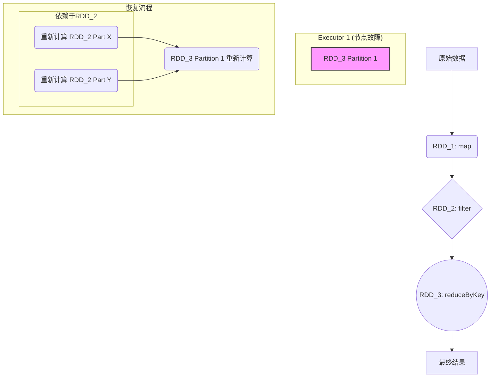
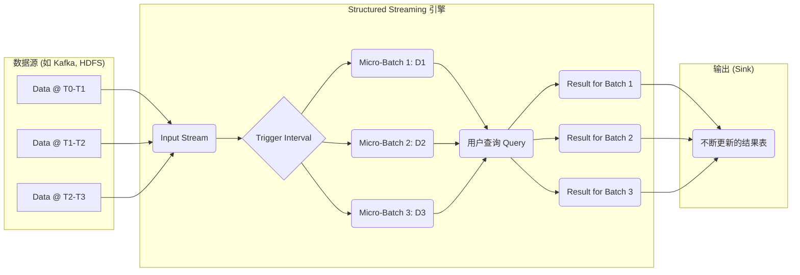
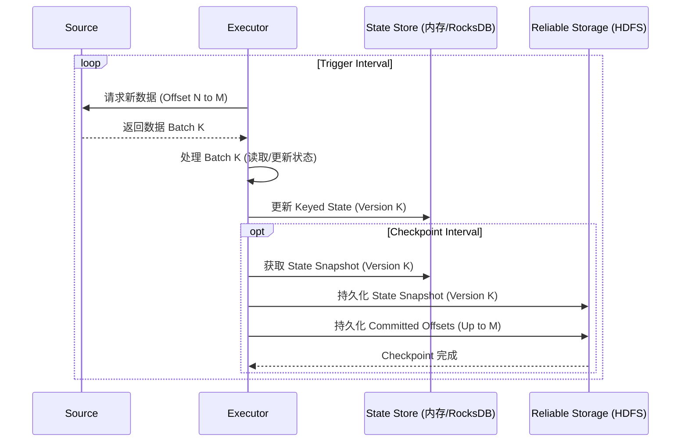
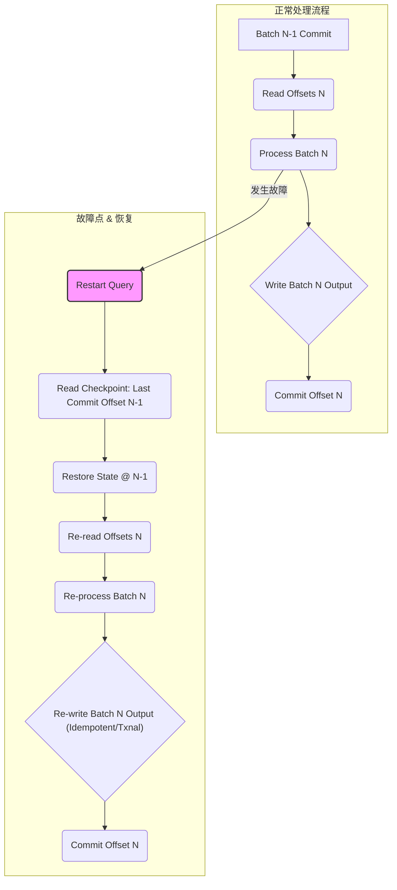

# 第8章：Spark容错与Structured Streaming内核 (Fault Tolerance & Structured Streaming Kernel)

Spark作为强大的分布式计算引擎，其容错能力和对流处理的支持是其核心竞争力。本章将深入探讨Spark基于RDD Lineage的容错机制，并详细解析Structured Streaming的内核原理，包括其微批处理模型、状态管理以及一致性保证机制。

## 8.1 RDD Lineage与容错机制

RDD (Resilient Distributed Dataset) 的核心特性之一就是其"弹性"（Resilient）。这种弹性主要体现在其容错能力上，而RDD的容错基石是**血缘关系（Lineage）**。

### 8.1.1 血缘关系 (Lineage)

*   **定义:** 每个RDD都包含了它是如何从其他RDD转换过来的信息。这一系列转换操作构成的依赖关系图谱，就是RDD的血缘关系。
*   **记录内容:** Lineage记录了RDD的父RDD、应用于父RDD的转换操作（Transformation）以及分区间的依赖关系（窄依赖或宽依赖）。
*   **特性:** Lineage是只读的、静态的，一旦创建就不会改变。

### 8.1.2 基于Lineage的容错

当某个RDD的分区数据丢失（例如，Executor节点故障），Spark可以通过Lineage信息重新计算丢失的分区，而不需要复制整个数据集。

*   **窄依赖 (Narrow Dependency):** 父RDD的每个分区最多只被子RDD的一个分区所依赖。例如`map`, `filter`, `union`等操作。窄依赖的容错恢复非常高效，因为只需要重新计算丢失的父分区即可，可以在同一个节点上并行计算。
*   **宽依赖 (Wide Dependency):** 子RDD的每个分区可能依赖于父RDD的多个分区。例如`groupByKey`, `reduceByKey`, `join`等涉及Shuffle的操作。宽依赖的容错恢复相对复杂，通常需要重新计算所有父分区的相关数据，可能涉及多个节点。

**容错流程示意图 (Mermaid):**

*   **优点:**
    *   避免了数据复制带来的高昂开销和复杂性。
    *   对于窄依赖，恢复效率高。
*   **缺点:**
    *   对于包含长Lineage和多次宽依赖的复杂计算，恢复时间可能较长。
    *   计算密集型任务的重新计算成本高。

### 8.1.3 Checkpointing

为了解决Lineage过长或宽依赖过多导致的恢复时间长的问题，Spark引入了**Checkpointing**机制。

*   **机制:** 将RDD的数据持久化到可靠的分布式存储系统（如HDFS）。当RDD被Checkpoint后，其Lineage会被截断，后续的计算将从Checkpoint的数据开始。
*   **触发:** 可以由用户显式调用`rdd.checkpoint()`触发。在某些场景下（如Stateful Streaming），系统也会自动进行Checkpoint。
*   **存储:** Checkpoint数据存储在用户配置的Checkpoint目录中。
*   **与Cache/Persist的区别:** Cache/Persist是将数据缓存在内存或磁盘，但Lineage依然存在，节点故障时缓存可能丢失，仍需通过Lineage恢复。Checkpoint则创建了一个数据的可靠副本，并切断了Lineage。

**Checkpoint的权衡:**

*   **优点:** 缩短故障恢复时间，特别是对于复杂计算。
*   **缺点:** Checkpoint操作本身需要消耗I/O和网络资源，会带来额外的计算延迟。需要配置可靠的存储系统。

## 8.2 Structured Streaming：Micro-Batch模型原理

Structured Streaming是Spark 2.x引入的构建在Spark SQL引擎之上的、可扩展且容错的流处理引擎。它提供了一种高级API，允许用户像编写批处理程序一样编写流处理逻辑。其核心是**微批处理（Micro-Batch Processing）**模型。

### 8.2.1 核心思想

Structured Streaming将持续到达的数据流视为一系列无限增长的**输入表（Input Table）**。对数据流的查询操作（如`filter`, `map`, `groupBy`, `join`等）就像对静态表的操作一样。

引擎以固定的时间间隔（触发间隔，Trigger Interval）检查输入源，将新到达的数据组织成一个个小的**微批次（Micro-Batch）**。然后，引擎将用户的查询作为一个批处理查询，在每个微批次上执行。

**Micro-Batch模型示意图 (Mermaid):**

### 8.2.2 执行流程

1.  **查询启动:** 用户定义查询逻辑（DataFrame/Dataset API）并启动流。
2.  **偏移量管理 (Offset Management):** 引擎持续跟踪每个输入源已经处理的数据的偏移量（Offset）。这些偏移量信息会被持久化存储（通常在Checkpoint目录中）。
3.  **微批次生成:** 在每个触发间隔，引擎根据记录的偏移量，从数据源读取新的数据，形成一个微批次（本质上是一个DataFrame/Dataset）。
4.  **批处理执行:** 将用户的查询逻辑作为一个标准的Spark SQL批处理作业，在当前微批次上执行。这复用了Spark SQL强大的优化器（Catalyst）和执行引擎（Tungsten）。
5.  **结果输出 (Output):** 将处理结果写入指定的输出接收器（Sink），如文件系统、数据库或Kafka。输出模式（Output Mode）决定了如何将结果写入Sink：
    *   **Append Mode:** 只有新增的行会被写入Sink。适用于无聚合操作或事件时间窗口聚合。
    *   **Complete Mode:** 整个更新后的结果表会在每个批次后写入Sink。适用于有聚合操作的查询。
    *   **Update Mode:** 只有结果表中被更新的行会在每个批次后写入Sink。适用于有聚合操作且只需要输出更新部分的场景。
6.  **Commit Log:** 引擎维护一个预写日志（Write-Ahead Log, WAL），记录每个成功处理的微批次的偏移量范围。这用于实现端到端的一致性。

### 8.2.3 优点与局限

*   **优点:**
    *   **易用性:** API与批处理统一，降低了流处理的学习曲线。
    *   **强大的优化:** 复用Spark SQL优化器，性能较高。
    *   **端到端一致性:** 提供Exactly-Once保证（前提是Source和Sink支持）。
    *   **丰富的生态:** 与Spark生态系统无缝集成。
*   **局限:**
    *   **延迟:** 微批处理模型引入了固有的处理延迟（至少一个触发间隔）。对于需要毫秒级低延迟的场景可能不适用。
    *   **状态管理开销:** 对于复杂的有状态计算，状态管理可能成为瓶颈。

## 8.3 State Management in Structured Streaming

许多流处理应用需要维护状态，例如窗口聚合、会话分析、任意状态的更新等。Structured Streaming提供了对有状态操作的支持。

### 8.3.1 状态存储

*   **机制:** Structured Streaming使用**状态存储（State Store）**来保存和管理计算过程中的状态。每个状态操作算子（如`groupBy().agg()`, `flatMapGroupsWithState`, `mapGroupsWithState`, `stream-stream join`）会关联一个或多个State Store实例。
*   **实现:** 默认情况下，状态存储在Executor的内存中，并通过Checkpoint机制定期持久化到可靠存储（如HDFS）。对于非常大的状态，可以使用基于RocksDB的状态后端（需要额外配置）。
*   **Key-Value结构:** 状态通常以Key-Value的形式存储，Key通常是分组的键（Grouping Key）。

### 8.3.2 状态版本控制与Checkpointing

*   **版本控制:** 为了支持故障恢复和Exactly-Once语义，State Store需要进行版本控制。每个微批次对应一个状态版本。
*   **与Checkpoint集成:** 状态数据是Checkpoint的核心组成部分。每次Checkpoint时，当前的状态版本会被写入Checkpoint目录。如果发生故障，引擎可以从上一个成功的Checkpoint恢复状态，并重新处理后续微批次的数据。

**状态管理与Checkpoint流程 (Mermaid):**

### 8.3.3 状态清理 (State Cleanup)

无限增长的状态可能导致内存或存储耗尽。Structured Streaming提供了基于**事件时间水印（Event Time Watermark）**的状态清理机制。

*   **水印:** 水印是一个时间戳，表示引擎认为不会再有比该时间戳更早的事件数据到达。
*   **清理:** 对于基于事件时间的聚合或Join操作，引擎可以安全地移除那些与过时（早于水印）的Key相关的状态。可以通过`withWatermark()`设置水印策略。

## 8.4 Checkpointing机制与端到端一致性保证

Checkpointing不仅用于RDD容错和状态管理，也是Structured Streaming实现端到端Exactly-Once语义的关键。

### 8.4.1 Checkpoint内容

Structured Streaming的Checkpoint目录通常包含：

1.  **偏移量日志 (Offsets Log):** 记录每个触发间隔处理的输入数据源的偏移量范围。
2.  **提交日志 (Commit Log):** 记录哪些偏移量范围（即哪些批次）已经成功处理并Commit。
3.  **状态数据 (State Data):** 对于有状态的操作，保存状态存储的快照。
4.  **元数据 (Metadata):** 查询的元信息等。

### 8.4.2 端到端Exactly-Once语义

Structured Streaming的目标是提供端到端（Source -> Spark -> Sink）的Exactly-Once处理保证。这意味着即使发生故障，每条输入记录也只会被处理一次，结果仅精确反映一次处理的效果。

实现依赖于以下几个关键点：

1.  **可重放的数据源 (Replayable Source):** 数据源必须能够根据偏移量重新读取数据（如Kafka）。
2.  **幂等的Sink (Idempotent Sink):** Sink必须能够处理重复写入（例如，通过事务写入或基于唯一ID去重），或者引擎使用事务性输出来保证幂等性。
3.  **Checkpointing:** 通过Checkpoint原子性地保存处理进度（偏移量）和计算状态。

**故障恢复流程:**

1.  **重启:** 当查询失败后重启时，引擎首先读取Checkpoint目录。
2.  **恢复偏移量:** 从Offsets Log和Commit Log确定上一个成功Commit的批次的偏移量。
3.  **恢复状态:** 从Checkpoint目录加载对应的状态数据。
4.  **重新处理:** 从失败批次的起始偏移量开始，重新从Source读取数据并进行处理。由于状态已恢复，重新处理的结果将与故障前一致。
5.  **幂等写入:** 对于幂等的Sink，重复写入相同结果不会产生副作用。对于事务性Sink，引擎会确保只有最终成功的批次结果才会被提交。

**一致性保证示意图 (Mermaid):**

**总结:** Spark的容错机制经历了从RDD Lineage到Checkpointing的演进。Structured Streaming在此基础上，通过微批处理模型、精确的状态管理和可靠的Checkpointing机制，为用户提供了强大且易用的流处理能力，并能够提供端到端的Exactly-Once处理保证，极大地简化了构建可靠流处理应用的复杂性。理解这些内核机制对于优化Spark流处理性能和排查问题至关重要。 