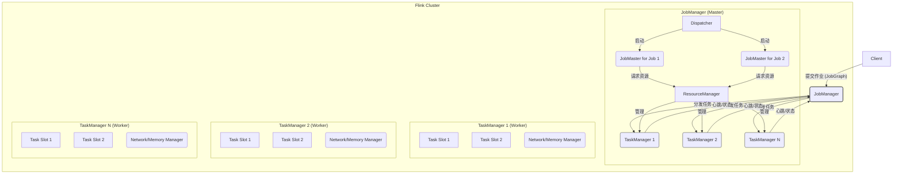
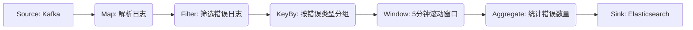
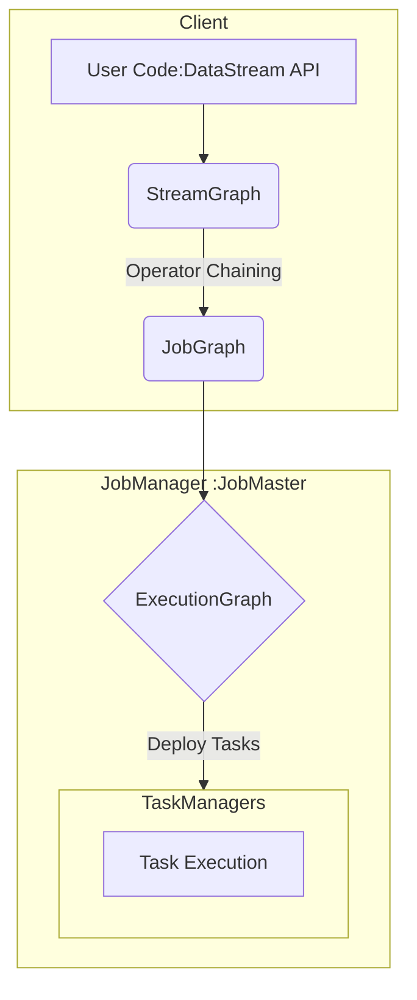

# 第9章：Flink架构与核心概念 (Flink Architecture & Core Concepts)

进入Flink的世界，我们将探索一个为真正流式处理而设计的引擎。与Spark的微批处理不同，Flink采用基于事件驱动的连续流处理模型，旨在提供低延迟和高吞吐的数据处理能力。本章将深入解析Flink的整体架构、核心API抽象、编程模型以及作业在执行前经历的图转换过程。

## 9.1 Flink整体架构 (JobManager, TaskManager, Client)

Flink采用标准的Master-Slave架构，主要由三个组件构成：**JobManager**, **TaskManager**, 和 **Client**。

*   **JobManager (Master):**
    *   **职责:** 负责整个Flink集群的协调和管理。它接收客户端提交的作业，负责作业的调度、检查点协调以及故障恢复。
    *   **核心组件:**
        *   **Dispatcher:** 作为接收客户端作业提交的入口（REST接口），负责启动新的JobMaster。
        *   **JobMaster:** 每个运行的Flink作业（Application）都有一个对应的JobMaster。它负责管理该作业的执行，包括将逻辑计划（JobGraph）转换为物理执行计划（ExecutionGraph），调度任务（Task）到TaskManager，协调Checkpoint，以及处理任务故障。
        *   **ResourceManager:** 负责集群资源的分配和管理，处理TaskManager的注册和资源请求。它可以与YARN、Kubernetes或Flink自带的Standalone部署模式集成。
    *   **高可用 (HA):** 生产环境中通常部署多个JobManager实例（Active/Standby模式），利用ZooKeeper进行领导者选举和元数据存储，保证集群管理的高可用性。

*   **TaskManager (Worker/Slave):**
    *   **职责:** 负责执行具体的计算任务。TaskManager是真正执行数据处理逻辑的工作节点。
    *   **核心组件:**
        *   **Task Slot:** TaskManager将自身的资源（主要是内存）划分为若干个**任务槽（Task Slot）**。每个Slot可以执行一个或多个来自不同作业的并行任务（Subtask），但同一Slot内的任务共享资源。Slot的数量通常配置为机器的CPU核心数。
        *   **Task Executor:** TaskManager内部负责接收来自JobMaster的任务部署请求，并在分配的Task Slot中启动和管理任务的执行。
        *   **Network & Memory Manager:** 管理TaskManager的网络连接、数据缓冲以及内存分配。
    *   **心跳:** TaskManager会定期向ResourceManager发送心跳，汇报自身状态和资源可用情况。JobMaster也会与执行其任务的TaskManager保持心跳，监控任务执行状态。

*   **Client:**
    *   **职责:** 用户与Flink集群交互的入口。负责将用户编写的Flink程序（代码）编译、优化，并生成作业图（JobGraph），然后将JobGraph提交给JobManager的Dispatcher。
    *   **交互方式:** 可以是命令行工具 (`flink run`)，也可以是通过Web UI提交，或者嵌入在应用程序中（例如Java/Scala程序）。
    *   **作用:** Client提交作业后，其生命周期可以结束，不直接参与作业的运行时执行（除非是特殊模式，如Local模式）。

**Flink架构示意图 (Mermaid):**



## 9.2 核心抽象：DataStream API 与 Table API/SQL

Flink提供了不同层次的API，以满足不同用户的需求。

*   **DataStream API:**
    *   **定位:** Flink的核心API，提供对数据流（DataStream）的精细控制。
    *   **核心概念:** `DataStream<T>` 代表一个包含类型为`T`的元素的不可变分布式数据流。用户可以通过各种转换操作（Transformations）来处理和转换DataStream。
    *   **特点:**
        *   **面向流:** 原生支持流式处理语义，如事件时间、窗口、状态等。
        *   **灵活性高:** 提供丰富的操作符（Operators）和底层接口（如ProcessFunction），允许用户实现复杂的流处理逻辑。
        *   **类型安全:** 利用泛型提供编译时类型检查。
    *   **适用场景:** 需要对流处理过程进行精细控制、实现复杂事件处理逻辑、需要自定义状态管理和时间处理的场景。
    *   **示例 (Scala):**
        ```scala
        val env = StreamExecutionEnvironment.getExecutionEnvironment
        val text: DataStream[String] = env.socketTextStream("localhost", 9999)

        val counts: DataStream[(String, Int)] = text
          .flatMap { _.toLowerCase.split("\\W+").filter(_.nonEmpty) }
          .map { (_, 1) }
          .keyBy(_._1) // 按单词分组
          .sum(1)      // 对第二个字段求和

        counts.print()
        env.execute("WordCount Stream")
        ```

*   **Table API / SQL:**
    *   **定位:** Flink提供的关系型API，允许用户使用类似SQL的语法或声明式的Table API来处理数据。
    *   **核心概念:** `Table` 代表一个关系型表，可以是动态变化的流式表（Dynamic Table）或静态的批处理表（Batch Table）。
    *   **特点:**
        *   **声明式:** 用户只需描述"想要什么"，而不需要关心具体的执行细节。
        *   **优化:** 底层共享Flink的优化器，可以进行查询优化。
        *   **统一批流:** 提供一套API同时支持批处理和流处理场景。
        *   **易用性:** 对于熟悉SQL的用户非常友好，学习成本低。
    *   **适用场景:** 数据分析、报表生成、简单的ETL任务、需要快速原型设计的场景。
    *   **示例 (SQL):**
        ```sql
        // 使用 Flink SQL Client 或 Table API
        CREATE TABLE clicks (
          user_id BIGINT,
          url STRING,
          click_time TIMESTAMP(3)
          WATERMARK FOR click_time AS click_time - INTERVAL '5' SECOND
        ) WITH (
          'connector' = 'kafka', ...
        );

        CREATE TABLE output (
          url STRING,
          cnt BIGINT
        ) WITH (
          'connector' = 'jdbc', ...
        );

        INSERT INTO output
        SELECT url, COUNT(*) as cnt
        FROM clicks
        GROUP BY TUMBLE(click_time, INTERVAL '10' MINUTE), url;
        ```
    *   **关系:** Table API和SQL在底层会被转换为DataStream API（或者批处理DataSet API），然后再执行。

## 9.3 Flink编程模型：算子(Operator)、流(Stream)、转换(Transformation)

Flink的DataStream API编程模型围绕着以下三个核心概念构建：

*   **流 (Stream):**
    *   表示持续不断产生的数据序列。在Flink中，通常指`DataStream`对象。
    *   可以是**有界流 (Bounded Stream)**，处理固定大小的数据集（类似批处理），也可以是**无界流 (Unbounded Stream)**，处理无限持续的数据。

*   **算子 (Operator):**
    *   定义了对一个或多个输入流进行何种操作（计算、转换）以产生输出流。例如`map`, `filter`, `keyBy`, `window`, `connect`, `process`等。
    *   Flink提供了大量的内置算子，也允许用户自定义算子（通过实现`Function`接口或`ProcessFunction`）。
    *   **分类:**
        *   **一元算子 (Unary Operator):** 处理一个输入流，如`map`, `filter`。
        *   **二元算子 (Binary Operator):** 处理两个输入流，如`connect`, `join`, `union`。

*   **转换 (Transformation):**
    *   指将一个或多个`DataStream`通过应用一个**算子**转换为新的`DataStream`的操作。
    *   Flink程序本质上就是一系列的转换操作，将数据源（Source）的数据流逐步转换为最终需要的结果流，并输出到数据汇（Sink）。
    *   **惰性求值:** Flink的转换操作是惰性执行的。定义转换操作时，只是构建了逻辑执行计划，只有当调用`env.execute()`时，作业才会被真正提交到集群执行。

**编程模型示例 (逻辑流程):**



## 9.4 作业图：StreamGraph -> JobGraph -> ExecutionGraph

当用户编写完Flink程序并调用`execute()`时，Flink会在内部经历一系列的图转换过程，最终生成可在分布式环境中执行的物理计划。

1.  **StreamGraph:**
    *   **生成:** 由DataStream API调用直接生成，最接近用户代码逻辑的图。
    *   **节点:** `StreamNode`，每个节点代表一个算子（Operator）。
    *   **边:** `StreamEdge`，表示数据流向。
    *   **特点:** 包含了算子的详细信息（如用户函数 UDF）、串联关系（Chaining）、并行度设置等。此阶段主要在**客户端**完成。

2.  **JobGraph:**
    *   **生成:** StreamGraph经过优化（主要是**算子链 Operator Chaining**）后生成。
    *   **节点:** `JobVertex`，一个`JobVertex`通常对应StreamGraph中一个或多个被链在一起（Chain）的算子。
    *   **边:** `IntermediateDataSet`，表示`JobVertex`之间的数据依赖关系和传输方式（如 Pipelined, Blocking）。
    *   **优化 (Operator Chaining):** 将可以串联执行的算子（如连续的`map`, `filter`）合并到同一个`JobVertex`中，形成一个**任务（Task）**。这样可以减少任务间的数据序列化/反序列化和网络传输开销，提升性能。只有数据需要重新分区（如`keyBy`, `broadcast`, `rebalance`）的操作才会断开算子链。
    *   **特点:** 是提交给JobManager的最终逻辑计划。此阶段主要在**客户端**完成，但优化可能涉及集群信息。

3.  **ExecutionGraph:**
    *   **生成:** JobMaster接收到JobGraph后，根据当前的集群资源状况和JobGraph的并行度设置，将其转换为可执行的物理计划。
    *   **节点:** `ExecutionVertex`，代表`JobVertex`的一个并行实例（Subtask）。如果一个`JobVertex`的并行度是N，则会生成N个`ExecutionVertex`。
    *   **边:** `ExecutionEdge`，表示`ExecutionVertex`之间具体的数据传输通道。
    *   **特点:** 是JobMaster用于调度和监控作业执行的内部数据结构。包含了任务的部署位置（TaskManager和Slot）、状态（Deployed, Running, Finished, Failed等）。此阶段完全在**JobManager (JobMaster)** 上完成。

**图转换流程示意图 (Mermaid):**



**理解这些图的关系和转换过程对于深入理解Flink的执行机制、性能调优和问题排查至关重要。** 