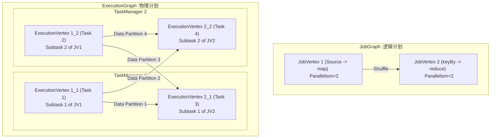
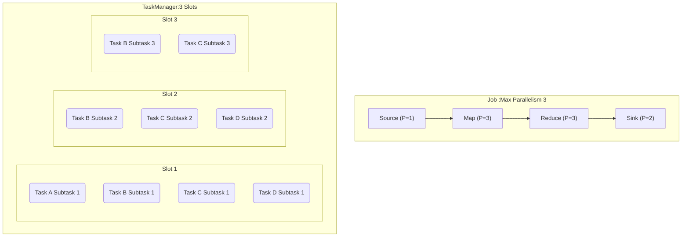
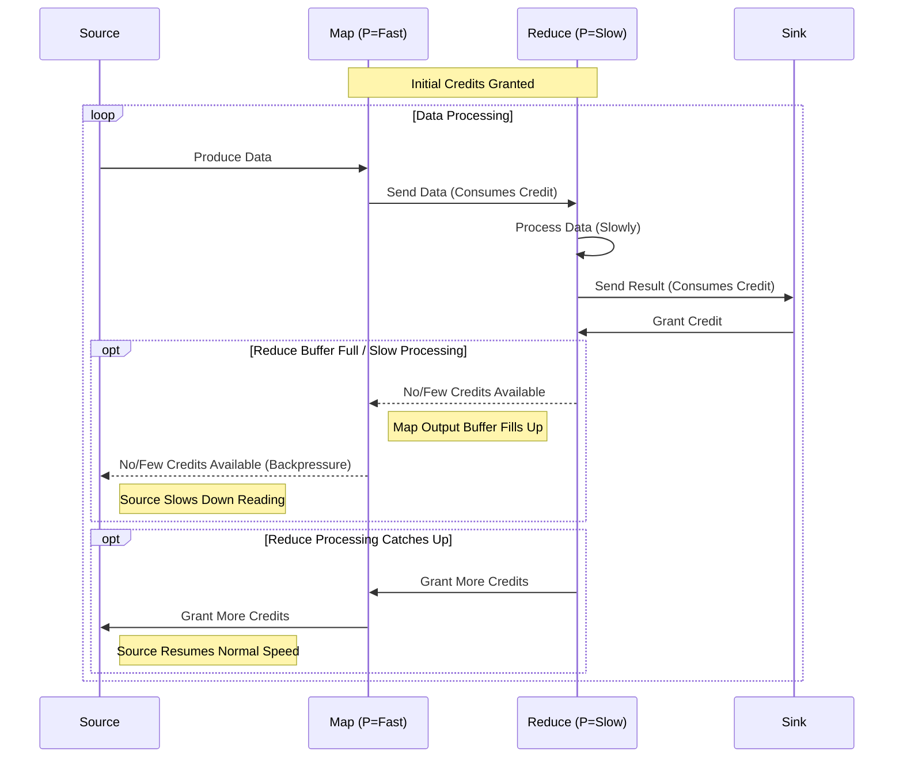

# 第10章：Flink作业执行与调度 (Flink Job Execution & Scheduling)

上一章我们了解了Flink的整体架构和作业在提交前经历的图转换。本章将深入探讨Flink作业的分布式执行细节和调度机制。我们将重点关注作业提交后的流程、任务（Task）与子任务（Subtask）的概念、Operator Chain的实际作用、资源管理中的任务槽（Task Slot），以及Flink独特的调度策略和关键的反压（Backpressure）机制。

## 10.1 作业提交与图转换过程 (简述)

在深入执行与调度之前，我们快速回顾一下作业提交流程（详见第9章）：

1.  **客户端:** 用户通过Client（命令行、API等）提交Flink程序。
2.  **StreamGraph生成:** Client将程序代码转换为StreamGraph，表示算子级别的逻辑流程。
3.  **JobGraph生成:** Client对StreamGraph进行优化（主要是Operator Chaining），生成JobGraph。JobGraph是提交给集群的逻辑数据流图，节点是JobVertex（代表一个或多个链式算子）。
4.  **提交:** Client将JobGraph提交给JobManager的Dispatcher。
5.  **JobMaster启动:** Dispatcher为该作业启动一个JobMaster实例。
6.  **ExecutionGraph生成:** JobMaster接收JobGraph，并结合当前集群资源信息，将其转换为ExecutionGraph。ExecutionGraph是物理执行图，包含了具体的并行实例（ExecutionVertex）和任务状态。

## 10.2 分布式执行：Task、Subtask、Operator Chain

ExecutionGraph是指导Flink作业分布式执行的核心。

*   **Task:** 在Flink中，"Task"通常指代**一个算子（或一组链式算子）的一个并行实例**。它对应ExecutionGraph中的一个**ExecutionVertex**。一个Task负责处理数据流的一个分区（Partition）。
*   **Subtask:** Task是调度的基本单元。一个JobVertex（逻辑算子或链式算子组）根据其设置的并行度（Parallelism），会被拆分成多个并行的Task实例，这些实例通常被称为**Subtask**。例如，一个并行度为4的`map`操作，其对应的JobVertex会生成4个Subtask（即4个ExecutionVertex）。
*   **Operator Chain (算子链):** 这是Flink一项重要的性能优化。将可以"背靠背"执行且没有数据重分区需求的多个算子（例如`Source -> map -> filter`）链接（Chain）在一起，合并成一个单独的Task（在JobGraph中是一个JobVertex，在ExecutionGraph中是对应并行度的多个ExecutionVertex/Task）。
    *   **优点:**
        *   减少了线程切换的开销。
        *   减少了数据序列化/反序列化的开销。
        *   减少了网络传输（如果跨TaskManager）。
        *   降低了延迟，提高了吞吐量。
    *   **断开条件:** 当遇到需要数据重分区的操作时，Operator Chain会被断开。常见的断开点包括：
        *   `keyBy()`: 按键分区。
        *   `broadcast()`: 广播数据。
        *   `rebalance()`: 轮询分区（负载均衡）。
        *   `shuffle()`: 随机分区。
        *   `partitionCustom()`: 自定义分区。
        *   改变并行度（`setParallelism()`）。

**Task, Subtask, Operator Chain 关系示意图 (Mermaid):**

*   **执行流程:** JobMaster根据ExecutionGraph，将每个Task（ExecutionVertex）部署到由ResourceManager分配的TaskManager的Task Slot中。TaskManager接收到部署指令后，启动对应的线程执行Task代码，处理分配给它的数据分区。

## 10.3 资源管理与任务槽 (Task Slot)

Flink通过**任务槽（Task Slot）**来管理TaskManager上的计算资源。

*   **定义:** Task Slot是TaskManager资源的固定子集。一个TaskManager拥有一个或多个Task Slot。每个Slot代表了TaskManager一部分独立的资源（主要是内存，CPU资源是共享的，但可以通过外部资源管理器如YARN/K8s进行限制）。
*   **作用:**
    *   **资源隔离:** Slot提供了基本的资源隔离（内存）。运行在同一个Slot内的Task共享内存资源，但不同Slot之间内存是隔离的（理论上）。
    *   **并行度控制:** 一个作业需要的总Slot数量由其所有Task中最高的并行度决定（如果启用了Slot Sharing，则计算方式更复杂）。JobMaster向ResourceManager申请所需数量的Slot来运行作业。
    *   **任务执行单元:** 每个Slot可以执行一个**Pipeline**的任务。一个Pipeline是指作业图中一系列可以流水线方式执行的Task（通常对应一个Operator Chain的并行实例）。
*   **Slot数量配置:** TaskManager的Slot数量 (`taskmanager.numberOfTaskSlots`) 是一个关键配置。通常建议配置为TaskManager所在机器的CPU核心数。配置过多Slot可能导致内存竞争激烈，过少则可能浪费CPU资源。
*   **Slot与并行度的关系:** 一个Task Slot可以运行来自**不同**作业或**同一**作业**不同**Task（JobVertex）的**多个**Subtask，前提是这些Subtask属于同一个**Slot Sharing Group**（见10.4）。它**不能**运行同一个Task（JobVertex）的多个Subtask。作业的并行度指的是某个算子（JobVertex）同时运行的实例数（Subtask数），而Slot是物理资源单元。

## 10.4 调度策略：Eager Scheduling, Lazy from Source, Slot Sharing

JobMaster负责将ExecutionGraph中的Task调度到可用的Task Slot上。Flink提供了几种不同的调度模式和策略：

*   **Eager Scheduling (默认):**
    *   **策略:** JobMaster一旦获得所有必需的资源（足够的Task Slot），就会立即部署ExecutionGraph中的所有Task。
    *   **优点:** 简单直接，易于理解。适用于资源充足且稳定的环境。
    *   **缺点:** 如果资源暂时不足（例如，等待新的TaskManager启动），整个作业可能无法开始。对于批处理作业或某些动态变化的场景，可能不是最优选择。

*   **Lazy from Source Scheduling:**
    *   **策略:** JobMaster不会一次性部署所有Task。它首先只部署Source Task。只有当Source Task的输出数据准备好，需要发送给下游Task时，JobMaster才会部署下游Task，并以此类推，按需部署。
    *   **优点:** 资源利用更灵活，特别适用于批处理和资源可能动态变化的环境。可以更快地启动作业的部分流程。
    *   **缺点:** 增加了调度的复杂性，可能引入额外的启动延迟。

*   **调度模式 (Flink 1.11+):** Flink引入了更明确的调度模式配置 (`jobmanager.scheduler`)：
    *   `ng`: 下一代调度器（Next Generation Scheduler），是Eager模式的一种实现。
    *   `adaptive`: 自适应调度器（仍在发展中），旨在提供更智能、更灵活的调度能力，例如根据运行时反馈动态调整资源分配和并行度。

*   **Slot Sharing (槽共享):**
    *   **机制:** 允许来自**同一**作业的**不同**Task（JobVertex）的Subtask共享同一个Task Slot。默认情况下，一个作业中的所有Task都属于同一个Slot Sharing Group (`default`)，因此它们可以共享Slot。
    *   **优点:**
        *   **资源利用率高:** 允许一个Slot运行整个作业的Pipeline（多个Task的Subtask），而不是每个Task都需要独占Slot。这使得只需要与作业最高并行度相等的Slot数即可运行整个作业。
        *   **灵活性:** 对于并行度差异较大的作业（例如，Source并行度低，中间处理并行度高，Sink并行度低），Slot共享可以有效利用资源。
    *   **Slot Sharing Group:** 用户可以通过`.slotSharingGroup("group_name")`为算子指定不同的组。不同组的Task不能共享同一个Slot，这可以用于隔离资源密集型或需要特殊资源保证的Task。

**Slot Sharing 示意图 (Mermaid):**

## 10.5 反压机制 (Backpressure) 原理与实现

在流处理中，当某个Task的处理速度跟不上其上游Task的数据生产速度时，就会发生**反压（Backpressure）**。

*   **问题:** 如果不处理反压，下游Task的输入缓冲区会被填满，导致数据丢失或内存溢出，最终可能导致作业失败。
*   **Flink的反压机制:** Flink内置了一套基于**信用（Credit-based）**的流控机制来优雅地处理反压。
    *   **核心思想:** 下游Task根据自身处理能力和可用缓冲区数量，向上游Task授予"信用"（Credit）。一个Credit代表下游准备好接收一个数据单元（Network Buffer）。
    *   **流程:**
        1.  下游Task通过网络栈向上游Task发送可用Credit数量。
        2.  上游Task只有在收到下游Credit的情况下，才会将对应数量的数据单元发送给下游。
        3.  如果下游处理缓慢，无法及时释放缓冲区并发放新的Credit，上游Task将因为缺少Credit而减慢甚至暂停发送数据。
        4.  这种压力会沿着数据流反向传播，最终可能传递到Source Task，使其降低数据读取速率。
    *   **实现:** Flink的网络栈（基于Netty）在底层实现了这套Credit-based流控。数据在TaskManager之间通过**Network Buffer**传输，Buffer的管理和Credit的交换由网络模块负责。
*   **监控:** Flink Web UI提供了反压监控指标。通常，"Back pressured"状态表示一个Task因为下游反压而无法发送数据，"High" Input/Output Buffer Usage则表示Task的处理速度跟不上数据输入或输出。

**反压传播示意图 (Mermaid):**

*   **优点:**
    *   自动调节：无需手动干预，系统能自动适应处理能力的变化。
    *   防止崩溃：有效防止因缓冲区溢出导致的作业失败。
*   **影响:** 反压本身不是错误，而是系统自我保护的信号。但持续的反压通常意味着下游存在性能瓶颈，需要进行分析和优化（例如增加并行度、优化代码逻辑、调整资源配置等）。

**总结:** Flink通过精巧的分布式执行模型（Task, Subtask, Operator Chain）、灵活的资源管理（Task Slot, Slot Sharing）和强大的调度策略（Eager, Lazy, Adaptive）以及自动化的反压机制，实现了高效、稳定、可扩展的流处理。理解这些内核机制对于部署、监控和优化Flink作业至关重要。 