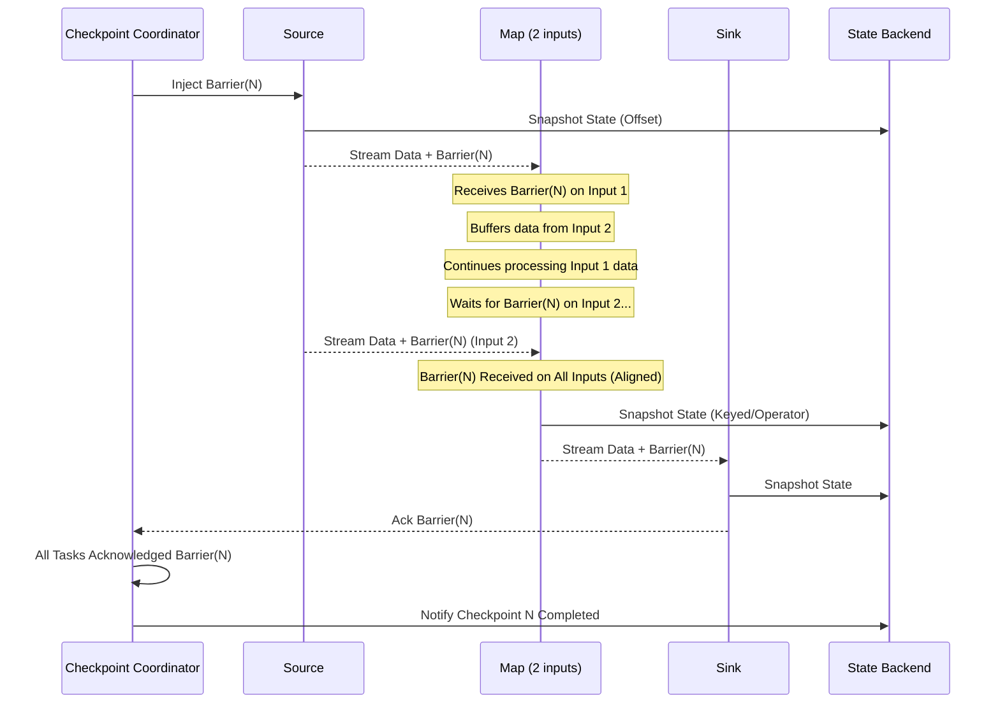

# 第11章：Flink状态管理与容错 (Flink State Management & Fault Tolerance)

对于流处理引擎而言，状态管理和容错是两大核心挑战。Flink以其强大的状态管理能力和精确的容错机制而闻名。本章将深入探讨Flink支持的状态类型、不同的状态后端（State Backend）实现，并详细解析其基于分布式快照的Checkpointing机制、Savepoint功能以及提供的一致性保证。

## 11.1 状态类型：Keyed State vs Operator State

Flink提供了两种基本的状态类型，以满足不同场景的需求：

*   **Keyed State (键控状态):**
    *   **范围:** 与特定的**键（Key）**相关联的状态。这种状态只能在`KeyedStream`上使用，通常在`keyBy()`操作之后。
    *   **分区:** Keyed State总是根据Key进行分区和分布。每个Key的状态只存在于处理该Key的那个Subtask实例上。
    *   **数据结构:** Flink为Keyed State提供了多种丰富的数据结构：
        *   `ValueState<T>`: 存储单个值，每个Key对应一个值。`update(T)`更新，`value()`获取。
        *   `ListState<T>`: 存储元素列表，每个Key对应一个列表。`add(T)`或`addAll(List<T>)`添加，`get()`获取`Iterable<T>`。
        *   `MapState<UK, UV>`: 存储Key-Value对，每个Key对应一个Map。`put(UK, UV)`添加/更新，`get(UK)`获取，`entries()`, `keys()`, `values()`遍历。
        *   `ReducingState<T>`: 存储单个聚合值，每个加入的值会通过指定的`ReduceFunction`与当前值聚合。`add(T)`添加新值。
        *   `AggregatingState<IN, OUT>`: 类似于`ReducingState`，但更通用，使用`AggregateFunction`，输入输出类型可以不同。`add(IN)`添加新值。
    *   **访问:** 只能在处理特定Key的函数（如`RichFunction`或`ProcessFunction`）中访问。
    *   **场景:** 窗口聚合、按用户ID/设备ID等进行的个性化计算、状态机等。

*   **Operator State (算子状态):**
    *   **范围:** 与**算子（Operator）的单个并行实例（Subtask）**相关联的状态。它不与任何特定的Key绑定。
    *   **分区/分布:** 每个算子实例维护自己独立的Operator State。当算子并行度改变时，需要定义如何重新分配状态。
    *   **数据结构:** Flink为Operator State提供了两种主要的数据结构（通过实现`CheckpointedFunction`或`BroadcastState`接口来使用）：
        *   `ListState<T>`: 最常用的Operator State。每个算子实例维护一个元素的列表。在恢复或重分布时，所有实例的状态列表会被收集起来，然后均匀（或根据用户定义的逻辑）分配给新的实例。适用于需要收集分区数据或维护每个分区独立状态的场景（如Kafka Connector维护分区偏移量）。
        *   `BroadcastState<K, V>`: 一种特殊的Operator State，用于将数据广播给算子的所有并行实例，并且这些实例上的状态都是相同的。通常用于需要根据一个流的规则去处理另一个流的场景（例如，动态更新规则）。它有严格的只读访问限制（除了添加广播元素）。
    *   **访问:** 在算子的对应方法中（如`snapshotState()`, `initializeState()` for `CheckpointedFunction`）访问和管理。
    *   **场景:** Source Connector（如Kafka Consumer记录消费的offset）、Sink Connector（保证Exactly-Once的事务性写入）、需要广播配置或模式信息的场景。

**状态类型对比:**

| 特性        | Keyed State                             | Operator State                          |
| :---------- | :-------------------------------------- | :-------------------------------------- |
| **范围**    | 特定Key                                 | 算子并行实例 (Subtask)                  |
| **上下文**  | `KeyedStream` (`keyBy()`之后)            | 任何Stream                              |
| **分区**    | 按Key自动分区                         | 按算子实例分区，需手动处理重分布        |
| **结构**    | `ValueState`, `ListState`, `MapState`等 | `ListState`, `BroadcastState`           |
| **典型场景**| 聚合, 个性化计算, 状态机                | Source/Sink Connector, 广播配置           |

## 11.2 State Backend：Memory, FS, RocksDB 实现与选择

**State Backend（状态后端）**负责管理状态的存储、访问和持久化。Flink提供了三种内置的状态后端：

1.  **MemoryStateBackend:**
    *   **存储:** 将工作状态（Working State）保存在TaskManager的**JVM堆内存**中。Checkpoint时，将状态快照**同步**发送给JobManager，JobManager也将其存储在**堆内存**中。
    *   **优点:** 速度最快，因为状态访问直接操作内存。适用于本地开发、测试和状态非常小的作业。
    *   **缺点:**
        *   **状态大小受限:** 受限于TaskManager和JobManager的内存大小，不适合存储大量状态。
        *   **可靠性低:** JobManager是单点，一旦宕机，Checkpoint数据会丢失（除非配置了HA）。
        *   **同步快照:** Checkpoint过程可能阻塞算子处理。

2.  **FsStateBackend (原 `FileSystemStateBackend`):**
    *   **存储:** 将工作状态（Working State）保存在TaskManager的**JVM堆内存**中。Checkpoint时，将状态快照**异步**写入配置的**文件系统**（如HDFS、S3）中。JobManager中只保存指向文件系统中快照数据的轻量级指针。
    *   **优点:**
        *   **状态大小适中:** 可以存储比MemoryStateBackend更大的状态，受限于TaskManager内存。
        *   **可靠性高:** Checkpoint数据存储在可靠的分布式文件系统。
        *   **异步快照:** Checkpoint过程对算子处理的影响较小。
    *   **缺点:**
        *   状态大小仍受TaskManager内存限制。
        *   状态访问仍是内存操作，但Checkpoint需要写入文件系统。
    *   **适用场景:** 大多数常规流处理应用，状态大小可控，对可靠性有要求。

3.  **RocksDBStateBackend:**
    *   **存储:** 将工作状态（Working State）存储在TaskManager本地磁盘上的**RocksDB数据库**中（一种嵌入式KV存储）。Checkpoint时，将RocksDB中的数据**异步**快照到配置的**文件系统**（如HDFS、S3）。JobManager同样只保存指针。
    *   **优点:**
        *   **状态大小极大:** 可以存储非常巨大的状态，远超内存大小，仅受限于本地磁盘空间。
        *   **可靠性高:** Checkpoint存储在可靠文件系统。
        *   **异步快照:** 对算子影响小。
        *   **增量Checkpoint:** RocksDB原生支持增量快照，可以显著减少大型状态作业的Checkpoint时间（可选配置）。
    *   **缺点:**
        *   **性能开销:** 状态访问需要读写磁盘（通过RocksDB），并涉及序列化/反序列化，相比内存访问速度较慢。
        *   **配置复杂:** 需要调整RocksDB相关参数以优化性能。
        *   需要TaskManager具有快速本地磁盘（推荐SSD）。
    *   **适用场景:** 需要维护超大状态（TB级别）的作业，例如长窗口聚合、复杂CEP、大型机器学习模型训练等。

**State Backend选择总结:**

| State Backend        | 工作状态存储   | Checkpoint存储       | 状态大小限制 | 性能      | 可靠性     | 适用场景                       |
| :------------------- | :------------- | :------------------- | :----------- | :-------- | :--------- | :----------------------------- |
| `MemoryStateBackend` | TM JVM Heap    | JM JVM Heap          | 小 (内存)    | 非常快    | 低 (HA可选) | 本地开发, 测试, 极小状态       |
| `FsStateBackend`     | TM JVM Heap    | 文件系统 (HDFS, S3)  | 中 (内存)    | 快        | 高         | 常规应用, 状态可控, 高可靠   |
| `RocksDBStateBackend`| TM RocksDB(磁盘)| 文件系统 (HDFS, S3)  | 非常大 (磁盘)| 相对慢    | 高         | 超大状态, 长窗口, 复杂CEP |

**配置方式:** 可以在`flink-conf.yaml`中全局配置，也可以在代码中为单个作业指定。

```yaml
# flink-conf.yaml
state.backend: rocksdb
state.checkpoints.dir: hdfs:///flink/checkpoints
state.backend.incremental: true # 启用RocksDB增量Checkpoint
```

## 11.3 Checkpointing机制：分布式快照算法 (Asynchronous Barrier Snapshotting)

Flink的容错核心是基于**分布式快照（Distributed Snapshotting）**的Checkpointing机制。它采用了**Chandy-Lamport算法**的一种变体，称为**异步屏障快照（Asynchronous Barrier Snapshotting）**。

*   **目标:** 在不停止整个流处理的情况下，创建一个全局一致的状态快照。
*   **核心组件:**
    *   **Checkpoint Coordinator:** 位于JobMaster中，负责协调Checkpoint过程。
    *   **Checkpoint Barrier (检查点屏障):** 一种特殊的数据记录，由Checkpoint Coordinator注入到Source Task的数据流中。Barrier携带Checkpoint ID，随数据流向下游传递。
*   **流程:**
    1.  **触发:** Checkpoint Coordinator按照配置的时间间隔，向所有Source Task发送带有新Checkpoint ID的Barrier。
    2.  **Source Task 处理 Barrier:** Source Task收到Barrier后，记录自身状态（如Kafka offset）到指定的State Backend，然后将Barrier广播给所有下游Task。
    3.  **中间 Task 处理 Barrier (对齐 Align):**
        *   **输入对齐:** 当一个Task有多个输入通道时，它需要等待**所有**输入通道都收到具有相同Checkpoint ID的Barrier后，才能开始处理自己的状态快照。在此期间，它会继续处理来自已收到Barrier通道的数据，但会**缓存**来自未收到Barrier通道的数据（Barrier Alignment）。
        *   **状态快照:** 一旦所有输入的Barrier都到达，Task就**同步**记录下当前状态到State Backend。
        *   **Barrier转发:** 快照完成后，Task将该Barrier转发给它的所有下游Task。
    4.  **Sink Task 处理 Barrier:** Sink Task收到Barrier后，执行自身状态快照，并向Checkpoint Coordinator**确认**该Checkpoint完成。
    5.  **Checkpoint 完成:** 当Checkpoint Coordinator收到**所有**Sink Task以及**所有**需要快照的Task对某个Checkpoint ID的确认后，该Checkpoint被视为**全局完成**。Coordinator会通知State Backend将这次快照标记为完成，并可能删除旧的Checkpoint。

**异步屏障快照流程示意图 (Mermaid):**



*   **Exactly-Once vs At-Least-Once Checkpointing Mode:**
    *   **Exactly-Once (默认):** 严格执行Barrier对齐。可以保证状态恢复后计算结果的精确一次性。但Barrier对齐可能引入延迟，特别是在反压或数据倾斜时。
    *   **At-Least-Once:** Task收到第一个Barrier后立即进行快照并向下游转发，无需等待对齐。可以减少Checkpoint延迟，但恢复时可能导致部分记录被重复处理（因为快照可能包含了对齐阶段缓存的数据）。
*   **异步性:** 状态快照写入State Backend的操作是**异步**执行的（对于Fs和RocksDB Backend），这意味着Task在触发快照后可以继续处理数据，减少了Checkpoint对正常处理流程的影响。

## 11.4 Savepoint机制：原理与应用

**Savepoint**是Flink提供的一种特殊的、由用户**手动触发**的全局一致性快照。它使用与Checkpointing相同的分布式快照机制，但具有不同的目的和管理方式。

*   **原理:** 与Checkpoint类似，通过注入Barrier创建全局一致的状态快照，并将快照数据和元数据存储在指定的文件系统路径下。
*   **与Checkpoint的区别:**
    *   **触发方式:** Checkpoint由Flink自动按间隔触发，Savepoint由用户命令（如`flink savepoint <jobId> [targetDirectory]`）手动触发。
    *   **目的:** Checkpoint主要用于**故障恢复**，保证作业的连续运行。Savepoint主要用于**计划性的作业维护和升级**。
    *   **生命周期:** Checkpoint在作业停止后通常会被自动清理（除非配置保留）。Savepoint是持久化的，用户需要手动管理和删除。
    *   **所有权:** Savepoint被认为是用户拥有的，其格式和兼容性在Flink版本间有更强的保证。

*   **应用场景:**
    *   **应用程序升级:** 停止作业，进行代码或依赖更新，然后从Savepoint恢复，无缝衔接。
    *   **Flink集群版本升级:** 创建Savepoint，升级Flink集群，然后从Savepoint恢复作业。
    *   **更改作业并行度:** 创建Savepoint，停止作业，以新的并行度启动作业并从Savepoint恢复。
    *   **A/B测试或调试:** 创建Savepoint，启动一个修改版的作业从该Savepoint恢复，进行对比测试。
    *   **数据迁移或归档:** 创建Savepoint作为特定时间点的状态备份。

## 11.5 一致性保证：Exactly-Once vs At-Least-Once

Flink致力于提供端到端的**Exactly-Once（精确一次）**处理语义，但也可以配置为**At-Least-Once（至少一次）**。

*   **Exactly-Once:**
    *   **含义:** 即使发生故障，每条输入记录对最终结果的影响也只有一次。状态更新精确反映了每条记录处理一次的效果。
    *   **实现依赖:**
        1.  **可重放的数据源 (Replayable Source):** Source必须能够根据偏移量或ID重新读取数据（如Kafka）。
        2.  **Checkpointing机制:** Flink的分布式快照保证了内部状态的一致性恢复。
        3.  **事务性或幂等的Sink (Transactional/Idempotent Sink):** Sink需要支持事务（如Kafka Producer的事务、JDBC Sink的两阶段提交）或者能够处理重复写入而不产生副作用（幂等写入，如基于唯一ID的UPSERT）。
    *   **配置:** Checkpointing模式设置为`EXACTLY_ONCE` (默认)。

*   **At-Least-Once:**
    *   **含义:** 即使发生故障，保证每条输入记录至少被处理一次。可能发生重复处理。
    *   **实现依赖:**
        1.  可重放的数据源。
        2.  Checkpointing机制（`AT_LEAST_ONCE`模式即可）。Sink不需要特殊支持，但可能收到重复数据。
    *   **配置:** Checkpointing模式设置为`AT_LEAST_ONCE`。
    *   **适用场景:** 对结果的精确性要求不高，但能容忍少量重复数据，或者下游系统自身具备去重能力，同时希望降低Checkpointing延迟的场景。

**总结:** Flink通过灵活的状态类型（Keyed/Operator State）、可插拔的状态后端（Memory/FS/RocksDB）、强大的分布式快照机制（Checkpointing/Savepoint）以及对事务性Sink的支持，为构建可靠、精确的有状态流处理应用提供了坚实的基础。理解这些机制对于设计、部署和运维Flink作业至关重要。 