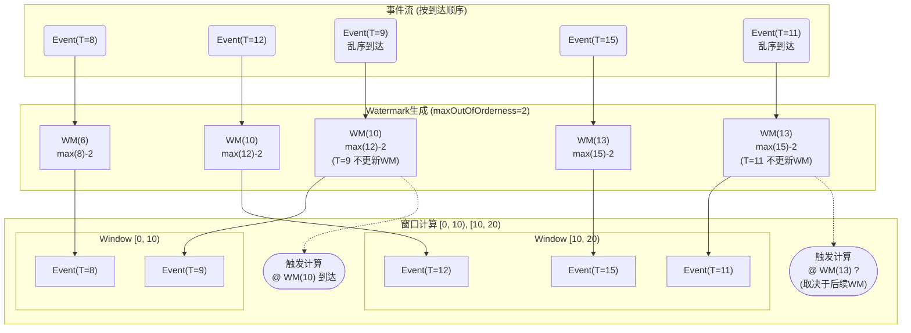

# 第12章：Flink时间与窗口机制 (Flink Time & Windowing Mechanism)

时间是流处理中一个至关重要的维度。与批处理不同，流数据天然带有时间属性，并且往往存在乱序和延迟。Flink提供了强大的时间语义支持和灵活的窗口机制来应对这些挑战。本章将详细介绍Flink中的不同时间概念、处理乱序事件的核心机制——Watermark（水位线）、各种窗口类型及其应用场景，以及用于定制窗口行为的触发器（Trigger）和移除器（Evictor）。

## 12.1 时间语义：Event Time, Processing Time, Ingestion Time

Flink支持三种不同的时间概念，用户可以根据应用需求选择合适的时间语义：

1.  **事件时间 (Event Time):**
    *   **定义:** 事件实际发生的时间，通常由产生事件的设备或系统记录在事件数据中（例如，日志时间戳、传感器读数时间）。
    *   **特点:**
        *   最能反映业务发生的真实顺序。
        *   独立于处理引擎，不受处理延迟或速度的影响。
        *   数据可能**乱序**到达，即较晚发生的事件可能先于较早发生的事件被处理。
    *   **应用:** 需要精确基于事件发生时间进行分析的场景，如用户行为分析、金融交易处理、物联网数据监控等。这是Flink中最常用且推荐的时间语义。
    *   **挑战:** 需要处理乱序数据，依赖Watermark机制来判断时间的进展。

2.  **处理时间 (Processing Time):**
    *   **定义:** 事件被Flink算子处理时，处理机器的本地系统时间。
    *   **特点:**
        *   实现简单，无需处理乱序。
        *   结果**不确定**且**不可重现**，因为同一事件在不同时间、不同机器或不同运行速度下处理，其处理时间会不同。
        *   对网络延迟、系统负载等因素敏感。
    *   **应用:** 对实时性要求极高，且能容忍结果不精确的场景。或者，当无法获取可靠的事件时间戳时。
    *   **使用注意:** 结果的准确性无法保证，通常不推荐用于需要精确结果的业务。

3.  **摄入时间 (Ingestion Time):**
    *   **定义:** 事件进入Flink Source算子时，Source算子机器的本地系统时间。事件会自动分配此时间戳。
    *   **特点:**
        *   介于事件时间和处理时间之间的一种折衷。
        *   比处理时间更稳定，因为时间戳在进入系统时就确定了，后续处理不会改变它。
        *   仍然无法完全避免乱序（Source前的乱序无法处理），但比事件时间简单，无需自定义时间戳提取和Watermark生成。
    *   **应用:** 既需要一定的时间准确性，又无法方便地处理事件时间或生成Watermark的场景。

**时间语义选择:** 在`StreamExecutionEnvironment`中设置。

```scala
val env = StreamExecutionEnvironment.getExecutionEnvironment

// 设置为事件时间 (推荐)
env.setStreamTimeCharacteristic(TimeCharacteristic.EventTime)

// 设置为处理时间
// env.setStreamTimeCharacteristic(TimeCharacteristic.ProcessingTime)

// 设置为摄入时间
// env.setStreamTimeCharacteristic(TimeCharacteristic.IngestionTime)
```

**时间语义对比:**

| 时间语义                | 定义             | 特点                       | 优点                 | 缺点                 |
| :------------------ | :------------- | :----------------------- | :----------------- | :----------------- |
| **Event Time**      | 事件实际发生时间       | 真实反映业务, 可能乱序             | 结果准确, 可重现          | 需要处理乱序 (Watermark) |
| **Processing Time** | 算子处理时的本地时间     | 简单, 结果不确定, 不可重现          | 延迟最低               | 结果不准确, 不可靠         |
| **Ingestion Time**  | 进入Source时的本地时间 | Event/Processing折衷, 相对稳定 | 比Processing Time准确 | 无法处理Source前的乱序     |

## 12.2 Watermark：原理、生成与传播

当使用**事件时间 (Event Time)** 时，如何处理乱序数据并判断一个时间窗口何时应该关闭计算？这就是**Watermark（水位线）**发挥作用的地方。

*   **原理:**
    *   Watermark是一种特殊的**时间戳（Timestamp）**，由Flink系统生成或用户定义，并随数据流向下游传递。
    *   `Watermark(t)`表示**时间戳小于等于`t`的事件已经全部到达**（或者说，系统认为不会再有时间戳小于等于`t`的事件到达了）。
    *   Watermark本质上是Flink对事件时间进展的一种**估计**或**断言**。
    *   当一个窗口的结束时间小于等于接收到的Watermark时，Flink认为该窗口已经收集到了所有应该包含的数据（允许一定的延迟），可以触发窗口计算了。

*   **作用:**
    *   **触发窗口计算:** Watermark是基于事件时间驱动窗口触发的主要机制。
    *   **处理乱序:** Watermark允许系统等待一定时间的乱序数据，然后再关闭窗口。等待的时间由Watermark的生成策略决定。
    *   **推进事件时间:** 系统内部的事件时间时钟由流经算子的Watermark驱动。

*   **生成 (Assigning Timestamps and Watermarks):**
    通常在Source之后紧接着通过`assignTimestampsAndWatermarks`方法指定。
    *   **时间戳分配器 (Timestamp Assigner):** 从事件数据中提取事件时间戳。
    *   **Watermark生成器 (Watermark Generator):** 根据提取到的时间戳生成Watermark。Flink提供了两种内置生成策略：
        1.  **周期性生成 (Periodic):** 系统按照固定时间间隔（例如每200毫秒）调用生成逻辑。适用于数据量较大、持续流入的场景。
            *   **`BoundedOutOfOrdernessTimestampExtractor` / `WatermarkStrategy.forBoundedOutOfOrderness()` (推荐):** 假设数据的乱序程度是有限的（有界乱序）。Watermark的值等于 `当前观察到的最大事件时间戳 - 允许的最大延迟时间 (maxOutOfOrderness)`。
                ```scala
                val dataStream: DataStream[MyEvent] = ...
                val withTimestampsAndWatermarks = dataStream.assignTimestampsAndWatermarks(
                  WatermarkStrategy
                    .forBoundedOutOfOrderness[MyEvent](Duration.ofSeconds(10)) // 允许10秒的乱序
                    .withTimestampAssigner((event: MyEvent, timestamp: Long) => event.timestamp) // 提取时间戳
                )
                ```
        2.  **标点式生成 (Punctuated):** 每当接收到一个事件，都可能生成一个新的Watermark。适用于可以根据特定事件标记（例如流结束标记）来确定Watermark的场景，或者数据量较小、不规律的场景。
            *   需要自定义实现`WatermarkGenerator`接口。

*   **传播 (Propagation):**
    *   Watermark会像普通数据记录一样在Task之间流动。
    *   当一个Task有多个输入流时（例如`union`, `keyBy`, `partition`之后），它的当前事件时间等于其所有输入流中**最小**的那个Watermark。这意味着一个多输入Task的时间进展受限于最慢的那个输入流。
    *   这确保了多输入Task在处理数据时，其内部时钟不会超过任何一个输入流能保证的时间进度，从而维持时间一致性。

**Watermark示意图 (处理乱序):**



*   **延迟数据处理:** 如果一个事件的事件时间小于当前Watermark，它就被认为是**延迟数据 (Late Event)**。默认情况下，窗口关闭后到达的延迟数据会被丢弃(**如上图的T=9即可能被丢弃**)。Flink提供了机制（如`allowedLateness()`, `sideOutputLateData()`) 来处理延迟数据。

## 12.3 窗口类型：滚动(Tumbling)、滑动(Sliding)、会话(Session)、全局(Global)

**窗口（Window）**是将无限数据流切分成有限大小"桶"进行处理的核心机制。Flink提供了多种预定义的窗口分配器（Window Assigners）：

1.  **滚动窗口 (Tumbling Windows):**
    *   **特点:** 将时间（或计数）划分成固定长度、**无重叠**的区间。每个元素只属于一个窗口。
    *   **定义:** 由窗口大小（`size`）定义。
    *   **场景:** 按固定时间间隔（如每分钟、每小时）进行聚合统计。
    *   **API:** `.window(TumblingEventTimeWindows.of(Time.minutes(5)))` 或 `.window(TumblingProcessingTimeWindows.of(Time.minutes(5)))` 或 `.countWindow(100)` (滚动计数窗口)。
    *   **示意图 (时间):** `[0, 5), [5, 10), [10, 15), ...`

2.  **滑动窗口 (Sliding Windows):**
    *   **特点:** 窗口长度固定，但窗口会按照指定的步长（`slide`）向前滑动，导致窗口之间**有重叠**。一个元素可能属于多个窗口。
    *   **定义:** 由窗口大小（`size`）和滑动步长（`slide`）定义，`slide`必须小于`size`。
    *   **场景:** 需要更平滑地观察数据变化趋势，例如计算过去1小时内每分钟的平均值。
    *   **API:** `.window(SlidingEventTimeWindows.of(Time.hours(1), Time.minutes(1)))` 或 `.window(SlidingProcessingTimeWindows.of(Time.hours(1), Time.minutes(1)))` 或 `.countWindow(100, 10)` (滑动计数窗口)。
    *   **示意图 (size=10, slide=5):** `[0, 10), [5, 15), [10, 20), ...`

3.  **会话窗口 (Session Windows):**
    *   **特点:** 窗口没有固定长度，而是根据活动的**间隔（Gap）**来划分。如果一个元素到达时，在指定的`sessionGap`内没有其他元素到达，则当前会话窗口关闭。
    *   **定义:** 由会话间隔（`sessionGap`）定义。也可以定义动态会话间隔。
    *   **场景:** 分析用户活动会话，例如网站用户一次访问期间的行为，或者传感器在一系列活动后的静默期。
    *   **API:** `.window(EventTimeSessionWindows.withGap(Time.minutes(30)))` 或 `.window(ProcessingTimeSessionWindows.withGap(Time.minutes(30)))`。
    *   **示意图 (gap=5):** `Element(T=2)` -> `Window [2, 7)`; `Element(T=8)` -> `Window [8, 13)`; `Element(T=10)` -> 合并到 `Window [8, 15)`

4.  **全局窗口 (Global Windows):**
    *   **特点:** 将所有具有相同Key的数据分配到同一个**全局窗口**中。这个窗口没有自然的结束点，除非配合**触发器（Trigger）**使用。
    *   **定义:** 无需参数。
    *   **场景:** 需要自定义窗口逻辑，例如当满足某个条件时触发计算，而不是基于时间或计数。
    *   **API:** `.window(GlobalWindows.create())`。

**窗口分配:** 窗口分配发生在`keyBy()`之后，`window()`或`countWindow()`方法将`KeyedStream`转换为`WindowedStream`。

```scala
stream
  .keyBy(...)               // KeyedStream
  .window(...)             // WindowedStream
  .aggregate/reduce/apply(...) // -> DataStream
```

## 12.4 窗口触发器 (Trigger) 与移除器 (Evictor)

虽然Watermark是事件时间窗口触发的主要机制，但**触发器（Trigger）**提供了更灵活的方式来控制窗口何时计算和输出结果。**移除器（Evictor）**则允许在触发计算之前或之后从窗口中移除元素。

*   **触发器 (Trigger):**
    *   **作用:** 决定一个窗口（由WindowAssigner分配）何时调用窗口函数进行计算并发出结果。
    *   **内置Trigger:**
        *   `EventTimeTrigger`: 当Watermark超过窗口结束时间时触发。是事件时间窗口的默认Trigger。
        *   `ProcessingTimeTrigger`: 当处理时间超过窗口结束时间时触发。是处理时间窗口的默认Trigger。
        *   `CountTrigger`: 当窗口中的元素数量达到指定阈值时触发。
        *   `PurgingTrigger`: 将任何Trigger转换为清除型Trigger。触发计算后，窗口状态会被清除。
    *   **触发时机:** Trigger可以基于事件时间、处理时间、元素计数或自定义逻辑来触发。
    *   **触发结果:** `FIRE` (计算并发出结果), `CONTINUE` (不操作), `FIRE_AND_PURGE` (计算、发出、并清除状态), `PURGE` (清除状态)。
    *   **状态:** Trigger可以拥有自己的状态（通过`getPartitionedState()`），用于实现复杂的触发逻辑（例如，只在第一次满足条件时触发）。
    *   **API:** `.trigger(MyTrigger.create())`
    *   **应用:**
        *   提前输出窗口结果（例如，每分钟输出一次滑动窗口的部分结果）。
        *   基于特定条件触发全局窗口计算。
        *   实现复杂的窗口触发逻辑。

*   **移除器 (Evictor):**
    *   **作用:** 在窗口函数执行**之前**或**之后**，从窗口中移除部分元素。
    *   **执行时机:** 在Trigger触发之后，窗口函数执行之前/之后。
    *   **内置Evictor:**
        *   `CountEvictor`: 保留指定数量的最新/最旧元素。
        *   `TimeEvictor`: 保留指定时间范围内的元素（相对于窗口的开始或结束）。
        *   `DeltaEvictor`: 根据元素值与最新/最旧元素的差值来移除。
    *   **API:** `.evictor(MyEvictor.create())`
    *   **注意:** Evictor会遍历窗口内的所有元素，可能带来性能开销。不是所有窗口类型都支持Evictor（例如，会话窗口）。Evictor不能替代Trigger，它只负责移除元素。
    *   **应用:**
        *   在滑动窗口中只计算最新的N个元素。
        *   移除窗口中值异常的元素。

**Trigger与Evictor的协作流程:**

1.  元素进入窗口分配器，被分配到一个或多个窗口。
2.  元素被传递给窗口对应的Trigger。
3.  Trigger根据其逻辑决定是否触发 (`CONTINUE` 或 `FIRE`/`FIRE_AND_PURGE`)。
4.  如果Trigger决定`FIRE`或`FIRE_AND_PURGE`：
    a.  如果配置了Evictor，在窗口函数执行**前**调用Evictor移除元素。
    b.  执行窗口函数（如`aggregate`, `reduce`, `apply`, `process`）。
    c.  如果配置了Evictor，在窗口函数执行**后**调用Evictor移除元素。
    d.  如果Trigger是`FIRE_AND_PURGE`或`PURGE`类型，则清除窗口状态。

**总结:** Flink通过清晰的时间语义、强大的Watermark机制来处理事件时间和乱序，并提供了丰富的窗口类型（滚动、滑动、会话、全局）以及灵活的Trigger和Evictor来自定义窗口行为。掌握这些时间与窗口机制是开发复杂、准确的Flink流处理应用的关键。 