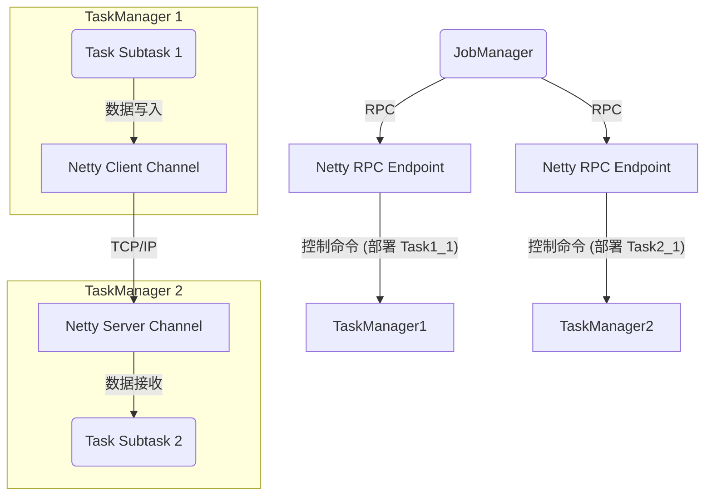
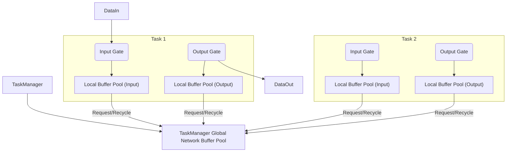
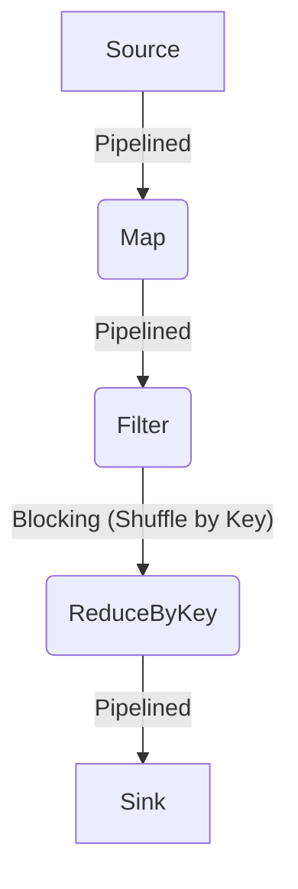

# 第13章：Flink网络与数据传输 (Flink Networking & Data Transfer)

高效的网络通信和数据传输是分布式流处理引擎性能的关键。Flink设计了一套复杂的网络栈来支持低延迟、高吞吐的数据交换。本章将深入探讨Flink网络层的基础、数据序列化机制、核心的网络缓冲管理（Network Buffer）策略，以及Task之间不同的数据传输模式和用于反压控制的信用度机制（Credit-based Flow Control）。

## 13.1 网络栈：Netty基础

Flink的网络通信层主要基于**Netty**构建。Netty是一个高性能、异步事件驱动的网络应用框架，广泛用于开发可维护的高性能协议服务器和客户端。

*   **为什么选择Netty?**
    *   **高性能:** 提供优化的异步I/O模型（NIO），支持零拷贝（Zero-Copy）特性，减少内存复制，提高效率。
    *   **高并发:** 基于事件驱动模型（Reactor模式），能有效处理大量并发连接。
    *   **协议支持:** 易于自定义协议编码和解码，方便Flink实现其内部通信协议。
    *   **成熟稳定:** 在工业界有广泛应用和验证。

*   **Flink中的应用:**
    *   **Task之间的数据传输:** Flink的Task（Subtask）之间的数据交换（例如Shuffle、Forward）通过Netty建立的长连接进行。
    *   **RPC通信:** JobManager、TaskManager、JobMaster之间的控制消息（如任务部署、Checkpoint协调、心跳等）也依赖Netty进行RPC（Remote Procedure Call）通信。
    *   **数据流管道:** Netty的ChannelPipeline模型允许Flink插入自定义的处理器（Handler）来处理数据的编码、解码、加密、压缩以及流量控制等。

**Netty在Flink中的角色示意图 (简略):**



## 13.2 数据序列化与网络缓冲管理 (Network Buffer)

为了在网络间传输数据，对象需要被序列化成字节流。同时，为了高效管理网络传输中的内存使用，Flink设计了精细的网络缓冲管理机制。

### 13.2.1 数据序列化

Flink支持多种序列化方式：

*   **内置类型:** 对于Java/Scala的基本类型、数组以及Flink自带的一些类型（如`Tuple`），Flink有高效的专用序列化器。
*   **Kryo:** 对于没有专用序列化器的泛型类，Flink默认使用Kryo作为序列化框架。Kryo性能高、序列化结果紧凑，但可能存在兼容性问题（需要注册类）。
*   **Avro:** Flink也支持使用Avro进行序列化，可以通过`@AvroSchema`注解或配置指定。
*   **自定义序列化:** 用户可以通过实现`TypeInformation`和`TypeSerializer`来自定义特定类型的序列化逻辑，以达到极致性能或兼容性。

**序列化的重要性:** 高效的序列化机制可以显著减少网络传输的数据量和CPU开销。

### 13.2.2 网络缓冲管理 (Network Buffer)

Flink的网络层核心是**Network Buffer**的管理。数据在Task之间传输时，并不会直接发送单个记录，而是攒积在Network Buffer中，批量发送。

*   **Network Buffer:**
    *   是Flink管理网络内存的基本单位，通常是一个固定大小的内存块（例如默认32KB）。
    *   可以是**堆内内存（Heap Buffer）**或**堆外内存（Off-Heap Buffer / Direct Buffer）**。使用堆外内存可以减少JVM GC压力，并可能利用操作系统的零拷贝特性，但管理更复杂。
    *   Buffer在TaskManager启动时从预先配置的**网络内存池（Network Memory Pool）**中分配。

*   **Buffer Pool:**
    *   每个TaskManager维护一个全局的Network Buffer Pool。
    *   这个Pool的内存是独立于Flink其他内存部分（如State Backend、Task执行内存）进行管理的，其大小通过`taskmanager.memory.network.fraction`和`taskmanager.memory.network.min/max`配置。
    *   TaskManager内部的网络组件（如数据交换通道）需要向这个Pool申请Buffer来发送或接收数据。

*   **Local Buffer Pool:**
    *   每个需要进行网络通信的Task（或更准确地说是其输入/输出Gate）会拥有一个或多个**本地缓冲池（Local Buffer Pool）**。
    *   Local Buffer Pool作为代理，向TaskManager的全局Network Buffer Pool申请所需数量的Buffer。
    *   这种层级结构有助于更精细地控制每个Task的网络内存使用，并实现反压（通过限制Local Buffer Pool能申请到的Buffer数量）。

**Buffer管理层级:**



*   **Buffer生命周期:**
    1.  **申请:** Task的输出端（ResultPartition）需要发送数据时，向其Local Buffer Pool申请空闲Buffer。
    2.  **填充:** 将序列化后的记录写入Buffer。
    3.  **发送:** Buffer写满或满足发送条件（如超时）时，通过Netty发送给下游Task。
    4.  **接收:** 下游Task的输入端（InputChannel）接收到Buffer。
    5.  **处理:** Task从Buffer中读取数据并反序列化进行处理。
    6.  **回收:** 处理完成后，将空闲的Buffer**回收**到其Local Buffer Pool，最终可被全局Pool重用。

## 13.3 Task之间的数据传输模式 (Pipelined, Blocking)

根据算子之间数据依赖关系的不同（特别是是否涉及Shuffle），Flink Task之间的数据传输主要有两种模式：

1.  **流水线模式 (Pipelined):**
    *   **特点:** 上游Task（生产者）处理完一条记录并序列化到Buffer后，不需要等待整个数据集处理完成，就可以将Buffer发送给下游Task（消费者）。下游Task可以立即开始处理接收到的数据。
    *   **适用场景:** 窄依赖（Narrow Dependency）操作，如`map`, `filter`, `flatMap`，以及`forward`, `rebalance`等不需要数据聚合或排序的分区策略。
    *   **优点:** 低延迟，数据可以像水流一样在算子间快速传递。
    *   **实现:** 通常对应`ResultPartitionType.PIPELINED`。

2.  **阻塞模式 (Blocking):**
    *   **特点:** 上游Task（生产者）需要**完整地**生成其所有输出数据，并将这些数据持久化（通常是写入TaskManager管理的磁盘文件或内存缓冲区），然后下游Task（消费者）才能开始拉取（Pull）或接收这些数据。
    *   **适用场景:** 宽依赖（Wide Dependency）操作，特别是需要**排序**或**聚合**所有输入才能进行下一步计算的Shuffle操作，例如`keyBy/groupBy`后的聚合、排序（`sortPartition`）等。
    *   **优点:** 可以处理需要全局信息的操作。
    *   **缺点:** 延迟较高，需要额外的存储资源（内存或磁盘）来缓存中间结果。
    *   **实现:** 通常对应`ResultPartitionType.BLOCKING`。下游Task会向上游请求数据块。

**传输模式与依赖关系:**



*   **混合模式:** 一个Flink作业通常包含Pipelined和Blocking两种模式的混合。Operator Chaining（算子链）内部的数据传输可以看作是极致的Pipelined模式（直接内存方法调用）。
*   **批处理:** Flink的批处理模式（Batch Execution Mode）更多地使用Blocking模式来优化资源使用和执行效率，尤其是在Shuffle阶段。

## 13.4 信用度控制机制 (Credit-based Flow Control)

如第10章所述，Flink使用基于**信用（Credit）**的流控机制来处理Task间的反压。

*   **回顾:** 下游Task向上游Task授予Credit，一个Credit代表下游准备好接收一个Network Buffer。
*   **网络层实现:** 这个机制在网络层（InputChannel / RemoteInputChannel 和 ResultSubpartition / Netty Server/Client Handler）实现。
    *   **接收端 (InputChannel):** 当InputChannel成功处理完一个接收到的Buffer并将其回收给Local Buffer Pool后，如果其对应的Local Buffer Pool有空闲Buffer，它就具备了发放Credit的条件。
    *   **Credit发送:** InputChannel会通过Netty反向通道（或 piggyback在ACK消息中）向上游发送可用的Credit数量。
    *   **发送端 (ResultSubpartition):** 只有在收到下游对应InputChannel授予的Credit后，才会将装满数据的Buffer通过Netty发送出去。如果没有Credit，即使有数据待发送，也会暂停。
*   **与Buffer Pool的关系:** Credit的数量直接关联到接收端Local Buffer Pool中可用Buffer的数量。如果Local Buffer Pool无法从全局Pool申请到新的Buffer（例如网络内存耗尽），或者申请速度跟不上处理速度，那么它能发放的Credit就会减少，从而触发反压。

**Credit机制简化流程 (网络视角):**

```mermaid
sequenceDiagram
    participant UpstreamTask as Upstream Task (ResultSubpartition)
    participant Netty
    participant DownstreamTask as Downstream Task (InputChannel)
    participant LocalPool as Downstream Local Buffer Pool

    DownstreamTask ->> LocalPool: Request Initial Buffers
    LocalPool -->> DownstreamTask: Grant Buffers (N)
    DownstreamTask -->> UpstreamTask: Send Initial Credit (N)

    loop Data Transfer
        UpstreamTask ->> UpstreamTask: Produce Data & Fill Buffer
        opt Has Credit > 0
            UpstreamTask ->> Netty: Send Buffer (Consume Credit: -1)
            Netty ->> DownstreamTask: Receive Buffer
            DownstreamTask ->> DownstreamTask: Process Buffer
            DownstreamTask ->> LocalPool: Recycle Buffer
            LocalPool -->> DownstreamTask: Buffer Available (+1)
            DownstreamTask -->> UpstreamTask: Send Credit (+1)
        else
            Note over UpstreamTask: Wait for Credit...
        end
    end
```

*   **优点:**
    *   **解耦:** 将流控逻辑与数据处理逻辑分离。
    *   **高效:** Credit信息通常可以批量发送或捎带在其他控制消息中，开销较小。
    *   **精确:** 可以相对精确地控制Buffer的使用和数据流动速率。

**总结:** Flink的网络和数据传输层是其高性能流处理能力的重要支撑。通过基于Netty的异步网络通信、高效的序列化、精细的Network Buffer管理、灵活的数据传输模式（Pipelined/Blocking）以及基于Credit的流控机制，Flink能够在分布式环境中实现低延迟、高吞吐、且稳定的数据交换。理解这一层的工作原理对于网络相关的性能调优和问题诊断非常有帮助。 