# 第四部分：Presto/Trino内核深度解析 (Deep Dive into Presto/Trino Kernel)

# 第15章：Presto/Trino架构与设计哲学 (Presto/Trino Architecture & Design Philosophy)

在探索了以批处理见长的Spark和以流处理闻名的Flink之后，我们将目光转向专为**快速交互式分析查询**而设计的引擎——Presto及其分支Trino。与Spark和Flink不同，Presto/Trino采用经典的**MPP（Massively Parallel Processing，大规模并行处理）**架构，并以其独特的**计算存储分离**和**Connector**设计理念，实现了对多种数据源的高效联邦查询。本章将深入解析Presto/Trino的MPP架构、Coordinator和Worker的角色、核心的Connector机制、交互式查询的设计目标，并探讨Presto与Trino的历史渊源与主要差异。

## 15.1 MPP (Massively Parallel Processing) 架构详解 (Coordinator, Worker)

Presto/Trino采用了无共享（Shared-Nothing）的MPP架构。这意味着每个节点（Worker）都拥有自己独立的CPU、内存和（有时是）本地磁盘资源，节点间通过网络进行通信协调。

**核心组件:**

1.  **Coordinator (协调器):**
    *   **角色:** 集群的"大脑"，负责接收客户端（如JDBC/ODBC驱动、CLI）提交的SQL查询请求。
    *   **职责:**
        *   **解析SQL (Parsing):** 将SQL文本解析成抽象语法树（AST）。
        *   **分析查询 (Analyzing):** 对AST进行语义分析，验证表、列的存在性、类型检查等，生成逻辑查询计划。
        *   **查询优化 (Optimizing):** 对逻辑计划应用一系列规则（RBO）和成本模型（CBO）进行优化，生成物理执行计划。
        *   **任务调度 (Scheduling):** 将物理执行计划拆分成多个Stage（阶段），并将Stage进一步分解为一系列并行的Task（任务），然后将这些Task分配给集群中的Worker节点执行。
        *   **状态追踪:** 监控各个Worker上Task的执行状态，收集结果或处理错误。
        *   **结果汇聚:** 从Worker收集最终查询结果，返回给客户端。
    *   **特点:** Coordinator本身不参与实际的数据处理计算，主要负责管理和协调。通常是一个单点（虽然可以配置HA，但相对复杂），其性能和可用性对整个集群至关重要。

2.  **Worker (工作节点):**
    *   **角色:** 集群的"肌肉"，负责执行Coordinator分配的Task。
    *   **职责:**
        *   **执行Task:** 从Coordinator接收Task指令，执行具体的计算操作（如数据扫描、过滤、聚合、Join等）。
        *   **数据交换:** Worker之间通过网络直接交换中间数据（Shuffle），无需经过Coordinator。
        *   **与数据源交互:** 通过相应的Connector与底层数据源（如Hive Metastore、HDFS、S3、MySQL等）进行交互，读取数据。
        *   **状态汇报:** 向Coordinator汇报Task的执行进度和状态。
    *   **特点:** Worker节点可以水平扩展，增加Worker数量可以提高集群的整体计算能力和并发度。每个Worker独立运行，处理分配给它的数据分片（Split）。

**MPP架构示意图 (Mermaid):**

```mermaid
graph TD
    Client[Client] -- SQL Query --> Coordinator((Coordinator));

    subgraph Presto/Trino Cluster
        Coordinator -- "Plan & Schedule Tasks" --> Worker1(Worker 1);
        Coordinator -- "Plan & Schedule Tasks" --> Worker2(Worker 2);
        Coordinator -- "Plan & Schedule Tasks" --> WorkerN(Worker N);

        Worker1 -- "Task Status" --> Coordinator;
        Worker2 -- "Task Status" --> Coordinator;
        WorkerN -- "Task Status" --> Coordinator;

        Worker1 <-- "Fetch Data" --> DataSource1[Data Source A];
        Worker2 <-- "Fetch Data" --> DataSource2[Data Source B];
        WorkerN <-- "Fetch Data" --> DataSource1;

        Worker1 -- "Exchange Data (Shuffle)" --> Worker2;
        Worker2 -- "Exchange Data (Shuffle)" --> WorkerN;
        WorkerN -- "Exchange Data (Shuffle)" --> Worker1;
    end

    Coordinator -- Query Results --> Client;

    style Coordinator fill:#lightblue,stroke:#333,stroke-width:2px
    style Worker1 fill:#lightgrey,stroke:#333,stroke-width:1px
    style Worker2 fill:#lightgrey,stroke:#333,stroke-width:1px
    style WorkerN fill:#lightgrey,stroke:#333,stroke-width:1px
```

**无共享 (Shared-Nothing):** 每个Worker处理自己的数据子集，并通过网络交换必要的中间结果，避免了共享存储带来的瓶颈，易于扩展。

## 15.2 计算存储分离与Connector架构 (SPI)

Presto/Trino最核心的设计之一是**计算与存储分离**，并通过**Connector（连接器）架构**来实现对异构数据源的支持。

*   **计算存储分离:**
    *   Presto/Trino本身**不存储数据**。它是一个纯粹的计算引擎。
    *   数据存储在各种外部系统中，如HDFS、S3、关系型数据库、NoSQL数据库、消息队列等。
    *   这种分离使得Presto/Trino可以灵活地接入现有的大数据生态系统，无需进行数据迁移。
    *   计算资源和存储资源可以独立扩展，根据需求调整。

*   **Connector架构:**
    *   为了与不同的数据存储系统交互，Presto/Trino设计了一套标准的**SPI（Service Provider Interface，服务提供接口）**。
    *   **Connector**是实现了这套SPI的具体插件，负责将外部数据源的表、模式（Schema）和数据适配（Adapt）成Presto/Trino内部可以理解和处理的格式。
    *   **职责:**
        *   **元数据获取 (Metadata):** 提供数据源的库（Schema）、表（Table）、列（Column）及其类型等元数据信息。
        *   **数据分片 (Splits):** 将待查询的表数据划分成若干个**分片（Split）**。每个Split代表了一小部分数据（例如HDFS的一个Block、数据库表的一个分区），可以被一个Worker Task独立处理。
        *   **数据读取 (Data Source):** 提供读取指定Split中实际数据的能力。
    *   **工作流程:** 当Coordinator规划查询时，它会通过Connector获取表的元数据和分片信息。然后将处理特定分片的Task分发给Worker。Worker上的Task再通过相应的Connector API去读取分片数据。
    *   **优点:**
        *   **可扩展性:** 可以轻松添加新的Connector来支持新的数据源。
        *   **联邦查询:** 允许用户在**单一SQL查询**中关联（Join）来自**不同数据源**的数据（例如，将Hive中的用户行为日志与MySQL中的用户信息表进行Join）。这是Presto/Trino的强大功能之一。
        *   **解耦:** 将数据源的复杂性封装在Connector内部，引擎核心保持简洁。

**Connector架构示意图 (Mermaid):**

## 15.3 交互式查询引擎的设计目标

Presto/Trino从设计之初就明确了其**交互式查询（Interactive Query）**的核心定位，这意味着它追求的目标与传统的批处理引擎（如MapReduce/Hive）或流处理引擎（如Flink/Storm）有所不同。

*   **低延迟 (Low Latency):**
    *   首要目标是尽可能快地返回查询结果，通常在**秒级或分钟级**，而不是小时级。
    *   这使得数据分析师和工程师能够进行探索性查询，快速迭代分析思路。
    *   实现手段：内存计算、Pipelined执行模型、优化的网络传输、高效算子实现。

*   **高并发 (High Concurrency):**
    *   能够同时处理大量用户的并发查询请求。
    *   MPP架构天然支持并发，Coordinator负责管理和调度多个查询。
    *   需要精细的资源管理（如Resource Groups）来隔离和控制不同查询的资源消耗。

*   **内存计算为主 (In-Memory Computation):**
    *   尽可能在内存中完成所有计算，避免磁盘I/O成为瓶颈。
    *   中间数据（Shuffle）在Worker间直接通过网络传输，尽量不落盘（除非内存不足触发Spill to Disk，但这通常会影响性能）。
    *   对内存资源要求较高。

*   **支持标准SQL:**
    *   提供符合ANSI SQL标准的查询接口，降低用户学习和使用门槛。
    *   支持丰富的SQL函数和语法。

*   **可扩展性 (Scalability):**
    *   能够通过增加Worker节点来线性扩展计算能力，处理更大数据量和更高并发。

*   **容错性 (Fault Tolerance):**
    *   虽然追求低延迟，但也需要具备一定的容错能力。Presto/Trino的容错相对批处理引擎较弱，通常是**查询级别（Query-Level）**的重试。即单个Task失败可能导致整个查询失败重试，而不是像Spark那样细粒度地恢复Task。
    *   近年来也在不断增强容错机制（例如Trino的Fault-Tolerant Execution模式）。

*   **数据源联邦 (Data Source Federation):**
    *   通过Connector架构，能够透明地查询和关联多种异构数据源。

**设计权衡:** 为了实现低延迟和高并发的交互式查询，Presto/Trino在某些方面做出了权衡，例如：
*   **容错性相对较弱:** 相比于Checkpointing机制完善的流引擎或基于Lineage重计算的批引擎，早期Presto的容错能力有限。
*   **不适合超大规模批处理:** 对于需要处理PB级别数据、运行数小时甚至数天的超大ETL任务，传统的批处理引擎（如Spark）可能更具优势（尤其在资源利用和容错方面）。
*   **内存消耗:** 基于内存计算的设计对集群内存资源要求较高。

## 15.4 Presto与Trino的渊源与差异

*   **起源:** Presto最初由Facebook（现Meta）于2012年开发并于2013年开源，旨在解决其海量数据仓库（基于Hive）的交互式查询性能问题。
*   **分裂:** 2018年底，由于社区治理和发展方向的分歧，Presto的四位初创核心成员离开了Facebook，并于2019年初创建了PrestoSQL项目。为了避免商标混淆，PrestoSQL在2020年底更名为**Trino**。
*   **发展:**
    *   **PrestoDB:** 由Meta（原Facebook）继续维护和发展的分支，得到了Linux基金会的支持（成立了Presto Foundation，成员包括Meta, Uber, Alibaba等）。
    *   **Trino (原PrestoSQL):** 由原始创始团队主导，成立了Trino Software Foundation，社区更为活跃，版本迭代更快，吸引了包括Starburst（由创始团队创立的商业公司）, AWS, Google Cloud, LinkedIn等众多贡献者。
*   **主要差异:**
    *   **名称:** 最直观的差异。
    *   **社区与治理:** PrestoDB由Presto基金会管理，Meta影响力较大。Trino由Trino基金会管理，社区驱动模式更明显。
    *   **发布节奏:** Trino的发布通常更频繁。
    *   **功能演进:** 两者都在独立发展，虽然核心架构相似，但在新功能、Connector支持、性能优化、容错机制等方面开始出现差异。例如，Trino率先推出了更完善的Fault-Tolerant Execution模式。
    *   **商业支持:** Starburst公司主要提供基于Trino的商业发行版和支持。
    *   **兼容性:** 两者在核心SQL语法和主要Connector上仍保持一定的兼容性，但随着各自发展，差异可能会逐渐增大。

**选择建议:**
*   目前来看，**Trino**社区更为活跃，功能迭代更快，生态系统（尤其是在云厂商和商业支持方面）发展更迅速，是许多新项目的首选。
*   **PrestoDB**依然在大公司（如Meta内部）有广泛应用，并且有Linux基金会的支持。
*   在技术选型时，建议关注两者最新的发布说明、社区活跃度、所需Connector的支持情况以及商业支持选项。

**总结:** Presto/Trino凭借其高效的MPP架构、灵活的计算存储分离设计以及强大的Connector机制，在交互式SQL查询领域占据了重要地位。理解其设计哲学、核心组件和架构特点，是有效利用该引擎进行快速数据分析和联邦查询的基础。同时，了解PrestoDB和Trino的历史与差异，有助于根据实际需求做出更合适的选型。 