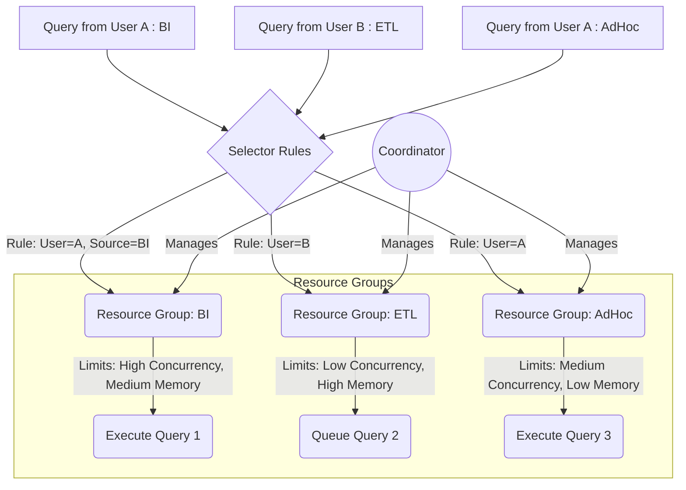

# 第17章：Presto/Trino优化器与调度 (Presto/Trino Optimizer & Scheduling)

查询性能是Presto/Trino的核心竞争力，而这很大程度上依赖于其强大的**查询优化器 (Optimizer)** 和高效的**调度 (Scheduling)** 机制。优化器负责将用户提交的逻辑查询计划转换成高效的物理执行计划，而调度器则负责将计划中的任务合理地分配到集群资源上执行。本章将深入探讨Presto/Trino优化器的关键技术，包括规则优化（RBO）和成本优化（CBO），以及重要的下推优化，并介绍其任务调度和资源管理机制。

## 17.1 规则优化 (Rule-Based Optimization - RBO)

规则优化是Presto/Trino优化器的基础。它应用一系列预定义的、基于启发式规则的转换，来重写查询计划树，使其在逻辑上等价但通常执行效率更高。

**核心思想:** 基于已知的、普遍适用的优化原则来改进计划，不依赖数据的具体统计信息。

**常见的RBO规则示例:**

*   **谓词下推 (Predicate Pushdown):** (最重要规则之一)
    *   **目标:** 尽早过滤数据，减少后续操作处理的数据量。
    *   **实现:** 将`WHERE`子句中的过滤条件尽可能地向下推近数据源（`TableScan`）或Join操作。
    *   **示例:** `SELECT a.name FROM A JOIN B ON A.id = B.id WHERE A.city = 'NY'` -> 将`A.city = 'NY'`下推到扫描表`A`时进行过滤。
    *   **动态过滤:** 某些条件下，可以将一个表的过滤条件下推到Join的另一侧。

*   **列裁剪 / 投影下推 (Column Pruning / Projection Pushdown):**
    *   **目标:** 只读取和处理查询最终需要的列。
    *   **实现:** 从查询计划的根节点（最终输出）向上回溯，确定每个操作实际需要的列，并将此信息向下传递。`TableScan`只读取必需的列。
    *   **示例:** `SELECT name FROM users WHERE age > 30` -> `TableScan`只需要读取`name`和`age`列，而不是所有列。

*   **Limit下推 (Limit Pushdown):**
    *   **目标:** 如果只需要少量结果，尽早应用`LIMIT`操作。
    *   **实现:** 将`LIMIT n`操作向下推过`Project`, `Filter`, `Join`（某些类型），甚至下推到Connector层面（如果Connector支持）。
    *   **示例:** `SELECT * FROM (SELECT * FROM orders ORDER BY ts DESC) LIMIT 10` -> Connector可能只需要读取最新的少量数据。

*   **常量折叠 (Constant Folding):**
    *   **目标:** 预计算常量表达式。
    *   **实现:** 在编译/优化阶段直接计算出常量表达式的值。
    *   **示例:** `WHERE year = 2020 + 3` -> `WHERE year = 2023`。

*   **消除冗余操作:**
    *   例如，消除重复的`DISTINCT`操作，合并连续的`Filter`操作。

*   **Join相关优化:**
    *   **消除外连接 (Outer Join Elimination):** 如果`WHERE`子句中的条件使得外连接（LEFT/RIGHT/FULL JOIN）的行为等价于内连接（INNER JOIN），则将其转换为内连接，通常内连接效率更高。
    *   **Join谓词推导:** 基于Join条件和已有谓词推导出新的谓词并下推。

**RBO的特点:**
*   **优点:** 实现相对简单，优化效果稳定且可预测，不依赖统计信息。
*   **缺点:** 无法处理需要数据分布感知的优化（如Join顺序选择），可能错过一些基于成本的更优计划。

## 17.2 成本优化 (Cost-Based Optimization - CBO) 与统计信息

为了弥补RBO的不足，Presto/Trino引入了成本优化（CBO）。CBO尝试估算不同执行计划的成本（CPU、内存、I/O、网络），并选择总成本最低的那个计划。

**核心思想:** 基于数据的**统计信息 (Statistics)** 来预测执行计划各部分的开销。

**依赖统计信息:** CBO的有效性**强依赖于**准确且最新的统计信息。这些信息通常由Connector提供，可能包括：
*   **表级别:** 总行数、总大小。
*   **分区级别:** 行数、大小。
*   **列级别:**
    *   **NULL值比例 (Null Fraction)**
    *   **不同值数量 (Number of Distinct Values, NDV)**
    *   **最小值 / 最大值 (Min / Max Value)**
    *   **平均数据大小 (Average Data Size)**
    *   **直方图 (Histograms):** 更详细地描述数据分布情况（例如，等宽直方图、等高直方图）。

**获取统计信息:**
*   许多Connector（如Hive Connector）可以从底层系统（如Hive Metastore）读取统计信息。
*   用户也可以使用`ANALYZE <table_name>`命令来手动收集和更新表的统计信息。

**CBO的应用场景:**

*   **Join顺序选择 (Join Reordering):**
    *   对于多表Join（`A JOIN B JOIN C`），不同的Join顺序（`(A JOIN B) JOIN C` vs `A JOIN (B JOIN C)`）可能导致巨大的性能差异。
    *   CBO会估算不同Join顺序产生的中间结果集大小和计算成本，选择最优顺序（通常是先执行选择性高、能大幅减少中间结果的Join）。

*   **Join分布类型选择 (Join Distribution Type Selection):**
    *   **Partitioned Join (Hash Join):** 默认方式。将Join的两侧表都按照Join Key进行Hash分区，发送到不同的Worker节点并行执行Join。适用于大表Join大表。
    *   **Broadcast Join (Replicated Join):** 将Join中的一个小表（Build Side）完整地复制（广播）到所有需要处理大表（Probe Side）分片的Worker节点上。然后每个Worker在本地用完整的Build Side数据与它负责的Probe Side分片进行Join。
        *   **优点:** 避免了大表的Shuffle。
        *   **缺点:** 需要将小表完整加载到内存并广播，对小表大小和网络带宽有要求。
    *   CBO会根据表的大小、网络成本等估算，决定使用Partitioned Join还是Broadcast Join。

*   **聚合策略选择:** 根据数据基数（Cardinality）和分布，选择使用Hash Aggregation还是Sort-based Aggregation。

**CBO的特点:**
*   **优点:** 能够找到RBO无法发现的、更优的执行计划，特别是对于复杂的Join查询。
*   **缺点:**
    *   **依赖统计信息:** 统计信息不准确或过时会导致优化器做出错误的决策，甚至产生性能更差的计划。
    *   **复杂性高:** 成本模型和估算逻辑复杂，优化过程本身也需要时间。
    *   **并非所有优化都启用:** Presto/Trino的CBO仍在不断发展中，并非所有CBO特性都默认启用或完全成熟。

**配置:** 可以通过Session属性或配置参数来启用/禁用CBO及相关特性。

## 17.3 谓词下推 (Predicate Pushdown) 与其他下推优化

**下推 (Pushdown)** 是优化器中一类非常重要的优化手段，其核心思想是将某些操作尽可能地推向数据源头执行。

*   **谓词下推 (Predicate Pushdown):** (RBO的核心，CBO也会利用)
    *   **重要性:** 这是减少数据读取和网络传输最有效的手段之一。
    *   **Connector协作:** 优化器不仅在引擎内部下推谓词，还会尝试将谓词**下推到Connector**。如果Connector能够利用这些谓词在数据源层面进行过滤（例如，通过数据库的WHERE子句、利用分区信息、使用索引），那么就能极大地减少需要扫描和传输到引擎的数据量。
    *   **示例:** 查询Hive分区表`WHERE dt = '2023-04-01'`，Hive Connector可以直接只读取对应分区的数据。

*   **投影下推 / 列裁剪 (Projection Pushdown / Column Pruning):**
    *   同样会尝试下推到Connector，让Connector只返回需要的列。

*   **Limit下推 (Limit Pushdown):**
    *   如果Connector支持，可以将`LIMIT n`下推，数据源可能只需要返回少量数据。

*   **聚合下推 (Aggregation Pushdown):**
    *   对于某些聚合函数（如`COUNT`, `MIN`, `MAX`, `SUM`）和查询模式，可以将部分聚合计算（Partial Aggregation）下推到Connector执行。
    *   Connector先在数据源端进行局部聚合，返回部分聚合结果，然后在Presto/Trino引擎中完成最终聚合。
    *   可以显著减少网络传输量。
    *   **示例:** `SELECT COUNT(*) FROM table` -> Connector可以直接返回行数，Presto/Trino只需做最终汇总。

*   **Join下推 (Join Pushdown):** (较复杂，并非所有Connector都支持)
    *   在特定条件下，可以将整个Join操作下推到支持Join的数据源（如关系型数据库）中执行。

**下推优化的关键:** 取决于**Connector的能力**。不同的Connector对各种下推优化的支持程度不同。优化器会查询Connector的能力，决定哪些操作可以下推。

## 17.4 任务调度与资源管理 (Query Queuing, Resource Groups)

Coordinator不仅负责规划查询，还负责将生成的Task调度到Worker上，并管理集群资源。

*   **任务调度 (Task Scheduling):**
    *   **目标:** 将物理计划中的Task有效地分配给可用的Worker，平衡负载，并考虑数据本地性。
    *   **调度器类型:** Presto/Trino支持不同的调度策略，例如：
        *   **均匀分配:** 尽量将Task均匀分配到所有可用Worker。
        *   **数据本地性优先:** 优先将处理某个数据分片（Split）的Task调度到持有该分片数据的Worker上（或网络距离最近的Worker）。这对于减少网络I/O至关重要，特别是对于HDFS等数据源。
        *   **节点调度器 (Node Scheduler):** 负责选择合适的Worker节点来运行Task。
    *   **Split调度:** Coordinator将Split分配给Task。一个Task可能按顺序处理多个Split。

*   **资源管理:** 为了在多租户、高并发环境下稳定运行，Presto/Trino提供了资源管理机制。
    *   **查询队列 (Query Queuing):** 当集群资源不足以立即执行新提交的查询时，可以将查询放入队列中等待。可以配置队列大小和排队策略。
    *   **资源组 (Resource Groups):** (核心机制)
        *   **目的:** 对不同用户、不同类型的查询进行资源隔离和限制，防止个别查询耗尽集群资源，保证服务质量（QoS）。
        *   **配置:** 通过配置文件定义资源组的层级结构和规则。
        *   **限制参数:** 可以为每个资源组配置：
            *   `softMemoryLimit`: 查询在该组中可以使用的总分布式内存软限制。
            *   `hardConcurrencyLimit`: 该组内可同时运行的最大查询数量。
            *   `maxQueued`: 该组允许排队的最大查询数量。
            *   `cpuQuotaPeriod`, `softCpuLimit`: CPU时间配额（Trino）。
        *   **选择器 (Selectors):** 定义规则（如根据用户、来源IP、客户端标签等）将进入的查询分配到相应的资源组。
        *   **工作方式:** Coordinator根据选择器规则将查询分配到资源组，并根据该组的限制来决定查询是立即执行、排队还是拒绝。

**资源管理示意图 (Mermaid):**

**总结:** Presto/Trino的优化器结合了健壮的规则优化（RBO）和日益增强的成本优化（CBO），并通过各种下推优化（尤其是谓词下推）来提升查询效率。高效的任务调度（考虑数据本地性）和精细的资源管理（资源组）机制，共同保证了Presto/Trino在复杂并发环境下提供低延迟、高可用的交互式查询服务。理解优化规则和资源配置对于充分发挥Presto/Trino性能至关重要。 