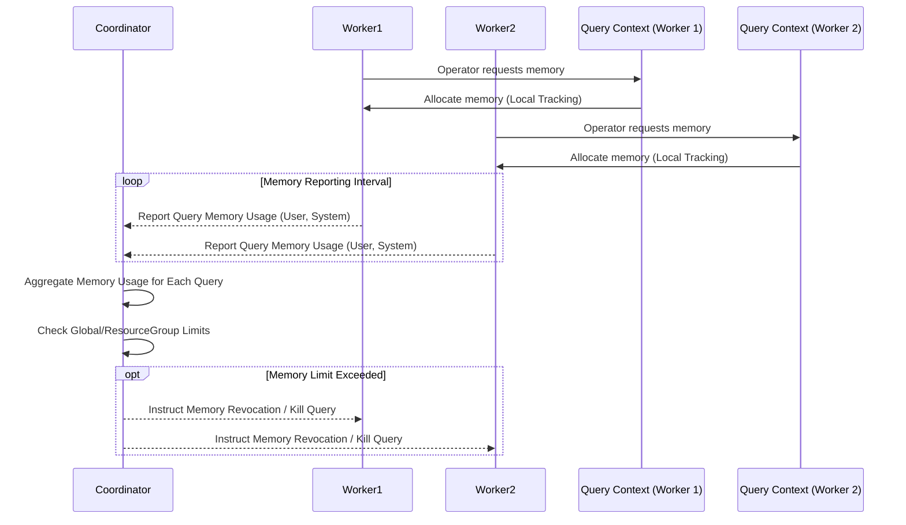

# 第18章：Presto/Trino内存管理与数据交换 (Presto/Trino Memory Management & Data Exchange)

作为以内存计算为核心的交互式查询引擎，Presto/Trino对内存的高效管理至关重要。内存不仅用于存储计算过程中的中间数据（如哈希表、排序缓冲），也用于网络传输的缓冲区。本章将深入探讨Presto/Trino的内存管理模型，包括不同类型的内存池、分布式内存追踪机制、处理内存压力的磁盘溢写（Spill to Disk）策略，以及Worker间数据交换的核心组件——Exchange Operator。

## 18.1 查询内存池管理 (User Memory, System Memory, Revocable Memory)

Presto/Trino将集群内存（特别是在Worker节点上）划分为不同的**内存池 (Memory Pool)**，并对查询执行过程中的内存使用进行精细控制。

**主要内存池类型:**

1.  **用户内存 (User Memory):**
    *   **定义:** 主要用于存储用户查询处理过程中产生的数据结构，这些数据结构的大小通常与输入数据量或基数（Cardinality）相关。
    *   **用途:**
        *   **哈希表 (Hash Tables):** 用于Hash Join的构建端（Build Side）和Hash Aggregation。
        *   **排序缓冲 (Sort Buffers):** 用于`ORDER BY`操作或Sort-Merge Join。
        *   **窗口函数缓冲 (Window Function Buffers):** 存储窗口函数计算所需的中间状态。
        *   **其他算子状态:** 某些复杂算子可能需要的临时数据结构。
    *   **特点:** 通常是查询内存消耗的主要部分，其峰值难以精确预测，容易导致内存不足（OOM）。Presto/Trino会追踪每个查询的用户内存使用量。

2.  **系统内存 (System Memory):**
    *   **定义:** 主要用于系统内部管理和操作所需的内存，通常不直接存储用户数据，其大小相对可预测。
    *   **用途:**
        *   **网络缓冲区 (Network Buffers):** 用于在Worker之间或与Coordinator/Client之间传输数据的缓冲区（通过`ExchangeOperator`）。
        *   **读取器缓冲 (Reader Buffers):** Connector从数据源读取数据时使用的缓冲区。
        *   **写入器缓冲 (Writer Buffers):** Connector向外部系统写入数据时使用的缓冲区。
        *   **内部数据结构:** 查询计划对象、任务状态管理等所需的内存。
    *   **特点:** 虽然单个分配可能不大，但高并发查询下网络缓冲等系统内存的总消耗量也可能很高。

3.  **可回收内存 (Revocable Memory):**
    *   **定义:** 这是一种特殊的**用户内存**。当系统内存不足时，Presto/Trino可以**强制回收**这部分内存，以满足更高优先级的内存请求（通常是系统内存，特别是网络缓冲）。
    *   **机制:** 如果一个算子（如Hash Join Build Side, Hash Aggregation）申请的内存被标记为可回收，当内存压力大时，查询执行器可以通知该算子释放部分或全部已分配的可回收内存。
    *   **影响:** 内存被回收后，算子通常需要**将之前在内存中的数据溢写到磁盘 (Spill to Disk)**，后续处理时再从磁盘读回。这会显著增加查询延迟。
    *   **目的:** 提高系统的鲁棒性，避免因为用户内存的突发性高消耗导致整个节点或查询因无法分配系统内存（如网络缓冲）而失败。

**内存池层级与分配:**
*   **节点级别:** 每个Worker节点有一个总内存上限 (`query.max-memory-per-node`)。
*   **查询级别:** 每个查询在整个集群中有一个总内存上限 (`query.max-total-memory`)，在单个节点上也有一个内存上限 (`query.max-memory-per-node`通常也作为查询在单节点上的隐式上限）。
*   **资源组级别:** 资源组配置 (`softMemoryLimit`) 可以进一步限制一组查询在整个集群中可以使用的总内存。
*   **池分配:** 内存首先从节点总内存分配给查询，然后查询内部再细分为用户内存和系统内存。用户内存中可能包含可回收内存。

**内存管理流程:**
1.  算子需要内存时，向查询的内存上下文（Query Memory Context）申请。
2.  内存上下文向节点内存管理器申请内存。
3.  节点内存管理器检查是否有足够可用内存（考虑总限制和池限制）。
4.  如果内存充足，则分配；如果不足，则：
    *   尝试回收**可回收内存**（通知相关算子Spill）。
    *   如果回收后仍不足，可能导致查询失败（OOM）。

## 18.2 分布式内存追踪

由于查询是分布式执行的，准确追踪一个查询在所有Worker节点上的总内存使用量非常重要，这对于执行资源限制（`query.max-total-memory`, `softMemoryLimit`）至关重要。

*   **机制:**
    *   **Worker本地追踪:** 每个Worker节点上的Task会实时追踪自己使用的用户内存和系统内存。
    *   **定期汇报:** Worker节点会定期（或在内存分配/释放时）将其上运行的各个查询的内存使用情况汇报给**Coordinator**。
    *   **Coordinator聚合:** Coordinator收集来自所有Worker的内存使用信息，聚合并维护每个正在运行查询的全局内存视图。
*   **作用:**
    *   **执行内存限制:** Coordinator根据聚合的内存使用量，判断查询是否超出了全局内存限制或资源组内存限制。
    *   **内存回收决策:** Coordinator在检测到内存压力或查询超限时，可以协调触发内存回收（Revocable Memory）或终止查询。
    *   **监控与调试:** 为用户和管理员提供查询内存使用情况的监控数据。

**内存追踪示意图 (Mermaid):**

## 18.3 Spill to Disk 机制 (可选)

当Worker节点内存不足，特别是**用户内存**（尤其是可回收内存标记的部分）需求过高时，为了保证查询能够继续执行（而不是直接OOM失败），Presto/Trino提供了**溢写到磁盘 (Spill to Disk)** 的机制。

*   **触发条件:**
    *   内存管理器无法满足内存申请请求。
    *   收到Coordinator的内存回收指令（针对Revocable Memory）。
*   **哪些操作可以Spill:** 并非所有操作都能溢写磁盘。通常支持溢写的操作包括：
    *   **Hash Join (Build Side):** 将构建的哈希表分区后写入磁盘。
    *   **Hash Aggregation:** 将部分聚合状态或原始数据写入磁盘。
    *   **OrderBy:** 将排序过程中的中间数据块写入磁盘。
    *   **Window Functions:** 将窗口计算的中间状态写入磁盘。
*   **工作方式 (以Hash Join为例):**
    1.  **内存不足:** 构建哈希表时内存不足，或收到回收指令。
    2.  **选择分区:** 选择哈希表中的一个或多个分区（Partition）。
    3.  **写入磁盘:** 将选定分区的数据序列化后写入Worker本地磁盘的临时目录中。
    4.  **释放内存:** 释放这些分区占用的内存。
    5.  **后续处理:** 当处理Probe Side数据时，如果发现其对应的Build Side分区已被溢写到磁盘，则Probe Side的这部分数据也需要溢写。
    6.  **磁盘读取:** 在后续的Join或聚合阶段，需要将溢写到磁盘的分区重新读回内存进行处理（可能需要分批读回）。
*   **配置:** Spill机制默认通常是**禁用**的，需要通过配置参数显式启用 (`experimental.spill-enabled=true`)，并配置溢写路径 (`experimental.spill-path`) 和相关限制（如最大溢写空间）。
*   **性能影响:** Spill to Disk会**显著降低查询性能**，因为它引入了大量的磁盘I/O操作和序列化/反序列化开销。它主要是作为一种**提高查询成功率**的保障机制，而不是常规操作。
*   **使用建议:** 优先通过增加集群内存、优化查询或调整内存配置来避免Spill。只有在内存确实无法满足需求且能接受性能下降时才考虑启用。

## 18.4 Worker间数据交换机制 (Exchange Operator)

在MPP架构中，Worker节点之间的数据交换（Shuffle）是分布式查询执行的关键环节。Presto/Trino通过**Exchange**机制来实现。

*   **Exchange Operator:** 物理执行计划中负责处理数据分发和收集的算子。
*   **核心组件:**
    *   **发送端 (Source Task):**
        *   `ExchangeOperator` / `PartitioningExchangeOperator` / `LocalExchangeSourceOperator` 等：位于产生数据的Task流水线的末端。
        *   **序列化:** 将内存中的Page对象序列化成字节流。
        *   **缓冲:** 将序列化的数据写入网络缓冲区 (Network Buffer)。
        *   **分区 (Partitioning, if needed):** 如果是`PartitioningExchange`（例如用于Hash Join或聚合前的数据重分布），会根据目标分区键计算哈希值，决定数据应该发送给哪个下游Task实例。
        *   **发送:** 通过Netty将装满数据的Buffer发送给目标Worker节点上的对应Task。
    *   **接收端 (Destination Task):**
        *   `ExchangeClient`: 负责从网络读取数据。
        *   **反序列化:** 将接收到的字节流反序列化成内存中的Page对象。
        *   **提供数据:** 将Page对象提供给该Task流水线的第一个算子。
*   **数据流控:** Exchange过程受到基于Credit的流控机制（见13.4）的调节，以实现反压。
*   **实现细节:**
    *   **HTTP/1.1基础:** 底层的数据交换通常基于HTTP/1.1协议（或其他自定义协议）的长连接实现。
    *   **序列化格式:** 可以配置不同的序列化格式（如默认的自定义格式、protocol buffers等）。
    *   **压缩:** 可以配置启用数据压缩（如LZ4, ZSTD）来减少网络传输量，但会增加CPU开销。

**Exchange类型:**
*   **Gather:** 将多个上游Task的数据汇聚到一个下游Task（例如，最终聚合）。
*   **Repartition:** 根据分区键将上游Task的数据重新分区后发送给下游不同的Task实例（例如，Hash Join前的Shuffle）。
*   **Replicate (Broadcast):** 将上游Task的数据复制给所有下游Task实例（例如，Broadcast Join）。

**总结:** Presto/Trino的内存管理通过精细的内存池划分（User, System, Revocable）、分布式追踪和可选的Spill to Disk机制，努力在高性能内存计算和系统稳定性之间取得平衡。高效的Exchange Operator则负责在Worker节点间实现低延迟、高吞吐的数据交换，支撑着MPP架构的并行处理能力。理解内存分配、限制以及数据交换过程是进行性能调优和解决内存相关问题的基础。 