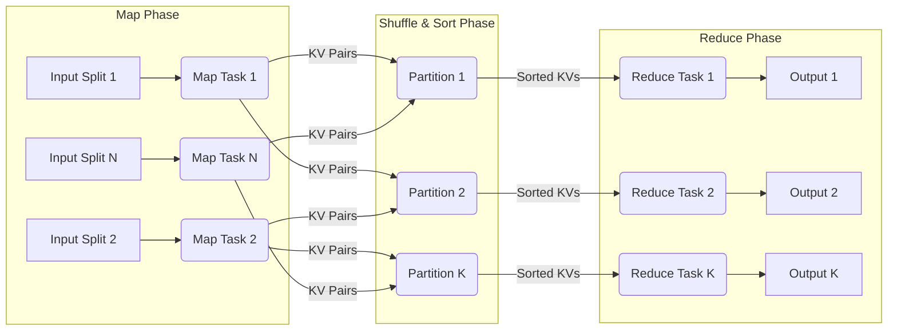
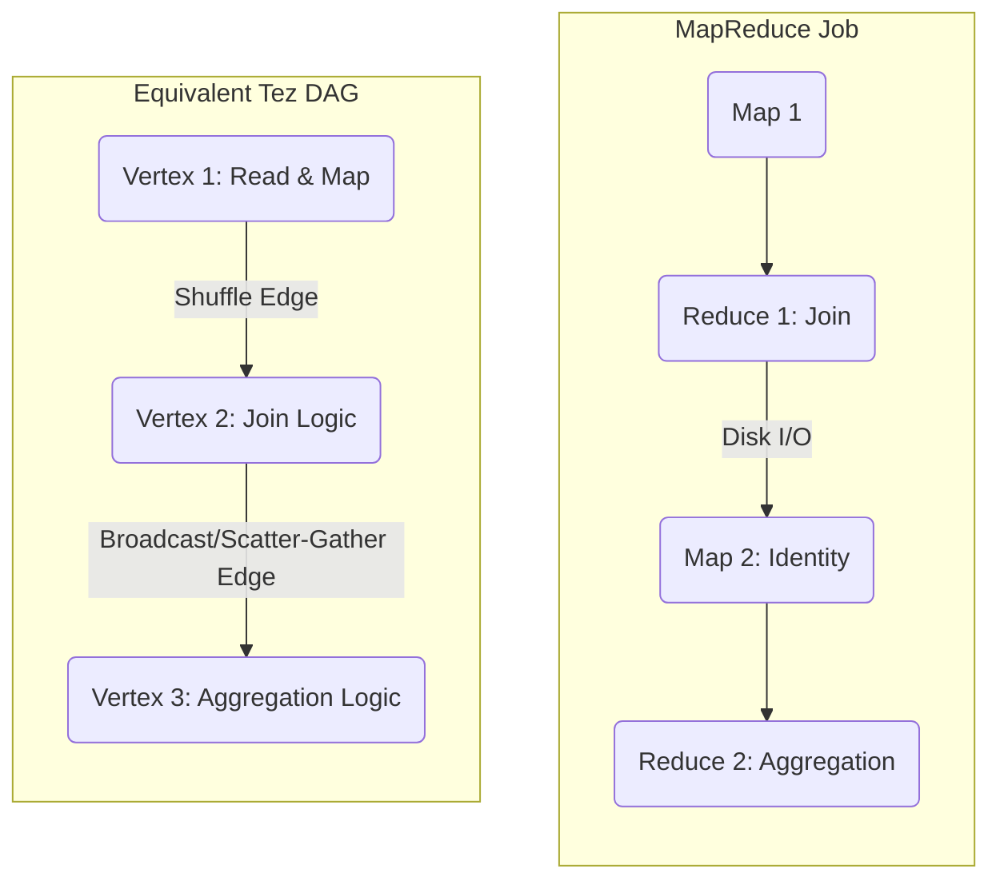
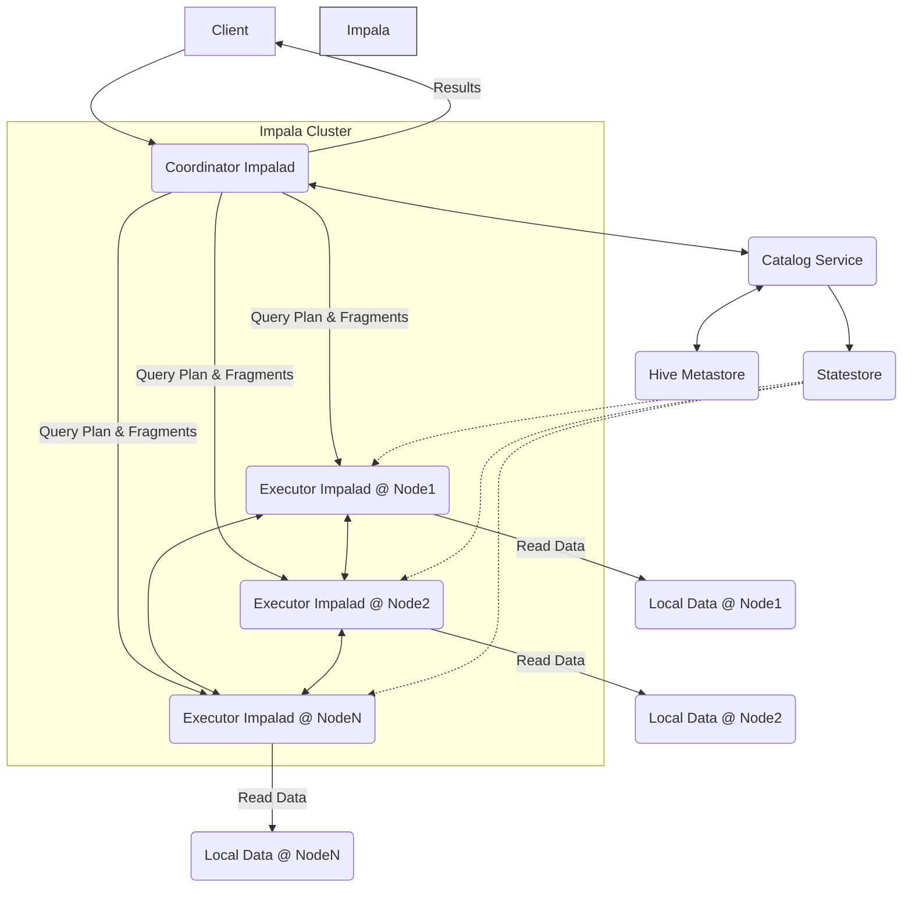
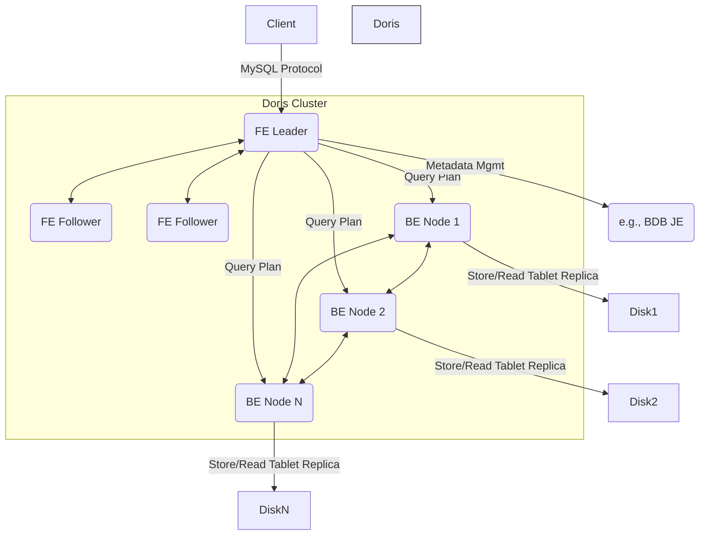

# 第六部分：其他主流引擎与未来趋势 (Other Engines & Future Trends)

在深入剖析并比较了Spark、Flink和Presto/Trino之后，本部分将拓宽视野。首先，我们将简要分析其他一些具有代表性的大数据引擎，了解它们的设计特点和历史地位。然后，我们将展望大数据引擎的未来发展趋势，探讨云原生、湖仓一体、流批融合、智能化以及硬件加速等方向带来的机遇与挑战。

# 第27章：其他代表性引擎简析 (Brief Analysis of Other Representative Engines)

大数据领域技术栈繁多，除了本书重点讨论的三大引擎外，还有许多其他值得关注的引擎，它们或是在特定领域表现突出，或是对后来的系统产生了深远影响。

## 27.1 MapReduce & Tez: 历史地位与设计影响

### 27.1.1 MapReduce: 大数据处理的奠基石

*   **起源:** Google 在 2004 年发布的论文《MapReduce: Simplified Data Processing on Large Clusters》奠定了大规模数据处理的编程范式和系统架构基础。
*   **核心模型:** 极其简洁但强大的两阶段计算模型：Map -> Reduce。
    *   **Map阶段:** 输入数据被分割成多个独立的数据块 (Input Split)，每个数据块由一个Map Task处理。Mapper通常执行数据清洗、转换、过滤等操作，并输出键值对 (Key-Value Pair)。
    *   **Shuffle阶段:** 这是连接Map和Reduce的关键步骤，也是主要的性能瓶颈之一。此阶段包括：
        *   **Partitioning:** Map输出的键值对根据Key被分配到不同的Reducer。通常使用哈希分区。
        *   **Sorting:** 在每个Reducer节点上，接收到的数据会按Key排序，以便相同Key的数据能被同一个Reduce Task处理。
        *   **Combining (可选):** 在Map端或Reduce端对中间结果进行局部聚合，减少网络传输量。
        *   **Grouping:** 将排序后的数据按Key分组，传递给Reduce函数。
    *   **Reduce阶段:** 每个Reduce Task处理一个或多个分区的数据。Reducer对具有相同Key的数据进行聚合、汇总或其他计算，并输出最终结果。


**图 27-1: MapReduce计算模型示意图**

*   **实现 (Hadoop MapReduce):** Apache Hadoop的核心计算框架，与HDFS紧密集成。
    *   **JobTracker (MRv1) / ResourceManager + ApplicationMaster (YARN/MRv2):** 负责作业的调度、监控和资源管理。
    *   **TaskTracker (MRv1) / NodeManager (YARN/MRv2):** 负责在工作节点上执行Map和Reduce任务。
*   **核心特点:**
    *   **高容错性:** 任务失败可重试。中间结果写入磁盘，即使节点故障，也可以从上一个成功阶段恢复，保证作业最终完成。
    *   **水平扩展性:** 通过增加节点即可线性扩展处理能力。
    *   **简单性:** 编程模型简单，易于上手。
*   **局限性:**
    *   **编程模型僵化:** 强制性的Map -> Reduce结构，对于复杂逻辑（如多步Join、迭代算法）需要串联多个MR作业，开发复杂且效率低下。每次作业都需要读写磁盘，开销巨大。
    *   **性能瓶颈:** 大量使用磁盘I/O进行Shuffle和中间结果的持久化，导致延迟高，不适合交互式查询和实时处理。启动和调度开销大。
*   **历史地位:** MapReduce是大数据处理领域的开创者，它使得在廉价硬件集群上处理PB级数据成为可能，催生了庞大的Hadoop生态系统。其分布式计算思想，如数据分片、任务并行、Shuffle、容错机制等，被后来的几乎所有大数据引擎借鉴和发展。

### 27.1.2 Tez: 迈向通用的DAG执行引擎

*   **动机:** 为了解决Hadoop MapReduce模型的僵化问题和性能瓶颈，特别是在Hive和Pig等高级数据处理工具中，多阶段MR作业链的效率低下问题尤为突出。
*   **核心模型:** 将计算抽象为**通用的有向无环图 (DAG - Directed Acyclic Graph)**。
    *   **Vertex (顶点):** 代表计算逻辑单元，可以是Map、Reduce，也可以是其他自定义的算子。
    *   **Edge (边):** 代表顶点之间的数据依赖和传输关系。边的类型定义了数据如何从上游Vertex传递到下游Vertex（例如，一对一传输、广播、基于分区的分发等）。
    *   **取代僵化的Map-Reduce:** 允许开发者或上层工具（如Hive）构建任意复杂的DAG来表达计算逻辑，将原本需要多个MR作业才能完成的任务合并到一个Tez DAG中执行。


**图 27-2: MapReduce多作业链与Tez DAG对比示意**

*   **核心特点:**
    *   **灵活的执行模型:** DAG允许更精细地控制执行流程，例如可以将多个逻辑阶段的计算合并在同一个物理任务中执行，避免不必要的磁盘I/O和任务启动开销。支持不同的数据传输模式（不仅仅是Shuffle）。
    *   **资源重用:** Tez允许同一个YARN容器 (Container) 内运行DAG中的多个Task (Vertex的实例)。MapReduce中，一个Container通常只运行一个Map或Reduce Task。资源重用减少了容器启动和销毁的开销，提高了资源利用率和执行效率。
    *   **动态图修改:** 支持在运行时根据数据统计信息等动态调整执行计划。
    *   **性能提升:** 作为Hive、Pig等工具的执行引擎时，通过将多阶段查询编译成单一的Tez DAG，显著减少了作业延迟，提高了吞吐量。
*   **影响:** Tez标志着Hadoop生态系统从固定的MapReduce模型向更通用、更高效的DAG执行模型的演进。它的设计思想与Spark的RDD和DAGScheduler有异曲同工之妙，共同推动了大数据处理引擎进入DAG时代。虽然Tez本身可能不像Spark那样广为人知，但它对Hive性能的提升起到了至关重要的作用。

## 27.2 Impala: 类Presto的MPP引擎对比

*   **起源:** 由 Cloudera 开发，目标是提供对存储在Hadoop集群（主要是HDFS、HBase、Kudu）中的数据进行低延迟、高并发的交互式SQL查询能力，作为对MapReduce批处理查询的补充和替代。
*   **核心架构:** **MPP (Massively Parallel Processing)** 架构，与Presto/Trino类似，但有其独特之处。
    *   **Impalad (Impala Daemon):** 这是Impala的核心组件，运行在集群的每个数据节点上。它扮演两个角色：
        *   **Coordinator Role:** 接收客户端的SQL查询请求，进行解析、分析、生成查询计划（分解为多个并行的Fragment），并将这些Fragment分发给其他Executor角色的Impalad执行。
        *   **Executor Role:** 负责执行接收到的查询Fragment。它直接从本地存储（如HDFS DataNode或Kudu Tablet Server，如果部署在一起）读取数据，执行计算，并将中间结果传输给下游的Fragment或返回给Coordinator。
    *   **Statestore (Catalog Service):** 负责广播元数据变化（如表结构变更、新增分区等）到所有Impalad节点。这使得每个Impalad都能拥有近乎实时的全局元数据视图，避免了查询规划时频繁访问外部元数据存储（如Hive Metastore），提高了元数据一致性和查询规划效率。
    *   **Catalog Service:** (从Statestore分离出来) 负责管理元数据缓存，直接与Hive Metastore交互，并将元数据更新通过Statestore广播出去。


**图 27-3: Impala架构示意图**

*   **与Presto/Trino对比:**

| 特性           | Impala                                       | Presto/Trino                                      |
| -------------- | -------------------------------------------- | ------------------------------------------------- |
| **核心语言**   | C++                                          | Java                                              |
| **进程模型**   | 单个`impalad`进程承担Coordinator和Executor角色 | Coordinator和Worker是独立的进程 (通常)            |
| **数据本地性** | **强依赖**。`impalad`通常与DataNode部署在一起，优先读取本地数据 (Short-circuit Read) | 也利用本地性，但架构更倾向于纯粹的计算存储分离 |
| **运行时代码生成** | **LLVM**                                   | **JVM Bytecode Generation** (JIT编译)              |
| **内存管理**   | 手动管理，更精细控制，避免JVM GC             | 依赖JVM GC，但有自己的内存池管理                  |
| **元数据同步** | 通过Statestore广播，近实时                    | Coordinator缓存，Worker按需拉取或查询时获取        |
| **生态集成**   | 与Cloudera生态 (HDFS, HBase, Kudu) 更紧密     | Connector生态更广泛，强调**数据联邦** (Data Federation) |
| **容错**       | 早期较弱，依赖查询重试，新版本有所增强        | 查询失败通常需要重试，Worker失败由Coordinator处理 |

*   **核心设计细节:**
    *   **LLVM代码生成:** Impala在运行时将SQL查询计划的部分关键路径（如表达式计算、数据扫描）编译成本地机器码。相比于Presto/Trino依赖JVM的即时编译(JIT)，Impala声称使用LLVM可以生成更优化的代码，更好地利用CPU指令集（如SIMD），并避免Java对象开销和GC暂停。
    *   **数据本地性优化:** Impala的设计哲学强调将计算尽可能推向数据所在的节点。通过将`impalad`与HDFS DataNode部署在同一台机器上，它可以绕过网络直接读取本地磁盘文件（Short-circuit Read），显著减少I/O延迟。这是Impala相比于早期Presto版本在特定场景下性能优势的一个重要来源。
    *   **I/O管理:** 拥有自己的I/O管理器，可以对磁盘读进行调度和优先级排序，支持异步I/O。
*   **适用场景:** 对存储在HDFS、HBase、Kudu（尤其是Kudu）中的数据进行低延迟、高并发的SQL分析和BI查询。在Cloudera平台中作为核心的交互式查询组件。

## 27.3 ClickHouse: OLAP分析引擎的设计特点

*   **起源:** 由俄罗斯最大的搜索引擎公司Yandex为其内部的Web流量分析系统（Yandex.Metrica）开发，并于2016年开源。目标是实现极高性能的在线分析处理(OLAP)。
*   **核心特点与设计细节:**
    *   **列式存储 (Columnar Storage):**
        *   **原理:** 同一列的数据连续存储在一起，而不是像行式存储那样将一行的数据连续存储。
        *   **优势:**
            1.  **I/O优化:** OLAP查询通常只涉及表中的少数几列。列存只需读取所需的列，大大减少了磁盘I/O。
            2.  **高压缩比:** 同一列的数据类型相同，具有相似的特征（如取值范围、重复度），更容易被压缩。ClickHouse支持多种高效压缩算法 (如LZ4, ZSTD, Delta, DoubleDelta, Gorilla)。高压缩比不仅节省存储空间，还能减少I/O量。
            3.  **向量化执行:** 列式存储的数据天然适合向量化处理。
        *   **数据组织:** 在MergeTree系列引擎中，数据按主键排序存储，并被划分为多个"数据部分" (Data Part)。每个Part内部按列存储，并包含稀疏主键索引 (Sparse Primary Index) 和可能的其他数据标记 (Data Marking) 以加速数据查找。

    ```
    // 行式存储 (Row-Oriented)
    Row1: (Timestamp1, UserID1, URL1)
    Row2: (Timestamp2, UserID2, URL2)
    ...

    // 列式存储 (Column-Oriented)
    Column Timestamp: (Timestamp1, Timestamp2, ...)
    Column UserID:    (UserID1, UserID2, ...)
    Column URL:       (URL1, URL2, ...)
    ```
    **图 27-4: 行式存储 vs 列式存储示意**

    *   **向量化执行引擎 (Vectorized Query Execution):**
        *   **原理:** 查询执行过程中，数据以**列向量 (Vector/Chunk/Block)** 的形式在算子之间传递和处理，而不是一次处理一行 (Tuple-at-a-time)。一个向量包含一批（例如几千行）同一列的数据。
        *   **优势:**
            1.  **CPU缓存友好:** 向量化操作通常涉及对连续内存块的循环处理，提高了CPU L1/L2/L3缓存的命中率。
            2.  **SIMD指令优化:** 可以利用现代CPU的单指令多数据流 (SIMD) 指令（如SSE, AVX）并行处理向量中的多个数据元素，极大提升计算吞吐量。
            3.  **减少函数调用开销:** 处理一批数据的函数调用次数远少于逐行处理，降低了间接调用和虚函数调用的开销。
        *   **实现:** ClickHouse的内部算子（如过滤、聚合、排序等）都基于向量化接口设计。

    ```
    // 传统逐行处理 (Tuple-at-a-time)
    for each row:
        process(row.columnA)
        process(row.columnB)

    // 向量化处理 (Vectorized)
    process_vector(columnA_vector) // Uses SIMD, better cache locality
    process_vector(columnB_vector) // Uses SIMD, better cache locality
    ```
    **图 27-5: 逐行处理 vs 向量化处理概念对比**

    *   **MPP架构 (可选):** 支持分布式部署，通过分片(Sharding)和副本(Replication)实现水平扩展和高可用。
        *   **分片:** 数据可以分布到多个节点上，查询时各节点并行处理自己的分片数据。通过`Distributed`表引擎实现对分片的查询路由。
        *   **副本:** 每个分片可以有多个副本，保证数据冗余和读取可用性。依赖ZooKeeper进行副本协调和元数据管理。
    *   **MergeTree存储引擎家族:** 这是ClickHouse最核心和常用的存储引擎系列。
        *   `MergeTree`: 基础引擎，支持主键索引、数据分区、数据副本和采样。数据写入后会生成小的有序数据片段，后台线程会定期将这些片段合并(Merge)成更大的有序片段。
        *   `ReplacingMergeTree`: 合并时会根据排序键删除重复的数据行，保留指定版本（或最新版本）的行，适用于需要去重的场景。
        *   `SummingMergeTree`: 合并时会将排序键相同、非度量列值也相同的行进行聚合，对指定的度量列进行求和。
        *   其他变种：`AggregatingMergeTree`, `CollapsingMergeTree` 等，满足更复杂的去重和预聚合需求。
    *   **SQL支持:** 支持标准SQL的大部分语法，并扩展了丰富的聚合函数、数组函数、高阶函数以及针对OLAP场景的特殊函数（如`uniqCombined`, `groupArray`等）。
    *   **实时写入与查询:** 支持高吞吐量的`INSERT`操作，数据写入后很快（通常秒级）即可被查询到（最终一致性）。
*   **与Spark/Flink/Presto对比:**
    *   **核心差异:** ClickHouse是一个**数据库管理系统 (DBMS)**，它自带存储管理（基于MergeTree等引擎）。而Spark/Flink/Presto主要是**计算引擎**，依赖外部存储（HDFS, S3, RDBMS等）。
    *   **优化侧重点:** ClickHouse为OLAP分析查询做了极致优化（列存、向量化、MergeTree），在单表聚合、宽表扫描、过滤等场景下通常性能最佳。Spark/Flink更侧重通用的数据处理和复杂的ETL、流处理、机器学习任务。Presto/Trino侧重跨多数据源的联邦查询和交互式分析，虽然也是MPP+向量化，但在纯粹的OLAP性能上通常逊于ClickHouse。
    *   **Join能力:** ClickHouse的Join实现（特别是早期版本）相对受限，通常推荐使用宽表或者针对小表的字典编码方式。虽然新版本Join能力持续增强，但复杂的多表Join通常不是其最强项。
*   **适用场景:**
    *   实时在线分析处理 (Real-time OLAP)
    *   数据仓库与数据集市
    *   用户行为分析、广告点击分析
    *   日志和监控数据分析
    *   时间序列数据分析

## 27.4 (可选) 新兴引擎简介 (如Doris, StarRocks等)

近年来，一批以Apache Doris和StarRocks为代表的国产开源MPP分析型数据库崭露头角。它们吸收了MPP、列式存储、向量化执行、CBO等业界先进技术，并在易用性、性能、实时性、湖仓一体等方面进行了创新和优化，成为大数据技术栈中强有力的竞争者。

### 27.4.1 Apache Doris (原Baidu Palo)

*   **定位:** 高性能、实时的MPP分析型数据库。
*   **架构:**
    *   **Frontend (FE):** 负责接收SQL请求、查询解析、规划优化、元数据管理、集群调度。FE节点高可用（基于类Paxos协议或BDB JE HA）。
    *   **Backend (BE):** 负责数据存储（列式存储）、查询执行（向量化引擎）。数据在BE上以Tablet的形式组织，支持副本存储。
    *   **Broker (可选):** 用于访问外部存储系统（如HDFS, S3）进行数据导入导出。新版本逐步推荐使用更直接的导入方式。


**图 27-6: Apache Doris架构示意图**

*   **核心特点:**
    *   **MySQL协议兼容:** 前端接口兼容MySQL协议，用户可以使用熟悉的MySQL客户端和BI工具连接Doris，降低了使用门槛。
    *   **简洁的架构:** 两层架构（FE, BE），不依赖外部系统（如Hadoop组件），部署运维相对简单。
    *   **多种数据模型:** 支持Aggregate、Unique、Duplicate Key模型，满足不同场景下的数据更新和查询需求。
    *   **丰富的导入方式:** 支持从Kafka、本地文件、HDFS/S3等多种数据源进行流式或批量导入 (Stream Load, Broker Load, Routine Load等)。
    *   **向量化执行引擎:** BE层采用向量化执行引擎提升计算性能。
    *   **查询优化器:** 包含基于规则(RBO)和基于成本(CBO)的优化器。
    *   **物化视图:** 支持异步更新的物化视图，用于加速常用查询。
*   **适用场景:** 报表分析、Ad-hoc查询、实时数据看板、用户行为分析、日志分析等需要较好实时性和易用性的OLAP场景。

### 27.4.2 StarRocks

*   **定位:** 新一代极速全场景MPP数据库。旨在提供极速统一的分析体验。
*   **起源:** 基于Apache Doris早期版本分叉发展而来，由原Doris核心团队成员创立的公司主导开发。StarRocks对内核进行了大量的重构和深度优化。
*   **架构:** 与Doris类似，也是FE + BE的架构。但在内核实现、优化策略、功能扩展上与Doris有显著差异。

*   **核心特点与优化 (相比于Doris):**
    *   **全面向量化引擎:** StarRocks声称其向量化引擎覆盖了所有算子，并且进行了更深层次的优化（例如更优的SIMD指令使用、低级优化）。
    *   **更强大的CBO:** 引入了更先进的基于成本的优化器（CBO），支持更复杂的查询优化，如Common Table Expression (CTE) 复用、更优的Join Reorder、Runtime Filter等。
    *   **Pipeline执行引擎:** 引入Pipeline并行框架，将查询执行过程分解为一系列可并行的Pipeline Driver，提高了CPU核心的利用率和并发执行能力，减少了调度开销。
    *   **智能物化视图:** 支持实时、异步、手动多种刷新模式的物化视图，且能自动进行查询改写，透明地使用物化视图加速查询。
    *   **数据湖分析 (Lakehouse):** 重点发展了对外部数据湖（Hive, Iceberg, Hudi, Delta Lake）的联邦查询能力，可以直接高效查询存储在数据湖上的数据，无需导入。
    *   **存储引擎优化:** 对列式存储格式、索引、压缩进行了优化，提升存储效率和扫描性能。
    *   **实时与批量统一:** 支持高效的主键模型（Primary Key Model）进行实时和批量更新/删除操作。
*   **适用场景:** 对性能要求极高的OLAP分析、实时数仓、高并发数据服务、统一的数据湖分析（Lakehouse）、替代其他MPP数据库或加速数据湖查询。

*   **Doris与StarRocks的共同趋势:**
    *   都在积极拥抱**湖仓一体 (Lakehouse)** 架构，增强对外表和数据湖格式的查询能力。
    *   持续优化**实时性能**，包括低延迟导入和查询。
    *   不断完善**优化器**能力，提升对复杂查询的处理效率。
    *   提升**易用性**和**云原生**特性。

**总结:**
大数据处理领域呈现出百花齐放的态势。MapReduce作为先驱，奠定了分布式处理的基础，而Tez则推动了向更灵活的DAG模型的演进。Impala专注于在Hadoop生态内提供低延迟的交互式SQL查询，其C++实现和LLVM代码生成是其特色。ClickHouse则凭借其极致的列式存储和向量化执行引擎，在OLAP领域树立了性能标杆。以Apache Doris和StarRocks为代表的新兴MPP数据库，在吸收前人经验的基础上，通过持续的内核优化和功能创新（如全面向量化、Pipeline执行、智能物化视图、湖仓融合），提供了高性能、易用、且功能全面的现代化分析解决方案。理解这些不同引擎的设计哲学、核心技术和适用场景，对于构建高效、可靠的大数据平台至关重要。 