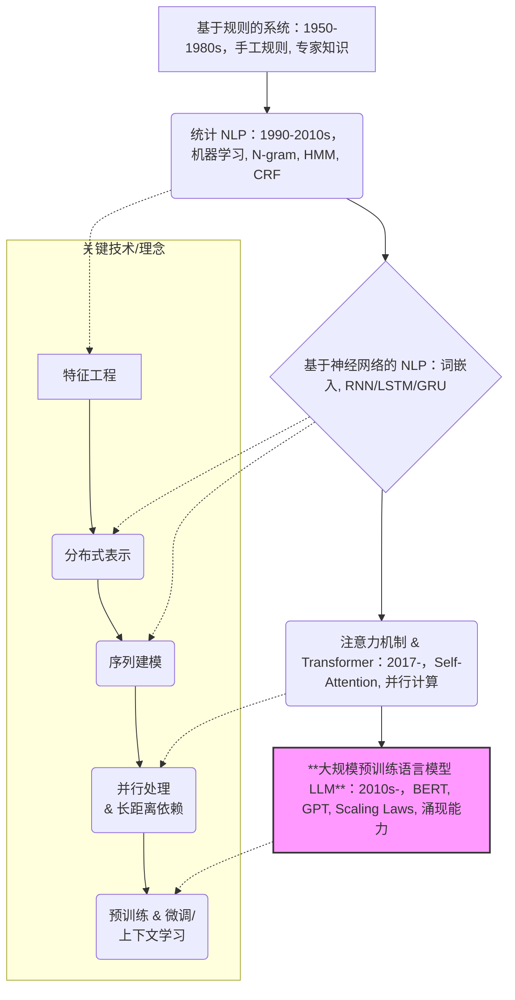
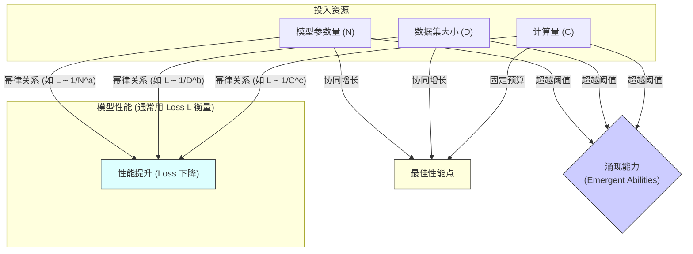

# 第1章：初识大语言模型：核心概念、发展脉络与规模法则 (Decoding LLMs: Core Concepts, Evolution, and the Power of Scale)

欢迎来到大规模语言模型 (LLM) 的世界！本章将作为您探索 LLM 领域的起点，为您梳理核心概念，回顾技术发展脉络，解析 LLM 的能力与应用，并带您认识塑造这一领域的关键法则与生态。

## 1.1 从 NLP 基础到 LLM 革命：一段简明的技术演进史

自然语言处理 (Natural Language Processing, NLP) 作为人工智能的一个重要分支，其目标是让机器能够理解、解释和生成人类语言。它的发展历程漫长而曲折，大致可以分为以下几个阶段：

1.  **基于规则的系统 (Rule-based Systems, 1950s-1980s)：** 早期的 NLP 系统严重依赖于由语言学家手工编写的大量语法和词汇规则。例如，通过定义主谓宾结构、词性规则等来分析句子。这种方法的优点是具有一定的可解释性，但缺点是规则覆盖有限、泛化能力差、难以处理语言的歧义性和复杂性，且构建成本极高。代表性应用如早期的机器翻译系统 (如 Georgetown-IBM 实验) 和一些专家系统。

2.  **统计 NLP (Statistical NLP, 1990s-2010s)：** 随着计算能力的提升和大规模文本语料库 (Corpus) 的出现，统计方法逐渐成为主流。研究者们不再依赖人工规则，而是利用机器学习算法从数据中学习语言模式。
    *   **核心思想：** 将语言视为一个概率问题。例如，判断一个词序列出现的概率，或者预测下一个词是什么。
    *   **关键技术：** 隐马尔可夫模型 (Hidden Markov Models, HMM) 用于词性标注和语音识别；N-gram 模型用于语言建模；条件随机场 (Conditional Random Fields, CRF) 用于序列标注任务；支持向量机 (Support Vector Machines, SVM) 和逻辑回归用于文本分类。
    *   **优点：** 相比规则系统，泛化能力显著提高，能够更好地处理真实世界的复杂语言现象。
    *   **局限：** 特征工程依赖严重，需要人工设计有效的特征来捕捉语言信息；难以捕捉长距离依赖关系；数据稀疏问题依然存在。

3.  **基于神经网络的 NLP (Neural NLP, 2010s - 至今)：** 深度学习的兴起彻底改变了 NLP 的面貌。神经网络，特别是循环神经网络 (RNN) 和后来的 Transformer，能够自动从原始文本中学习有效的特征表示，极大地提升了 NLP 任务的性能。
    *   **词嵌入 (Word Embeddings)：** Word2Vec, GloVe, FastText 等技术将词语表示为低维、稠密的向量，捕捉词语之间的语义关系，解决了传统独热编码 (One-hot Encoding) 的高维稀疏问题。
    *   **循环神经网络 (RNN) 及其变种 (LSTM, GRU)：** 通过引入循环结构，RNN 能够处理序列数据，捕捉上下文信息。长短时记忆网络 (LSTM) 和门控循环单元 (GRU) 通过引入门控机制，有效缓解了 RNN 的梯度消失/爆炸问题，能够更好地捕捉长距离依赖。它们在机器翻译、文本生成等任务上取得了显著成功。
    *   **注意力机制 (Attention Mechanism) 与 Transformer：** 注意力机制允许模型在处理序列时，动态地关注输入序列的不同部分，极大地提升了模型处理长序列和捕捉关键信息的能力。2017 年，Google 提出的 Transformer 模型完全摒弃了 RNN 的循环结构，仅依赖自注意力机制 (Self-Attention) 来并行处理序列，不仅效果更好，而且训练效率更高，为后续大规模预训练模型的出现奠定了基础。

4.  **大规模预训练语言模型 (LLM) 时代 (Late 2010s - 至今)：** 以 Transformer 架构为基础，研究者们开始在海量的无标注文本数据上进行预训练 (Pre-training)，让模型学习通用的语言知识，然后再通过微调 (Fine-tuning) 将模型适配到具体的下游任务。
    *   **代表模型：** BERT (Google), GPT 系列 (OpenAI), T5 (Google), Llama 系列 (Meta) 等。
    *   **核心理念：** "预训练 + 微调"范式，以及后来的"预训练 + 提示 (Prompting) / 上下文学习 (In-Context Learning, ICL)"范式。
    *   **关键特征：** 模型规模急剧增大 (参数量从数亿到数万亿)，展现出惊人的零样本 (Zero-shot) 和少样本 (Few-shot) 学习能力，以及在特定规模下涌现 (Emergence) 出的复杂推理、代码生成等高级能力。
    *   **影响：** LLM 不再仅仅是解决特定 NLP 任务的工具，而是逐渐成为一种通用的、具备广泛能力的"基础模型 (Foundation Model)"，引领了当前 AI 领域的研究和应用浪潮。

下图简要展示了 NLP 技术的演进路径：



LLM 的革命性在于，它通过**大规模数据**、**大规模模型**和**大规模算力**的结合，实现了从"为每个任务训练一个模型"到"一个模型适配多个任务"甚至"一个模型直接解决新任务"的转变。

## 1.2 群星闪耀时：关键 LLM 模型及其贡献 (BERT, GPT, T5, Llama 等)

LLM 的发展并非一蹴而就，而是由一系列里程碑式的模型推动的。了解这些关键模型及其核心贡献，有助于我们理解 LLM 技术的演进方向和不同架构的特点。

| 模型系列              | 提出机构       | 关键时间点 | 核心架构            | 预训练目标/特点                                                        | 主要贡献/影响                                                                |
| :---------------- | :--------- | :---- | :-------------- | :-------------------------------------------------------------- | :--------------------------------------------------------------------- |
| **ELMo**          | Allen AI   | 2018  | BiLSTM          | 双向语言模型 (BiLM)                                                   | 引入了深度上下文相关的词表示，开启了预训练新范式                                               |
| **GPT (1)**       | OpenAI     | 2018  | Decoder-Only    | 标准语言模型 (单向预测下一个词) + 无监督预训练 + 有监督微调                              | 验证了 Transformer Decoder 进行大规模预训练的可行性，展示了生成任务潜力                         |
| **BERT**          | Google     | 2018  | Encoder-Only    | 掩码语言模型 (Masked LM, MLM) + 下一句预测 (Next Sentence Prediction, NSP) | 提出 MLM，实现了真正意义上的**双向**上下文理解，大幅刷新多项 NLP 基准测试记录，成为预训练模型的标杆               |
| **GPT-2**         | OpenAI     | 2019  | Decoder-Only    | 标准语言模型，更大模型 (1.5B)，更多数据                                         | 展示了惊人的零样本生成能力和文本连贯性，引发了关于 AI 安全和潜在滥用的讨论                                |
| **XLNet**         | CMU/Google | 2019  | Encoder-Decoder | 排列语言模型 (Permutation LM, PLM)                                    | 结合了自回归 (AR) 和自编码 (AE) 模型的优点，试图克服 BERT 的 [MASK] 标记引入的预训练-微调不一致问题        |
| **RoBERTa**       | Facebook   | 2019  | Encoder-Only    | 优化 BERT：动态 MLM，移除 NSP，更大 Batch Size，更多数据                        | 通过改进预训练策略，证明 BERT 架构仍有巨大潜力，性能超越 XLNet                                  |
| **T5**            | Google     | 2019  | Encoder-Decoder | 统一的 "Text-to-Text" 框架，Span Corruption 预训练任务                     | 提出将所有 NLP 任务统一转换为文本生成任务的范式，简化了模型应用，具有良好的通用性                            |
| **GPT-3**         | OpenAI     | 2020  | Decoder-Only    | 标准语言模型，极大模型 (175B)，海量数据，**上下文学习 (In-Context Learning, ICL)**     | 首次系统性展示了 LLM 的**涌现能力**和强大的 ICL 能力，无需微调即可在许多任务上表现出色，引发 LLM 研究热潮         |
| **PaLM**          | Google     | 2022  | Decoder-Only    | 标准语言模型，更大模型 (540B)，引入 Pathways 架构 (模型并行新思路)                     | 进一步探索规模极限，展示了在推理、代码生成等方面的强大能力，尤其在思维链 (Chain-of-Thought, CoT) 提示下表现突出   |
| **LLaMA (1 & 2)** | Meta       | 2023  | Decoder-Only    | 标准语言模型，重点优化训练效率和性能，**开源** (模型权重)                                | 提供了高质量的**开源**基础模型，极大推动了 LLM 研究和应用的普及，催生了庞大的开源社区和生态系统                   |
| **GPT-4**         | OpenAI     | 2023  | (未公开，推测为 MoE)   | (未公开，多模态能力)                                                     | 代表了当时最先进的 LLM 能力，尤其在复杂推理、专业知识和多模态理解方面取得突破，但技术细节保密                      |
| **Claude (系列)**   | Anthropic  | 2023- | Decoder-Only    | (Constitutional AI) 强调安全性和对齐                                    | 探索 RLHF 之外的对齐方法 (RLAIF)，注重构建有用、诚实、无害的 AI                               |
| **Gemini**        | Google     | 2023  | (未公开，多模态)       | 原生多模态设计                                                         | 旨在从一开始就构建能够处理多种模态 (文本、图像、音频、视频、代码) 的模型，性能强大                            |
| **Mixtral 8x7B**  | Mistral AI | 2023  | MoE (Decoder)   | 标准语言模型 + **稀疏专家混合 (MoE)** 架构，**开源**                             | 成功将 MoE 应用于开源模型，以相对较少的活跃参数 (约 13B) 实现了接近 GPT-3.5 甚至更优的性能，展示了 MoE 的效率优势 |

**关键趋势和观察：**

*   **架构演进：** 从早期的 RNN/LSTM 到 Transformer 一统江湖。Transformer 内部又分为 Encoder-Only (如 BERT, RoBERTa，擅长理解)、Decoder-Only (如 GPT 系列, LLaMA, PaLM，擅长生成) 和 Encoder-Decoder (如 T5, BART，兼具两者特点，常用于序列到序列任务) 三大范式。近年来，Decoder-Only 架构凭借其在生成任务和 ICL 上的优势，以及训练和推理相对统一的特点，逐渐成为主流。同时，MoE 架构作为提升模型容量和效率的新方向，也备受关注。
*   **规模驱动：** 模型参数量和训练数据量持续指数级增长，是提升 LLM能力的关键驱动力 (详见 1.5 节 Scaling Laws)。
*   **能力演进：** 从基本的语言理解和生成，到零/少样本学习、上下文学习，再到复杂的推理、代码生成、数学运算、甚至多模态能力，LLM 的能力边界不断被拓宽。
*   **开源趋势：** 以 LLaMA 为代表的高质量开源模型的出现，极大地降低了研究和应用门槛，促进了社区的繁荣和技术的快速迭代。
*   **对齐与安全：** 随着模型能力的增强，如何确保模型行为符合人类意图、价值观并避免潜在风险 (即对齐问题)，成为越来越重要的研究方向 (如 RLHF, Constitutional AI)。

理解这些模型的特点和演进，有助于我们选择合适的模型架构和预训练策略来满足特定需求。

## 1.3 LLM 能做什么？核心能力剖析与真实应用场景

LLM 的强大之处在于其**通用性**和**涌现能力**。它们并非针对单一任务设计，而是具备了一系列基础能力，可以通过不同的方式 (微调、提示工程) 应用于广泛的场景。

**核心能力剖析：**

1.  **语言理解 (Language Understanding)：**
    *   **语义理解：** 把握词语、句子、段落乃至整篇文章的核心含义，理解上下文关系。
    *   **语法分析：** 识别句子结构、词性、依存关系等。
    *   **意图识别：** 理解用户输入背后的目的或需求。
    *   **情感分析：** 判断文本中蕴含的情感色彩 (正面、负面、中性)。
    *   **实体识别：** 抽取出文本中的关键信息，如人名、地名、组织机构名等。

2.  **语言生成 (Language Generation)：**
    *   **文本续写：** 根据给定的上文，生成连贯、相关的后续文本。
    *   **文本摘要：** 将长文本压缩成简短的摘要，保留核心信息。
    *   **机器翻译：** 将文本从一种语言翻译成另一种语言。
    *   **创意写作：** 创作诗歌、故事、剧本、歌词等。
    *   **代码生成：** 根据自然语言描述生成代码片段或完整程序。
    *   **对话系统：** 进行开放域或特定域的流畅对话。

3.  **知识问答 (Knowledge Q&A)：**
    *   **事实性问答：** 回答关于世界知识的具体问题 (例如，"法国的首都是哪里？")。
    *   **常识推理：** 基于常识进行简单的推理判断 (例如，"如果下雨，地面会湿吗？")。
    *   **信息检索与整合：** 从内部知识或外部文档中查找、整合信息来回答问题。

4.  **逻辑推理 (Logical Reasoning) (涌现能力)：**
    *   **数学运算：** 执行算术运算，甚至解决一些代数和逻辑问题。
    *   **演绎推理：** 从一般性原则推导出具体结论。
    *   **归纳推理：** 从具体实例中总结出一般性规律 (能力相对较弱)。
    *   **思维链 (Chain-of-Thought, CoT)：** 通过显式地生成中间推理步骤来解决复杂问题。

5.  **上下文学习 (In-Context Learning, ICL) (涌现能力)：**
    *   **零样本学习 (Zero-shot Learning)：** 在没有任何示例的情况下，直接根据指令理解并执行新任务。
    *   **少样本学习 (Few-shot Learning)：** 通过在提示 (Prompt) 中提供少量示例 (Examples/Demonstrations)，让模型快速学习并执行新任务，无需更新模型参数。

**真实应用场景：**

LLM 的通用能力使其能够赋能众多行业和领域：

*   **内容创作与营销：** 自动生成博客文章、广告文案、社交媒体帖子、邮件营销内容；润色和改写现有文本；提供创意灵感。
*   **客户服务：** 构建智能客服机器人，提供 7x24 小时在线答疑、问题排查、订单处理等服务；自动生成服务报告和摘要。
*   **软件开发：** 代码生成、代码补全、代码解释、Bug 检测与修复、自动化测试用例生成、自然语言接口到 API 的转换。
*   **教育：** 个性化辅导、智能答疑、作文评分、教学材料生成、语言学习伙伴。
*   **医疗健康：** 辅助诊断 (分析病历、医学影像报告)、医学文献检索与摘要、药物研发信息挖掘、患者智能问答。
*   **金融：** 市场分析报告生成、金融新闻摘要、风险评估、智能投顾、反欺诈文本分析。
*   **法律：** 合同审查与起草、法律文献检索、案例分析摘要、法律咨询初步应答。
*   **科学研究：** 论文写作助手、科研文献摘要与翻译、数据分析代码生成、复杂模拟结果解释。
*   **搜索引擎与信息检索：** 改进搜索结果排序、提供更直接的答案、生成搜索结果摘要。
*   **游戏娱乐：** 生成游戏剧情、对话、角色背景；创建更智能、更具交互性的 NPC。

**需要注意的局限性：**

尽管 LLM 能力强大，但并非万能，也存在一些固有局限：

*   **幻觉 (Hallucination)：** 可能生成看似合理但实际上是虚假或捏造的信息。
*   **事实性错误：** 知识更新可能滞后，或对某些事实记忆不清，导致回答错误。
*   **偏见与歧视：** 可能从训练数据中习得并放大社会偏见。
*   **缺乏真正的理解和常识：** 主要依赖模式匹配，而非深层理解和因果推理。
*   **推理能力有限：** 对于复杂的多步逻辑推理、数学难题等仍有困难。
*   **可解释性差：** 难以准确解释模型做出特定预测或生成特定内容的原因。
*   **安全风险：** 可能被用于生成有害内容 (如虚假信息、恶意代码、仇恨言论)。

认识到这些局限性，对于负责任地应用 LLM至关重要。

## 1.4 掌握 LLM 黑话：预训练、微调、ICL、涌现、指令遵循详解

进入 LLM 领域，您会遇到一些特定的术语。理解这些"黑话"是深入学习的基础。

*   **预训练 (Pre-training)：** 这是 LLM 获取通用语言知识和能力的核心阶段。在这个阶段，模型在**海量**、**无标注**的文本数据 (如网页、书籍、代码) 上进行训练，学习语言的统计规律、语法结构、语义关系以及世界知识。
    *   **目标：** 不是为了解决特定任务，而是构建一个强大的基础模型。
    *   **常见任务：**
        *   **语言建模 (Language Modeling, LM)：** 预测序列中的下一个词 (Next Token Prediction)，常用于 Decoder-Only 模型 (如 GPT)。
        *   **掩码语言建模 (Masked Language Modeling, MLM)：** 随机遮盖 (Mask) 输入文本中的一部分词，让模型预测被遮盖的词，常用于 Encoder-Only 模型 (如 BERT)。
        *   **其他变种：** 如 T5 的 Span Corruption (遮盖连续片段)、ELECTRA 的 Replaced Token Detection 等。
    *   **特点：** 计算量极大，需要强大的算力集群和数周甚至数月的训练时间。

*   **微调 (Fine-tuning)：** 在预训练获得通用能力后，为了让模型更好地适应**特定下游任务** (如情感分析、文本摘要、特定领域的问答)，通常需要进行微调。
    *   **过程：** 使用**少量**、**有标注**的、与目标任务相关的数据，在预训练好的模型基础上继续训练，更新模型的**全部或部分参数**。
    *   **目标：** 将模型的通用能力"特化"到具体应用场景。
    *   **全量微调 (Full Fine-tuning)：** 更新模型的所有参数。效果通常最好，但计算和存储成本较高，且容易导致灾难性遗忘 (忘记预训练知识)。
    *   **参数高效微调 (Parameter-Efficient Fine-tuning, PEFT)：** 只更新模型的一小部分参数 (如 Adapter, LoRA) 或引入少量额外参数，在保持接近全量微调效果的同时，大幅降低计算和存储成本 (详见第七章)。

*   **上下文学习 (In-Context Learning, ICL)：** 这是大型语言模型 (特别是 GPT-3 之后) 展现出的一种惊人能力。模型可以在**不更新任何参数**的情况下，仅通过在**输入提示 (Prompt)** 中提供任务描述和少量示例 (Demonstrations)，就能理解并执行新的、从未见过的任务。
    *   **机制：** 模型利用其强大的模式匹配和联想能力，从 Prompt 提供的上下文信息中"领悟"任务要求，并在当前推理过程中"模拟"出解决任务的行为。其内部机制仍在研究中，但被认为与预训练过程中学习到的模式有关。
    *   **形式：**
        *   **零样本 (Zero-shot)：** 只提供任务描述，不提供示例。`例如："将下面的英文翻译成中文：Hello world"`
        *   **单样本 (One-shot)：** 提供任务描述和一个示例。`例如："英文：sea otter 中文：海獭\n英文：Hello world 中文："`
        *   **少样本 (Few-shot)：** 提供任务描述和多个示例。`例如："英文：sea otter 中文：海獭\n英文：plush girafe 中文：毛绒长颈鹿\n英文：Hello world 中文："`
    *   **优势：** 无需为每个新任务准备标注数据和进行微调，极大提高了模型的易用性和适应性。
    *   **挑战：** 效果对 Prompt 的设计非常敏感；对于复杂任务，效果可能不如微调。

*   **涌现 (Emergence)：** 指的是当模型规模 (参数量、数据量、计算量) 达到一定阈值后，模型**突然表现出**一些在小规模模型上**不存在或不明显**的、**意想不到**的复杂能力。这些能力似乎不是通过显式设计或训练目标直接赋予的，而是随着规模增长"自发"产生的。
    *   **典型涌现能力：**
        *   少样本上下文学习 (Few-shot ICL)
        *   算术运算
        *   思维链推理 (Chain-of-Thought)
        *   指令遵循 (Instruction Following，见下文)
        *   代码生成
        *   世界知识理解
    *   **特点：**
        *   **非线性：** 能力的提升并非随规模平滑增长，而是在某个规模点出现"相变"。
        *   **不可预测性：** 很难预先知道哪些能力会在多大模型规模下涌现。
    *   **意义：** 解释了为什么追求更大规模的模型是 LLM 研究的重要方向之一；同时也带来了模型行为难以预测的挑战。

    ```mermaid
    graph TD
        subgraph "模型规模 (参数量/数据/算力)"
            direction LR
            S1[小规模] --> S2(中等规模) --> S3(大规模) --> S4[超大规模];
        end

        subgraph "模型能力"
            direction TB
            B1[基础语言建模] --> B2(特定任务能力<br>通过微调) --> E1{涌现能力<br>ICL, CoT, 指令遵循等} --> E2(更强的复杂能力);
        end

        S1 --> B1;
        S2 --> B2;
        S3 -- 阈值 --> E1;
        S4 --> E2;

        style E1 fill:#ccf,stroke:#333,stroke-width:1px
        style E2 fill:#ccf,stroke:#333,stroke-width:1px
    ```
    *图：模型规模与能力涌现示意图*

*   **指令遵循 (Instruction Following)：** 指 LLM 理解并准确执行以**自然语言**形式给出的**指令 (Instruction)** 的能力。这与传统的、需要特定格式输入或微调来适应任务的方式不同。
    *   **例如：** 你可以直接告诉模型："写一首关于春天的五言绝句"、"总结一下这段文字的主要观点"、"将下面的 Python 代码转换为 Java"、"扮演一个知识渊博的海盗与我对话"。
    *   **实现方式：** 通常通过**指令微调 (Instruction Fine-tuning)** 实现。即收集大量包含 (指令, 输出) 对的数据集，并在预训练模型的基础上进行微调，让模型学会理解指令并生成符合要求的输出。
    *   **意义：** 极大地提升了 LLM 的可用性。用户不再需要学习复杂的 Prompt 技巧或为每个任务微调模型，可以直接用自然语言与模型交互，使其更像一个通用的"助手"。ChatGPT 的成功很大程度上归功于其强大的指令遵循能力 (通过 RLHF 进一步增强)。

理解这些核心术语，将为您后续深入学习 LLM 的训练、优化和应用打下坚实的基础。

## 1.5 Scaling Laws 解密：模型/数据/算力如何共同塑造智能

LLM 领域一个最核心的发现是**规模法则 (Scaling Laws)**。简单来说，Scaling Laws 描述了**模型性能**与其**规模** (主要指模型参数量 N、训练数据集大小 D 和训练所用的计算量 C) 之间的**可预测的幂律关系 (Power Law)**。

**核心观点 (由 OpenAI, DeepMind 等机构的研究总结)：**

1.  **性能可预测性：** 对于语言模型而言，其在测试集上的损失 (Loss，通常是交叉熵，越低越好) 会随着模型参数量 (N)、数据集大小 (D) 或计算量 (C) 的增加而**平滑地、可预测地下降**，并且这种下降趋势可以用**幂律**来很好地拟合。
    $$ L(N, D, C) \propto \frac{1}{N^a}, \quad L(N, D, C) \propto \frac{1}{D^b}, \quad L(N, D, C) \propto \frac{1}{C^c}$$ 
    其中 \( L \) 是损失，\( N, D, C \) 分别代表参数量、数据集大小和计算量，\( a, b, c \) 是正常数，表示性能提升对各因素的敏感度。

2.  **计算量是关键瓶颈：** 在给定的计算预算 (C) 下，为了达到最优性能，模型大小 (N) 和数据量 (D) 应该**按比例增加**。过度投资于模型大小而数据不足，或者数据量巨大但模型太小，都无法充分利用计算资源达到最佳效果。Kaplan et al. (OpenAI, 2020) 的研究表明，计算量 C 对性能的影响最为关键，并且 N 和 D 应该大致按照 \( C^{0.73} \) 和 \( C^{0.27} \) 的比例增长 (这个比例后续有修正和讨论)。

3.  **"更大更好" (在一定范围内)：** Scaling Laws 表明，只要持续增加模型大小、数据量和计算量，模型的性能就会持续提升，并且这种提升是可预测的。这极大地推动了业界追求更大模型的浪潮，因为更大的投入通常意味着更好的性能回报。

4.  **涌现能力与规模的关系：** 虽然 Scaling Laws 主要描述的是损失的平滑下降，但模型的某些特定能力 (如上文提到的涌现能力) 似乎只有在模型规模超过某个临界点后才会显著出现。这表明规模的增加不仅带来量变，也可能引发质变。

**图示 Scaling Laws：**



**Scaling Laws 的意义与影响：**

*   **指导模型设计与训练：** 为如何在有限的计算预算下，合理分配资源给模型大小和数据量提供了理论指导。
*   **预测未来模型能力：** 允许研究者在实际训练前，对更大模型的潜在性能进行估算。
*   **推动硬件发展：** 对更大规模计算的需求，刺激了 GPU、TPU 等 AI 芯片和高速互联技术的发展。
*   **引发军备竞赛：** 导致科技巨头投入巨资进行超大规模模型的研发。

**局限与反思：**

*   **成本高昂：** 遵循 Scaling Laws 训练顶尖模型需要极高的成本，限制了参与者范围。
*   **数据瓶颈：** 高质量的训练数据并非无限，数据获取、清洗和管理的难度随规模增加。
*   **"Chinchilla 法则" 的修正：** DeepMind 的 Chinchilla (2022) 研究对 Kaplan (2020) 的结论进行了修正，认为在给定计算预算下，**数据集大小 (D)** 的重要性被低估了。对于最优性能，模型大小 (N) 和数据量 (D) 应该**大致等比例增长** ( \( N \approx D \) )。这意味着用相对更小的模型配合更多的数据进行更长时间的训练，可能比一味增大模型参数更有效。
*   **效率追求：** Scaling Laws 的研究也促进了对更高效训练方法、模型架构 (如 MoE) 和数据利用方式的探索，试图在不无限增加资源的情况下提升性能。

Scaling Laws 是理解 LLM 发展驱动力的关键，它解释了为何"规模"在当前阶段如此重要，同时也指引着未来效率优化的方向。

## 1.6 导航 LLM 生态：认识关键工具、平台与开源社区

LLM 的发展不仅依赖于模型本身的进步，也离不开一个日益繁荣的生态系统，包括各种工具、平台和社区，它们极大地降低了使用、训练和部署 LLM 的门槛。

**关键工具与框架：**

*   **Hugging Face Transformers:**
    *   **核心价值：** 提供了数以万计的预训练模型 (NLP, CV, Audio)、标准化的模型 API、易用的 Tokenizer 库、丰富的任务 Pipeline 以及与 PyTorch, TensorFlow, JAX 的良好集成。
    *   **地位：** 事实上的 LLM 开源模型中心和接口标准，极大简化了模型的下载、使用和共享。
    *   **相关库：** `datasets` (加载和处理数据集), `tokenizers` (高效分词器), `accelerate` (简化分布式训练和混合精度), `PEFT` (参数高效微调)。

*   **PyTorch:**
    *   **核心价值：** 灵活、易用的深度学习框架，拥有庞大的社区和丰富的生态系统。广泛用于 LLM 的研究和开发。
    *   **特点：** 动态计算图 (易于调试)、Pythonic 接口、强大的 GPU 加速支持。
    *   **相关生态：** `torch.distributed` (分布式训练), `FSDP` (完全分片数据并行), `TorchRec` (推荐系统), `TorchServe` (模型服务)。

*   **JAX:**
    *   **核心价值：** Google 开发的高性能数值计算库，尤其擅长函数变换 (自动微分、向量化、并行化)。
    *   **特点：** 基于 XLA (加速线性代数) 编译优化，在 TPU 上表现优异，函数式编程风格，通过 `pmap` 和 `pjit` 支持大规模并行计算。
    *   **应用：** Google 内部 (如 PaLM, Gemini) 和一些研究机构广泛使用，尤其适合需要极致性能和大规模分布式训练的场景。

*   **TensorFlow/Keras:**
    *   **核心价值：** Google 开发的另一个主流深度学习框架，以其生产部署能力和跨平台支持 (TF Lite, TF.js) 著称。
    *   **特点：** 强大的生态系统，易于部署，Keras 提供了高级 API 简化模型构建。

*   **分布式训练框架：**
    *   **DeepSpeed (Microsoft)：** 提供了 ZeRO (零冗余优化器) 系列技术、高效的 MoE 实现、流水线并行等，显著降低大规模模型训练的显存需求和提升效率。与 PyTorch 集成良好。
    *   **Megatron-LM (NVIDIA)：** 专注于大规模 Transformer 模型的训练，提供了高效的张量并行 (Tensor Parallelism) 和流水线并行 (Pipeline Parallelism) 实现。常与 DeepSpeed 结合使用。
    *   **Colossal-AI:** 另一个旨在提高分布式训练效率和易用性的开源框架。

*   **推理优化与服务框架：**
    *   **TensorRT-LLM (NVIDIA)：** 针对 NVIDIA GPU 优化 LLM 推理性能的库，包含优化的 Kernel (如 FlashAttention 实现)、权重布局、量化支持、In-flight Batching 等。
    *   **vLLM (UC Berkeley 等)：** 专注于提高 LLM 推理吞吐量的开源库，核心技术是 PagedAttention，有效管理 KV Cache 显存。
    *   **Text Generation Inference (TGI, Hugging Face)：** 用于部署和服务 LLM 的生产级解决方案，支持连续批处理、张量并行、多种量化方案等。
    *   **DeepSpeed Inference:** DeepSpeed 框架的推理部分，提供高效的 Kernel 和并行策略。
    *   **ONNX Runtime:** 跨平台的模型推理引擎，支持多种硬件加速器。
    *   **MLC LLM (TVM Unity)：** 旨在将 LLM 编译部署到各种硬件后端 (包括移动端、Web 端) 的通用解决方案。

**模型托管与 API 平台：**

*   **OpenAI API:** 提供访问 GPT-3.5, GPT-4 等先进模型的商业 API 服务。
*   **Google AI Platform / Vertex AI:** 提供访问 Google PaLM, Gemini 等模型的 API 服务，以及模型训练和部署的基础设施。
*   **Anthropic API:** 提供访问 Claude 系列模型的 API 服务。
*   **Hugging Face Hub & Inference Endpoints:** 托管大量开源模型，并提供简单的模型部署和 API 服务。
*   **Amazon Bedrock / SageMaker:** AWS 提供的托管基础模型和构建、训练、部署机器学习模型的平台。
*   **Azure OpenAI Service / Azure ML:** 微软云提供的 OpenAI 模型访问服务和机器学习平台。
*   **Together AI, Anyscale, Replicate 等:** 提供优化的 LLM 推理 API 服务或训练平台的新兴公司。

**开源社区与资源：**

*   **Hugging Face:** 不仅是工具提供商，更是活跃的社区中心，包含模型库、数据集库、讨论区 (Forums)、博客、课程等。
*   **GitHub:** 大量 LLM 开源项目、代码库、论文实现托管地。
*   **arXiv:** 预印本服务器，获取最新 LLM 研究论文的首选之地。
*   **Papers with Code:** 链接论文、代码和基准测试结果，方便追踪 SOTA (State-of-the-Art) 进展。
*   **Reddit (r/LocalLLaMA, r/MachineLearning 等)：** 讨论 LLM 技术、应用和新闻的论坛。
*   **Discord 服务器:** 许多开源项目 (如 EleutherAI, Llama.cpp) 和兴趣小组都有专门的 Discord 服务器用于交流。
*   **各类技术博客和教程:** 来自公司 (如 OpenAI, Google AI, Meta AI, NVIDIA)、研究机构和个人贡献者的分享。

熟悉这些工具、平台和社区，将帮助您更快地融入 LLM 领域，获取所需资源，并与同行交流学习。下一章，我们将回顾支撑 LLM 的深度学习和 NLP 关键技术。 