# 第2章：夯实内功：深度学习与自然语言处理关键技术回顾 (Bridging the Gap: Essential Deep Learning and NLP for LLM Mastery)

在第一章，我们领略了大规模语言模型 (LLM) 的强大能力和宏伟版图。然而，要真正理解并驾驭这些庞然大物，我们需要深入其内部，回顾并掌握构建它们所依赖的核心技术基石。本章将为您梳理深度学习和自然语言处理 (NLP) 中的关键概念，这些技术如同 LLM 大厦的钢筋水泥，是理解后续章节中 Transformer 架构、训练策略和优化技巧的必备前置知识。

我们将从神经网络的最基本单元出发，回顾反向传播和优化算法；接着探索如何让机器理解词语的含义，即词嵌入技术；然后深入研究处理序列信息的经典模型 RNN 及其变种；最后，我们将聚焦于彻底改变 NLP 格局的注意力机制。通过本章的学习，您将为深入理解 LLM 的核心引擎——Transformer 打下坚实的基础。

## 2.1 神经网络基石：感知机、反向传播与优化器精要

神经网络构成了现代深度学习的核心，而理解其基本原理是掌握 LLM 的第一步。我们将从最简单的神经元模型——感知机出发，逐步深入到神经网络如何学习的核心机制：反向传播算法，以及驱动学习过程的优化器。

### 2.1.1 感知机：最简单的神经元模型 (The Perceptron: A Simple Neuron Model)

感知机 (Perceptron) 是 Frank Rosenblatt 在 1957 年提出的，可以看作是模拟生物神经元行为的最简化数学模型。它接收多个二进制输入，产生一个二进制输出。

**工作原理：**

1.  **输入与权重：** 感知机接收 $n$ 个输入 $x_1, x_2, ..., x_n$，每个输入都关联一个权重 $w_1, w_2, ..., w_n$。权重表示对应输入的重要性。
2.  **加权求和：** 计算输入的加权和：$z = \sum_{i=1}^{n} w_i x_i$。
3.  **激活函数 (阶跃函数)：** 将加权和与一个**阈值 (Threshold)** ($\theta$) 进行比较。如果加权和大于等于阈值，输出 1 (激活)；否则输出 0 (未激活)。
    $$
    \text{output} =
    \begin{cases}
      1 & \text{if } \sum_{i=1}^{n} w_i x_i \ge \theta \\
      0 & \text{if } \sum_{i=1}^{n} w_i x_i < \theta
    \end{cases}
    $$
    为了简化表示，通常引入一个**偏置项 (Bias)** $b = -\theta$。这样，条件就变为 $\sum_{i=1}^{n} w_i x_i + b \ge 0$。偏置项可以理解为神经元激活的难易程度。
4.  **学习规则：** 感知机的学习过程就是调整权重 $w_i$ 和偏置 $b$ 的过程。其目标是找到一组参数，使得感知机能够对给定的训练数据进行正确的分类。经典的感知机学习规则是：
    *   对于一个训练样本 $(x, y_{true})$，其中 $y_{true}$ 是真实标签 (0 或 1)。
    *   计算感知机的输出 $y_{pred}$。
    *   计算误差 $\text{error} = y_{true} - y_{pred}$。
    *   更新权重和偏置：
        $$ w_i \leftarrow w_i + \eta \cdot \text{error} \cdot x_i $$
        $$ b \leftarrow b + \eta \cdot \text{error} $$
        其中 $\eta$ 是**学习率 (Learning Rate)**，控制参数更新的步长。只有当 $\text{error} \neq 0$ ，参数才会更新。

**几何解释：**

对于二维输入 $(x_1, x_2)$，感知机的决策边界 $w_1 x_1 + w_2 x_2 + b = 0$ 是一条直线。这条直线将输入空间划分为两个区域，对应输出 0 和 1。感知机的学习过程就是找到这条能够正确划分训练数据的直线。

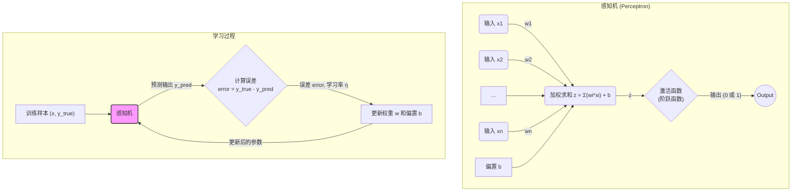

**局限性：**

单一感知机只能解决**线性可分 (Linearly Separable)** 的问题。对于像异或 (XOR) 这样的非线性问题，单个感知机无法找到一条直线来完美划分数据点。

### 2.1.2 从感知机到多层神经网络 (From Perceptron to Multilayer Neural Networks)

为了克服单一感知机的局限性，研究者们将多个感知机（或更准确地说，是使用更平滑激活函数的"神经元"）组合起来，形成了**多层感知机 (Multilayer Perceptron, MLP)**，也就是我们通常所说的**前馈神经网络 (Feedforward Neural Network)**。

**关键改进：**

1.  **多层结构：** 引入一个或多个**隐藏层 (Hidden Layers)**。输入层接收原始数据，隐藏层对数据进行一系列非线性变换，提取更复杂的特征，最后输出层产生最终结果。
2.  **非线性激活函数：** 使用平滑、可微的非线性激活函数取代感知机的阶跃函数。这使得网络能够学习非线性关系，并且是应用梯度下降和反向传播算法的关键。
    *   **Sigmoid 函数：** $\sigma(z) = \frac{1}{1 + e^{-z}}$。输出范围在 (0, 1) 之间，常用于二分类问题的输出层或早期的隐藏层。缺点是容易饱和，导致梯度消失。
    *   **Tanh 函数 (双曲正切)：** $\tanh(z) = \frac{e^z - e^{-z}}{e^z + e^{-z}}$。输出范围在 (-1, 1) 之间，通常比 Sigmoid 收敛更快。同样存在梯度消失问题。
    *   **ReLU 函数 (Rectified Linear Unit)：** $\text{ReLU}(z) = \max(0, z)$。计算简单，有效缓解了梯度消失问题，是目前最常用的激活函数之一。缺点是可能导致"神经元死亡"（输出恒为 0）。
    *   **Leaky ReLU, ELU, Swish/SiLU 等：** ReLU 的变种，试图解决其缺点。例如，SiLU ( $z \cdot \sigma(z)$ ) 在一些 Transformer 模型中表现良好。

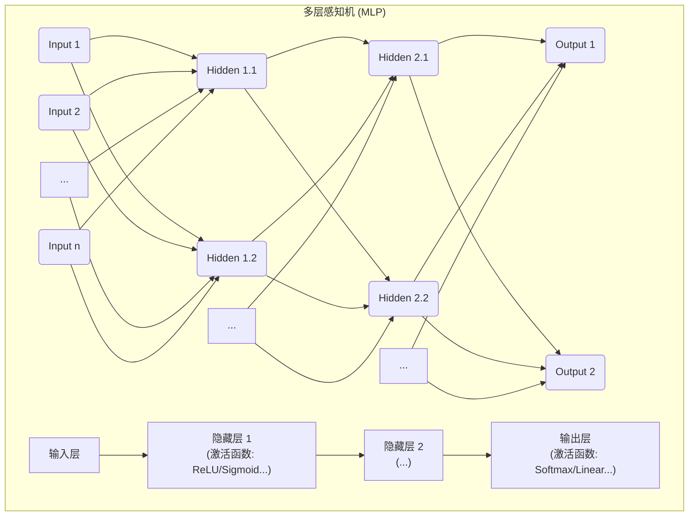

多层结构和非线性激活函数的引入，使得神经网络能够拟合极其复杂的函数，从而解决各种复杂的模式识别和预测任务。但是，如何有效地训练这些深层网络的参数呢？这就引出了反向传播算法。

### 2.1.3 反向传播算法：神经网络学习的核心 (Backpropagation: The Engine of Neural Network Learning)

反向传播 (Backpropagation, BP) 算法是训练多层神经网络的标准方法。它利用**梯度下降 (Gradient Descent)** 的思想，通过**链式法则 (Chain Rule)** 高效地计算损失函数关于网络中每个参数（权重和偏置）的梯度，然后沿着梯度的反方向更新参数，以最小化损失函数。

**核心思想：**

1.  **前向传播 (Forward Pass)：** 将输入数据 $x$ 输入网络，逐层计算，直到得到最终输出 $\hat{y}$ 和损失值 $L$。损失函数 $L$ 用于衡量预测输出 $\hat{y}$ 与真实目标 $y$ 之间的差距，例如均方误差 (MSE) 或交叉熵 (Cross-Entropy)。
2.  **反向传播 (Backward Pass)：**
    *   计算损失函数 $L$ 关于输出层激活值的梯度 $\frac{\partial L}{\partial \hat{y}}$。
    *   利用链式法则，从输出层开始，**逐层反向**计算损失函数 $L$ 关于每一层参数（权重 $W$ 和偏置 $b$）以及该层激活值（或加权和 $z$）的梯度。
        $$ \frac{\partial L}{\partial W_{ij}^{(l)}} = \frac{\partial L}{\partial z_i^{(l)}} \frac{\partial z_i^{(l)}}{\partial W_{ij}^{(l)}} $$
        $$ \frac{\partial L}{\partial b_i^{(l)}} = \frac{\partial L}{\partial z_i^{(l)}} \frac{\partial z_i^{(l)}}{\partial b_i^{(l)}} $$
        $$ \frac{\partial L}{\partial a_j^{(l-1)}} = \sum_i \frac{\partial L}{\partial z_i^{(l)}} \frac{\partial z_i^{(l)}}{\partial a_j^{(l-1)}} $$
        其中，$a^{(l)}$ 和 $z^{(l)}$ 分别表示第 $l$ 层的激活值和加权和，$W_{ij}^{(l)}$ 表示连接第 $l-1$ 层第 $j$ 个神经元到第 $l$ 层第 $i$ 个神经元的权重。(Note: 计算 $\frac{\partial L}{\partial a_j^{(l-1)}}$ 似乎没有意义)
    *   关键在于，计算 $\frac{\partial L}{\partial z^{(l)}}$ 时可以利用已经计算好的 $\frac{\partial L}{\partial z^{(l+1)}}$，从而避免重复计算，高效地将梯度从后向前传播。

    * 来自《深度学习中的数学》：
        * 定义损失函数与加权和$z$的关系： $\delta^l_j = \frac{\partial C}{\partial z^l_j} (l = 2, 3, \dots)$ ，特别的，输出层：$\delta^L_j = \frac{\partial C}{\partial a^L_j} a'(z^L_j)$
        * 得到权重$W$ 和偏置 $b$与损失函数$C$的关系:$$\frac{\partial C}{\partial w^l_{ji}} = \delta^l_j a^{l-1}_i, \quad \frac{\partial C}{\partial b^l_j} = \delta^l_j \quad (l = 2, 3, \dots)$$
        * 因而重点在于求取 $\delta^l_j$，而$\delta^l_j$可由后一层的$\delta^{(l+1)}_j$得到，即：$$\delta^l_i = \{ \delta^{l+1}_1 w^{l+1}_{1i} + \delta^{l+1}_2 w^{l+1}_{2i} + \dots + \delta^{l+1}_m w^{l+1}_{mi} \} a'(z^l_i)$$
3.  **参数更新 (Parameter Update)：** 根据计算得到的梯度，使用梯度下降（或其变种）更新网络中的所有参数：
    $$ W \leftarrow W - \eta \frac{\partial L}{\partial W} $$
    $$ b \leftarrow b - \eta \frac{\partial L}{\partial b} $$

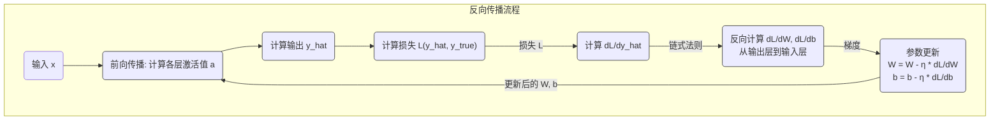

反向传播使得训练深度神经网络成为可能，是深度学习革命的技术基石。

### 2.1.4 优化器：驱动参数更新的引擎 (Optimizers: Driving Parameter Updates)

简单的梯度下降 (也称为批量梯度下降, Batch Gradient Descent) 在每次更新时需要计算整个训练集的梯度，计算成本高，且容易陷入局部最优。因此，研究者们提出了多种更高效、更鲁棒的优化算法（优化器）。

**常用优化器：**

1.  **随机梯度下降 (Stochastic Gradient Descent, SGD)：** 每次更新只使用**一个**训练样本计算梯度。速度快，但梯度估计噪声大，收敛过程波动剧烈。
    $$ W \leftarrow W - \eta \frac{\partial L_i}{\partial W} $$
    ( $L_i$ 是单个样本 $i$ 的损失)

2.  **小批量梯度下降 (Mini-batch Gradient Descent)：** 每次更新使用一小批 (mini-batch) 训练样本计算梯度。是 SGD 和 BGD 的折衷，兼顾了速度和梯度估计的稳定性，是目前最常用的方法。
    $$ W \leftarrow W - \eta \frac{1}{m} \sum_{i=1}^{m} \frac{\partial L_i}{\partial W} $$
    ( $m$ 是 mini-batch 大小)

3.  **动量 (Momentum)：** 引入动量项 $v$，模拟物理中的惯性。它累积了过去的梯度信息，有助于加速收敛，并冲出局部最优和平坦区域。
    $$ v \leftarrow \beta v + (1 - \beta) \frac{\partial L}{\partial W} $$
    $$ W \leftarrow W - \eta v $$
    ( $\beta$ 是动量系数，通常取 0.9 左右)

4.  **AdaGrad (Adaptive Gradient Algorithm)：** 为每个参数维护一个独立的、自适应的学习率。对不常用的参数给予较大的更新步长，对常用的参数给予较小的更新步长。缺点是学习率会单调递减，可能过早停止学习。
    $$ r \leftarrow r + (\frac{\partial L}{\partial W})^2 $$
    $$ W \leftarrow W - \frac{\eta}{\sqrt{r + \epsilon}} \frac{\partial L}{\partial W} $$
    ( $r$ 累积了梯度的平方，$\epsilon$ 是防止分母为零的小常数)

5.  **RMSprop (Root Mean Square Propagation)：** AdaGrad 的改进，使用指数加权移动平均来累积梯度平方，缓解了学习率过早衰减的问题。
    $$ r \leftarrow \rho r + (1 - \rho) (\frac{\partial L}{\partial W})^2 $$
    $$ W \leftarrow W - \frac{\eta}{\sqrt{r + \epsilon}} \frac{\partial L}{\partial W} $$
    ( $\rho$ 是衰减率)

6.  **Adam (Adaptive Moment Estimation)：** 结合了 Momentum 和 RMSprop 的优点。既利用了一阶矩估计（动量项）来加速收敛，又利用了二阶矩估计（类似 RMSprop）来为每个参数自适应调整学习率。是目前**最常用**的优化器之一，尤其在 LLM 训练中广泛应用 (通常使用其变种 AdamW)。
    $$ m \leftarrow \beta_1 m + (1 - \beta_1) \frac{\partial L}{\partial W} \quad \text{(一阶矩估计)} $$
    $$ v \leftarrow \beta_2 v + (1 - \beta_2) (\frac{\partial L}{\partial W})^2 \quad \text{(二阶矩估计)} $$
    $$ \hat{m} = \frac{m}{1 - \beta_1^t}, \quad \hat{v} = \frac{v}{1 - \beta_2^t} \quad \text{(偏差修正)} $$
    $$ W \leftarrow W - \eta \frac{\hat{m}}{\sqrt{\hat{v} + \epsilon}} $$
    ( $\beta_1, \beta_2$ 是衰减率，$t$ 是迭代次数)

7.  **AdamW (Adam with Weight Decay)：** Adam 的一个重要改进。原始 Adam 中的 L2 正则化（权重衰减）与自适应学习率结合时效果不佳。AdamW 将权重衰减**解耦**，直接在参数更新步骤中减去一个与权重成正比的项，通常能获得更好的泛化性能。这是**训练 Transformer 模型时的标准选择**。
    $$ W \leftarrow W - \eta (\frac{\hat{m}}{\sqrt{\hat{v} + \epsilon}} + \lambda W) $$
    ( $\lambda$ 是权重衰减系数)

**学习率调度 (Learning Rate Scheduling)：**

除了选择合适的优化器，调整学习率 $\eta$ 的策略对训练效果也至关重要。常用的策略包括：
*   **固定学习率 (Constant LR)：** 简单，但效果通常不佳。
*   **学习率衰减 (LR Decay)：** 随着训练进行，逐渐降低学习率 (如步进衰减 Step Decay, 指数衰减 Exponential Decay, 余弦退火 Cosine Annealing)。
*   **学习率预热 (LR Warmup)：** 在训练初期使用较小的学习率，然后逐渐增加到预设值，有助于训练初期的稳定性。
*   **Warmup + Decay：** 结合预热和衰减策略，是训练 Transformer 等大型模型时的常见做法 (例如，先线性增加，然后余弦衰减到 0)。

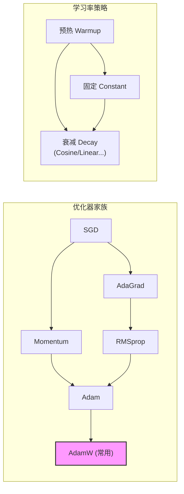

理解感知机、多层网络、反向传播和各种优化器的工作原理，是深入学习神经网络训练的基础。接下来，我们将探讨如何让神经网络处理和理解自然语言的关键一步：词嵌入。

## 2.2 让机器理解词语：词嵌入技术 (Word2Vec, GloVe, FastText)

自然语言处理的核心挑战之一是如何将离散的、符号化的词语转换为机器能够理解和处理的数值表示。早期的 NLP 系统通常使用**独热编码 (One-hot Encoding)** 来表示词语。例如，假设我们的词汇表只有三个词："猫"、"狗"、"跑"。

*   "猫" 可以表示为 `[1, 0, 0]`
*   "狗" 可以表示为 `[0, 1, 0]`
*   "跑" 可以表示为 `[0, 0, 1]`

**独热编码的问题：**

1.  **高维稀疏 (High Dimensionality & Sparsity)：** 真实世界的词汇表非常庞大（数十万甚至数百万），导致独热向量维度极高，且大部分元素为 0，计算效率低下，存储开销大。
2.  **语义鸿沟 (Semantic Gap)：** 任何两个词的独热向量都是正交的 (点积为 0)。这意味着模型无法从这种表示中直接捕捉到词语之间的**语义相似性**。例如，"猫" 和 "狗" 在语义上比 "猫" 和 "跑" 更接近，但这在独热向量中完全无法体现。

为了解决这些问题，**词嵌入 (Word Embeddings)** 技术应运而生。其核心思想是将每个词语映射到一个**低维、稠密、连续**的向量空间中，使得语义相近的词语在该空间中的距离也相近。

**核心理念：分布式假设 (Distributional Hypothesis)**

词嵌入技术大多基于语言学中的**分布式假设**："一个词的含义由它经常出现的上下文决定 (A word is characterized by the company it keeps)"。换句话说，如果两个词经常出现在相似的语境中，那么它们的语义就可能相近。

以下介绍几种主流的词嵌入方法：

### 2.2.1 Word2Vec: 预测上下文或中心词

Word2Vec 是 Google 在 2013 年提出的经典词嵌入模型，它并非一个单一模型，而是包含两种主要的架构：CBOW 和 Skip-gram。

**1. CBOW (Continuous Bag-of-Words): 根据上下文预测中心词**

*   **思想：** 用一个词的**上下文**词语（周围的词）来预测这个**中心词**。
*   **过程：**
    1.  输入：中心词 $w_t$ 周围的上下文词 $w_{t-c}, ..., w_{t-1}, w_{t+1}, ..., w_{t+c}$ 的词向量 ( $c$ 是窗口大小)。
    2.  将上下文词向量进行**平均**（或求和），得到一个聚合的上下文向量 $\mathbf{v}_{context}$。
    3.  使用一个简单的神经网络（通常只有一个线性层 + Softmax）来预测基于 $\mathbf{v}_{context}$ 的中心词 $w_t$。
    4.  训练目标：最大化给定上下文时，预测出正确中心词的概率。
*   **优点：** 对小型数据集效果好，训练速度相对较快。
*   **缺点：** 对低频词效果不如 Skip-gram。

**2. Skip-gram: 根据中心词预测上下文**

*   **思想：** 用一个**中心词**来预测其**上下文**中的词语。
*   **过程：**
    1.  输入：中心词 $w_t$ 的词向量 $\mathbf{v}_{w_t}$。
    2.  使用一个简单的神经网络预测该中心词周围一定窗口大小 $c$ 内的上下文词 $w_{t-c}, ..., w_{t-1}, w_{t+1}, ..., w_{t+c}$。对于窗口内的每个位置，模型都会输出一个词汇表大小的概率分布。
    3.  训练目标：最大化给定中心词时，预测出其所有真实上下文词的联合概率。
*   **优点：** 对低频词处理得更好，在大数据集上通常效果更优。
*   **缺点：** 训练速度相对较慢，计算成本更高。

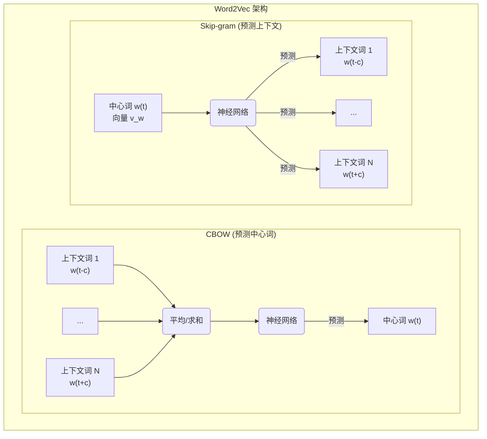

**优化技巧：**

由于词汇表通常很大，直接使用 Softmax 计算概率分布非常耗时。Word2Vec 采用了两种优化策略：

*   **负采样 (Negative Sampling)：** 不再尝试预测所有上下文词，而是将问题转化为区分"真实上下文词"和"随机采样的负样本词 (Negative Samples)"。对于每个中心词-真实上下文词对 $(w_t, w_{context})$，模型需要最大化这个词对的概率，同时最小化中心词 $w_t$ 与 $k$ 个随机负样本词 $(w_t, w_{neg_1}), ..., (w_t, w_{neg_k})$ 的概率。这大大降低了计算复杂度。
*   **层次 Softmax (Hierarchical Softmax)：** 使用一棵**霍夫曼树 (Huffman Tree)** 来表示词汇表。每个叶子节点代表一个词，每个内部节点代表一个二分类决策。预测一个词的概率变成了从根节点到对应叶子节点的一系列二分类概率的乘积。这使得计算复杂度从 $O(V)$ (V 是词汇表大小) 降低到 $O(\log V)$。

Word2Vec 训练得到的词向量能够很好地捕捉词语之间的**语义和语法关系**。例如，著名的例子是 $\text{vector}("King") - \text{vector}("Man") + \text{vector}("Woman") \approx \text{vector}("Queen")$。

### 2.2.2 GloVe: 基于全局共现统计

GloVe (Global Vectors for Word Representation) 是斯坦福大学在 2014 年提出的另一种流行的词嵌入方法。与 Word2Vec 主要依赖局部上下文信息不同，GloVe 试图结合**全局语料库统计信息**和**局部上下文窗口**的优点。

*   **核心思想：** 词向量的点积应该与它们在语料库中的**共现概率 (Co-occurrence Probability)** 相关。更具体地说，它关注的是**共现概率的比率**。例如，考虑词 "ice" 和 "steam"：
    *   与 "solid" 共现的概率： $P("solid" | "ice")$ 可能很高，而 $P("solid" | "steam")$ 可能很低。
    *   与 "gas" 共现的概率： $P("gas" | "ice")$ 可能很低，而 $P("gas" | "steam")$ 可能很高。
    *   与 "water" 共现的概率： $P("water" | "ice")$ 和 $P("water" | "steam")$ 可能都比较高。
    *   与 "fashion" 共现的概率：两者可能都比较低。
    GloVe 认为，**共现概率的比率** (例如 $\frac{P(\text{k} | \text{ice})}{P(\text{k} | \text{steam})}$) 能够更好地反映词语之间的关系。如果比率远大于 1，说明词 k 与 ice 相关性强于 steam (如 k="solid")；如果远小于 1，说明 k 与 steam 相关性强于 ice (如 k="gas")；如果接近 1，说明 k 与两者相关性相似或都无关 (如 k="water" 或 k="fashion")。
*   **目标函数：** GloVe 的目标是学习词向量 $\mathbf{v}_i$ 和 $\mathbf{v}_j$ (以及偏置项 $b_i, b_j$)，使得它们的点积尽可能地拟合全局共现次数的对数 $\log X_{ij}$：
    $$ J = \sum_{i,j=1}^{V} f(X_{ij}) (\mathbf{v}_i^T \mathbf{v}_j + b_i + b_j - \log X_{ij})^2 $$
    *   $X_{ij}$ 是词 $i$ 和词 $j$ 在特定窗口内共同出现的次数（从整个语料库统计得到）。
    *   $f(X_{ij})$ 是一个加权函数，用于降低高频但信息量不大的共现词对 (如 "the" 和 "a") 的权重，同时避免对极低频词对赋予过高权重。
*   **训练过程：** 首先构建一个巨大的**词-词共现矩阵 (Word-Word Co-occurrence Matrix)** $X$，然后通过优化上述目标函数来学习词向量。
*   **优点：** 结合了全局统计信息，通常在词语类比、相似性任务上表现优异，训练速度相对较快。
*   **缺点：** 需要预先计算全局共现矩阵，对内存有一定要求。

### 2.2.3 FastText: 考虑子词信息

FastText 是 Facebook AI Research (FAIR) 在 2016 年提出的，它是 Word2Vec (特别是 Skip-gram) 的一个重要扩展。

*   **核心思想：** 将每个词视为**字符 n-gram (Character n-grams)** 的集合。例如，对于词 "apple" 和 n=3，其字符 n-grams 包括 "<ap"，"app"，"ppl"，"ple"，"le>" (加上特殊边界符号 < 和 >)，以及整个词 "<apple>" 本身。
*   **过程：** FastText 为**每个字符 n-gram** 学习一个向量表示。一个词的向量最终由其所有**字符 n-gram 向量的和** 来表示。
*   **训练：** 训练过程类似于 Word2Vec 的 Skip-gram + 负采样，但预测上下文时使用的是由字符 n-gram 向量合成的词向量。
*   **优点：**
    *   **处理未登录词 (Out-of-Vocabulary, OOV)：** 对于训练语料中未出现过的词，FastText 仍然可以为其构建向量，因为它可能包含已知的字符 n-grams。例如，即使没见过 "affordability"，但见过 "afford", "ability" 等词，可以通过共享的 n-grams ("aff", "for", "ord", "abi", "bil", "ili", "lit", "ity" 等) 构造出一个合理的向量。
    *   **捕捉形态信息：** 由于考虑了字符级别的信息，FastText 能更好地捕捉词语的形态结构相似性 (如 "nation" 和 "national")。
    *   通常在语法任务上表现更好。
*   **缺点：** 模型大小更大（需要存储所有 n-gram 向量），训练和推理时间可能更长。

```mermaid
graph TD
    subgraph "FastText: 基于子词"
        Word["单词 (eg. app)"] --> Split["拆分为字符 n-grams: {ap, app, ppl, ple, le}, {apple}"];
        Split -- "查询 n-gram 向量" --> NGramVecs("获取各 n-gram 的向量");
        NGramVecs --> SumVecs("向量求和");
        SumVecs --> FinalVec["最终词向量<br>vector(apple)"];
    end

    subgraph "OOV 处理 (eg. affordability)"
        OOVWord["未登录词 (affordability)"] --> SplitOOV["拆分为 n-grams: {af, aff, ffo, ..., ity}, {affordability}"];
        SplitOOV -- "查询已知 n-gram 向量" --> KnownNGrams("获取已知 n-gram 向量");
        KnownNGrams --> SumOOV("向量求和");
        SumOOV --> OOVVec["构造 OOV 词向量"];
    end
    style FinalVec fill:#ccf,stroke:#333,stroke-width:1px
    style OOVVec fill:#ccf,stroke:#333,stroke-width:1px
```

**总结比较：**

| 特性         | Word2Vec (Skip-gram)     | GloVe                     | FastText                      |
| :----------- | :----------------------- | :------------------------ | :---------------------------- |
| **核心思想**   | 预测局部上下文           | 拟合全局共现统计           | 预测局部上下文 (基于子词)        |
| **主要输入**   | 局部词对                 | 全局共现矩阵               | 局部词对 + 字符 n-grams       |
| **OOV 处理** | 差                       | 差                       | **好** (通过 n-grams 合成)     |
| **形态信息**   | 弱                       | 弱                       | **强** (通过 n-gram 捕捉)     |
| **语义关系**   | 好                       | **较好**                  | 好                            |
| **训练速度**   | 中等 (负采样)            | 快                       | 较慢 (依赖 n-gram 数量)         |
| **模型大小**   | 小                       | 小                       | **大** (需要存 n-gram 向量)  |

词嵌入技术是后续更复杂 NLP 模型（如 RNN, LSTM, Transformer）的基础。它们将离散的文本符号有效地转换为了包含语义信息的连续向量表示，是连接自然语言和深度学习模型的桥梁。虽然现代 LLM 通常会在其内部学习更深层次、更上下文相关的表示，但预训练的词嵌入（如 Word2Vec, GloVe）有时仍可用于初始化模型的第一层，或在资源受限的情况下直接使用。理解这些经典方法有助于我们更好地把握语言表示学习的演进脉络。

## 2.3 处理序列信息：RNN, LSTM, GRU 的原理与局限性分析

自然语言具有**序列性 (Sequentiality)**。一个词的含义、句子的结构、段落的主题都依赖于其前后出现的词语或句子。例如，"我**不**喜欢苹果"和"我喜欢苹果"的含义截然相反，这取决于"不"这个词的存在。传统的**前馈神经网络 (Feedforward Neural Networks, FNNs)**，如我们在 2.1 节讨论的多层感知机 (MLP)，在处理每个输入时是独立的，无法直接捕捉这种序列中的依赖关系。为了解决这个问题，**循环神经网络 (Recurrent Neural Networks, RNNs)** 被提了出来。

### 2.3.1 循环神经网络 (RNN)：引入"记忆"处理序列

RNN 的核心思想是引入一个**隐藏状态 (Hidden State)** $\mathbf{h}$，这个状态可以捕捉并传递序列中过去的信息。

**工作原理：**

在处理序列中的每个元素（例如，一个句子中的每个词）$\mathbf{x}_t$ ( $t$ 代表时间步)，RNN 会执行以下操作：

1.  **接收当前输入和上一时刻的隐藏状态：** 模型接收当前时间步的输入向量 $\mathbf{x}_t$ (通常是词嵌入) 和上一个时间步的隐藏状态 $\mathbf{h}_{t-1}$。初始隐藏状态 $\mathbf{h}_0$ 通常设为零向量。
2.  **计算当前隐藏状态：** 通过一个**循环层**计算当前的隐藏状态 $\mathbf{h}_t$。这个计算结合了当前输入和过去的"记忆"：
    $$ \mathbf{h}_t = f(\mathbf{W}_{hh} \mathbf{h}_{t-1} + \mathbf{W}_{xh} \mathbf{x}_t + \mathbf{b}_h) $$
    *   $\mathbf{W}_{hh}$ 是连接上一个隐藏状态到当前隐藏状态的权重矩阵 (循环权重)。
    *   $\mathbf{W}_{xh}$ 是连接当前输入到当前隐藏状态的权重矩阵。
    *   $\mathbf{b}_h$ 是隐藏层的偏置项。
    *   $f$ 是一个**非线性激活函数**，通常是 Tanh 或 ReLU。
    关键在于，**权重矩阵 $\mathbf{W}_{hh}, \mathbf{W}_{xh}$ 和偏置 $\mathbf{b}_h$ 在所有时间步都是共享的**。这使得模型能够将学到的模式泛化到序列的不同位置。
3.  **计算当前输出 (可选)：** 根据当前隐藏状态 $\mathbf{h}_t$，可以计算当前时间步的输出 $\mathbf{y}_t$ (例如，在语言模型中预测下一个词的概率分布，或在序列标注中预测当前词的标签)：
    $$ \mathbf{y}_t = g(\mathbf{W}_{hy} \mathbf{h}_t + \mathbf{b}_y) $$
    *   $\mathbf{W}_{hy}$ 是连接隐藏状态到输出的权重矩阵。
    *   $\mathbf{b}_y$ 是输出层的偏置项。
    *   $g$ 是输出层的激活函数 (如 Softmax 用于分类)。

**RNN 结构图示 (展开形式)：**

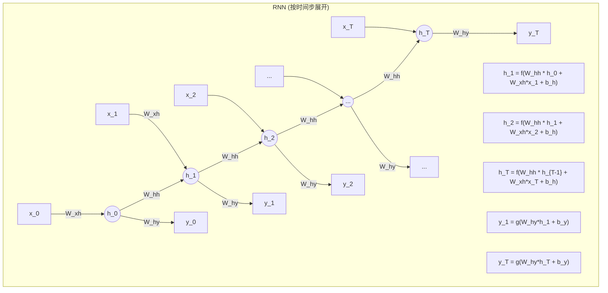

**RNN 的应用场景：**

*   **语言模型：** 预测下一个词。
*   **机器翻译：** (作为 Encoder-Decoder 架构的一部分) 将源语言句子编码为上下文向量。
*   **文本分类/情感分析：** 将整个序列的最终隐藏状态或隐藏状态的某种聚合作为特征进行分类。
*   **序列标注：** (如命名实体识别、词性标注) 为序列中的每个元素预测一个标签。
*   **语音识别**
*   **时间序列预测**

**RNN 的局限性：梯度消失与梯度爆炸 (Vanishing and Exploding Gradients)**

尽管 RNN 理论上可以捕捉任意长的依赖关系，但在实践中，训练 RNN (尤其是深层 RNN 或处理长序列时) 面临一个严重的问题：**梯度消失 (Vanishing Gradients)** 和 **梯度爆炸 (Exploding Gradients)**。

*   **原因：** 在通过时间反向传播 (Backpropagation Through Time, BPTT) 计算梯度时，梯度会涉及到**循环权重矩阵 $\mathbf{W}_{hh}$ 的连乘**。如果 $\mathbf{W}_{hh}$ 的主要特征值（或范数）**小于 1**，梯度在反向传播过程中会指数级衰减，导致远离当前时间步的早期信息对参数更新的贡献几乎为零，模型难以学习到**长距离依赖 (Long-range Dependencies)**。这就是**梯度消失**。反之，如果 $\mathbf{W}_{hh}$ 的主要特征值**大于 1**，梯度会指数级增长，导致参数更新过大，训练过程不稳定，这就是**梯度爆炸**。
*   **梯度爆炸**相对容易处理，可以通过**梯度裁剪 (Gradient Clipping)** 来解决 (当梯度的范数超过某个阈值时，将其缩放到阈值内)。
*   **梯度消失**则更为棘手，它严重限制了标准 RNN 处理长序列的能力。这催生了更复杂的循环单元，如 LSTM 和 GRU。

### 2.3.2 长短时记忆网络 (LSTM)：引入门控机制克服梯度消失

长短时记忆网络 (Long Short-Term Memory, LSTM) 由 Hochreiter 和 Schmidhuber 在 1997 年提出，是 RNN 的一种重要变体，专门设计用来解决梯度消失问题，从而更好地捕捉长距离依赖。

**核心思想：引入门控机制 (Gating Mechanism)**

LSTM 引入了一个额外的**细胞状态 (Cell State)** $\mathbf{c}_t$，它像一条传送带一样贯穿整个时间序列，信息可以很容易地在上面流动而保持不变。LSTM 通过三个**门 (Gates)** 来精细地控制信息的添加、遗忘和输出，从而保护和传递长期记忆。

这三个门分别是：

1.  **遗忘门 (Forget Gate) $\mathbf{f}_t$：** 决定从上一个细胞状态 $\mathbf{c}_{t-1}$ 中**丢弃**哪些信息。
    $$ \mathbf{f}_t = \sigma(\mathbf{W}_f [\mathbf{h}_{t-1}, \mathbf{x}_t] + \mathbf{b}_f) $$
    *   输入是上一个隐藏状态 $\mathbf{h}_{t-1}$ 和当前输入 $\mathbf{x}_t$。
    *   $\sigma$ 是 Sigmoid 函数，输出值在 0 到 1 之间。0 表示完全丢弃，1 表示完全保留。

2.  **输入门 (Input Gate) $\mathbf{i}_t$：** 决定将哪些**新信息**存储到细胞状态中。
    *   首先，一个 Sigmoid 层决定哪些值需要更新：
        $$ \mathbf{i}_t = \sigma(\mathbf{W}_i [\mathbf{h}_{t-1}, \mathbf{x}_t] + \mathbf{b}_i) $$
    *   然后，一个 Tanh 层创建一个候选值向量 $\tilde{\mathbf{c}}_t$，准备添加到细胞状态：
        $$ \tilde{\mathbf{c}}_t = \tanh(\mathbf{W}_c [\mathbf{h}_{t-1}, \mathbf{x}_t] + \mathbf{b}_c) $$

3.  **更新细胞状态：** 结合遗忘门和输入门，更新细胞状态：
    $$ \mathbf{c}_t = \mathbf{f}_t \odot \mathbf{c}_{t-1} + \mathbf{i}_t \odot \tilde{\mathbf{c}}_t $$
    *   $\odot$ 表示**逐元素乘积 (Hadamard Product)**。先用遗忘门 $\mathbf{f}_t$ 过滤掉 $\mathbf{c}_{t-1}$ 中要丢弃的信息，然后用输入门 $\mathbf{i}_t$ 选择 $\tilde{\mathbf{c}}_t$ 中的新信息加入。

4.  **输出门 (Output Gate) $\mathbf{o}_t$：** 决定从当前细胞状态 $\mathbf{c}_t$ 中输出什么作为隐藏状态 $\mathbf{h}_t$。
    *   首先，一个 Sigmoid 层决定细胞状态的哪些部分需要输出：
        $$ \mathbf{o}_t = \sigma(\mathbf{W}_o [\mathbf{h}_{t-1}, \mathbf{x}_t] + \mathbf{b}_o) $$
    *   然后，将细胞状态通过 Tanh (值域 -1 到 1) 进行处理，并与输出门的输出相乘，得到最终的隐藏状态：
        $$ \mathbf{h}_t = \mathbf{o}_t \odot \tanh(\mathbf{c}_t) $$

**LSTM 结构图示：**

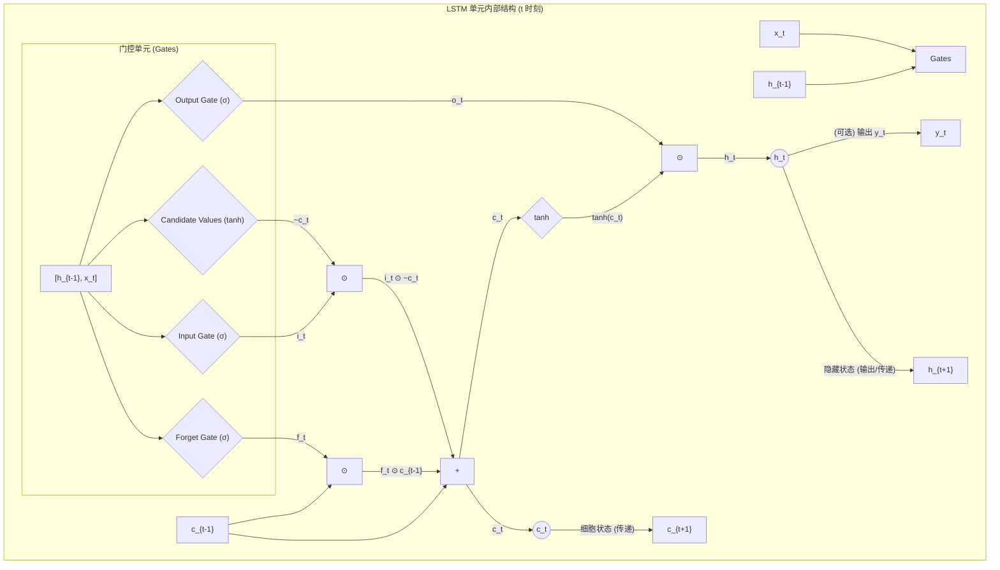

**LSTM 如何缓解梯度消失：**

*   **细胞状态的线性传递：** 细胞状态 $\mathbf{c}_t$ 的更新主要是**加法**操作 ( $\mathbf{c}_t = \mathbf{f}_t \odot \mathbf{c}_{t-1} + \mathbf{i}_t \odot \tilde{\mathbf{c}}_t$ )。相对于 RNN 中隐藏状态的反复矩阵乘法和非线性变换，加法操作使得梯度在反向传播时更容易保持其大小，不容易消失。
*   **门控机制：** 门控机制允许网络**主动地**学习何时遗忘旧信息、何时输入新信息、何时输出信息。当遗忘门接近 1，输入门接近 0 时，过去的细胞状态可以几乎原封不动地传递到当前，从而保留长期记忆。

LSTM 在许多序列建模任务上取得了巨大成功，例如机器翻译、语音识别、文本生成等，并在很长一段时间内是处理序列数据的标准方法。

### 2.3.3 门控循环单元 (GRU)：LSTM 的简化变体

门控循环单元 (Gated Recurrent Unit, GRU) 由 Cho 等人在 2014 年提出，是 LSTM 的一个流行变体。它旨在简化 LSTM 的结构，同时保持其优良性能。

**GRU 的主要改动：**

1.  **合并细胞状态和隐藏状态：** GRU 没有单独的细胞状态 $\mathbf{c}_t$，只有一个隐藏状态 $\mathbf{h}_t$。
2.  **减少门数量：** GRU 只有两个门：**更新门 (Update Gate) $\mathbf{z}_t$** 和 **重置门 (Reset Gate) $\mathbf{r}_t$**。
    *   **重置门 $\mathbf{r}_t$：** 决定在计算**候选隐藏状态 $\tilde{\mathbf{h}}_t$** 时，应该**忽略**多少过去的信息 (来自 $\mathbf{h}_{t-1}$ )。
        $$ \mathbf{r}_t = \sigma(\mathbf{W}_r [\mathbf{h}_{t-1}, \mathbf{x}_t] + \mathbf{b}_r) $$
    *   **候选隐藏状态 $\tilde{\mathbf{h}}_t$：** 计算方式类似于 RNN 的隐藏状态，但会受到重置门的控制。
        $$ \tilde{\mathbf{h}}_t = \tanh(\mathbf{W}_h [\mathbf{r}_t \odot \mathbf{h}_{t-1}, \mathbf{x}_t] + \mathbf{b}_h) $$
        当 $\mathbf{r}_t$ 的元素接近 0 时，模型会忽略对应的过去隐藏状态信息，只依赖当前输入 $\mathbf{x}_t$ 来计算候选状态。
    *   **更新门 $\mathbf{z}_t$：** 决定在多大程度上使用**新的**候选隐藏状态 $\tilde{\mathbf{h}}_t$ 来更新当前的隐藏状态 $\mathbf{h}_t$，以及在多大程度上保留**旧的**隐藏状态 $\mathbf{h}_{t-1}$。它类似于 LSTM 中遗忘门和输入门的组合作用。
        $$ \mathbf{z}_t = \sigma(\mathbf{W}_z [\mathbf{h}_{t-1}, \mathbf{x}_t] + \mathbf{b}_z) $$
    *   **最终隐藏状态 $\mathbf{h}_t$：** 通过更新门对旧状态和候选状态进行线性插值。
        $$ \mathbf{h}_t = (1 - \mathbf{z}_t) \odot \mathbf{h}_{t-1} + \mathbf{z}_t \odot \tilde{\mathbf{h}}_t $$
        当 $\mathbf{z}_t$ 接近 1 时，模型倾向于使用新的候选状态；当 $\mathbf{z}_t$ 接近 0 时，模型倾向于保留旧的状态。

**GRU 结构图示：**

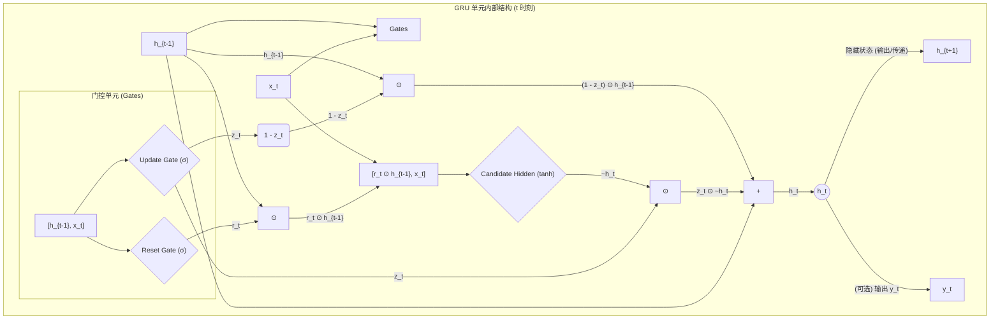

**GRU vs LSTM：**

*   **参数更少：** GRU 的门比 LSTM 少，参数量也相应减少，计算效率通常更高，可能需要更少的数据来达到泛化。
*   **性能相当：** 在许多任务上，GRU 和 LSTM 的性能表现相似，没有绝对的优劣之分。选择哪个通常取决于具体的任务和经验调优。
*   **经验法则：** LSTM 由于其更明确的记忆单元分离，可能在需要精确控制记忆存储和遗忘的任务上略有优势。GRU 的简洁性使其在某些情况下更易于训练和调整。

**RNN/LSTM/GRU 的共同局限：**

尽管 LSTM 和 GRU 在很大程度上缓解了梯度消失问题，并成功应用于许多 NLP 任务，但它们仍然存在一些固有的局限性，这些局限性最终导致了 Transformer 的出现：

1.  **顺序计算限制并行性：** RNN 的核心是**顺序处理**，计算当前时间步的状态 $\mathbf{h}_t$ 必须等待上一个时间步的状态 $\mathbf{h}_{t-1}$ 计算完成。这使得 RNN 难以在现代 GPU/TPU 等并行计算设备上充分发挥效率，尤其是在处理长序列时，训练速度受到严重限制。
2.  **长距离依赖捕捉仍然困难：** 虽然理论上 LSTM/GRU 可以捕捉长距离依赖，但在实践中，随着序列长度的增加，信息在逐步传递过程中仍然可能丢失或扭曲。对于需要精确捕捉非常遥远位置之间依赖关系的任务，它们的能力仍然有限。
3.  **信息瓶颈：** 整个序列的"记忆"都需要被压缩到一个固定大小的隐藏状态向量 $\mathbf{h}_t$ 中，这可能成为信息传递的瓶颈，特别是对于复杂或信息量大的序列。

正是为了解决这些问题，尤其是并行计算的瓶颈，研究者们开始探索不依赖循环结构的模型，最终催生了基于**注意力机制 (Attention Mechanism)** 的 Transformer 架构，我们将在下一节和第三章详细探讨。

## 2.4 注意力机制的革命：从 Seq2Seq 瓶颈到 Attention is All You Need

在 RNN/LSTM/GRU 的时代，处理**序列到序列 (Sequence-to-Sequence, Seq2Seq)** 任务（如机器翻译、文本摘要）的标准架构是 **Encoder-Decoder 模型**。

**经典的 Encoder-Decoder 架构：**

1.  **编码器 (Encoder)：** 通常是一个 RNN (或 LSTM/GRU)，负责读取**输入序列** (如源语言句子)，并将其逐步压缩成一个固定大小的**上下文向量 (Context Vector)** $\mathbf{c}$。这个向量通常是 Encoder 最后一个时间步的隐藏状态 $\mathbf{h}_T^{\text{enc}}$。这个向量被期望能够**编码整个输入序列的语义信息**。
2.  **解码器 (Decoder)：** 也是一个 RNN (或 LSTM/GRU)，它接收 Encoder 产生的上下文向量 $\mathbf{c}$ 作为其**初始隐藏状态** (或者在每个时间步都作为输入的一部分)，然后**逐个生成输出序列** (如目标语言句子)。在生成每个词 $y_t$ 时，它会考虑上一个生成的词 $y_{t-1}$ 和当前的隐藏状态 $\mathbf{h}_t^{\text{dec}}$。

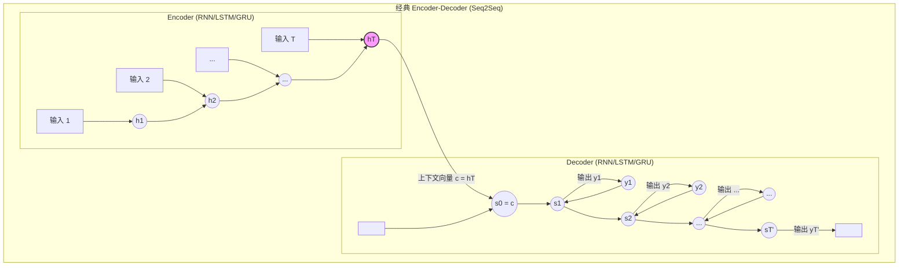

**Seq2Seq 的瓶颈：固定大小的上下文向量**

这种经典架构存在一个明显的**瓶颈**：无论输入序列多长、多复杂，Encoder 都必须将其所有信息**压缩**到一个**固定大小**的上下文向量 $\mathbf{c}$ 中。

*   **信息损失：** 对于长序列，强制压缩必然会导致信息损失。向量 $\mathbf{c}$ 可能无法完全捕捉输入序列的所有细微差别和重要信息，尤其是序列开头的细节。
*   **解码器负担过重：** Decoder 在生成输出序列的每一步都只能依赖这个可能已经信息不足的 $\mathbf{c}$。它无法动态地关注输入序列中与当前生成内容最相关的部分。

想象一下将一本厚书的所有内容压缩成一个段落摘要，然后要求别人仅根据这个摘要来复述书中的每一个细节——这显然非常困难。

**注意力机制的诞生：让 Decoder "看到"整个输入**

为了解决这个瓶颈问题，Bahdanau 等人 (2014) 和 Luong 等人 (2015) 引入了**注意力机制 (Attention Mechanism)** 到 Encoder-Decoder 架构中。

**核心思想：** 不再强迫 Encoder 将所有信息压缩成一个固定向量，而是允许 Decoder 在生成输出序列的**每一步**，都能够**动态地"关注" (attend to)** 输入序列的**不同部分**，并根据相关性分配不同的**注意力权重 (Attention Weights)**。

**带注意力的 Encoder-Decoder 流程：**

1.  **Encoder：** 仍然像之前一样处理输入序列，但这次我们**保留所有时间步的隐藏状态** $\mathbf{h}_1^{\text{enc}}, \mathbf{h}_2^{\text{enc}}, ..., \mathbf{h}_T^{\text{enc}}$。这些状态共同构成了对输入序列更丰富的表示。
2.  **Decoder (在生成第 $t$ 个输出 $y_t$ 时)：**
    a.  **获取当前 Decoder 状态：** 计算当前时间步的 Decoder 隐藏状态 $\mathbf{s}_t$ (在 Luong Attention 中，这步通常在计算上下文向量之后)。
    b.  **计算注意力分数 (Attention Scores)：** 对于**每一个** Encoder 隐藏状态 $\mathbf{h}_j^{\text{enc}}$ ( $j=1...T$ )，计算它与当前 Decoder 状态 $\mathbf{s}_{t-1}$ (或 $\mathbf{s}_t$) 的**相关性**或**匹配度**，得到一个分数 $e_{tj}$。计算分数的方法有多种 (称为对齐模型 Alignment Model 或得分函数 Score Function)：
        *   **点积 (Dot-product):** $e_{tj} = \mathbf{s}_{t-1}^T \mathbf{h}_j^{\text{enc}}$ (Luong Attention 的一种)
        *   **加性 (Additive) / 连接 (Concat):** $e_{tj} = \mathbf{v}_a^T \tanh(\mathbf{W}_a [\mathbf{s}_{t-1}; \mathbf{h}_j^{\text{enc}}])$ (Bahdanau Attention)
        *   **缩放点积 (Scaled Dot-product):** $e_{tj} = \frac{(\mathbf{W}_q \mathbf{s}_{t-1})^T (\mathbf{W}_k \mathbf{h}_j^{\text{enc}})}{\sqrt{d_k}}$ (Transformer 使用的方式，其中 $\mathbf{W}_q, \mathbf{W}_k$ 是可学习的投影矩阵，$d_k$ 是 Key 向量的维度)
    c.  **计算注意力权重 (Attention Weights)：** 将所有注意力分数通过 **Softmax** 函数进行归一化，得到注意力权重 $\alpha_{tj}$。这些权重表示在生成 $y_t$ 时，应该对输入序列的第 $j$ 个位置赋予多少关注度。所有权重之和为 1。
        $$ \alpha_{tj} = \frac{\exp(e_{tj})}{\sum_{k=1}^{T} \exp(e_{tk})} $$
    d.  **计算上下文向量 (Context Vector)：** 将所有 Encoder 隐藏状态 $\mathbf{h}_j^{\text{enc}}$ 按照其对应的注意力权重 $\alpha_{tj}$ 进行**加权求和**，得到**当前时间步的上下文向量 $\mathbf{c}_t$**。这个向量动态地聚合了输入序列中与当前解码步骤最相关的信息。
        $$ \mathbf{c}_t = \sum_{j=1}^{T} \alpha_{tj} \mathbf{h}_j^{\text{enc}} $$
    e.  **计算最终输出：** 将上下文向量 $\mathbf{c}_t$ 与 Decoder 当前隐藏状态 $\mathbf{s}_t$ (或其某种组合) 结合起来，输入到最终的输出层 (如 Softmax) 来预测 $y_t$。
        *   例如，可以先计算一个包含注意力信息的隐藏状态： $\tilde{\mathbf{s}}_t = \tanh(\mathbf{W}_c [\mathbf{c}_t; \mathbf{s}_t])$，然后 $p(y_t | y_{<t}, x) = \text{softmax}(\mathbf{W}_o \tilde{\mathbf{s}}_t)$。

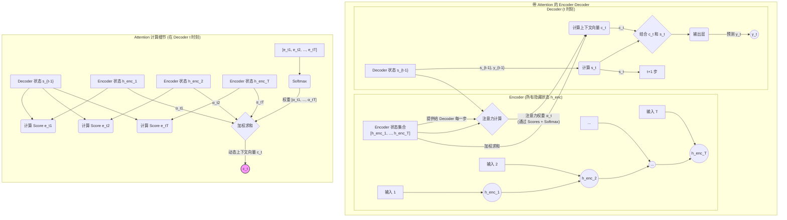

**注意力机制的优势：**

*   **解决信息瓶颈：** Decoder 可以直接访问所有 Encoder 状态，不再依赖单一的固定向量。
*   **动态聚焦：** 允许模型根据当前需要，动态地决定关注输入序列的哪些部分。例如，在翻译一个词时，可以重点关注源句子中对应的词及其上下文。
*   **可解释性：** 注意力权重 $\alpha_{tj}$ 提供了一定的可解释性，我们可以可视化在生成某个输出词时，模型主要"看"了输入的哪些部分。
*   **显著提升性能：** 注意力机制极大地提升了机器翻译等 Seq2Seq 任务的性能，成为当时最先进的技术。

**从 Attention is All You Need 到 Transformer：**

注意力机制最初是作为对 RNN Encoder-Decoder 架构的**补充** 而提出的。然而，2017 年，Google 的研究者们发表了里程碑式的论文《Attention Is All You Need》，提出了 **Transformer** 模型。

Transformer 的革命性在于：它**完全抛弃了 RNN 的循环结构** ，仅依赖**自注意力机制 (Self-Attention)** 和**跨注意力机制 (Cross-Attention)** 来处理序列信息。

*   **自注意力 (Self-Attention)：** 允许模型在处理序列中的**同一个序列** (例如，在 Encoder 内部处理输入句子，或在 Decoder 内部处理已生成的部分) ，计算序列中**不同位置之间的依赖关系** 。一个词可以同时"关注"句子中的所有其他词（包括它自己），并根据相关性聚合信息。
*   **跨注意力 (Cross-Attention)：** 用于连接 Encoder 和 Decoder (类似于之前讨论的注意力机制) ，允许 Decoder 在生成输出时关注 Encoder 的所有输出状态。

通过完全依赖注意力机制，Transformer 实现了：

1.  **高度并行化：** 由于没有了 RNN 的顺序依赖，序列中所有位置的计算可以**同时进行** ，极大地提高了训练速度，使得训练更大、更深的模型成为可能。
2.  **更好的长距离依赖捕捉：** 注意力机制可以直接计算序列中任意两个位置之间的关联，信息传递路径更短（理论上是 O(1) )，相比 RNN 的 O(n) 逐步传递，能更有效地捕捉长距离依赖。

Transformer 的提出彻底改变了 NLP 领域，成为了后续几乎所有大规模预训练语言模型 (如 BERT, GPT, T5, Llama 等) 的基础架构。我们将在下一章详细解构 Transformer 的内部工作原理。

## (可选) 2.5 开发环境准备：Python 与 PyTorch/JAX 核心操作入门

*(本节内容待补充，将介绍必要的 Python 库 (如 NumPy, Pandas) 以及深度学习框架 PyTorch 或 JAX 的基础知识，包括张量操作、自动微分、模型构建和训练循环等，为后续实战打下基础。)*