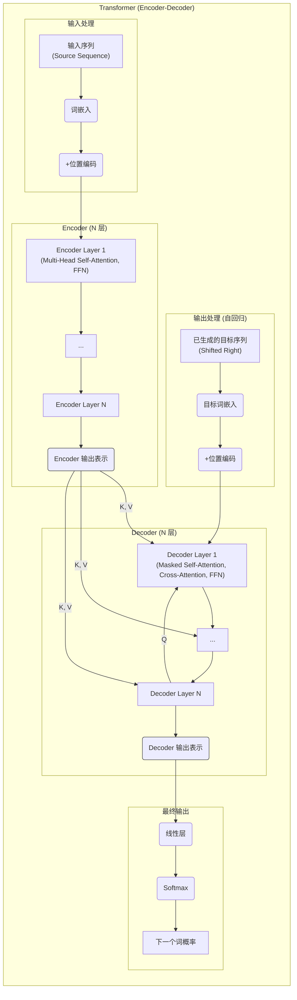
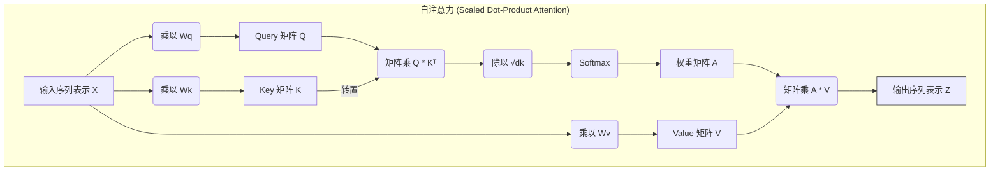
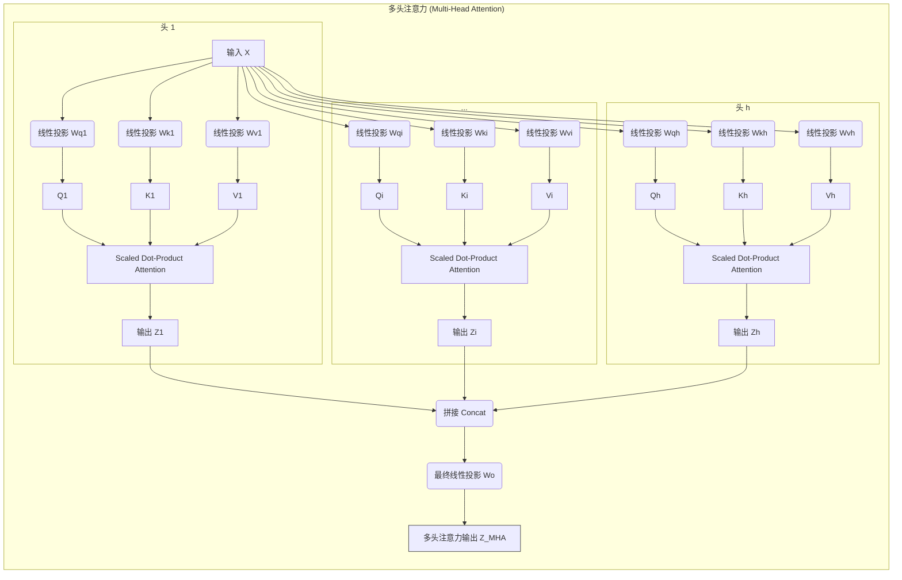
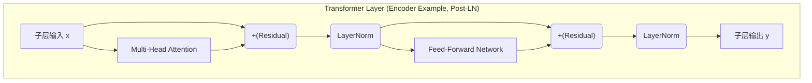
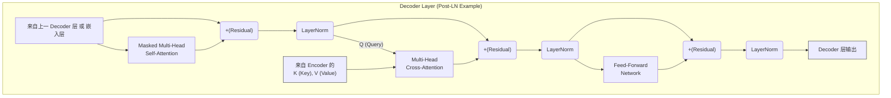
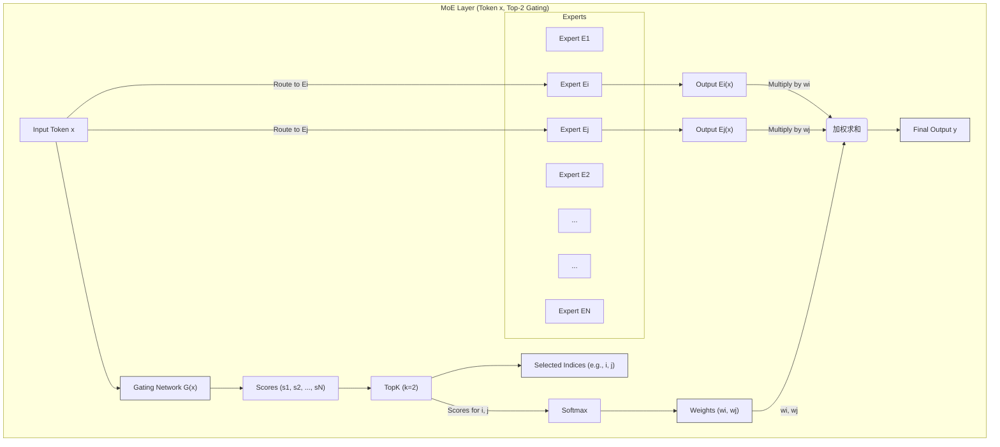
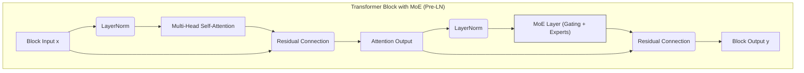

# 第3章：Transformer 深度解析：构建 LLM 的核心引擎 (The Transformer Engine: Deconstructing Attention, Architectures, and the Rise of MoE)

在前两章中，我们回顾了大规模语言模型 (LLM) 的发展历程、核心概念，并巩固了深度学习与自然语言处理的基础知识，特别是词嵌入和循环神经网络 (RNN) 及其变种 (LSTM, GRU)。我们了解到，尽管 RNN 及其变体在处理序列数据方面取得了巨大成功，但其固有的顺序计算特性限制了并行处理能力，并且在捕捉长距离依赖方面仍有挑战。

为了突破这些限制，Google 在 2017 年发表了划时代的论文《Attention Is All You Need》，提出了 **Transformer** 模型。Transformer 彻底摒弃了循环结构，完全依赖**注意力机制 (Attention Mechanism)**，尤其是**自注意力 (Self-Attention)**，来建模序列内部以及序列之间的依赖关系。这一创新不仅**极大地提高了模型的并行计算能力**，使得训练前所未有的大型模型成为可能，而且在**捕捉长距离依赖**方面展现出卓越的性能。

Transformer 架构迅速成为自然语言处理领域的新范式，并奠定了现代几乎所有主流 LLM (如 BERT, GPT 系列, T5, Llama, Mixtral 等) 的基础。理解 Transformer 的工作原理，是深入掌握 LLM 的关键。

本章将对 Transformer 的核心组件进行深度解析：

*   从宏观架构入手，理解 Encoder-Decoder 的设计哲学。
*   深入剖析自注意力机制和多头注意力机制，这是 Transformer 理解上下文的核心。
*   探讨位置编码如何为模型注入序列的位置信息。
*   分析构成 Transformer 层的基础模块：前馈网络、残差连接和层归一化。
*   解构 Decoder 的独特设计，包括 Masked Self-Attention 和 Cross-Attention。
*   对比分析基于 Transformer 的三大主流架构范式：Encoder-Only, Decoder-Only, Encoder-Decoder。
*   探索近年来备受关注的架构创新——专家混合模型 (MoE)，了解其原理、实现及代表模型。
*   最后，通过 Hugging Face Transformers 库进行实战演练，将理论付诸实践。

准备好进入 Transformer 的世界，揭开驱动现代 LLM 的强大引擎的奥秘吧！

## 3.1 宏伟蓝图：理解 Transformer 的 Encoder-Decoder 架构哲学

原始的 Transformer 论文主要针对**机器翻译**任务，因此采用了经典的**编码器-解码器 (Encoder-Decoder)** 架构。虽然之后衍生出了仅使用 Encoder 或 Decoder 的模型，但理解完整的 Encoder-Decoder 结构是掌握 Transformer 家族的基础。

**核心目标：** 将一个输入序列 (源语言句子) 转换为一个输出序列 (目标语言句子)。

**架构组成：**

1.  **编码器 (Encoder)：**
    *   **作用：** 读取输入序列，并将其转换为一系列**富含上下文信息的连续表示 (Contextualized Representations)**。它并不像 RNN Encoder 那样试图将所有信息压缩成单一向量。
    *   **结构：** 由 **N** 层相同的 Encoder Layer 堆叠而成 (原论文中 N=6)。每一层都包含两个核心子层：
        *   **多头自注意力层 (Multi-Head Self-Attention Layer)：** 使得输入序列中的每个位置都能关注到序列中的所有其他位置（包括自身），从而计算出该位置的上下文感知表示。
        *   **位置前馈网络层 (Position-wise Feed-Forward Network Layer)：** 一个简单的全连接前馈网络，独立地应用于每个位置的表示，进行非线性变换。
    *   每个子层都采用了**残差连接 (Residual Connection)** 和**层归一化 (Layer Normalization)**。

2.  **解码器 (Decoder)：**
    *   **作用：** 接收 Encoder 输出的表示，并结合已经生成的部分目标序列，**自回归地 (Autoregressively)** 生成下一个目标词，直到输出结束符。
    *   **结构：** 也由 **N** 层相同的 Decoder Layer 堆叠而成 (N=6)。每一层包含三个核心子层：
        *   **带掩码的多头自注意力层 (Masked Multi-Head Self-Attention Layer)：** 与 Encoder 中的自注意力类似，但加入了**掩码 (Masking)**，确保在预测当前位置 $t$ 的输出时，只能关注到位置 $t$ 及其之前的位置，防止模型"偷看"未来的目标词。
        *   **多头交叉注意力层 (Multi-Head Cross-Attention Layer / Encoder-Decoder Attention)：** 这是连接 Encoder 和 Decoder 的桥梁。它允许 Decoder 中的每个位置关注到 **Encoder 输出的所有位置表示**，从而有效地利用源序列信息来指导目标序列的生成。
        *   **位置前馈网络层 (Position-wise Feed-Forward Network Layer)：** 与 Encoder 中的结构和作用相同。
    *   同样，每个子层也都采用了残差连接和层归一化。

3.  **输入与输出处理：**
    *   **输入嵌入 (Input Embedding)：** 将输入词元 (Tokens) 转换为向量表示。
    *   **位置编码 (Positional Encoding)：** 由于 Transformer 没有循环结构，无法天然感知序列顺序，因此需要向输入嵌入中加入位置信息。
    *   **输出层 (Output Layer)：** Decoder 最顶层输出的向量会经过一个线性层和一个 Softmax 层，转换为预测下一个目标词的概率分布。

**高层结构图：**



**核心哲学：**

*   **并行化优先：** 摒弃循环结构，使得大部分计算可以在序列维度上并行执行。
*   **注意力是核心：** 通过自注意力和交叉注意力机制直接建模长距离依赖关系，信息传递路径更短。
*   **层层递进的表示学习：** Encoder 和 Decoder 通过多层堆叠，逐步构建更抽象、更丰富的序列表示。

接下来，我们将深入到 Transformer 最核心的部件——自注意力机制。

## 3.2 自注意力机制（Self-Attention）：LLM 理解上下文的关键

自注意力 (Self-Attention)，有时也称为内部注意力 (Intra-Attention)，是 Transformer 模型的核心创新之一。它允许模型在处理序列中的某个元素时，动态地衡量序列中**所有其他元素**（包括自身）对当前元素的重要性，并根据这些重要性（注意力权重）来聚合信息，生成该元素的**上下文感知表示 (Context-aware Representation)**。

想象一下阅读句子 "The animal didn't cross the street because **it** was too tired." 时，为了理解代词 "it" 指代的是 "animal" 而不是 "street"，我们需要将 "it" 与句子中的其他词联系起来。自注意力机制正是模拟了这种能力。

**Query, Key, Value 的概念：**

自注意力的计算过程可以类比于信息检索系统。假设你有一个**查询 (Query)**，你想在一堆**键值对 (Key-Value pairs)** 中查找信息。你会用你的 Query 去和每个 Key 计算相似度，相似度越高的 Key，其对应的 Value 对你来说就越重要。最后，你根据相似度（权重）将所有 Value 加权求和，得到最终的检索结果。

在自注意力中：

1.  **来源：** 输入序列中的每个元素（例如，每个词的嵌入向量加上位置编码）$\mathbf{x}_i$。
2.  **生成 Q, K, V：** 对于序列中的**每一个**输入向量 $\mathbf{x}_i$，我们通过乘以三个不同的、可学习的**权重矩阵** $\mathbf{W}_q, \mathbf{W}_k, \mathbf{W}_v$，来生成对应的 Query 向量 $\mathbf{q}_i$, Key 向量 $\mathbf{k}_i$, 和 Value 向量 $\mathbf{v}_i$：
    $$ \mathbf{q}_i = \mathbf{W}_q \mathbf{x}_i $$
    $$ \mathbf{k}_i = \mathbf{W}_k \mathbf{x}_i $$
    $$ \mathbf{v}_i = \mathbf{W}_v \mathbf{x}_i $$
    *   $\mathbf{q}_i$: 代表当前位置 $i$ 发出的"查询"，询问与其他位置的关系。
    *   $\mathbf{k}_i$: 代表当前位置 $i$ 的"身份标识"或"可被查询的特征"，用于与其他位置的 Query 匹配。
    *   $\mathbf{v}_i$: 代表当前位置 $i$ 的"内容"或"信息"，如果该位置被其他位置高度关注，其 Value 就会对结果产生较大影响。
    *   注意：在实践中，输入通常是一个包含所有词向量的矩阵 $\mathbf{X}$，Q, K, V 的计算可以通过矩阵乘法并行完成：$\mathbf{Q} = \mathbf{X} \mathbf{W}_q$, $\mathbf{K} = \mathbf{X} \mathbf{W}_k$, $\mathbf{V} = \mathbf{X} \mathbf{W}_v$。

**计算注意力权重：**

为了计算位置 $i$ 的输出表示，我们需要知道位置 $i$ 应该对序列中所有位置 $j$（包括 $i$ 自身）赋予多少注意力。

1.  **计算分数 (Score)：** 使用位置 $i$ 的 Query $\mathbf{q}_i$ 和所有位置 $j$ 的 Key $\mathbf{k}_j$ 计算**点积 (Dot Product)**，得到注意力分数 $e_{ij}$。这个分数衡量了位置 $i$ 和位置 $j$ 之间的相关性。
    $$ e_{ij} = \mathbf{q}_i^T \mathbf{k}_j $$
2.  **缩放 (Scale)：** 为了防止点积结果过大导致 Softmax 函数进入梯度饱和区，将分数除以 Key 向量维度 $d_k$ 的平方根 $\sqrt{d_k}$。
    $$\text{scaled\_score}_{ij} = \frac{\mathbf{q}_i^T \mathbf{k}_j}{\sqrt{d_k}}$$
3.  **归一化 (Normalization)：** 对关于位置 $j$ 的所有缩放后分数应用 **Softmax** 函数，得到注意力权重 $\alpha_{ij}$。$\alpha_{ij}$ 表示位置 $i$ 的输出应该在多大程度上由位置 $j$ 的输入信息构成。所有 $\alpha_{ij}$ (对于固定的 $i$) 的和为 1。    $$ \alpha_{ij} = \text{softmax}_j(\frac{\mathbf{q}_i^T \mathbf{k}_j}{\sqrt{d_k}}) = \frac{\exp(\frac{\mathbf{q}_i^T \mathbf{k}_j}{\sqrt{d_k}})}{\sum_{l=1}^{n} \exp(\frac{\mathbf{q}_i^T \mathbf{k}_l}{\sqrt{d_k}})} $$
    ( $n$ 是序列长度)

**计算输出表示：**

位置 $i$ 的最终输出向量 $\mathbf{z}_i$ 是所有位置 $j$ 的 Value 向量 $\mathbf{v}_j$ 根据注意力权重 $\alpha_{ij}$ 的**加权求和**。

$$ \mathbf{z}_i = \sum_{j=1}^{n} \alpha_{ij} \mathbf{v}_j $$

这意味着，如果 $\alpha_{ij}$ 很大，说明位置 $i$ 非常关注位置 $j$，那么位置 $j$ 的 Value $\mathbf{v}_j$ 对最终输出 $\mathbf{z}_i$ 的贡献就很大。

**矩阵形式 (更高效)：**

在实践中，上述计算通常使用矩阵运算一次性完成所有位置的输出：

1.  计算 Q, K, V 矩阵：$\mathbf{Q} = \mathbf{X} \mathbf{W}_q$, $\mathbf{K} = \mathbf{X} \mathbf{W}_k$, $\mathbf{V} = \mathbf{X} \mathbf{W}_v$
2.  计算注意力分数矩阵：$\text{Scores} = \mathbf{Q} \mathbf{K}^T$
3.  缩放：$\text{ScaledScores} = \frac{\text{Scores}}{\sqrt{d_k}}$
4.  计算注意力权重矩阵：$\mathbf{A} = \text{softmax}(\text{ScaledScores})$ (Softmax 沿着 K 的维度计算)
5.  计算输出矩阵：$\mathbf{Z} = \mathbf{A} \mathbf{V}$

**自注意力计算图示：**



**自注意力的优势：**

*   **捕捉长距离依赖：** 可以直接计算序列中任意两个位置之间的依赖关系，路径长度为 O(1)。
*   **并行计算：** 每个位置的输出计算可以并行进行，大大提高了计算效率。
*   **上下文感知：** 输出表示 $\mathbf{z}_i$ 融入了整个序列的上下文信息。

然而，单一的自注意力机制可能只关注到一种类型的相关性。为了让模型能够同时关注来自不同表示子空间的信息，Transformer 引入了多头注意力机制。

## 3.3 多头注意力（Multi-Head Attention）：并行捕捉、多维聚焦

单一的自注意力机制相当于只用一种方式去"提问"（一个 Query）和寻找相关性。但我们可能希望模型能够从**不同的角度、关注不同的表示子空间**来理解输入序列。例如，在处理 "The tired animal didn't cross the street" 时，一个"头"可能关注语法关系（"animal" 是主语），另一个"头"可能关注语义属性（"tired" 修饰 "animal"）。

**多头注意力 (Multi-Head Attention, MHA)** 正是为了实现这种多角度、多子空间的关注而设计的。

**工作原理：**

MHA 并非只进行一次自注意力计算，而是将 Query, Key, Value **线性投影 (Linearly Project)** 到 $h$ 个不同的、低维度的子空间中（$h$ 称为**头的数量**，原论文 $h=8$），然后在每个子空间上**并行地**执行缩放点积注意力计算，最后将 $h$ 个头的输出结果**拼接 (Concatenate)** 起来，再通过一个**最终的线性投影**得到最终输出。

具体步骤如下（假设输入表示的维度是 $d_{model}$，每个头的维度是 $d_k = d_v = d_{model} / h$）：

1.  **线性投影：** 对于输入 $\mathbf{X}$ (或上一层的输出)，为**每一个头** $i$ ( $i=1...h$ ) 学习独立的投影矩阵 $\mathbf{W}_q^{(i)}, \mathbf{W}_k^{(i)}, \mathbf{W}_v^{(i)}$ (维度通常是 $d_{model} \times d_k$ 或 $d_{model} \times d_v$)。计算每个头的 Q, K, V 矩阵：
    $$ \mathbf{Q}^{(i)} = \mathbf{X} \mathbf{W}_q^{(i)} $$
    $$ \mathbf{K}^{(i)} = \mathbf{X} \mathbf{W}_k^{(i)} $$
    $$ \mathbf{V}^{(i)} = \mathbf{X} \mathbf{W}_v^{(i)} $$

2.  **并行计算注意力：** 对**每一个头** $i$ **独立且并行地**执行缩放点积自注意力计算，得到每个头的输出 $\mathbf{Z}^{(i)}$：
    $$ \mathbf{Z}^{(i)} = \text{Attention}(\mathbf{Q}^{(i)}, \mathbf{K}^{(i)}, \mathbf{V}^{(i)}) = \text{softmax}(\frac{\mathbf{Q}^{(i)} (\mathbf{K}^{(i)})^T}{\sqrt{d_k}}) \mathbf{V}^{(i)} $$

3.  **拼接：** 将所有 $h$ 个头的输出 $\mathbf{Z}^{(1)}, ..., \mathbf{Z}^{(h)}$ 在最后一个维度上**拼接**起来：
    $$ \text{Concat}(\mathbf{Z}^{(1)}, ..., \mathbf{Z}^{(h)}) $$
    拼接后的矩阵维度恢复到接近原始输入的维度（例如，序列长度 $\times (h \times d_v)$，通常 $h \times d_v = d_{model}$）。

4.  **最终线性投影：** 将拼接后的结果乘以一个**最终的输出权重矩阵** $\mathbf{W}_o$ (维度通常是 $(h \times d_v) \times d_{model}$)，得到多头注意力的最终输出 $\mathbf{Z}_{\text{MHA}}$：
    $$ \mathbf{Z}_{\text{MHA}} = \text{Concat}(\mathbf{Z}^{(1)}, ..., \mathbf{Z}^{(h)}) \mathbf{W}_o $$

**多头注意力图示：**



**多头注意力的优势：**

*   **多角度信息聚合：** 允许模型同时关注来自不同表示子空间的信息，学习到更丰富的特征。每个头可以专注于捕捉不同类型的依赖关系（如长距离、短距离、特定语法结构等）。
*   **增强模型表达能力：** 相比单头注意力，多头机制提供了更强的模型容量。
*   **计算效率：** 虽然看起来计算量增加了，但由于每个头的维度 $d_k, d_v$ 被缩小了 ($d_{model}/h$)，并且计算可以并行进行，总的计算成本与维度为 $d_{model}$ 的单头注意力相似。

多头注意力是 Transformer Encoder 和 Decoder 层中的核心组件，极大地增强了模型的表示学习能力。

## 3.4 定位信息：位置编码的必要性与不同实现方案

我们知道，Transformer 完全基于注意力机制，摒弃了 RNN 的循环结构和 CNN 的卷积操作。这带来了并行计算的巨大优势，但也带来了一个问题：**模型本身无法感知输入序列中元素的顺序信息**。对于 "A is better than B" 和 "B is better than A" 这两个句子，如果不考虑词序，自注意力机制可能会产生非常相似的表示，这显然是错误的。

为了解决这个问题，Transformer 需要一种方法将**位置信息**注入到模型中。这就是**位置编码 (Positional Encoding, PE)** 的作用。位置编码向量会被**加**到输入词嵌入向量上，然后才送入 Transformer 的第一层。

有多种实现位置编码的方法，主要分为**绝对位置编码 (Absolute Positional Encoding)** 和**相对位置编码 (Relative Positional Encoding)**。

### 3.4.1 绝对位置编码 (Absolute Positional Encoding)

绝对位置编码为序列中的**每一个绝对位置**（例如，第 0 个词，第 1 个词，...）赋予一个**唯一的编码向量**。

**1. 正弦/余弦位置编码 (Sinusoidal Positional Encoding)**

这是原始 Transformer 论文中提出的方法，也是一种非常经典和常用的方法。它不依赖学习，而是使用固定频率的正弦和余弦函数来生成位置编码。

对于序列中的位置 $pos$ (从 0 开始) 和编码向量的维度 $i$ (从 0 开始，假设总维度为 $d_{model}$)，位置编码 $PE_{(pos, i)}$ 的计算方式如下：

$$ PE_{(pos, 2i)} = \sin(\frac{pos}{10000^{2i / d_{model}}}) $$
$$ PE_{(pos, 2i+1)} = \cos(\frac{pos}{10000^{2i / d_{model}}}) $$

*   **解释：**
    *   位置编码向量的**每个维度**对应一个**不同频率**的正弦或余弦波。
    *   **频率**随着维度的增加而**指数级减小** (波长指数级增加)。这意味着低维度的编码变化快，捕捉细粒度的相对位置；高维度的编码变化慢，捕捉粗粒度的绝对位置。
*   **优点：**
    *   **无需学习：** 它是固定的，不增加模型参数。
    *   **外推性：** 理论上可以推广到比训练序列更长的序列（尽管效果可能下降）。
    *   **相对位置信息：** 对于任意固定的偏移量 $k$， $PE_{pos+k}$ 可以表示为 $PE_{pos}$ 的线性函数。这意味着模型可能更容易学习到相对位置关系。$\sin(a+b) = \sin a \cos b + \cos a \sin b$ 和 $\cos(a+b) = \cos a \cos b - \sin a \sin b$。

**2. 可学习的位置编码 (Learned Positional Encoding)**

另一种常见的方法是直接为每个绝对位置学习一个位置编码向量。

*   **实现：** 创建一个大小为 `(max_sequence_length, d_model)` 的可训练的嵌入矩阵。在处理输入时，根据每个词元的位置，从这个矩阵中查找对应的位置向量，并加到词嵌入上。
*   **优点：** 更加灵活，模型可以根据数据自动学习最优的位置表示。BERT 和 GPT 系列的早期模型采用了这种方法。
*   **缺点：**
    *   **需要学习：** 增加了模型参数。
    *   **外推性差：** 通常只能处理训练时见过的最大序列长度。如果输入序列超过了训练时的 `max_sequence_length`，模型就无法获取超出部分的位置编码。

### 3.4.2 相对位置编码 (Relative Positional Encoding)

绝对位置编码的一个潜在问题是，它为每个位置赋予了全局唯一的编码，但有时我们更关心的是**元素之间的相对距离**，而不是它们的绝对位置。相对位置编码旨在直接建模这种相对关系。

相对位置编码的实现方式有很多种，通常涉及到**修改自注意力机制的计算过程**：

*   **在计算注意力分数时加入相对位置偏差：** 在计算 $\mathbf{q}_i^T \mathbf{k}_j$ 后，额外加上一个表示位置 $i$ 和 $j$ 之间**相对距离** $(i-j)$ 的可学习嵌入向量。例如，Transformer-XL 和 T5 使用了这种思想的变体。
    $$ \text{score}_{ij} = \mathbf{q}_i^T \mathbf{k}_j + \mathbf{q}_i^T \mathbf{R}_{i-j} $$
    (其中 $\mathbf{R}_{i-j}$ 是相对位置嵌入)
*   **旋转位置编码 (Rotary Positional Embedding, RoPE)：** 由 Llama 等模型采用。它不是将位置信息加到嵌入上，而是在计算 Query 和 Key 向量后，根据它们各自的**绝对位置**，对 Q 和 K 向量进行**旋转**操作。这种旋转操作巧妙地使得 $\mathbf{q}_i^T \mathbf{k}_j$ 的结果仅依赖于**相对位置** $(i-j)$ 和词向量本身，而与绝对位置 $i, j$ 无关。RoPE 近年来非常流行，因为它结合了绝对位置编码的实现简洁性和相对位置编码对相对关系的良好建模能力，并且具有一定的外推性。

**选择哪种位置编码？**

*   **Sinusoidal PE：** 简单、无需学习、有一定外推性，仍然是很多模型的基准或选择。
*   **Learned PE：** 灵活，但有长度限制。在 BERT/GPT 早期模型中常见。
*   **Relative PE (如 RoPE)：** 能够更好地建模相对位置关系，近年来在高性能 LLM 中越来越受欢迎，尤其是 RoPE。

位置编码是 Transformer 理解序列顺序的关键补充，使得强大的注意力机制能够正确地处理有序信息。

## 3.5 网络构建模块：前馈网络、残差连接与层归一化的作用

除了核心的注意力机制，Transformer 的 Encoder 和 Decoder Layer 还包含其他几个重要的构建模块，它们共同确保了模型的有效训练和强大性能。

每个 Encoder Layer 包含两个子层，而每个 Decoder Layer 包含三个子层。在**每个子层的输出**之后，都紧跟着两个关键操作：**残差连接 (Residual Connection)** 和 **层归一化 (Layer Normalization)**。

### 3.5.1 位置前馈网络 (Position-wise Feed-Forward Network, FFN)

*   **作用：** 在每个注意力子层之后，FFN 对每个位置的表示进行**独立的、非线性的变换**。它可以被看作是在特征维度上增加模型的表示能力，提取更复杂的特征组合。
*   **结构：** 它是一个简单的两层全连接神经网络，独立地应用于序列中的**每一个位置** $t$ 的表示 $\mathbf{x}_t$ (这里的 $\mathbf{x}_t$ 是指该子层的输入，例如自注意力层的输出)。
    $$ \text{FFN}(\mathbf{x}_t) = \text{ReLU}(\mathbf{x}_t \mathbf{W}_1 + \mathbf{b}_1) \mathbf{W}_2 + \mathbf{b}_2 $$
    (原论文使用 ReLU，后续模型可能使用 GELU, SiLU/Swish 等激活函数)
    *   $\mathbf{W}_1, \mathbf{b}_1$ 是第一个线性层的权重和偏置。
    *   $\mathbf{W}_2, \mathbf{b}_2$ 是第二个线性层的权重和偏置。
    *   通常，第一个线性层将输入维度 $d_{model}$ 扩展到一个更大的中间维度 $d_{ff}$ (例如 $d_{ff} = 4 \times d_{model}$)，第二个线性层再将其映射回 $d_{model}$。
*   **"Position-wise"的含义：** 指的是这个 FFN 在序列的**不同位置** $t$ 之间是**共享参数** ($\mathbf{W}_1, \mathbf{b}_1, \mathbf{W}_2, \mathbf{b}_2$) 的，但它对每个位置 $t$ 的向量 $\mathbf{x}_t$ 是**独立**计算的。

### 3.5.2 残差连接 (Residual Connection)

*   **动机：** 训练非常深的网络是困难的，容易出现**梯度消失/爆炸**问题，或者**退化 (Degradation)** 问题（深层网络效果反而不如浅层网络）。残差连接 (源自 ResNet) 旨在缓解这些问题，使得训练更深的网络成为可能。
*   **操作：** 将子层的**输入** $\mathbf{x}$ **直接加到**子层的**输出** $\text{Sublayer}(\mathbf{x})$ 上。
    $$ \text{Output} = \mathbf{x} + \text{Sublayer}(\mathbf{x}) $$
    *   这里的 $\text{Sublayer}(\mathbf{x})$ 指的是子层函数本身，例如多头注意力或 FFN。
*   **作用：**
    *   **梯度高速公路：** 提供了一条从输入到输出的"短路"，使得梯度可以直接流向更深的层，缓解梯度消失。
    *   **易于学习恒等映射：** 如果某个子层不是必需的，模型可以更容易地学习将其权重置零，使得该子层的输出接近于零，从而让整个模块近似于一个恒等映射 ($\text{Output} \approx \mathbf{x}$)。这使得添加更多层至少不会损害性能。

### 3.5.3 层归一化 (Layer Normalization, LayerNorm)

*   **动机：** 帮助稳定训练过程，加速收敛，并对不同的训练样本和特征尺度具有更好的鲁棒性。与主要用于 CNN 的**批量归一化 (Batch Normalization, BatchNorm)** 不同，LayerNorm 是在**单个样本**的**特征维度**上进行归一化，使其更适合处理变长的序列数据，并且对 batch size 不敏感。
*   **操作：** 对于子层经过残差连接后的输出 $\mathbf{y} = \mathbf{x} + \text{Sublayer}(\mathbf{x})$，LayerNorm 对向量 $\mathbf{y}$ (在特征维度上) 进行归一化：
    1.  **计算均值和方差：** 计算 $\mathbf{y}$ 在特征维度上的均值 $\mu$ 和方差 $\sigma^2$。
    2.  **归一化：**
        $$ \hat{\mathbf{y}} = \frac{\mathbf{y} - \mu}{\sqrt{\sigma^2 + \epsilon}} $$
        ( $\epsilon$ 是一个防止分母为零的小常数)
    3.  **缩放和平移：** 引入两个可学习的参数：缩放因子 $\gamma$ 和平移因子 $\beta$ (维度与特征维度相同)。
        $$ \text{LayerNorm}(\mathbf{y}) = \gamma \odot \hat{\mathbf{y}} + \beta $$
        ( $\odot$ 是逐元素乘积)
        这使得网络可以恢复或调整归一化后的表示能力。
*   **放置位置：** 在 Transformer 中，LayerNorm 通常放置在**残差连接之后**（Post-LN，原论文方式）或者**子层之前**（Pre-LN，后续研究发现通常更稳定，如 GPT-2/3）。
    *   **Post-LN:** `LayerNorm(x + Sublayer(x))`
    *   **Pre-LN:** `x + Sublayer(LayerNorm(x))`

**层内结构图示 (以 Encoder Layer 为例，假设 Post-LN)：**



这三个模块——FFN、残差连接和层归一化——与注意力机制一起，构成了 Transformer 层的基础结构，确保了模型在深度和复杂性增加的同时，仍然能够稳定有效地进行训练和学习。

## 3.6 Decoder 的精妙设计：Masked Self-Attention 与 Encoder-Decoder Attention

Transformer 的 Decoder 部分负责生成目标序列。为了有效地完成这个任务，并在自回归生成过程中利用好源序列信息，Decoder 的设计包含了一些独特的组件。

### 3.6.1 带掩码的多头自注意力 (Masked Multi-Head Self-Attention)

*   **目标：** 在 Decoder 内部，模型需要根据**已经生成的部分目标序列**来预测**下一个**目标词。例如，生成 "I am fine" 时，预测 "fine" 时应该只看到 "I am " ，而不能看到 "fine" 本身或之后的词。
*   **问题：** 标准的自注意力机制会允许序列中的每个位置关注到所有其他位置，包括**未来的位置**。如果在 Decoder 中直接使用标准自注意力，模型在预测位置 $t$ 的词时就能"看到"位置 $t$ 及其之后的真实目标词，这相当于作弊，无法在推理时使用（因为推理时未来词是未知的）。
*   **解决方案：掩码 (Masking)**
    *   在计算注意力分数 (Softmax 之前) 时，应用一个**注意力掩码 (Attention Mask)**。
    *   这个掩码是一个下三角矩阵（或类似的结构），它将所有**不允许关注的位置**（即未来位置 $j > i$）对应的注意力分数设置为一个**非常大的负数** (例如 $-\infty$)。
    *   
    *   这样，在经过 Softmax 函数后，这些被屏蔽位置的注意力权重 $\alpha_{ij}$ (对于 $j>i$) 会**趋近于 0**。
    *   最终，计算位置 $i$ 的输出时，其加权求和 $\mathbf{z}_i = \sum_{j=1}^{n} \alpha_{ij} \mathbf{v}_j$ 只会考虑位置 $i$ 及之前的位置 ($j \le i$) 的 Value。

应用 Mask 后的分数矩阵 (Softmax 之前):
```
      k0   k1   k2    k3
q0 [[ s00, -inf, -inf, -inf ],
q1  [ s10, s11, -inf, -inf ],  <- q1 只能关注 k0, k1
q2  [ s20, s21, s22, -inf ],
q3  [ s30, s31, s32, s33 ]]
```

Softmax 后的权重矩阵 (概念):
```
      k0    k1    k2    k3
q0 [[ a00,  0,    0,    0   ],
q1  [ a10,  a11,  0,    0   ],  <- q1 对 k2, k3 的权重为 0
q2  [ a20,  a21,  a22,  0   ],
q3  [ a30,  a31,  a32,  a33 ]]
```

Masked Multi-Head Self-Attention 确保了 Decoder 在生成过程中保持**自回归 (Autoregressive)** 的特性，即预测当前词仅依赖于已生成的词。

### 3.6.2 多头交叉注意力 (Multi-Head Cross-Attention / Encoder-Decoder Attention)

*   **目标：** 将 Encoder 提供的**源序列信息**有效地融入到 Decoder 的生成过程中。Decoder 需要知道当前要生成的目标词与源序列中的哪些部分最相关。
*   **机制：** 这一层的结构与多头自注意力非常相似，但有一个关键区别：
    *   **Query (Q) 来自 Decoder：** Query 向量 $\mathbf{Q}_{\text{dec}}$ 来自于**前一个 Decoder 子层**（即 Masked Self-Attention 层）的输出。它代表了 Decoder 当前时刻需要查询的信息。
    *   **Key (K) 和 Value (V) 来自 Encoder：** Key 向量 $\mathbf{K}_{\text{enc}}$ 和 Value 向量 $\mathbf{V}_{\text{enc}}$ 来自于**Encoder 最顶层的输出表示**。它们代表了源序列中可供查询的"键"和对应的"值"。
*   **计算过程：**
    1.  使用 Decoder 的 Query $\mathbf{Q}_{\text{dec}}$ 和 Encoder 的 Key $\mathbf{K}_{\text{enc}}$ 计算注意力分数。
    2.  进行缩放和 Softmax，得到注意力权重 $\mathbf{A}$。这个权重表示 Decoder 当前位置应该关注 Encoder 输出的哪些位置。
    3.  用得到的权重 $\mathbf{A}$ 对 Encoder 的 Value $\mathbf{V}_{\text{enc}}$ 进行加权求和，得到最终的输出 $\mathbf{Z}$。
    $$ \mathbf{Z} = \text{Attention}(\mathbf{Q}_{\text{dec}}, \mathbf{K}_{\text{enc}}, \mathbf{V}_{\text{enc}}) = \text{softmax}(\frac{\mathbf{Q}_{\text{dec}} \mathbf{K}_{\text{enc}}^T}{\sqrt{d_k}}) \mathbf{V}_{\text{enc}} $$
    (同样，这也是多头的，即并行计算 h 个头的交叉注意力，然后拼接和投影)
*   **作用：** 使得 Decoder 在生成每个目标词时，都能动态地关注源序列中最相关的部分，从而生成更准确、更符合源序列内容的翻译或摘要。例如，在翻译德语句子中的某个词时，交叉注意力可以帮助 Decoder 找到并关注其在英语源句中对应的词。

**Decoder Layer 结构图示 (含三个子层，假设 Post-LN)：**



Decoder 通过结合带掩码的自注意力和交叉注意力，既能处理好目标序列自身的依赖关系，又能充分利用源序列的信息，从而有效地完成序列到序列的生成任务。

## 3.7 三大范式：Encoder-Only, Decoder-Only, Encoder-Decoder 模型架构对比分析

原始 Transformer 论文提出了 Encoder-Decoder 架构，主要用于机器翻译等 Seq2Seq 任务。然而，随着研究的发展，研究者们发现，根据具体任务的需求，可以**只使用 Transformer 的 Encoder 部分或 Decoder 部分**，或者对两者进行不同的组合和修改，从而形成了三大主流架构范式。

### 3.7.1 Encoder-Only (编码器模型)

*   **代表模型：** **BERT** (Bidirectional Encoder Representations from Transformers) 及其变体 (RoBERTa, ALBERT, DeBERTa, ELECTRA 等)。
*   **架构：** 只使用 Transformer 的 **Encoder** 部分堆叠而成。
*   **核心机制：** 多层**双向**自注意力机制。在处理输入序列时，每个位置都可以同时关注到序列中**所有其他位置**（包括前面和后面）的信息。
*   **预训练任务：** 通常使用**掩码语言模型 (Masked Language Model, MLM)** 和**下一句预测 (Next Sentence Prediction, NSP)** (或其变种，如句子顺序预测 SOP)。MLM 任务随机遮盖输入序列中的一部分词元，让模型根据**上下文**（双向）来预测被遮盖的词元。
*   **擅长任务：** **自然语言理解 (Natural Language Understanding, NLU)** 任务。由于能够充分利用双向上下文信息，Encoder-Only 模型非常擅长生成**富含上下文信息的句子/词元表示**。这些表示可以被用于：
    *   文本分类 (情感分析、主题分类)
    *   序列标注 (命名实体识别、词性标注)
    *   句子对任务 (自然语言推断、语义相似度)
    *   问答 (抽取式问答)
*   **特点：**
    *   **双向上下文理解：** 核心优势。
    *   **不直接用于生成：** 不适合像写故事、写代码那样的自由文本生成 (需要额外适配或与其他模块结合)。
    *   **判别式任务：** 更侧重于理解和判断。

### 3.7.2 Decoder-Only (解码器模型)

*   **代表模型：** **GPT** (Generative Pre-trained Transformer) 系列 (GPT-2, GPT-3, GPT-4, ChatGPT), Llama 系列, Mistral, Mixtral, BLOOM, OPT 等，是当前**主流 LLM 的主导架构**。
*   **架构：** 只使用 Transformer 的 **Decoder** 部分堆叠而成，但**移除了交叉注意力 (Encoder-Decoder Attention)** 子层，因为没有 Encoder。
*   **核心机制：** 多层**带掩码的单向**自注意力机制 (Masked Causal Self-Attention)。在处理序列时，每个位置**只能**关注到**当前位置及之前的位置**。
*   **预训练任务：** 主要使用**标准语言模型 (Standard Language Model, SLM)** 或**因果语言模型 (Causal Language Model, CLM)** 任务。即根据**前面**的词元序列，预测**下一个**词元。
*   **擅长任务：** **自然语言生成 (Natural Language Generation, NLG)** 任务，以及通过 **上下文学习 (In-Context Learning, ICL)** / **提示 (Prompting)** 来解决各种 NLU 任务。
    *   文本生成 (写文章、故事、代码、对话)
    *   摘要生成
    *   问答 (生成式问答)
    *   机器翻译 (零样本或少样本)
    *   通过精心设计的 Prompt 完成分类、推理等任务。
*   **特点：**
    *   **单向上下文 (自回归)：** 天然适合生成任务。
    *   **强大的生成能力：** 核心优势。
    *   **上下文学习：** 能够通过 Prompt 理解并执行新任务，无需针对性微调。
    *   **生成式任务：** 更侧重于创造和生成。

### 3.7.3 Encoder-Decoder (编码器-解码器模型)

*   **代表模型：** 原始 **Transformer**, **T5** (Text-to-Text Transfer Transformer), **BART** (Bidirectional and Auto-Regressive Transformers), MASS, Pegasus 等。
*   **架构：** 同时包含 **Encoder** 和 **Decoder** 两部分。
*   **核心机制：** Encoder 使用双向自注意力处理输入序列，Decoder 使用带掩码的单向自注意处理目标序列，并通过**交叉注意力**机制连接两者。
*   **预训练任务：** 多样化，取决于具体模型。
    *   **T5:** 采用统一的**文本到文本 (Text-to-Text)** 框架，将所有 NLP 任务都转化为生成任务。其预训练任务是**去噪目标 (Denoising Objective)**，随机破坏输入文本（如 Masking 连续片段），然后让模型生成原始的、未损坏的文本片段。
    *   **BART:** Encoder 是双向的 (类似 BERT)，Decoder 是单向自回归的 (类似 GPT)。预训练任务包括对输入文本进行各种**噪声变换**（如 Token Masking, Token Deletion, Text Infilling, Sentence Permutation, Document Rotation），然后让模型恢复原始文本。
*   **擅长任务：** **序列到序列 (Seq2Seq)** 任务。
    *   机器翻译
    *   文本摘要
    *   问答 (生成式)
    *   对话生成
    *   也可用于 NLU 和 NLG 任务 (T5 通过 Text-to-Text 范式统一了这些)。
*   **特点：**
    *   **结合两者优势：** Encoder 提供强大的输入理解能力，Decoder 提供强大的条件生成能力。
    *   **Seq2Seq 任务的天然选择：** 架构设计与任务目标匹配。
    *   **灵活性：** 不同的预训练策略 (如 T5, BART) 使其能适应多种任务。

**总结对比：**

| 特性           | Encoder-Only (BERT-like)     | Decoder-Only (GPT-like)        | Encoder-Decoder (T5/BART-like) |
| :------------- | :-------------------------- | :---------------------------- | :----------------------------- |
| **主要部分**     | Encoder                     | Decoder (无交叉注意力)          | Encoder + Decoder              |
| **注意力类型**   | 双向自注意力                 | 单向 (带掩码) 自注意力         | Encoder: 双向自注意力<br>Decoder: 单向自注意力 + 交叉注意力 |
| **核心能力**     | 上下文表示 (NLU)            | 文本生成 (NLG), 上下文学习 (ICL) | 条件文本生成 (Seq2Seq)         |
| **预训练范式**   | 掩码语言模型 (MLM) 等       | 因果语言模型 (CLM)             | 去噪/生成式目标等            |
| **信息流**       | 双向                        | 单向 (自回归)                  | Encoder 双向, Decoder 单向        |
| **典型任务**     | 分类, 序列标注, NLU 基准     | 自由生成, 对话, Prompting    | 翻译, 摘要, 生成式问答         |
| **代表模型**     | BERT, RoBERTa               | GPT 系列, Llama, Mistral      | T5, BART, Transformer          |
| **当前 LLM 主流** | 较少用于超大规模模型        | **主导架构**                   | 仍有广泛应用，但超大模型以 Decoder-Only 居多 |

选择哪种架构取决于具体的应用场景和目标。理解这三种范式的区别和联系，有助于我们更好地选择和使用不同的预训练模型，并把握 LLM 架构的演进方向。

## 3.8 迈向稀疏化：专家混合模型 (MoE) 的原理与架构创新

随着 LLM 参数规模的爆炸式增长，训练和推理这些庞大模型所需的计算资源也急剧增加。标准的 Transformer（也称为**稠密模型 (Dense Model)**）在处理每个输入词元时，会**激活模型的所有参数**。这意味着，即使一个任务只需要模型知识库中的一小部分，所有的计算单元（如 FFN 层的所有神经元）都会参与计算，这在计算上可能是低效的。

**专家混合模型 (Mixture of Experts, MoE)** 提供了一种**条件计算 (Conditional Computation)** 的思路，旨在提高模型的参数效率和计算效率。其核心思想是：将模型的部分结构（通常是 FFN 层）替换为**多个并行的、功能独立的 "专家" 网络 (Experts)**，并引入一个**门控网络 (Gating Network)** 来决定对于**每个输入词元 (Token)**，应该**稀疏地激活 (Sparsely Activate)** 哪些专家。

通过这种方式，MoE 模型可以在**总参数量非常大**的同时，保持**每个输入的实际计算量相对较小**，因为每个词元只需要通过少数几个被选中的专家进行计算。这为进一步扩展模型规模提供了新的可能性。

### 3.8.1 为何需要 MoE？条件计算与规模化新思路

*   **突破稠密模型的扩展瓶颈：** 训练更大的稠密模型需要更多的计算资源（FLOPs）和更长的训练时间。MoE 允许在**增加模型参数量（提升模型容量）**的同时，**不显著增加（甚至可能减少）每个 Token 的实际计算量**。
*   **条件计算：** 现实世界的问题通常是多样化的，一个模型可能需要具备多种不同的能力或知识。MoE 允许不同的专家专注于不同的数据模式或任务类型。门控网络根据输入动态地选择最合适的专家组合，实现一种形式的**计算路由 (Routing)**，使得模型能够根据具体输入调整其计算路径，而不是对所有输入都执行相同的计算。
*   **参数效率：** 虽然 MoE 模型的总参数量可以远超同等计算量的稠密模型，但每个 Token 只利用了其中的一小部分参数。这使得模型能够存储更广泛的知识，同时保持推理成本可控。

### 3.8.2 MoE 核心：门控网络（Gating）与专家网络（Experts）详解 (Top-k Gating)

一个典型的 MoE 层（通常用于替换 Transformer 中的 FFN 层）包含两个关键组件：

1.  **专家网络 (Experts)：**
    *   通常是一组 $N$ 个**相同结构**的前馈网络 (FFN)。例如，可以有 8 个、64 个或更多的专家 FFN。
    *   每个专家 $E_i$ 都是独立的，拥有自己的参数 $\theta_i$。
    *   它们并行地接收输入，但只有被门控网络选中的专家才会进行实际计算并影响最终输出。

2.  **门控网络 (Gating Network)：**
    *   通常是一个**小型**神经网络，例如一个简单的线性层。
    *   **输入：** MoE 层的输入词元表示 $\mathbf{x}$ (例如，来自注意力层的输出)。
    *   **输出：** 一个 $N$ 维的向量 $\mathbf{s} = G(\mathbf{x})$，其中 $s_i$ 表示将当前词元 $\mathbf{x}$ 发送给专家 $E_i$ 的"偏好"或"权重"。
    *   **Top-k 路由 (Top-k Routing)：** 为了实现稀疏激活，通常不使用所有专家的输出。门控网络会应用一个 **Top-k 函数** (例如，k=1 或 k=2) 来选择得分最高的 $k$ 个专家。只有这 $k$ 个被选中的专家会被激活。 $$\text{Indices} = \text{TopK}(\mathbf{s}, k)$$
    *   **计算门控权重：** 选出 Top-k 个得分后，通常会对这些得分应用 **Softmax** 函数，得到最终的门控权重 $w_i$。这些权重表示被选中的 $k$ 个专家的输出应该如何组合。
        $$ \mathbf{w} = \text{Softmax}(\mathbf{s}_{\text{Indices}}) $$
        注意：Softmax 只在被选中的 Top-k 个得分上计算。

**MoE 层的计算流程 (以 Top-k 为例)：**

1.  **门控决策：** 对于输入词元表示 $\mathbf{x}$，门控网络 $G$ 计算得分 $\mathbf{s} = G(\mathbf{x})$。
2.  **专家选择：** 使用 TopK 函数选出得分最高的 $k$ 个专家的索引 $\text{Indices}$。
3.  **计算门控权重：** 对选出的 $k$ 个得分应用 Softmax 得到权重 $\mathbf{w}$。
4.  **专家计算：** 将输入 $\mathbf{x}$ 发送给被选中的 $k$ 个专家 $E_i$ ($i \in \text{Indices}$)，计算它们的输出 $E_i(\mathbf{x})$。
5.  **加权组合：** 将 $k$ 个专家的输出根据门控权重 $\mathbf{w}$ 进行加权求和，得到 MoE 层的最终输出 $\mathbf{y}$。
    $$ \mathbf{y} = \sum_{i \in \text{Indices}} w_i E_i(\mathbf{x}) $$

**图示 (单个 Token, Top-2 Gating):**



#### 3.8.2.1 门控网络的设计与训练

门控网络的设计相对简单，通常是一个线性层接 Softmax（或 Top-k + Softmax）。其参数与模型其他部分一起通过反向传播进行训练。目标是学习一种路由策略，能够为不同的输入 Token 选择最合适的专家组合。

#### 3.8.2.2 专家网络的选择与并行性

专家网络通常是结构相同的 FFN。在训练和推理时，所有专家都可以**并行计算**（尤其是在分布式环境中，可以将不同的专家放置在不同的计算设备上）。一个 Token 的计算只涉及被选中的少数几个专家，但整个模型可以利用所有专家的参数来存储知识。

#### 3.8.2.3 负载均衡损失 (Load Balancing Loss) 的重要性

一个潜在的问题是，门控网络可能会倾向于总是选择少数几个"受欢迎"的专家，导致其他专家很少被使用，模型容量被浪费，训练也不稳定。为了鼓励所有专家都被**大致均匀地使用**，MoE 模型通常会引入一个**辅助的负载均衡损失 (Load Balancing Loss)**。

*   **目标：** 惩罚那些导致专家负载不均衡的路由决策。
*   **常见形式：** 计算每个专家处理的 Token 比例，并最小化这些比例的平方和（或其他衡量不均衡程度的指标）。
    *   令 $P_i$ 为一个 Batch 中被分配给专家 $E_i$ 的 Token 数量占总 Token 数的比例。
    *   令 $f_i$ 为 Batch 中专家 $E_i$ 的平均门控权重（Softmax 值）。
    *   一种常见的负载均衡损失是这两项的乘积在所有专家上的和： $L_{aux} = \alpha \sum_{i=1}^N P_i f_i$ (其中 $\alpha$ 是一个超参数权重)。这个损失鼓励每个专家接收大致相等数量的 Token，并且门控权重也相对均衡。
*   **总损失：** 模型的最终损失是主要的任务损失（如交叉熵损失）和这个辅助损失的加权和： $L_{total} = L_{task} + L_{aux}$。

负载均衡损失对于成功训练 MoE 模型至关重要。

### 3.8.3 MoE 如何融入 Transformer：架构集成方案 (替换 FFN 层)

将 MoE 融入 Transformer 最常见的方式是**用 MoE 层替换标准 Transformer 块中的 FFN (Feed-Forward Network) 层**。

*   **位置：** 在 Transformer Block 中，注意力子层保持不变。原先的 FFN 子层被替换为一个 MoE 层（包含门控网络和多个专家 FFN）。
*   **频率：** 不一定每个 Transformer Block 都需要使用 MoE 层。有些模型（如 Switch Transformer）在**每隔一个** Block 中使用 MoE 层，其他 Block 则使用标准的 FFN 层。这种交替模式可以在性能和计算成本之间取得平衡。Mixtral 模型则在每个 Block 都使用了 MoE FFN。

**Transformer Block with MoE (Pre-LN):**

1.  Input -> LayerNorm -> Multi-Head Self-Attention -> Residual Connection -> Output_Attn
2.  Output_Attn -> LayerNorm -> **MoE Layer (Gating + Experts)** -> Residual Connection -> Final Output



### 3.8.4 MoE 明星模型巡礼 (Switch Transformer, Mixtral 等)

*   **GShard (Google, 2020):** 早期将 MoE 成功应用于大规模机器翻译的模型，展示了 MoE 在保持质量的同时大幅扩展模型规模的潜力。
*   **Switch Transformer (Google, 2021):**
    *   将 MoE 推向了新的高度，训练出了**万亿 (Trillion)** 级别参数的模型。
    *   简化了 MoE 设计，采用了 **Top-1 Gating** (每个 Token 只路由给一个专家)。
    *   系统地研究了 MoE 的扩展性、训练稳定性（强调了负载均衡损失的重要性）和硬件效率。
    *   展示了在相同计算量下，MoE 模型可以达到比稠密模型更好的性能。
*   **GLaM (Generalist Language Model, Google, 2021):** 另一个万亿参数 MoE 模型，展示了在广泛 NLP 任务上的强大性能。
*   **Mixtral 8x7B (Mistral AI, 2023):**
    *   目前最先进的**开源** MoE 模型之一。总参数量约 47B，但每个 Token 的推理计算量仅相当于一个 12.9B 的稠密模型。
    *   采用了 **Top-2 Gating**，每个 Token 被路由到 2 个专家。
    *   在各种基准测试中表现出色，性能超越了 Llama 2 70B 等更大的稠密模型。
    *   其成功发布极大地推动了开源社区对 MoE 架构的关注和应用。
*   **DeepSeekMoE (DeepSeek AI, 2024):** 另一个高性能的开源 MoE 模型。

### 3.8.5 MoE 的权衡：参数量、计算量、训练与推理挑战初探

MoE 带来了显著的优势，但也伴随着一些挑战和权衡：

**优势：**

*   **更高的参数效率：** 在相似计算预算下，可以训练参数量大得多的模型，从而获得更好的性能。
*   **更快的推理（理论上）：** 每个 Token 的计算量更少。

**挑战与权衡：**

*   **训练复杂性：**
    *   **负载均衡：** 需要仔细调整负载均衡损失的权重，否则训练可能不稳定或效果不佳。
    *   **通信开销：** 在分布式训练中，门控网络需要将 Token 路由到可能位于不同设备上的专家，这引入了额外的 All-to-All 通信开销（见第 6 章专家并行部分）。这通常是 MoE 训练的主要瓶颈。
*   **推理复杂性：**
    *   **显存占用：** 虽然计算量是稀疏的，但模型的**所有参数**（包括所有专家）通常都需要加载到显存中，对硬件的显存容量提出了很高的要求。一个 47B 的 Mixtral 模型需要的显存远超一个 13B 的稠密模型。
    *   **动态路由：** 推理时需要根据门控网络的输出来动态选择专家，增加了推理系统的复杂性。
    *   **通信（分布式推理）：** 如果模型大到需要跨设备部署，推理时也存在 All-to-All 通信问题。
*   **微调困难：** 对 MoE 模型进行微调可能比稠密模型更具挑战性，需要特殊的技术（例如，只微调门控或部分专家）。
*   **泛化与鲁棒性：** MoE 模型在某些情况下的泛化能力和对分布变化的鲁棒性仍在研究中。

尽管存在挑战，MoE 作为一种能够有效扩展模型规模并提高计算效率的技术，已经成为 LLM 架构发展的重要方向之一，尤其是在追求更高性能和更大参数规模的场景下。理解 MoE 的原理、优势和挑战，对于把握 LLM 的前沿进展至关重要。

## 3.9 实战演练：使用 Hugging Face Transformers 构建你自己的 Transformer

理论学习之后，最好的巩固方式就是动手实践。Hugging Face 的 `transformers` 库极大地简化了使用和构建 Transformer 模型的流程。本节将引导你使用 `transformers` 来加载预训练模型、理解其内部组件，并尝试构建一个简单的 Transformer Block。

### 3.9.1 环境设置与库安装

首先，确保你安装了必要的 Python 库。推荐使用虚拟环境 (如 `venv` 或 `conda`) 来管理项目依赖。

```bash
# 创建并激活虚拟环境 (示例使用 venv)
python3 -m venv transformer_env
source transformer_env/bin/activate # Linux/macOS
# transformer_env\\Scripts\\activate # Windows

# 安装 PyTorch 和 transformers
pip3 install torch torchvision torchaudio
pip3 install transformers datasets tokenizers # datasets 和 tokenizers 用于数据处理
```
*注意：请根据你的 CUDA 版本（如果使用 GPU）安装对应版本的 PyTorch。访问 PyTorch 官网获取最新安装指令。*

### 3.9.2 加载预训练模型与 Tokenizer

`transformers` 库的核心优势在于其丰富的 **模型中心 (Model Hub)**，包含了数以万计的预训练模型。我们可以轻松加载这些模型及其对应的 Tokenizer。

以加载一个经典的 Encoder-Only 模型 BERT 和一个 Decoder-Only 模型 GPT-2 为例：

```python
from transformers import BertModel, BertTokenizer, GPT2Model, GPT2Tokenizer

# --- 加载 BERT ---
# 指定要加载的模型名称 (例如 "bert-base-uncased")
bert_model_name = "bert-base-uncased"

# 加载预训练的 BERT Tokenizer
# Tokenizer 负责将文本转换为模型可以理解的数字 ID (Token IDs)
bert_tokenizer = BertTokenizer.from_pretrained(bert_model_name)

# 加载预训练的 BERT 模型
# 这将下载并缓存模型的权重
bert_model = BertModel.from_pretrained(bert_model_name)

# 打印模型配置，查看结构信息
print("--- BERT Model Config ---")
print(bert_model.config)

# --- 加载 GPT-2 ---
gpt2_model_name = "gpt2"

# 加载预训练的 GPT-2 Tokenizer
gpt2_tokenizer = GPT2Tokenizer.from_pretrained(gpt2_model_name)
# GPT-2 Tokenizer 可能需要设置 padding token
if gpt2_tokenizer.pad_token is None:
    gpt2_tokenizer.pad_token = gpt2_tokenizer.eos_token # 使用 end-of-sentence token 作为 padding token

# 加载预训练的 GPT-2 模型
gpt2_model = GPT2Model.from_pretrained(gpt2_model_name)

print("\n--- GPT-2 Model Config ---")
print(gpt2_model.config)

# --- 使用 Tokenizer ---
text = "Hello, Transformer world!"

# BERT Tokenizer 使用示例
bert_inputs = bert_tokenizer(text, return_tensors="pt") # pt 表示返回 PyTorch Tensors
print("\nBERT Inputs:", bert_inputs)

# GPT-2 Tokenizer 使用示例
gpt2_inputs = gpt2_tokenizer(text, return_tensors="pt", padding=True) # 明确指定 padding
print("GPT-2 Inputs:", gpt2_inputs)

```

**代码解释:**

*   `from_pretrained(model_name)`: 这是 `transformers` 的核心函数，用于从 Model Hub 下载并加载指定模型的权重和配置，以及对应的 Tokenizer。
*   `Tokenizer`: 负责文本预处理，包括分词、转换为 Token ID、添加特殊 Token (如 `[CLS]`, `[SEP]`, padding token)、生成 Attention Mask 等。
*   `Model`: 加载的模型实例 (如 `BertModel`, `GPT2Model`) 是一个 PyTorch Module (`torch.nn.Module`)。我们可以像使用普通 PyTorch 模型一样使用它。
*   `return_tensors="pt"`: 指定返回 PyTorch 张量。也可以是 "tf" (TensorFlow) 或 "np" (NumPy)。
*   `padding=True`: 确保批处理中的序列长度一致，对于 GPT-2 等 Decoder-Only 模型在批处理或需要固定长度输入时通常需要。

### 3.9.3 构建自定义 Transformer Block

虽然 `transformers` 库可以直接加载完整的模型，但理解其内部构造也很有帮助。我们可以尝试使用 PyTorch 和 `transformers` 提供的基础模块来构建一个简单的 Transformer Encoder Block (遵循 Pre-LN 结构)。

```python
import torch
import torch.nn as nn
from transformers.models.bert.modeling_bert import BertSelfAttention, BertSelfOutput, BertIntermediate, BertOutput

# --- 定义一个简化的 Transformer Encoder Block ---
class SimpleTransformerEncoderBlock(nn.Module):
    def __init__(self, config):
        super().__init__()
        # 使用 Hugging Face BERT 实现中的组件
        # 注意：这里为了简化，直接使用了 Bert* 组件，
        # 实际应用中可能需要更通用的 MultiHeadAttention 和 FFN 实现

        # 1. 多头自注意力 + 残差/归一化 (模仿 BertAttention)
        self.self_attention = BertSelfAttention(config) # 包含 QKV 线性层和注意力计算
        self.attention_output = BertSelfOutput(config) # 包含输出线性层 + Dropout + LayerNorm (Pre-LN 体现在外部)

        # 2. 前馈网络 + 残差/归一化 (模仿 BertLayer)
        self.intermediate = BertIntermediate(config) # FFN 的第一层 (扩展维度)
        self.output = BertOutput(config) # FFN 的第二层 + Dropout + LayerNorm (Pre-LN 体现在外部)

        # Pre-LN 的 LayerNorm
        self.pre_attention_layer_norm = nn.LayerNorm(config.hidden_size, eps=config.layer_norm_eps)
        self.pre_ffn_layer_norm = nn.LayerNorm(config.hidden_size, eps=config.layer_norm_eps)

    def forward(self, hidden_states, attention_mask=None):
        # Pre-LN 结构

        # 1. Self-Attention 部分
        # LayerNorm -> SelfAttention -> Residual
        normalized_hidden_states_att = self.pre_attention_layer_norm(hidden_states)
        # BertSelfAttention 返回 (attention_output, attention_probs) 或 None
        self_attention_outputs = self.self_attention(
            normalized_hidden_states_att,
            attention_mask=attention_mask # attention_mask 告诉模型哪些是 padding token 不用关注
        )
        # BertSelfOutput 包含输出投影 + Dropout + 残差连接 (内部实现是 output = LayerNorm(dropout(dense(attn_output)) + input) )
        # 但为了清晰展示 Pre-LN，我们手动实现残差
        # attention_output = self.attention_output(self_attention_outputs[0], hidden_states) # 这是 Post-LN 内部的逻辑
        attention_output_proj = self.attention_output.dense(self_attention_outputs[0])
        attention_output_proj = self.attention_output.dropout(attention_output_proj)
        attention_output = hidden_states + attention_output_proj # 手动实现残差

        # 2. Feed-Forward 部分
        # LayerNorm -> FFN -> Residual
        normalized_attention_output = self.pre_ffn_layer_norm(attention_output)
        intermediate_output = self.intermediate(normalized_attention_output)
        # BertOutput 包含输出投影 + Dropout + 残差连接
        # layer_output = self.output(intermediate_output, attention_output) # 这是 Post-LN 内部的逻辑
        layer_output_proj = self.output.dense(intermediate_output)
        layer_output_proj = self.output.dropout(layer_output_proj)
        layer_output = attention_output + layer_output_proj # 手动实现残差

        return layer_output

# --- 使用示例 ---
# 获取 BERT base 的配置
from transformers import BertConfig
config = BertConfig.from_pretrained("bert-base-uncased")

# 创建一个 Block 实例
block = SimpleTransformerEncoderBlock(config)
print("\n--- Custom Transformer Block ---")
print(block)

# 创建一个假的输入 (Batch size=1, Sequence length=5, Hidden size=768)
dummy_input = torch.randn(1, 5, config.hidden_size)
# 创建一个假的 Attention Mask (1 表示关注, 0 表示忽略 padding)
dummy_mask = torch.tensor([[1, 1, 1, 1, 0]]) # 最后一个 token 是 padding

# 前向传播
output = block(dummy_input, attention_mask=dummy_mask.unsqueeze(1).unsqueeze(2)) # Mask 需要扩展维度以匹配注意力头
print("\nOutput shape:", output.shape)

```
**代码解释:**

*   我们复用了 `transformers` 库中 `BertSelfAttention`, `BertSelfOutput`, `BertIntermediate`, `BertOutput` 这些已经实现好的模块来构建 Block。
*   关键在于理解 **Pre-LN** 的结构：Layer Normalization 应用在**输入到**自注意力层和 FFN 层**之前**，而残差连接则将子层的**原始输入**与子层的**输出**相加。
*   `BertSelfAttention` 需要 `attention_mask` 来忽略 padding tokens。`attention_mask` 通常由 Tokenizer 生成，形状为 `[batch_size, sequence_length]`，需要扩展为 `[batch_size, 1, 1, sequence_length]` 或 `[batch_size, 1, sequence_length, sequence_length]` 以匹配 Attention 内部的计算。
*   `BertSelfOutput` 和 `BertOutput` 内部实际上也包含了 LayerNorm 和残差连接（设计用于 Post-LN）。为了清晰地展示 Pre-LN，我们在外部手动应用了 LayerNorm 和残差连接。

这个示例展示了如何利用 `transformers` 的模块化设计来理解和构建 Transformer 的核心组件。你可以进一步探索 `transformers` 库的源代码，了解不同模型（如 GPT-2, T5）的 Block 实现差异。

### 3.9.4 运行简单推理示例

加载了预训练模型后，我们可以用它来进行简单的推理。

**BERT (获取特征向量):**

```python
# 使用之前加载的 bert_model 和 bert_tokenizer
text = "Paris is the capital of France."
inputs = bert_tokenizer(text, return_tensors="pt")

# 模型前向传播
with torch.no_grad(): # 推理时不需要计算梯度
    outputs = bert_model(**inputs) # 使用 **inputs 将字典解包为参数

# outputs 包含多个可能的值，我们通常关心 last_hidden_state
last_hidden_state = outputs.last_hidden_state
# pooler_output 是 [CLS] token 经过线性层和 Tanh 激活后的表示，常用于分类任务
pooler_output = outputs.pooler_output

print("\n--- BERT Inference ---")
print("Input text:", text)
print("Input IDs:", inputs['input_ids'])
print("Last Hidden State Shape:", last_hidden_state.shape) # (batch_size, sequence_length, hidden_size)
print("Pooler Output Shape:", pooler_output.shape) # (batch_size, hidden_size)
# 可以看到序列长度包含了 [CLS] 和 [SEP]
```

**GPT-2 (文本生成):**

```python
# 使用之前加载的 gpt2_model 和 gpt2_tokenizer
# 注意：这里我们使用 GPT2LMHeadModel，它在 GPT2Model 基础上加了一个预测头用于生成
from transformers import GPT2LMHeadModel

gpt2_lm_model_name = "gpt2"
gpt2_lm_model = GPT2LMHeadModel.from_pretrained(gpt2_lm_model_name)
gpt2_lm_tokenizer = GPT2Tokenizer.from_pretrained(gpt2_lm_model_name)
if gpt2_lm_tokenizer.pad_token is None:
     gpt2_lm_tokenizer.pad_token = gpt2_lm_tokenizer.eos_token

prompt = "The future of AI is"
inputs = gpt2_lm_tokenizer(prompt, return_tensors="pt")

# 使用模型的 generate 方法进行文本生成
# max_length 控制生成总长度，num_return_sequences 控制生成多少个不同序列
# pad_token_id 告诉模型 padding token 的 ID
with torch.no_grad():
    outputs = gpt2_lm_model.generate(
        **inputs,
        max_length=50,
        num_return_sequences=1,
        pad_token_id=gpt2_lm_tokenizer.eos_token_id, # 设置 pad_token_id 防止警告
        no_repeat_ngram_size=2 # 防止重复生成 n-gram
    )

# 解码生成的 Token IDs
generated_text = gpt2_lm_tokenizer.decode(outputs[0], skip_special_tokens=True)

print("\n--- GPT-2 Generation ---")
print("Prompt:", prompt)
print("Generated Text:", generated_text)
```

**代码解释:**

*   `torch.no_grad()`: 在推理时关闭梯度计算，节省显存和计算。
*   `model(**inputs)`: 将 Tokenizer 返回的字典（包含 `input_ids`, `attention_mask` 等）解包作为模型的输入参数。
*   `BertModel` 输出 `last_hidden_state` (所有 Token 的最终表示) 和 `pooler_output` ([CLS] Token 的表示)。
*   `GPT2LMHeadModel` 包含一个语言模型头（一个线性层），用于将 Transformer 的输出转换为词汇表上的 Logits 分布。
*   `model.generate()`: 这是 `transformers` 为生成模型提供的便捷方法，封装了各种解码策略（贪心、束搜索、采样等）。可以通过设置参数（如 `do_sample`, `top_k`, `top_p`, `temperature` 等）来控制生成的多样性和质量。

通过这些实战演练，你应该对如何使用 `transformers` 库来加载、检查、构建和运行 Transformer 模型有了更具体的认识。这为你后续学习更复杂的模型训练、微调和优化打下了基础。

---

至此，我们完成了对 Transformer 核心架构的深度解析。从基本的 Encoder-Decoder 哲学，到核心的自注意力、多头注意力机制，再到位置编码、FFN、残差连接、层归一化等关键组件，以及 Decoder 的精妙设计和 MoE 架构的创新，最后通过 Hugging Face 进行了实战演练。

我们已经为理解 LLM 的内部工作原理打下了坚实的基础。在接下来的**第二部分：训练篇**中，我们将进入更激动人心的领域：如何从零开始**训练**这些庞大的语言模型？我们将深入探讨数据工程、预训练目标、分布式训练策略（DP, TP, PP, MoE 并行, ZeRO 优化）以及高级微调和对齐技术 (PEFT, RLHF)。准备好迎接更大规模的挑战吧！
