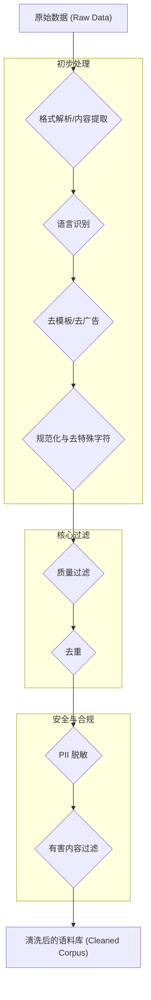

# 第4章：数据是王道：LLM训练的数据收集、清洗与处理实战 (**Fueling the Beast: Mastering Data Engineering for High-Quality LLM Training**)

> "Garbage in, garbage out." —— George Fuechsel

在大规模语言模型 (LLM) 的世界里，数据不仅仅是燃料，更是塑造模型能力、决定其上限的基石。模型的智能并非凭空产生，而是从海量、高质量的数据中学习而来。没有精心准备的数据，再先进的算法、再强大的算力也难以训练出真正强大的 LLM。本章将深入探讨 LLM 训练背后的数据工程，从数据的源头活水讲起，涵盖数据收集、清洗、过滤、Tokenization，以及构建不同阶段数据集的最佳实践，最后还会讨论数据相关的伦理风险。掌握这些数据处理的"内功"，是成功训练高性能 LLM 的前提。

---

## 4.1 数据的源头活水：网络、书籍、代码 - 多样化语料库的构建

LLM 的强大能力源于其接触到的数据的广度与深度。构建一个高质量、多样化的预训练语料库是训练的基础。其来源通常是异构的，需要从多个渠道汇集。

### 4.1.1 网络数据：广阔但需要精炼

互联网是获取大规模文本数据的最主要来源。常见的网络数据源包括：

1.  **通用网络爬取 (Common Crawl)** :
    *   **简介**: Common Crawl 是一个公开的网络存档项目，包含了数十亿个网页的原始数据 (WARC 格式)。它是许多大型 LLM（如 GPT-3, T5, Llama）预训练数据的重要组成部分。
    *   **优点**: 数据量极其庞大，覆盖面广。
    *   **挑战**: 原始数据质量参差不齐，包含大量噪声（HTML 标签、广告、模板化内容、低质量文本、重复内容等），需要复杂的清洗流程。语言种类繁多，需要进行语言识别和筛选。
    *   **获取与处理**: 可以通过其提供的索引和工具下载特定时间段、特定域名的子集。处理通常涉及 WARC 文件解析、内容提取、语言识别、初步过滤等步骤。

2.  **维基百科 (Wikipedia)** :
    *   **简介**: 高质量的多语言百科全书，文本内容经过同行评审，结构化程度较高。
    *   **优点**: 知识性强，事实准确性相对较高，覆盖领域广泛，多语言版本丰富。
    *   **挑战**: 规模相对于 Common Crawl 较小，内容风格偏向于客观陈述。
    *   **获取与处理**: 可以下载官方提供的 Dump 文件 (XML 格式)，然后使用工具（如 `WikiExtractor`）提取纯文本内容。

3.  **特定领域网站与论坛**:
    *   **例如**: Reddit (社交讨论)、StackExchange (问答)、GitHub (代码及相关讨论)、arXiv (学术论文)、古登堡计划 (Project Gutenberg, 公版书籍) 等。
    *   **优点**: 包含特定风格或领域的知识（对话、代码、科学文献、文学作品），可以弥补通用爬取数据的不足，提升模型在特定领域的能力。
    *   **挑战**: 需要针对性地编写爬虫或使用 API 获取数据，数据格式各异，需要单独处理。可能涉及版权和使用条款问题。

### 4.1.2 书籍：深度与结构化的知识

书籍是高质量长文本的重要来源，有助于模型学习连贯性、叙事结构和深入的知识。

1.  **来源**:
    *   **公版书籍**: 如古登堡计划 (Project Gutenberg)、Google Books 中的部分公开书籍。
    *   **数字化图书馆**: 如 Internet Archive。
    *   **商业合作**: 与出版社或版权机构合作获取授权。 (例如 Google 用于训练 PaLM 的 BooksCorpus)
2.  **优点**: 文本质量高，语法规范，逻辑性强，包含丰富的故事和知识体系。
3.  **挑战**: 版权问题是主要障碍，获取大规模、多样化的书籍语料库非常困难。OCR（光学字符识别）的质量可能影响数字化书籍的可用性。

### 4.1.3 代码：逻辑与结构的新维度

代码数据对于训练 LLM 理解编程语言、生成代码、进行代码相关的问答至关重要。

1.  **来源**:
    *   **GitHub**: 最大的开源代码托管平台，包含海量的公开代码库、Issue 讨论、Pull Request 等。
    *   **Stack Overflow**: 大量的编程问答。
    *   **其他代码库**: GitLab, Bitbucket 等。
2.  **优点**: 提升模型在编程任务上的表现，学习代码的结构、逻辑和常用模式。代码相关的自然语言描述（注释、文档、讨论）也有助于模型理解代码意图。
3.  **挑战**: 需要有效过滤低质量或重复代码，处理不同编程语言的语法。从代码库中提取有意义的上下文（如 Issue 和对应的代码变更）需要复杂处理。

### 4.1.4 其他来源

*   **新闻**: 提供时事信息和正式语言风格。
*   **对话数据**: 如电影字幕、聊天记录（需注意隐私），用于提升模型的对话能力。
*   **学术论文**: arXiv 等，提供严谨的科学和技术知识。

### 4.1.5 构建多样化语料库的原则

*   **多样性**: 混合不同来源、不同领域、不同风格的数据至关重要。过度依赖单一来源会导致模型能力偏科。例如，仅使用维基百科训练的模型可能在对话或创意写作方面表现不佳。
*   **质量优先**: 虽然数据量很重要，但低质量数据会严重损害模型性能。需要在数据量和质量之间取得平衡，并投入大量精力进行数据清洗（详见 4.2 节）。
*   **语言平衡**: 对于多语言模型，需要注意不同语言数据的比例，避免低资源语言效果过差。
*   **数据权重**: 不同的数据源在混合时可以赋予不同的权重。例如，可能会给高质量的书籍和维基百科数据更高的权重。Llama 系列模型就公布了其数据混合比例。

**示例：Llama 2 预训练数据混合比例（示意）**

| 数据源        | 比例    | 备注                       |
| :------------ | :------ | :------------------------- |
| Common Crawl  | ~67%    | 经过大量清洗和去重       |
| C4            | ~15%    | Common Crawl 的一个清洗版本 |
| GitHub        | ~4.5%   | 开源的非代码部分           |
| Wikipedia     | ~4.5%   | 多语言版本                 |
| Books         | ~4.5%   | 主要来自 Project Gutenberg  |
| ArXiv         | ~2.5%   | 科学论文                   |
| StackExchange | ~2%     | 技术问答                   |
| ...           | ...     |                            |

*注意：具体比例可能随模型版本变化，此处仅为示意。*

构建多样化语料库是一个持续迭代、需要大量工程投入的过程。选择何种数据源、如何组合它们，直接影响了最终训练出的 LLM 的特性和能力。

## 4.2 数据淘金术：从原始数据到可用语料的清洗与过滤技术

原始数据往往充满了噪声和冗余，直接用于训练会严重影响模型效果，甚至引入偏见和安全风险。因此，数据清洗和过滤是预训练流程中至关重要的一环，其目标是提高数据质量、减少噪声、去除有害内容。这个过程复杂且耗时，但对模型性能的提升是显著的。

### 4.2.1 常见的数据噪声与问题

*   **HTML/XML 标签**: 网页爬取数据中常见的 `<p>`, `<div>`, `<a>` 等标签。
*   **模板化内容**: 网站页眉、页脚、导航栏、广告、版权声明等重复出现的非核心内容。
*   **特殊字符与乱码**: 编码错误、非标准字符、控制字符等。
*   **低质量文本**: 语法错误、拼写错误、无意义字符序列（"lorem ipsum"）、过短或过长的句子/文档。
*   **重复内容**: 完全相同或高度相似的文档、段落或句子。这会导致模型在训练时对重复内容过拟合，浪费计算资源。
*   **非目标语言**: 爬取的网页可能包含多种语言，需要识别并筛选出目标语言。
*   **有害内容**: 仇恨言论、歧视性内容、暴力、成人内容等。
*   **个人身份信息 (PII)** : 姓名、地址、电话号码、邮箱、身份证号等敏感信息。

### 4.2.2 清洗与过滤流程 (Pipeline)

数据清洗通常是一个多阶段的流程，顺序和具体采用的技术可能因数据源和目标而异。以下是一个典型的流程示例：



**1. 格式解析与内容提取 (Parsing & Content Extraction)** :
*   **目标**: 从原始格式（如 WARC, HTML, XML, PDF）中提取纯文本内容。
*   **方法**:
    *   使用库（如 `BeautifulSoup`, `lxml` for HTML/XML, `warcio` for WARC）解析文档结构。
    *   利用启发式规则或机器学习模型（如 `trafilatura`, `readability-lxml`）识别并提取主要文本内容，去除导航、广告等非核心部分。
    *   对于 PDF，使用 `PyMuPDF`, `pdfminer.six` 等工具提取文本，可能需要处理 OCR 结果。

**2. 语言识别 (Language Identification)** :
*   **目标**: 确定文本的主要语言，过滤掉非目标语言的文档。
*   **方法**:
    *   使用快速准确的库，如 `fastText` (提供预训练的语言识别模型), `pycld2`, `langdetect`。
    *   通常会设定一个置信度阈值，只保留高概率属于目标语言的文本。

**3. 去模板/去广告 (Boilerplate/Ad Removal)** :
*   **目标**: 移除网页中常见的重复模板内容。
*   **方法**:
    *   基于 DOM 结构分析：识别常见的页眉、页脚、侧边栏模式。
    *   基于内容重复度：统计 N-gram 或句子在大量文档中的出现频率，移除高频模板化内容。
    *   利用 `trafilatura` 等库的内置功能。

**4. 规范化与去特殊字符 (Normalization & Character Filtering)** :
*   **目标**: 统一文本格式，去除无效或干扰字符。
*   **方法**:
    *   Unicode 规范化 (e.g., NFKC)。
    *   移除控制字符、不可见字符。
    *   处理或移除乱码。
    *   统一标点符号（全角转半角等，视需求而定）。

**5. 质量过滤 (Quality Filtering)** :
*   **目标**: 移除低质量、无意义或不符合要求的文本。这是提升数据质量的关键步骤。
*   **方法 (启发式规则)** :
    *   **长度过滤**: 移除过短（可能无意义）或过长（可能异常）的文档/句子。
    *   **符号/数字比例**: 移除符号或数字占比过高的文本（可能是代码、表格数据或噪声）。
    *   **词汇丰富度**: 计算类型标记比率 (Type-Token Ratio, TTR) 或使用更复杂的指标，移除词汇贫乏的文本。
    *   **可读性指标**: 如 Flesch Reading Ease，过滤掉难以理解的文本（视应用场景而定）。
    *   **停用词比例**: 检查常见停用词的比例是否在正常范围内。
    *   **重复词/短语**: 检查文本内部是否有过多重复。
    *   **大写字母比例**: 过滤掉过多大写字母的文本（可能是喊叫或格式错误）。
*   **方法 (基于模型)** :
    *   **困惑度 (Perplexity)** : 使用一个预训练好的小型语言模型计算文本的困惑度，过滤掉困惑度过高（即不符合语言模型预测模式）的文本。这是 GPT-3 等模型使用的关键技术之一。
    *   **分类器**: 训练一个分类器来判断文本质量（例如，区分维基百科级别的文本和低质量论坛帖子）。

**6. 去重 (Deduplication)** :
*   **目标**: 移除语料库中完全相同或高度相似的文档、段落甚至句子，避免模型在训练中过多关注重复信息。
*   **方法**:
    *   **精确去重**: 计算文档的哈希值（如 MD5, SHA-256），移除哈希值相同的文档。简单高效，但只能去除完全相同的重复。
    *   **近似去重 (Near-Deduplication)** :
        *   **MinHash + LSH (Locality-Sensitive Hashing)** : 将文档表示为 N-gram 集合，使用 MinHash 计算签名的近似表示，再通过 LSH 将可能相似的文档放入同一个桶中进行比较。适用于大规模数据集。
        *   **SimHash**: 另一种 LSH 技术，将文档映射为一个指纹（哈希值），相似文档的指纹具有较小的汉明距离。
    *   **粒度**: 可以在不同粒度上进行去重：
        *   **文档级 (Document-level)** : 最常用，移除重复的整个文档。
        *   **段落级 (Paragraph-level)** : 移除重复的段落，可以保留文档的其他部分。
        *   **句子级 (Sentence-level)** : 更细粒度，但计算成本更高。

**7. PII 脱敏 (PII Redaction/Masking)** :
*   **目标**: 检测并移除或替换文本中的个人身份信息，保护用户隐私，满足法规要求 (如 GDPR, CCPA)。
*   **方法**:
    *   **基于规则**: 使用正则表达式匹配常见的 PII 模式（电话号码、邮箱、身份证号、信用卡号等）。准确率有限，容易漏报或误报。
    *   **基于命名实体识别 (NER)** : 训练或使用预训练的 NER 模型来识别 PER (Person), LOC (Location), ORG (Organization) 等实体，并特别关注与 PII 相关的实体类型。准确率更高，但需要高质量的标注数据或模型。
    *   **处理方式**: 可以直接删除 PII，或用特殊标记（如 `<PII_REDACTED>`）替换。

**8. 有害内容过滤 (Toxic Content Filtering)** :
*   **目标**: 检测并移除仇恨言论、歧视、暴力、成人内容等，降低模型生成有害输出的风险。
*   **方法**:
    *   **关键词/黑名单**: 维护一个包含有害词汇或短语的列表，过滤包含这些词汇的文本。简单但容易规避（如变体、拼写错误）。
    *   **基于分类器**: 训练一个文本分类模型来识别不同类型的有害内容。可以使用公开的预训练模型（如 Google Perspective API 背后的模型）或自行训练。需要大量的标注数据，并且对模型的鲁棒性要求很高。
    *   **多阶段过滤**: 结合使用关键词和分类器。

**实践中的挑战**:

*   **平衡**: 清洗规则过于严格可能会误删大量有用数据，过于宽松则无法有效去除噪声。需要仔细调整阈值和策略。
*   **计算成本**: 去重（尤其是近似去重）和基于模型的过滤方法计算量巨大，需要高效的实现和分布式计算框架（如 Spark, Dask）。
*   **语言特性**: 清洗策略需要考虑不同语言的特点。
*   **迭代优化**: 数据清洗不是一次性的过程，通常需要根据模型训练过程中的反馈（如损失曲线、评估结果、人工检查生成样本）来不断调整和优化清洗策略。

高质量的数据是 LLM 成功的关键，而数据清洗和过滤正是实现这一目标的核心手段。虽然过程繁琐且充满挑战，但其带来的回报——一个更稳定、更有效、更安全的 LLM——是无价的。

## 4.3 Tokenization 深度指南：BPE, WordPiece, SentencePiece 原理与高效实现

语言模型无法直接处理原始的字符串文本，需要先将文本分割成一个个基本单元，称为 **Token**，然后将这些 Token 转换为模型可以理解的数字表示（通常是整数 ID）。这个将文本分割成 Token 的过程就是 **Tokenization**。选择合适的 Tokenization 算法对于 LLM 的性能、词汇表大小、处理未登录词 (Out-of-Vocabulary, OOV) 的能力以及计算效率都至关重要。

现代 LLM 普遍采用 **子词 (Subword)** Tokenization 算法，它介于词级别 (Word-level) 和字符级别 (Character-level) Tokenization 之间，旨在平衡词汇表大小和表示能力。常见的子词算法包括 BPE, WordPiece, 和 SentencePiece。

### 4.3.1 为何需要子词 Tokenization？

*   **词级别 Tokenization 的问题**:
    *   **词汇表爆炸**: 对于英语这样形态变化丰富的语言，或中文这样字符组合灵活的语言，词汇量可能非常庞大，导致模型参数量剧增。
    *   **未登录词 (OOV) 问题** : 训练语料中未出现过的词（如新词、专有名词、拼写错误）无法处理，通常会被映射到一个特殊的 `<UNK>` (Unknown) Token，丢失了词本身的信息。
*   **字符级别 Tokenization 的问题**:
    *   **序列过长**: 将文本切分成单个字符会导致输入序列变得非常长，增加了计算负担，尤其是对于 Transformer 这种计算复杂度与序列长度平方相关的模型。
    *   **丢失语义单元**: 单个字符通常不具备完整的语义，模型需要学习从字符组合中推断意义，增加了学习难度。

**子词 Tokenization 的优势**:

*   **平衡词汇表大小和序列长度**: 通过将词拆分成更小的、有意义的子词单元，可以有效控制词汇表的大小，同时序列长度不会像字符级别那样过长。
*   **处理 OOV**: 对于未登录词，可以通过组合已有的子词来表示，而不是简单地映射为 `<UNK>`。例如，"tokenization" 可能被拆分为 "token" 和 "ization"。
*   **共享统计信息**: 相关的词（如 "run", "running", "ran"）可以共享相同的子词（如 "run"），使得模型更容易学习它们之间的关系。
*   **跨语言适应性**: 对于多种语言，子词算法通常比词级别更具通用性。

### 4.3.2 字节对编码 (Byte Pair Encoding, BPE)

BPE 最初是一种数据压缩算法，后来被应用于 NLP 中进行子词切分。其核心思想是 **迭代地合并最高频的相邻字节对 (或字符对)** 。

**训练过程**:

1.  **预分词 (Pre-tokenization)** : 将输入语料库按空格或其他规则（如标点符号）初步分割成单词。同时，在每个单词末尾添加一个特殊后缀（如 `</w>`）来标记单词边界。
2.  **初始化词汇表**: 词汇表初始包含所有出现在预分词结果中的单个字符。
3.  **迭代合并**:
    *   统计语料库中所有相邻 Token 对的出现频率。
    *   找出频率最高的 Token 对 (e.g., `('t', 'h')`)。
    *   将这个最高频对合并成一个新的 Token (e.g., `'th'`)，并将其添加到词汇表中。
    *   用新生成的 Token 替换语料库中所有出现的该 Token 对。
4.  **重复步骤 3**: 直到达到预设的词汇表大小 (Vocabulary Size) 或没有新的合并可以进行。

**Tokenize 过程**:

1.  对输入文本进行同样的预分词和添加单词边界标记。
2.  将每个单词拆分成单个字符。
3.  按照训练时学到的合并规则（通常按合并优先级排序），依次将单词中的相邻子词进行合并，直到无法再进行合并为止。

**示例**:

假设词汇表大小为 10，初始词汇表为 `{'l', 'o', 'w', 'n', 'e', 'r', '</w>', 's', 't'}`。
语料库（预分词后）为: `low</w>`, `lower</w>`, `newest</w>`, `lowest</w>`

*   **迭代 1**: 最高频对是 `('l', 'o')` -> 合并成 `'lo'`。词汇表: `{'l', 'o', 'w', 'n', 'e', 'r', '</w>', 's', 't', 'lo'}`。语料库变为: `lo w</w>`, `lo w e r</w>`, `n e w e s t</w>`, `lo w e s t</w>`
*   **迭代 2**: 最高频对是 `('e', 's')` -> 合并成 `'es'`。词汇表增加 `'es'`。
    ... (继续合并，如 `('es', 't')`, `('lo', 'w')`, `('new', 'est')` 等，直到达到词汇表大小限制)

**优点**: 简单有效，能较好地平衡词汇表大小和 OOV 处理。
**缺点**:
*   可能产生并非语言学上有意义的子词。
*   贪心合并策略不一定是最优的。
*   对于同一个词，可能存在多种切分方式（Segmentation Ambiguity），BPE 总是选择最长匹配（应用合并规则）。

**应用**: GPT-2, GPT-3, RoBERTa 等。

### 4.3.3 WordPiece

WordPiece 与 BPE 非常相似，主要由 Google 开发并用于 BERT 和 T5 等模型。其核心区别在于 **合并标准**。

*   **BPE 合并标准**: 选择频率最高的相邻 Token 对。
*   **WordPiece 合并标准**: 选择能够 **最大化训练数据似然概率 (Likelihood)**  的 Token 对进行合并。

**训练过程**:

1.  初始化词汇表（包含所有单个字符）。
2.  使用当前词汇表和简单的语言模型（如 unigram 模型）计算训练数据的似然概率。
3.  尝试所有可能的合并，计算每种合并对数据似然概率的提升。
4.  选择提升最大的那个合并操作，更新词汇表。
5.  重复步骤 3-4，直到达到词汇表大小或似然概率增益低于阈值。

**Tokenize 过程**:

对于一个单词，WordPiece 会尝试找到能覆盖整个单词的最长子词序列。通常在单词前加特殊前缀（如 `##`）来表示这个子词不是单词的开头。

**示例**: "tokenization" 可能被切分为 `['token', '##ization']`。

**优点**: 相较于 BPE，WordPiece 的合并标准更倾向于保留语言学上更常见的组合，可能产生质量稍高的子词。
**缺点**: 训练过程比 BPE 复杂。

**应用**: BERT, DistilBERT, T5, Electra。

### 4.3.4 SentencePiece

SentencePiece 是 Google 开发的另一种子词 Tokenization 工具，旨在解决 BPE 和 WordPiece 的一些局限性，特别是 **对预分词的依赖** 和 **非确定性切分** 问题。

**核心特点**:

1.  **直接在原始文本上操作**: SentencePiece 将输入视为一个原始的 Unicode 字符序列，**不需要预分词器**。空格也被视为一种普通字符（通常用 ` ` (U+2581) 表示）。这使得它对语言的依赖性更小，尤其适用于没有明确单词边界的语言（如中文、日文、韩文）。
2.  **集成了多种子词算法**: SentencePiece 实现了 BPE 和 Unigram Language Model 两种主要的子词切分算法。
    *   **Unigram Language Model**:
        *   假设每个子词都是独立产生的。
        *   从一个较大的候选子词集合开始。
        *   迭代地移除那些对整体数据似然概率影响最小的子词，直到达到目标词汇表大小。
        *   Tokenize 时，使用 Viterbi 算法找到概率最大的子词序列来切分单词。
3.  **可逆性 (Lossless)** : `tokenize(detokenize(text)) == text`。由于空格被显式处理，可以将 Token 序列完美地还原回原始文本。
4.  **支持采样和 N-best 切分**: 对于一个单词，可能存在多种切分方式。Unigram 模型可以计算每种切分的概率，SentencePiece 支持在 Tokenize 时进行采样（根据概率选择一种切分）或输出 N 种概率最高的切分方式。这在训练中可以作为一种数据增强手段（称为 Subword Regularization），提高模型的鲁棒性。

**优点**:
*   无需预分词，语言无关性强。
*   可逆，便于处理。
*   支持 Unigram 模型，提供了不同于 BPE/WordPiece 的切分逻辑。
*   支持 Subword Regularization。

**缺点**: Unigram 模型训练相对复杂。

**应用**: XLNet, T5 (也用了 WordPiece), ALBERT, Llama, PaLM, Gemini。

### 4.3.5 Tokenizer 的训练与使用

主流的深度学习框架（如 PyTorch, TensorFlow）通常不直接内置 Tokenizer 训练功能，但有很多优秀的第三方库可以使用：

1.  **Hugging Face `tokenizers` 库**:
    *   **简介**: 目前最流行、功能最全面的 Tokenizer 库之一，由 Hugging Face 开发。
    *   **特点**:
        *   使用 Rust 编写，速度极快。
        *   提供了 BPE, WordPiece, Unigram (SentencePiece) 等多种算法的实现。
        *   可以方便地训练、保存、加载 Tokenizer。
        *   与 `transformers` 库无缝集成。
        *   包含预分词器、范化器、后处理器等丰富组件，可定制化程度高。
    *   **使用示例 (训练 BPE)**:
        ```python
        from tokenizers import Tokenizer
        from tokenizers.models import BPE
        from tokenizers.trainers import BpeTrainer
        from tokenizers.pre_tokenizers import Whitespace

        # 1. 初始化 Tokenizer
        tokenizer = Tokenizer(BPE(unk_token="[UNK]"))

        # 2. 设置预分词器 (按空格切分)
        tokenizer.pre_tokenizer = Whitespace()

        # 3. 设置训练器 (指定词汇表大小和特殊 Token)
        trainer = BpeTrainer(vocab_size=30000, special_tokens=["[UNK]", "[CLS]", "[SEP]", "[PAD]", "[MASK]"])

        # 4. 准备训练文件列表
        files = ["path/to/your/corpus.txt", ...] # 可以是很大的文件

        # 5. 开始训练
        tokenizer.train(files, trainer)

        # 6. 保存 Tokenizer
        tokenizer.save("my-bpe-tokenizer.json")

        # 7. 加载和使用
        tokenizer = Tokenizer.from_file("my-bpe-tokenizer.json")
        output = tokenizer.encode("Hello, y'all! How are you 😁 ?")
        print(output.tokens)
        # ['Hello', ',', 'y', "'", 'all', '!', 'How', 'are', 'you', '[UNK]', '?'] # 示例输出，实际会根据训练结果切分
        print(output.ids)
        # [ID_Hello, ID_,, ID_y, ID_apostrophe, ID_all, ID_!, ID_How, ID_are, ID_you, ID_UNK, ID_?]
        decoded = tokenizer.decode(output.ids)
        print(decoded)
        # Hello , y ' all ! How are you [UNK] ?
        ```

2.  **SentencePiece 库**:
    *   **简介**: Google 官方实现的 SentencePiece。
    *   **特点**:
        *   命令行工具和 Python API。
        *   专注于 SentencePiece 的 BPE 和 Unigram 算法。
    *   **使用示例 (训练 Unigram)**:
        ```bash
        # 训练
        spm_train --input=corpus.txt --model_prefix=my_spm_model --vocab_size=32000 --model_type=unigram --character_coverage=0.9995 --normalization_rule_name=nmt_nfkc_cf

        # 使用 Python
        import sentencepiece as spm

        sp = spm.SentencePieceProcessor(model_file='my_spm_model.model')

        tokens = sp.encode("Hello world.", out_type=str)
        print(tokens) # [' He', 'll', 'o', ' ', 'w', 'or', 'ld', '.'] (示例)

        ids = sp.encode("Hello world.", out_type=int)
        print(ids) # [IDs...]

        decoded = sp.decode(ids)
        print(decoded) # Hello world.
        ```

### 4.3.6 选择与考量

*   **性能**: Hugging Face `tokenizers` 通常性能最佳。
*   **算法**: BPE 实现简单，Unigram/SentencePiece 语言无关性更好。WordPiece 在 BERT 系列中广泛使用。现代 LLM（如 Llama）倾向于使用 SentencePiece (通常是其 BPE 实现)。
*   **词汇表大小**: 需要权衡。太小可能导致序列过长，太大则增加 Embedding 层参数。常见大小在 30k 到 100k+ 不等。需要根据目标语言、语料库大小和模型规模来实验确定。
*   **特殊 Token**: 需要定义好 `<UNK>`, `<PAD>`, `<BOS>` (Beginning of Sequence), `<EOS>` (End of Sequence), 以及可能用于特定任务的 Token (如 `<CLS>`, `<SEP>`, `<MASK>`)。
*   **标准化**: Unicode 标准化 (NFC, NFKC) 和大小写处理等步骤会影响 Tokenization 结果，需要保持训练和推理时的一致性。

Tokenization 是 LLM 输入管道的第一步，也是非常关键的一步。选择和训练一个合适的 Tokenizer 对于模型的最终性能有着不可忽视的影响。理解不同子词算法的原理和优缺点，并掌握如何使用相关工具进行训练和应用，是 LLM 实践中的一项基本功。

## 4.4 精心调配：构建预训练、微调与指令数据集的最佳实践

LLM 的训练通常不是一步到位的过程，而是分为多个阶段，每个阶段使用的数据集类型和目标都有所不同。主要包括预训练 (Pre-training)、监督微调 (Supervised Fine-tuning, SFT) 和指令微调 (Instruction Fine-tuning)。为每个阶段精心构建和调配数据集是确保模型能力和对齐的关键。

### 4.4.1 预训练数据集 (Pre-training Datasets)

*   **目标**: 让模型学习通用的语言知识、世界知识、语法结构和基本推理能力。这是 LLM 能力的基础来源。
*   **特点**:
    *   **规模**: 极其庞大，通常达到 TB 级别甚至 PB 级别的原始文本数据。数据量是 Scaling Laws 的关键因素之一。
    *   **多样性**: 来源广泛，混合了网页、书籍、代码、论文等多种类型的数据（如 4.1 节所述）。
    *   **无监督/自监督**: 通常不需要人工标注，模型通过预测文本中的缺失部分（如 MLM）或下一个 Token（如 CLM）来学习。
*   **构建要点**:
    *   **数据清洗与过滤**: 如 4.2 节所述，至关重要，直接影响模型质量和安全性。
    *   **数据混合比例**: 不同来源的数据对模型能力的影响不同，需要精心设计混合策略和权重。例如，增加代码数据比例可以提升代码能力。
    *   **去重**: 必须进行严格的文档级甚至段落级去重，避免模型在重复数据上浪费过多算力。
    *   **时间跨度**: 预训练数据通常覆盖较长的时间跨度，以学习历史知识，但也可能包含过时信息。
*   **示例**: C4 (Colossal Clean Crawled Corpus), The Pile, RefinedWeb, Llama 2 Pretraining Dataset。

### 4.4.2 监督微调数据集 (Supervised Fine-tuning, SFT Datasets) - 传统任务

*   **目标**: 使预训练好的模型适应特定的下游任务，例如文本分类、命名实体识别、问答、翻译等。
*   **特点**:
    *   **规模**: 相对于预训练数据集小得多，通常是几千到几十万个样本。
    *   **有监督**: 包含成对的输入和期望输出（标签）。格式通常是 `(输入文本, 目标标签/文本)`。
    *   **任务特定**: 数据集针对某一特定 NLP 任务构建。
*   **构建要点**:
    *   **高质量标注**: 标签的准确性至关重要。
    *   **数据分布**: 微调数据集的分布应尽可能接近实际应用场景的分布。
    *   **格式**: 需要将数据转换成模型微调时接受的输入格式。
*   **示例**: GLUE Benchmark (多任务), SQuAD (抽取式问答), WMT (翻译), IMDB (情感分类)。

### 4.4.3 指令微调数据集 (Instruction Fine-tuning Datasets) - 让模型听懂指令

*   **目标**: 让 LLM 理解并遵循自然语言指令，执行更广泛、更开放的任务，提高模型的 **指令遵循能力 (Instruction Following)**  和 **泛化能力**。这是使 LLM 变得"有用"的关键一步。
*   **特点**:
    *   **格式**: 通常是三元组 `(指令, (可选的)输入, 输出)`。
        *   **指令 (Instruction)** : 描述了模型需要执行的任务 (e.g., "将下面的英文翻译成中文", "写一首关于春天的诗", "总结这段文字")。
        *   **输入 (Input/Context)** : 任务相关的上下文信息 (e.g., 需要翻译的英文句子, 需要总结的段落)。对于不需要额外输入的任务，此项可以为空。
        *   **输出 (Output/Response)** : 模型应该生成的、符合指令要求的回答。
    *   **多样性**: 指令覆盖的任务类型应该尽可能广泛，包括但不限于：开放式问答、文本生成、信息提取、代码生成、推理、头脑风暴、文本改写、分类、对话等。
    *   **质量**: 输出的质量（准确性、相关性、流畅性、安全性）要求很高。
    *   **规模**: 通常比 SFT 数据集大，从几万到几百万不等，但远小于预训练数据。
*   **构建方法**:
    *   **人工编写/标注**: 成本高，但质量可控。需要设计详细的标注指南和质量控制流程。 (e.g., InstructGPT/ChatGPT 部分数据)
    *   **利用现有数据集改造**: 将传统的 NLP 数据集（如 SQuAD, GLUE）转换为指令格式。 (e.g., FLAN, T0)
        *   **示例 (SQuAD 改造)** :
            *   *原始*: (Context: ..., Question: ..., Answer: ...)
            *   *指令化*: (Instruction: "根据提供的上下文回答问题。", Input: "上下文：...\n问题：...", Output: ...)
    *   **利用 LLM 自身生成 (Self-Instruct)** :
        1.  从少量高质量的种子指令开始。
        2.  让一个强大的 LLM (Teacher Model) 基于这些种子指令生成新的、更多样化的指令。
        3.  让 Teacher Model 为新生成的指令提供输入和输出（即完成指令任务）。
        4.  过滤掉低质量或不安全的生成结果。
        5.  用生成的数据微调目标 LLM (Student Model)。 (e.g., Alpaca, Vicuna)
    *   **社区贡献/开源数据集**: 许多高质量的指令数据集被公开，可以直接使用或作为基础进行扩展。 (e.g., Dolly, OpenAssistant Conversations, ShareGPT)
*   **构建要点**:
    *   **指令多样性**: 覆盖不同任务类型、不同难度、不同表达方式。
    *   **输出质量与安全性**: 严格过滤有害、偏见、不准确的输出。这是对齐 (Alignment) 的重要部分。
    *   **输入多样性**: 包含带输入和不带输入的指令。
    *   **思维链 (Chain-of-Thought, CoT)** : 对于需要推理的任务，可以在输出中包含推理步骤，训练模型的 CoT 能力。 (e.g., "指令：... 输出：让我们一步步思考：首先... 然后... 因此答案是...")
*   **示例**: Alpaca, Vicuna, Dolly-15k, OpenAssistant OASST1, FLAN Collection, ShareGPT 数据集。

**数据集调配策略**:

*   **多阶段训练**: 常见的流程是：大规模预训练 -> 指令微调 -> (可选) 偏好对齐 (如 RLHF, 见第 7 章)。
*   **混合训练**: 有时也会将预训练目标和指令微调目标混合在一个训练阶段进行。
*   **持续学习**: 模型部署后，可以收集用户反馈和新的交互数据，持续对模型进行微调和迭代。

**表格：不同阶段数据集对比**

| 特性         | 预训练数据集 (Pre-training)                      | 指令微调数据集 (Instruction FT)                                  |
| :----------- | :----------------------------------------------- | :--------------------------------------------------------------- |
| **目标**     | 通用语言/世界知识学习                             | 指令遵循能力、任务泛化、有用性/安全性对齐                         |
| **规模**     | 巨大 (TB-PB level)                               | 中等到较大 (数万-数百万样本)                                      |
| **监督性**   | 无/自监督 (MLM, CLM)                             | 有监督 (Instruction, Input, Output)                              |
| **数据格式** | 纯文本                                           | 结构化指令 (Instruction, Input, Output)                          |
| **多样性**   | 数据来源多样 (Web, Books, Code...)                 | 任务/指令类型多样 (QA, Gen, Code, Rewrite...)                  |
| **质量要求** | 重视清洗、去重、去噪                              | 重视输出的准确性、相关性、流畅性、安全性、指令遵循度                |
| **构建方法** | 爬取、清洗、过滤、混合                            | 人工编写、数据集改造、Self-Instruct、开源                           |
| **关键挑战** | 规模、清洗效率、计算成本                          | 指令多样性、输出质量控制、标注成本/Self-Instruct 偏差             |

为 LLM 的不同训练阶段准备和调配高质量的数据集是一项复杂但极其重要的工程任务。理解每个阶段的目标和数据需求，并采用合适的构建策略，是训练出强大、有用且值得信赖的 LLM 的关键所在。

## 4.5 数据的伦理边界：认识并缓解训练数据中的偏见、毒性与隐私风险

虽然数据是训练 LLM 的宝贵资源，但它们也可能携带并放大现实世界中存在的各种问题，如社会偏见、有害内容和隐私泄露。在 LLM 的数据工程中，认识、评估并努力缓解这些伦理风险至关重要，这直接关系到模型的公平性、安全性和可信赖性。

### 4.5.1 数据中的偏见 (Bias in Data)

*   **来源**:
    *   **社会偏见**: 训练数据（尤其是来自互联网的大规模文本）反映了社会中存在的刻板印象、歧视性观点（针对性别、种族、宗教、地域、职业等）。模型在学习语言模式的同时，也会习得这些偏见。
    *   **选择偏见**: 数据收集过程可能倾向于某些群体或来源，导致代表性不足。例如，如果训练数据主要来自西方国家，模型可能对其他文化背景的理解不足。
    *   **标注偏见**: 在需要人工标注的阶段（如指令微调、奖励建模），标注员自身的偏见或理解差异可能引入新的偏见。
*   **后果**:
    *   生成带有刻板印象或歧视性的内容。
    *   在不同群体上表现出不公平的性能差异。
    *   强化现实世界的不平等。
*   **缓解策略**:
    *   **数据源审计与筛选**: 评估并选择更多元化、代表性更广的数据来源。识别并尝试过滤掉包含明显偏见的内容（非常困难）。
    *   **数据平衡与增强**: 针对代表性不足的群体，可以尝试过采样 (Oversampling) 其相关数据，或使用数据增强技术生成更多样本。
    *   **偏见指标检测**: 使用特定的基准测试（如 [Bias Benchmark for QA (BBQ)](https://github.com/nyu-mll/BBQ), [StereoSet](https://stereoset.mit.edu/)）来量化模型在不同维度上的偏见程度。
    *   **去偏技术 (Debiasing Techniques)** :
        *   **数据层面**: 对词嵌入进行去偏处理，或修改训练样本以减少偏见关联。
        *   **模型层面**: 在训练目标中加入约束项，惩罚与受保护属性（如性别、种族）相关的预测。
        *   **后处理**: 对模型生成的内容进行过滤或修改，移除偏见信息。
    *   **标注指南与培训**: 为标注员提供清晰的指南，强调公平性原则，减少标注过程中的主观偏见。

### 4.5.2 数据中的毒性 (Toxicity in Data)

*   **来源**: 互联网数据中充斥着仇恨言论、网络欺凌、侮辱性语言、暴力威胁等有害内容。
*   **后果**:
    *   模型可能生成或"鹦鹉学舌"般重复这些有害内容。
    *   被恶意用户利用来生成大规模的有害信息。
*   **缓解策略**:
    *   **严格的有害内容过滤**: 在数据清洗阶段（见 4.2.8 节）使用关键词、黑名单和基于模型的分类器来检测并移除有害文本。这是最直接有效的方法。
    *   **安全微调 (Safety Fine-tuning)** : 使用专门构建的安全数据集进行微调，训练模型拒绝生成有害内容或对有害提示做出安全的回应。这通常是指令微调和对齐阶段的一部分。
    *   **内容审核 API**: 对模型的输入和输出使用外部的内容审核工具（如 Perspective API）进行实时检测和过滤。
    *   **解毒技术 (Detoxification)** : 研究如何在保留模型通用能力的同时，降低其生成有害内容的倾向。

### 4.5.3 数据中的隐私风险 (Privacy Risks in Data)

*   **来源**:
    *   **个人身份信息 (PII)** : 训练数据可能无意中包含用户的姓名、地址、电话、邮箱、医疗记录等敏感信息。
    *   **去匿名化风险**: 即使数据经过初步匿名化，结合其他信息仍可能重新识别出个人。
    *   **模型记忆 (Memorization)** : LLM 可能在训练过程中"记住"某些罕见的训练样本（特别是 PII 或独特的文本序列），并在生成时无意中泄露出来。这在大型模型中尤其需要关注。
*   **后果**:
    *   泄露用户隐私，违反数据保护法规（如 GDPR, CCPA）。
    *   损害用户信任和机构声誉。
*   **缓解策略**:
    *   **PII 脱敏**: 在数据清洗阶段严格执行 PII 检测和移除/替换（见 4.2.7 节）。
    *   **差分隐私 (Differential Privacy, DP)** :
        *   **概念**: 在数据处理或模型训练过程中引入随机噪声，使得模型的输出结果对单个训练样本的变化不敏感，从而提供数学上可证明的隐私保护。
        *   **应用**: 可以在数据发布前对数据聚合结果应用 DP，或者在模型训练（特别是梯度更新）时应用 DP (e.g., DP-SGD)。
        *   **挑战**: DP 通常会牺牲一定的模型效用（准确性），需要在隐私保护程度和模型性能之间进行权衡。实现和调整 DP 训练也比较复杂。
    *   **数据最小化原则**: 只收集和使用完成任务所必需的最少数据。
    *   **访问控制与安全**: 严格控制对原始训练数据的访问权限。
    *   **模型审计与检测**: 开发技术来检测模型是否记忆了敏感训练数据（例如，通过特定的提示探测）。

### 4.5.4 伦理考量的持续性

数据伦理不是一个可以在数据准备阶段一次性解决的问题，而是一个贯穿 LLM 生命周期（数据收集、训练、评估、部署、监控）的持续性挑战。

*   **透明度**: 尽可能地记录和公开数据来源、处理方法和已知的局限性（如 Datasheets for Datasets, Model Cards）。
*   **多方参与**: 邀请不同背景的专家（伦理学家、社会学家、法律专家）参与数据治理和模型评估。
*   **红队测试 (Red Teaming)** : 主动模拟恶意用户，探测模型在偏见、毒性、隐私方面的漏洞。
*   **迭代改进**: 根据模型在实际应用中的表现和用户反馈，持续监控和改进数据处理策略和模型行为。

**总结**:

数据是 LLM 的基石，但也可能成为风险的源头。在追求模型性能的同时，必须高度重视并积极应对数据中潜藏的偏见、毒性和隐私风险。通过严格的数据清洗过滤、采用先进的缓解技术（如去偏、解毒、差分隐私）、建立完善的治理流程并持续迭代，我们才能朝着构建更公平、更安全、更值得信赖的 AI 的目标迈进。这不仅是技术挑战，更是重要的社会责任。

---
**(本章完)** 