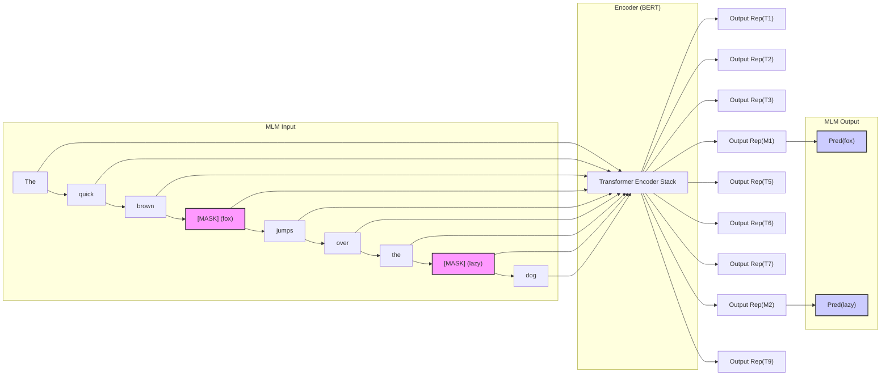
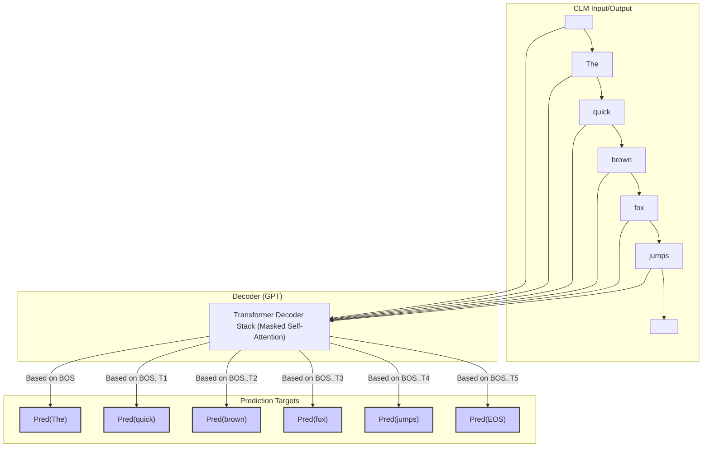

# 第5章：模型之始：预训练目标、流程与基础实践 (Igniting the Spark: Fundamentals of Pre-training Language Models)

经过第 4 章对数据工程的深入探讨，我们已经准备好了高质量的燃料。现在，是时候点燃引擎，启动大规模语言模型的预训练过程了。预训练是 LLM 获取其惊人能力的基石，它通过在海量无标注文本上进行自监督学习，让模型掌握语言的内在规律、世界知识以及一定的推理能力。本章将聚焦于预训练的核心要素：定义模型需要学习的目标（预训练任务），设置训练启动的关键参数（优化器、学习率等），监控训练过程并评估模型性能的指标，了解所需的硬件基础，以及确保训练稳定性的关键技巧。最后，我们将通过一个简化的动手实践环节，初步体验预训练脚本的构建与运行。

---

## 5.1 定义学习目标：MLM, CLM, T5-style Span Corruption 等预训练任务详解

预训练的核心在于设计一个 **自监督学习任务 (Self-supervised Learning Task)** ，让模型能够从未标注的文本数据中自动生成学习信号。不同的预训练任务塑造了模型不同的特性，适用于不同的架构（Encoder-Only, Decoder-Only, Encoder-Decoder）。

### 5.1.1 掩码语言模型 (Masked Language Modeling, MLM)

*   **提出者**: BERT ([Bidirectional Encoder Representations from Transformers](https://arxiv.org/abs/1810.04805))
*   **核心思想**: 在输入文本序列中，随机地 **遮盖 (Mask)** 一部分 Token（通常替换为特殊的 `[MASK]` Token，或随机替换成其他 Token，或保持不变），然后让模型 **预测这些被遮盖的原始 Token**。
*   **目标函数**: 通常是预测被遮盖位置 Token 的交叉熵损失 (Cross-Entropy Loss)。只计算被 Mask 位置的损失。
*   **过程**:
    1.  输入序列: `The quick brown [MASK] jumps over the [MASK] dog.`
    2.  模型 (通常是 Encoder-Only 架构如 BERT) 需要利用 **双向上下文信息 (Bidirectional Context)** 来预测 `[MASK]` 位置的词。
    3.  预测: 第一个 `[MASK]` -> `fox`, 第二个 `[MASK]` -> `lazy`。
*   **优点**:
    *   能够充分利用双向上下文信息，对于理解型任务（如文本分类、命名实体识别、问答）非常有效。
    *   训练信号相对密集（每步可以预测多个 Mask）。
*   **缺点**:
    *   引入了 `[MASK]` Token，导致 **预训练与下游微调（或推理）之间存在不匹配 (Mismatch)** ，因为下游任务通常没有 `[MASK]`。BERT 通过 80%-10%-10% 的策略（80% 替换为 `[MASK]`, 10% 随机替换, 10% 保持不变）来缓解这个问题。
    *   **计算效率相对较低**: 每次只预测被 Mask 的 Token (通常占 15%)，而不是序列中的所有 Token。
    *   **不直接适用于文本生成**: 由于其双向性和 Mask 机制，不适合自回归地生成文本。
*   **变种**:
    *   **RoBERTa**: 对 BERT 的 MLM 进行了改进，例如使用动态 Masking（每个 Epoch 重新生成 Mask 位置），更大的 Batch Size，移除 NSP 任务等。
    *   **SpanBERT**: Mask 连续的 Span 而不是单个 Token，并让模型基于 Span 边界的表示来预测被 Mask 的内容。
*   **适用架构**: 主要用于 Encoder-Only 模型 (如 BERT, RoBERTa, ALBERT, ELECTRA)。



### 5.1.2 因果语言模型 (Causal Language Modeling, CLM) / 标准语言模型 (Standard LM)

*   **核心思想**: 基于 **前面的 Token 序列**，预测 **下一个 Token**。这是一种 **自回归 (Autoregressive)** 的过程。
*   **目标函数**: 通常是预测序列中每个位置下一个 Token 的交叉熵损失之和 (或平均值)。
*   **过程**:
    1.  输入序列: `<BOS> The quick brown fox`
    2.  模型 (通常是 Decoder-Only 架构如 GPT) 需要利用 **单向上下文信息 (Unidirectional Context, 从左到右)** 来预测下一个词。
    3.  预测:
        *   基于 `<BOS>` 预测 `The`
        *   基于 `<BOS> The` 预测 `quick`
        *   基于 `<BOS> The quick` 预测 `brown`
        *   基于 `<BOS> The quick brown` 预测 `fox`
        *   基于 `<BOS> The quick brown fox` 预测 `jumps` ...
*   **优点**:
    *   **非常适合文本生成任务**: 其自回归的特性天然符合文本生成的流程。
    *   **预训练和生成过程一致**: 没有引入特殊 Token 导致的 Mismatch 问题。
    *   **训练信号密集**: 每个 Token (除了第一个) 都需要被预测。
*   **缺点**:
    *   **单向上下文**: 对于需要理解完整上下文的任务（如 NLU 任务），其性能可能不如 MLM 模型，因为它无法利用后面的信息。
*   **适用架构**: 主要用于 Decoder-Only 模型 (如 GPT 系列, Llama, PaLM, BLOOM)。



### 5.1.3 T5 风格的 Span Corruption (去噪目标 Denoising Objective)

*   **提出者**: T5 ([Exploring the Limits of Transfer Learning with a Unified Text-to-Text Transformer](https://arxiv.org/abs/1910.10683))
*   **核心思想**: 将所有 NLP 任务统一为 **Text-to-Text** 格式。预训练也采用这种格式，通过 **随机破坏 (Corrupt)** 输入文本中的 **连续片段 (Span)** ，然后训练模型恢复这些被破坏的片段。
*   **过程**:
    1.  **原始序列**: `Thank you for inviting me to your party last week.`
    2.  **输入 (Corrupted)**: 随机选择一些 Span 进行破坏，并用 **单一的哨兵 Token (Sentinel Token)** 替换每个 Span。例如，`Thank you <X> me to your party <Y> week.` (`<X>`, `<Y>` 是特殊的 Sentinel Token)。
    3.  **目标 (Output)**: 依次列出被替换的 Span 内容，并用相应的 Sentinel Token 开头，最后以另一个 Sentinel Token 结束。例如，`<X> for inviting <Y> last <Z>` (`<Z>` 是表示结束的 Sentinel Token)。
    4.  模型 (通常是 Encoder-Decoder 架构如 T5, BART) 需要学习从 Corrupted Input 生成 Target Output。
*   **优点**:
    *   **统一框架**: Text-to-Text 格式非常灵活，可以自然地处理 NLU 和 NLG 任务。
    *   **结合了 MLM 和 CLM 的部分思想**: Encoder 部分可以利用双向信息理解损坏的输入，Decoder 部分需要自回归地生成恢复的文本。
    *   **训练效率较高**: 相比 MLM，每个损坏的 Span 可能包含多个 Token，但只需要一个 Sentinel Token 表示，可能更高效。
*   **缺点**:
    *   引入了特殊的 Sentinel Token。
    *   设计和实现相对复杂。
*   **变种**:
    *   **BART**: 也使用 Encoder-Decoder 架构，但采用了更多样的 Denoising 策略，如 Token Masking (类似 MLM), Token Deletion, Text Infilling (类似 T5), Sentence Permutation, Document Rotation。
*   **适用架构**: 主要用于 Encoder-Decoder 模型 (如 T5, BART)。

```mermaid
graph TD
    subgraph "Original Text"
        O1[Thank] --> O2[you] --> O3[for] --> O4[inviting] --> O5[me] --> O6[to] --> O7[your] --> O8[party] --> O9[last] --> O10[week.]
    end

    subgraph "Corrupted Input (Encoder Input)"
        I1[Thank] --> I2[you] --> S1["<X>"] --> I5[me] --> I6[to] --> I7[your] --> I8[party] --> S2["<Y>"] --> I10[week.]
    end

    subgraph "Target Output (Decoder Input/Output)"
        direction LR
        T1["<X>"] --> T2[for] --> T3[inviting] --> T4["<Y>"] --> T5[last] --> T6["<Z>"]
    end

    subgraph "Encoder-Decoder (T5/BART)"
        Enc["Encoder"] --> Dec["Decoder"]
    end

    I1 --> Enc
    I2 --> Enc
    S1 --> Enc
    I5 --> Enc
    I6 --> Enc
    I7 --> Enc
    I8 --> Enc
    S2 --> Enc
    I10 --> Enc

    Enc --> ContextRep["ContextRep"]
    ContextRep --> Dec

    T1 --> Dec # Decoder starts with <X>
    Dec -- "Predicts" --> T2
    T2 --> Dec
    Dec -- "Predicts" --> T3
    T3 --> Dec
    Dec -- "Predicts" --> T4
    T4 --> Dec
    Dec -- "Predicts" --> T5
    T5 --> Dec
    Dec -- "Predicts" --> T6

    style S1 fill:#f9f,stroke:#333,stroke-width:2px
    style S2 fill:#f9f,stroke:#333,stroke-width:2px
    style T1 fill:#ccf,stroke:#333,stroke-width:2px
    style T4 fill:#ccf,stroke:#333,stroke-width:2px
    style T6 fill:#ccf,stroke:#333,stroke-width:2px
```

### 5.1.4 其他预训练任务

*   **下一句预测 (Next Sentence Prediction, NSP)**:
    *   **提出者**: BERT
    *   **思想**: 输入两个句子 A 和 B，预测句子 B 是否是句子 A 在原文中的下一句。用于学习句子间的关系。
    *   **后来发现**: RoBERTa 等研究发现 NSP 任务可能对性能提升有限，甚至有害，因此后续很多模型（如 RoBERTa, ALBERT）放弃或替换了它。
    *   **替代方案**: ALBERT 提出了句子顺序预测 (Sentence Order Prediction, SOP)，预测两个连续句子的顺序是否被交换过，被认为比 NSP 更有效。
*   **ELECTRA (Efficiently Learning an Encoder that Classifies Token Replacements Accurately)**:
    *   **思想**: 使用一个小的 Generator (类似 MLM) 来 Mask 并生成替换 Token，然后训练一个大的 Discriminator 来 **判断输入序列中的每个 Token 是否被 Generator 替换过** (Replaced Token Detection, RTD)。
    *   **优点**: Discriminator 需要对 **所有 Token** 进行预测，训练信号非常密集，计算效率比 MLM 高很多。在相同计算量下通常能达到更好的性能。
    *   **架构**: 通常使用 Encoder-Only 架构作为 Discriminator。

### 5.1.5 如何选择预训练任务？

选择哪种预训练任务取决于：

1.  **目标模型架构**:
    *   Encoder-Only (BERT-like): 通常选择 MLM 或其变种 (SpanBERT, ELECTRA RTD)。适合 NLU 任务。
    *   Decoder-Only (GPT-like): 通常选择 CLM。适合文本生成任务和 In-Context Learning。
    *   Encoder-Decoder (T5/BART-like): 通常选择 Denoising Objectives (Span Corruption, Text Infilling)。在 NLU 和 NLG 任务上都表现良好，适合需要 Seq2Seq 能力的任务（如翻译、摘要）。
2.  **下游任务**: 如果主要目标是文本生成，CLM 是自然的选择。如果主要目标是理解，MLM 或 Denoising 可能是更好的起点。
3.  **计算效率**: ELECTRA 的 RTD 任务通常比 MLM 更高效。CLM 的每个 Token 都提供训练信号。
4.  **研究趋势**: 近年来，Decoder-Only + CLM 的组合因其强大的生成能力和 In-Context Learning 能力而变得非常流行 (如 GPT-3, Llama)。Encoder-Decoder 架构（如 T5）也因其灵活性和在许多基准测试上的强大表现而保持重要地位。

理解不同的预训练任务是设计和训练 LLM 的第一步，它直接决定了模型学习什么以及如何学习。

## 5.2 启动训练：关键超参数选择、AdamW 优化器与学习率调度策略

定义了学习目标后，下一步就是配置训练过程本身。这涉及到选择合适的优化器、设置学习率及其调度策略，以及调整一系列关键的超参数。这些选择对训练的稳定性、收敛速度和最终模型性能有着至关重要的影响。

### 5.2.1 优化器 (Optimizer): AdamW 的主导地位

优化器的作用是根据模型参数的梯度来更新参数，以最小化损失函数。在深度学习领域，特别是对于大型 Transformer 模型，**AdamW** 优化器已成为事实上的标准。

*   **Adam (Adaptive Moment Estimation)**:
    *   结合了 RMSprop（使用梯度的指数移动平均来调整学习率）和 Momentum（使用梯度和过去更新的指数移动平均来加速收敛）的优点。
    *   为每个参数计算自适应的学习率。
    *   通常收敛速度快。
*   **权重衰减 (Weight Decay)**:
    *   一种正则化技术，通过在损失函数中添加一个与参数平方和成正比的惩罚项（L2 正则化），来防止模型过拟合。
    *   标准的 Adam 优化器在实现 L2 正则化时，将其与梯度更新耦合在一起，这可能导致权重衰减的效果不如预期，尤其是在使用自适应学习率时。
*   **AdamW (Adam with Decoupled Weight Decay)**:
    *   **核心改进**: 将权重衰减 **解耦 (Decouple)** 出梯度更新步骤。权重衰减直接应用于参数更新，而不是通过修改梯度来实现。
        $$ w_t \leftarrow w_{t-1} - \eta (\frac{\hat{m}_t}{\sqrt{\hat{v}_t} + \epsilon} + \lambda w_{t-1}) $$
        其中 \(w\) 是权重，\(\eta\) 是学习率，\(\hat{m}_t\) 和 \(\hat{v}_t\) 是梯度的一阶和二阶矩估计，\(\lambda\) 是权重衰减系数。
    *   **优点**: 实验证明，解耦的权重衰减通常能带来更好的泛化性能和更稳定的训练。
    *   **PyTorch 实现**: `torch.optim.AdamW`
*   **超参数**:
    *   **`lr` (Learning Rate)**: 学习率，见下文。
    *   **`betas`**: 用于计算梯度及其平方的运行平均值的系数。通常使用默认值 `(0.9, 0.999)` 或针对大模型调整为 `(0.9, 0.95)` (如 GPT-3)。\(\beta_1\) 控制一阶矩（动量），\(\beta_2\) 控制二阶矩（自适应学习率）。较低的 \(\beta_2\) 意味着对近期梯度的方差更敏感，可能有助于在非平稳目标下更快适应。
    *   **`eps` (Epsilon)**: 为了数值稳定性而添加到分母的一个小值。通常为 `1e-8` 或 `1e-6`。
    *   **`weight_decay`**: 权重衰减系数 \(\lambda\)。通常设置为一个小值，如 `0.01` 或 `0.1`。需要根据模型和数据进行调整。

### 5.2.2 学习率 (Learning Rate, LR) 与调度策略 (LR Schedule)

学习率是控制参数更新步长的关键超参数。设置合适的学习率及其随时间变化的策略（学习率调度）对于成功训练 LLM 至关重要。

*   **学习率选择**:
    *   **过高**: 可能导致训练不稳定、损失发散。
    *   **过低**: 可能导致收敛速度过慢，或者陷入局部最优。
    *   **LLM 的典型值**: 对于大型 Transformer 模型，峰值学习率通常设置在 `1e-5` 到 `6e-4` 的范围内，具体取决于模型大小、Batch Size 和其他超参数。大型模型通常需要较小的学习率。
*   **学习率调度**: 在训练过程中动态调整学习率通常比使用固定学习率效果更好。常见的策略包括：
    1.  **学习率预热 (Learning Rate Warmup)** :
        *   **动机**: 在训练初期，模型参数是随机初始化的，梯度可能很大且不稳定。直接使用较高的学习率容易导致发散。
        *   **策略**: 在训练开始的少量步骤 (Warmup Steps) 内，将学习率从 0 或一个很小的值 **线性地 (Linearly)** 或 **按其他方式** 增加到预设的 **峰值学习率 (Peak Learning Rate)** 。
        *   **典型值**: Warmup Steps 通常设置为几百到几千步，例如总训练步数的 1%-10%。
    2.  **学习率衰减 (Learning Rate Decay)** :
        *   **动机**: 在训练后期，模型接近收敛，需要减小学习率以进行更精细的调整，避免在最优点附近震荡。
        *   **常见策略**:
            *   **线性衰减 (Linear Decay)** : 从峰值学习率线性衰减到 0 或一个小的最终学习率。简单常用。
            *   **余弦衰减 (Cosine Decay)** : 学习率按照余弦函数从峰值衰减到最终值。这是目前 **训练 LLM 最常用** 的策略之一，被认为在许多情况下表现优异。它在开始和结束时衰减较慢，中间衰减较快。
                $$ \eta_t = \eta_{min} + \frac{1}{2}(\eta_{peak} - \eta_{min})(1 + \cos(\frac{t - T_{warmup}}{T_{total} - T_{warmup}}\pi)) $$
                其中 \(\eta_t\) 是第 \(t\) 步的学习率，\(T_{warmup}\) 是预热步数，\(T_{total}\) 是总训练步数。
            *   **平方根倒数衰减 (Inverse Square Root Decay)** : 学习率与训练步数的平方根倒数成比例衰减 (Transformer 原始论文使用)。
            *   **指数衰减 (Exponential Decay)** : 学习率按指数速率衰减。
            *   **阶梯衰减 (Step Decay)** : 在特定的 Epoch 或训练步数时，将学习率乘以一个小于 1 的因子。
*   **组合策略**: 最常见的组合是 **Warmup + Decay**，例如 **线性预热后余弦衰减 (Warmup with Cosine Decay)** 。

```mermaid
graph TD
    subgraph "LR Schedule Example: Warmup + Cosine Decay"
        A[Start Training (Step 0)] -- Warmup --> B(Peak LR Reached);
        B -- Cosine Decay --> C[End Training (Step T_total)];
    end

    %% TODO: Actual plot would be better here, but Mermaid doesn't support plots directly.
    %% Representing phases:
    Phase1[Phase: Warmup (e.g., Linear Increase)] --> Phase2[Phase: Decay (e.g., Cosine Annealing)];

    A --> Phase1;
    B --> Phase2;
```

*   **配置示例 (Hugging Face Transformers)**: `transformers` 库提供了方便的 `get_scheduler` 函数来创建调度器。
    ```python
    from transformers import AdamW, get_linear_schedule_with_warmup, get_cosine_schedule_with_warmup

    # 假设 optimizer 是已初始化的 AdamW 优化器
    # optimizer = AdamW(model.parameters(), lr=peak_lr, betas=(0.9, 0.95), weight_decay=0.1)

    num_training_steps = 100000 # 总训练步数
    num_warmup_steps = 10000   # 预热步数
    peak_lr = 3e-4             # 峰值学习率

    # 线性预热 + 线性衰减
    # scheduler = get_linear_schedule_with_warmup(optimizer, num_warmup_steps=num_warmup_steps, num_training_steps=num_training_steps)

    # 线性预热 + 余弦衰减 (更常用)
    scheduler = get_cosine_schedule_with_warmup(optimizer, num_warmup_steps=num_warmup_steps, num_training_steps=num_training_steps)

    # 在每个训练步骤后更新学习率
    # for step in range(num_training_steps):
    #     ... # forward pass, loss calculation, backward pass
    #     optimizer.step()
    #     scheduler.step()
    #     optimizer.zero_grad()
    ```

### 5.2.3 关键超参数 (Hyperparameters)

除了优化器和学习率，还有许多其他超参数需要仔细调整：

*   **Batch Size**:
    *   **定义**: 每个训练步骤 (梯度更新) 中使用的样本数量。
    *   **影响**:
        *   **越大**: 梯度估计越准确稳定，可能允许使用更大的学习率，有助于加速收敛。但显存消耗也越大。
        *   **越小**: 梯度噪声更大，可能有助于跳出局部最优（起到正则化效果），但训练可能更不稳定，收敛更慢。显存消耗小。
    *   **全局 Batch Size (Global Batch Size)** : 在分布式训练中，指所有 GPU 上 Batch Size 的总和 ( `per_device_batch_size * num_gpus * gradient_accumulation_steps` )。LLM 训练通常需要非常大的全局 Batch Size (e.g., 几百到几千，甚至更大，如 GPT-3 使用了 3.2M Token 的 Batch)。
    *   **梯度累积 (Gradient Accumulation)** : 当单次前向/反向传播的 Batch Size 受限于显存时，可以通过多次计算小 Batch 的梯度，然后累积这些梯度，最后进行一次参数更新。这等效于使用更大的 Batch Size，但需要更多计算时间。
*   **序列长度 (Sequence Length)** :
    *   **定义**: 输入到模型中的 Token 数量。
    *   **影响**:
        *   **越长**: 模型能处理更长的上下文，但也显著增加计算量和显存消耗（Transformer 的自注意力计算复杂度是序列长度的平方）。
        *   **越短**: 计算效率高，但模型无法捕捉长距离依赖。
    *   **实践**: LLM 通常使用较长的序列长度，如 1024, 2048, 4096，甚至更长。有时会采用课程学习 (Curriculum Learning) 的策略，从较短的序列长度开始训练，逐渐增加到目标长度。
*   **Dropout**:
    *   **定义**: 一种正则化技术，在训练过程中以一定概率随机将神经网络中的一部分神经元（或 Attention 权重）的输出设置为 0，防止过拟合。
    *   **典型值**: Transformer 中常用 `0.1`。对于非常大的模型和数据集，有时会减少甚至禁用 Dropout (`0.0`)。
*   **权重初始化 (Weight Initialization)** :
    *   **重要性**: 合适的初始化有助于梯度的稳定传播，加速收敛。
    *   **常见方法**: 对于 Transformer，通常使用截断正态分布 (Truncated Normal Distribution) 或类似 Xavier/He 的初始化方法，并根据模型深度进行调整。例如，GPT-2/3 使用了特定的初始化策略，对不同类型的权重（嵌入层、Attention 权重、输出层）进行了不同的缩放。
*   **标签平滑 (Label Smoothing)** :
    *   **定义**: 一种正则化技术，将硬目标标签 (One-hot 编码，如 `[0, 0, 1, 0]`) 替换为软目标 (如 `[0.01, 0.01, 0.91, 0.01]`)。即将一小部分概率质量分配给非正确标签。
    *   **动机**: 防止模型对预测过于自信，提高泛化能力。
    *   **典型值**: 平滑因子 \(\epsilon\) 通常设置为 `0.1`。
*   **混合精度训练 (Mixed Precision Training)** :
    *   **定义**: 同时使用低精度（如 FP16 半精度）和高精度（FP32 单精度）进行训练。FP16 用于存储参数、激活和计算梯度，可以大幅减少显存占用、加速计算（利用 Tensor Core）。FP32 用于累积梯度和更新参数，以保持数值精度。
    *   **关键技术**: 损失缩放 (Loss Scaling)，动态调整损失值以防止梯度下溢 (Underflow)。
    *   **实现**: PyTorch 的 `torch.cuda.amp`, NVIDIA Apex 库, DeepSpeed (集成)。(详见第 6 章)

*   **梯度裁剪 (Gradient Clipping)**: (详见 5.5 节)

**超参数调优**:

找到最优的超参数组合通常需要大量的实验和经验。常见的方法包括：
*   **网格搜索 (Grid Search)** : 尝试所有可能的超参数组合。计算成本高。
*   **随机搜索 (Random Search)** : 在超参数空间中随机采样组合。通常比网格搜索更高效。
*   **贝叶斯优化 (Bayesian Optimization)** : 使用概率模型来指导搜索过程，更智能地选择下一个要尝试的组合。
*   **基于经验**: 参考已发表的成功模型的超参数配置作为起点。

启动 LLM 训练需要对优化器、学习率调度和各种关键超参数有深入的理解。AdamW 和带有预热的余弦衰减学习率是当前的标准实践。仔细选择和调整这些参数是确保训练顺利进行并获得高性能模型的关键一步。

## 5.3 监控与评估：理解交叉熵损失、MoE 负载均衡损失与 Perplexity 指标

在漫长而昂贵的 LLM 训练过程中，持续监控关键指标对于理解模型学习状态、诊断潜在问题以及适时调整策略至关重要。主要的监控对象包括损失函数的值和评估指标。

### 5.3.1 核心损失函数：交叉熵 (Cross-Entropy Loss)

对于大多数语言模型预训练任务（MLM, CLM, T5-style Denoising），其核心目标都是预测正确的 Token。**交叉熵损失** 是衡量模型预测的概率分布与真实目标 Token (通常是 One-hot 向量) 之间差异的标准方法。

*   **定义 (单个 Token)** :
    $$ L_{CE} = - \sum_{i=1}^{V} y_i \log(p_i) $$
    其中 \(V\) 是词汇表大小，\(y_i\) 是真实标签的 One-hot 表示（如果第 \(i\) 个 Token 是正确答案，则 \(y_i=1\)，否则为 0），\(p_i\) 是模型预测第 \(i\) 个 Token 的概率。对于 One-hot 标签，这简化为 \(L_{CE} = -\log(p_{correct})\)，即负对数似然 (Negative Log-Likelihood)。模型预测正确 Token 的概率越高，损失越小。
*   **应用于语言模型**:
    *   **CLM**: 计算序列中每个位置（通常从第二个 Token 开始）的交叉熵损失，然后求和或平均。
        $$ L_{CLM} = -\frac{1}{T}\sum_{t=1}^{T} \log p(x_t | x_{<t}) $$
        其中 \(T\) 是序列长度，\(x_t\) 是第 \(t\) 个 Token，\(x_{<t}\) 是前面的 Token 序列。
    *   **MLM**: 只计算被 Mask 位置的交叉熵损失，然后求和或平均。
        $$ L_{MLM} = -\frac{1}{|M|}\sum_{t \in M} \log p(x_t | X_{unmasked}) $$
        其中 \(M\) 是被 Mask 的 Token 位置集合，\(X_{unmasked}\) 是未被 Mask 的输入序列。
    *   **T5-style**: 在 Decoder 端计算生成的目标序列的交叉熵损失。
*   **监控**:
    *   **训练损失 (Training Loss)** : 在每个训练 Batch 上计算的损失。通常会看到它随着训练的进行而逐渐下降。大幅波动或持续不下降可能表示学习率过高、数据有问题或模型架构/初始化有问题。
    *   **评估损失 (Evaluation Loss)** : 在一个独立的、未参与训练的验证集 (Validation Set) 上计算的损失。用于评估模型的泛化能力。如果训练损失持续下降但评估损失开始上升，则表明模型出现 **过拟合 (Overfitting)** 。

### 5.3.2 MoE 模型的额外损失：负载均衡损失 (Load Balancing Loss)

对于使用了专家混合模型 (Mixture of Experts, MoE) 架构的模型（见 3.8 节），除了标准的交叉熵损失外，还需要引入额外的 **负载均衡损失**，以确保计算负载能够均匀地分配给不同的专家，避免部分专家过载而其他专家空闲的情况。

*   **动机**: MoE 的核心是门控网络 (Gating Network) 为每个输入 Token 选择 Top-k 个专家进行计算。如果门控网络总是倾向于选择少数几个专家，会导致：
    *   **计算效率低下**: 未被选中的专家对应的计算资源被浪费。
    *   **模型容量受限**: 少数专家负担过重，可能无法充分学习。
*   **常见的负载均衡损失 (Auxiliary Loss)** :
    1.  **重要性损失 (Importance Loss)** : 鼓励所有专家被赋予大致相等的重要性（门控网络输出的权重之和）。计算每个专家接收到的路由权重的平方和，然后对所有专家求平均。最小化这个损失会使每个专家的总权重趋于一致。
        $$ L_{importance} = \frac{1}{N} \sum_{j=1}^{N} (\sum_{i=1}^{B} G(x_i)_j)^2 $$
        其中 \(N\) 是专家数量，\(B\) 是 Batch 中的 Token 数量，\(G(x_i)_j\) 是门控网络为 Token \(i\) 分配给专家 \(j\) 的权重。
    2.  **负载损失 (Load Loss)** : 鼓励每个专家处理大致相等数量的 Token。计算每个专家实际处理的 Token 比例与理想均匀分布比例之间的差异（通常用点积或方差衡量）。
        $$ L_{load} = \frac{N}{B^2} \sum_{j=1}^{N} (\sum_{i=1}^{B} \mathbb{I}(j \in TopK(x_i)))^2 $$
        其中 \(\mathbb{I}(j \in TopK(x_i))\) 是指示函数，表示专家 \(j\) 是否是为 Token \(i\) 选择的 Top-k 专家之一。
*   **总损失**: MoE 模型的总损失是主要任务损失（如交叉熵）和负载均衡损失的加权和。
    $$ L_{total} = L_{task} + \alpha \cdot L_{aux} $$
    其中 \(\alpha\) 是一个超参数，用于平衡任务学习和负载均衡。通常是一个小的正值（如 0.01）。
*   **监控**: 需要同时监控 \(L_{task}\) 和 \(L_{aux}\) (或其组成部分 \(L_{importance}\), \(L_{load}\))。理想情况下，两者都应下降，并且专家的负载（每个专家处理的 Token 数量或接收的总权重）应该相对均衡。专家负载严重不均可能表明门控网络训练有问题或 \(\alpha\) 值设置不当。

### 5.3.3 评估指标：困惑度 (Perplexity, PPL)

虽然损失函数是优化的直接目标，但它对于直观理解模型性能来说不够友好。**困惑度 (Perplexity)** 是评估语言模型性能最常用的指标之一，尤其是在预训练阶段。

*   **定义**: 困惑度是测试集上 **平均每个 Token 的交叉熵损失的指数 (Exponentiation)** 。
    $$ PPL(X) = \exp(L_{CLM}) = \exp(-\frac{1}{T}\sum_{t=1}^{T} \log p(x_t | x_{<t})) $$
    也可以看作是模型在预测下一个 Token 时平均 **不确定性 (Uncertainty)** 的度量。
*   **直观理解**:
    *   困惑度可以被认为是模型在预测下一个 Token 时，平均有多少个等可能的选项。
    *   **PPL 越低越好**。一个较低的 PPL 意味着模型对于如何组合词语来形成句子更有把握，更能预测序列中的下一个词。
    *   一个随机模型（在 \(V\) 个词汇上均匀分布）的困惑度大约是 \(V\)。
*   **计算**: 通常在验证集或测试集上计算。
*   **优点**:
    *   提供了一个比损失值更直观的衡量模型性能的方式。
    *   与交叉熵损失直接相关，优化损失通常也会降低困惑度。
*   **缺点/注意事项**:
    *   **依赖于 Tokenization**: 不同的 Tokenizer 会产生不同的序列长度和词汇表，导致 PPL 值不可直接比较。即使是相同的 Tokenizer，词汇表大小不同也会影响 PPL。
    *   **对罕见词敏感**: 对低频词的错误预测可能导致 PPL 大幅上升。
    *   **不完全等同于下游任务性能**: 低 PPL 通常与好的下游性能相关，但并非绝对。一个 PPL 稍高的模型可能在特定任务上表现更好。
    *   **不适用于 MLM**: PPL 主要用于评估自回归模型 (CLM)。对于 MLM，通常直接关注评估集上的损失或下游任务的性能。
*   **监控**: 定期在验证集上计算 PPL，观察其变化趋势。PPL 的稳定下降通常表明模型在学习有效的语言模式。

**其他评估指标**:

除了 PPL，根据具体目标，还可以监控：
*   **下游任务性能**: 在训练过程中，定期在一些代表性的下游任务（如 GLUE Benchmark 中的任务）上进行零样本 (Zero-shot) 或少样本 (Few-shot) 评估，以了解模型通用能力的提升。
*   **吞吐量 (Throughput)** : 衡量训练速度，例如每秒处理的 Token 数量或样本数量。
*   **硬件利用率**: GPU 利用率、显存占用率、网络带宽等，用于诊断性能瓶颈。

**总结**:

通过监控训练/评估损失（包括交叉熵和 MoE 负载均衡损失）以及困惑度等评估指标，可以有效地跟踪 LLM 的学习进度，诊断训练稳定性问题，判断是否过拟合，并评估模型的整体语言建模能力。这些指标为理解和指导复杂的 LLM 训练过程提供了必要的窗口。

## 5.4 硬件基础：训练 LLM 所需的计算集群与网络环境概览

训练大规模语言模型是一项计算密集型和数据密集型的任务，对硬件基础设施提出了极高的要求。理解所需的计算集群和网络环境是规划和执行 LLM 训练的前提。

### 5.4.1 计算核心：GPU 与 AI 加速器

*   **GPU (Graphics Processing Unit)** : 目前训练 LLM 的绝对主力。
    *   **关键特性**:
        *   **大规模并行处理能力**: 拥有数千个计算核心 (CUDA Cores)，非常适合执行深度学习中常见的矩阵运算和张量操作。
        *   **高显存带宽 (Memory Bandwidth)** : GPU 配备了高速显存 (如 HBM - High Bandwidth Memory)，能够快速读写模型参数、激活值和梯度，这对于大型模型至关重要。带宽通常比 CPU 的内存带宽高一个数量级。
        *   **专用计算单元 (Tensor Cores)** : 现代 NVIDIA GPU (Volta 架构及以后) 包含 Tensor Cores，专门用于加速混合精度矩阵乘法 (FP16/BF16 乘法，FP32 累加)，可将训练速度提升数倍。
        *   **大显存容量 (Memory Capacity)** : LLM 参数量巨大，需要将模型参数、优化器状态、激活值等存储在显存中。高端 GPU 提供数十 GB 甚至上百 GB 的显存 (e.g., NVIDIA A100 有 40GB/80GB 版本, H100 有 80GB 版本)。
    *   **主流厂商与型号**:
        *   **NVIDIA**: 占据主导地位。数据中心级 GPU 如 A100, H100, H200 是训练大型模型的首选。早期型号如 V100 也仍在使用。消费级 GPU (如 RTX 4090) 虽然性价比高，但显存容量、NVLink 带宽和稳定性方面有限制，更适合微调或训练较小模型。
        *   **AMD**: 提供 Instinct MI 系列 GPU (如 MI250, MI300X)，在性能上追赶 NVIDIA，并在开放软件生态 (ROCm) 上持续投入。
        *   **Intel**: 推出 Gaudi 系列 AI 加速器。
*   **TPU (Tensor Processing Unit)** :
    *   **开发者**: Google
    *   **特点**: 专为 TensorFlow (现在也支持 JAX, PyTorch) 设计的 ASIC (专用集成电路)。针对张量运算进行了深度优化，尤其擅长大规模矩阵乘法。采用 Systolic Array 架构。提供高计算吞吐量和高带宽的芯片间互联 (ICI)。
    *   **应用**: Google 内部广泛使用 TPU 训练其大型模型 (如 BERT, T5, PaLM, Gemini)。也通过 Google Cloud 提供服务。
*   **其他 AI 加速器**:
    *   Cerebras, Graphcore, SambaNova 等初创公司也推出了针对 AI 计算的专用芯片和系统，通常具有独特的架构设计（如 Wafer-Scale Engine）。

### 5.4.2 计算集群 (Compute Cluster)

由于单个 GPU 的显存和计算能力无法容纳和训练大型 LLM，通常需要将 **多台服务器 (节点 Node)** 互联组成 **计算集群**。每个节点内包含多个 GPU。

*   **节点内部连接**:
    *   **NVLink (NVIDIA)** : 提供 GPU 之间的高速、低延迟直连通道，带宽远高于 PCIe。对于需要频繁进行 GPU 间通信的模型并行 (如张量并行) 至关重要。最新版本的 NVLink 带宽可达 900 GB/s (H100)。
    *   **PCIe (Peripheral Component Interconnect Express)** : 连接 GPU 与 CPU 以及其他外设的标准总线。带宽相对 NVLink 较低 (PCIe 4.0 x16 约 64 GB/s, PCIe 5.0 x16 约 128 GB/s)。如果 GPU 间只能通过 PCIe 通信，会成为性能瓶颈。
    *   **Infinity Fabric (AMD)** : AMD GPU 之间的高速互联技术。
*   **节点间连接 (Inter-node Interconnect)** :
    *   **重要性**: 当模型规模或数据并行规模超出单个节点容纳能力时，需要在节点间进行大量通信（如 All-Reduce, All-to-All）。节点间网络的 **带宽 (Bandwidth)** 和 **延迟 (Latency)** 对分布式训练的扩展效率至关重要。
    *   **主流技术**:
        *   **InfiniBand (IB)** : 高带宽、低延迟的网络技术，广泛应用于高性能计算 (HPC) 和 AI 集群。提供 RDMA (Remote Direct Memory Access) 功能，允许节点直接读写其他节点的内存，绕过 CPU，显著降低通信延迟。速率有 HDR (200 Gbps), NDR (400 Gbps) 等。
        *   **以太网 (Ethernet)** : 速度不断提升 (100 GbE, 200 GbE, 400 GbE, 800 GbE)，成本相对较低。通过 RoCE (RDMA over Converged Ethernet) 技术也可以支持 RDMA。在许多超大规模集群中被采用。
    *   **网络拓扑 (Network Topology)** : 如 Fat-Tree, Dragonfly 等，旨在提供高带宽、低延迟、无阻塞或低阻塞的任意节点间通信。

**示意图：简化的计算节点与集群连接**

```mermaid
graph TD
    subgraph "Compute Node 1"
        direction LR
        CPU1[CPU] -- PCIe --> GPU1_1(GPU 1)
        CPU1 -- PCIe --> GPU1_2(GPU 2)
        CPU1 -- PCIe --> GPU1_N(GPU N)
        GPU1_1 -- NVLink --- GPU1_2
        GPU1_2 -- NVLink --- GPU1_N
        GPU1_1 -- NVLink --- GPU1_N
        CPU1 -- Mem --> RAM1[RAM]
        CPU1 -- Network --> NIC1[Network Interface Card (e.g., InfiniBand/Ethernet)]
    end

    subgraph "Compute Node 2"
        direction LR
        CPU2[CPU] -- PCIe --> GPU2_1(GPU 1)
        CPU2 -- PCIe --> GPU2_M(GPU M)
        GPU2_1 -- NVLink --- GPU2_M
        CPU2 -- Mem --> RAM2[RAM]
        CPU2 -- Network --> NIC2[Network Interface Card]
    end

    subgraph "High-Speed Network Fabric (e.g., InfiniBand/Ethernet Switch)"
        Switch fabric
    end

    NIC1 --> Switch fabric
    NIC2 --> Switch fabric
    Network_Other[...] --> Switch fabric

    style GPU1_1 fill:#9cf,stroke:#333
    style GPU1_2 fill:#9cf,stroke:#333
    style GPU1_N fill:#9cf,stroke:#333
    style GPU2_1 fill:#9cf,stroke:#333
    style GPU2_M fill:#9cf,stroke:#333
```

### 5.4.3 存储系统 (Storage System)

*   **需求**: 存储海量的训练数据集 (TB 到 PB 级别)、模型检查点 (Checkpoint, 可能达数百 GB 甚至 TB)、日志文件等。需要高吞吐量以满足大量计算节点并行读取数据的需求。
*   **常见方案**:
    *   **分布式文件系统 (Distributed File System)** : 如 Lustre, GPFS (IBM Spectrum Scale), CephFS。专为 HPC 设计，提供高并发、高带宽的并行访问能力。
    *   **对象存储 (Object Storage)** : 如 AWS S3, Google Cloud Storage, Ceph RGW。扩展性好，成本相对较低。通常需要配合高速缓存层或专门的数据加载库 (如 WebDataset, FFCV) 来提高读取性能。
    *   **本地高速存储 (Local Fast Storage)** : 节点配备 NVMe SSD，用于缓存常用数据或临时文件，提供极高的 IOPS 和低延迟。

### 5.4.4 软件栈 (Software Stack)

除了硬件，还需要一整套软件来管理集群、调度任务、支持分布式训练：
*   **集群管理**: Slurm, Kubernetes (配合 Kubeflow 或其他调度器)。
*   **容器化**: Docker, Singularity/Apptainer，用于打包环境和依赖。
*   **深度学习框架**: PyTorch, TensorFlow, JAX。
*   **分布式训练库**: DeepSpeed, Megatron-LM, PyTorch FSDP, Horovod, Colossal-AI (详见第 6 章)。
*   **监控与日志**: Prometheus, Grafana, Weights & Biases (WandB), TensorBoard。
*   **网络通信库**: NCCL (NVIDIA Collective Communications Library), MPI。

**总结**:

训练 LLM 需要强大的、专门构建的硬件基础设施。这包括配备了高性能 GPU (具有大显存、高带宽、Tensor Cores) 或 AI 加速器的计算节点，节点内部通过 NVLink 等高速互联，节点之间通过 InfiniBand 或高速以太网连接，并辅以高吞吐量的存储系统和完善的软件栈。构建和维护这样的集群成本高昂，这也是 LLM 训练主要由大型科技公司和研究机构主导的原因之一。对于无法自建集群的用户，利用云服务商 (AWS, GCP, Azure) 提供的 GPU 实例和 AI 平台是更可行的选择。

## 5.5 稳定压倒一切：梯度裁剪与其他训练稳定性技巧

训练非常深或非常大的神经网络（如 LLM）时，可能会遇到训练不稳定的问题，例如损失突然飙升 (NaN 或 Inf)、梯度爆炸或消失。确保训练过程的稳定性对于成功获得可用模型至关重要。

### 5.5.1 梯度爆炸 (Gradient Exploding) 与梯度裁剪 (Gradient Clipping)

*   **梯度爆炸**: 在反向传播过程中，梯度值变得异常巨大。这会导致参数更新步子迈得太大，冲过最优点，甚至导致数值溢出 (NaN/Inf)，使训练崩溃。常见于循环神经网络 (RNN)，但在深度 Transformer 中也可能发生，尤其是在训练初期或学习率设置不当、数据有问题时。
*   **梯度裁剪**: 一种简单而有效的应对梯度爆炸的技术。它 **限制梯度的最大范数 (Norm)** 。在优化器更新参数之前，检查所有参数梯度的总体范数。如果该范数超过预设的阈值，就按比例缩小所有梯度，使其范数等于该阈值。
    $$ \mathbf{g} \leftarrow \frac{\text{threshold}}{||\mathbf{g}||_2} \mathbf{g} \quad \text{if } ||\mathbf{g}||_2 > \text{threshold} $$
    其中 \(\mathbf{g}\) 是所有参数梯度的向量，\(||\mathbf{g}||_2\) 是其 L2 范数。
*   **类型**:
    *   **按范数裁剪 (Clip by Norm)** : 如上所述，对所有参数的梯度范数进行裁剪。这是最常用的方法 (`torch.nn.utils.clip_grad_norm_`)。
    *   **按值裁剪 (Clip by Value)** : 将每个梯度值限制在一个预设的最小值和最大值之间 (`torch.nn.utils.clip_grad_value_`)。不太常用，因为它会改变梯度的方向。
*   **阈值选择**: 裁剪阈值 (threshold) 是一个超参数。通常设置为 `1.0` 或 `0.5`，但最优值可能需要根据实验调整。阈值太小可能会限制模型的学习能力，太大则可能无法有效防止爆炸。
*   **实现**: 在 `optimizer.step()` 之前调用梯度裁剪函数。
    ```python
    import torch

    # 假设 model, loss, optimizer 已定义
    loss.backward() # 计算梯度

    # 按范数裁剪梯度
    torch.nn.utils.clip_grad_norm_(model.parameters(), max_norm=1.0)

    optimizer.step() # 更新参数
    ```

### 5.5.2 梯度消失 (Gradient Vanishing)

*   **梯度消失**: 在反向传播过程中，梯度值变得非常小，接近于零。这使得靠近输入层的参数几乎不更新，模型难以学习长距离依赖。虽然在 Transformer 中由于残差连接和层归一化有所缓解，但仍可能在极深的模型中成为问题。
*   **缓解方法**:
    *   **合适的初始化**: 如 He 初始化，有助于保持梯度在合理范围内传播。
    *   **归一化层 (Normalization Layers)** : 如 Layer Normalization（Transformer 常用），有助于稳定梯度的大小。
    *   **残差连接 (Residual Connections)** : 允许梯度直接流过某些层，缓解消失问题。
    *   **选择合适的激活函数**: 如 ReLU 及其变种，相比 Sigmoid/Tanh 在正区间的梯度为 1，不易饱和。
    *   **更先进的架构**: 如 Highway Networks, DenseNets。

### 5.5.3 数值稳定性 (Numerical Stability)

*   **混合精度训练中的问题**: 使用 FP16 时，由于表示范围较小，梯度值可能非常小以至于变成 0 (下溢, Underflow)，或者非常大以至于变成 Inf (上溢, Overflow)。
*   **解决方法**:
    *   **损失缩放 (Loss Scaling)** :
        *   **静态缩放**: 将损失乘以一个固定的缩放因子，等效于将梯度放大，减少下溢风险。在更新参数前将梯度除以该因子。需要手动选择合适的因子。
        *   **动态缩放**: 自动调整缩放因子。开始时使用较大的因子，如果在若干步内未出现 Inf/NaN 梯度，则尝试增大因子；如果出现 Inf/NaN，则减小因子并跳过当前步骤的参数更新。这是 `torch.cuda.amp` 和 DeepSpeed 中常用的策略。
    *   **使用 BF16 (BFloat16)** : Brain Floating Point 格式。它具有与 FP32 相同的指数位数（8 位），但小数位数较少（7 位，而 FP16 是 10 位）。这意味着 BF16 的 **动态范围与 FP32 相同**，不易发生上溢或下溢，但精度较低。对于许多深度学习任务，BF16 的精度足够，并且可以避免损失缩放的复杂性。NVIDIA Ampere (A100) 和 Hopper (H100) 架构都支持 BF16 计算。越来越多的 LLM 训练采用 BF16 替代 FP16。

### 5.5.4 其他稳定性技巧

*   **学习率预热 (Warmup)** : 如 5.2.2 节所述，在训练初期稳定梯度。
*   **合适的权重初始化**: 确保初始参数和梯度在合理范围内。
*   **归一化层的位置**: Layer Normalization 的放置方式（Pre-LN vs Post-LN）会影响训练稳定性。Pre-LN (在 Self-Attention/FFN 之前应用 LN) 通常被认为比 Post-LN (在残差连接之后应用 LN) 更稳定，更容易训练更深的模型，允许更大的学习率，尽管 Post-LN 有时能达到稍好的性能。GPT-2 使用 Post-LN，而 GPT-3 和许多后续模型转向 Pre-LN。
*   **嵌入层归一化 (Embedding Layer Normalization)** : 对词嵌入层的输出进行 Layer Normalization 可能有助于稳定训练。
*   **数据清洗**: 确保训练数据没有异常值或格式错误，这些可能导致梯度计算出问题。
*   **检查点 (Checkpointing)** : 定期保存模型状态（参数、优化器状态、学习率调度器状态、训练步数等）。如果训练中途失败，可以从最近的检查点恢复，避免从头开始。

**总结**:

LLM 训练的稳定性至关重要。梯度裁剪是防止梯度爆炸的标准做法。通过结合合适的初始化、归一化、学习率调度、混合精度训练技术（尤其是 BF16 或带动态损失缩放的 FP16），以及定期的检查点，可以显著提高大型模型训练的稳定性和成功率。

## 5.6 动手实践：构建并运行一个基础的语言模型预训练脚本

理论学习之后，通过一个简化的动手实践可以更好地理解预训练的基本流程。我们将使用 Hugging Face `transformers` 和 `datasets` 库来构建一个针对小型模型（如 DistilBERT 或 TinyBERT）的 MLM 预训练脚本。这个示例旨在演示核心概念，实际的大模型预训练会复杂得多。

**目标**: 在一个小型文本数据集上，使用 MLM 任务预训练一个小型 Transformer Encoder 模型。

**步骤**:

1.  **环境准备**:
    *   安装所需库:
        ```bash
        pip install torch transformers datasets accelerate # accelerate 用于简化混合精度和分布式训练设置
        ```
    *   确保有可用的 GPU（推荐）。

2.  **准备数据集**:
    *   我们将使用 `datasets` 库加载一个小型文本数据集，例如 `wikitext` 的一个子集 (`wikitext-2-raw-v1`)。
    *   对数据进行 Tokenization 和 MLM 的 Data Collator 处理。

3.  **加载模型和 Tokenizer**:
    *   选择一个预训练好的小型模型架构作为起点（可以从头初始化，但从已有配置加载更方便），例如 `distilbert-base-uncased`。
    *   加载对应的 Tokenizer。

4.  **定义 Data Collator**:
    *   Data Collator 负责将一个 Batch 的数据处理成模型所需的格式，并在 MLM 任务中动态地 Mask Token。`transformers` 提供了 `DataCollatorForLanguageModeling`。

5.  **配置训练参数**:
    *   使用 `TrainingArguments` 类来设置输出目录、Epoch 数、Batch Size、学习率、权重衰减、日志记录等。

6.  **初始化 Trainer**:
    *   使用 `Trainer` 类，传入模型、训练参数、训练/评估数据集和 Data Collator。`Trainer` 会处理训练循环、优化器/调度器设置、评估、日志记录、检查点保存等。

7.  **开始训练**:
    *   调用 `trainer.train()`。

8.  **(可选) 评估**:
    *   调用 `trainer.evaluate()` 计算评估集上的损失和 Perplexity。

**示例代码 (`simple_mlm_pretrain.py`)** :

```python
import torch
from datasets import load_dataset
from transformers import (
    AutoTokenizer,
    AutoModelForMaskedLM,
    DataCollatorForLanguageModeling,
    TrainingArguments,
    Trainer,
)
import math
import os

# --- 1. 配置 ---
MODEL_CHECKPOINT = "distilbert-base-uncased" # 使用哪个模型架构
DATASET_NAME = "wikitext"
DATASET_CONFIG = "wikitext-2-raw-v1"
OUTPUT_DIR = "./mlm_pretrain_output"
NUM_EPOCHS = 3
PER_DEVICE_TRAIN_BATCH_SIZE = 16 # 根据你的 GPU 显存调整
PER_DEVICE_EVAL_BATCH_SIZE = 16
LEARNING_RATE = 2e-5
WEIGHT_DECAY = 0.01
MLM_PROBABILITY = 0.15 # MLM中Mask的比例
MAX_SEQ_LENGTH = 128 # 序列长度

# 检查 GPU 是否可用
use_cuda = torch.cuda.is_available()
device = torch.device("cuda" if use_cuda else "cpu")
print(f"Using device: {device}")

# --- 2. 加载数据集 ---
print("Loading dataset...")
# 只加载训练集和验证集的部分数据以加速示例
raw_datasets = load_dataset(DATASET_NAME, DATASET_CONFIG)
# 为了示例，可以只取一小部分数据
# raw_datasets["train"] = raw_datasets["train"].select(range(1000))
# raw_datasets["validation"] = raw_datasets["validation"].select(range(100))


# --- 3. 加载 Tokenizer 和模型 ---
print("Loading tokenizer and model...")
tokenizer = AutoTokenizer.from_pretrained(MODEL_CHECKPOINT, use_fast=True)
model = AutoModelForMaskedLM.from_pretrained(MODEL_CHECKPOINT)
model.to(device) # 将模型移动到 GPU (如果可用)

# --- 4. 数据预处理 ---
print("Preprocessing dataset...")
def tokenize_function(examples):
    # truncation=True: 超过 MAX_SEQ_LENGTH 就截断
    # padding='max_length': 不足 MAX_SEQ_LENGTH 就填充 (也可以在 collator 中处理)
    # return_special_tokens_mask=True: DataCollator 需要知道哪些是特殊 token 不应被 mask
    result = tokenizer(
        examples["text"],
        padding="max_length",
        truncation=True,
        max_length=MAX_SEQ_LENGTH,
        return_special_tokens_mask=True,
    )
    # 为了效率，可以删除原始 text 列
    # result["labels"] = result["input_ids"].copy() # DataCollatorForLanguageModeling 会自动处理 labels
    return result

# 使用 .map() 并行处理数据
tokenized_datasets = raw_datasets.map(
    tokenize_function,
    batched=True,
    num_proc=os.cpu_count() // 2, # 使用多核加速
    remove_columns=["text"], # 删除原始列
)

print(f"Sample tokenized input: {tokenized_datasets['train'][0]['input_ids'][:20]}...")
print(f"Sample attention mask: {tokenized_datasets['train'][0]['attention_mask'][:20]}...")
print(f"Sample special tokens mask: {tokenized_datasets['train'][0]['special_tokens_mask'][:20]}...")


# --- 5. 定义 Data Collator ---
# DataCollatorForLanguageModeling 会自动创建 MLM 的 input_ids 和 labels
# labels 中，未被 Mask 的位置会设为 -100，这样计算损失时会被忽略
data_collator = DataCollatorForLanguageModeling(
    tokenizer=tokenizer,
    mlm=True,
    mlm_probability=MLM_PROBABILITY
)

# --- 6. 配置训练参数 ---
print("Configuring training arguments...")
training_args = TrainingArguments(
    output_dir=OUTPUT_DIR,
    overwrite_output_dir=True,
    num_train_epochs=NUM_EPOCHS,
    per_device_train_batch_size=PER_DEVICE_TRAIN_BATCH_SIZE,
    per_device_eval_batch_size=PER_DEVICE_EVAL_BATCH_SIZE,
    learning_rate=LEARNING_RATE,
    weight_decay=WEIGHT_DECAY,
    evaluation_strategy="epoch", # 每个 epoch 结束后评估
    save_strategy="epoch",      # 每个 epoch 结束后保存 checkpoint
    logging_strategy="steps",
    logging_steps=100,          # 每 100 步记录一次日志
    fp16=use_cuda,              # 如果有 GPU，启用混合精度训练
    load_best_model_at_end=True, # 训练结束后加载最佳模型
    report_to="tensorboard",    # 可以将日志发送到 TensorBoard 或 WandB
    push_to_hub=False,          # 是否上传到 Hugging Face Hub
)

# --- 7. 初始化 Trainer ---
print("Initializing Trainer...")
trainer = Trainer(
    model=model,
    args=training_args,
    train_dataset=tokenized_datasets["train"],
    eval_dataset=tokenized_datasets["validation"],
    data_collator=data_collator,
    tokenizer=tokenizer, # Trainer 会使用 tokenizer 保存模型，确保加载时一致
)

# --- 8. 开始训练 ---
print("Starting training...")
train_result = trainer.train()

# 保存训练指标
trainer.log_metrics("train", train_result.metrics)
trainer.save_metrics("train", train_result.metrics)

# 保存最终模型
trainer.save_model() # 会保存在 output_dir
trainer.save_state()

# --- 9. (可选) 评估 ---
print("Evaluating model...")
eval_metrics = trainer.evaluate()

# 计算 Perplexity
try:
    perplexity = math.exp(eval_metrics["eval_loss"])
except OverflowError:
    perplexity = float("inf")
eval_metrics["perplexity"] = perplexity

trainer.log_metrics("eval", eval_metrics)
trainer.save_metrics("eval", eval_metrics)

print(f"Evaluation Metrics: {eval_metrics}")
print("Pre-training finished!")

# --- 10. (可选) 使用模型进行预测 ---
# from transformers import pipeline
# mask_filler = pipeline("fill-mask", model=OUTPUT_DIR, device=0 if use_cuda else -1)
# result = mask_filler("Paris is the [MASK] of France.")
# print(result)
```

**运行脚本**:

```bash
python simple_mlm_pretrain.py
```

**预期输出**:

*   你会看到数据集加载、处理的日志。
*   训练过程中，会定期打印损失值、学习率等信息。
*   每个 Epoch 结束后，会进行评估并打印评估损失。
*   训练结束后，会输出最终的评估指标，包括 Perplexity。
*   训练好的模型和 Tokenizer 会保存在 `OUTPUT_DIR` (`./mlm_pretrain_output`) 中。

**注意事项**:

*   **资源需求**: 即使是小型模型和数据集，在 CPU 上运行也会非常慢。推荐使用 GPU。根据 GPU 显存调整 `PER_DEVICE_TRAIN_BATCH_SIZE` 和 `MAX_SEQ_LENGTH`。如果遇到显存不足 (CUDA Out of Memory)，尝试减小 Batch Size 或序列长度，或者启用梯度累积 (`gradient_accumulation_steps` 在 `TrainingArguments` 中设置)。
*   **简化**: 这个脚本是为了演示核心流程。实际的 LLM 预训练需要处理 TB 级别的压缩数据、高效的数据加载器、复杂的分布式训练策略（见第 6 章）、更长的训练时间（数周或数月）、更精细的超参数调优和稳定性控制。
*   **从头开始训练**: 如果想完全从头初始化模型而不是加载预训练权重，可以使用 `AutoConfig` 加载配置，然后用 `AutoModelForMaskedLM.from_config(config)` 创建模型。

这个动手实践提供了一个基础框架，让你了解将数据、模型、训练目标和训练循环结合起来进行语言模型预训练的基本步骤。

---
**(本章完)** 