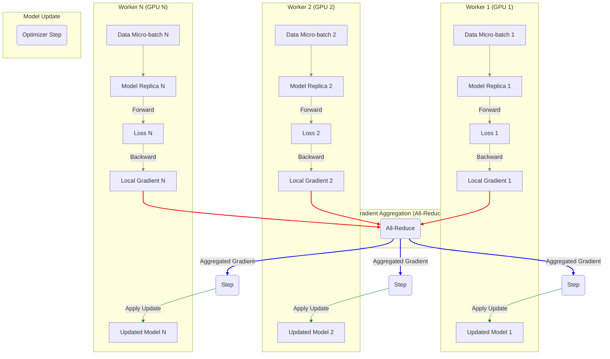
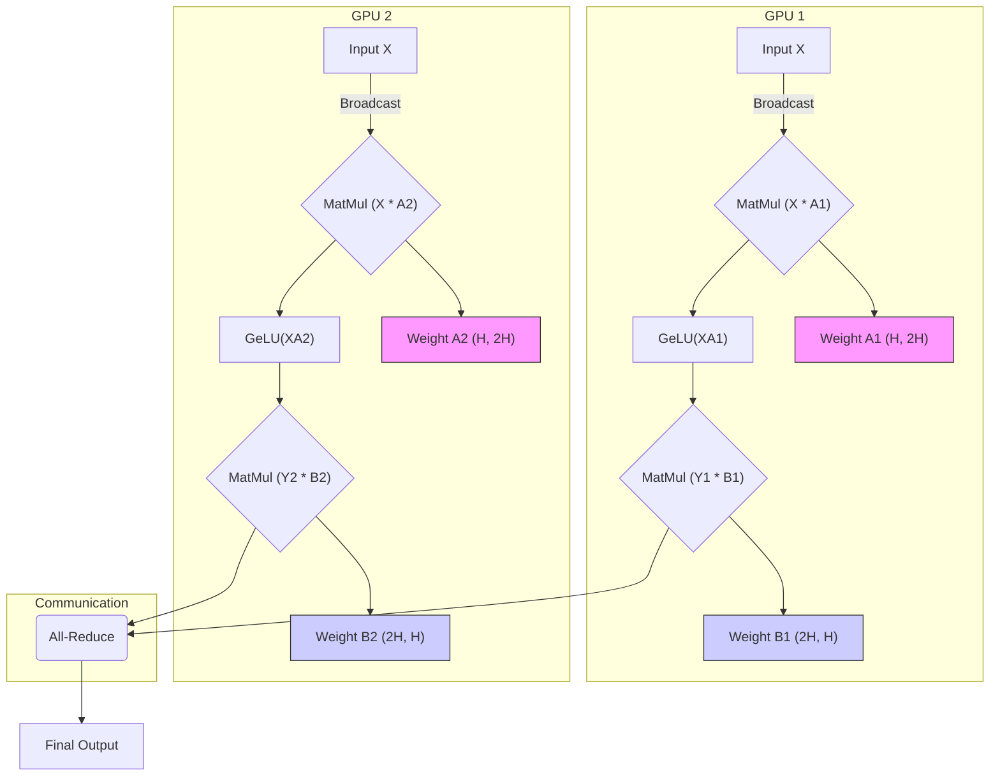
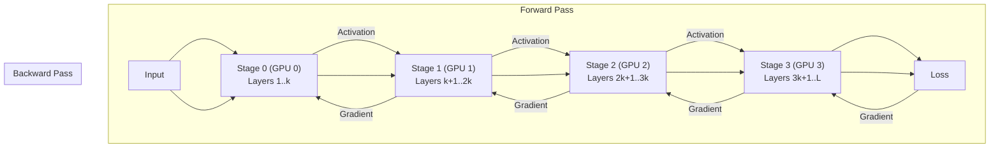
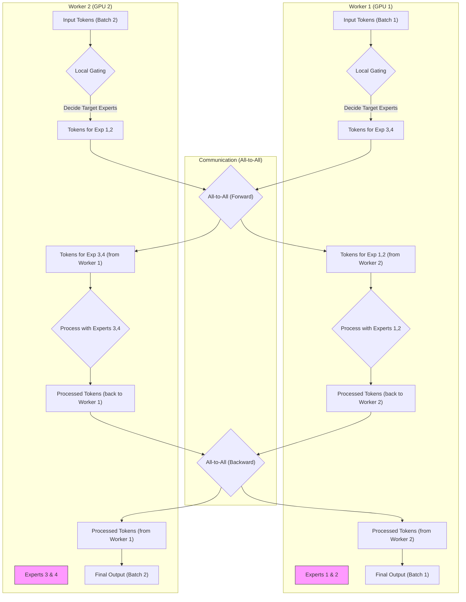
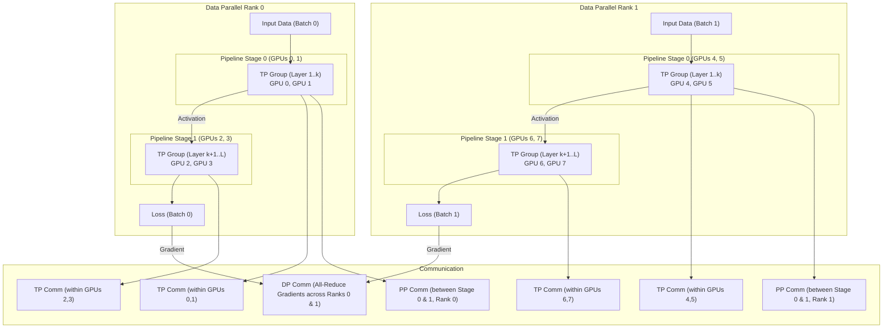
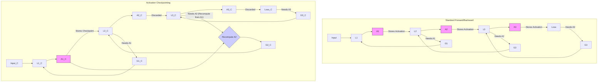

# 第6章：征服规模：分布式训练策略详解 (DP, TP, PP, EP, ZeRO) (Taming the Leviathan: Mastering Distributed Training for Massive Models)

随着模型规模的爆炸式增长（从数亿到数万亿参数），单个计算设备（即使是最高端的 GPU）的显存和计算能力也早已无法满足训练这些"巨兽"的需求。正如建造摩天大楼需要精密的工程设计和庞大的施工团队一样，训练万亿参数模型也必须依赖于 **分布式训练 (Distributed Training)** 技术，将庞大的计算任务和模型状态分散到数百甚至数千个 GPU 上协同完成。本章将深入探讨分布式训练的"武库"，解析应对大模型挑战的各种并行策略：数据并行 (DP)、张量并行 (TP)、流水线并行 (PP)、专家并行 (EP)，以及显存优化"黑科技" ZeRO。我们将理解这些技术的原理、优劣、适用场景，并了解如何在主流框架（如 DeepSpeed, Megatron-LM, PyTorch FSDP）中应用它们，最终"征服"规模的挑战。

---

## 6.1 为何需要"众人拾柴"：大模型训练的显存与计算挑战分析

在深入了解分布式策略之前，我们首先要明白为何必须采用分布式训练。核心原因在于现代 LLM 的巨大规模带来的两大瓶颈：**显存瓶颈 (Memory Bottleneck)** 和 **计算瓶颈 (Compute Bottleneck)** 。

### 6.1.1 显存瓶颈：模型大到"无处容身"

训练过程中，GPU 显存需要存储以下主要部分：

1.  **模型参数 (Model Parameters/Weights)** ：
    *   这是最直观的部分。一个 175B (1750 亿) 参数的 GPT-3 模型，如果用标准的 FP32 (单精度，4 字节) 存储，仅参数就需要 $175 \times 10^9 \times 4 \text{ bytes} \approx 700 \text{ GB}$ 的显存。即使使用 FP16 (半精度，2 字节)，也需要 350 GB。这远远超过了单个 GPU 的显存容量（即使是 80GB 的 A100/H100）。

2.  **梯度 (Gradients)** ：
    *   在反向传播后，需要为每个参数计算并存储梯度。其大小通常与模型参数相同。FP32 存储需要额外 700 GB，FP16 需要 350 GB。

3.  **优化器状态 (Optimizer States)** ：
    *   现代优化器如 AdamW 需要存储额外的状态信息。AdamW 通常需要存储参数的一阶矩 (Momentum) 和二阶矩 (Variance)。
    *   如果用 FP32 存储这两个状态，对于 175B 模型，需要 $2 \times 175 \times 10^9 \times 4 \text{ bytes} = 1400 \text{ GB}$ 的显存！即使优化器状态也用混合精度（如 FP16/FP32 混合），也需要巨大的额外空间（例如，FP32 Momentum + FP16 Variance 或两者都 FP32）。通常，优化器状态占用的显存是模型参数本身的 2 到 4 倍甚至更多（取决于具体实现和精度）。

4.  **激活值 (Activations/Activation Checkpointing)** ：
    *   在前向传播过程中，每一层的输出（激活值）都需要被存储下来，以便在反向传播时计算梯度。
    *   激活值的显存占用量与 **Batch Size**、**序列长度** 和 **模型深度/宽度** 成正比。对于长序列和大 Batch Size，激活值可能成为 **主要的显存消耗者**，甚至超过模型参数和优化器状态的总和。
    *   其大小约为 $ B \times S \times H \times L \times \text{precision_bytes} $，其中 B 是 Batch Size，S 是序列长度，H 是隐藏层维度，L 是层数。对于大型模型和长序列，这个值会非常巨大。
    *   **激活检查点 (Activation Checkpointing/Gradient Checkpointing)** 技术（详见 6.6.3 节）可以通过在前向传播时不存储所有激活值，而在反向传播需要时重新计算它们，来 **极大减少** 这部分显存占用，但会增加计算时间。

**总结显存需求 (粗略估计，175B 模型，FP16 参数/梯度，FP32 优化器状态，无激活检查点)** ：
*   参数: 350 GB
*   梯度: 350 GB
*   优化器状态 (AdamW, FP32): 1400 GB
*   激活值: 高度依赖 B 和 S，可能达数百甚至数千 GB
*   **总计**: **数 TB 级别**

这清晰地表明，单个 GPU（即使是 80GB）完全无法容纳训练一个大型 LLM 所需的所有状态。**模型状态（参数、梯度、优化器状态）必须被分割并分布到多个 GPU 上。**

### 6.1.2 计算瓶颈：训练时间长到"无法接受"

除了显存，LLM 的训练还需要惊人的计算量。

*   **计算量衡量**: 通常用 **FLOPs (Floating-point Operations per Second)** 来衡量硬件的计算能力，用 **总 FLOPs** 来衡量训练一个模型所需的总计算量。
*   **Transformer 计算量估计**: 训练一个 Transformer 模型所需的总计算量粗略估计为 $ \approx 6 \times P \times D $，其中 $P$ 是模型参数量，$D$ 是训练数据集的总 Token 数量。
    *   例如，训练 GPT-3 (175B 参数) 在其约 300B Token 的数据集上，大约需要 $6 \times 175 \times 10^9 \times 300 \times 10^9 \approx 3.15 \times 10^{23}$ FLOPs。
*   **训练时间**: 即使使用当时最先进的 NVIDIA A100 GPU (FP16 理论峰值约 312 TFLOPs/s)，单个 GPU 完成这些计算也需要：
    $$ \frac{3.15 \times 10^{23} \text{ FLOPs}}{312 \times 10^{12} \text{ FLOPs/s}} \approx 1.01 \times 10^9 \text{ seconds} \approx 32 \text{ 年} $$
    这显然是不可接受的。即使考虑到实际利用率（通常远低于理论峰值）和各种开销，这也说明 **必须使用大量的 GPU 并行计算，才能将训练时间缩短到合理的范围（数周或数月）** 。

**结论**: 大型语言模型的训练面临着严峻的显存和计算双重挑战。显存瓶颈要求我们将模型状态分布存储，而计算瓶颈则要求我们并行执行计算任务。分布式训练正是为了解决这两个核心问题而设计的各种策略的总和。

## 6.2 数据并行 (DP)：最简单有效的扩展方式及其通信瓶颈

**数据并行 (Data Parallelism, DP)** 是最基本、最常用、也最容易理解的分布式训练策略。其核心思想是：**将模型复制到多个设备上，每个设备处理输入数据的一个不同子集 (mini-batch)，然后聚合所有设备的梯度来更新全局模型。**

### 6.2.1 原理

1.  **模型复制 (Model Replication)** ：将 **完整的模型副本** 加载到每个参与训练的 GPU (称为 Worker 或 Rank) 上。
2.  **数据分片 (Data Sharding)** ：将全局的训练 Batch 数据分割成多个 micro-batch，每个 Worker 获得一个 micro-batch。
3.  **本地计算 (Local Computation)** ：每个 Worker 独立地在其分配到的 micro-batch 上执行模型的前向传播和反向传播，计算得到本地梯度 (local gradients)。
4.  **梯度聚合 (Gradient Aggregation)** ：通过 **通信操作**（通常是 `All-Reduce`）将所有 Worker 的本地梯度进行 **聚合**（通常是求平均）。`All-Reduce` 操作会计算所有 Worker 梯度的总和（或平均值），并将结果广播回所有 Worker。
5.  **模型更新 (Model Update)** ：每个 Worker 使用聚合后的梯度，以 **相同的方式** 更新其本地的模型副本。这确保了在下一次迭代开始时，所有 Worker 上的模型参数保持一致。

**示意图：数据并行流程**



### 6.2.2 优点

*   **简单直观**: 易于理解和实现。
*   **有效加速**: 可以显著增加训练的吞吐量（有效 Batch Size = `per_device_batch_size * num_workers`），从而加速收敛，尤其是对于计算密集型模型。
*   **通用性**: 适用于各种模型架构。
*   **框架支持良好**: 主流框架如 PyTorch (`DistributedDataParallel`, DDP), TensorFlow (`MirroredStrategy`), Horovod 等都提供了高效易用的实现。

### 6.2.3 缺点与通信瓶颈

数据并行的主要缺点在于 **显存冗余** 和 **通信开销**。

*   **显存冗余**: 每个 GPU 都需要存储 **完整的模型参数、梯度和优化器状态** 。这意味着 DP **无法解决单个 GPU 显存不足以容纳整个模型或其优化器状态的问题** 。它只能通过增加 Worker 数量来增大全局 Batch Size。
*   **通信瓶颈**:
    *   在每次训练迭代中，都需要执行一次 `All-Reduce` 操作来聚合梯度。
    *   `All-Reduce` 的通信量与 **模型参数量** 成正比。对于参数量巨大的 LLM，这个通信量会非常大。
    *   通信时间取决于集群中 **节点间网络的带宽和延迟** 以及 `All-Reduce` 算法的效率（如 Ring All-Reduce）。
    *   当 GPU 数量增加时，虽然计算可以并行加速，但通信开销也会增加。如果通信时间成为主导，数据并行的 **扩展效率 (Scaling Efficiency)** 就会下降（即增加一倍 GPU 带来的加速小于两倍）。

### 6.2.4 PyTorch DDP 实现简介

PyTorch 的 `DistributedDataParallel` (DDP) 是目前最常用、最高效的数据并行实现之一。

*   **特点**:
    *   使用多进程（每个 GPU 一个进程）。
    *   在模型构建时，将梯度聚合 (`All-Reduce`) 与反向传播计算 **重叠 (Overlap)** 进行。即在计算某一层梯度的同时，就可以开始传输前面已计算好的梯度，从而隐藏部分通信延迟，提高效率。
    *   使用高效的通信后端（如 NCCL for NVIDIA GPUs, Gloo for CPU/others）。
*   **基本用法**:
    ```python
    import torch
    import torch.distributed as dist
    import torch.multiprocessing as mp
    from torch.nn.parallel import DistributedDataParallel as DDP
    import os

    def setup(rank, world_size):
        os.environ['MASTER_ADDR'] = 'localhost'
        os.environ['MASTER_PORT'] = '12355'
        # 初始化进程组
        dist.init_process_group("nccl", rank=rank, world_size=world_size) # 使用 NCCL 后端

    def cleanup():
        dist.destroy_process_group()

    def train_process(rank, world_size, model, train_data, batch_size, epochs):
        setup(rank, world_size)

        # 将模型移动到对应的 GPU
        model.to(rank)
        # 使用 DDP 包装模型
        ddp_model = DDP(model, device_ids=[rank])

        # ... 定义损失函数、优化器 ...
        optimizer = torch.optim.AdamW(ddp_model.parameters(), lr=1e-4)

        # ... 创建分布式数据采样器 (DistributedSampler) ...
        # sampler = torch.utils.data.distributed.DistributedSampler(train_data, num_replicas=world_size, rank=rank)
        # train_loader = torch.utils.data.DataLoader(train_data, batch_size=batch_size, sampler=sampler)

        # 假设 train_loader 和 criterion 已定义
        criterion = torch.nn.CrossEntropyLoss() 
        # 模拟 train_loader
        from torch.utils.data import TensorDataset, DataLoader
        train_data = TensorDataset(torch.randn(1000, 10), torch.randint(0, 2, (1000,))) 
        sampler = torch.utils.data.distributed.DistributedSampler(train_data, num_replicas=world_size, rank=rank)
        train_loader = DataLoader(train_data, batch_size=batch_size, sampler=sampler)


        for epoch in range(epochs):
            sampler.set_epoch(epoch) # 确保 shuffle 在每个 epoch 不同
            for batch_idx, (data, target) in enumerate(train_loader):
                data, target = data.to(rank), target.to(rank) # 移动数据到 GPU
                optimizer.zero_grad()
                output = ddp_model(data) # 前向传播
                loss = criterion(output, target) # 计算损失
                loss.backward() # 反向传播 + DDP 自动进行梯度 All-Reduce
                optimizer.step() # 更新模型参数 (所有进程同步进行)
                if rank == 0 and batch_idx % 10 == 0: # 只在 rank 0 打印日志
                    print(f"Epoch: {epoch} | Batch: {batch_idx} | Loss: {loss.item()}")

        cleanup()

    # 模拟 YourModel
    class YourModel(torch.nn.Module):
        def __init__(self):
            super().__init__()
            self.linear = torch.nn.Linear(10, 2)
        def forward(self, x):
            return self.linear(x)

    if __name__ == "__main__":
        # 检查是否有可用的 GPU
        if torch.cuda.is_available():
            world_size = torch.cuda.device_count() # 使用所有可用的 GPU
            model = YourModel() # 定义你的模型
            # 模拟训练数据
            train_data = TensorDataset(torch.randn(1000, 10), torch.randint(0, 2, (1000,)))
            batch_size = 32
            epochs = 2 # 减少 epochs 以便快速测试

            # 使用 spawn 启动多进程
            mp.spawn(train_process,
                     args=(world_size, model, train_data, batch_size, epochs),
                     nprocs=world_size,
                     join=True)
        else:
            print("CUDA is not available. Skipping DDP example.")

    ```

**总结**:

数据并行是一种简单有效的扩展训练吞吐量的方法，但它本身无法解决单 GPU 显存瓶颈问题，并且会引入与模型大小成正比的通信开销。对于现代 LLM，通常需要将 DP 与其他并行策略（如 TP, PP, ZeRO）结合使用。

## 6.3 模型并行 (MP)：当模型大到单卡放不下

当模型本身（参数、梯度、优化器状态、激活值）太大，以至于单个 GPU 的显存无法容纳时，数据并行就无能为力了。这时，我们需要 **模型并行 (Model Parallelism, MP)** 。模型并行的核心思想是 **将模型的不同部分（层、或者层内的参数）切分并放置到不同的 GPU 上**。主要有两种形式：张量并行 (Tensor Parallelism) 和流水线并行 (Pipeline Parallelism)。

### 6.3.1 张量并行 (TP)：层内并行，切分权重矩阵

**张量并行 (Tensor Parallelism, TP)** ，也常被称为 **层内模型并行 (Intra-layer Model Parallelism)** ，它将单个 Transformer 层（或更具体地说，是层内的大型权重矩阵，如 Self-Attention 或 FFN 中的权重） **跨多个 GPU 进行切分**，并在这些 GPU 上并行执行计算。

*   **动机**: Transformer 层中的 Self-Attention 和 FFN 包含非常大的矩阵乘法运算（尤其是在模型宽度 H 很大时）。TP 的目标是将这些大矩阵乘法分解到多个 GPU 上并行计算，从而：
    1.  **减少显存占用**: 每个 GPU 只存储权重矩阵的一部分。
    2.  **加速计算**: 并行执行矩阵乘法。
*   **Megatron-LM 方式**: 由 NVIDIA 的 Megatron-LM ([Megatron-LM: Training Multi-Billion Parameter Language Models Using Model Parallelism](https://arxiv.org/abs/1909.08053)) 推广。它主要针对 Transformer 中的 FFN 层和 Multi-Head Attention (MHA) 层进行切分。

**1. FFN 层切分**:
*   一个标准的 FFN 层包含两个线性变换和一个非线性激活：$ \text{FFN}(x) = \text{GeLU}(xA)B $。其中 $x$ 是输入，$A$ 和 $B$ 是权重矩阵。通常中间层维度会扩展（e.g., 4H），使得 $A$ (H -> 4H) 和 $B$ (4H -> H) 非常大。
*   **按列切分 (Column Parallelism)** : 第一个矩阵 $A$ 可以沿着其 **列** 切分到 $N$ 个 GPU 上。每个 GPU 计算 $ X A_i $，其中 $A = [A_1, A_2, ..., A_N]$。
    $$ XA = [XA_1, XA_2, ..., XA_N] $$
    计算 $ \text{GeLU}(XA_i) $ 也是并行的。这个过程只需要一次输入 $X$ 的广播（或分散）。
*   **按行切分 (Row Parallelism)** : 第二个矩阵 $B$ 可以沿着其 **行** 切分到 $N$ 个 GPU 上。每个 GPU 存储 $B_i$，其中 $B = [B_1^T, B_2^T, ..., B_N^T]^T$。令 $Y_i = \text{GeLU}(XA_i)$，每个 GPU 计算 $ Y_i B_i $。
    $$ \text{FFN}(x) = \sum_{i=1}^N Y_i B_i $$
    这个过程需要在所有 GPU 之间进行一次 `All-Reduce` 操作来求和得到最终结果。

**示意图：FFN 的张量并行 (2 GPUs)**


*注：此处 A 被分为 A1, A2 (列并行)，B 被分为 B1, B2 (行并行)。先并行计算，然后 All-Reduce 聚合行并行的结果。*

**2. Multi-Head Attention (MHA) 层切分**:
*   MHA 的计算主要是 $ Q=XW_Q, K=XW_K, V=XW_V $，然后计算 $ \text{Attention}(Q, K, V) = \text{softmax}(\frac{QK^T}{\sqrt{d_k}})V $，最后通过一个输出线性层 $ \text{Output} = \text{Attention}(...)W_O $。
*   **切分 Q, K, V 权重**: $W_Q, W_K, W_V$ (H -> H) 矩阵可以按 **列** 切分（等效于将注意力头分配到不同 GPU）。每个 GPU 计算一部分头的 Q, K, V。
*   **并行计算 Attention**: 每个 GPU 可以独立计算其分配到的头的 Attention 输出。
*   **切分输出权重**: 输出矩阵 $W_O$ (H -> H) 按 **行** 切分。每个 GPU 计算部分 Attention 输出与对应 $W_O$ 分片的乘积。
*   **通信**: 输入 $X$ 需要广播（或分散）。计算 Q, K, V 是并行的。计算 Attention 输出是并行的。最后需要一次 `All-Reduce` 来聚合输出线性层的结果。

**优点**:
*   **有效降低单层显存**: 将大权重矩阵分散存储。
*   **并行加速计算**: 利用多 GPU 并行执行矩阵乘法。
*   **通信相对可控**: 每个 Transformer 层通常只需要两次 `All-Reduce` (FFN 一次, MHA 一次)。

**缺点**:
*   **通信开销仍然存在**: 每次前向和反向传播都需要进行 All-Reduce 和广播操作，通信量与层输入/输出的激活值大小相关。
*   **实现复杂度较高**: 需要修改模型代码以支持权重切分和通信操作。需要专门的库（如 Megatron-LM, DeepSpeed）来简化实现。
*   **扩展性受限**: 通常只在少数几个 GPU (e.g., 2, 4, 8) 内部进行张量并行，因为 GPU 数量增多时，通信开销会变得显著，且需要非常高的节点内带宽 (NVLink)。

**总结**: 张量并行是解决单层内部显存和计算瓶颈的有效手段，特别适合利用节点内的高速 NVLink 连接。它通常与数据并行和/或流水线并行结合使用。

### 6.3.2 流水线并行 (PP)：层间并行，设备串联执行

**流水线并行 (Pipeline Parallelism, PP)** ，也常被称为 **层间模型并行 (Inter-layer Model Parallelism)** ，它将模型的 **不同层 (Layers)** 分配到不同的 GPU 上，形成一个计算流水线。

*   **动机**: 对于非常深的模型，即使使用了张量并行，单个 GPU 可能仍然无法容纳其分配到的所有层的参数或激活值。流水线并行通过将 **模型的深度** 分割到多个设备来解决这个问题。
*   **基本思想 (Naive Pipeline)** :
    1.  **模型分段 (Stage Partitioning)** : 将模型的连续 L 层划分为 N 个阶段 (Stage)，每个阶段包含 L/N 层，并分配给一个 GPU。
    2.  **数据流动**: 输入数据首先在 GPU 0 (Stage 0) 上完成其分配的层的前向计算，其输出传递给 GPU 1 (Stage 1)，GPU 1 完成计算后传递给 GPU 2，以此类推，直到最后一个 GPU 完成整个模型的前向计算。
    3.  **反向传播**: 损失在最后一个 GPU 上计算，然后梯度沿相反方向回传，每个 GPU 计算其负责层的梯度。


**示意图：朴素流水线并行 (4 GPUs, 4 Stages)**



*   **问题：流水线气泡 (Pipeline Bubble)** :
    *   在朴素流水线中，同一时间只有一个 GPU 在工作。例如，当 GPU 1 在处理第一个 micro-batch 时，GPU 0 和 GPU 2, 3 都处于空闲状态。这导致了巨大的 **设备空闲时间**，称为 **流水线气泡**，严重降低了硬件利用率。

**改进：GPipe 与 Micro-batching**

*   **GPipe ([GPipe: Efficient Training of Giant Neural Networks using Pipeline Parallelism](https://arxiv.org/abs/1811.06965))** : 为了减少气泡，GPipe 引入了 **微批次 (Micro-batching)** 的概念。
    1.  将一个全局 Batch (mini-batch) 切分成更小的 **微批次 (micro-batch)** 。
    2.  将这些微批次 **依次送入流水线**。当 GPU 0 处理完第一个微批次并将其传递给 GPU 1 后，GPU 0 可以 **立即开始处理第二个微批次**，而 GPU 1 则开始处理第一个微批次。
    3.  这样，多个微批次可以在流水线中同时处理，使得多个 GPU 可以并行工作，从而 **减少气泡大小**。
    4.  **梯度累积**: 每个 GPU 计算其负责层对每个微批次的梯度，并将它们累积起来。在一个完整的全局 Batch 的所有微批次都通过流水线后，再进行一次模型参数更新。

**进一步优化：PipeDream / PipeDream-2BW 与 1F1B 调度**

*   **PipeDream ([PipeDream: Fast and Efficient Pipeline Parallel DNN Training](https://arxiv.org/abs/1806.03377))** 及后续工作进一步优化了调度策略，以减少气泡和显存。
*   **1F1B (One Forward pass, One Backward pass)** 调度:
    *   一种常见的策略是让每个 GPU 交替执行一个微批次的前向传播和另一个（通常是之前某个）微批次的后向传播。
    *   这可以更好地平衡计算负载，进一步减少气泡，并可能优化显存占用（因为前向和后向计算的激活值可以在一定程度上重叠使用和释放）。
    *   **挑战**: 需要仔细管理不同微批次的状态和依赖关系。可能需要根据流水线深度和微批次数量调整调度。例如，PipeDream-2BW 使用双缓冲方案来管理权重版本，确保前向和后向传播使用一致的权重。

**优点**:
*   **解决深度模型的显存瓶颈**: 将层分布到不同设备，是扩展模型深度的主要手段。
*   **减少激活值显存 (相比 DP)** : 每个 GPU 只需存储其负责层的激活值（以及流水线边界传输的激活值），通常比 DP 中存储所有激活值要少。
*   **可以与 DP/TP 结合**: 可以将流水线的每个阶段内部再应用数据并行或张量并行。


**缺点**:
*   **流水线气泡**: 即使使用 micro-batching 和 1F1B 调度，也难以完全消除气泡，导致硬件利用率损失。气泡大小通常与流水线深度 (GPU 数量) 成正比。
*   **通信开销**: 每个阶段的边界都需要传输激活值（前向）和梯度（后向）。通信量取决于模型宽度 H 和 Batch Size B。
*   **负载均衡**: 需要仔细划分模型层，使得每个阶段的计算量大致相等，否则慢的阶段会成为瓶颈。对于包含不同类型层或 MoE 层的模型，负载均衡可能很困难。
*   **实现复杂度高**: 需要复杂的调度逻辑、通信协调和状态管理。


**总结**: 流水线并行是通过分割模型深度来扩展模型规模的关键技术。通过 Micro-batching 和 1F1B 等调度策略可以缓解流水线气泡问题，但无法完全消除。它通常与 DP 和 TP 结合使用，形成更复杂的并行策略。

## 6.4 专家并行 (EP)：高效训练 MoE 模型的关键

在第 3 章我们介绍了专家混合模型 (MoE)，它通过稀疏激活（每个 Token 只路由到少数几个专家）来大幅增加模型参数量，而不显著增加计算量。然而，MoE 的训练引入了独特的并行挑战，需要 **专家并行 (Expert Parallelism, EP)** 来解决。

*   **挑战**:
    1.  **负载不均**: 简单的 DP + TP/PP 应用于 MoE 会导致问题。由于门控网络动态地为每个 Token 选择专家，如果将模型（包括所有专家）复制到每个 DP Rank 上，那么在某个 Rank 上，某些专家可能收到很多 Token，而另一些专家可能几乎没有 Token，导致严重的负载不均衡和资源浪费。
    2.  **All-to-All 通信**: 需要将来自不同设备上的 Token 路由到位于特定设备上的专家。

*   **专家并行 (EP) 核心思想**:
    1.  **专家分布**: 将 **不同的专家 (Experts)** 分布到 **不同的 Worker (GPU)** 上。每个 Worker 只持有所有专家中的一个子集（通常是互斥的，例如，如果有 64 个专家和 8 个 GPU，每个 GPU 持有 8 个专家）。
    2.  **数据并行基础**: 模型中非 MoE 的部分（如 Attention 层、共享的 FFN）仍然采用数据并行的方式复制到所有 Worker 上。
    3.  **All-to-All 通信**: 当计算 MoE 层时：
        *   每个 Worker 上的 Token 经过本地的门控网络，确定它们应该被路由到哪些专家。
        *   执行一次 **`All-to-All` 通信操作**：每个 Worker 将需要发送给第 j 个 Worker 处理的 Token 打包发送给 Worker j。同时，它也接收来自所有其他 Worker 的、需要由它本地专家处理的 Token。
        *   每个 Worker 在其本地专家上处理接收到的 Token。
        *   再次执行 **`All-to-All` 通信操作**：将处理后的 Token（专家输出）发送回它们原始所在的 Worker。

**示意图：专家并行流程 (简化，2 Workers, 4 Experts)**


*注：此图简化了流程。实际中，一个 Worker 可能持有多个专家，并且 Token 会被精确路由。关键在于两次 All-to-All 通信。*

*   **通信开销**: `All-to-All` 通信模式的开销很大。每个 Worker 需要向所有其他 Worker 发送数据，也需要接收来自所有其他 Worker 的数据。通信量与 **Batch Size * Sequence Length * Hidden Dim** 成正比，并且对网络带宽和延迟非常敏感。
*   **负载均衡**: 即使使用了专家并行，门控网络的学习也可能导致专家负载不均。因此，MoE 训练中引入的 **负载均衡损失 (Load Balancing Loss)** （见 5.3.2 节）对于专家并行至关重要，它可以激励门控网络将 Token 更均匀地分配给不同的专家。
*   **结合其他并行**: 专家并行通常与数据并行结合使用。即，将所有 Worker 分成多个 **专家并行组 (Expert Parallel Group)** ，每个组内包含 N 个 Worker，负责 N 份专家副本。同时，将这些组视为数据并行的 Rank。也可以进一步结合张量并行或流水线并行。

**优点**:
*   **扩展 MoE 模型**: 使得训练拥有海量（稀疏）参数的 MoE 模型成为可能。
*   **专为 MoE 设计**: 直接解决了 MoE 训练中的核心挑战。

**缺点**:
*   **高通信成本**: `All-to-All` 通信是主要的性能瓶颈，对网络要求极高。
*   **依赖负载均衡损失**: 需要仔细调整负载均衡损失的权重以确保专家利用率。
*   **实现复杂**: 需要专门的库（如 DeepSpeed, Tutel）来处理专家分布和 `All-to-All` 通信。

**总结**: 专家并行是高效训练 MoE 模型的关键技术，它通过将专家分布到不同设备并利用 `All-to-All` 通信来管理 Token 路由。虽然通信成本高昂，但它是释放 MoE 模型巨大潜力所必需的并行策略。

## 6.5 3D 并行及更高维度：组合 DP, TP, PP, EP 实现极致扩展

为了训练最大规模的模型（如千亿甚至万亿参数），通常需要将前面讨论的各种并行策略 **组合** 起来使用，形成所谓的 **3D 并行** 或更高维度的并行策略。

*   **核心思想**: 同时利用数据并行、张量并行和流水线并行（对于 MoE 模型，再加上专家并行）来最大化利用计算资源、最小化通信开销，并突破单一并行策略的扩展限制。

**常见的 3D 并行组合 (DP + TP + PP)** :


1.  **张量并行 (TP) 在节点内**: 利用节点内的高速 NVLink 连接，将模型的每一层在节点内的 $N_{TP}$ 个 GPU 上进行张量切分。
2.  **流水线并行 (PP) 在节点间 (或跨节点)** : 将模型的不同层分配到 $N_{PP}$ 个不同的计算单元（每个单元可能是一个或多个应用了 TP 的 GPU 组）上，形成流水线。
3.  **数据并行 (DP) 在全局**: 将整个应用了 TP 和 PP 的模型视为一个逻辑单元，并将其复制 $N_{DP}$ 份，在不同的数据批次上进行数据并行训练。


**总 GPU 数量 = $N_{DP} \times N_{TP} \times N_{PP}$**


**示意图：3D 并行 (DP=2, PP=2, TP=2)** (总 GPU = 8)



*   **通信模式**:
    *   **TP 通信**: 主要发生在节点内部（NVLink），涉及 All-Reduce 和广播。通信量与激活值大小相关。
    *   **PP 通信**: 主要发生在流水线阶段边界，通常是节点间（InfiniBand/Ethernet），传输激活值/梯度。通信量与激活值大小相关。
    *   **DP 通信**: 主要发生在梯度聚合阶段，是全局范围的 All-Reduce（跨所有 DP Rank），通信量与模型总参数量成正比。

*   **优势**:
    *   **极致扩展性**: 允许训练比任何单一并行策略所能支持的都要大得多的模型。
    *   **灵活性**: 可以根据模型特性（深度、宽度）和硬件环境（节点内/间带宽）调整 $N_{DP}, N_{TP}, N_{PP}$ 的比例，以优化性能。例如，对于非常深的模型，增加 $N_{PP}$；对于非常宽的模型，增加 $N_{TP}$ 。

*   **挑战**:
    *   **极高的实现复杂度**: 需要精心设计和协调不同并行维度之间的交互、通信和同步。通常需要依赖成熟的分布式框架（如 Megatron-LM, DeepSpeed, Colossal-AI）。
    *   **调优困难**: 需要在多个维度上进行超参数调优（DP, TP, PP 各自的参数以及它们的组合），寻找最优配置非常耗时。
    *   **负载均衡更难**: 需要同时考虑 TP 和 PP 的负载均衡。

*   **加入专家并行 (EP) - "4D" 并行**:
    *   对于 MoE 模型，可以在 3D 并行 (DP+TP+PP) 的基础上再加入专家并行 (EP)。
    *   一种可能的组合方式是：在每个流水线阶段 (PP Stage)，应用张量并行 (TP) 处理非 MoE 层；对于 MoE 层，应用专家并行 (EP)，将专家分布在该阶段内部或跨阶段（跨 TP group）的 GPU 上；最后在全局进行数据并行 (DP)。
    *   这进一步增加了复杂性，但对于高效训练具有数万亿稀疏参数的 MoE 模型是必要的。DeepSpeed 等框架提供了对这种复杂组合的支持。

**总结**: 3D/4D 并行策略通过组合数据并行、张量并行、流水线并行（以及专家并行），为训练当前最大规模的语言模型提供了可能。然而，其实现和调优的复杂度极高，是 LLM 训练工程中的前沿挑战。

## 6.6 显存优化"黑科技"：用更少资源训练更大模型

除了通过模型并行将模型切分到多个设备外，还有一系列重要的技术可以在 **单个 GPU 内部** 或 **跨设备协作** 的层面上 **优化显存占用**，使得我们能用有限的显存训练更大的模型或使用更大的 Batch Size。这些技术通常与并行策略结合使用。

### 6.6.1 混合精度训练 (AMP)：半精度加速与精度保持

*   **回顾**: 在 5.2.3 和 5.5.3 节中已经介绍过。
*   **核心**: 使用 FP16 或 BF16 存储模型参数、激活和计算梯度，利用 Tensor Core 加速计算，并显著减少显存占用（相比 FP32 减少近一半）。同时保留 FP32 用于参数更新（或主权重）以维持数值精度。
*   **显存节省**: 主要节省在模型参数、梯度和激活值的存储上。
*   **关键**: 对于 FP16，需要损失缩放 (Loss Scaling) 来防止梯度下溢/上溢。BF16 因其动态范围与 FP32 相同，通常不需要损失缩放。
*   **现状**: AMP 是现代 LLM 训练的 **标配**。BF16 因其更好的数值稳定性，在支持该格式的硬件 (A100, H100 等) 上越来越受欢迎。

### 6.6.2 梯度累积：用时间换空间，模拟大 Batch Size

*   **回顾**: 在 5.2.3 节中已经介绍过。
*   **核心**: 在显存有限，无法直接使用大的 `per_device_batch_size` 时，可以将一个大的逻辑 Batch 分割成多个小的 micro-batch。依次处理每个 micro-batch，计算梯度但不立即更新模型，而是将梯度 **累积** 起来。当处理完指定数量 (`gradient_accumulation_steps`) 的 micro-batch 后，用累积的梯度进行一次模型参数更新。
*   **效果**: 等效于使用了 `per_device_batch_size * gradient_accumulation_steps` 的 Batch Size 进行训练，而显存占用只取决于 `per_device_batch_size`。
*   **代价**: 需要更多的计算时间（因为前向/反向传播执行了更多次）。
*   **应用**: 在显存受限的情况下，用于达到训练所需的大全局 Batch Size。

### 6.6.3 梯度检查点 (Gradient Checkpointing) / 激活检查点 (Activation Checkpointing)

*   **动机**: 如 6.1.1 节所述，激活值是 LLM 训练中主要的显存消耗之一，尤其对于长序列和深模型。
*   **核心思想**: 在前向传播过程中，**不存储所有层的激活值**，只存储其中 **少量关键节点**（检查点）的激活值。在反向传播需要某个被丢弃的激活值来计算梯度时，**重新从最近的检查点开始执行一小段前向计算** 来得到该激活值。
*   **显存节省**: 可以 **极大减少** 激活值占用的显存。理论上，如果只检查输入层，可以将激活值显存降低到 O(1)（仅传输部分），但重计算开销巨大。实际中通常在模型的若干层之间设置检查点（例如，每隔几层设置一个）。对于一个有 L 层的网络，如果每 $\sqrt{L}$ 层设置一个检查点，可以将激活值显存占用从 O(L) 降低到 O($\sqrt{L}$)。
*   **计算代价**: 增加了额外的计算量，因为部分前向计算需要执行两次。通常会带来约 **20-30%** 的训练速度下降。
*   **实现**: PyTorch 提供了 `torch.utils.checkpoint.checkpoint` 和 `checkpoint_sequential` 工具。Hugging Face `transformers` 模型可以通过设置 `use_cache=False` 和 `gradient_checkpointing=True` 来启用。DeepSpeed 等框架也集成了此功能。
*   **权衡**: 是典型的 **用计算换显存** 的策略。在激活值显存成为瓶颈时非常有效。

**示意图：激活检查点**


*注：在 Checkpointing 中，A2 和 A3 在前向传播后被丢弃。反向传播需要 A2 时，从检查点 A1 开始重新计算 L2 得到 A2。*

### 6.6.4 ZeRO 优化器：分片存储优化器状态、梯度与参数

*   **提出者**: DeepSpeed 团队 ([ZeRO: Memory Optimizations Toward Training Trillion Parameter Models](https://arxiv.org/abs/1910.02054))
*   **动机**: 即使使用了模型并行 (TP/PP)，每个 GPU 仍然需要存储其负责的模型分片的 **完整** 优化器状态和梯度，这仍然可能非常巨大。同时，数据并行 (DP) 中每个 GPU 都存储了完整的模型参数、梯度和优化器状态，存在大量的显存冗余。ZeRO (Zero Redundancy Optimizer) 旨在 **消除数据并行中的显存冗余**。
*   **核心思想**: 将模型状态（优化器状态、梯度、模型参数） **分割 (Partition)** 到数据并行组内的所有 GPU 上，每个 GPU 只负责存储和更新其中一部分。
*   **ZeRO 的三个阶段 (Stages)** :
    1.  **ZeRO-Stage 1 (Optimizer State Partitioning)** :
        *   **只分割优化器状态**。每个 GPU 只存储其负责的那部分参数对应的优化器状态（e.g., Adam 的 Momentum 和 Variance）。
        *   梯度仍然需要在所有 GPU 之间进行 `All-Reduce` 聚合。
        *   在参数更新步骤 `optimizer.step()` 中，每个 GPU 只更新它本地存储的那部分优化器状态对应的参数。需要一次额外的通信（`All-Gather` 或类似操作）来确保所有 GPU 获得更新后的完整参数。
        *   **显存节省**: 主要节省了优化器状态的存储（减少为原来的 1/N，N 为 DP group size）。参数和梯度仍然是冗余的。
    2.  **ZeRO-Stage 2 (Optimizer State & Gradient Partitioning)** :
        *   **分割优化器状态和梯度**。在反向传播计算出梯度后，不执行全局 `All-Reduce`，而是执行 `Reduce-Scatter` 操作：将梯度聚合（求和）并 **同时分割** 到各个 GPU，每个 GPU 只保留其负责更新的那部分参数对应的梯度片段。
        *   优化器步骤只在本地进行，使用本地的优化器状态片段和梯度片段来更新本地的参数片段。
        *   **显存节省**: 进一步节省了梯度的存储（减少为 1/N）。参数仍然是冗余的。通信量从 `All-Reduce`（2 * 参数量）变为 `Reduce-Scatter` + `All-Gather`（理论上也是 2 * 参数量，但模式不同，可能对网络拓扑和带宽更敏感）。
    3.  **ZeRO-Stage 3 (Optimizer State, Gradient & Parameter Partitioning)** :
        *   **分割优化器状态、梯度和模型参数**。每个 GPU 只存储模型参数的一个分片。
        *   在前向和反向传播过程中，当需要访问非本地的参数时，通过动态的 `All-Gather` 操作从其他 GPU 获取。计算完成后，可以丢弃非本地的参数以节省显存。
        *   **显存节省**: **最大程度地消除了数据并行中的冗余**。理论上，每个 GPU 的显存占用只与模型总大小除以 DP size 相关（加上激活值等）。使得数据并行可以扩展到非常大的规模。
        *   **通信开销**: 引入了大量动态的 `All-Gather` 通信来获取所需的参数，通信量显著增加，对网络带宽和延迟要求更高。


**表格：ZeRO 各阶段对比 (N = Data Parallel Group Size)**

| 状态           | ZeRO-Offload (CPU) | ZeRO-Stage 1        | ZeRO-Stage 2            | ZeRO-Stage 3            |
| :------------- | :----------------- | :------------------ | :---------------------- | :---------------------- |
| **优化器状态** | CPU (或 NVMe)      | 分片 (1/N)          | 分片 (1/N)              | 分片 (1/N)              |
| **梯度**       | 冗余 (FP16/32)     | 冗余 (FP16/32)      | 分片 (1/N, FP16/32)     | 分片 (1/N, FP16/32)     |
| **模型参数**   | 冗余 (FP16)        | 冗余 (FP16)         | 冗余 (FP16)             | 分片 (1/N, FP16)        |
| **主要通信**   | (梯度 All-Reduce)  | 梯度 All-Reduce     | 梯度 Reduce-Scatter     | 参数 All-Gather (动态)  |
| **显存节省**   | (取决于 Offload)   | 优化器状态          | + 梯度                  | + 参数                  |
| **通信量**     | 低                 | 中 (All-Reduce)     | 中 (Reduce-Scatter)     | 高 (All-Gather)         |
| **适用场景**   | 显存极其有限      | 优化器状态是瓶颈    | 梯度也是瓶颈             | 参数也是瓶颈, 追求极致显存优化 |

*   **ZeRO-Offload**: ZeRO 还可以将优化器状态甚至梯度/参数 **卸载 (Offload)** 到 **CPU 内存** 或 **NVMe 固态硬盘**，进一步减少 GPU 显存占用。代价是引入了 GPU 和 CPU/NVMe 之间的数据传输开销 (PCIe 带宽限制)，会降低训练速度。适用于 GPU 显存极其有限的场景。
*   **实现**: ZeRO 是 **DeepSpeed 库的核心功能**。PyTorch 的 **FSDP (Fully Sharded Data Parallel)** 提供了类似 ZeRO-Stage 2 和 Stage 3 的功能。

**总结**: ZeRO 通过分片技术极大地减少了数据并行中的显存冗余，使得在有限的硬件上训练超大规模模型成为可能。不同的阶段提供了在显存节省和通信开销之间的权衡。ZeRO-Stage 3 提供了最大的显存优化，但通信成本也最高。

**结合使用**: 这些显存优化技术通常结合使用。例如，一个典型的配置可能同时使用 AMP (BF16/FP16)、梯度检查点和 ZeRO (Stage 2 或 3)，并结合 3D 并行策略。

## 6.7 主流框架实战：DeepSpeed, Megatron-LM, PyTorch FSDP, JAX pjit 配置与应用

实现和管理复杂的分布式并行策略和显存优化技术是一项艰巨的任务。幸运的是，社区和业界已经开发出一些强大的框架来简化这一过程。

### 6.7.1 DeepSpeed

*   **开发者**: Microsoft
*   **特点**:
    *   构建于 PyTorch 之上，旨在提供易于使用的、全面的大规模模型训练能力。
    *   **核心技术**: ZeRO (Stages 1, 2, 3) 和 ZeRO-Offload。
    *   **集成 3D 并行**: 无缝集成了基于 Megatron-LM 的张量并行 (TP) 和流水线并行 (PP)，并提供了易用的 API 来组合它们与 ZeRO (DP)。
    *   **丰富的显存优化**: 除了 ZeRO，还集成了稀疏 Attention、激活检查点、常量冻结等。
    *   **MoE 支持**: 提供了高效的专家并行 (EP) 实现和负载均衡损失。
    *   **推理优化**: 也包含 DeepSpeed Inference，用于优化 LLM 推理速度和成本。
*   **使用方式**:
    *   通常通过 **配置文件 (JSON)** 来指定所需的 ZeRO 阶段、Offload 策略、AMP 设置、梯度累积、梯度裁剪等。
    *   使用 `deepspeed.initialize` 函数包装模型和优化器。
    *   通过 `deepspeed` 启动器运行训练脚本。
*   **示例配置 (部分 `ds_config.json` for ZeRO Stage 2)** :
    ```json
    {
      "fp16": {
        "enabled": true, // 或者使用 "bf16": {"enabled": true}
        "loss_scale": 0,
        "loss_scale_window": 1000,
        "hysteresis": 2,
        "min_loss_scale": 1
      },
      "optimizer": {
        "type": "AdamW",
        "params": {
          "lr": 1e-5,
          "betas": [0.9, 0.999],
          "eps": 1e-8,
          "weight_decay": 0.01
        }
      },
      "scheduler": {
        "type": "WarmupLR", // 或 WarmupCosineLR 等
        "params": {
          "warmup_min_lr": 0,
          "warmup_max_lr": 1e-5,
          "warmup_num_steps": 100
        }
      },
      "zero_optimization": {
        "stage": 2, // ZeRO Stage 2
        "offload_optimizer": { // (可选) Offload 优化器状态到 CPU
            "device": "cpu",
            "pin_memory": true
        },
        "allgather_partitions": true,
        "allgather_bucket_size": 5e8, // 控制 AllGather 通信粒度
        "reduce_scatter": true,
        "reduce_bucket_size": 5e8, // 控制 ReduceScatter 通信粒度
        "overlap_comm": true, // 尝试重叠通信和计算
        "contiguous_gradients": true // 使用连续内存存储梯度，可能提高通信效率
      },
      "gradient_accumulation_steps": 8,
      "gradient_clipping": 1.0,
      "train_batch_size": 1024, // 全局 Batch Size
      "train_micro_batch_size_per_gpu": 8 // 每个 GPU 的 micro batch size
    }
    ```
*   **启动命令**: `deepspeed --num_gpus=8 your_training_script.py --deepspeed_config ds_config.json <other_args>`

### 6.7.2 Megatron-LM

*   **开发者**: NVIDIA 应用研究团队
*   **特点**:
    *   专注于实现高效的 **张量并行 (TP)** 和 **流水线并行 (PP)** ，特别是针对 NVIDIA GPU 进行了深度优化。
    *   提供了高度优化的 Transformer 层实现，集成了并行逻辑。
    *   通常需要对模型代码进行 **更深入的修改** 以适配其并行接口。
    *   也支持数据并行 (DP)，可以与 TP/PP 结合实现 3D 并行。
    *   与 DeepSpeed 集成：`Megatron-DeepSpeed` 结合了 Megatron 的 TP/PP 和 DeepSpeed 的 ZeRO (DP) 及其他优化，是一个非常强大的组合。
*   **使用方式**:
    *   通常需要基于其提供的代码库进行开发，或者使用集成了 Megatron 的上层框架（如 NeMo）。
    *   通过命令行参数配置 TP size (`--tensor-model-parallel-size`) 和 PP size (`--pipeline-model-parallel-size`) 等。

### 6.7.3 PyTorch FSDP (Fully Sharded Data Parallel)

*   **开发者**: PyTorch 团队 (Meta AI 等)
*   **特点**:
    *   PyTorch **原生** 提供的分布式训练解决方案，旨在实现类似 ZeRO 的 **完全分片数据并行**。
    *   **功能**: 类似于 DeepSpeed ZeRO Stage 2 和 Stage 3，可以分片存储优化器状态、梯度和参数。
    *   **目标**: 提供更简洁、更集成化的 API，减少对外部库的依赖。
    *   **灵活性**: 提供了多种分片策略 (Sharding Strategy) 和 Offload 选项。
    *   **自动包装 (Auto Wrapping)** : 可以自动地（或通过策略指定）将模型的哪些模块包装在 FSDP 实例中，以控制分片的粒度。
    *   与 PyTorch 生态系统（如 `torch.distributed.checkpoint`）紧密集成。
*   **使用方式**:
    *   使用 `torch.distributed.fsdp.FullyShardedDataParallel` 类包装模型（或模型的子模块）。
    *   通过参数配置分片策略 (`ShardingStrategy.FULL_SHARD` 对应 Stage 3, `ShardingStrategy.SHARD_GRAD_OP` 对应 Stage 2, `HYBRID_SHARD` 结合节点内 DP 和节点间 FSDP)、Offload、混合精度 (`MixedPrecision`) 等。
*   **示例 (概念性)** :
    ```python
    import torch
    import torch.distributed as dist
    from torch.distributed.fsdp import FullyShardedDataParallel as FSDP
    from torch.distributed.fsdp.wrap import size_based_auto_wrap_policy
    from torch.distributed.fsdp.sharding_strategy import ShardingStrategy
    import functools
    import os

    # 模拟 YourLargeModel
    class YourLargeModel(torch.nn.Module):
        def __init__(self):
            super().__init__()
            # 创建一些参数量大的层，例如大于 1M
            self.layer1 = torch.nn.Linear(1024, 1024) 
            self.layer2 = torch.nn.Linear(1024, 1024)
            # 创建一些参数量小的层
            self.small_layer = torch.nn.Linear(1024, 10)

        def forward(self, x):
            x = self.layer1(x)
            x = torch.relu(x)
            x = self.layer2(x)
            x = torch.relu(x)
            x = self.small_layer(x)
            return x

    def setup_ddp():
        # 假设使用环境变量进行初始化
        if 'RANK' in os.environ and 'WORLD_SIZE' in os.environ:
            rank = int(os.environ["RANK"])
            world_size = int(os.environ['WORLD_SIZE'])
            dist.init_process_group("nccl", rank=rank, world_size=world_size)
            torch.cuda.set_device(rank)
        else:
            # 单进程运行或未设置 DDP 环境
             dist.init_process_group("gloo", rank=0, world_size=1) # 模拟单进程
             pass


    def cleanup_ddp():
        if dist.is_initialized():
            dist.destroy_process_group()


    # --- 主要 FSDP 逻辑 ---
    if __name__ == "__main__":
        setup_ddp()

        model = YourLargeModel()

        # 定义自动包装策略 (例如，基于模块大小)
        # functools.partial 用于固定 size_based_auto_wrap_policy 的 min_num_params 参数
        auto_wrap_policy = functools.partial(
            size_based_auto_wrap_policy, min_num_params=1e6 # 参数量大于 1M 的模块将被 FSDP 包装
        )

        # 获取当前设备 ID (如果 CUDA 可用)
        device_id = torch.cuda.current_device() if torch.cuda.is_available() else None

        # 初始化 FSDP 模型 (类似 ZeRO Stage 3)
        fsdp_model = FSDP(
            model,
            auto_wrap_policy=auto_wrap_policy,
            sharding_strategy=ShardingStrategy.FULL_SHARD, # 完全分片 (参数+梯度+优化器状态)
            device_id=device_id, # 指定设备 ID
            # mixed_precision=... # (可选) 配置混合精度
            # cpu_offload=... # (可选) 配置 CPU Offload
        )

        # 定义优化器 (通常优化 fsdp_model.parameters())
        optimizer = torch.optim.AdamW(fsdp_model.parameters(), lr=1e-4)

        # --- 模拟训练循环 ---
        if device_id is not None: # 仅在 GPU 上运行训练循环示例
            fsdp_model.train()
            # 模拟输入数据
            dummy_input = torch.randn(16, 1024).to(device_id) 
            # 模拟目标
            dummy_target = torch.randint(0, 10, (16,)).to(device_id) 
            criterion = torch.nn.CrossEntropyLoss()

            for _ in range(2): # 模拟几个步骤
                 optimizer.zero_grad()
                 output = fsdp_model(dummy_input)
                 loss = criterion(output, dummy_target)
                 loss.backward()
                 optimizer.step()
                 if dist.get_rank() == 0: # 只在主进程打印
                     print(f"Loss: {loss.item()}")
        else:
             print("Skipping FSDP training loop example as CUDA is not available.")


        cleanup_ddp()
    ```

### 6.7.4 JAX pjit / GSPMD

*   **背景**: JAX 是一个用于高性能数值计算（尤其是机器学习）的 Python 库，以其函数变换（如 `jit`, `grad`, `vmap`, `pmap`）和在 TPU 上的高效执行而闻名。
*   **`pmap`**: JAX 的早期并行原语，主要用于类似数据并行的 SPMD (Single Program, Multiple Data) 风格的计算，将数据和计算映射到多个设备 (GPU/TPU)。
*   **`pjit` (Partitioned Just-In-Time)** : 更高级的并行原语，允许用户 **显式地指定** 如何将计算和数据（张量） **跨任意设备网格 (Device Mesh)** 进行 **分区 (Partitioning)** 。
*   **GSPMD (General and Scalable Parallel Machine Learning Distributed Training)** : XLA (Accelerated Linear Algebra, JAX/TensorFlow/PyTorch 的底层编译器) 的一种分区算法，`pjit` 底层利用 GSPMD 自动地将高级别的分区规范转换为高效的分布式执行计划，处理复杂的通信模式。
*   **特点**:
    *   **灵活性**: 允许非常灵活和细粒度的并行策略定义（包括 DP, TP, PP 的任意组合）。
    *   **编译器优化**: 依赖 XLA 编译器进行端到端的优化。
    *   **TPU 亲和性**: 在 Google TPU Pod 上表现尤为出色。
    *   **学习曲线**: 相对于 PyTorch 的命令式风格，JAX 的函数式编程和显式分区可能需要一定的学习成本。
*   **使用方式**:
    *   定义设备网格 (`mesh = Mesh(...)`)。
    *   使用 `NamedSharding` 和 `PartitionSpec` 定义张量应该如何根据网格轴进行分片。
    *   使用 `jax.experimental.pjit` 装饰器或函数转换来编译和执行带有分区规范的函数。


### 框架选择考量

*   **易用性**: DeepSpeed 和 PyTorch FSDP 通常被认为比 Megatron-LM (需要代码修改) 或 JAX (函数式/分区) 更容易上手和集成到现有 PyTorch 代码中。
*   **性能**: Megatron-LM (尤其是在 NVIDIA GPU 上) 和 JAX (尤其是在 TPU 上) 通常以其极致性能而闻名，但 DeepSpeed 和 FSDP 的性能也非常具有竞争力，并且在不断优化。
*   **功能全面性**: DeepSpeed 提供了非常广泛的优化功能集合 (ZeRO, Offload, 3D 并行, MoE, 推理等)。FSDP 作为 PyTorch 原生方案，集成度更好，但功能覆盖可能相对较少（但仍在快速发展）。
*   **硬件平台**: JAX 在 TPU 上优势明显。DeepSpeed 和 Megatron-LM 主要针对 NVIDIA GPU 优化。FSDP 目标是跨平台。
*   **社区与生态**: Hugging Face `transformers` 与 DeepSpeed 和 FSDP 的集成较好。

**实际应用中，常常是混合使用这些框架的功能**，例如使用 Hugging Face `Trainer` 配合 DeepSpeed 或 FSDP 配置。

## 6.8 案例研究：配置并启动一个包含混合并行与 ZeRO 的复杂训练任务

**目标**: 概念性地描述如何配置一个使用 3D 并行 (DP+TP+PP) 和 ZeRO (Stage 2) 的训练任务，以训练一个假设的 GPT 风格大模型。我们将侧重于配置的逻辑，而非完整的可运行代码。

**假设场景**:
*   模型: 一个大型 GPT-style Decoder-Only 模型。
*   硬件: 一个包含多个节点的 GPU 集群，每个节点有 8 个 GPU，通过高速网络连接。
*   目标并行策略:
    *   数据并行 (DP) size = $N_{DP}$ 
    *   张量并行 (TP) size = $N_{TP}$ (e.g., 节点内=8)
    *   流水线并行 (PP) size = $N_{PP}$ (e.g., 跨节点)
    *   ZeRO Stage 2

**配置步骤 (使用 DeepSpeed + Megatron-LM 风格)** :

1.  **环境设置**:
    *   安装 DeepSpeed, Megatron-LM (或其核心组件), PyTorch, Transformers 等。
    *   准备好训练脚本和数据集。

2.  **模型代码适配 (如果需要)** :
    *   如果使用 Megatron-LM 的 TP/PP 实现，可能需要将模型定义替换为其提供的并行化模块（如 `ParallelMLP`, `ParallelAttention`）。需要确保正确处理并行组、层划分等。
    *   如果 DeepSpeed 提供了对该模型架构的自动 TP/PP 支持，则可能无需大量修改。

3.  **配置 DeepSpeed (ds_config.json)** :
    *   **启用 ZeRO**: 设置 `"zero_optimization": {"stage": 2, ...}` (参考 6.7.1 示例)。根据需要配置 Offload。
    *   **启用混合精度**: 设置 `"fp16": {"enabled": true}` 或 `"bf16": {"enabled": true}`。
    *   **梯度累积/裁剪**: 设置 `gradient_accumulation_steps`, `gradient_clipping`。
    *   **全局 Batch Size**: 设置 `train_batch_size`。DeepSpeed 会根据 DP size 和梯度累积步数自动计算 micro-batch size。
    *   **(重要) 忽略 Megatron/Transformer 的优化器/调度器**: 通常在配置文件中将优化器和调度器类型设为 `None` 或注释掉，因为它们将由 DeepSpeed 的 `initialize` 或 Hugging Face `Trainer` 管理。

4.  **配置并行度 (通过启动器或命令行参数)** :
    *   **DeepSpeed 启动器**:
        ```bash
        deepspeed --num_gpus=<Total GPUs> \
                  --num_nodes=<Num Nodes> \
                  --master_addr=<Master Addr> \
                  --master_port=<Master Port> \
                  your_training_script.py \
                  --tensor-model-parallel-size <N_TP> \
                  --pipeline-model-parallel-size <N_PP> \
                  --num-layers <Total Layers> \
                  # ... 其他 Megatron/Transformer 参数 ...
                  --deepspeed --deepspeed_config ds_config.json \
                  # ... 其他脚本参数 ...
        ```
        *   `Total GPUs` = $N_{DP} \times N_{TP} \times N_{PP}$ 。
        *   启动器和框架会根据 TP 和 PP size 自动推断 DP size ($N_{DP} = \text{Total GPUs} / (N_{TP} \times N_{PP})$)。
        *   框架会负责创建和管理不同并行维度所需的通信组（DP group, TP group, PP group）。

5.  **训练脚本适配**:
    *   使用 `deepspeed.initialize(...)` (如果直接使用 DeepSpeed API) 或 Hugging Face `Trainer` (它内部会调用 DeepSpeed 初始化) 来包装模型、优化器等。
    *   确保数据加载考虑了流水线并行（每个 PP stage 可能只需要加载数据一次）。
    *   模型的前向/后向逻辑需要正确处理 TP 和 PP 的输入/输出以及通信。Megatron-LM 或 DeepSpeed 的流水线引擎会处理调度和通信。

**执行流程**:

1.  DeepSpeed 启动器在所有指定的 GPU 上启动训练进程。
2.  初始化分布式环境，创建 DP, TP, PP 通信组。
3.  根据 ZeRO 配置，对优化器状态和梯度进行分片。
4.  根据 TP 配置，对模型层的权重进行切分。
5.  根据 PP 配置，将模型层分配到不同的流水线阶段。
6.  **训练循环**:
    *   **数据加载**: 加载 micro-batch 数据。
    *   **流水线执行**: DeepSpeed/Megatron 的流水线引擎调度 micro-batch 在 PP 阶段间的前向和后向传播（可能使用 1F1B 调度）。
        *   **TP 执行**: 在每个 PP 阶段内部，TP 组内的 GPU 并行计算（涉及 TP 通信）。
        *   **PP 通信**: 阶段边界传输激活值/梯度。
        *   **激活检查点**: 如果启用，在反向传播中进行重计算。
    *   **梯度累积**: 在本地累积 micro-batch 的梯度片段。
    *   **ZeRO 梯度聚合/分片**: 当梯度累积完成后，执行 `Reduce-Scatter` 将聚合后的梯度分片存储到对应 GPU。
    *   **优化器步骤**: 每个 GPU 使用本地的优化器状态片段和梯度片段更新其负责的参数片段（如果 ZeRO Stage 3，参数本身也是分片的，更新本地分片）。
    *   **参数同步 (ZeRO Stage 2/3)** : 可能需要 `All-Gather` 操作来获取更新后的完整（或所需部分）参数，以准备下一次迭代。

**关键考量**:

*   **并行度选择**: $N_{TP}$ 通常受限于节点内 GPU 数量和 NVLink 带宽。$N_{PP}$ 取决于模型深度和希望减少的激活值显存。$N_{DP}$ 则由总 GPU 数量和 TP/PP 选择决定，用于扩展全局 Batch Size。需要根据硬件和模型进行实验调优。
*   **负载均衡**: 确保 PP 的每个阶段计算量尽量均衡。
*   **通信优化**: DeepSpeed 等框架提供了优化通信（如融合操作、调整 bucket size、重叠通信计算）的选项。
*   **调试**: 调试复杂的分布式训练非常困难，需要仔细检查日志、监控资源利用率和理解框架内部机制。

这个案例研究展示了组合多种并行策略和显存优化技术的复杂性。虽然具体实现依赖于所选框架，但理解各种策略的原理和它们如何协同工作是成功训练超大规模模型的关键。

---
**(本章完)**
