# 第7章：精雕细琢：参数高效微调 (PEFT) 与人类对齐 (RLHF) (Sharpening the Mind: Advanced Fine-tuning, Adaptation (PEFT), and Human Alignment (RLHF))

经过大规模预训练的语言模型（LLMs）虽然具备了广泛的知识和强大的语言能力，但它们通常是"通才"而非"专才"。直接将预训练模型应用于特定下游任务（如特定领域的问答、代码生成、特定风格的写作）或使其行为符合人类的复杂期望，效果往往不尽人意。为了弥补这一差距，我们需要对预训练模型进行进一步的调整。

传统的 **全量微调 (Full Fine-Tuning)**  方法，即更新模型的所有参数，虽然有效，但面临着严峻的挑战：
*   **高昂的计算成本**: 对动辄百亿、千亿参数的模型进行全量微调，需要大量的计算资源（GPU 时长）和显存。
*   **巨大的存储开销**: 为每个下游任务存储一个完整的微调模型副本，成本极高。
*   **灾难性遗忘 (Catastrophic Forgetting)** : 在针对特定任务进行微调时，模型可能会丢失在预训练阶段学到的通用知识。

为了克服这些挑战，**参数高效微调 (Parameter-Efficient Fine-Tuning, PEFT)** 应运而生。PEFT 的核心思想是在微调过程中 **冻结预训练模型的大部分参数**，仅调整少量（通常远小于模型总参数量的 1%）或新增的参数，从而以极低的成本实现模型对特定任务的适配。

然而，仅仅让模型在特定任务上表现良好是不够的。我们还需要确保模型的行为是 **对齐 (Aligned)** 的，即符合人类的意图和价值观，能够提供有用、真实、无害的回答。直接通过预训练或监督微调很难完全实现这种对齐。**从人类反馈中强化学习 (Reinforcement Learning from Human Feedback, RLHF)** 提供了一条有效的路径。RLHF 利用人类对模型输出的偏好判断来训练一个奖励模型，然后使用强化学习算法优化语言模型，使其生成更符合人类偏好的内容。

本章将深入探讨这两项关键技术：

*   **第一部分：参数高效微调 (PEFT)** 
    *   分析全量微调的局限性。
    *   介绍 PEFT 的主要思想和分类。
    *   详解各种主流 PEFT 方法：Adapter Tuning, Prefix-Tuning, P-Tuning, LoRA, QLoRA, (IA)^3 等，分析其原理、优缺点和适用场景。
    *   提供使用 PEFT 库（如 Hugging Face `peft`）进行实践的示例。
*   **第二部分：人类对齐与 RLHF**
    *   阐述模型对齐的重要性及其挑战。
    *   详细拆解 RLHF 的三个核心步骤：监督微调 (SFT)、奖励模型训练 (RM Training)、强化学习优化 (RL Optimization with PPO)。
    *   讨论 RLHF 的关键要素、挑战以及 DPO 等替代方法。
    *   通过图示和流程解析 RLHF 的工作机制。

通过学习本章内容，我们将掌握如何高效地适配大模型，并使其更好地服务于人类的需求。

---

## 7.1 全量微调的得与失：简单直接但代价高昂

在 PEFT 技术出现之前，将预训练模型应用于下游任务的标准做法是 **全量微调 (Full Fine-Tuning)** 。

*   **过程**: 加载预训练模型的权重，然后在特定任务的标注数据上继续训练 **模型的所有参数**，通常使用较小的学习率。
*   **优点**:
    *   **性能强大**: 通常能够在该任务上取得非常好的性能，因为它允许模型的所有知识和能力都针对该任务进行调整。
*   **缺点**:
    *   **计算成本高**: 更新数十亿甚至数千亿参数需要大量的 GPU 计算资源和时间。对于拥有多个下游任务的场景，成本会成倍增加。
    *   **显存需求大**: 训练过程中需要存储模型参数、梯度以及庞大的优化器状态（如 AdamW 的 Momentum 和 Variance，通常是模型参数量的数倍），对 GPU 显存要求极高。即使使用 ZeRO 等分布式策略，成本依然不菲。
    *   **存储成本高**: 每个任务都需要保存一份完整的、巨大的模型权重副本。如果有 100 个任务，就需要存储 100 个百亿或千亿参数模型。
    *   **灾难性遗忘**: 模型在适应新任务时，可能会丢失或破坏在预训练中学到的通用能力，尤其是在新任务数据分布与预训练差异较大时。
    *   **部署困难**: 管理和部署大量独立的大型模型副本非常复杂。

**示例场景**: 假设有一个 100B 参数的预训练模型，使用 AdamW 优化器 (FP32 状态) 和 FP16 混合精度进行训练。
*   模型参数 (FP16): 200 GB
*   梯度 (FP16): 200 GB
*   优化器状态 (FP32): 800 GB (Momentum + Variance)
*   **总基础显存需求 (不含激活)** : 1200 GB
这需要数十个高端 GPU 才能容纳，并且每次全量微调都需要消耗大量的计算资源。为每个任务存储 200GB 的模型副本也是巨大的负担。

正是由于全量微调的这些"不能承受之重"，研究者们开始探索更高效的微调方式，即 PEFT。

## 7.2 参数高效微调（PEFT）：低成本定制 LLM 的利器

PEFT 的核心目标是在保持预训练模型强大能力的同时，显著降低微调过程中的计算和存储成本。其基本思路是：**冻结 (Freeze)** 预训练模型的大部分（几乎全部）参数，只微调一小部分 **新增** 或 **选定** 的参数。

### 7.2.1 PEFT 的动机与核心思想

*   **可调参数量**: PEFT 方法通常只调整模型总参数量的 **0.1% 到 1%**，甚至更少。
*   **性能**: 理想的 PEFT 方法应该能在显著减少可调参数量的同时，达到 **接近甚至超过** 全量微调的性能。
*   **优势**:
    *   **计算高效**: 大大减少了需要计算和存储的梯度及优化器状态，显著降低了训练时间和 GPU 显存需求。可以在消费级 GPU (如 RTX 3090/4090) 上微调大型模型。
    *   **存储高效**: 每个任务只需要存储少量（几 MB 到几百 MB）被修改或新增的参数，而不是整个模型的副本。极大地降低了存储成本。
    *   **缓解灾难性遗忘**: 由于预训练模型的主体参数被冻结，模型能够更好地保留通用知识。
    *   **易于部署与共享**: 可以方便地切换和组合不同任务的 PEFT 模块。

**PEFT 方法的主要分类**:

根据修改模型的方式，PEFT 方法大致可以分为以下几类：

1.  **添加式方法 (Additive Methods)** : 在预训练模型的现有结构中 **插入** 新的可训练模块或参数，而预训练权重保持冻结。
    *   **代表**: Adapter Tuning, (IA)^3
2.  **选择式方法 (Selective Methods)** : 不添加新模块，而是 **选择** 预训练模型参数的一个小子集进行微调，其余参数冻结。（这种方法相对较少，因为选择哪些参数微调本身比较困难，且可能不如添加式灵活）。
3.  **重参数化方法 (Reparameterization-based Methods)** : 通过低秩表示或其他方式 **重新参数化** 模型权重的 *变化量*，只学习这些变化量的参数。
    *   **代表**: LoRA (Low-Rank Adaptation)
4.  **提示微调方法 (Prompt Tuning Methods)** : 不修改模型权重，而是在输入层或激活层 **添加/优化** 可训练的 **提示 (Prompt)** 向量（或称为软提示、连续提示）。
    *   **代表**: Prefix-Tuning, P-Tuning, Prompt Tuning

下面我们将详细介绍几种主流的 PEFT 技术。

### 7.2.2 主流 PEFT 方法深度剖析：Adapter, Prompt/Prefix Tuning, LoRA (含数学原理), QLoRA

#### 7.2.2.1 Adapter Tuning："即插即用"的小模块

*   **提出**: Houlsby et al., 2019 ([Parameter-Efficient Transfer Learning for NLP](https://arxiv.org/abs/1902.00751))
*   **核心思想**: 在预训练 Transformer 的每个 Encoder/Decoder 层的 **特定位置**（通常是在 Multi-Head Attention 或 FFN 子层之后）插入小型、可训练的 **适配器模块 (Adapter Modules)** 。微调时，**只训练这些 Adapter 模块** 的参数，而预训练模型的所有原始参数保持冻结。

*   **Adapter 结构**:
    *   通常是一个 **瓶颈结构 (Bottleneck Architecture)** ：
        1.  一个 **下投影 (Down-project)** 线性层，将高维的 Transformer 隐藏状态 $h \in \mathbb{R}^d$ 投影到一个低维空间 $ \mathbb{R}^m $，其中 $m \ll d$ (e.g., $m$ 可以是 16, 32, 64)。
        2.  一个非线性激活函数 (如 GeLU, ReLU)。
        3.  一个 **上投影 (Up-project)** 线性层，将低维表示投影回原始的高维空间 $ \mathbb{R}^d $。
        4.  一个 **残差连接 (Residual Connection)** ：将 Adapter 的输出加到其输入上。
    *   数学表示: $ \text{Adapter}(h) = h + W_{up}(\sigma(W_{down}h)) $
    *   可训练参数主要在 $W_{down} \in \mathbb{R}^{d \times m}$ 和 $W_{up} \in \mathbb{R}^{m \times d}$ 中。由于 $m$ 很小，Adapter 的参数量远小于 Transformer 层本身。

*   **示意图：Adapter 插入位置**

```mermaid
graph TD
    subgraph "Transformer Layer"
        Input --> Norm1 --> MHA --> Add1 --> Norm2 --> FFN --> Add2 --> Output
    end

    subgraph "Adapter Tuning"
        Input_A --> Norm1_A --> MHA_A --> Insert1((+)) -- After MHA --> Adapter1[Adapter Module] --> Add1_A --> Norm2_A --> FFN_A --> Insert2((+)) -- After FFN --> Adapter2[Adapter Module] --> Add2_A --> Output_A
        MHA_A --> Insert1
        FFN_A --> Insert2
    end

    style Adapter1 fill:#ccf,stroke:#333
    style Adapter2 fill:#ccf,stroke:#333
```


*注：Adapter 通常插入在 Attention 和 FFN 之后，并带有残差连接。微调时只训练 Adapter Module。*

*   **优点**:
    *   **参数高效**: 每个任务只需存储和训练少量的 Adapter 参数。
    *   **模块化**: Adapter 可以方便地"即插即用"，为不同任务加载不同的 Adapter。
    *   **性能接近全微调**: 在很多任务上能达到接近全量微调的性能。
*   **缺点**:
    *   **增加推理延迟**: 在推理时，每个 Adapter 模块都需要进行额外的计算，会增加模型的总计算量和推理延迟。
    *   **最佳插入位置/结构**: 需要实验确定 Adapter 的最佳插入位置、瓶颈维度 $m$ 等超参数。

#### 7.2.2.2 Prefix-Tuning：在注意力层前加"软提示"

*   **提出**: Li & Liang, 2021 ([Prefix-Tuning: Optimizing Continuous Prompts for Generation](https://arxiv.org/abs/2101.00190))
*   **核心思想**: 冻结整个预训练模型。在模型 **每一层的 Multi-Head Attention (MHA)** 模块的 **输入** 前面，添加一小段 **可训练的、连续的向量序列**，称为 **前缀 (Prefix)** 。这些 Prefix 向量就像给模型的"指令"或"上下文"，引导模型关注任务相关的信息。
*   **机制**:
    *   对于 Transformer 的每一层，都学习一组 Prefix 向量 $ P = [p_1, ..., p_k] $，其中 $ p_i \in \mathbb{R}^d $。
    *   在计算 Attention 时，这些 Prefix 向量被用作额外的 Key (K) 和 Value (V) 序列，与原始输入的 K 和 V 序列拼接起来：
        $ K_{new} = [P_K, K_{input}] $
        $ V_{new} = [P_V, V_{input}] $
        $ Q_{new} = Q_{input} $
        其中 $P_K$ 和 $P_V$ 是从可训练的 Prefix 参数生成的。
    *   Attention 计算变为 $ \text{Attention}(Q_{new}, K_{new}, V_{new}) $。
    *   微调时，**只训练这些 Prefix 参数**，模型主体不变。

*   **示意图：Prefix-Tuning 机制**

```mermaid
graph TD
    subgraph "Standard Attention"
        InputX[Layer Input (X)] --> LinearQKV{Linear Proj (Q, K, V)}
        LinearQKV -- Q --> AttentionCalc{Attention(Q, K, V)}
        LinearQKV -- K --> AttentionCalc
        LinearQKV -- V --> AttentionCalc
        AttentionCalc --> Output
    end

    subgraph "Prefix-Tuning"
        InputX_P[Layer Input (X)] --> LinearQKV_P{Linear Proj (Q_in, K_in, V_in)}
        PrefixParams[Trainable Prefix Params] -->|Generate| PKV_Prefix{Prefix (P_K, P_V)}

        LinearQKV_P -- K_in --> ConcatK{"[K_prefix, K_in]"}
        PKV_Prefix -- P_K --> ConcatK
        ConcatK --> AttentionCalc_P{Attention(Q_in, K_new, V_new)}

        LinearQKV_P -- V_in --> ConcatV{"[V_prefix, V_in]"}
        PKV_Prefix -- P_V --> ConcatV
        ConcatV --> AttentionCalc_P

        LinearQKV_P -- Q_in --> AttentionCalc_P

        AttentionCalc_P --> Output_P
    end

    style PrefixParams fill:#ccf,stroke:#333
```
*注：只训练 Prefix 参数，模型其他部分冻结。Prefix 作为额外的 K 和 V 参与 Attention 计算。*

*   **重参数化**: 为了稳定训练，Prefix 参数通常不是直接优化的，而是通过一个较小的矩阵 $ P_{\theta} $ 和一个大的投影矩阵 $ W $ (从预训练模型复制或随机初始化) 生成：$ P = P_{\theta}W $。训练时只更新 $ P_{\theta} $。
*   **优点**:
    *   **参数极少**: Prefix 的长度 $k$ 通常很小 (e.g., 10-100)，参数量远少于 Adapter。
    *   **不增加推理层数**: 推理时，Prefix 可以预先计算并缓存，不改变模型本身的结构，理论上不显著增加每层计算量（但可能因序列变长略增 Attention 计算）。
    *   **生成任务效果好**: 在文本生成任务上表现尤为出色。
*   **缺点**:
    *   **优化可能不稳定**: 直接优化连续提示有时比较困难。
    *   **性能可能略逊于 Adapter/LoRA**: 在某些理解类任务上，性能可能不如调整模型内部状态的 Adapter 或 LoRA。
    *   **可解释性差**: 学习到的 Prefix 向量含义不够直观。

#### 7.2.2.3 P-Tuning (v1 & v2)：在输入层加"软提示"

*   **P-Tuning v1**: Liu et al., 2021 ([GPT Understands, Too](https://arxiv.org/abs/2103.10385))
    *   **思想**: 类似于 Prefix-Tuning，但也使用可训练的连续提示向量。但主要区别在于，P-Tuning v1 的提示向量 **只作用于输入层**，并且使用一个 **提示编码器 (Prompt Encoder)** (通常是一个小的 LSTM 或 MLP) 来生成这些向量，以提高优化稳定性和关联性。
    *   **局限**: 只在输入层添加提示，对模型行为的控制力可能不如深入到每一层的 Prefix-Tuning。在小模型和简单任务上有效，但在大模型和复杂任务上可能不足。

*   **P-Tuning v2**: Liu et al., 2021 ([P-Tuning v2: Prompt Tuning Can Be Comparable to Fine-tuning Universally Across Scales and Tasks](https://arxiv.org/abs/2110.07602))
    *   **思想**: 吸收了 Prefix-Tuning 的优点，将可训练的提示向量 **应用到模型的每一层** (类似于 Prefix-Tuning)，而不仅仅是输入层。
    *   **与 Prefix-Tuning 的区别**: P-Tuning v2 通常 **只作为 K 和 V** 添加提示（有些变体也影响 Q），并且去掉了 Prefix-Tuning 中的重参数化技巧，直接优化提示向量。此外，不同层的提示向量是相互独立的（不像 Prefix-Tuning 可能共享参数）。它也更加关注在各种 NLU 任务上的表现，并证明了其在大模型上的有效性。
    *   **效果**: P-Tuning v2 在多种 NLU 任务和模型规模上都取得了接近全量微调的性能，通常优于 P-Tuning v1 和最初的 Prompt Tuning。

*   **优点 (v2)** :
    *   **参数高效**: 参数量少，与 Prefix-Tuning 类似。
    *   **性能强大且通用**: 在多种 NLU 任务和模型规模上都能达到接近全量微调的性能。
    *   **实现相对简单**: 相比 Prefix-Tuning 省略了重参数化。
*   **缺点**:
    *   **优化稳定性**: 相比 Adapter 或 LoRA，直接优化提示向量有时仍可能面临挑战。
    *   **推理效率**: 与 Prefix-Tuning 类似，推理时需处理稍长的序列。

#### 7.2.2.4 LoRA (Low-Rank Adaptation)：给权重矩阵加"低秩补丁"

*   **提出**: Hu et al., 2021 ([LoRA: Low-Rank Adaptation of Large Language Models](https://arxiv.org/abs/2106.09685))
*   **核心思想**: 受到模型权重矩阵通常具有较低的 **"内在秩 (intrinsic rank)"** 的启发，即模型参数的更新量 $ \Delta W $ 也可以用低秩矩阵来近似。LoRA **冻结预训练模型的权重 $W_0$**，并在模型中特定层（通常是 Attention 层的 $W_Q, W_V$ 线性变换）旁边 **注入** 一对 **可训练的低秩矩阵 $A$ 和 $B$**，用它们的乘积 $ BA $ 来 **近似** 权重的更新量 $ \Delta W $。
*   **机制**:
    *   原始层的前向计算是 $ h = W_0 x $。
    *   LoRA 修改后的计算是 $ h = W_0 x + BAx $。其中 $W_0 \in \mathbb{R}^{d \times k}$ 是冻结的预训练权重，$B \in \mathbb{R}^{d \times r}$ 和 $A \in \mathbb{R}^{r \times k}$ 是可训练的低秩分解矩阵，$r$ 是 LoRA 的秩 (rank)，且 $r \ll \min(d, k)$。
    *   微调时，**只训练 $A$ 和 $B$**。$B$ 通常用零初始化，$A$ 用高斯初始化。输出乘以一个缩放因子 $ \alpha/r $。
    *   **推理时**: 可以将学习到的 $BA$ 与 $W_0$ **合并**：$ W = W_0 + BA $。这样，在推理时 **完全不增加额外的计算量或延迟**，因为模型的结构没有改变，只是权重值更新了。

*   **示意图：LoRA 结构**

```mermaid
graph TD
    subgraph "Original Layer"
        InputX --> W0_MatMul{"MatMul (W0 * X)"} --> OutputH
        W0[Pretrained Weight W0] --> W0_MatMul
    end

    subgraph "LoRA Layer (Training)"
        InputX_L --> W0_MatMul_L{"MatMul (W0 * X)"} --> Add((+)) --> OutputH_L
        W0_L[Frozen W0] --> W0_MatMul_L

        InputX_L --> A_MatMul{"MatMul (A * X)"} --> B_MatMul{"MatMul (B * AX)"} --> Scale{"Scale by alpha/r"} --> Add

        A[Trainable LoRA A (r, k)] --> A_MatMul
        B[Trainable LoRA B (d, r)] --> B_MatMul
    end

     subgraph "LoRA Layer (Inference)"
        InputX_I --> W_Merged_MatMul{"MatMul (W_merged * X)"} --> OutputH_I
        W_Merged["Merged Weight W = W0 + BA"] --> W_Merged_MatMul
    end

    style A fill:#ccf,stroke:#333
    style B fill:#ccf,stroke:#333
    style W_Merged fill:#f9f, stroke:#333
```
*注：训练时只更新 A 和 B。推理时可以合并 W0 和 BA，无额外计算。*

*   **优点**:
    *   **参数高效**: 秩 $r$ 通常很小 (e.g., 4, 8, 16, 64)，参数量极少。
    *   **无推理延迟**: 推理时可以将 LoRA 矩阵合并到原权重，不增加计算量。这是相比 Adapter 的一大优势。
    *   **性能强大**: 在各种任务和模型上都表现出非常好的性能，通常能达到或接近全量微调水平。
    *   **易于实现和应用**: 实现简单，且 Hugging Face `peft` 库提供了方便的接口。
    *   **灵活性**: 可以应用于模型中的任何线性层（Attention, FFN 等）。
*   **缺点**:
    *   需要选择应用 LoRA 的层以及秩 $r$ 等超参数。
    *   合并权重需要在推理前进行一次性计算。

#### 7.2.2.5 QLoRA：量化与低秩适配的结合

*   **提出**: Dettmers et al., 2023 ([QLoRA: Efficient Finetuning of Quantized LLMs](https://arxiv.org/abs/2305.14314))
*   **核心思想**: 将 LoRA 与 **模型量化 (Quantization)** 技术结合，实现 **更极致的显存优化**。QLoRA 可以在 **单个消费级 GPU (如 24GB/48GB)** 上微调非常大的模型 (如 65B)。
*   **关键技术**:
    1.  **4-bit NormalFloat (NF4)** : 提出一种新的 4-bit 量化数据类型，理论上对于正态分布权重是最优的。预训练模型权重被量化到 NF4 并冻结。
    2.  **双量化 (Double Quantization)** : 为了减少量化常数（用于反量化）带来的显存开销，对量化常数本身再次进行量化。
    3.  **分页优化器 (Paged Optimizers)** : 利用 NVIDIA 统一内存特性，在 GPU 显存不足时，自动将优化器状态分页到 CPU 内存，防止 OOM 错误。
    4.  **LoRA 应用**: 将 LoRA 模块应用于 **量化后的 NF4 权重**。计算时，LoRA 模块 (通常用 BF16) 的输出会添加到 **反量化** 回 BF16 的模型权重上。

*   **效果**: QLoRA 大幅降低了微调 LLM 所需的显存（例如，微调 65B 模型从 >780GB 降低到约 48GB），同时保持了接近 16-bit 全量微调的性能。

*   **优点**:
    *   **极致的显存效率**: 使得在单张高端消费级或专业级 GPU 上微调超大模型成为可能。
    *   **保持性能**: 在大幅降低资源需求的同时，性能损失很小。
*   **缺点**:
    *   **训练速度可能稍慢**: 量化/反量化会引入一些计算开销。
    *   **实现相对复杂**: 涉及多种量化和内存管理技术。

#### 7.2.2.6 (IA)^3：通过缩放内部激活进行适配

*   **提出**: Liu et al., 2022 ([(IA)^3: Injecting Additional Inputs into Attention and Feedforward Needed for Model Adaptation](https://arxiv.org/abs/2205.05638))
*   **核心思想**: (IA)^3 (Infused Adapter by Inhibiting and Amplifying Activations) 也是一种 **添加式** 方法，但它不像 Adapter 那样添加复杂的模块，而是学习 **三个** 非常简单的 **缩放向量 $l_K, l_V, l_{FF}$** (维度等于模型的隐藏维度 $d$)。
*   **机制**:
    *   冻结所有预训练权重。
    *   学习到的 $l_K$ 和 $l_V$ 向量被用来 **逐元素乘以 (element-wise product)** Attention 层中的 Key 和 Value 向量。
    *   学习到的 $l_{FF}$ 向量被用来 **逐元素乘以** FFN 层的 **输入激活** $h_{FFN\_in}$。
    *   数学表示 (简化):
        $ K_{new} = l_K \odot K_{original} $
        $ V_{new} = l_V \odot V_{original} $
        $ h'_{FFN\_in} = l_{FF} \odot h_{FFN\_in} $
    *   微调时，**只训练 $l_K, l_V, l_{FF}$ 这三个向量**。

*   **优点**:
    *   **参数极度高效**: 可训练参数量比 LoRA 和 Adapter 通常还要少几个数量级，因为只需要学习几个向量。
    *   **性能有竞争力**: 在某些任务上可以达到与 LoRA 或 Adapter 相当的性能。
    *   **实现简单**: 只需要进行元素乘法。
*   **缺点**:
    *   **推理可能稍有开销**: 虽然计算量小，但引入了额外的乘法操作。
    *   **性能可能不如 LoRA 全面**: 在跨任务和模型的泛化性上可能略逊于 LoRA。

**表格：主流 PEFT 方法对比总结**

| 方法             | 主要思想                                 | 可调参数位置/类型        | 参数量 | 推理开销 | 优点                                           | 缺点                                           |
| :--------------- | :--------------------------------------- | :----------------------- | :----- | :------- | :--------------------------------------------- | :--------------------------------------------- |
| **Adapter**      | 插入小型瓶颈模块                         | 新增模块 (MHA/FFN后)     | 中等   | 有       | 模块化, 性能好                                 | 增加延迟, 需调超参                           |
| **Prefix-Tuning**| 学习添加到每层 Attention 的连续前缀      | 新增向量 (Attention K/V) | 少     | 轻微     | 参数少, 生成效果好                             | 优化可能不稳, NLU 性能可能稍弱                 |
| **P-Tuning v2**  | 学习添加到每层 Attention 的连续提示      | 新增向量 (Attention K/V) | 少     | 轻微     | 参数少, NLU 性能好, 通用性强                  | 优化可能不稳                                   |
| **LoRA**         | 学习权重的低秩更新量 ($BA$)            | 新增低秩矩阵 (线性层旁)  | 少     | **无**   | **无推理延迟**, 性能强, 易用, 灵活           | 需选秩 r, 需要合并权重                     |
| **QLoRA**        | 量化模型 + LoRA                          | 新增低秩矩阵 (量化层旁)  | 少     | 轻微     | **极致显存效率**, 性能保持好                   | 训练可能稍慢, 实现复杂                       |
| **(IA)^3**       | 学习缩放向量乘以内部激活                 | 新增向量 (K/V/FFN 输入)  | **极少** | 轻微     | 参数极少, 实现简单                             | 性能可能不如 LoRA 全面, 轻微推理开销         |

### 7.2.3 PEFT 实战：使用 Hugging Face PEFT 库快速进行 LoRA 微调

Hugging Face 的 `peft` 库极大地简化了 PEFT 方法的应用。它支持 LoRA, Prefix Tuning, P-Tuning, Adapter Tuning, (IA)^3 等多种方法，并能与 `transformers` 库无缝集成。

**示例：使用 `peft` 应用 LoRA 微调**

```python
from transformers import AutoModelForCausalLM, AutoTokenizer, TrainingArguments, Trainer
from peft import LoraConfig, get_peft_model, TaskType
import torch

# 1. 加载预训练模型和 Tokenizer
model_name = "meta-llama/Llama-2-7b-hf" # 或其他支持的模型
model = AutoModelForCausalLM.from_pretrained(
    model_name,
    load_in_8bit=True, # 使用 8-bit 量化加载以节省显存 (或用 4-bit 配合 QLoRA)
    device_map="auto", # 自动将模型分片到可用 GPU
)
tokenizer = AutoTokenizer.from_pretrained(model_name)
tokenizer.pad_token = tokenizer.eos_token # 设置 pad token

# 2. 定义 LoRA 配置 (LoraConfig)
lora_config = LoraConfig(
    r=16,  # LoRA 的秩 (rank)
    lora_alpha=32, # LoRA 的缩放因子 alpha
    target_modules=["q_proj", "v_proj"], # 指定要应用 LoRA 的模块 (通常是 Attention 的 Q, V 线性层)
    lora_dropout=0.05,
    bias="none", # 是否训练 bias ("none", "all", "lora_only")
    task_type=TaskType.CAUSAL_LM # 任务类型 (Causal LM, Seq2Seq LM, Token Classification 等)
)

# 3. 使用 get_peft_model 包装模型
# 这个函数会自动找到 lora_config 中指定的 target_modules，并用 LoRA 层替换它们
peft_model = get_peft_model(model, lora_config)

# 打印可训练参数量
peft_model.print_trainable_parameters()
# 输出示例: trainable params: 4,194,304 || all params: 6,742,609,920 || trainable%: 0.0622

# 4. 准备数据集和训练参数
# ... 加载和预处理你的指令微调数据集 (e.g., Alpaca 格式) ...
# train_dataset = ...

training_args = TrainingArguments(
    output_dir="./lora_finetuned_model",
    per_device_train_batch_size=4,
    gradient_accumulation_steps=4,
    learning_rate=2e-4,
    num_train_epochs=3,
    logging_steps=10,
    save_steps=100,
    fp16=True, # 使用混合精度
    # ... 其他训练参数 ...
)

# 5. 定义 Trainer 并开始训练
trainer = Trainer(
    model=peft_model, # 注意这里传入的是 peft_model
    args=training_args,
    train_dataset=train_dataset,
    # data_collator=... # 定义数据整理器
)

# 开始训练 (只会训练 LoRA 参数)
trainer.train()

# 6. 保存 PEFT 模型
# 只会保存训练好的 LoRA 权重 (adapter_model.bin) 和配置文件 (adapter_config.json)
# 文件非常小 (MB 级别)
peft_model.save_pretrained("./lora_finetuned_model/final_adapter")

# 7. 推理时加载
from peft import PeftModel

# 加载基础模型 (可以是量化或非量化的)
base_model = AutoModelForCausalLM.from_pretrained(
    model_name,
    load_in_8bit=True,
    device_map="auto",
)
# 加载 PEFT 权重并合并 (或不合并直接推理)
peft_inference_model = PeftModel.from_pretrained(base_model, "./lora_finetuned_model/final_adapter")
peft_inference_model.eval() # 设置为评估模式

# 可以选择合并权重以消除推理开销 (如果显存允许)
# merged_model = peft_inference_model.merge_and_unload()

# 使用 peft_inference_model (或 merged_model) 进行推理
# prompt = "..."
# inputs = tokenizer(prompt, return_tensors="pt").to(peft_inference_model.device)
# outputs = peft_inference_model.generate(**inputs, max_new_tokens=100)
# print(tokenizer.decode(outputs[0], skip_special_tokens=True))

```

这个例子展示了使用 `peft` 库应用 LoRA 的便捷性。只需几行代码，就可以将 PEFT 方法集成到标准的 Hugging Face 训练流程中，大大降低了微调大型模型的门槛。

**PEFT 总结**: 参数高效微调技术是当前大模型时代的关键赋能技术。它们使得我们能够在有限的资源下，高效、经济地定制和适配强大的预训练模型，极大地拓宽了 LLM 的应用范围。LoRA 因其出色的性能、灵活性和无推理开销的特性，目前已成为最受欢迎的 PEFT 方法之一。而 QLoRA 则将显存效率推向了新的高度。

---

## 7.3 指令微调：让 LLM 更好地理解并执行人类指令

*(待补充：指令微调的详细内容，包括数据准备、训练方法和效果等。)*

---

## 7.4 对齐：让 LLM 的价值观与人类对齐

仅仅让模型在特定任务上表现出色（例如，通过 PEFT 微调）是不够的。对于面向用户交互的语言模型（如聊天机器人、AI 助手），我们更希望它们的行为能够 **符合人类的期望和价值观**。这就是 **模型对齐 (Model Alignment)** 的目标。

### 7.4.1 为何需要对齐？追求有用、诚实、无害的 AI

预训练 LLM 从海量的网络文本中学习，这些文本包含了各种各样的信息，其中也可能包含偏见、歧视、错误信息甚至有害内容。直接使用这些模型可能会导致以下问题：

*   **生成有害内容 (Harmful Content)** : 模型可能生成暴力、歧视、仇恨言论等。
*   **事实性错误 (Factual Errors / Hallucinations)** : 模型可能"一本正经地胡说八道"，编造看似合理但不符合事实的信息。
*   **指令遵循不一致 (Instruction Following Issues)** : 模型可能无法准确理解或遵循用户的复杂指令。
*   **偏见与歧视 (Bias and Discrimination)** : 模型可能重复或放大训练数据中存在的社会偏见。
*   **缺乏有用性 (Lack of Helpfulness)** : 模型可能给出无关、冗长或无法解决用户问题的回答。

**对齐的目标**: 训练模型使其行为符合 **"有用 (Helpful)、诚实 (Honest)、无害 (Harmless)" (HHH)** 的原则。

*   **有用 (Helpful)** : 能很好地理解用户意图，遵循指令，并提供相关、有价值的信息。
*   **诚实 (Honest)** : 尽量提供准确的信息，在不确定时承认局限性，避免捏造事实。
*   **无害 (Harmless)** : 避免生成有毒、歧视、不道德或鼓励非法/危险行为的内容。

传统的监督学习（如指令微调）可以在一定程度上提高模型的有用性和指令遵循能力，但很难完全教会模型复杂的、有时甚至是相互冲突的人类价值观和偏好。例如，"无害"有时会与"有用"（当用户询问敏感信息时）冲突，"诚实"（承认不知道）有时会显得"不那么有用"。

**RLHF (Reinforcement Learning from Human Feedback)** 提供了一种更有效的方法来应对这些挑战，它直接利用人类的 **偏好判断** 来指导模型的学习。

#### 7.4.1.1 RLHF 核心思想：用人类偏好指导强化学习

RLHF 的核心思想是：既然我们很难直接定义一个完美的损失函数来衡量模型输出是否符合人类期望，那么不如让 **人类来直接比较** 模型的不同输出，告诉模型哪个更好。然后，用这些比较数据训练一个 **奖励模型 (Reward Model, RM)**，让 RM 学会模拟人类的偏好判断。最后，将这个 RM 作为奖励信号，使用 **强化学习 (Reinforcement Learning, RL)** 算法（通常是 PPO）来微调语言模型，使其生成能够获得更高奖励（即更符合人类偏好）的输出。

**RLHF 的主要优势**:

*   **直接利用人类偏好**: 相比于编写复杂的规则或标注完美的答案，让人类对模型输出进行比较通常更容易、成本更低。
*   **学习细粒度偏好**: 可以捕捉到监督学习难以表达的细微偏好，如语气、风格、安全性和真实性的权衡等。
*   **持续改进**: 可以通过迭代收集反馈和进行 RL 调优来持续改进模型。

### 7.4.2 RLHF 三步曲：监督微调 (SFT) -> 奖励建模 (RM) -> 强化学习 (PPO) 详解

RLHF 通常包含以下三个核心步骤：

**示意图：RLHF 流程**

```mermaid
graph TD
    subgraph "Step 1: Supervised Fine-Tuning (SFT)"
        direction LR
        PT[Pretrained LLM] --> Data1{High-Quality Instruction Data}
        Data1 --> SFT_Train[Train SFT Model] --> SFT_Model[SFT Model]
    end

    subgraph "Step 2: Reward Model (RM) Training"
        direction TB
        SFT_Model -- Generate Multiple Responses --> Prompt1[Prompt]
        Prompt1 --> Resp_A[Response A]
        Prompt1 --> Resp_B[Response B]
        Human[Human Annotator] -- Compares & Chooses --> PrefData{Preference Data (Prompt, Chosen Resp, Rejected Resp)}
        PrefData --> RM_Train[Train Reward Model] --> RM[Reward Model (RM)]
        Resp_A --> Human
        Resp_B --> Human
    end

    subgraph "Step 3: RL Optimization (PPO)"
        direction TB
        SFT_Model_RL[SFT Model (Copy)] --> Policy[Initial RL Policy (π_RL)]
        Policy -- Generate Response --> Prompt2[Prompt from Dataset] --> Response_RL[Response y]
        Response_RL -- Input --> RM -- Output --> Reward[Reward r = RM(Prompt, Response)]
        Reward --> PPO_Update[PPO Algorithm updates Policy]
        Policy -- Output --> KL_Penalty[KL Divergence Penalty (vs SFT Model)] --> PPO_Update
        SFT_Model_RL -- Reference --> KL_Penalty
        PPO_Update --> Policy
        Policy -- Trained --> Final_Model[Final Aligned LLM]
    end

    PT --> SFT_Model
    SFT_Model --> Prompt1
    SFT_Model --> SFT_Model_RL

```

**步骤 1：监督微调 (Supervised Fine-Tuning, SFT)** 

*   **目标**: 让预训练模型初步具备理解和遵循指令的能力。
*   **数据**: 收集或购买高质量的 **指令-回答 (Instruction-Response)** 数据对。这些数据通常由人工标注者编写，或者来自用户与高质量模型的交互。数据的质量和多样性至关重要。
*   **过程**: 使用这些数据对预训练 LLM 进行标准的监督微调（类似于 7.3 节讨论的微调，可以是全量微调或 PEFT）。
*   **输出**: 得到一个 **SFT 模型** ($ \pi^{SFT} $)。这个模型是后续步骤的基础。

**步骤 2：训练奖励模型 (Reward Model, RM)** 

*   **目标**: 训练一个模型，使其能够根据人类偏好对 SFT 模型生成的响应进行打分。
*   **数据收集**:
    1.  从预先准备好的提示 (Prompt) 数据集（通常包含希望模型能处理的各种场景）中采样一个提示。
    2.  将该提示输入 **SFT 模型**，让其生成 **多个 (通常是 2 个或更多)** 不同的响应 ($y_1, y_2, ..., y_k$)。
    3.  **人类标注者** 对这些响应进行 **比较和排序**，选出最好的响应，或者按照从好到坏的顺序排列。最常见的是 **成对比较 (Pairwise Comparison)** ，即标注者指出 $y_i$ 和 $y_j$ 哪个更好。
    4.  收集大量的这种 **偏好数据 (Preference Data)** ，格式通常是 $ (\text{prompt}, y_w, y_l) $，其中 $y_w$ 是被选中的（winning）响应，$y_l$ 是被拒绝的（losing）响应。
*   **RM 架构**:
    *   奖励模型通常基于预训练模型（可以是 SFT 模型本身，也可以是其他规模的模型，如 RoBERTa 或 T5，甚至可以使用原始的预训练 LLM 的副本，去掉最后的输出层）。
    *   输入是 **提示 (prompt)** 和一个 **响应 (response)** 的拼接。
    *   输出是一个 **标量分数 (scalar score)** ，表示这个响应有多符合人类偏好。
*   **RM 训练目标**: RM 的目标是给人类偏好的响应 $y_w$ 打比不偏好的响应 $y_l$ 更高的分数。常用的损失函数是基于 **Bradley-Terry 模型** 的成对比较损失：
    \[ \mathcal{L}(\theta) = - \mathbb{E}_{(\text{prompt } x, y_w, y_l) \sim D} [\log(\sigma(r_{\theta}(x, y_w) - r_{\theta}(x, y_l)))] \]
    其中：
    *   $D$ 是人类偏好数据集。
    *   $r_{\theta}(x, y)$ 是奖励模型 RM（参数为 $\theta$）对提示 $x$ 和响应 $y$ 输出的分数。
    *   $ \sigma $ 是 Sigmoid 函数。
    *   这个损失函数的目标是最大化 $r_{\theta}(x, y_w)$ 和 $r_{\theta}(x, y_l)$ 之间的差值，使得 RM 能够准确地区分好坏响应。
*   **输出**: 得到一个训练好的 **奖励模型 RM**。

**步骤 3：通过强化学习 (RL) 微调 SFT 模型**

*   **目标**: 使用 RM 作为奖励信号，通过 RL 算法进一步优化 SFT 模型，使其生成的响应能获得更高的奖励分数，从而更符合人类偏好。
*   **RL 设置**:
    *   **环境 (Environment)** : 提示数据集。每次 RL 迭代，从数据集中采样一个提示 $x$。
    *   **智能体 (Agent) / 策略 (Policy)** : 当前正在优化的语言模型 ($ \pi^{RL}_{\phi} $)，其参数为 $ \phi $。初始策略通常是 SFT 模型 ($ \phi_{init} = \phi_{SFT} $)。
    *   **动作空间 (Action Space)** : 语言模型词汇表中的所有 Token。策略在给定提示 $x$ 和当前已生成的序列 $y_{<t}$ 的情况下，输出下一个 Token $y_t$ 的概率分布。
    *   **奖励函数 (Reward Function)** : 由 **奖励模型 RM** 提供。对于策略 $\pi^{RL}_{\phi}$ 生成的完整响应 $y$，奖励 $r = r_{\theta}(x, y)$。
*   **RL 算法 (通常是 PPO)** :
    *   Proximal Policy Optimization (PPO) 是一种常用的策略梯度 (Policy Gradient) RL 算法，它在优化策略的同时，试图限制新策略与旧策略之间的变化幅度，以保证训练的稳定性。
    *   **核心思想**: 最大化期望奖励，同时惩罚 RL 策略 $\pi^{RL}_{\phi}$ 相对于原始 SFT 策略 $\pi^{SFT}$ 的 **KL 散度 (KL Divergence)** 。KL 散度惩罚项的目的是 **防止 RL 策略过度优化奖励模型**，从而偏离 SFT 模型学到的良好语言模式太远，导致生成奇怪或不连贯的文本（所谓的"模式崩溃"或"过拟合奖励模型"）。
    *   **PPO 目标函数 (简化版)** :
        \[ \text{Objective}(\phi) = \mathbb{E}_{(x, y) \sim \pi^{RL}_{\phi}} [r_{\theta}(x, y) - \beta \text{KL}(\pi^{RL}_{\phi}(y|x) || \pi^{SFT}(y|x))] \]
        其中：
        *   $r_{\theta}(x, y)$ 是 RM 给出的奖励。
        *   $\text{KL}(\cdot || \cdot)$ 是 KL 散度，衡量两个概率分布的差异。
        *   $ \beta $ 是控制 KL 惩罚强度的超参数。
    *   **优化过程**: 在每个 RL 步骤中，策略 $\pi^{RL}_{\phi}$ 生成响应，RM 评估奖励，然后使用 PPO 算法计算梯度并更新策略 $\pi^{RL}_{\phi}$ 的参数 $ \phi $。这个过程会迭代进行。
*   **输出**: 得到一个经过 RLHF 微调的、与人类偏好 **对齐** 的最终语言模型 ($ \pi^{RL}_{final} $)。

**RLHF 总结**: RLHF 是一个复杂但强大的过程，它通过结合监督学习（SFT）、基于人类偏好的奖励建模（RM）和强化学习（RL），有效地将 LLM 的行为与人类期望对齐。它是许多先进聊天机器人（如 ChatGPT, Claude）背后核心的训练技术之一。

### 7.4.3 RLHF 的关键要素与挑战

成功实施 RLHF 需要关注几个关键要素，同时也面临不少挑战：

**关键要素**:

1.  **高质量的提示 (Prompts)** : 用于 RM 训练和 RL 优化的提示应该具有多样性，覆盖模型可能遇到的各种场景，包括良性的和可能诱导不良行为的。
2.  **高质量的人类偏好数据**: 标注者的质量、一致性和对任务的理解至关重要。需要清晰的标注指南和质量控制流程。标注量也需要足够大。
3.  **准确且泛化能力强的奖励模型 (RM)** : RM 的质量直接决定了 RL 优化的效果。如果 RM 被轻易"欺骗"（即模型找到捷径获得高分，但实际输出并不好，称为 **Reward Hacking**），或者 RM 的偏好与真实人类偏好存在偏差，那么最终模型的对齐效果就会打折扣。
4.  **稳定的 RL 训练 (PPO)** : PPO 及其超参数（如 KL 系数 $ \beta $、学习率、ppo clip epsilon 等）需要仔细调整，以确保训练稳定并有效优化策略。KL 惩罚对于防止模式崩溃至关重要。

**挑战**:

1.  **标注成本高昂**: 收集大量高质量的人类偏好数据成本很高，且难以扩展。
2.  **标注者偏见与不一致**: 不同标注者可能有不同的偏好，甚至同一标注者在不同时间也可能不一致。如何聚合和处理这种噪声是一个挑战。
3.  **奖励模型作弊 (Reward Hacking / Overfitting)** : RL 策略可能会找到奖励模型的漏洞，生成能获得高分但实际上并不符合人类期望的输出。需要通过改进 RM、增加 KL 惩罚、或者引入其他正则化项来缓解。
4.  **对齐税 (Alignment Tax)** : 过度强调对齐（尤其是无害性）有时可能会损害模型在某些良性任务上的性能或创造力。如何在不同目标（有用、诚实、无害、能力）之间取得平衡是一个难题。
5.  **评估困难**: 如何客观、全面地评估模型的"对齐程度"本身就是一个开放性问题。需要结合自动化指标、人工评估和红队测试 (Red Teaming)。
6.  **RL 训练的复杂性**: 相比监督学习，RL 训练通常更不稳定，对超参数更敏感，调试也更困难。

### 7.4.4 RLHF 替代方案：DPO

由于 RLHF 的复杂性，研究者们也在探索更简单、更直接的对齐方法。**直接偏好优化 (Direct Preference Optimization, DPO)** 是其中一种很有前景的方法。

*   **提出**: Rafailov et al., 2023 ([Direct Preference Optimization: Your Language Model is Secretly a Reward Model](https://arxiv.org/abs/2305.18290))
*   **核心思想**: DPO 证明了 RLHF 中的奖励模型和最优策略之间存在一个精确的映射关系。因此，可以 **跳过显式训练奖励模型** 这一步，直接使用人类偏好数据 $ (\text{prompt}, y_w, y_l) $ 来 **直接优化语言模型策略**。
*   **损失函数**: DPO 设计了一个可以直接优化的损失函数，其目标是让模型认为人类偏好的响应 $y_w$ 的概率高于不偏好的响应 $y_l$，同时利用隐式的 KL 散度约束来防止偏离初始 SFT 模型太远。
    \[ \mathcal{L}_{DPO}(\pi_{\phi}; \pi_{ref}) = - \mathbb{E}_{(x, y_w, y_l) \sim D} \left[ \log \sigma \left( \beta \log \frac{\pi_{\phi}(y_w|x)}{\pi_{ref}(y_w|x)} - \beta \log \frac{\pi_{\phi}(y_l|x)}{\pi_{ref}(y_l|x)} \right) \right] \]
    其中 $\pi_{\phi}$ 是当前优化的策略，$\pi_{ref}$ 是参考策略（通常是 SFT 模型），$ \beta $ 是控制 KL 散度的参数。
*   **优点**:
    *   **更简单**: 省去了训练 RM 和进行复杂 RL 训练的步骤，只需要对 SFT 模型进行一次类似监督学习的优化。
    *   **更稳定**: 避免了 RL 训练的不稳定性。
    *   **效果相当**: 实验表明 DPO 可以达到与 RLHF (PPO) 相当甚至更好的性能。
*   **缺点**:
    *   仍然需要高质量的人类偏好数据。
    *   理论基础相对较新，最佳实践仍在探索中。

DPO 的出现为模型对齐提供了一个更简洁有效的替代方案，降低了实现对齐的技术门槛。

**对齐总结**: 模型对齐是构建负责任、可靠的 AI 系统的关键环节。RLHF 作为开创性的技术，通过利用人类反馈有效提升了模型的有用性、诚实度和无害性。尽管面临挑战，但 RLHF 及其变种（如 DPO）正在不断发展，推动着 LLM 向更符合人类价值观的方向前进。

---
**(本章完)**

</rewritten_file> 