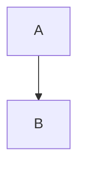

# 前言 (Preface)

**引领 AI 新纪元：大语言模型的力量与挑战**

$$
\int_{-\infty}^{\infty} e^{-x^2} dx = \sqrt{\pi}
$$
$$
\hat{y} 
$$

$\frac{a}{b}$ 或 $\dfrac{a}{b}$（强制大尺寸）
$\sum_{i=1}^n i = \frac{n(n+1)}{2}$
$x^2$ 和 $x_i$  
组合：$x^{2y}_{i+1}$

我们正处在一个由人工智能 (AI) 驱动的变革时代的黎明，而大规模语言模型 (Large Language Models, LLMs) 正是这场变革的核心引擎。这些强大的模型，以其在理解和生成人类语言方面展现出的惊人能力，正在重塑从科学研究、软件开发到内容创作、客户服务的几乎所有行业。它们不仅能够进行流畅的对话、撰写复杂的文本、翻译多种语言，甚至还能编写代码、进行逻辑推理，展现出前所未有的通用智能潜力。

然而，伴随着 LLM 带来的巨大机遇，也涌现出前所未有的挑战。如何设计、训练和部署这些动辄拥有数千亿甚至万亿参数的庞然大物？如何确保它们输出的内容是准确、可靠且符合人类价值观的？如何克服训练和推理过程中巨大的计算资源消耗和高昂成本？如何应对模型可能产生的偏见、幻觉和安全风险？这些都是亟待解决的关键问题。

本书旨在为您揭开 LLM 的神秘面纱，提供一份从基础原理、关键技术、训练实战到推理优化和前沿展望的全面指南。我们希望通过本书，不仅帮助您理解 LLM 的"是什么"和"为什么"，更能掌握"怎么做"，从而在 LLM 的浪潮中乘风破浪。

**您的 LLM 成长路线图：本书结构、读者指南与学习路径建议**

本书精心设计，旨在为不同背景和需求的读者提供一条清晰、循序渐进的 LLM 学习路径。全书共分为四个部分：

*   **第一部分：基础篇 (Foundations)** 旨在为读者打下坚实的理论基础。我们将从 LLM 的核心概念、发展历程和关键技术入手，回顾必要的深度学习和自然语言处理知识，并深入剖析作为 LLM 基石的 Transformer 架构及其重要的变种——专家混合模型 (MoE)。无论您是 AI 新手还是有一定经验的从业者，本部分都将为您后续的学习扫清障碍。
*   **第二部分：训练篇 (Training)** 将带您进入 LLM 的"锻造工厂"。我们将详细探讨数据工程、预训练目标与流程、分布式训练的核心策略 (DP, TP, PP, ZeRO 等)，以及参数高效微调 (PEFT) 和人类对齐 (RLHF, DPO 等) 等高级技术。本部分包含大量的实践指导和案例分析，助您掌握从零开始训练和定制 LLM 的关键技能。
*   **第三部分：推理篇 (Inference)** 聚焦于如何让训练好的 LLM 高效地"运行"起来。我们将讲解推理过程、多样的解码策略、模型压缩技术 (量化、剪枝、蒸馏) 以及推理加速的核心手段 (KV Cache, FlashAttention, 连续批处理等)。本部分将帮助您理解并掌握优化 LLM 推理性能、降低部署成本的关键方法，并介绍主流的高性能推理框架。
*   **第四部分：前沿与展望篇 (Frontiers and Outlook)** 将视野投向 LLM 的未来。我们将探讨多模态大模型、模型评估的挑战、伦理风险与负责任 AI 的构建，并展望 LLM 的未来发展趋势、开放挑战及其对科学和社会可能产生的深远影响。

**读者指南与学习路径建议：**

*   **对于 AI 初学者或希望系统了解 LLM 的读者：** 建议按照章节顺序阅读，特别是第一部分的基础知识至关重要。在学习过程中，可结合代码示例动手实践，加深理解。
*   **对于有一定 NLP 或深度学习基础的工程师/研究者：** 可以快速浏览第一部分，重点关注第三章的 Transformer 和 MoE 细节，然后深入学习第二、三部分的训练和推理优化技术，这些部分包含了大量前沿且实用的工程实践。
*   **对于关注特定技术的读者：** 可以根据目录直接跳转到感兴趣的章节，例如分布式训练 (第六章)、PEFT (第七章)、量化 (第九章) 或推理系统 (第十章)。
*   **对于希望把握 LLM 发展趋势的决策者或产品经理：** 可以重点阅读第一章、第七章后半部分、第十一至十三章，以快速了解 LLM 的能力、应用、局限性、伦理风险和未来方向。

我们鼓励读者在学习过程中积极思考，将理论知识与实际应用相结合。书中的代码示例和实战演练旨在提供动手实践的机会，我们强烈建议您尝试运行和修改它们。

**本书承诺：深度原理、翔实代码、前沿优化、完整体系**

撰写本书的初衷，是希望填补当前 LLM 领域高质量、系统性中文资源的空白。我们力求做到：

*   **深度原理：** 不满足于表面介绍，深入剖析核心技术 (如 Transformer, MoE, LoRA, RLHF, FlashAttention 等) 的数学原理、设计思想和演进脉络。
*   **翔实代码 (待补充)：** (虽然本书主要以文字和图表呈现，但会在关键部分提供伪代码或指向 H ug g i n g Face 等开源库的示例，帮助读者理解实现细节。) 我们计划在后续的在线版本或附带资源中提供更丰富的代码实现。
*   **前沿优化：** 紧跟 LLM 发展趋势，详细介绍分布式训练、参数高效微调、量化、推理加速等领域的最新技术和最佳实践。
*   **完整体系：** 覆盖从基础概念、数据处理、模型训练、对齐、压缩、优化到部署、评估和伦理的全链路知识，构建一个相对完整的 LLM 知识框架。

我们深知 LLM 领域发展日新月异，书中内容难免有疏漏或过时之处。我们真诚欢迎读者的批评指正，并会持续关注领域进展，努力在未来的版本中更新迭代。

希望本书能成为您在探索 LLM 世界过程中的得力助手和忠实伙伴，伴您一同见证并参与这场激动人心的 AI 革命！ 