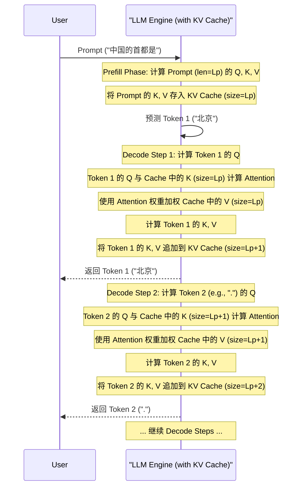
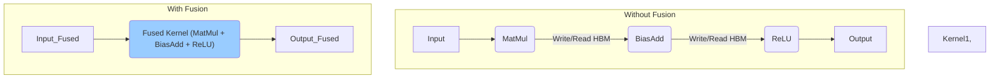

# 第10章：极致加速：推理优化技术与系统设计 (KV Cache, FlashAttention, Batching, MoE Inference) (Achieving Blazing Speed: Advanced Inference Acceleration and System Optimization)

在第 8 章，我们了解了 LLM 如何生成文本以及各种解码策略；在第 9 章，我们学习了如何通过模型压缩技术为 LLM "瘦身"。然而，仅仅压缩模型往往还不够，尤其是在追求极致性能、高吞吐量和低延迟的场景下。为了充分释放 LLM 的潜力并高效地服务于实际应用，我们还需要深入**推理过程本身**，利用各种先进的**优化技术**和**专门设计的推理系统**。

本章将聚焦于 LLM 推理的**性能优化**。我们将从 LLM 推理中最核心、也最耗时的计算——**注意力机制 (Attention)** 入手，探讨**KV Cache** 的原理及其优化，以及革命性的 **FlashAttention** 和 **PagedAttention** 技术如何极大提升计算效率和显存管理能力。接着，我们将学习编译器层面的优化手段，如**核函数融合 (Kernel Fusion)** 和**图优化 (Graph Optimization)**。我们还将深入研究**批处理 (Batching)** 技术，从静态批处理到更先进的**连续批处理 (Continuous Batching)**，了解它们如何提升系统吞吐量。此外，我们还会讨论在推理阶段部署超大模型所需的**模型并行 (Model Parallelism)** 技术，以及 **MoE 模型推理**所面临的独特挑战及其优化策略。最后，我们将巡礼当前主流的高性能 LLM 推理引擎与框架（如 TensorRT-LLM, vLLM, TGI, DeepSpeed Inference），了解它们的特性与选择，并探讨硬件加速的新趋势以及如何进行有效的基准测试。

掌握本章内容，您将能够：

*   深入理解 KV Cache 的工作原理、显存挑战及优化方法。
*   掌握 FlashAttention 和 PagedAttention 等前沿 Attention 优化技术的核心思想与优势。
*   了解编译器优化在推理加速中的作用。
*   区分不同批处理策略，理解连续批处理如何提升吞吐量。
*   了解如何在推理中应用模型并行技术。
*   认识 MoE 推理的瓶颈并了解其优化方向。
*   熟悉主流 LLM 推理引擎的特点和适用场景。
*   对 LLM 推理的硬件加速方案和性能评估有更全面的认识。

准备好进入 LLM 推理的"高速公路"，探索将模型运行效率推向极致的尖端技术吧！

## 10.1 避免重复计算：KV Cache 原理、优化与显存管理挑战 (Avoiding Redundant Computation: KV Cache Principle, Optimization, and Memory Management Challenges)

在第 8 章我们知道，LLM 的文本生成是一个**自回归 (Autoregressive)** 过程：模型一次生成一个 Token，并将新生成的 Token 追加到输入序列中，然后预测下一个 Token。在这个过程中，Transformer 模型的核心计算单元——**自注意力机制 (Self-Attention)** 需要计算每个 Token 与序列中所有先前 Token (包括自身) 之间的关联度。

如果我们简单地在每一步都将**完整的、不断增长的序列**输入模型进行计算，将会导致巨大的**计算冗余**。因为对于已经处理过的 Token，其对应的 **Key (K)** 和 **Value (V)** 向量（在自注意力计算中，Query Q 会与 K 计算相似度，然后用这个相似度加权 V）在后续的生成步骤中是**不会改变**的（对于 Decoder-only 模型中的非 Masked 部分而言）。

**KV Cache 的核心原理：**

为了避免这种重复计算，**KV Cache** 应运而生。其核心思想是：**将先前计算过的 Token 的 Key 和 Value 向量缓存起来，在后续生成步骤中直接复用，无需重新计算**。

**工作流程：**

1.  **处理 Prompt (Prefill 阶段)**：当模型第一次处理输入 Prompt 时（例如 "中国的首都是"），它会计算 Prompt 中所有 Token 的 K 和 V 向量，并将它们存储在一个专门的缓存区域（KV Cache）中。假设 Prompt 有 $L_p$ 个 Token。
2.  **生成第一个新 Token (Decoding 阶段 - Step 1)**：模型基于 Prompt 的信息预测出第一个新 Token（例如 "北京"）。在这一步计算自注意力时，该新 Token 的 Query (Q) 向量会与 KV Cache 中存储的 $L_p$ 个 Token 的 K 和 V 向量进行计算。同时，模型也会计算这个新 Token 自身的 K 和 V 向量，并将其**追加**到 KV Cache 中。现在 Cache 中有 $L_p + 1$ 个 Token 的 K 和 V。
3.  **生成后续 Token (Decoding 阶段 - Step 2, 3, ...)**：当生成第 $t$ 个新 Token 时（$t>1$），其 Query (Q) 向量会与 KV Cache 中已经存储的 $L_p + t - 1$ 个 Token 的 K 和 V 向量进行计算。这一步的计算量仅与序列长度（越来越长）有关，但**避免了对前面 $L_p + t - 1$ 个 Token 的 K 和 V 的重复计算**。同时，新生成的第 $t$ 个 Token 的 K 和 V 也会被计算并追加到 Cache 中。



**KV Cache 的优势：**

*   **显著加速解码阶段 (Decoding Phase)**：解码阶段是逐 Token 生成的，如果不使用 KV Cache，每一步都需要处理整个序列，计算量与序列长度的平方相关 ($O(L^2)$)。使用 KV Cache 后，每个解码步只需要计算新 Token 的 Q，并与 Cache 中的 K/V 进行 Attention 计算，计算量大致与序列长度成线性关系 ($O(L)$)，大大加快了生成速度（TPOT 降低）。
*   Prefill 阶段虽然需要处理整个 Prompt，但通常只做一次，且可以并行计算所有 Prompt Token 的 Attention。

**KV Cache 的显存管理挑战：**

尽管 KV Cache 极大地提升了计算效率，但也带来了巨大的**显存占用**问题。

*   **Cache 大小**：KV Cache 需要存储模型**每一层 (num_layers)**、**每个注意力头 (num_heads)**、**序列中每个 Token (sequence_length)** 的 Key 和 Value 向量。每个 K 和 V 向量的维度通常是 `hidden_size / num_heads`。因此，其总大小可以估算为：
    $Size_{KV Cache} \approx batch\_size \times sequence\_length \times num\_layers \times hidden\_size \times 2 (K \text{ and } V) \times precision\_bytes$
*   **影响因素**：
    *   **序列长度 (Sequence Length)**：Cache 大小与序列长度成**线性**关系。对于需要处理长上下文（如几万甚至几十万 Token）的 LLM，KV Cache 会变得极其庞大。
    *   **批处理大小 (Batch Size)**：Cache 大小与批处理大小成**线性**关系。为了提高吞吐量而增大 Batch Size 会急剧增加 Cache 占用。
    *   **模型规模 (Model Size)**：层数 (`num_layers`) 和隐藏层维度 (`hidden_size`) 越大的模型，Cache 越大。
    *   **数据精度 (Precision)**：使用 FP16/BF16 比 FP32 占用减半，使用 INT8 或更低精度量化（如果可行）可以进一步减少占用。

**KV Cache 显存瓶颈的后果：**

*   **限制最大序列长度和批处理大小**：在给定的 GPU 显存下，KV Cache 的大小往往成为限制系统能够处理的最大序列长度和最大并发请求数（Batch Size）的主要瓶颈，甚至超过了模型权重本身的显存占用。
*   **内存碎片化 (Memory Fragmentation)**：在动态接收不同长度序列请求的推理服务器中，频繁地为 KV Cache 分配和释放内存块，容易导致显存碎片化。即使总的可用显存足够，也可能因为没有足够大的连续内存块来存储新的 Cache 而导致请求失败（Out-Of-Memory, OOM）。

**KV Cache 优化与显存管理技术：**

为了缓解 KV Cache 带来的显存压力，研究者们提出了多种优化技术：

1.  **量化 (Quantization)**：将存储在 Cache 中的 K 和 V 向量进行量化，例如使用 INT8 或 FP8 甚至更低精度来存储。这可以直接、显著地降低 Cache 的显存占用。但需要注意量化可能带来的精度损失。
2.  **注意力机制优化 (Attention Mechanism Optimization)**：
    *   **Multi-Query Attention (MQA)** 和 **Grouped-Query Attention (GQA)**：标准的多头注意力 (MHA) 中，每个头都有独立的 K 和 V 向量。MQA 让所有头共享同一组 K 和 V 向量，GQA 则将头分成几组，组内共享 K 和 V。这可以**大幅减少 KV Cache 的大小**（减少了 `num_heads` 倍或 `num_groups` 倍）和访存量，同时对模型性能影响相对较小。许多现代 LLM（如 Llama 2, Mistral）都采用了 GQA 或 MQA。
3.  **高效的内存管理 (Efficient Memory Management)**：
    *   **PagedAttention**（将在下一节详细介绍）：借鉴操作系统中虚拟内存和分页的思想，将 KV Cache 存储在非连续的、固定大小的物理内存块（Pages）中。这可以**消除内存碎片化**，提高显存利用率，并实现更灵活的 Cache 共享和管理。
    *   **内存池 (Memory Pool)**：预先分配一大块内存作为 Cache 的内存池，按需从中分配和释放固定大小的块，减少碎片。

KV Cache 是 LLM 高效推理的核心技术，但其巨大的显存占用是必须解决的关键挑战。通过结合量化、MQA/GQA 以及 PagedAttention 等先进内存管理技术，可以有效缓解这一瓶颈，支持更长的序列、更大的批处理和更高的吞吐量。

## 10.2 Attention 计算优化：FlashAttention 与 PagedAttention 的革命性进展 (Attention Computation Optimization: Revolutionary Progress with FlashAttention and PagedAttention)

自注意力机制是 Transformer 的核心，但其计算和访存开销巨大，尤其是在处理长序列时，成为 LLM 推理的主要性能瓶颈之一。本节将介绍两种革命性的 Attention 优化技术：FlashAttention 和 PagedAttention。

**1. FlashAttention：加速 Attention 计算并节省显存**

*   **传统 Attention 的瓶颈**：标准自注意力的计算 $Attention(Q, K, V) = softmax(\frac{QK^T}{\sqrt{d_k}})V$ 涉及到几个大的矩阵乘法（$QK^T$, $P = softmax(...)$, $PV$）以及一个 Softmax 操作。在处理长序列 $L$ 时，中间结果 $QK^T$ 和 $P$ 的大小为 $L \times L$，显存占用与序列长度的平方成正比 ($O(L^2)$)。更关键的是，这些计算严重受到**显存带宽 (Memory Bandwidth)** 的限制。GPU 需要反复从高带宽内存（HBM，即 GPU 显存）中读取 Q, K, V，计算中间结果，并将中间结果写回 HBM，再读取中间结果进行下一步计算，最后写回最终结果。这种频繁的 HBM 读写（IO 操作）远比 GPU 的实际计算（FLOPs）要慢，导致计算单元利用率低下。

*   **FlashAttention 的核心思想**：通过**核函数融合 (Kernel Fusion)、分块计算 (Tiling)** 和 **重计算 (Recomputation)** 技术，**避免将巨大的中间注意力矩阵 ($QK^T$ 和 $P$) 写回 HBM**，从而大幅减少 HBM 读写次数，提高计算效率并减少显存占用（不再需要 $O(L^2)$ 的额外显存存储中间矩阵）。

*   **技术细节概览**：
    *   **分块计算 (Tiling)**：将输入 Q, K, V 矩阵沿序列长度维度分成若干个块 (Tiles)。计算以块为单位进行。
    *   **核函数融合 (Kernel Fusion)**：将 Attention 计算的多个步骤（矩阵乘法、缩放、Masking、Softmax、加权求和）融合到一个单独的 GPU 核函数 (Kernel) 中执行。
    *   **片上 SRAM 计算**：利用 GPU 核心旁边速度极快但容量有限的**静态随机存取存储器 (SRAM)**。将 Q, K, V 的块加载到 SRAM 中，在 SRAM 内完成这些块的 Attention 计算（包括 Softmax），只将最终的输出块写回 HBM。由于 SRAM 带宽远高于 HBM，这大大减少了慢速 HBM 的读写。
    *   **重计算 (Recomputation)**：在反向传播（训练时）需要 Softmax 的中间结果进行梯度计算。FlashAttention 不存储这些中间结果，而是在反向传播时利用前向传播保存的 Softmax 归一化统计量（行和、行最大值）**重新计算**所需的 Attention 权重，这比存储整个 $L \times L$ 矩阵的显存开销小得多。对于推理，主要利用其减少 HBM 读写和 $O(L^2)$ 显存的优势。

```mermaid
graph TD
    subgraph "Standard Attention"
        QKV_HBM["Q, K, V (in HBM)"] --> Load1(Load Q, K to SRAM/Registers);
        Load1 --> MatMul1("Compute QK^T");
        MatMul1 --> Write1("Write QK^T (L x L) to HBM");
        Write1 --> Load2("Load QK^T from HBM");
        Load2 --> Softmax("Compute Softmax(QK^T / sqrt(dk)) = P");
        Softmax --> Write2("Write P (L x L) to HBM");
        Write2 --> Load3("Load P, V from HBM");
        Load3 --> MatMul2("Compute PV = Output");
        MatMul2 --> Write3("Write Output to HBM");
    end

    subgraph "FlashAttention"
        QKV_HBM_Flash["Q, K, V (in HBM)"] --> Load_Tiles("Load Q, K, V Tiles to SRAM");
        Load_Tiles --> FusedKernel{Fused Kernel (in SRAM)};
        FusedKernel -- "Compute Attention Output Tile by Tile" --> FusedKernel;
        FusedKernel --> Write_Output_Tiles("Write Output Tiles to HBM");
    end

    style Write1 fill:#f99,stroke:#333,stroke-width:2px
    style Write2 fill:#f99,stroke:#333,stroke-width:2px
    style Load2 fill:#f99,stroke:#333,stroke-width:2px
    style Load3 fill:#f99,stroke:#333,stroke-width:2px
    style FusedKernel fill:#9cf,stroke:#333,stroke-width:2px
```

*   **优势**：
    *   **显著加速**：减少了大量 HBM 访存，推理和训练速度更快（通常有 1.x ~ 3x 或更高的加速）。
    *   **极大节省显存**：不再需要存储 $O(L^2)$ 的中间矩阵，使得可以处理更长的序列。
    *   **数值稳定**：通过在线 Softmax 计算避免了大数值问题。
*   **版本**：FlashAttention-2 是其改进版本，进一步优化了并行度和工作划分，通常比 V1 更快。
*   **应用**：已成为现代 LLM 训练和推理框架（如 PyTorch, Triton, vLLM, TensorRT-LLM）的标准或可选组件。

**2. PagedAttention：优化 KV Cache 内存管理**

*   **KV Cache 的碎片化问题**：如 10.1 节所述，传统的 KV Cache 实现通常为每个请求序列预先分配一块**连续**的显存空间。由于不同请求的序列长度不同，且序列长度在生成过程中动态增长，这会导致严重的**内存碎片化**。即使总空闲显存很多，也可能因为找不到足够大的连续块而无法服务新请求或扩展现有请求的 Cache，导致显存利用率低下（可能只有 60%-80%）。
*   **PagedAttention 的核心思想**：借鉴操作系统中**虚拟内存分页 (Paging)** 的概念，**将 KV Cache 不存储在连续的内存块中，而是存储在若干个固定大小（例如 16 或 32 个 Token 的 K 和 V）的物理块 (Physical Blocks / Pages) 中**。逻辑上连续的 Token 序列的 KV Cache 可以映射到物理上不连续的块。
*   **工作机制**：
    *   **块管理器 (Block Manager)**：维护一个物理块的池，负责分配和释放块。
    *   **逻辑块表 (Logical Block Table)**：每个序列维护一个表，记录其逻辑 Token 位置到物理块的映射关系。
    *   **按需分配**：当序列生成新的 Token 时，如果当前最后一个物理块已满，块管理器会分配一个新的物理块，并更新该序列的逻辑块表。
    *   **核函数修改**：Attention 核函数需要修改，使其能够根据逻辑块表查找并加载物理上不连续的 K 和 V 块进行计算。

```mermaid
graph TD
    subgraph "Traditional KV Cache (Fragmentation)"
        A["GPU Memory (HBM)"] --- B(Seq1 Cache: Contiguous Block - Size L1);
        A --- C(Seq2 Cache: Contiguous Block - Size L2);
        A --- D(Seq3 Cache: Contiguous Block - Size L3);
        A --- E[Free Space (Fragmented)];
        E -- "Cannot fit large new Seq4 Cache" --> F((OOM Error));
    end

    subgraph "PagedAttention (No Fragmentation)"
        G["GPU Memory (HBM) with Block Manager"] --- H[Physical Block 1];
        G --- I[Physical Block 2];
        G --- J[Physical Block 3];
        G --- K[Physical Block 4];
        G --- L[Physical Block 5];
        G --- M[...]

        Seq1_Table{Seq1 Logical Block Table} --> H;
        Seq1_Table --> J;

        Seq2_Table{Seq2 Logical Block Table} --> I;

        Seq3_Table{Seq3 Logical Block Table} --> K;
        Seq3_Table --> L;

        N[Free Physical Blocks] -- "Allocate for new Seq4" --> O(Seq4 Uses Free Blocks);
    end

    style E fill:#f99
    style N fill:#9cf
```

*   **优势**：
    *   **消除内存碎片**：通过使用固定大小的块，几乎完全消除了内部和外部碎片，显存利用率可达 90% 以上。
    *   **提高吞吐量**：更高的显存利用率意味着在相同硬件上可以容纳更大的批处理大小，从而显著提升吞吐量。
    *   **灵活的内存共享 (Memory Sharing)**：对于使用相同 Prompt 前缀的不同请求（例如在 Beam Search 或并行采样中），它们的 KV Cache 的初始部分可以映射到相同的物理块，实现**写时复制 (Copy-on-Write)** 式的内存共享，进一步节省显存。例如，并行生成多个回答时，Prompt 部分的 Cache 只需存一份。
*   **应用**：PagedAttention 是 **vLLM** 推理引擎的核心技术，也是其实现高吞吐量的关键。其他推理框架也在逐步引入类似的思想。

**总结：**

FlashAttention 和 PagedAttention 是近年来 LLM 推理优化领域的重大突破。FlashAttention 通过优化计算过程本身，解决了 Attention 计算的访存瓶颈，实现了加速并节省了中间结果的显存。PagedAttention 则通过优化 KV Cache 的内存管理，解决了碎片化问题，提高了显存利用率和系统吞吐量。这两项技术的结合，极大地提升了 LLM 推理的效率和可扩展性。

## 10.3 编译器魔法：利用 Kernel Fusion 与 Graph Optimization 提升硬件效率 (Compiler Magic: Boosting Hardware Efficiency with Kernel Fusion and Graph Optimization)

除了针对特定算子（如 Attention）的优化，我们还可以利用**深度学习编译器**的技术，在更宏观的层面自动优化整个计算图，进一步提升 LLM 推理的硬件效率。编译器优化主要包括两大类：**核函数融合 (Kernel Fusion)** 和**图优化 (Graph Optimization)**。

**1. 核函数融合 (Kernel Fusion)**

*   **背景**：GPU 执行计算任务是通过调用一个个**核函数 (Kernel)** 来完成的。每次调用 Kernel 都会有一定的启动开销 (Kernel Launch Overhead)，并且数据需要在 Kernel 执行前后从 HBM 加载到计算单元再写回 HBM。如果一个计算图中包含许多细小的、逐元素操作（Element-wise Operations，如加法、乘法、激活函数 ReLU/GeLU 等），这些操作本身计算量不大，但频繁的 Kernel 调用和 HBM 读写会成为瓶颈。
*   **原理**：编译器分析计算图，识别出可以**合并 (Fuse)** 到单个 Kernel 中执行的连续操作序列。例如，可以将一个线性层的矩阵乘法、加 Bias、应用 ReLU 激活函数这三个步骤融合到一个 Kernel 中。
*   **好处**：
    *   **减少 Kernel 启动开销**：将多次 Kernel 调用合并为一次。
    *   **减少 HBM 读写**：中间结果可以直接保存在 GPU 的寄存器 (Registers) 或 SRAM 中，无需写回 HBM 再读出，显著降低访存延迟。
    *   **提高计算单元利用率**：减少了等待数据传输的时间。
*   **示例**：
    *   融合逐元素操作：`y = relu(x + b)` 可以融合成一个 Kernel。
    *   融合层内操作：线性层 (`MatMul + BiasAdd + Activation`) 或层归一化 (LayerNorm) 的计算通常可以被高度融合。
*   **工具**：PyTorch 2.x 的 `torch.compile`、TensorFlow 的 XLA (Accelerated Linear Algebra)、NVIDIA 的 TensorRT、TVM、ONNX Runtime 等都具备 Kernel Fusion 的能力。



**2. 图优化 (Graph Optimization)**

*   **背景**：深度学习模型本质上是一个计算图 (Computational Graph)，表示了数据流动和计算依赖关系。编译器可以在这个图的层面上进行各种优化。
*   **常见优化技术**：
    *   **常量折叠 (Constant Folding)**：在编译时预先计算出图中可以确定的常量表达式的结果，用结果替换原来的表达式，减少运行时的计算量。例如，如果图中有一个 `a = 5, b = 10, c = a * b`，编译器可以直接计算出 `c = 50`。
    *   **公共子表达式消除 (Common Subexpression Elimination, CSE)**：识别图中重复计算的相同子图或表达式，只计算一次并将结果复用。
    *   **代数化简 (Algebraic Simplification)**：利用代数规则简化表达式，例如 `x * 1 = x`, `x + 0 = x`, `(a*b) + (a*c) = a * (b+c)`。
    *   **算子替换 (Operator Substitution)**：将某些算子替换为等价但更高效的实现。例如，用特定的库函数替换通用的数学运算。
    *   **层融合 (Layer Fusion)**：比 Kernel Fusion 更高层次的融合，例如将多个连续的卷积层或线性层融合成一个更复杂的层（如果硬件支持）。
    *   **数据布局优化 (Data Layout Optimization)**：根据硬件特性（如内存访问模式、向量指令集）调整张量在内存中的存储格式（如 NCHW vs NHWC），以获得更好的访存和计算性能。例如，GPU 通常更偏好 NHWC 布局。
    *   **无效代码消除 (Dead Code Elimination)**：移除计算图中那些对最终输出没有影响的部分。

*   **好处**：
    *   减少冗余计算。
    *   简化计算图，可能为后续的 Kernel Fusion 创造更多机会。
    *   优化内存访问模式。
    *   整体提升计算效率。

**编译器在 LLM 推理中的作用：**

对于 LLM 这种包含大量重复结构（Transformer Block）和各种计算操作的模型，编译器的自动优化能力尤为重要。

*   **TensorRT**：NVIDIA 提供的深度学习推理优化器和运行时库。它接收用户定义的模型（如 ONNX, TensorFlow, PyTorch 格式），进行深入的图优化、Kernel Fusion、精度校准（支持 INT8/FP8 量化）和 Kernel 自动调整 (Auto-tuning)，生成针对特定 NVIDIA GPU 硬件高度优化的推理引擎。是追求极致性能常用的选择。
*   **PyTorch Compile (`torch.compile`)**：PyTorch 2.x 引入的 JIT (Just-In-Time) 编译器功能。通过简单的 API 调用，可以自动将 PyTorch 代码编译成优化的 Kernel，利用 Triton（一种 Pythonic 的 GPU 编程语言）或其他后端（如 TensorRT 后端）进行代码生成和优化，通常能带来显著的速度提升，且对用户代码改动最小。
*   **XLA (TensorFlow/JAX)**：TensorFlow 和 JAX 使用的编译器，能够进行广泛的图优化和 Kernel Fusion，生成高效的 CPU/GPU/TPU 代码。
*   **ONNX Runtime**：一个跨平台的推理引擎，支持多种执行提供者（Execution Providers, EPs），如 CUDA, TensorRT, OpenVINO (Intel) 等。它会对 ONNX 格式的模型进行图优化，并调用相应的 EP 进行硬件加速。

**总结：**

深度学习编译器通过 Kernel Fusion 和 Graph Optimization 等"魔法"，能够在不改变模型数学逻辑的前提下，自动地重排、简化和融合计算操作，使其更适应底层硬件的特性，从而有效减少计算冗余、降低访存开销、提升硬件利用率。利用好这些编译器技术，是榨干硬件性能、实现 LLM 高效推理的关键环节之一。

## 10.4 批处理的艺术：从静态批处理到连续批处理 (Continuous Batching) 提升吞吐量 (The Art of Batching: Boosting Throughput from Static to Continuous Batching)

**批处理 (Batching)** 是提高 GPU 利用率和系统吞吐量的基本技术。GPU 是高度并行的计算设备，一次处理单个请求往往无法充分利用其强大的计算能力。通过将多个独立的推理请求组合成一个批次 (Batch)，一起输入模型进行计算，可以大幅摊销 Kernel 启动开销，并让 GPU 的众多计算单元同时工作，从而提高整体处理效率（吞吐量）。

**1. 静态批处理 (Static Batching)**

*   **原理**：最简单的批处理方式。服务器等待收集到足够数量（达到预设的批处理大小 `batch_size`）的请求，或者等待一个固定的超时时间，然后将这些请求打包成一个批次进行处理。
*   **实现**：需要对输入进行**填充 (Padding)**。因为同一批次中的请求序列长度通常不同，需要将较短的序列用特殊的填充 Token (Padding Token) 填充到与该批次中最长序列相同的长度，形成一个规整的矩形张量输入模型。同时需要提供一个**注意力掩码 (Attention Mask)**，告知模型在计算 Attention 时忽略填充部分。
*   **优点**：
    *   实现简单。
    *   相比不批处理（Batch Size=1），可以显著提高 GPU 利用率和吞吐量。
*   **缺点**：
    *   **计算浪费 (Wasted Computation)**：对填充部分的计算是完全浪费的，序列长度差异越大，浪费越严重。这不仅消耗计算资源，还占用不必要的 KV Cache 空间。
    *   **高延迟 (High Latency)**：请求必须等待批次凑齐或超时才能开始处理，导致单个请求的延迟增加（尤其是 TTFT）。队头阻塞 (Head-of-Line Blocking) 问题严重。
    *   **吞吐量受限**：如果请求到达率不稳定，或者超时时间设置不当，可能导致批次大小经常达不到目标值，GPU 利用率仍然不高。吞吐量对批处理大小和超时时间的设置非常敏感。

```mermaid
graph TD
    subgraph "Static Batching Example (Batch Size=3)"
        R1[Request 1 (Len=10)] --> Wait{Wait for Batch};
        R2[Request 2 (Len=5)] --> Wait;
        R3[Request 3 (Len=15)] --> Wait;

        Wait -- Batch Ready --> Process;
        Process --> Pad{Pad Shorter Seqs};
        Pad --> InputTensor["Input Tensor (Batch=3, MaxLen=15)"];
        InputTensor --> Model{LLM Inference};
        Model --> OutputTensor["Output Tensor"];
        OutputTensor --> Unpad{Unpad/Decode};
        Unpad --> Res1(Response 1);
        Unpad --> Res2(Response 2);
        Unpad --> Res3(Response 3);

        R4[Request 4 (Len=8)] --> Wait2{Wait for Next Batch...};
    end

    style Pad fill:#f99
    style Wait fill:#fc9
```

**2. 连续批处理 (Continuous Batching) / 动态批处理 (Dynamic Batching) / In-flight Batching**

*   **核心思想**：**解耦请求的到达、处理和完成**。服务器**持续不断地**接收新请求，并将它们动态地加入到当前正在 GPU 上处理的批次中，同时从批次中移除已经完成生成（或达到停止条件）的请求。不再需要严格等待凑齐固定大小的批次，也不再需要将所有请求填充到相同的最大长度。
*   **关键技术**：
    *   **迭代级调度 (Iteration-level Scheduling)**：服务器在**每一个解码步 (Iteration)** 之后，都可以动态地决定下一个批次包含哪些请求。新到达的请求可以立即加入下一个解码步（如果 GPU 容量允许），完成的请求则在当前解码步结束后移出。
    *   **高效的 KV Cache 管理**：连续批处理的实现严重依赖于高效的 KV Cache 管理机制，如 **PagedAttention**。因为批次中的序列长度各不相同且动态变化，需要能够灵活、高效地分配、释放和访问非连续的 KV Cache 块。PagedAttention 完美地满足了这一需求。
    *   **请求队列管理**：需要一个有效的机制来管理等待队列中的请求，并根据优先级（如先到先服务、或者根据序列长度等）将它们调度到 GPU 上。
*   **优点**：
    *   **显著提高 GPU 利用率和吞吐量**：GPU 始终保持繁忙状态，处理不同阶段的多个请求。相比静态批处理，吞吐量可以提升数倍甚至一个数量级。
    *   **减少计算浪费**：无需（或只需少量）填充，每个 Token 的计算都更有价值。
    *   **降低平均延迟**：请求无需长时间等待凑批，可以更快地开始处理和获得响应。虽然单个请求的 TPOT 可能因为批次更大而略有增加，但整体端到端延迟通常会降低。
    *   **更平滑的服务质量**：系统对请求到达率的变化不那么敏感。
*   **缺点**：
    *   **实现复杂**：需要复杂的调度逻辑、状态管理和高效的内存管理（如 PagedAttention）。
    *   需要专门的推理引擎支持。

```mermaid
graph TD
    subgraph "Continuous Batching Example"
        subgraph "Request Queue"
            Q1(Req 1)
            Q2(Req 2)
            Q3(Req 3)
            Q4(Req 4)
        end

        Scheduler{Iteration-level Scheduler}

        subgraph "GPU Processing (Iteration t)"
            GPU_Batch_t["Batch @ t (e.g., Req A, Req B)"];
            KV_Cache_t[KV Cache (PagedAttention)];
            GPU_Batch_t --> Compute_t{Compute Decodes};
            Compute_t --> KV_Cache_t;
        end

        Compute_t -- Output Tokens --> Decode_t{Decode & Send};

        Compute_t -- Completed Req B --> Scheduler;
        Scheduler -- Add Req 1 --> GPU_Batch_t_plus_1["Batch @ t+1 (e.g., Req A, Req 1)"];
        Scheduler -- Add Req 2 --> GPU_Batch_t_plus_1;

        Q1 --> Scheduler;
        Q2 --> Scheduler;
        Q3 --> Scheduler;
        Q4 --> Scheduler;

        Scheduler --> GPU_Batch_t_plus_1;
        GPU_Batch_t_plus_1 --> KV_Cache_t_plus_1[KV Cache];
        GPU_Batch_t_plus_1 --> Compute_t_plus_1{Compute Decodes};
        Compute_t_plus_1 --> Decode_t_plus_1{Decode & Send};
        Compute_t_plus_1 -- Completed Req A --> Scheduler;
        # ... and so on

    end

    style Scheduler fill:#ccf
    style GPU_Batch_t, GPU_Batch_t_plus_1 fill:#9cf
```

**总结：**

连续批处理是现代高性能 LLM 推理服务的关键技术。它通过在迭代级别动态管理请求批次，并结合 PagedAttention 等高效内存管理机制，克服了静态批处理的填充浪费和高延迟问题，能够将 GPU 利用率和系统吞吐量推向新的高度。像 vLLM、TensorRT-LLM（通过其 Batch Manager）、TGI（Text Generation Inference）等先进的推理引擎都采用了连续批处理（或类似）的思想。选择支持连续批处理的推理框架是实现高效率 LLM 服务的重要一步。

## 10.5 推理中的模型并行：部署无法单卡容纳的巨型模型 (Model Parallelism in Inference: Deploying Giant Models That Don't Fit on a Single Card)

对于参数量极其庞大（例如数百亿甚至上千亿）的 LLM，即使经过量化，其权重本身也可能无法完全放入单个 GPU 的显存中。在这种情况下，我们需要借助**模型并行 (Model Parallelism, MP)** 技术，将模型的不同部分**拆分 (Shard)** 到多个 GPU 上，协同完成推理计算。

这与我们在第 6 章讨论的训练中的模型并行类似，但在推理场景下，目标是最小化延迟和最大化吞吐量，而不是优化训练速度和处理梯度同步。

**常见的推理模型并行策略：**

1.  **张量并行 (Tensor Parallelism, TP)** - 也称作层内并行 (Intra-layer Parallelism)
    *   **原理**：将单个层（尤其是计算密集的线性层或 Attention 层）的**权重矩阵**沿其维度（行或列）进行切分，并将计算分布到多个 GPU 上。每个 GPU 只存储和处理权重矩阵的一部分。在计算过程中，需要通过**通信操作**（如 All-Reduce 或 All-Gather）来收集或分发中间结果。
    *   **Megatron-LM 方式**：是一种经典的 TP 实现。例如，对于线性层 $Y=XA$，可以将 $A$ 按列切分到 $N$ 个 GPU 上，每个 GPU 计算 $Y_i = XA_i$。对于下一个线性层 $Z=YB$，可以将 $B$ 按行切分，$B = [B_1^T, ..., B_N^T]^T$，每个 GPU 计算 $Z_i = Y_i B_i$，最后通过 All-Reduce 将所有 $Z_i$ 相加得到最终结果 $Z = \sum Z_i$。Attention 层的 QKV 矩阵和输出投影矩阵也可以类似地切分。
    *   **优点**：
        *   可以有效减少单个 GPU 的显存峰值（尤其是激活值的显存）。
        *   计算可以并行进行，有利于降低延迟。
    *   **缺点**：
        *   需要在层内进行频繁的 GPU 间通信，对通信带宽要求高。
        *   实现相对复杂。
    *   **适用场景**：适用于模型非常大，单个层的计算或激活值无法放入单卡的情况。通常与其他并行方式（如 PP）结合使用。

2.  **流水线并行 (Pipeline Parallelism, PP)** - 也称作层间并行 (Inter-layer Parallelism)
    *   **原理**：将模型的**不同层**分配到不同的 GPU（称为不同的 **Stage**）上。数据像流水线一样依次流过各个 Stage。例如，GPU 0 处理 1-10 层，GPU 1 处理 11-20 层，以此类推。
    *   **推理中的挑战**：在朴素的流水线实现中，后一个 Stage 必须等待前一个 Stage 完成才能开始计算，导致 GPU 会有大量的空闲时间（称为"流水线气泡 Pipeline Bubble"）。
    *   **优化：GPipe 或流水线调度**：为了减少气泡，可以将输入批次 (Batch) 进一步切分成更小的**微批次 (Micro-batches)**。不同的 Stage 可以并行处理不同的微批次，从而让流水线更加饱和。例如，当 Stage 0 处理完微批次 1 并将其传给 Stage 1 后，Stage 0 可以立即开始处理微批次 2。
    *   **优点**：
        *   可以显著降低单个 GPU 的权重显存占用，因为每个 GPU 只需存储模型的一部分层。
        *   通信开销相对 TP 较低，只在 Stage 边界传输激活值。
    *   **缺点**：
        *   容易产生流水线气泡，导致 GPU 利用率不高，增加延迟。需要精心设计的调度和足够大的批处理大小（拆分成多个微批次）才能有效填充气泡。
        *   负载均衡可能困难，需要合理划分层数到每个 Stage。
    *   **适用场景**：模型非常深，可以将层数均匀分配到多个设备上。尤其适用于权重显存成为主要瓶颈的情况。

```mermaid
graph TD
    subgraph "Tensor Parallelism (TP)"
        Input --> Split{Split Input/Weight};
        Split --> GPU1_TP[GPU1: Compute Part 1];
        Split --> GPU2_TP[GPU2: Compute Part 2];
        GPU1_TP -- Communicate --> Combine{Combine Results};
        GPU2_TP -- Communicate --> Combine;
        Combine --> Output_TP;
    end

    subgraph "Pipeline Parallelism (PP) with Micro-batches"
        InputBatch --> SplitMicro{Split into Micro-batches (mB1, mB2, ...)};

        SplitMicro -- mB1 --> Stage1_GPU1[Stage 1 (GPU1)];
        Stage1_GPU1 -- Activation --> Stage2_GPU2[Stage 2 (GPU2)];
        Stage2_GPU2 -- Activation --> Stage3_GPU3[Stage 3 (GPU3)];
        Stage3_GPU3 --> Output_mB1;

        SplitMicro -- mB2 --> Stage1_GPU1;
        Stage1_GPU1 -- Activation --> Stage2_GPU2;
        Stage2_GPU2 -- Activation --> Stage3_GPU3;
        Stage3_GPU3 --> Output_mB2;
        # ... Pipeline filled ...
    end

    style Communicate fill:#f99
    style Activation fill:#ccf
```

**组合使用 (Hybrid Parallelism)：**

在实践中，为了部署超大规模模型，通常会**组合使用张量并行和流水线并行**。例如，可以将模型先进行流水线划分（分成几个大的 Stage），然后在每个 Stage 内部再使用张量并行（将该 Stage 内的层切分到一组 GPU 上）。这允许更灵活地平衡计算、显存和通信的需求。

**推理引擎的支持：**

现代 LLM 推理引擎如 TensorRT-LLM, DeepSpeed Inference, Alpa 等都提供了对 TP 和 PP（以及它们的组合）的支持，简化了在多 GPU 环境下部署大型模型的复杂性。它们通常会自动处理模型的切分、通信的协调和执行的调度。

**总结：**

模型并行是部署那些无法放入单个 GPU 的巨型 LLM 的必要技术。张量并行通过层内切分权重来降低激活显存和计算延迟，但通信密集。流水线并行通过层间划分来降低权重显存，但需要克服流水线气泡问题。结合使用两者并利用先进推理引擎的支持，是高效运行超大规模模型的关键。

## 10.6 MoE 推理的挑战与优化：应对稀疏激活与负载均衡 (MoE Inference Challenges and Optimization: Handling Sparse Activation and Load Balancing)

专家混合 (MoE) 模型通过条件计算实现了参数规模的有效扩展。然而，这种稀疏激活的特性在推理阶段也带来了独特的挑战和优化需求。

**10.6.1 MoE 推理的独特瓶颈分析 (Analysis of Unique Bottlenecks in MoE Inference)**

1.  **动态和稀疏的计算 (Dynamic and Sparse Computation)**：与稠密模型不同，MoE 模型中每个 Token 只会激活少数几个（通常是 Top-k，k=1 或 2）专家。这意味着：
    *   **计算模式不规则**：并非所有专家都需要在每个解码步都被计算。被激活的专家组合是动态变化的，取决于门控网络的输出。
    *   **细粒度计算**：每个 Token 都需要经过门控网络计算，然后根据结果路由到相应的专家。这种细粒度的路由和条件执行增加了控制流的复杂性。

2.  **通信开销 (Communication Overhead)**：在分布式环境下（当模型大到需要模型并行，或者专家分布在不同设备上时），MoE 推理涉及显著的通信开销：
    *   **All-to-All 通信**：门控网络决定了每个设备上的 Token 需要发送到哪些（可能位于其他设备上的）专家。这通常需要一个 All-to-All 的通信操作，将 Token 从源设备发送到目标专家所在的设备。计算完成后，还需要将专家的输出发送回原始设备。All-to-All 通信的延迟和带宽消耗都很大。
    *   **负载不均加剧通信瓶颈**：如果某些专家比其他专家接收到更多的 Token（负载不均衡），会导致通信热点和等待。

3.  **负载不均衡 (Load Imbalance)**：门控网络的路由决策可能不是完全均匀的，某些专家可能比其他专家处理更多的 Token。这会导致：
    *   **计算资源浪费**：处理 Token 较少的专家所在的 GPU 计算单元空闲。
    *   **延迟增加**：整个批次的处理时间取决于负载最重的那个专家。
    *   训练时可以通过引入负载均衡损失 (Load Balancing Loss) 来缓解，但在推理时，这种不均衡性可能仍然存在或更加明显。

4.  **显存占用**：虽然 MoE 在推理时只计算少数专家，但**所有专家的参数通常都需要加载到显存中**（除非使用 Offloading 技术），这使得 MoE 模型的总显存占用仍然非常大。

```mermaid
graph TD
    subgraph "MoE Inference Bottlenecks"
        Input --> Gate{Gating Network};
        Gate -- Routing Decision (Sparse) --> Router{Token Router};

        subgraph "Distributed Setting"
            Router -- All-to-All Send --> Expert1_GPU1[Expert 1 (GPU1)];
            Router -- All-to-All Send --> Expert2_GPU2[Expert 2 (GPU2)];
            Router -- All-to-All Send --> ExpertN_GPUN[Expert N (GPUN)];

            Expert1_GPU1 --> Combine{Combine Outputs};
            Expert2_GPU2 --> Combine;
            ExpertN_GPUN --> Combine;

            Combine -- All-to-All Recv --> Output;
        end

        subgraph "Challenges"
            Sparse(Dynamic/Sparse Computation) --> ControlFlow(Complex Control Flow);
            Communication(All-to-All Communication) --> Latency(High Latency/Bandwidth Usage);
            Imbalance(Load Imbalance) --> WastedCompute(Wasted GPU Resources);
            Imbalance --> IncreasedLatency(Increased Overall Latency);
            LargeParams(Large Total Parameters) --> HighMemory(High Memory Footprint);
        end
    end

    style Communication fill:#f99
    style Imbalance fill:#fc9
```

**10.6.2 MoE 推理优化策略 (MoE Inference Optimization Strategies)**

为了克服这些挑战，需要采用专门的优化策略：

1.  **高效路由与调度 (Efficient Routing and Scheduling)**：
    *   **优化的 All-to-All 实现**：使用针对特定硬件和网络拓扑优化的 All-to-All 通信库（如 NCCL）。
    *   **异步通信 (Asynchronous Communication)**：将通信操作与计算操作重叠，隐藏一部分通信延迟。
    *   **Token 调度算法**：设计更智能的调度算法，尝试平衡发送到不同设备/专家的 Token 数量，或者优先处理负载较重路径上的 Token。

2.  **核函数优化 (Kernel Optimization)**：
    *   **融合门控和路由**：将门控网络计算和 Token 路由操作融合到单个或少数几个 Kernel 中，减少开销。
    *   **优化的稀疏矩阵乘法 (Sparse GEMM)**：虽然专家内部的计算是稠密的，但整个"大"MoE 层的计算可以看作是稀疏的。开发或利用支持块稀疏（Block Sparse）模式的 GEMM Kernel 可能带来收益（尽管当前实现不多）。
    *   **针对 MoE 的 Kernel**：专门为 MoE 架构设计的、能够高效处理条件执行和数据调度的 CUDA Kernel。

3.  **专家参数卸载 (Expert Offloading)**：
    *   **原理**：当 GPU 显存不足以容纳所有专家参数时，可以将不活跃的专家参数存储在 CPU 内存或 NVMe SSD 中。当某个专家被激活时，再将其参数加载（预取）到 GPU 显存中进行计算。
    *   **挑战**：需要非常高效的预取机制和快速的数据传输（如利用 GPUDirect Storage），以避免加载参数的延迟成为新的瓶颈。需要预测哪些专家可能会被激活。
    *   **适用场景**：显存极其受限，但可以容忍一定程度延迟增加的情况。

4.  **负载均衡策略 (Load Balancing Strategies)**：
    *   **容量因子调整 (Capacity Factor Tuning)**：在推理时，可以为每个专家设定一个处理 Token 的容量上限（Capacity Factor）。超过容量的 Token 可能会被丢弃或路由到次优的专家。调整容量因子可以在负载均衡和模型精度之间进行权衡。
    *   **动态专家选择/路由**：研究更智能的门控机制或路由策略，在推理时动态地尝试将负载更均匀地分配给可用的专家，同时最小化对模型性能的影响。

5.  **模型并行与 MoE 结合**：
    *   **专家并行 (Expert Parallelism, EP)**：将不同的专家放置在不同的 GPU 上。这是最自然的 MoE 分布式策略，但需要处理 All-to-All 通信。
    *   **结合 TP/PP**：可以将 EP 与 TP 或 PP 结合。例如，每个流水线 Stage 内部可以包含分布在多个设备上的专家（EP），或者每个专家本身可以用 TP 进一步切分。需要仔细设计并行策略以平衡计算、通信和显存。

**推理引擎的支持：**

像 DeepSpeed Inference, TensorRT-LLM, Sax (Google) 等系统都在探索和实现针对 MoE 推理的优化，包括高效的通信、负载均衡机制和与模型并行的集成。

**总结：**

MoE 推理因其稀疏激活和潜在的负载不均衡而面临独特的性能挑战，尤其是在分布式环境下。优化 MoE 推理需要综合运用高效的通信协议、专门的核函数、智能的调度与负载均衡策略，以及可能的参数卸载技术。随着 MoE 模型越来越受欢迎，针对其推理效率的优化将是未来研究的重要方向。

## 10.7 高性能推理引擎与框架：TensorRT-LLM, vLLM, TGI, DeepSpeed Inference 对比与最佳实践 (High-Performance Inference Engines and Frameworks: Comparison and Best Practices for TensorRT-LLM, vLLM, TGI, DeepSpeed Inference)

为了简化高性能 LLM 推理的部署并充分利用前面讨论的各种优化技术，社区和公司开发了许多专门的推理引擎和框架。这些工具封装了复杂的底层优化，提供了易于使用的接口。本节我们对比几个主流的选择：

**1. TensorRT-LLM (NVIDIA)**

*   **定位**：NVIDIA 官方推出的、基于 TensorRT 的开源库，专门用于优化和运行 LLM 推理。
*   **核心特性**：
    *   **深度优化**：利用 TensorRT 的全部威力，包括图优化、Kernel Fusion、精度校准（INT8/FP8）、Kernel Auto-tuning。
    *   **内置优化**：原生支持 FlashAttention/FlashAttention-2, MQA/GQA, PagedAttention (通过 KVCache Manager 实现类似效果), In-flight Batching (连续批处理)。
    *   **模型并行**：提供易于配置的张量并行 (TP) 和流水线并行 (PP)。
    *   **Python API & C++ Runtime**：提供 Python API 用于构建和编译优化后的引擎，以及高性能的 C++ Runtime 用于部署。
    *   **模型支持**：支持 Llama, GPT, GPT-J, Falcon, BLOOM, ChatGLM 等众多主流 LLM 架构，并易于扩展支持新模型。
    *   **Triton 集成**：可以轻松集成到 NVIDIA Triton Inference Server 中进行服务部署。
*   **优点**：
    *   通常能在 NVIDIA GPU 上达到**极致的性能**（低延迟和高吞吐量）。
    *   NVIDIA 官方支持，更新活跃，与硬件结合紧密。
    *   优化全面，支持量化和模型并行。
*   **缺点**：
    *   主要针对 NVIDIA GPU。
    *   学习曲线相对较陡，需要理解 TensorRT 的构建和编译流程。
    *   模型的支持和转换有时需要一些手动工作。
*   **最佳实践**：追求在 NVIDIA 平台上的最高性能；需要 FP8/INT8 量化支持；需要复杂的模型并行配置；可以投入时间进行模型编译和优化。

**2. vLLM (UC Berkeley 等)**

*   **定位**：一个专注于 LLM 推理吞吐量的开源库，其核心创新是 PagedAttention。
*   **核心特性**：
    *   **PagedAttention**：核心优势，极大提升显存利用率和吞吐量。
    *   **连续批处理**：高效的迭代级调度。
    *   **优化的 CUDA Kernel**：包含针对 Attention 等操作的优化 Kernel。
    *   **易用性**：提供与 Hugging Face `transformers` 类似的高层 Python API，易于上手。
    *   **分布式推理**：支持张量并行。
    *   **模型支持**：支持大多数 Hugging Face 上的主流 LLM。
*   **优点**：
    *   **极高的吞吐量**：通常在吞吐量指标上表现非常出色，尤其是在动态请求场景下。
    *   **易于使用**：API 设计友好，迁移成本低。
    *   **开源活跃**：社区支持良好。
*   **缺点**：
    *   **量化支持相对有限**：虽然在逐步增加（如 AWQ），但相比 TensorRT-LLM 可能不够全面。
    *   **单步延迟可能略高**：其优化重心在于最大化批处理和吞吐量，单个请求的 TPOT 可能不是最低的（但平均端到端延迟通常不错）。
    *   主要针对 GPU。
*   **最佳实践**：主要目标是最大化服务吞吐量；对易用性要求高；可以接受较新的量化方法（如 AWQ）；部署在 GPU 环境。

**3. Text Generation Inference (TGI) (Hugging Face)**

*   **定位**：Hugging Face 开发的，用于部署和服务 LLM 的生产级推理服务器。
*   **核心特性**：
    *   **基于 Rust 和 Python**：兼顾性能和易用性。
    *   **连续批处理**：内置高效的批处理机制。
    *   **Tensor Parallelism**：支持多 GPU 推理。
    *   **量化支持**：支持 BitsAndBytes (NF4/INT8) 和 AWQ/GPTQ（通过集成外部库）。
    *   **优化的 Transformer Kernel**：集成了 FlashAttention 等优化。
    *   **Web 服务**：提供 gRPC 和 REST API 接口，易于部署为服务。
    *   **Token Streaming**：支持流式输出。
*   **优点**：
    *   **生产级部署**：专为稳定、可靠的服务而设计。
    *   **与 Hugging Face 生态集成良好**。
    *   **易于部署和使用**：提供了 Docker 镜像和清晰的 API。
    *   功能全面，包括量化、模型并行、连续批处理。
*   **缺点**：
    *   **性能可能略逊于 TensorRT-LLM 或 vLLM**：作为一个更通用的服务器，其在特定硬件上的极致优化可能不如专门引擎。
    *   自定义和扩展可能不如 vLLM 或 TensorRT-LLM 灵活。
*   **最佳实践**：需要快速部署生产级的 LLM 推理服务；希望利用 Hugging Face 生态；需要一个功能均衡、易于管理的解决方案。

**4. DeepSpeed Inference (Microsoft)**

*   **定位**：微软 DeepSpeed 库的一部分，提供大规模模型推理的解决方案。
*   **核心特性**：
    *   **与 DeepSpeed 训练集成**：方便从 DeepSpeed 训练的模型进行推理部署。
    *   **模型并行**：支持张量并行和流水线并行，特别擅长处理超大规模模型。
    *   **优化的 Kernel 和内存管理**：包含针对 Transformer 的优化 CUDA Kernel，以及显存优化技术。
    *   **动态批处理**：支持类似连续批处理的机制。
    *   **量化和稀疏性支持**：与 DeepSpeed 的压缩技术结合。
    *   **MoE 支持**：对 MoE 推理有专门的优化。
*   **优点**：
    *   **强大的模型并行能力**：尤其适合部署需要复杂并行策略的超大模型。
    *   **与训练框架结合紧密**。
    *   **对 MoE 模型支持较好**。
*   **缺点**：
    *   API 可能不如 vLLM 或 TGI 直观。
    *   生态和社区活跃度可能相比前三者稍弱一些。
*   **最佳实践**：需要部署用 DeepSpeed 训练的超大规模模型；需要复杂的流水线并行或 MoE 支持。

**对比总结：**

| 框架/引擎        | 主要优势                                 | 主要劣势                               | 适用场景                                           |
| ---------------- | ---------------------------------------- | -------------------------------------- | -------------------------------------------------- |
| **TensorRT-LLM** | 极致性能 (NVIDIA), 全面优化 (量化/并行) | 学习曲线陡, 平台锁定                   | 追求最高性能 (NVIDIA), 复杂配置需求                  |
| **vLLM**         | 极高吞吐量, 易用性 (PagedAttention)       | 量化支持有限, 单步延迟可能非最低         | 最大化吞吐量, 动态请求负载, 易用性优先             |
| **TGI**          | 生产级部署, Hugging Face 集成, 功能均衡 | 性能可能非极致                         | 快速部署生产服务, Hugging Face 用户, 均衡解决方案 |
| **DeepSpeed Inf**| 强大的模型并行, MoE 支持, 与训练集成   | API 可能不够直观, 生态相对小           | 部署超大模型 (复杂并行/MoE), DeepSpeed 用户        |

**最佳实践建议：**

*   **没有银弹**：选择哪个引擎取决于具体需求（性能目标、易用性、模型大小、硬件平台、量化需求等）。
*   **基准测试**：在目标硬件和负载下，对候选引擎进行实际的基准测试是做出最终决定的最佳方式。
*   **从小处着手**：对于新项目，可以从 TGI 或 vLLM 开始，它们通常更容易上手。
*   **性能关键型**：如果追求极致性能且使用 NVIDIA GPU，投入时间学习和使用 TensorRT-LLM 可能回报最高。
*   **超大模型**：如果模型巨大需要复杂并行，DeepSpeed Inference 或 TensorRT-LLM 是主要考虑对象。
*   **关注社区和更新**：这个领域发展非常快，各个框架都在不断迭代和增加新功能。

选择并熟练使用一个合适的高性能推理引擎，是将 LLM 高效部署到实际应用中的关键一步。

## 10.8 硬件加速新势力：GPU, TPU 与专用 AI 芯片概览 (Hardware Acceleration's New Forces: Overview of GPUs, TPUs, and Specialized AI Chips)

LLM 的训练和推理都离不开强大的硬件支持。虽然 **GPU (Graphics Processing Unit)** 目前是绝对的主流，但其他类型的硬件加速器也在不断发展，试图在性能、能效或成本方面提供优势。

**1. GPU (NVIDIA, AMD)**

*   **主导者**：NVIDIA GPU（如 A100, H100, 以及未来的 Blackwell 架构）凭借其强大的并行计算能力、成熟的 CUDA 生态系统以及针对深度学习优化的 Tensor Core，在 LLM 领域占据绝对优势地位。
*   **关键特性 (NVIDIA)**：
    *   **Tensor Core**：专门用于加速混合精度矩阵乘法（FP16, BF16, TF32, INT8, FP8）的核心单元，对 Transformer 计算至关重要。
    *   **大显存 (HBM)**：提供高带宽、大容量的显存（几十到上百 GB），对于容纳 LLM 权重和 KV Cache 至关重要。
    *   **NVLink/NVSwitch**：高速 GPU 间互连技术，对于模型并行和分布式训练/推理至关重要。
    *   **CUDA 生态**：成熟的编程模型、库 (cuDNN, cuBLAS, NCCL) 和工具 (TensorRT, Nsight)，极大地简化了开发和优化。
    *   **Transformer Engine**：Hopper 架构及以后引入，自动管理和优化 FP8 精度计算。
*   **AMD GPU**：AMD 的 Instinct 系列 GPU（如 MI200, MI300X）也在快速追赶，提供强大的计算能力和 HBM 显存。其 ROCm 软件生态系统在兼容性和成熟度上相比 CUDA 仍有差距，但正在快速发展，并在一些超算中心和云厂商中得到应用。
*   **优势**：通用性强（可用于图形、HPC、AI），性能强大，生态成熟（尤其是 NVIDIA）。
*   **劣势**：成本高昂，功耗大，供应紧张。

**2. TPU (Tensor Processing Unit) (Google)**

*   **定位**：Google 自主研发的、专门为加速神经网络计算（特别是 TensorFlow/JAX 模型）而设计的 **ASIC (Application-Specific Integrated Circuit)**。
*   **关键特性**：
    *   **MXU (Matrix Multiply Unit)**：大规模的脉动阵列 (Systolic Array)，专门用于高效执行大规模矩阵乘法。
    *   **高带宽内存 (HBM)**：同样配备大容量高带宽内存。
    *   **芯片间互连 (ICI)**：高速的 TPU 芯片间互连，用于构建大规模 TPU Pod 集群。
    *   **软件生态**：主要与 TensorFlow 和 JAX 深度集成，通过 XLA 编译器进行优化。PyTorch 对 TPU 的支持也在不断改进。
*   **优势**：
    *   在执行大规模矩阵运算和特定类型的神经网络时，通常具有非常高的性能和能效。
    *   非常适合大规模分布式训练和推理。
    *   Google Cloud 提供便捷的 TPU 访问。
*   **劣势**：
    *   **专用性强**：主要优化 Google 的框架和模型类型，通用性不如 GPU。
    *   **生态相对封闭**：主要在 Google Cloud 上可用，软件栈与 CUDA 不同。
    *   对于某些非规则计算或需要高度灵活性的任务，可能不如 GPU。

**3. 专用 AI 芯片 / AI 加速器 (Specialized AI Chips / Accelerators)**

除了 Google TPU，还有许多公司（包括初创公司和老牌芯片商）在开发专门用于 AI 推理（有时也包括训练）的 ASIC 或 FPGA (Field-Programmable Gate Array) 解决方案。

*   **代表厂商**：Graphcore, Cerebras, SambaNova, Groq, Intel (Habana Gaudi), AWS (Trainium, Inferentia), Tesla (Dojo) 等。
*   **设计哲学差异**：这些芯片的设计思路各不相同：
    *   **巨大芯片 (Wafer-Scale Integration)**：如 Cerebras，将整个晶圆作为一个巨大芯片，提供极高的片上内存和计算单元，试图将整个模型放在片上计算。
    *   **数据流架构 (Dataflow Architecture)**：如 SambaNova, Groq，优化数据在计算单元之间的流动，减少数据搬运开销。
    *   **图处理器 (Graph Processor, IPU)**：如 Graphcore，为处理神经网络计算图的稀疏性和并行性而设计。
    *   **针对特定负载优化**：如 AWS Inferentia 专门优化推理，Habana Gaudi 平衡训练和推理。
*   **优势**：
    *   可能在**特定类型**的 AI 工作负载上提供比通用 GPU **更高**的**性能**或**能效**。
    *   可能提供更低的**成本**（每推理成本）。
*   **劣势**：
    *   **软件生态不成熟**：最大的挑战在于软件栈、编译器、框架支持和开发者生态，通常远不如 CUDA 成熟，迁移和优化成本高。
    *   **通用性差**：通常针对特定类型的模型或计算模式进行优化。
    *   **市场碎片化**：选择众多，但缺乏统一的标准和广泛的应用验证。
    *   **可用性有限**：很多只在特定云平台或以系统形式提供。

**总结与展望：**

*   **GPU 仍然是王者**：凭借强大的性能、成熟的生态和相对的通用性，NVIDIA GPU 在可预见的未来仍将是 LLM 训练和推理的主力硬件。AMD GPU 是重要的挑战者。
*   **TPU 是有力补充**：对于大规模训练和推理，尤其是在 Google Cloud 生态内，TPU 是一个极具竞争力的选择。
*   **专用芯片潜力巨大，但生态是关键**：各种 AI 专用芯片展示了在性能和能效上超越 GPU 的潜力，但它们需要克服软件生态和通用性的巨大挑战才能获得广泛应用。未来可能会在特定的细分市场（如边缘推理、特定云服务）找到自己的位置。
*   **软硬件协同设计**：未来的趋势是更加紧密的软硬件协同设计，硬件为特定的计算模式（如 Attention, Sparsity）优化，软件（编译器、库）则充分利用硬件特性。

为 LLM 选择合适的硬件，需要在性能、成本、能效、可用性以及软件生态成熟度之间进行权衡。

## 10.9 基准测试：使用 vLLM/TensorRT-LLM 部署模型并评估性能 (Benchmarking: Deploying Models with vLLM/TensorRT-LLM and Evaluating Performance)

理论学习和了解各种优化技术后，最终衡量推理方案优劣的标准是**实际的性能数据**。进行严谨的**基准测试 (Benchmarking)** 是选择和调优推理引擎、评估硬件效率、比较不同优化策略效果的关键步骤。本节以两个流行的引擎 vLLM 和 TensorRT-LLM 为例，简述如何部署模型并进行性能评估。

**基准测试的关键指标：**

在评估 LLM 推理性能时，我们通常关注以下指标（回顾 8.4 节）：

*   **吞吐量 (Throughput)**：
    *   **请求吞吐量 (Requests per Second, RPS)**：衡量系统处理并发请求的能力。
    *   **输出 Token 吞吐量 (Output Tokens per Second, TPS)**：衡量系统生成 Token 的总速度，更能反映计算效率。
*   **延迟 (Latency)**：
    *   **首个 Token 时间 (Time To First Token, TTFT)**：衡量系统的响应速度。
    *   **每个输出 Token 时间 (Time Per Output Token, TPOT)**：衡量生成后续 Token 的速度。
    *   **端到端延迟 (End-to-End Latency)**：用户感知到的总时间。通常会关注平均延迟、P90/P99 延迟（90%/99% 的请求延迟低于该值）。
*   **显存占用 (Memory Usage)**：峰值显存占用，显存利用率。
*   **成本 (Cost)**：每处理百万 Token 的成本，或达到特定吞吐量所需的硬件成本。

**基准测试的设置：**

为了获得有意义且可复现的基准测试结果，需要仔细设置测试环境和负载：

*   **硬件环境**：明确使用的 GPU 型号、数量、驱动版本。
*   **软件环境**：推理引擎版本、CUDA 版本、操作系统等。
*   **模型**：使用的 LLM 模型名称、大小、精度（FP16/BF16/INT8/NF4 等）。
*   **工作负载 (Workload)**：
    *   **输入长度 (Input Length)**：模拟真实场景的 Prompt 长度分布。
    *   **输出长度 (Output Length)**：模拟期望生成的 Token 数量分布。
    *   **并发请求数 (Number of Concurrent Requests)** 或 **请求到达率 (Request Rate)**：模拟系统的负载水平。可以使用固定并发数，或者模拟泊松分布等随机到达模式。
    *   **解码参数**：使用的解码策略（Greedy/Sampling）、温度、Top-P/Top-K 等。
*   **测试工具**：使用推理引擎自带的 benchmark 脚本，或者专门的负载生成和性能测量工具。

**使用 vLLM 进行基准测试 (示例)**

vLLM 提供了方便的 API 和离线 benchmark 脚本。

1.  **启动 vLLM 服务 (API Server)**：

    ```bash
    python -m vllm.entrypoints.api_server \
        --model mistralai/Mistral-7B-Instruct-v0.1 \
        --tensor-parallel-size 1 # 根据 GPU 数量调整
        # --quantization awq # 如果使用 AWQ 量化模型
        # --dtype bfloat16 # 指定数据类型
        # ... 其他 vLLM 参数 ...
    ```

2.  **使用 Benchmark 脚本 (示例：测量离线吞吐量)**：
    vLLM 项目通常包含 benchmark 脚本，例如 `benchmark_throughput.py`。

    ```bash
    git clone https://github.com/vllm-project/vllm.git
    cd vllm/benchmarks

    # 运行吞吐量测试 (示例参数，需要根据实际情况调整)
    python benchmark_throughput.py \
        --model mistralai/Mistral-7B-Instruct-v0.1 \
        --dataset sharegpt \ # 使用一个示例数据集定义输入输出长度
        --input-len 512 \   # 可以指定固定的输入长度
        --output-len 512 \  # 可以指定固定的输出长度
        --num-prompts 1000 \ # 使用多少个 prompt 进行测试
        --tensor-parallel-size 1 \
        # --quantization awq
        # --dtype bfloat16
        # ...
    ```
    这个脚本会运行模型处理指定的 Prompt，并报告实现的吞吐量 (Tokens/s)。

3.  **使用负载生成工具测试 API Server**：
    可以使用 `locust`, `k6`, `wrk` 等工具，或者自定义 Python 脚本，向 vLLM API Server 发送并发请求，模拟在线服务负载，并测量 RPS, TTFT, 端到端延迟等指标。

**使用 TensorRT-LLM 进行基准测试 (示例)**

TensorRT-LLM 的流程通常是：编译优化引擎 -> 运行推理。

1.  **编译 TensorRT-LLM 引擎**：
    需要使用 TensorRT-LLM 提供的 Python API 或 `trtllm-build`命令行工具，根据模型架构、精度、并行配置等编译优化后的 TensorRT 引擎。

    ```bash
    # 示例：编译 Llama 7B 模型 (需要先准备好模型权重)
    # (这是一个高度简化的命令，实际需要更多参数指定路径、精度、插件等)
    trtllm-build --checkpoint_dir /path/to/llama-7b-hf \
                 --output_dir /path/to/llama-7b-trt-engine \
                 --gemm_plugin bfloat16 \ # 指定 GEMM 插件和精度
                 --max_batch_size 16 \
                 --max_input_len 1024 \
                 --max_output_len 1024
                 # --use_inflight_batching # 启用连续批处理
                 # --tp_size 1 # 张量并行度
                 # --pp_size 1 # 流水线并行度
                 # --use_gpt_attention_plugin bfloat16 # 使用 FlashAttention 插件
                 # ...
    ```

2.  **运行 Benchmark 脚本**：
    TensorRT-LLM 仓库中通常包含 C++ 或 Python 的 benchmark 示例，用于加载编译好的引擎并进行性能测试。

    ```bash
    # 示例：运行 C++ benchmark (需要先编译 TensorRT-LLM C++ 代码)
    # ./cpp/build/benchmarks/gptSessionBenchmark \
    #     --model llama \
    #     --engine_dir /path/to/llama-7b-trt-engine \
    #     --batch_size 16 \
    #     --input_output_len 1024,1024 \
    #     --duration 60 # 测试持续时间（秒）
          # ... 其他 benchmark 参数 ...

    # 示例：运行 Python benchmark (如果提供)
    # python benchmarks/python/benchmark.py \
    #      --engine_dir /path/to/llama-7b-trt-engine \
    #      --batch_size 16 \
    #      --input_output_len 1024,1024 \
          # ...
    ```
    这些脚本会输出吞吐量、延迟等性能指标。

**注意事项：**

*   **Warm-up**：在正式记录性能数据前，需要进行几轮"热身"运行，让 GPU 达到稳定工作状态，加载必要的 Kernel。
*   **多次运行取平均值**：为了结果的稳定性，建议多次运行 benchmark 并取平均值或中位数。
*   **理解指标含义**：确保清楚每个报告指标的具体计算方式和含义。
*   **对比公平性**：在比较不同引擎或配置时，确保测试条件（模型、负载、硬件、解码参数等）尽可能一致。
*   **结合实际场景**：Benchmark 的设置应尽可能模拟真实的生产环境负载特征。

通过严谨的基准测试，我们可以量化不同优化技术和推理引擎带来的实际效益，为选择最佳的 LLM 推理方案提供数据支撑，并持续调优以达到性能目标。

---

本章我们深入探索了 LLM 推理加速的各种前沿技术和系统设计。从优化核心 Attention 计算的 FlashAttention、PagedAttention，到编译器层面的 Kernel Fusion 和图优化，再到提升吞吐量的连续批处理和部署超大模型的模型并行，以及应对 MoE 推理挑战的策略，最后我们还了解了主流推理引擎、硬件加速器和进行基准测试的方法。掌握这些知识，将使我们能够更高效、更经济地部署和利用强大的 LLM。

至此，推理篇的内容就告一段落。在本书的最后一部分，我们将目光投向更远的未来，探讨多模态大模型、模型评估与伦理、以及 LLM 的发展趋势与挑战。 