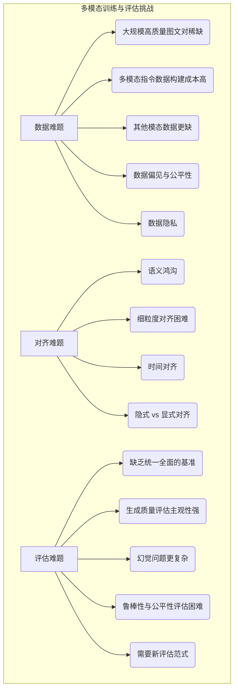

# 第11章：超越文本：多模态大模型的兴起与挑战 (Beyond Text: The Rise and Challenges of Multimodal Large Models)

欢迎来到本书的最后一部分——**前沿与展望篇**。在前面的章节中，我们已经系统地学习了大规模语言模型 (LLM) 的基础原理、训练方法和推理优化技术。我们见证了 LLM 在理解和生成文本方面取得的惊人成就。然而，人类感知和交互的世界远不止于文本。我们通过视觉、听觉、触觉等多种感官接收信息，并通过语言、图像、声音等多种方式进行表达。为了让 AI 更接近人类的智能水平，理解和融合多种信息模态 (Modality) 至关重要。

本章将带领我们**超越文本的边界**，进入**多模态大模型 (Multimodal Large Models, MLMs 或 LMMs - Large Multimodal Models)** 的世界。这些模型旨在打破单一模态的限制，能够同时理解和处理来自不同来源的信息，如文本、图像、音频、视频等，并能生成跨模态的内容。

我们将首先探讨**为何需要多模态**，理解其对于构建更全面、更强大 AI 的必要性。接着，我们将深入剖析几种**主流的多模态模型架构**，如开创性的 CLIP、强大的 Flamingo、开源的 LLaVA 以及备受瞩目的 GPT-4V 等，了解它们如何巧妙地将不同模态的信息进行融合与对齐。随后，我们将讨论构建和训练这些复杂模型所面临的**独特挑战**，特别是在数据收集、模态对齐和评估方法方面。最后，我们将展望**多模态 LLM 的广阔应用前景**和未来的发展方向。

学完本章，您将能够：

*   理解多模态学习对于 AI 发展的重要性。
*   掌握几种关键多模态模型的核心架构思想和技术。
*   认识到训练和评估多模态模型的主要困难和挑战。
*   了解多模态 LLM 的潜在应用场景和未来趋势。

准备好迎接一个更加丰富多彩的 AI 世界，探索模型如何看懂图片、听懂声音，并以超越文本的方式与我们交互吧！

## 11.1 为何需要多模态？理解和生成图文音视频信息 (Why Multimodality? Understanding and Generating Information Across Text, Image, Audio, and Video)

人类的认知和交流本质上是**多模态**的。我们阅读带有插图的文章，观看配有字幕和音效的视频，通过手势和语音与他人沟通。信息很少以单一、孤立的形式存在。为了让 AI 真正理解我们生活的复杂世界并与之有效互动，它必须具备处理和整合多种信息模态的能力。

**驱动多模态 LLM 发展的核心原因：**

1.  **更全面的世界理解 (More Comprehensive World Understanding)**：
    *   现实世界的信息是多模态交织的。一张图片胜过千言万语，一段视频蕴含着动态变化和声音信息。只依赖文本，AI 对世界的理解是片面的、不完整的。多模态能力使模型能够结合视觉、听觉等信息，形成更丰富、更准确的世界表征。例如，理解一个笑话可能需要结合文字内容和说话者的语气（音频），理解一个操作指南可能需要结合文字描述和示意图（图像）。

2.  **更自然的人机交互 (More Natural Human-Computer Interaction)**：
    *   我们希望以最自然的方式与 AI 交互。这意味着我们可以向 AI 展示一张图片并提问，或者通过语音下达指令并期待图文并茂的回答。多模态 LLM 使得这种跨模态的输入和输出成为可能，极大地提升了人机交互的便捷性和效率。

3.  **解锁新的应用场景 (Unlocking New Application Scenarios)**：
    *   许多现实世界的任务本质上是多模态的。例如：
        *   **视觉问答 (Visual Question Answering, VQA)**：根据图像内容回答问题。
        *   **图像/视频描述生成 (Image/Video Captioning)**：用自然语言描述图像或视频内容。
        *   **文本到图像/视频生成 (Text-to-Image/Video Generation)**：根据文本描述生成相应的视觉内容（如 DALL-E, Stable Diffusion, Sora 等）。
        *   **多模态情感分析**：结合文本、语音语调、面部表情判断用户情绪。
        *   **机器人技术**：机器人需要结合视觉、听觉和语言指令来理解环境并执行任务。
        *   **教育**：生成包含图文、音视频的多媒体教学材料。
        *   **医疗**：分析医学影像（图像）并结合病历（文本）进行诊断辅助。
    *   纯文本 LLM 无法直接处理这些任务。

4.  **增强现有 LLM 能力 (Enhancing Existing LLM Capabilities)**：
    *   视觉等其他模态信息可以为语言理解提供**具身性 (Grounding)**。例如，理解"红色的苹果"不仅仅是理解词语的统计关系，更能与视觉世界中苹果的颜色和形状联系起来。这种具身性有助于模型建立更鲁棒、更常识化的理解。
    *   多模态信息可以帮助解决文本中的歧义。例如，文本提到"苹果"，结合图像可以判断是指水果还是公司。

```mermaid
graph TD
    subgraph "人类感知与交互 (Human Perception & Interaction)"
        A[视觉 (Vision)]
        B[听觉 (Audition)]
        C[语言 (Language)]
        D[其他 (触觉等)]
        A & B & C & D --> E{大脑整合理解 (Brain Integration & Understanding)};
        E --> F[多模态表达 (Multimodal Expression)];
    end

    subgraph "AI 的多模态需求 (AI's Need for Multimodality)"
        G[单一模态 LLM (Text-only)] --> H(理解片面);
        G --> I(交互受限);
        G --> J(无法处理跨模态任务);

        K(多模态 LLM) --> L(更全面的世界理解);
        K --> M(更自然的人机交互);
        K --> N(解锁新应用场景);
        K --> O(增强 LLM 自身能力 - Grounding);

        L & M & N & O --> P{更接近人类水平的 AI};
    end

    style E fill:#ccf,stroke:#333,stroke-width:2px
    style K fill:#9cf,stroke:#333,stroke-width:2px
    style P fill:#f9d,stroke:#333,stroke-width:2px
```

**多模态涉及的主要模态：**

*   **文本 (Text)**：基础模态，通常作为指令输入或信息输出的核心。
*   **图像 (Image)**：静态视觉信息，包含物体、场景、关系等丰富内容。
*   **视频 (Video)**：动态视觉信息，增加了时间维度，包含动作、事件、场景变化。
*   **音频 (Audio)**：包含语音、音乐、环境声音等信息。
*   **其他**：3D 模型、传感器数据（如温度、压力）、表格数据、代码等有时也被纳入广义的多模态范畴。

多模态是 AI 发展的必然趋势。通过赋予 LLM 理解和生成多种信息模态的能力，我们可以构建出更智能、更通用、更能适应复杂现实世界的 AI 系统。接下来的小节，我们将探索实现这一目标的关键技术和架构。

## 11.2 主流多模态架构解析 (CLIP, Flamingo, LLaVA, GPT-4V 等) (Analysis of Mainstream Multimodal Architectures)

将不同模态的信息有效地融合与对齐，是构建多模态大模型的**核心挑战**。近年来，研究者们提出了多种创新的架构来应对这一挑战。本节我们将剖析几种具有里程碑意义或广泛影响力的多模态模型架构。

**核心技术挑战：**

1.  **模态表示对齐 (Modality Representation Alignment)**：如何将来自不同模态（如图像像素、文本 Token）的信息映射到**同一个或可交互的表示空间 (Shared or Interactable Representation Space)**，使得模型能够理解它们之间的关联？
2.  **跨模态信息融合 (Cross-modal Information Fusion)**：如何在模型的不同层级有效地融合来自不同模态的信息？是早期融合、晚期融合还是贯穿始终的深度融合？
3.  **生成能力的扩展 (Extending Generation Capabilities)**：如何让原本基于文本生成的 LLM 能够理解视觉/听觉输入，并可能生成图像或其他模态的输出？

**主流架构解析：**

**1. CLIP (Contrastive Language-Image Pre-training) (OpenAI, 2021)**

*   **定位**：并非一个完整的端到端多模态 LLM，而是专注于**学习图像和文本之间对齐关系**的**基础模型 (Foundation Model)**，为后续许多多模态模型奠定了基础。
*   **核心思想**：通过**对比学习 (Contrastive Learning)** 在大规模图文对数据上进行预训练，目标是让匹配的图像和文本在共享的嵌入空间中距离尽可能近，而不匹配的图像和文本距离尽可能远。
*   **架构**：
    *   **图像编码器 (Image Encoder)**：通常使用 ResNet 或 Vision Transformer (ViT) 将图像编码为一个特征向量。
    *   **文本编码器 (Text Encoder)**：通常使用 Transformer 将文本编码为一个特征向量。
    *   **对比损失 (Contrastive Loss)**：对于一个包含 N 个图文对的 Batch，模型的目标是预测哪些图像和文本是真正匹配的。计算 N x N 的相似度矩阵（图像向量和文本向量的点积），然后使用对比损失函数（如 InfoNCE）来拉近匹配对的相似度，推远不匹配对的相似度。
*   **能力与应用**：
    *   **强大的零样本分类 (Zero-shot Classification)**：无需针对特定分类任务进行微调，CLIP 可以通过计算图像与各种文本描述（如 "a photo of a cat", "a photo of a dog"）的相似度来进行图像分类。
    *   **图像文本检索 (Image-Text Retrieval)**：根据文本描述检索相关图像，或反之。
    *   **作为其他多模态模型的构件**：许多后续模型利用预训练好的 CLIP 编码器来获取对齐的图像和文本表示。
*   **局限性**：主要关注全局表示对齐，对于需要细粒度理解（如 VQA 中涉及物体具体位置或属性）的任务能力有限。它本身不能直接生成文本或图像。

```mermaid
graph TD
    subgraph "CLIP Pre-training"
        I1[图像1] --> ImgEnc{图像编码器 (ViT/ResNet)};
        T1[文本1] --> TxtEnc{文本编码器 (Transformer)};
        I2[图像2] --> ImgEnc;
        T2[文本2] --> TxtEnc;
        IN[图像N] --> ImgEnc;
        TN[文本N] --> TxtEnc;

        ImgEnc --> IV1[图像向量 I_1];
        TxtEnc --> TV1[文本向量 T_1];
        ImgEnc --> IV2[图像向量 I_2];
        TxtEnc --> TV2[文本向量 T_2];
        ImgEnc --> IVN[图像向量 I_N];
        TxtEnc --> TVN[文本向量 T_N];

        IV1 & TV1 --> Sim11{相似度 (I_1, T_1)};
        IV1 & TV2 --> Sim12{相似度 (I_1, T_2)};
        IVN & TVN --> SimNN{相似度 (I_N, T_N)};

        SimMatrix[("N x N 相似度矩阵")] --> ContrastiveLoss{对比损失函数};
        ContrastiveLoss -- 更新参数 --> ImgEnc & TxtEnc;

        style SimMatrix fill:#ccf, stroke:#333
        style ContrastiveLoss fill:#f9d, stroke:#333
    end
```

**2. Flamingo (DeepMind, 2022)**

*   **定位**：一个强大的**视觉语言模型 (Visual Language Model, VLM)**，能够处理穿插着图像/视频的文本序列，并生成相应的文本。特别擅长**少样本学习 (Few-shot Learning)**。
*   **核心思想**：将强大的预训练**语言模型 (LM)** 与预训练的**视觉编码器 (Vision Encoder)** 相结合，并通过新颖的**跨注意力层 (Cross-Attention Layers)** 将视觉信息有效地注入到语言模型中。
*   **架构**：
    *   **视觉编码器**：通常使用预训练好的模型（如 ViT，或类似 CLIP 的编码器）提取图像/视频帧的特征。
    *   **语言模型**：使用一个预训练好的大型语言模型（如 Chinchilla）。LM 的参数在 Flamingo 训练中通常被**冻结 (Frozen)**，以保留其强大的语言能力。
    *   **感知器重采样器 (Perceiver Resampler)**：由于视觉特征数量庞大，使用 Perceiver Resampler 将变长的视觉特征高效地压缩成固定数量（例如 64 个）的**潜在视觉 Token (Latent Visual Tokens)**。
    *   **门控交叉注意力密集层 (Gated Cross-Attention Dense Layers)**：这些特殊设计的交叉注意力层**穿插**在**冻结**的 LM 层之间。LM 处理文本 Token 时，可以通过这些交叉注意力层 "看到" 由 Perceiver Resampler 产生的潜在视觉 Token，从而将视觉信息融入文本生成过程。Gating 机制用于控制视觉信息的影响力。
*   **能力与应用**：
    *   在多种视觉语言任务上（如 VQA, Captioning）展现出强大的少样本学习能力，即只需要少量示例就能适应新任务。
    *   能够处理包含多个图像/视频的复杂、交错的视觉语言输入。
*   **关键创新**：通过 Perceiver Resampler 和 Gated Cross-Attention 机制，高效地将视觉信息注入到**冻结**的预训练 LM 中，保留了 LM 的强大能力并实现了高效的多模态融合。

```mermaid
graph TD
    subgraph "Flamingo Architecture"
        InputText[输入文本] --> LM_Input;
        InputImage[输入图像/视频帧] --> VisEnc{视觉编码器 (Frozen)};
        VisEnc --> VisFeats[视觉特征];
        VisFeats --> Perceiver{Perceiver Resampler};
        Perceiver --> LatentVisTok[潜在视觉 Tokens];

        LM_Input --> FrozenLMBlock1[冻结的 LM Block 1];
        FrozenLMBlock1 --> GatedXAttn1{门控交叉注意力层 1};
        LatentVisTok --> GatedXAttn1;
        GatedXAttn1 --> FrozenLMBlock2[冻结的 LM Block 2];
        FrozenLMBlock2 --> GatedXAttn2{门控交叉注意力层 2};
        LatentVisTok --> GatedXAttn2;
        GatedXAttn2 --> MoreLMBlocks("...");
        MoreLMBlocks --> OutputText[生成文本];
    end

    style VisEnc fill:#add, stroke:#333
    style FrozenLMBlock1, FrozenLMBlock2, MoreLMBlocks fill:#dde, stroke:#333
    style GatedXAttn1, GatedXAttn2 fill:#f9d, stroke:#333
    style Perceiver fill:#ccf, stroke:#333
```

**3. LLaVA (Large Language and Vision Assistant) (UW Madison, Microsoft Research, Columbia University, 2023)**

*   **定位**：一个开源的、旨在通过**指令微调 (Instruction Tuning)** 将预训练的**视觉编码器**和**LLM** 连接起来，实现通用视觉对话能力的大型多模态模型。
*   **核心思想**：利用 **CLIP** 的预训练视觉编码器提取图像特征，设计一个简单的**投影层 (Projection Layer)** 将视觉特征映射到 LLM 的词嵌入空间，然后使用精心构建的**图文指令数据集**对 LLM 进行微调，使其能够理解图像内容并遵循指令进行对话。
*   **架构**：
    *   **视觉编码器 (Vision Encoder)**：通常使用预训练好的 **CLIP ViT** (例如 `clip-vit-large-patch14`)。视觉编码器的参数在微调阶段通常被**冻结**。
    *   **大型语言模型 (LLM)**：使用一个开源的 LLM，如 **Vicuna** 或 **Llama-2**。
    *   **投影层 (Projection Layer)**：一个简单的线性层（或包含少量层 MLP），负责将 CLIP 输出的图像特征向量（通常是 CLS Token 或 Patch Embeddings 的池化）转换为与 LLM 词嵌入维度相同的**视觉 Token (Visual Tokens)**。
    *   **训练**：分为两个阶段：
        *   **阶段一：特征对齐预训练 (Feature Alignment Pre-training)**：只训练投影层，使用大量的图像-文本对（如 Conceptual Captions 数据集的部分），目标是让投影层学会将图像特征映射到能被 LLM 理解的表示空间。LLM 和视觉编码器均冻结。
        *   **阶段二：端到端指令微调 (End-to-End Instruction Tuning)**：使用包含图像和文本指令的数据集（如作者构建的 LLaVA-Instruct 数据集，包含 VQA、复杂推理、描述等任务），**微调 LLM 和投影层**（视觉编码器仍冻结）。LLM 学会根据视觉 Token 和文本指令生成相应的回答。
*   **能力与应用**：
    *   展现出令人印象深刻的视觉对话和指令遵循能力，能够描述图像、回答关于图像的问题、进行简单的视觉推理。
    *   由于其开源和相对简单的架构，LLaVA 成为了后续许多开源多模态模型研究的基础。
*   **关键创新**：证明了通过一个简单的投影层和高质量的指令微调数据，可以有效地将强大的预训练视觉编码器和 LLM "粘合"起来，实现强大的多模态能力，而无需复杂的跨模态融合模块或从头预训练。

```mermaid
graph TD
    subgraph "LLaVA Architecture & Training"
        InputImage --> FrozenVisEnc{视觉编码器 (CLIP ViT, Frozen)};
        FrozenVisEnc --> ImgFeats[图像特征];
        ImgFeats --> Projector{投影层 (Linear/MLP)};
        Projector --> VisualTokens[视觉 Tokens];

        InputInstruction[文本指令] --> LLMInput;
        VisualTokens --> LLMInput;

        LLMInput --> LLM{大语言模型 (Llama/Vicuna)};
        LLM --> GeneratedResponse[生成回答];

        subgraph "训练阶段"
            Stage1("阶段1: 特征对齐 (冻结LLM+ViT, 训练Projector)");
            Stage2("阶段2: 指令微调 (冻结ViT, 微调LLM+Projector)");
        end
    end

    style FrozenVisEnc fill:#add, stroke:#333
    style LLM fill:#dde, stroke:#333
    style Projector fill:#f9d, stroke:#333
```

**4. GPT-4V(ision) (OpenAI, 2023)**

*   **定位**：作为 GPT-4 的多模态扩展，能够接收图像和文本输入，并生成文本输出。是目前能力最强的闭源多模态大模型之一。
*   **核心思想**：虽然具体架构未公开，但根据其能力和相关研究推测，可能借鉴了类似 Flamingo 或 LLaVA 的思路，将强大的视觉编码能力与 GPT-4 的语言和推理能力相结合。
*   **架构 (推测)**：
    *   可能使用类似 CLIP 或更先进的**视觉编码器**提取图像特征。
    *   可能通过**投影层**将视觉特征转换为 GPT-4 能够理解的 Token 序列。
    *   可能将视觉 Token 与文本 Token 一起输入到 GPT-4 的 Transformer 架构中进行处理。
    *   利用了**海量的多模态数据**进行预训练和指令微调，并可能加入了 RLHF（或 RLAIF - Reinforcement Learning from AI Feedback）进行对齐。
*   **能力与应用**：
    *   展现出极其强大的视觉理解、推理和对话能力，能够理解图表、网页截图、手写文字、复杂场景，甚至解释幽默图片。
    *   在 OCR（光学字符识别）、视觉问答、图像描述、多模态推理等任务上达到 SOTA（State-of-the-Art）水平。
    *   能够遵循复杂的、涉及图像内容的指令。
*   **关键**：强大的基础模型 (GPT-4) + 高效的视觉信息编码与融合 + 海量的训练数据 + 先进的对齐技术。

**其他值得关注的架构/模型：**

*   **BLIP / BLIP-2 / InstructBLIP (Salesforce)**：一系列专注于视觉语言预训练的模型，通过引入新的预训练任务（如图像文本匹配、图像文本对比学习、基于图像的文本生成）和 Q-Former（Querying Transformer）模块来提升视觉语言理解和生成能力。InstructBLIP 进一步结合了指令微调。
*   **IDEFICS (Hugging Face)**：基于 Flamingo 思想的开源模型，支持任意序列的图文输入。
*   **MiniGPT-4 / MiniGPT-v2 (King Abdullah University of Science and Technology)**：借鉴 BLIP-2 和 LLaVA 的思想，使用 Q-Former 和线性层连接视觉编码器和 LLM (如 Llama)，并通过两阶段训练实现多模态能力。
*   **Video LLMs (如 Video-LLaMA, VideoChat)**：专门处理视频输入的模型，通常需要处理时间维度信息，例如对视频帧特征进行时序建模。

**架构趋势总结：**

*   **利用预训练模型**：普遍趋势是利用强大的预训练视觉编码器（如 CLIP ViT）和预训练 LLM（如 Llama, Vicuna, GPT 系列），避免从零开始训练的巨大成本。
*   **模态连接是关键**：如何设计有效的"桥梁"（如投影层、交叉注意力、Q-Former）来连接视觉和语言模态是研究的核心。
*   **指令微调的重要性**：高质量、多样化的多模态指令数据集对于激发模型的通用视觉语言能力至关重要。
*   **扩展到更多模态**：除了图文，将音频、视频等更多模态融入统一框架是未来的发展方向。
*   **效率与性能的权衡**：如何在保持强大性能的同时，设计更轻量、更高效的多模态架构也是一个重要的研究点。

理解这些主流架构的设计哲学和技术细节，有助于我们把握多模态大模型的发展脉络，并为未来构建更强大的 AI 系统奠定基础。

## 11.3 多模态训练的数据、对齐与评估难题 (Challenges in Multimodal Training: Data, Alignment, and Evaluation)

虽然多模态大模型展现出令人兴奋的能力，但其训练和评估过程面临着比单模态 LLM 更严峻的挑战。

**1. 数据难题 (Data Challenges)**

*   **大规模、高质量图文对数据的稀缺性 (Scarcity of Large-scale, High-quality Image-Text Pairs)**：
    *   CLIP 等模型的成功很大程度上依赖于从互联网收集的海量（数亿甚至数十亿）图文对数据。然而，这些网络数据通常**噪声大、质量参差不齐**，图片与文本描述的相关性可能很弱或不准确（例如，网页上的图片 Alt-text 可能只是关键词堆砌）。
    *   获取**干净、准确、多样化**的大规模图文对数据成本高昂。
*   **多模态指令数据的构建成本高 (High Cost of Building Multimodal Instruction Datasets)**：
    *   像 LLaVA 那样通过指令微调激发模型能力，需要大量**多样化、高质量的多模态指令数据**（例如，"请描述这张图片中的主要物体"，"这张图里有几只猫？"，"根据这张流程图解释操作步骤"）。
    *   人工标注这类数据需要理解图像内容并编写相应的指令和回答，**费时费力**。
    *   LLaVA 团队创造性地使用 GPT-4 等强 LLM 来**半自动生成**指令数据（让 LLM 基于图像描述或 OCR 结果生成问答对），但这仍然需要仔细的设计和过滤，且可能引入 LLM 的偏见。
*   **覆盖其他模态（视频、音频）的数据更稀缺**：
    *   相比图文数据，大规模、标注良好的视频-文本对、音频-文本对数据更加稀缺，这限制了视频理解、音频理解模型的发展。
*   **数据偏见与公平性 (Data Bias and Fairness)**：
    *   与文本数据类似，多模态数据也可能包含各种社会偏见（如性别、种族偏见）、刻板印象和不公平的表征。这些偏见会传递给模型，导致生成带有偏见的内容或在不同人群上表现不一致。识别和缓解多模态数据中的偏见比纯文本更复杂。
*   **数据隐私 (Data Privacy)**：
    *   图像、视频、音频数据通常比文本数据包含更多个人身份信息 (PII) 或敏感信息（如人脸、车牌、医疗影像、私人对话）。在收集和使用这些数据时，需要采取更严格的隐私保护措施。

**2. 模态对齐难题 (Alignment Challenges)**

*   **语义鸿沟 (Semantic Gap)**：不同模态（如像素级的图像信息和符号级的文本信息）在底层表示上存在巨大差异。如何将它们有效地映射到同一个语义空间，让模型理解"猫"的图片和"猫"的文字指向同一个概念，是一个核心挑战。对比学习（如 CLIP）是解决这一问题的有效方法之一，但并非完美。
*   **细粒度对齐困难 (Difficulty in Fine-grained Alignment)**：全局对齐（整张图对应整段文字）相对容易，但对于需要理解图像**局部区域**与文本**特定短语**对应关系的任务（如指代理解 "referring expression comprehension"，找出图片中"那个戴着红帽子的男人"），实现精确的细粒度对齐更加困难。这需要更复杂的模型设计（如引入 Object Detection 能力）或更精细的标注数据。
*   **时间对齐（视频/音频）(Temporal Alignment)**：对于视频和音频，还需要考虑时间维度上的对齐。如何将语音的不同片段、视频的不同帧或片段与相应的文本描述或事件对齐，是一个额外的挑战。
*   **隐式对齐 vs 显式对齐 (Implicit vs. Explicit Alignment)**：一些模型（如 Flamingo, LLaVA）通过端到端训练实现隐式的模态对齐，而另一些方法可能尝试更显式地学习跨模态的对应关系。哪种方式更优，或者如何结合两者，仍在探索中。

**3. 评估难题 (Evaluation Challenges)**

*   **缺乏统一、全面的评估基准 (Lack of Unified, Comprehensive Benchmarks)**：
    *   多模态能力涉及范围广泛（VQA, Captioning, Generation, Reasoning 等），目前缺乏能够全面、公正地评估模型各项能力的单一基准。现有的基准通常只关注特定任务或能力维度。
    *   评估指标（如 VQA Accuracy, BLEU/CIDEr for Captioning）往往只能反映任务的某个侧面，难以捕捉模型的真实理解和推理能力，也容易被"刷分"。
*   **评估生成质量的主观性 (Subjectivity in Evaluating Generation Quality)**：
    *   评估生成的图像、视频或多模态内容的质量（如创造性、美观性、与文本的契合度）具有很强的主观性。自动评估指标（如 FID, IS for images）有其局限性，人工评估成本高且一致性难以保证。
*   **幻觉问题更复杂 (Hallucination Problem is More Complex)**：
    *   多模态模型同样存在幻觉问题，甚至可能更复杂。例如，模型可能"看到"图像中并不存在的物体，或者对图像内容进行错误的描述或推理。检测和评估多模态幻觉比纯文本幻觉更困难。
*   **评估鲁棒性与公平性困难 (Difficulty in Evaluating Robustness and Fairness)**：
    *   如何系统地评估模型在面对不同类型输入（如对抗性样本、模糊图像、罕见物体）时的鲁棒性？
    *   如何评估模型在不同人群、不同文化背景的图像或场景下的公平性表现？这些方面的评估方法仍在发展中。
*   **需要新的评估范式 (Need for New Evaluation Paradigms)**：
    *   可能需要超越传统基准测试，发展更注重交互式评估、真实世界场景模拟、对模型推理过程进行分析的评估方法。



克服这些在数据、对齐和评估方面的挑战，是推动多模态大模型从"可用"走向"可靠"和"负责任"的关键。这需要社区在数据集构建、模型架构创新、评估方法研究以及伦理规范制定等方面持续努力。

## 11.4 多模态应用场景与未来发展方向 (Multimodal Application Scenarios and Future Directions)

随着技术的不断成熟，多模态大模型正在渗透到我们生活和工作的方方面面，展现出巨大的应用潜力。同时，其未来的发展也充满了想象空间。

**主要应用场景：**

1.  **增强的搜索引擎 (Enhanced Search Engines)**：
    *   允许用户使用图像、语音或它们的组合进行搜索。例如，拍一张植物的照片询问它是什么，或者哼唱一段旋律查找歌曲。
    *   搜索结果可以结合文本、图片、视频等多种形式，提供更丰富、更直观的信息。

2.  **智能内容创作 (Intelligent Content Creation)**：
    *   **文生图/视频/音频 (Text-to-Image/Video/Audio)**：根据文本描述自动生成高质量的图像 (DALL-E 3, Midjourney)、视频 (Sora, Runway) 或音频片段。极大地降低了创意内容的生产门槛。
    *   **多模态编辑 (Multimodal Editing)**：允许用户通过自然语言指令编辑图像或视频，例如"把这张图中天空的颜色变蓝"，"移除视频中这个人"。
    *   **自动生成演示文稿/报告**：根据主题和数据，自动生成包含图表、图片和文字摘要的演示文稿或报告。

3.  **更自然的交互式 AI 助手 (More Natural Interactive AI Assistants)**：
    *   能够理解用户的语音指令，看到用户通过摄像头展示的物体或环境，并以语音、文字、甚至图像的方式进行回应。
    *   例如，智能客服可以查看用户发来的产品故障图片进行诊断；智能家居助手可以理解用户指着某个设备说"打开它"；AI 教师可以根据学生画的图进行讲解。

4.  **教育与培训 (Education and Training)**：
    *   创建交互式的多媒体学习材料，例如可以根据文本生成插图的电子书，或者能够回答关于教学视频内容提问的 AI 助教。
    *   为视障或听障人士提供辅助学习工具，如图像描述、语音转文字、手语翻译等。

5.  **医疗健康 (Healthcare)**：
    *   **医学影像分析**：辅助医生解读 X 光片、CT、MRI 等医学影像，结合病历文本信息，提供诊断建议或病变检测。
    *   **智能病历生成**：将医患对话（音频/文本）和检查结果（图像/文本）自动整理成结构化的电子病历。
    *   **辅助康复训练**：通过视觉捕捉分析患者动作，结合语音指导进行康复训练。

6.  **机器人与自动驾驶 (Robotics and Autonomous Driving)**：
    *   让机器人能够更好地理解物理世界，将视觉感知、语言指令和环境声音结合起来，进行更复杂的任务规划和执行。
    *   提升自动驾驶系统对复杂交通场景的理解能力，例如理解交警的手势（视觉）、其他车辆的鸣笛（音频）等。

7.  **电子商务与零售 (E-commerce and Retail)**：
    *   **视觉搜索购物**：用户可以通过上传图片查找同款或相似商品。
    *   **虚拟试穿/试用**：结合用户照片或视频，模拟试穿衣物或试用化妆品的效果。
    *   **智能商品推荐**：根据用户的浏览历史（文本、图像点击）和偏好，进行更精准的多模态商品推荐。

8.  **安全与监控 (Security and Surveillance)**：
    *   智能视频监控分析，自动识别异常事件（如摔倒、入侵），结合时间和地点信息生成报告。
    *   身份验证，结合人脸识别（视觉）和声纹识别（音频）。

**未来发展方向：**

1.  **更强的多模态融合与推理 (Stronger Multimodal Fusion and Reasoning)**：
    *   发展能够进行更深层次跨模态理解和复杂推理的模型架构，不仅仅是简单的信息拼接，而是真正实现模态间的深度融合与相互印证。
    *   提升模型处理和理解时间序列信息（视频、音频）的能力。

2.  **走向更多模态 (Towards More Modalities)**：
    *   将触觉、嗅觉、3D 信号、传感器数据等更多类型的模态信息纳入统一模型框架，构建更全面的世界模型。
    *   例如，让机器人能够通过触觉感知物体材质，或者让 AI 理解气味信息。

3.  **更高质量、更可控的多模态生成 (Higher Quality, More Controllable Multimodal Generation)**：
    *   进一步提升生成内容的逼真度、一致性和创造性，尤其是在长视频生成、高保真音频合成等方面。
    *   发展更精细的控制手段，让用户能够更准确地控制生成内容的风格、属性、动作等。

4.  **效率与端侧部署 (Efficiency and On-Device Deployment)**：
    *   研究更轻量、更高效的多模态模型架构和压缩技术（如多模态模型的量化、剪枝、蒸馏），以适应移动设备和边缘计算的需求。

5.  **交互式与具身智能 (Interactive and Embodied AI)**：
    *   构建能够与物理世界进行实时交互、从交互中学习的多模态智能体 (Embodied Agents)，例如能够理解指令并在真实环境中操作物体的机器人。

6.  **更好的评估与对齐 (Better Evaluation and Alignment)**：
    *   开发更全面、更可靠的多模态模型评估基准和方法。
    *   研究更有效的多模态对齐技术，确保模型行为符合人类价值观，减少偏见和有害输出。

7.  **世界模型 (World Models)**：
    *   多模态学习被认为是构建通用人工智能 (AGI) 或"世界模型"的关键一步，即构建能够模拟和预测现实世界运行规律的内部表征。

多模态大模型的发展正以前所未有的速度推进，它们不仅将深刻改变我们与 AI 交互的方式，也将为解决现实世界中的复杂问题提供强大的新工具。虽然挑战依然存在，但一个更加智能、更加感知丰富的 AI 未来正向我们走来。

---

本章我们探讨了多模态大模型的兴起、核心架构、面临的挑战以及广阔的应用前景。理解了为何要超越文本，以及如何通过 CLIP, Flamingo, LLaVA, GPT-4V 等模型实现图文等模态的融合。在下一章，我们将回到一个基础但至关重要的问题：我们该如何有效地评估这些越来越强大的 LLM（包括多模态模型）的智能水平和综合能力？ 