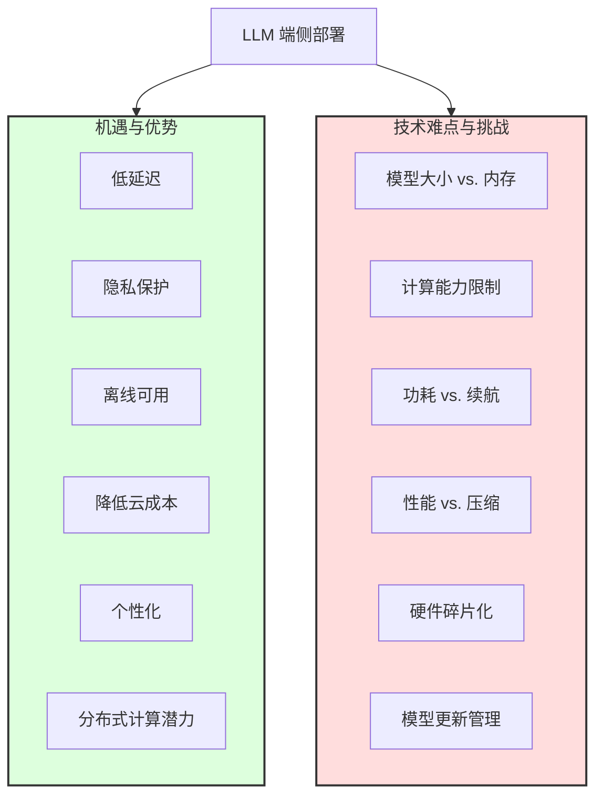

# 第13章：未来已来？LLM 的发展趋势、开放挑战与社会影响 (The Road Ahead: Future Trends, Open Challenges, and the Societal Impact of LLMs)

> "预测未来的最好方法就是创造未来。" —— 彼得·德鲁克 (Peter Drucker)

我们正处在一个由大型语言模型（LLM）深刻塑造的时代。从基础研究到工程实践，从技术能力到社会应用，LLM 的发展日新月异，不断突破我们对人工智能潜力的认知。站在当前的时间节点，审视 LLM 的未来发展趋势，识别其中存在的开放性挑战，并思考其广泛而深远的社会影响，对于我们理解和引导这项变革性技术的走向至关重要。

本章将聚焦于 LLM 的前沿动态与未来展望。我们将探讨模型规模与效率的持续博弈，关注可能替代 Transformer 的新兴架构，展望 Agentic AI 赋予模型自主能力的潜力，审视端侧部署的机遇与挑战，并深入思考 LLM 在长上下文处理、逻辑推理、持续学习等方面的能力进化。同时，我们也将触及关于常识、理解、意识乃至通用人工智能（AGI）的终极问题，并展望 LLM 如何重塑科学研究范式和社会结构。

## 13.1 规模与效率之争：更大模型 vs. 更智能模型 (稠密 vs. 稀疏 MoE)

自 LLM 诞生以来，"规模"（Scale）一直是推动其能力提升的核心驱动力之一。遵循所谓的"缩放法则"（Scaling Laws），研究人员发现，通过增加模型参数量、训练数据量和计算资源，模型的性能往往会随之提升，并在某些任务上展现出"涌现"（Emergence）能力。这引发了一场追求更大、更强模型的竞赛。

### 13.1.1 稠密模型的极限与回报递减

以 GPT-3、PaLM 等为代表的超大规模**稠密模型 (Dense Models)**，所有参数在每次前向传播中都会参与计算。这种模型的优势在于其强大的表示能力和在广泛任务上的优异性能。

然而，持续扩大稠密模型的规模正面临日益严峻的挑战：

*   **训练成本飙升:** 训练动辄数千亿甚至万亿参数的稠密模型需要极其庞大的计算集群、漫长的训练时间以及惊人的能源消耗（如第 12.5 节所述）。成本之高使得只有少数大型科技公司或国家级研究机构能够负担。
*   **推理成本高昂:** 部署和运行这些巨型稠密模型同样代价不菲。每次推理都需要激活所有参数，导致高延迟和高计算资源需求，限制了其在资源受限场景（如移动设备）或需要低延迟交互场景的应用。
*   **回报递减:** 尽管 Scaling Laws 在很大范围内有效，但有迹象表明，仅仅依靠增加参数规模带来的性能提升可能开始呈现边际回报递减的趋势。在某些能力上，单纯扩大规模可能不再是最有效的提升路径。
*   **数据瓶颈:** 获取足够多、足够高质量的训练数据来有效训练万亿级别以上的稠密模型，也变得越来越困难。

### 13.1.2 稀疏模型 (MoE) 的崛起与权衡

为了在保持甚至超越稠密模型性能的同时，克服其高昂的计算成本（尤其是在推理阶段），**稀疏模型 (Sparse Models)**，特别是**专家混合模型 (Mixture of Experts, MoE)**（如第 3.8 节所述），成为一个极具吸引力的替代方案。

**MoE 的核心思想:**

*   将模型的总参数量分散到多个"专家"子网络中。
*   对于每个输入 token，通过一个轻量级的"门控网络"（Gating Network）动态地选择激活少数（通常是 1 或 2 个）最相关的专家进行计算。
*   **优势:**
    *   **参数量 vs. 计算量解耦:** MoE 模型可以在拥有巨大参数量（例如，数万亿）的同时，保持相对较低的单次推理计算量（FLOPs），因为每次只有一小部分参数被激活。这使得训练和（尤其是）推理更加高效。
    *   **潜力巨大的 Scaling:** MoE 提供了一条在可控计算预算下继续扩大模型有效容量（参数量）的路径。
    *   **专业化:** 每个专家可能潜在地学习处理特定类型输入或知识领域的能力。
*   **代表模型:** Google 的 Switch Transformer、GLaM，Mistral AI 的 Mixtral 系列。

**MoE 的挑战与权衡:**

*   **训练复杂性:** MoE 的训练更具挑战性，需要处理负载均衡（确保所有专家得到充分训练）、通信开销（All-to-All 通信）、训练不稳定性等问题（如第 6.4 节所述）。
*   **推理优化:** 高效服务 MoE 模型需要专门的推理系统来处理稀疏激活和动态路由（如第 10.6 节所述），这比稠密模型更复杂。
*   **参数效率:** 虽然总参数量巨大，但单次推理只利用了一小部分。如何有效利用所有参数的知识仍然是一个研究问题。
*   **微调困难:** 对大型 MoE 模型进行微调可能比稠密模型更复杂，需要考虑如何有效更新专家和门控网络。
*   **泛化能力:** MoE 的泛化能力与稠密模型的对比仍在研究中，特别是在需要整合多个专家知识的复杂推理任务上。

**Mermaid 图：稠密模型 vs. 稀疏 MoE 模型**

```mermaid
graph TD
    A[LLM 发展路径] --> B{稠密模型 Dense Model};
    A --> C{稀疏模型 Sparse Model (MoE)};

    subgraph B [稠密模型 Dense Model]
        direction LR
        B_Char1[所有参数参与计算];
        B_Char2[训练/推理成本高];
        B_Char3[回报可能递减];
        B_Adv[优势: 表示能力强];
        B_Disadv[劣势: 成本高, 扩展受限];
    end

    subgraph C [稀疏模型 Sparse Model (MoE)]
        direction LR
        C_Char1[参数分散到专家];
        C_Char2[门控网络选择激活少数专家];
        C_Char3[参数量与计算量解耦];
        C_Adv[优势: 推理高效, 可扩展性强];
        C_Disadv[劣势: 训练/推理复杂, 参数利用率?];
    end

    B --> B_Rep[代表: GPT-3, PaLM];
    C --> C_Rep[代表: Switch Transformer, Mixtral];

    A --> D{未来趋势?};
    D --> D1[继续扩大稠密模型?];
    D --> D2[MoE 成为主流?];
    D --> D3[混合方法/新架构?];

    style B fill:#f9f,stroke:#333,stroke-width:2px
    style C fill:#ccf,stroke:#333,stroke-width:2px
```

### 13.1.3 更智能的模型：超越单纯的规模

规模与效率之争并非零和博弈。未来的趋势可能并非简单地选择更大（稠密）或更稀疏（MoE），而是追求"更智能"的模型。这意味着：

*   **更好的数据:** 使用更高质量、更多样化、经过精心策划和去偏的数据进行训练，可能是比单纯增加数据量更有效的提升路径。
*   **更优的算法:** 开发更有效的预训练目标、微调方法（如 RLHF/DPO 的改进）、以及能够进行更复杂推理和规划的算法。
*   **架构创新:** 探索超越标准 Transformer 和 MoE 的新架构（将在下一节讨论），这些架构可能在特定能力（如长上下文处理、数值推理）上更具优势或效率更高。
*   **知识整合:** 研究如何更有效地将外部知识（符号知识库、知识图谱）与 LLM 结合，或者让模型更好地利用其参数中存储的知识。
*   **持续学习:** 让模型能够在部署后持续从新数据或交互中学习和适应，而无需完全重新训练。

未来，我们可能会看到一个更加多元化的 LLM 生态：

*   **巨型基础模型 (稠密或稀疏):** 作为强大的通用能力底座，由少数大型机构维护。
*   **高效的专业模型:** 通过蒸馏、剪枝、量化或针对性训练得到，针对特定任务或领域进行优化，可在更低成本下运行。
*   **端侧模型:** 参数量更小，经过高度优化，可在移动设备或边缘计算设备上运行。

最终，衡量模型好坏的标准将不仅仅是参数规模，而是其在特定任务上的**性能、效率、可靠性、安全性和成本效益**的综合表现。规模竞赛仍将继续，但会更加注重效率和智能，MoE 等稀疏化技术将在其中扮演越来越重要的角色，同时对算法和数据质量的追求也将提升到新的高度。

## 13.2 架构的下一个"风口"：探索 State Space Models 等 Transformer 替代方案

Transformer 架构（第 3 章）无疑是当前 LLM 领域的主宰者，其核心的自注意力机制（Self-Attention）在捕捉长距离依赖和并行计算方面展现出巨大威力。然而，随着序列长度的增加和对更高效率的需求，Transformer 也暴露出一些固有的局限性，这激发了研究人员探索新型序列建模架构的热情。

### 13.2.1 Transformer 的局限性

尽管 Transformer 取得了巨大成功，但它并非完美无缺，主要面临以下挑战：

1.  **二次方计算/内存复杂度 (Quadratic Complexity):** 标准自注意力机制需要计算序列中每对 token 之间的注意力分数，导致其计算复杂度和内存占用随序列长度 $N$ 呈 $O(N^2)$ 增长。这使得处理极长序列（例如，整本书、数小时的会议记录、基因组序列）变得非常昂贵甚至不可行。
    *   虽然 FlashAttention 等优化（第 10.2 节）在实践中缓解了精确注意力的计算瓶颈，但固有的二次方依赖性仍然是根本性挑战。
    *   各种近似注意力（如稀疏注意力、低秩近似、线性注意力）被提出，试图将复杂度降低到 $O(N \log N)$ 或 $O(N)$，但往往以牺牲部分模型性能为代价。
2.  **推理效率:** 自回归生成过程（逐个 token 生成）意味着 Transformer 在生成长序列时速度较慢。KV Cache（第 10.1 节）虽然避免了对历史 token 的重复计算，但其大小随序列长度线性增长，对显存造成巨大压力，尤其是在处理超长上下文时。
3.  **缺乏真正的循环/状态机制:** Transformer 采用位置编码来注入序列顺序信息，但它不像 RNN 那样具有内在的、随时间演化的隐藏状态。这可能限制了其在某些需要强顺序依赖或流式处理任务上的能力。

### 13.2.2 新兴架构探索：State Space Models (SSMs) 的崛起

为了克服 Transformer 的局限性，特别是二次方复杂度和长序列建模难题，研究界涌现出多种新型架构探索。其中，**状态空间模型 (State Space Models, SSMs)** 近期受到了广泛关注，并展现出成为下一代序列建模基础的巨大潜力。

**SSM 的灵感来源与核心思想:**

*   **经典控制理论:** SSM 源于经典控制理论和信号处理，用于对动态系统进行建模。其核心思想是用一个隐式的、压缩的"状态"向量 $h(t)$ 来捕捉到时间步 $t$ 为止的序列历史信息，并通过状态转移方程 $h(t) = f(h(t-1), x(t))$ 和输出方程 $y(t) = g(h(t), x(t))$ 来对序列进行建模，其中 $x(t)$ 是当前输入，$y(t)$ 是当前输出。
*   **结合深度学习:** 现代深度 SSMs（如 S4, Mamba）将经典 SSM 的数学框架与深度学习技术（如大型参数化矩阵、高效的并行扫描算法）相结合。

**结构化状态空间序列模型 (Structured State Space Sequence Models, S4):**

*   S4 是早期奠基性的工作，它展示了如何通过特定的结构（对状态矩阵 A 进行对角化或准对角化）和高效算法（利用 FFT/IFFT 进行快速卷积计算），使得看似循环的 SSM 可以实现高效的并行训练（类似卷积）和快速的自回归推理。
*   S4 在处理长序列任务（如 Long Range Arena 基准）上表现出色，超越了许多 Transformer 变体。

**Mamba: 具有选择性状态空间的线性时间序列建模:**

*   Mamba 是近期引起轰动的 SSM 架构，它在 S4 的基础上引入了**选择性机制 (Selection Mechanism)**。
*   **核心创新:** Mamba 的状态转移方程和输出方程中的参数（如状态矩阵 A、输入/输出矩阵 B, C）不再是固定的，而是**依赖于当前的输入 $x(t)$**。这意味着模型可以动态地、有选择地决定要保留哪些历史信息到状态 $h(t)$ 中，以及如何根据当前输入影响输出。
*   **优势:**
    *   **线性时间复杂度:** Mamba 的计算和内存复杂度随序列长度 $N$ 呈线性 $O(N)$ 增长，使其在处理极长序列时比 Transformer 更具优势。
    *   **内容感知推理:** 选择性机制使得模型可以根据上下文动态调整其行为，例如，可以选择性地遗忘无关信息或加强相关信息，这被认为是其在语言建模等任务上取得成功的关键。
    *   **高效的硬件实现:** Mamba 的设计考虑了现代硬件（GPU），利用并行扫描 (Parallel Scan) 等技术实现了高效的训练和推理。
    *   **性能优越:** Mamba 及其变体在语言建模、基因组学等多种长序列任务上达到了与甚至超越顶级 Transformer 模型的性能，同时具有更快的推理速度和更低的显存占用。

**SSM (以 Mamba 为例) 与 Transformer 的对比:**

| 特性             | Transformer (Self-Attention)        | SSM (Mamba)                       |
| :--------------- | :---------------------------------- | :-------------------------------- |
| **核心机制**     | 成对交互 (Pairwise Interaction)     | 循环状态压缩 (Recurrent State)     |
| **计算复杂度**   | $O(N^2)$ (理论上)                   | $O(N)$                             |
| **内存复杂度**   | $O(N^2)$ (理论上, KV Cache $O(N)$) | $O(N)$ (状态大小固定)             |
| **长序列处理**   | 昂贵，面临挑战                      | 高效，潜力巨大                      |
| **并行训练**     | 强 (Attention 并行度高)           | 强 (利用并行扫描/卷积)             |
| **推理 (自回归)** | 较慢 (依赖 KV Cache)              | 较快 (状态更新快)                 |
| **信息聚合**     | 显式全局聚合 (All-Pairs)            | 隐式历史压缩 + 选择性             |
| **内容感知**     | 通过注意力权重实现                  | 通过输入依赖的参数 (选择性) 实现    |

**Mermaid 图：SSM (Mamba) 核心思想**

```mermaid
graph LR
    subgraph Mamba 架构
        direction TB
        X_t[输入 x(t)] --> S{(选择性机制)};\
        H_prev[状态 h(t-1)] --> S;\
        S -- 计算动态参数 --> P(A(x_t), B(x_t), C(x_t));\
        P --> StateUpdate[状态更新: h(t) = A(x_t)h(t-1) + B(x_t)x(t)];\
        P --> Output[输出计算: y(t) = C(x_t)h(t)];\
        StateUpdate --> H_t[新状态 h(t)];\
        H_t --> H_next[下一时间步的状态 h(t)];\
        Output --> Y_t[输出 y(t)];\
    end\

    subgraph 对比 Transformer\
        direction TB\
        T_Att[Transformer: O(N^2) 注意力];\
        M_SSM[Mamba: O(N) 选择性状态空间];\
        T_Att --> T_Adv(并行性好, 全局交互);\
        T_Att --> T_Disadv(长序列成本高);\
        M_SSM --> M_Adv(长序列高效, 推理快);\
        M_SSM --> M_Disadv(机制相对新颖);\
    end\

    style S fill:#ccf,stroke:#333,stroke-width:2px
    style P fill:#ffc,stroke:#333,stroke-width:1px
```

### 13.2.3 其他潜在的 Transformer 替代方案

除了 SSMs，还有其他一些架构也在探索中：

*   **线性 RNN (Linear RNNs):** 尝试改进 RNN，使其能够并行训练（如 RWKV 架构），同时保持 RNN 在推理时的 $O(1)$ 空间复杂度优势。
*   **长卷积 (Long Convolutions):** 利用现代深度学习技术（如门控、归一化）和高效卷积算法（如基于 FFT 的卷积）来扩展 CNN 处理长序列的能力（如 Hyena 架构）。
*   **基于检索的架构 (Retrieval-based Architectures):** 不仅依赖模型参数，还显式地从外部数据库检索相关信息来辅助生成，这可以看作是一种架构层面的 RAG。
*   **混合架构 (Hybrid Architectures):** 结合 Transformer、SSM、卷积或 RNN 的优点，例如，在某些层使用注意力，在另一些层使用 SSM 或卷积。

### 13.2.4 未来展望：架构的多元化与融合

目前判断哪种架构将完全取代 Transformer 还为时过早。Transformer 拥有庞大而成熟的生态系统，并且仍在不断优化和改进中。

更有可能的情况是，未来我们会看到一个**架构更加多元化**的局面：

*   **Transformer** 仍将在许多任务中保持竞争力，尤其是在不需要处理极长序列或其优化版本（如 FlashAttention）足够高效的场景。
*   **SSMs (如 Mamba)** 在长序列建模和需要高推理效率的场景下展现出巨大潜力，可能成为处理文档、代码、语音、视频、基因组等长依赖任务的新基石。
*   **其他架构** (线性 RNN, 长卷积等) 可能在特定的利基市场或作为混合架构的一部分找到应用。
*   **混合与融合** 可能是重要的趋势，未来的模型可能会根据任务需求，在不同层或模块采用不同的机制（注意力、状态空间、卷积等）来取长补短。

这场架构之争的核心在于如何在**性能、效率（计算/内存/能耗）、可扩展性以及对不同类型数据的适应性**之间找到更好的平衡。SSM 的崛起标志着序列建模领域进入了一个新的探索阶段，未来的 LLM 可能会拥有更加多样和高效的"引擎"。

## 13.3 Agentic AI：赋予 LLM 自主规划与执行复杂任务的能力

传统的 LLM 主要作为被动的文本生成器或问答系统，根据用户的指令提供响应。然而，一个令人兴奋的新兴方向是 **Agentic AI**（或称为 AI Agents, LLM Agents），旨在赋予 LLM 更强的自主性，使其能够像智能体（Agent）一样，主动地**设定目标、制定计划、调用工具、执行动作、并根据环境反馈进行调整**，以完成更复杂、多步骤的任务。

Agentic AI 的目标是让 LLM 从一个"语言模型"进化为一个能够与数字世界（甚至物理世界，通过机器人）进行交互和行动的"通用问题解决器"。

### 13.3.1 Agentic AI 的核心能力与框架

一个典型的 Agentic AI 系统通常具备以下核心能力：

1.  **理解与推理 (Understanding & Reasoning):** 利用 LLM 强大的自然语言理解和推理能力来解析复杂的用户目标或任务描述。
2.  **规划 (Planning):** 将复杂目标分解为一系列可执行的子任务或步骤。规划能力是 Agentic AI 的核心，可能涉及：
    *   **任务分解 (Task Decomposition):** 将大任务拆解成小任务。
    *   **思维链 (Chain-of-Thought, CoT) / 思维树 (Tree-of-Thought, ToT):** 生成中间推理步骤来指导后续行动。
    *   **反思与修正 (Reflection & Refinement):** 评估当前计划的可行性，并在必要时进行调整。
3.  **工具使用 (Tool Use):** Agentic AI 不仅限于其内部知识，关键在于能够**调用外部工具**来获取信息、执行动作或弥补自身能力的不足。常见的工具包括：
    *   **搜索引擎:** 获取最新的、模型训练时未包含的信息。
    *   **计算器/代码解释器:** 执行精确的数学计算或运行代码片段。
    *   **数据库/API:** 查询结构化数据或与其他软件服务交互（如发送邮件、预订机票、控制智能家居设备）。
    *   **其他模型:** 调用专门的视觉模型、语音模型等。
4.  **执行与交互 (Execution & Interaction):** 根据规划和工具调用的结果，执行相应的动作，并与环境（用户、工具、外部世界）进行交互。
5.  **记忆与学习 (Memory & Learning):** Agent 需要拥有记忆能力来存储过去的交互、经验和知识，并从中学习以改进未来的规划和执行。记忆可以分为：
    *   **短期记忆:** 存储当前任务的上下文信息。
    *   **长期记忆:** 存储过去的经验、知识和用户偏好，通常需要借助外部向量数据库等实现。

**常见的 Agentic AI 实现框架:**

目前已经涌现出一些旨在简化 Agentic AI 应用开发的开源框架，例如：

*   **LangChain:** 提供了一套模块化的组件（LLMs, Prompts, Memory, Indexes, Chains, Agents, Tools），可以方便地构建基于 LLM 的应用程序，包括 Agentic AI。
*   **LlamaIndex:** 侧重于将 LLM 与外部数据源连接，构建知识增强的应用，也支持 Agentic 功能。
*   **Auto-GPT / AgentGPT:** 早期引起广泛关注的实验性项目，展示了完全自主的 AI Agent 的潜力（尽管在鲁棒性和实用性方面仍有局限）。
*   **Transformers Agent (Hugging Face):** Hugging Face 推出的工具，允许 LLM 调用 Transformers 生态中的各种模型和工具。

**Mermaid 图：Agentic AI 核心循环**

```mermaid
graph LR
    A[用户目标/任务] --> B{LLM Agent 核心};\

    subgraph B [LLM Agent 核心]\
        direction TB\
        B1[理解与推理] --> B2[规划 (分解/思考)];\
        B2 --> B3[选择工具/动作];\
        B3 -- 调用 --> T(外部工具<br>搜索,计算,API...);\
        T -- 返回结果 --> B4[执行与交互];\
        B4 --> B5[记忆 (短期/长期)];\
        B5 -- 更新知识/经验 --> B1;\
        B4 -- 更新环境/给用户 --> E[环境/用户];\
        E -- 反馈 --> B1;\
    end\

    B4 --> Output[最终结果/行动];\

    style B fill:#ccf,stroke:#333,stroke-width:2px\
    style T fill:#dae8fc,stroke:#6c8ebf,stroke-width:2px
    style E fill:#fdf,stroke:#333,stroke-width:1px
```

### 13.3.2 Agentic AI 的应用场景与潜力

Agentic AI 的潜力巨大，有望在许多领域带来变革：

*   **个人助理:** 更智能的个人助理，能够理解复杂指令，跨应用协调任务（如规划旅行、管理日程、处理邮件）。
*   **自动化工作流:** 自动化重复性的、基于规则的业务流程（如客户服务、数据录入、报告生成）。
*   **软件开发:** 辅助编程、自动化测试、代码调试、甚至根据需求生成完整应用。
*   **科学研究:** 辅助进行文献调研、数据分析、实验设计、假设生成。
*   **游戏与虚拟世界:** 创建更智能、更具交互性的 NPC（非玩家角色）。
*   **机器人控制:** 将 LLM 的规划能力与机器人的感知和执行能力结合，实现更通用的机器人智能。

### 13.3.3 Agentic AI 的挑战与风险

尽管前景广阔，Agentic AI 的发展仍处于早期阶段，面临诸多挑战和风险：

1.  **规划的鲁棒性与可靠性:** LLM 在复杂、长期的规划方面仍然容易出错，可能会陷入循环、产生无效计划或偏离目标。确保 Agent 行为的可靠性和可预测性是一个重大挑战。
2.  **幻觉问题加剧:** 如果 Agent 基于 LLM 的幻觉信息进行规划或调用工具，可能导致错误的决策和有害的行动。
3.  **工具使用的泛化性与安全性:** 如何让 Agent 安全、可靠地学习和使用不断增长的各种工具和 API？错误地调用工具可能导致严重后果（例如，误删文件、泄露敏感信息、执行错误的金融交易）。
4.  **成本与延迟:** Agentic AI 系统通常需要多次调用 LLM（用于思考、规划、调用工具、反思等），导致更高的计算成本和延迟。
5.  **记忆的管理与利用:** 如何有效地管理和利用长期记忆，避免信息过载或遗忘关键信息，同时保护隐私？
6.  **对齐与控制:** 如何确保自主运行的 Agent 的行为始终符合人类的意图和价值观？当 Agent 拥有执行物理世界动作（如通过机器人）的能力时，安全和控制问题变得尤为关键。
7.  **评估的复杂性:** 如何评估一个自主 Agent 的综合能力？这比评估传统的 LLM 输出更具挑战性。
8.  **安全风险:** Agentic AI 系统可能成为新的攻击目标，例如，通过提示注入控制 Agent 执行恶意操作，或者攻击 Agent 使用的工具和 API。

### 13.3.4 未来展望：从助手到协作者再到自主系统

Agentic AI 的发展可能经历几个阶段：

*   **助手 (Assistant):** 当前多数 Agent 主要作为人类的助手，根据明确指令执行任务，并在关键步骤需要人类确认。
*   **协作者 (Collaborator):** Agent 能够更主动地与人类协作，提供建议，共同制定计划，并分担任务执行。
*   **自主系统 (Autonomous System):** （长期愿景）Agent 能够在给定高级目标的情况下，独立地、可靠地完成复杂任务，仅在必要时寻求人类干预。

实现完全自主且可靠的 Agentic AI 仍然是一个长期的目标，需要克服上述诸多技术和安全挑战。然而，其巨大的潜力正驱动着研究和开发的快速进展。未来几年，我们可能会看到 Agentic AI 在特定领域率先落地，逐步改变我们与数字世界交互和完成任务的方式。同时，对其风险的审慎评估和有效治理将是确保其健康发展的关键。

## 13.4 LLM "飞入寻常百姓家"：端侧部署的机遇与技术难点

目前，大多数强大的大型语言模型都运行在云端数据中心，用户通过网络接口与其交互。然而，将 LLM 直接部署到用户终端设备（如智能手机、笔记本电脑、智能汽车、物联网设备等），即**端侧部署 (On-Device Deployment / Edge AI)**，正成为一个备受关注且快速发展的趋势。这有望让 LLM 的能力更加普惠、即时和个性化，真正"飞入寻常百姓家"。

### 13.4.1 端侧部署的机遇与优势

将 LLM 从云端迁移到端侧，可以带来诸多显著优势：

1.  **低延迟:** 无需网络传输和云端排队等待，端侧 LLM 可以提供近乎实时的响应，这对于语音助手、实时翻译、交互式应用等场景至关重要。
2.  **隐私保护:** 用户数据无需离开本地设备进行处理，极大地降低了数据泄露和滥用的风险，增强了用户隐私安全。这对于处理个人敏感信息（如健康数据、私人消息）的应用尤为重要。
3.  **离线可用性:** 端侧 LLM 可以在没有网络连接或网络不稳定的情况下运行，提高了应用的可靠性和可用性，尤其适用于偏远地区或移动场景。
4.  **降低云端成本:** 对于开发者和服务提供商而言，减少对昂贵云端推理资源的依赖可以显著降低运营成本，尤其是当用户规模巨大时。
5.  **个性化:** 模型可以直接在端侧利用本地数据进行微调或适配（例如，根据用户的写作风格、常用联系人、本地文件进行优化），提供更加个性化的体验，同时保护用户隐私。
6.  **分布式计算:** 利用全球数十亿终端设备的闲置计算能力，可能为更大规模的分布式 AI 应用（如联邦学习）提供基础。

### 13.4.2 端侧部署的技术难点

尽管优势明显，但将通常参数量巨大、计算密集的 LLM 部署到资源受限的终端设备上，面临着严峻的技术挑战：

1.  **模型大小与内存限制:** 终端设备（尤其是手机）的内存（RAM）和存储空间远小于云端服务器。动辄数十亿甚至上百亿参数的 LLM 难以直接加载到内存中运行。这是端侧部署最核心的瓶颈。
2.  **计算能力限制:** 终端设备的处理器（CPU, GPU, NPU - 神经网络处理单元）虽然日益强大，但其计算能力和并行处理能力仍远逊于数据中心级 AI 加速器。运行复杂 LLM 可能导致速度缓慢、设备发热严重。
3.  **功耗与续航:** 在移动设备上运行 LLM 会消耗大量电力，显著影响电池续航时间。需要在性能和功耗之间进行仔细权衡。
4.  **模型性能与压缩的权衡:** 为了适应端侧资源限制，必须对模型进行极致压缩（量化、剪枝、蒸馏等）。然而，过度压缩可能导致模型性能（准确性、流畅性、推理能力）显著下降。如何在保持可接受性能的前提下，最大限度地压缩模型是一个关键挑战。
5.  **硬件碎片化与适配:** 不同的终端设备拥有不同的芯片架构（ARM, x86）、不同的 AI 加速单元（NPU 品牌多样）、不同的内存和算力。需要针对不同的硬件平台进行模型优化和适配，增加了开发和维护的复杂性。
6.  **模型更新与管理:** 如何高效、安全地向大量终端设备分发和更新端侧模型也是一个需要考虑的问题。

**Mermaid 图：端侧部署的机遇与挑战**



### 13.4.3 实现端侧部署的关键技术

为了克服上述挑战，研究人员和工程师正在积极探索一系列关键技术：

1.  **模型压缩 (Model Compression):** （如第 9 章所述）这是核心手段。
    *   **极致量化 (Aggressive Quantization):** 将模型权重和激活值量化到极低精度，如 INT4、INT2 甚至二值化/三值化，以大幅减少模型大小和计算量。需要专门的量化算法（如 QAT, GPTQ 的变种）来尽可能保持精度。
    *   **结构化剪枝 (Structured Pruning):** 移除整个神经元、通道或层，使得模型结构更规整，便于硬件加速。
    *   **知识蒸馏 (Knowledge Distillation):** 训练一个参数量远小于教师模型的学生模型，使其模仿教师模型的输出或中间表示。
2.  **高效模型架构:**
    *   **针对移动端设计的架构:** 开发本质上更轻量、计算更友好的模型架构，例如 MobileNet、EfficientNet 在 CV 领域的成功启发了类似思路在 NLP 领域的探索。
    *   **SSMs 等新兴架构:** Mamba 等线性时间复杂度的架构在处理长序列时内存占用更低，可能更适合内存受限的端侧环境。
3.  **编译与运行时优化 (Compiler & Runtime Optimization):**
    *   **模型编译器:** 如 Apache TVM, MLIR, ONNX Runtime 等，可以将训练好的模型转换为针对特定硬件平台（CPU, GPU, NPU）优化的、高效执行的代码。这包括算子融合 (Operator Fusion)、内存布局优化、自动调优等技术。
    *   **轻量级推理引擎:** 开发专门为端侧设计的、资源占用少的推理库（如 TensorFlow Lite, PyTorch Mobile, MediaPipe, Core ML, llama.cpp）。
4.  **硬件加速与 NPU 支持:**
    *   充分利用终端设备上日益普及的 NPU（神经网络处理单元）。NPU 专门为执行神经网络运算（特别是低精度矩阵运算）设计，能效远高于 CPU 和通用 GPU。
    *   需要专门的编译器和驱动程序来将模型运算映射到 NPU 上执行。
5.  **模型分片与动态加载:** 对于内存极度受限的设备，可以将模型参数分片存储在闪存中，在需要时动态加载到内存。但这会增加推理延迟。
6.  **云端-端侧混合方案 (Hybrid Cloud-Edge Approach):**
    *   对于复杂任务或需要最新知识的查询，可以由端侧模型处理简单请求或进行初步处理，然后将困难部分交由云端更强大的模型处理。
    *   根据网络状况、设备电量、任务复杂度动态选择在端侧还是云端执行。

### 13.4.4 未来展望：无处不在的智能

端侧 LLM 是实现普惠 AI 的关键一步。尽管技术挑战依然艰巨，但随着模型压缩技术、高效架构、编译器优化和端侧硬件的不断进步，我们正在看到越来越多参数规模在数十亿级别（例如 7B, 甚至更小）的 LLM 能够在高端智能手机或笔记本电脑上流畅运行，实现令人印象深刻的性能。

未来几年，我们可以期待：

*   **更多可在端侧运行的 LLM:** 开源社区和商业公司将发布更多经过优化的、适合端侧部署的小型 LLM。
*   **更强大的端侧硬件:** 手机、PC、汽车等设备的芯片将集成更强大的 NPU，为运行更复杂的 AI 模型提供算力支持。
*   **更成熟的工具链:** 用于模型压缩、编译、部署和管理的工具将更加完善和易用。
*   **创新的端侧 AI 应用:** 涌现出更多利用端侧 LLM 低延迟、高隐私、离线可用特性的创新应用，覆盖从智能助手、内容创作到健康监测、边缘计算等多个领域。

端侧部署的浪潮将使得强大的 AI 能力不再局限于云端，而是融入我们日常使用的各种设备中，真正开启一个"无处不在的智能"时代。然而，随之而来的性能、功耗、安全和管理等挑战也需要持续关注和解决。

## 13.5 能力的持续进化：长上下文、逻辑推理、持续学习的前沿探索

除了架构和部署方式的演进，LLM 自身的核心能力也在持续突破边界。研究人员正致力于解决现有模型的局限性，并在多个关键维度上推动能力的进化，包括处理更长上下文、进行更可靠的逻辑推理以及实现持续学习。

### 13.5.1 长上下文处理 (Long Context Handling): 理解世界的广度

**挑战:**
如前所述 (13.2.1)，标准 Transformer 处理长序列的成本高昂。虽然现有模型（如 Claude, GPT-4）已经能处理数十万 token 的上下文，但这距离无缝处理整本书籍、大型代码库、长视频或终身对话历史等真正"无限"上下文的需求仍有差距。此外，即使模型能够"接收"长输入，也面临着"大海捞针"（Needle in a Haystack）的挑战，即能否在极长的上下文中准确地找到并利用关键信息，以及是否会因为上下文过长而遗忘开头的信息。

**前沿探索与解决方案:**

1.  **架构创新:**
    *   **SSMs (Mamba 等):** 线性复杂度的架构是处理长上下文最有希望的方向之一，理论上可以扩展到极长序列。
    *   **高效注意力机制:** 持续优化 Attention 变体（如 FlashAttention 的改进、线性 Attention、稀疏 Attention 模式）以降低计算和内存开销。
    *   **混合架构:** 结合不同机制的优点，例如，用高效的近似方法处理远距离依赖，用精确注意力处理局部依赖。
2.  **位置编码改进:** 探索比标准正弦或学习式位置编码更适合长序列的位置表示方法，如 RoPE (Rotary Positional Embedding) 的扩展、ALiBi (Attention with Linear Biases)。
3.  **检索增强 (RAG) 的深化:** 与其将所有信息强行塞入上下文窗口，不如通过更智能的检索机制按需获取相关信息。未来的 RAG 可能涉及更复杂的检索策略（如图检索、多跳检索）和更好的检索器-生成器协同。
4.  **显式记忆机制:** 探索为 LLM 设计更明确的、类似人类记忆的机制（短期工作记忆、长期情景记忆），使其能更有效地存储、检索和利用长期信息。
5.  **训练与微调策略:** 开发专门针对长上下文任务的训练数据和微调方法，训练模型更好地理解和利用长距离依赖。

**未来展望:**
未来 LLM 的有效上下文窗口有望持续扩大，可能达到数百万甚至更多 token。这将解锁许多新的应用场景，如深度文档理解与摘要、基于完整代码库的编程辅助、长时间对话机器人、多模态长视频分析等。然而，仅仅扩大窗口长度不够，提升模型在长上下文中**精确、可靠地利用信息**的能力同样重要。

### 13.5.2 逻辑推理 (Logical Reasoning): 从模式匹配到深度理解

**挑战:**
尽管 LLM 在许多任务上展现出惊人的能力，但其在需要严格、多步逻辑推理的任务（如数学定理证明、复杂逻辑谜题、科学推理、程序验证）上仍然表现不佳，容易犯低级错误或给出不连贯的推理过程。当前的 LLM 主要依靠从数据中学习到的统计模式进行"直觉式"推理，缺乏对逻辑规则的深刻理解和严格应用。

**前沿探索与解决方案:**

1.  **提升思维链 (CoT) 能力:**
    *   **更复杂的 CoT 变体:** 如思维树 (Tree-of-Thought, ToT)，允许模型探索多个推理路径并进行评估；思维图 (Graph-of-Thought)，允许更灵活的推理结构。
    *   **过程监督 (Process Supervision) vs 结果监督 (Outcome Supervision):** 在训练（如 RLHF）中，不仅奖励最终答案的正确性，更要奖励推理过程的逻辑性和合理性。
2.  **工具使用:** 让 LLM 调用外部符号计算引擎（如 WolframAlpha）、定理证明器或代码执行器来辅助进行精确计算和逻辑推导。
3.  **神经符号结合 (Neuro-Symbolic AI):** 尝试将 LLM 的模式识别能力与传统符号 AI 的逻辑推理能力相结合。这可能涉及：
    *   **LLM 作为控制器:** LLM 负责理解问题和制定高级计划，调用符号推理模块执行具体步骤。
    *   **符号知识注入:** 将结构化的逻辑规则或知识图谱信息融入 LLM 的训练或推理过程。
    *   **统一表示:** 探索能够同时表示神经表示和符号知识的统一框架。
4.  **改进训练数据与目标:** 使用包含更多逻辑推理步骤的数据进行训练；设计更能促进逻辑推理能力的预训练任务。
5.  **模型架构改进:** 探索更适合进行结构化推理的模型架构，可能涉及引入专门的推理模块或记忆组件。

**未来展望:**
提升 LLM 的逻辑推理能力是通向更通用人工智能的关键一步。未来模型有望在数学、科学、编程等需要严谨推理的领域扮演更重要的角色。神经符号方法的结合被认为是特别有前景的方向，有望弥补纯粹基于神经网络方法的短板。但这需要克服两种范式在表示、学习和推理机制上的根本差异。

### 13.5.3 持续学习 (Continual Learning): 永不停止的进化

**挑战:**
当前的 LLM 训练模式通常是"一次性"的：在一个巨大的静态数据集上进行预训练，然后可能进行微调。这种模式导致模型知识很快过时，并且难以适应新的信息、用户偏好或不断变化的世界。让模型能够在部署后**持续地、高效地、不遗忘旧知识地**学习新知识，是实现真正自适应 AI 的关键。

**前沿探索与解决方案:**

1.  **防止灾难性遗忘 (Catastrophic Forgetting):** 这是持续学习的核心挑战。当模型学习新任务或数据时，往往会忘记之前学到的知识。解决方案包括：
    *   **排练 (Rehearsal):** 在学习新知识的同时，用少量旧数据进行"复习"。
    *   **正则化方法 (Regularization):** 对模型参数的改变施加约束，惩罚对旧任务性能影响过大的更新（如 Elastic Weight Consolidation, EWC）。
    *   **参数隔离 (Parameter Isolation):** 为新任务分配新的模型参数，避免干扰旧知识（如 Adapter Tuning 的变种）。
    *   **动态架构:** 根据需要扩展模型架构以容纳新知识。
2.  **高效的知识更新:** 完全重新训练模型成本过高。需要探索更轻量级的更新方法：
    *   **高效微调:** 利用 PEFT 等技术，只更新模型的一小部分参数。
    *   **模型编辑 (Model Editing):** 直接修改模型参数以精确地添加或修正特定知识，而无需重新训练（如 ROME, MEMIT）。
    *   **检索增强:** 通过更新外部知识库来间接更新模型的知识，而不是直接修改模型参数。
3.  **在线学习与流式处理:** 让模型能够实时地从连续的数据流中学习。
4.  **学习速度与稳定性的权衡:** 如何在快速适应新信息和保持模型稳定性之间取得平衡。

**未来展望:**
具备持续学习能力的 LLM 将更加动态和自适应，能够跟上世界的变化，提供最新的信息，并根据个体用户的需求不断进化。这将极大地提升 LLM 在个性化服务、实时信息处理、终身学习助手等方面的应用价值。实现高效、可靠且可扩展的持续学习机制仍然是一个活跃的研究领域，需要克服遗忘、效率和稳定性等多重挑战。

**总结:**
长上下文处理、逻辑推理和持续学习是衡量 LLM 能力的关键维度。在这些方向上的持续突破，将推动 LLM 从当前的"模式识别器"和"文本生成器"向更接近人类智能的、能够进行深度理解、复杂推理和持续适应的通用智能系统迈进。

## 13.6 终极问题：常识、理解、意识与 AGI 的可能性

随着 LLM 能力的飞速发展，它们在语言理解、生成、甚至某些推理任务上的表现日益接近甚至超越人类水平，这自然引发了一系列关于人工智能本质的"终极问题"：当前的 LLM 是否真正"理解"了语言？它们是否具备常识？它们离拥有意识还有多远？以及，我们是否正在通往通用人工智能（Artificial General Intelligence, AGI）的道路上？

这些问题不仅是技术问题，更涉及到哲学、认知科学、神经科学等多个领域，目前并没有明确的、公认的答案。本节将简要探讨这些深刻议题的现状与思考。

### 13.6.1 LLM 是否"理解"语言？常识的挑战

*   **"理解"的定义困境:** "理解"本身就是一个难以精确定义的词。LLM 能否"理解"语言取决于我们如何定义"理解"。
    *   **从行为主义角度看:** 如果"理解"意味着能够根据语言输入做出合适的行为输出（例如，正确回答问题、生成连贯文本、遵循指令），那么当前的 LLM 在很大程度上表现出了理解能力。
    *   **从认知科学角度看:** 如果"理解"意味着拥有与人类相似的、基于世界模型和因果关系的内在语义表征和推理能力，那么 LLM 是否真正达到了这种程度则存在巨大争议。批评者认为，LLM 可能只是在进行复杂的模式匹配和统计关联，是"随机鹦鹉"（Stochastic Parrots），模仿理解而非真正理解。
*   **常识推理的瓶颈:** 常识是人类理解世界的基础，包含大量关于物理世界、社会互动、因果关系等的隐性知识。虽然 LLM 在某些常识问答基准上表现不错，但它们仍然常常在需要运用基本常识的场景中犯错，暴露出其常识知识体系的不完整性和脆弱性。例如，它们可能难以理解简单的物理约束（物体不能同时在两个地方）或社会规范。
*   **具身性与世界模型:** 一些研究者认为，真正的理解需要与物理世界进行交互（具身性，Embodiment），通过感知和行动来建立对世界因果关系的内在模型。当前的 LLM 主要基于文本数据训练，缺乏这种与物理世界的直接联系，这可能是其在深度理解和常识推理方面存在局限性的根源之一。

### 13.6.2 意识的可能性：从"弱 AI"到"强 AI"？

*   **意识的难题:** 意识是哲学和科学中最深奥的谜题之一，涉及主观体验、自我感知、感受性（Qualia）等。目前我们对人类意识的神经基础尚不完全了解，更不用说在机器中复制意识了。
*   **LLM 与意识:** 当前的 LLM 被广泛认为是"弱 AI"（Narrow AI），即在特定任务上表现出智能，但它们并不具备主观体验或自我意识。它们是复杂的计算系统，通过处理数据来生成输出，但没有证据表明它们拥有内在的感受或"内心世界"。
*   **"强 AI"的争论:** "强 AI"假说认为，只要计算系统足够复杂，并且能够模拟人类大脑的关键功能，就有可能产生真正的意识。一些人认为，随着模型规模和复杂性的不断提升，意识可能会作为一种"涌现"现象自发产生。然而，这种观点面临着巨大的哲学挑战（如"中文房间"思想实验所揭示的符号接地问题）和科学上的不确定性。
*   **伦理考量:** 即使在遥远的未来，如果 AI 真的可能拥有某种形式的意识或感受性，也将引发极其复杂的伦理问题，例如 AI 的权利、我们对待 AI 的方式等。

**目前，将意识归因于 LLM 缺乏科学依据。** 它们是强大的工具，但将其人格化或认为它们拥有内在感受，更可能是人类情感投射的结果。

### 13.6.3 通用人工智能 (AGI) 的路径与时间表

*   **AGI 的定义:** AGI 通常指具备与人类相当或超越人类的、在**广泛认知任务**上都具有智能的 AI 系统，能够像人类一样学习、理解、推理、适应新环境并解决通用问题，而不是局限于特定领域。
*   **LLM 作为 AGI 的基石？** 大型语言模型被许多人视为通往 AGI 的有希望的路径之一。它们展现出的通用语言能力、在多种任务上的零样本/少样本学习能力以及部分涌现出的推理能力，被认为是 AGI 所需核心能力的雏形。一些人认为，通过持续扩大模型规模、改进架构（如多模态、Agentic AI）、提升推理和规划能力，最终可能实现 AGI。
*   **挑战与缺失的能力:** 尽管 LLM 取得了巨大进展，但距离真正的 AGI 仍有很长的路要走。当前模型在以下方面仍存在显著差距：
    *   **鲁棒的常识与物理理解:** 缺乏对世界因果关系的深度理解。
    *   **抽象推理与泛化能力:** 在需要复杂、抽象、跨领域推理的任务上表现不佳。
    *   **自主学习与目标设定:** 难以像人类一样自主设定目标并进行长期探索性学习。
    *   **具身交互与感知:** 缺乏与物理世界的直接交互和多模态感知能力（尽管多模态模型正在发展）。
    *   **真正的理解与意识:** （如前所述）
*   **时间表的不确定性:** 对于何时能够实现 AGI，专家们的预测差异巨大，从几年、几十年到数百年甚至永不可能。这反映了我们对智能本质以及实现 AGI 所需技术突破的理解仍然有限。
*   **AGI 的风险与机遇:** AGI 的实现可能带来巨大的科技和社会变革，既有解决全球性挑战（如气候变化、疾病治疗）的巨大机遇，也伴随着失控、滥用、加剧不平等等潜在的生存风险。因此，对 AGI 的研究需要与安全和伦理研究齐头并进。

**总结:**
LLM 的出现让我们不得不重新思考关于智能、理解和意识的根本问题。虽然当前的 LLM 在许多方面令人惊叹，但它们距离真正的人类水平理解、常识、意识和通用智能仍有显著距离。将 LLM 视为通往 AGI 的唯一路径可能过于简化，未来可能需要结合多种 AI 方法（如神经符号、强化学习、机器人学）的突破。无论 AGI 是否以及何时到来，持续探索这些终极问题，并审慎引导 AI 的发展方向，对于确保技术进步最终服务于人类福祉至关重要。

## 13.7 AI for Science & Society：LLM 如何重塑科研范式与社会结构

大型语言模型不仅是人工智能领域的技术突破，更是一股强大的变革力量，其影响正迅速渗透到科学研究的各个领域，并对社会结构产生深远的影响。理解 LLM 如何重塑科研范式以及它带来的社会机遇与挑战，对于我们把握未来方向至关重要。

### 13.7.1 AI for Science (AI4S): 加速科学发现的新引擎

LLM 及其多模态扩展正在成为继理论、实验、计算之后的"第四种科学研究范式"的核心驱动力之一，有望在以下方面加速科学发现：

1.  **知识获取与整合:**
    *   **超级文献助手:** LLM 可以快速阅读、理解和总结海量的科学文献，帮助研究人员追踪最新进展、发现跨领域联系、识别研究空白。
    *   **知识图谱构建:** 从非结构化的科学文本中自动提取实体、关系和知识，构建特定领域的知识图谱。
2.  **假设生成与实验设计:**
    *   **启发创新思路:** 通过分析现有数据和文献，LLM 可以提出新的、有时甚至是反直觉的科学假设，供研究人员验证。
    *   **优化实验方案:** 辅助设计实验流程，预测实验结果，优化参数设置，提高实验效率和成功率。
3.  **数据分析与模式识别:**
    *   **理解复杂数据:** 分析基因组序列、蛋白质结构、天文观测数据、气候模拟结果等复杂科学数据，发现隐藏的模式和关联。
    *   **自然语言接口:** 允许科学家用自然语言查询和分析数据，降低数据分析的技术门槛。
4.  **科学写作与交流:**
    *   **辅助论文写作:** 协助撰写论文草稿、润色语言、生成图表描述、检查参考文献格式。
    *   **跨语言交流:** 促进不同语言背景的科研人员之间的交流与合作。
5.  **加速特定领域突破:**
    *   **材料科学:** 预测新材料的性质，加速新材料的发现与设计。
    *   **药物研发:** 预测蛋白质结构（如 AlphaFold），筛选候选药物，设计新药分子。
    *   **生命科学:** 分析基因组数据，理解疾病机制，辅助个性化医疗。
    *   **气候科学:** 分析气候模型数据，预测气候变化影响。

**AI4S 的挑战:**

*   **数据的可靠性与幻觉:** 科学研究对准确性要求极高，LLM 的幻觉问题在科学场景下尤为致命。
*   **因果推断:** LLM 擅长发现关联，但在建立因果关系方面能力有限。
*   **领域知识的深度:** 通用 LLM 可能缺乏特定科学领域所需的深度专业知识。
*   **可解释性与可复现性:** 理解 AI 如何得出结论，并确保结果可复现，对于科学研究至关重要。
*   **数据共享与隐私:** 科学数据的共享与隐私保护问题。

尽管存在挑战，LLM 作为强大的工具，正以前所未有的方式赋予科学家新的能力，有望极大加速知识创造和科学突破的进程。

### 13.7.2 LLM 对社会结构的影响：机遇与挑战并存

LLM 的广泛应用将对社会结构、经济模式、劳动力市场、教育体系乃至人际关系产生深远而复杂的影响。

**潜在的积极影响 (机遇):**

1.  **提高生产力与效率:** 自动化重复性任务（写作、编码、客户服务、数据分析等），将人类从繁琐劳动中解放出来，专注于更具创造性和战略性的工作。
2.  **知识普惠与教育公平:**
    *   **个性化教育:** 提供定制化的学习体验和辅导，适应不同学生的学习节奏和风格。
    *   **降低知识获取门槛:** 让更多人能够方便地获取信息、学习新技能。
3.  **改善信息可及性:** 为残障人士提供更好的辅助工具（如实时字幕、语音描述），打破语言障碍（实时翻译）。
4.  **促进创新与创业:** 降低开发新产品和服务的门槛，激发新的商业模式和应用场景。
5.  **提升医疗健康水平:** 辅助医生诊断、提供个性化健康建议、加速药物研发。
6.  **增强人类创造力:** 作为强大的创作工具，辅助文本、代码、图像、音乐等内容的生成。

**潜在的负面影响与挑战:**

1.  **劳动力市场冲击:**
    *   **技能替代:** 大量依赖语言、写作、编码、分析等技能的岗位可能被自动化，导致结构性失业。
    *   **技能鸿沟加剧:** 能够掌握和利用 AI 工具的人与无法适应的人之间可能产生更大的收入差距。
    *   **工作性质转变:** 对劳动者的技能要求发生变化，需要更强的适应能力、批判性思维和人机协作能力。
2.  **信息生态恶化:**
    *   **虚假信息泛滥:** LLM 可能被用于大规模制造和传播虚假新闻、深度伪造内容，破坏社会信任，影响舆论。
    *   **信息茧房加剧:** 个性化推荐算法可能进一步加剧信息茧房效应。
    *   **知识产权问题:** AI 生成内容的版权归属、抄袭检测等问题日益突出。
3.  **加剧社会不平等:**
    *   **数字鸿沟:** 拥有更好算力、数据和 AI 技能的个人、企业或国家可能获得更大的优势，加剧现有不平等。
    *   **算法偏见:** LLM 中存在的偏见可能在教育、招聘、信贷等领域造成系统性歧视（如 12.2.2 节所述）。
4.  **教育体系的挑战:**
    *   **评估方式变革:** 需要重新思考如何评估学生的真实能力，防止过度依赖 AI 完成作业。
    *   **教学内容更新:** 需要培养学生使用 AI 工具的能力以及批判性思维和信息素养。
5.  **人际关系与社会互动:**
    *   过度依赖 AI 可能影响人与人之间的直接交流和情感连接。
    *   AI 伴侣等应用的伦理和社会影响。
6.  **安全与隐私风险:** （如 12.3 节所述）规模化应用带来的隐私泄露、提示注入、滥用等风险。
7.  **权力集中:** 开发和控制强大 LLM 的能力可能集中在少数大型科技公司手中，引发对垄断和滥用权力的担忧。

**Mermaid 图：LLM 的社会影响**

```mermaid
graph TD
    A[LLM 的社会影响] --> B(积极影响/机遇);
    A --> C(负面影响/挑战);

    subgraph B [积极影响/机遇]
        direction TB
        B1[提高生产力];
        B2[知识普惠/教育公平];
        B3[改善信息可及性];
        B4[促进创新创业];
        B5[提升医疗健康];
        B6[增强人类创造力];
    end

    subgraph C [负面影响/挑战]
        direction TB
        C1[劳动力市场冲击];
        C2[信息生态恶化 (虚假信息)];
        C3[加剧社会不平等 (偏见/鸿沟)];
        C4[教育体系挑战];
        C5[人际关系影响];
        C6[安全/隐私风险];
        C7[权力集中风险];
    end

    style B fill:#dfd,stroke:#333,stroke-width:2px
    style C fill:#fdd,stroke:#333,stroke-width:2px
```

### 13.7.3 应对之道：拥抱机遇，管理风险

面对 LLM 带来的深刻变革，社会需要采取积极主动的策略来拥抱机遇并管理风险：

*   **教育改革:** 调整教育体系，培养适应 AI 时代的技能，如批判性思维、创造力、协作能力、数字素养以及与 AI 工具协同工作的能力。
*   **劳动力转型支持:** 为受影响的劳动者提供再培训和转岗支持，建立更完善的社会保障体系。
*   **法律与伦理规范:** 制定明确的法律法规和伦理准则，规范 LLM 的开发和应用，解决数据隐私、算法偏见、知识产权、责任归属等问题。需要灵活且适应技术发展的治理框架。
*   **技术层面的努力:** 持续投入研究，提升 LLM 的可靠性、安全性、公平性和可解释性，开发检测虚假信息、缓解偏见的技术。
*   **促进公平获取:** 努力缩小数字鸿沟，确保不同地区、不同群体都能从 AI 发展中受益。推广开源模型和工具，避免技术过度集中。
*   **公众参与和素养提升:** 加强公众对 LLM 能力和局限性的理解，鼓励就 AI 的社会影响进行广泛讨论和参与决策。
*   **国际合作:** AI 的影响是全球性的，需要加强国际合作，共同应对挑战，制定全球性规范。

**结语:**
大型语言模型正以前所未有的速度和广度改变着世界。它们既是加速科学发现、提升社会福祉的强大引擎，也可能带来严峻的挑战和风险。未来并非预先注定，而是取决于我们今天做出的选择。通过审慎的规划、负责任的创新、有效的治理以及全社会的共同努力，我们有望引导 LLM 技术朝着更有利于人类长远发展的方向前进，共同塑造一个更加智能、公平和可持续的未来。

---

*(本书正文结束)* 