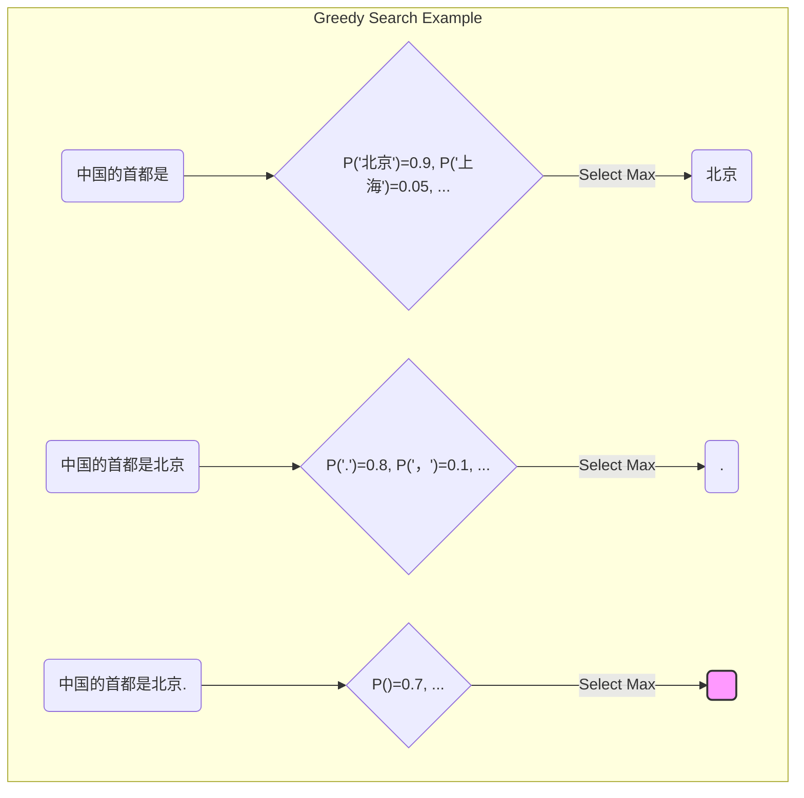
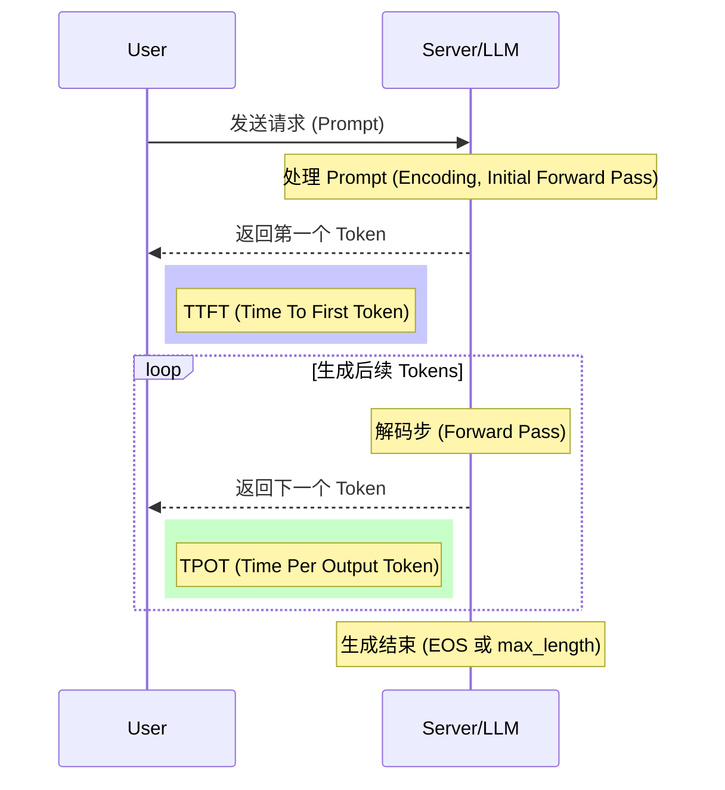

# 第8章：模型如何"说话"：推理过程与多样化解码策略 (Generating Text: Understanding Inference Fundamentals and Diverse Decoding Strategies)

欢迎来到本书的第三部分：**推理篇**。在前两个部分，我们深入探讨了大规模语言模型（LLM）的基础原理、核心架构（如 Transformer），以及如何通过海量数据和复杂的分布式训练技术来锻造这些强大的模型。现在，我们将目光转向 LLM 应用的"最后一公里"——**推理 (Inference)**。推理是将训练好的模型投入实际使用，让它根据给定的输入（Prompt）生成有用、连贯、符合期望的文本输出的过程。

本章作为推理篇的开篇，将聚焦于 LLM 生成文本的核心机制。我们将首先揭示自回归（Autoregressive）推理的神秘面纱，理解模型是如何一步步"吐"出词语的。接着，我们将深入探讨一系列控制生成过程的解码策略（Decoding Strategies），例如经典的贪心搜索、束搜索，以及更具创造性的 Top-K/Top-P 采样和温度采样。此外，我们还会讨论如何通过重复惩罚、长度惩罚等手段微调生成行为。最后，我们将学习如何衡量推理过程的效率和质量，并提供代码实践环节，让您亲手实现并比较不同解码策略的效果。

掌握本章内容，您将能够：

*   清晰理解 LLM 生成文本的基本原理。
*   熟练掌握并选择合适的解码策略以控制输出的多样性与质量。
*   了解微调生成行为的常用技巧。
*   掌握评估推理性能的关键指标。
*   具备动手实现和比较不同解码算法的能力。

让我们一起探索 LLM 是如何将冰冷的概率分布转化为流畅自然的语言的！

## 8.1 揭秘生成过程：自回归推理的逐步解析 (Unveiling the Generation Process: Step-by-Step Analysis of Autoregressive Inference)

大多数现代的大规模语言模型，尤其是 GPT 系列以及许多基于 Transformer Decoder 架构的模型（如 Llama, Mistral 等），都采用**自回归 (Autoregressive)** 的方式生成文本。这个术语听起来可能有些复杂，但其核心思想却相当直观：**模型一次只生成一个词（Token），并且将刚刚生成的词作为下一步预测的输入**。这个过程就像我们说话或写作一样，总是在已有的内容基础上，思考下一个最合适的词语是什么。

**自回归过程详解：**

想象一下，我们给模型一个起始提示（Prompt），比如 "中国的首都是"。模型的任务是续写这句话。

1.  **输入编码 (Input Encoding)**：首先，模型接收输入提示 "中国的首都是"。通过我们在第四章讨论过的 Tokenizer，这句话被转换成一个 Token 序列，例如 `[CLS, "中国", "的", "首都", "是"]` （这里的 `[CLS]` 是一个示意性的特殊 Token，具体取决于模型）。这些 Token 进一步通过词嵌入层（Embedding Layer）和位置编码（Positional Encoding）转换为向量表示，输入到 Transformer 的 Decoder（或 Encoder-Decoder 模型的 Decoder 部分）中。

2.  **第一次预测 (First Prediction)**：模型处理输入的向量序列，通过多层 Transformer Block（包含自注意力、前馈网络等），最终在输出层得到一个**概率分布**。这个概率分布覆盖了模型词汇表（Vocabulary）中的所有 Token。每个 Token 都有一个概率值，表示模型认为它是下一个最可能出现的 Token 的置信度。例如，模型可能会给 "北京" 一个很高的概率（比如 0.9），给 "上海" 一个较低的概率（比如 0.05），给其他词更低的概率。

    ```mermaid
    graph TD
        subgraph "模型内部 (Transformer Decoder)"
            A("Input:中国的首都是") --> B(Embedding + Positional Encoding);
            B --> C{Transformer Layers};
            C --> D[Output Layer (Logits)];
            D --> E[Softmax];
        end
        E --> F((Vocabulary Probability Distribution));
        F -- "Highest Probability" --> G{"北京": 0.9, "上海": 0.05, ...};

        style F fill:#f9f,stroke:#333,stroke-width:2px
    ```

3.  **选择与追加 (Selection and Appending)**：根据某种**解码策略**（我们将在下一节详细讨论），模型从概率分布中选择一个 Token 作为输出。最简单的方式是选择概率最高的 Token，即 "北京"。然后，模型将这个新生成的 Token 追加到当前的序列末尾。现在的序列变成了 `[CLS, "中国", "的", "首都", "是", "北京"]`。

4.  **迭代生成 (Iterative Generation)**：模型将**更新后的序列** `[CLS, "中国", "的", "首都", "是", "北京"]` 作为**新的输入**，重复步骤 2 和 3。这一次，模型会基于 "中国的首都是北京" 来预测下一个 Token。它可能会预测到一个表示句子结束的特殊 Token（如 `[SEP]` 或 `</s>`），或者预测到标点符号（如句号 "."），或者继续生成其他相关的词语。

5.  **终止条件 (Stopping Condition)**：这个自回归的过程会一直持续下去，直到满足某个终止条件。常见的终止条件包括：
    *   生成了预定最大长度的 Token。
    *   生成了特定的终止 Token（End-of-Sequence, EOS）。
    *   根据某些更复杂的规则判断生成已经完成。

**自回归的核心特点：**

*   **顺序性 (Sequentiality)**：生成过程是严格按顺序进行的，一次一个 Token。
*   **条件性 (Conditionality)**：每个 Token 的生成都依赖于之前已经生成的所有 Token（以及最初的 Prompt）。这使得模型能够捕捉上下文信息，生成连贯的文本。$P(y_t | y_{<t}, x)$，其中 $y_t$ 是当前要预测的 Token，$y_{<t}$ 是已经生成的 Token 序列，$x$ 是原始输入 Prompt。
*   **计算密集 (Computationally Intensive)**：每生成一个 Token 都需要模型进行一次完整的前向传播（Forward Pass）。生成长文本时，这会消耗大量的计算资源。尤其是注意力机制，其计算复杂度与序列长度的平方相关（尽管后续优化如 FlashAttention 改善了这一点）。

下面的伪代码更清晰地展示了自回归生成的基本流程：

```python
def autoregressive_generate(model, tokenizer, prompt, max_length):
    """
    基本的自回归文本生成过程伪代码

    Args:
        model: 训练好的语言模型
        tokenizer: 用于编码和解码文本的 Tokenizer
        prompt: 输入的文本提示
        max_length: 生成的最大 Token 数量

    Returns:
        生成的文本字符串
    """
    # 1. 编码输入提示
    input_ids = tokenizer.encode(prompt, return_tensors="pt") # 假设使用 PyTorch

    # 存储生成的 token ids
    generated_ids = input_ids.tolist()[0] # 初始化为输入 prompt 的 ids

    model.eval() # 设置为评估模式
    import torch # 假设使用 torch

    with torch.no_grad(): # 关闭梯度计算，节省显存和计算
        for _ in range(max_length):
            # 2. 模型前向传播，获取下一个 token 的 logits
            # 使用当前的 input_ids 进行预测
            current_input_ids = torch.tensor([generated_ids])
            outputs = model(input_ids=current_input_ids)
            next_token_logits = outputs.logits[:, -1, :] # 取最后一个时间步的 logits

            # 3. 解码策略：选择下一个 token (这里用最简单的 greedy)
            next_token_id = torch.argmax(next_token_logits, dim=-1).item()

            # 4. 追加生成的 token
            generated_ids.append(next_token_id)

            # 5. 检查终止条件
            if next_token_id == tokenizer.eos_token_id: # 假设 tokenizer 有 eos_token_id
                break

            # 准备下一次迭代的输入 (虽然这里没用到，但展示概念)
            # input_ids = torch.cat([input_ids, torch.tensor([[next_token_id]])], dim=1) # 效率较低的方式

    # 6. 解码生成的 token ids 为文本
    generated_text = tokenizer.decode(generated_ids, skip_special_tokens=True)
    return generated_text

# 示例 (假设已有 model 和 tokenizer)
# result = autoregressive_generate(my_llm_model, my_tokenizer, "中国的首都是", 50)
# print(result)
```

理解了自回归的基本原理后，我们就能明白为什么不同的**解码策略**如此重要。它们决定了在每一步如何从模型预测的概率分布中选择下一个 Token，从而直接影响最终生成文本的质量、风格和多样性。

## 8.2 控制输出：贪心、束搜索、Top-K/Top-P Sampling, 温度采样等解码算法详解与选择 (Controlling Output: Detailed Explanation and Selection of Decoding Algorithms - Greedy, Beam Search, Top-K/Top-P Sampling, Temperature Sampling)

在自回归生成的每一步，模型都会输出一个覆盖整个词汇表的概率分布。如何从这个分布中挑选出下一个 Token，就是**解码策略（Decoding Strategy）** 要解决的问题。不同的策略会导致截然不同的生成结果，有的追求最可能、最安全的输出，有的则鼓励探索和创造性。选择合适的解码策略对于获得理想的 LLM 输出至关重要。

下面我们详细介绍几种最常用和最重要的解码策略：

**1. 贪心搜索 (Greedy Search)**

*   **原理**：最简单直观的策略。在每一步，**总是选择当前概率最高的那个 Token** 作为输出。
*   **过程**：计算出当前步所有 Token 的概率，选择 $argmax(P(y_t | y_{<t}, x))$ 对应的 Token。
*   **优点**：
    *   实现简单，计算速度快。
    *   生成的文本通常在局部看起来比较连贯、合理。
*   **缺点**：
    *   **短视 (Myopic)**：只关注当前步的最优选择，可能导致错过全局最优解。一个当前概率稍低的词，可能在后续能引出概率更高的词序列，但贪心搜索会直接排除掉它。
    *   **缺乏多样性**：对于相同的输入，总是生成完全相同的输出。
    *   **容易陷入重复**：倾向于生成高频、安全的词语，可能导致输出内容单调乏味，甚至出现重复循环。
*   **适用场景**：需要快速得到一个相对确定、保守的答案，对多样性要求不高的场景，如简单的翻译、摘要或事实性问答。



**2. 束搜索 (Beam Search)**

*   **原理**：贪心搜索只保留每一步最优的一个选择，而束搜索则试图**在每一步保留多个（ `num_beams` 个）最可能的候选序列（称为"束"或 "beams"）**，并在此基础上进行扩展。它试图在计算复杂度和搜索最优解之间取得平衡。
*   **过程**：
    *   **初始化**：从第一个时间步开始，选择概率最高的 `num_beams` 个 Token，形成 `num_beams` 个初始候选序列。
    *   **扩展**：在后续的每一步 $t$，对于上一步保留的每个候选序列，计算所有可能的下一个 Token 的概率。这样会得到 `num_beams * vocab_size` 个可能的扩展序列。
    *   **剪枝**：计算这些扩展序列的**累积概率（或对数概率之和）**，只保留其中累积概率最高的 `num_beams` 个序列，作为当前步的候选序列。
    *   **重复**：重复扩展和剪枝步骤，直到所有束都生成了终止符或达到最大长度。
    *   **选择**：最终从完成的 `num_beams` 个序列中，选择累积概率最高（或根据长度归一化后最高）的那个作为最终输出。
*   **参数**：
    *   `num_beams` (束宽)：控制保留的候选序列数量。`num_beams=1` 时等价于贪心搜索。`num_beams` 越大，搜索范围越广，越接近找到全局最优解，但计算量和内存消耗也越大。
*   **优点**：
    *   相比贪心搜索，能找到**概率更高、更连贯的全局序列**。
    *   生成的文本质量通常比贪心搜索好，更流畅自然。
*   **缺点**：
    *   计算成本显著高于贪心搜索（大约是 `num_beams` 倍）。
    *   仍然可能**牺牲多样性**，倾向于生成比较"安全"、高频的序列。
    *   对于开放式生成任务（如写故事、聊天），有时结果可能过于平淡、缺乏惊喜。
    *   可能会出现重复问题（虽然通常比贪心好些）。
*   **适用场景**：对生成质量要求较高，且可以接受一定计算开销的任务，如机器翻译、文本摘要、语音识别的文本转录。

```mermaid
graph TD
    Start("Prompt") --> Step1_Logits{"Top-k Logits (k=num_beams)"};

    subgraph "Beam Search (num_beams=2)"
        Step1_Logits --> Beam1_t1("Seq A: P=0.6");
        Step1_Logits --> Beam2_t1("Seq B: P=0.5");

        Beam1_t1 --> Expand1{"Expand Seq A"};
        Beam2_t1 --> Expand2{"Expand Seq B"};

        Expand1 --> Candidate1_t2("Seq AA: P=0.6*0.7=0.42");
        Expand1 --> Candidate2_t2("Seq AB: P=0.6*0.2=0.12");
        Expand2 --> Candidate3_t2("Seq BA: P=0.5*0.5=0.25");
        Expand2 --> Candidate4_t2("Seq BB: P=0.5*0.4=0.20");

        subgraph "Time t+1 Candidates (Total 2*vocab_size, showing 4)"
            Candidate1_t2
            Candidate2_t2
            Candidate3_t2
            Candidate4_t2
        end

        Select_t2{"Select Top 2 Beams by Cumulative Prob"} --> Beam1_t2("New Seq 1 (e.g., AA): P=0.42");
        Select_t2 --> Beam2_t2("New Seq 2 (e.g., BA): P=0.25");

        {Candidate1_t2, Candidate2_t2, Candidate3_t2, Candidate4_t2} --> Select_t2;

        Beam1_t2 --> MoreSteps("...");
        Beam2_t2 --> MoreSteps;
    end

    style Select_t2 fill:#ccf,stroke:#333,stroke-width:2px
```

**3. 采样方法 (Sampling Methods)**

与贪心和束搜索追求"最优"不同，采样方法旨在**引入随机性**，从模型的概率分布中**按照概率进行抽样**，从而生成更多样化、更具创造性的文本。

**a) 温度采样 (Temperature Sampling)**

*   **原理**：在进行 Softmax 计算之前，通过一个称为**温度（Temperature, T）** 的参数来调整原始 Logits。
    *   $P(y_i) = \frac{exp(logit_i / T)}{\sum_j exp(logit_j / T)}$
*   **过程**：
    *   获取模型输出的原始 Logits。
    *   将每个 Logit 除以温度 T。
    *   对调整后的 Logits 应用 Softmax 函数，得到新的概率分布。
    *   根据这个新的概率分布进行随机抽样，选择下一个 Token。
*   **参数**：
    *   `temperature` (T):
        *   **T > 1**: 概率分布变得更**平坦 (flatter)**，低概率 Token 的概率被提升，高概率 Token 的概率被压低。抽样结果更随机、更多样、更不可预测。
        *   **T = 1**: 等同于标准的 Softmax，按照模型原始概率分布进行抽样。
        *   **0 < T < 1**: 概率分布变得更**尖锐 (sharper)**，高概率 Token 的概率被放大，低概率 Token 的概率被进一步压缩。抽样结果更倾向于选择高概率 Token，接近贪心搜索，但仍有随机性。
        *   **T -> 0**: 极限情况下等价于贪心搜索。
        *   **T -> ∞**: 极限情况下变成均匀分布，完全随机选择。
*   **优点**：
    *   简单有效，只需一个参数即可控制生成文本的随机性/创造性。
    *   能够生成比贪心/束搜索更多样化的输出。
*   **缺点**：
    *   当 T 过高时，可能生成不连贯、包含低质量词语的文本，因为模型可能会选择那些原始概率非常低的词。
    *   当 T 过低时，又会失去多样性。需要仔细调整找到合适的温度值。
*   **适用场景**：需要生成多样化、有创造性内容的任务，如故事生成、诗歌创作、对话系统、头脑风暴等。通常 T 的取值范围在 0.7 到 1.0 之间比较常见。

**b) Top-K 采样 (Top-K Sampling)**

*   **原理**：限制采样范围，**只在当前概率最高的 K 个 Token 中进行重新归一化和采样**。
*   **过程**：
    *   获取模型输出的概率分布。
    *   选出概率最高的 K 个 Token。
    *   将这 K 个 Token 的概率进行重新归一化（使它们的概率和为 1）。
    *   根据这个归一化后的新分布进行随机抽样。
    *   （可选）可以与温度采样结合使用：先用温度调整 Logits，再进行 Top-K 筛选和采样。
*   **参数**：
    *   `top_k` (K)：指定采样范围的大小。K 越大，采样范围越大，随机性越高；K 越小，采样范围越小，随机性越低。`K=1` 等价于贪心搜索。
*   **优点**：
    *   通过限制采样范围，有效**避免了从概率极低的"长尾"词语中采样**，减少了生成不相关或奇怪内容的风险，相比单纯的温度采样更安全。
    *   相比贪心/束搜索，仍然能提供较好的多样性。
*   **缺点**：
    *   K 是一个**固定值**，不够灵活。有时概率分布可能非常尖锐（只有少数几个词概率很高），此时即使 K 值较大，实际采样范围也很小；有时概率分布可能非常平坦（很多词概率差不多），此时即使 K 值较小，也可能纳入一些不太合适的词。
*   **适用场景**：需要多样性但又希望控制生成质量的场景，是采样方法中常用的基准策略之一。K 的典型值可能在 50 左右。

**c) Top-P (Nucleus) 采样 (Top-P Sampling / Nucleus Sampling)**

*   **原理**：一种更动态的采样范围限制方法。**选择概率最高的若干个 Token，使得它们的累积概率刚好超过一个阈值 P**，然后只在这些 Token（称为"核心 Nucleus"）中进行重新归一化和采样。
*   **过程**：
    *   获取模型输出的概率分布，并按概率从高到低排序。
    *   从概率最高的 Token 开始，逐个累加它们的概率，直到累积概率大于或等于 P。
    *   将这些累积概率超过 P 的 Token 集合作为采样候选集。
    *   对这个候选集中的 Token 概率进行重新归一化（使它们的概率和为 1）。
    *   根据这个归一化后的新分布进行随机抽样。
    *   （可选）可以与温度采样结合使用。
*   **参数**：
    *   `top_p` (P)：累积概率阈值，通常取值在 0 到 1 之间（如 0.9, 0.92, 0.95）。
*   **优点**：
    *   **动态调整采样范围**：当模型对下一个词非常确定时（概率分布尖锐），核心集会很小，采样更集中；当模型不太确定时（概率分布平坦），核心集会更大，允许更多探索。这通常比固定的 Top-K 更智能。
    *   有效平衡了多样性和生成质量，是目前**最常用且效果较好**的采样策略之一。
*   **缺点**：
    *   实现比 Top-K 稍复杂一点（需要排序和累加）。
    *   P 值的选择仍然需要调整。
*   **适用场景**：几乎适用于所有需要多样化生成的任务，如对话、创作、代码生成等。是目前许多 LLM 应用的默认或推荐采样策略。

**如何选择解码策略？**

选择哪种解码策略取决于具体的应用场景和需求：

| 策略           | 主要特点                                 | 优点                             | 缺点                                   | 适用场景                       |
| -------------- | ---------------------------------------- | -------------------------------- | -------------------------------------- | ------------------------------ |
| **Greedy**     | 总是选最优，确定性                       | 简单快速，局部连贯               | 短视，缺乏多样性，易重复             | 简单问答，快速获取保守结果       |
| **Beam Search** | 保留 top N 序列，平衡质量与计算        | 全局概率更高，更流畅             | 计算量大，仍可能缺乏多样性，可能平淡 | 翻译，摘要，需要高质量确定性输出 |
| **Temperature**| 通过温度调整概率分布，引入随机性         | 控制随机性/创造性                | 高温可能不连贯，低温缺乏多样性         | 创作，对话，需要多样性与惊喜     |
| **Top-K**      | 在 Top K 词中采样，限制采样范围        | 避免低概率词，平衡多样性与质量 | K 值固定不够灵活                     | 需要多样性并控制风险的通用场景   |
| **Top-P**      | 在累积概率 > P 的核心词中采样，动态范围 | 动态范围，平衡多样性与质量好     | 实现稍复杂                           | **推荐**的通用多样化生成策略     |

**实践中的组合使用：**

在实际应用中，常常会**组合使用**这些策略。例如：

*   **Top-P + Temperature**: 先用温度调整 Logits，然后进行 Top-P 采样。这是非常常见的组合，能够灵活地控制随机性和采样范围。
*   **Top-K + Temperature**: 类似地，先调温再进行 Top-K 采样。
*   **Beam Search + Sampling**: 有些研究尝试在 Beam Search 的每一步使用采样而非贪心选择，或者在 Beam Search 结束后从多个 Beam 中采样，以增加多样性，但这会进一步增加复杂性。

Hugging Face `transformers` 库的 `generate()` 方法就提供了对上述所有策略（以及它们的组合）的便捷支持，我们将在 8.5 节的代码实践中看到如何使用它们。

理解并熟练运用这些解码策略，是释放 LLM 生成能力的钥匙。通过调整策略和参数，我们可以引导模型在"精确可靠"和"天马行空"之间找到最适合我们需求的平衡点。

## 8.3 微调生成行为：重复惩罚、长度惩罚等常用控制手段 (Fine-tuning Generation Behavior: Common Control Mechanisms like Repetition Penalty, Length Penalty)

除了选择核心的解码策略（如贪心、束搜索、采样）之外，我们还可以使用一些额外的参数来进一步微调和控制 LLM 的生成行为，解决一些常见的问题，例如恼人的重复内容或者生成过长/过短的文本。

**1. 重复惩罚 (Repetition Penalty)**

*   **问题**：LLM，尤其是使用贪心或束搜索，或者温度较低的采样时，有时会陷入重复模式，不断生成相同的词语、短语甚至整个句子。
*   **原理**：在计算下一个 Token 的概率分布时，对**已经在前面文本中出现过的 Token 的 Logits 施加一个惩罚**，降低它们被再次选中的概率。
*   **实现方式**：
    *   对于词汇表中的每个 Token，检查它是否在已生成的序列（或者一个特定的历史窗口内）出现过。
    *   如果出现过，将其 Logit 除以一个大于 1 的惩罚因子 `repetition_penalty`（或者乘以一个小于 1 的因子，具体实现可能不同）。Logit 越小，经过 Softmax 后的概率就越低。
    *   $logit_i' = logit_i / repetition\_penalty$  (如果 $token_i$ 已出现)
    *   $logit_i' = logit_i$ (如果 $token_i$ 未出现)
*   **参数**：
    *   `repetition_penalty`：惩罚因子，通常设置在 1.0 到 2.0 之间。
        *   `1.0` 表示不施加惩罚。
        *   大于 `1.0` 表示施加惩罚，值越大，惩罚力度越强，重复的可能性越低。
*   **优点**：
    *   能有效减少或消除生成文本中的不自然重复。
*   **缺点**：
    *   惩罚力度过强可能导致模型回避使用一些必要的、自然重复的词语（如 "the", "a" 等），或者在需要重复某个概念时反而避免了它。
    *   需要根据模型和任务调整合适的惩罚值。
*   **适用场景**：几乎所有生成任务都可以考虑使用，特别是当观察到明显重复时。Hugging Face `generate` 中默认值通常是 1.0（无惩罚），可以按需调整（例如设为 1.1 或 1.2）。

**2. 无重复 N-gram (No Repeat N-gram Size)**

*   **问题**：更精细地控制重复，防止特定长度的词语序列（N-gram）重复出现。
*   **原理**：在生成过程中，如果某个候选 Token 会导致与之前出现的某个 N-gram 完全相同，则将该候选 Token 的概率设置为 0（或一个极小的负数 Logit），强制模型不选择它。
*   **参数**：
    *   `no_repeat_ngram_size` (N)：指定要禁止重复的 N-gram 的大小。例如，设置为 2 表示不允许连续两个词的组合重复出现；设置为 3 表示不允许连续三个词的组合重复出现。
*   **优点**：
    *   比简单的重复惩罚更精确地控制重复模式。
*   **缺点**：
    *   可能过于严格，阻止了一些自然的、必要的 N-gram 重复。
    *   计算开销比重复惩罚略高，需要维护和检查历史 N-gram。
*   **适用场景**：当需要严格防止特定短语或模式重复时，例如生成列表、诗歌等。

**3. 长度惩罚 (Length Penalty)** - 主要用于束搜索

*   **问题**：标准的束搜索倾向于选择**较短**的序列，因为序列越长，累积的对数概率（通常是负数）会越小。这可能导致生成的摘要过短或翻译不完整。
*   **原理**：在比较束搜索最终完成的候选序列时，对其累积的对数概率进行**归一化**，以**补偿长度带来的影响**。
*   **实现方式**：常用的归一化方法是：
    *   $Score(Y) = \frac{\log P(Y)}{LP(len(Y))}$
    *   其中 $LP(len(Y))$ 是长度惩罚项，通常形式为 $len(Y)^\alpha$，$\alpha$ 是长度惩罚指数。
*   **参数**：
    *   `length_penalty` ($\alpha$)：长度惩罚指数。
        *   $\alpha = 0$：无长度惩罚。
        *   $\alpha > 0$：鼓励生成更长的序列。值越大，对长序列的偏好越强。
        *   $\alpha < 0$：惩罚长序列，鼓励生成更短的序列（较少使用）。
*   **优点**：
    *   在束搜索中，可以有效缓解偏好短序列的问题，生成更合理长度的文本。
*   **缺点**：
    *   主要适用于束搜索。
    *   需要调整 $\alpha$ 值以获得期望的长度。
*   **适用场景**：机器翻译、文本摘要等需要生成特定长度范围输出的任务，并且使用束搜索作为解码策略时。

**4. 最大长度 (Max Length / Max New Tokens)**

*   **问题**：需要限制生成文本的总长度或新生成的 Token 数量，防止无限生成或超出处理能力。
*   **原理**：设定一个生成 Token 数量的上限。
*   **参数**：
    *   `max_length`：指定包含输入 Prompt 在内的总 Token 序列的最大长度。
    *   `max_new_tokens`：指定**新生成**的 Token 的最大数量（不包括 Prompt）。这是更常用的参数。
*   **实现方式**：当生成的 Token 数量达到设定上限时，强制停止生成过程，即使模型还没有生成 EOS Token。
*   **优点**：
    *   简单直接地控制输出长度。
    *   保证生成过程的可控性和资源消耗。
*   **缺点**：
    *   如果设置得太短，可能导致输出在不合适的地方被截断，内容不完整。
*   **适用场景**：所有生成任务都需要设置，作为基本的安全和资源控制措施。

**5. 最小长度 (Min Length / Min New Tokens)**

*   **问题**：有时需要确保生成的文本达到一定的最小长度，避免输出过短、无意义的内容。
*   **原理**：设定一个生成 Token 数量的下限。
*   **参数**：
    *   `min_length`：指定包含输入 Prompt 在内的总 Token 序列的最小长度。
    *   `min_new_tokens`：指定新生成的 Token 的最小数量。
*   **实现方式**：在生成过程中，即使模型已经生成了 EOS Token，只要当前长度还没达到 `min_length` 或 `min_new_tokens`，就强制模型继续生成（通常会屏蔽 EOS Token 的选择）。
*   **优点**：
    *   确保输出具有一定的实质内容，避免空洞或过短的回答。
*   **缺点**：
    *   如果设置得过长，可能强迫模型在内容已经完整后继续"画蛇添足"。
*   **适用场景**：文本摘要、翻译等需要保证一定输出量的任务。

**6. 早停机制 (Early Stopping)** - 主要用于束搜索

*   **问题**：在束搜索中，当所有束都生成了 EOS Token 时，搜索过程通常会停止。但这可能发生得过早，特别是当 `num_beams` 较大时。
*   **原理**：控制束搜索何时可以提前结束。
*   **参数**：
    *   `early_stopping`：
        *   `True`：当至少有 `num_beams` 个句子完成（生成 EOS）时，就停止束搜索。
        *   `False` 或 `'never'`：只有当不可能再找到更好的（更高概率的）束时才停止。这通常意味着要等到所有 `num_beams` 个束都完成或者达到 `max_length`。
*   **优点**：
    *   `early_stopping=True` 可以加快束搜索的速度。
*   **缺点**：
    *   `early_stopping=True` 可能导致错过在稍后步骤中概率反超的更优序列。
*   **适用场景**：在束搜索中平衡速度和最优解查找的需求。

**组合应用：**

这些控制手段通常会与核心解码策略（贪心、束、采样）结合使用。例如，一个典型的生成配置可能是：

*   使用 Top-P 采样 (`top_p=0.92`)
*   配合温度采样 (`temperature=0.8`)
*   加入重复惩罚 (`repetition_penalty=1.1`)
*   设置最大新生成 Token 数 (`max_new_tokens=512`)
*   可能还会根据需要设置 `min_new_tokens` 或 `no_repeat_ngram_size`。

通过灵活组合这些参数，我们可以像调整乐器的旋钮一样，精细地控制 LLM 生成文本的风格、质量、长度和多样性，使其更好地满足我们的特定需求。

## 8.4 衡量快慢好坏：理解推理延迟 (TTFT, TPOT)、吞吐量与显存占用 (Measuring Speed and Quality: Understanding Inference Latency (TTFT, TPOT), Throughput, and Memory Usage)

当我们部署和使用 LLM 时，除了关注生成内容的质量，还需要关注其**运行效率**。尤其是在实时应用（如聊天机器人）或需要处理大量请求的场景下，推理的速度和资源消耗变得至关重要。本节将介绍衡量 LLM 推理性能的关键指标。

**核心性能指标：**

**1. 延迟 (Latency)**

延迟衡量的是完成一次推理任务所需的时间，是衡量"快慢"最直接的指标。对于 LLM 的自回归生成，延迟通常分为两个关键部分：

*   **首个 Token 时间 (Time To First Token, TTFT)**：从用户发送请求到接收到第一个生成 Token 所需的时间。这包括了网络传输时间、请求排队时间、模型加载时间（如果是冷启动）、处理 Prompt 并计算第一个 Token 的时间。TTFT 对**实时交互体验**至关重要，用户不希望等待太久才能看到模型开始响应。
    *   **影响因素**：Prompt 长度（越长处理越慢）、模型大小、硬件性能（计算速度）、KV Cache 计算效率、网络状况、批处理大小（如果请求需要等待凑批）。
*   **每个输出 Token 时间 (Time Per Output Token, TPOT)**：生成后续每个 Token 平均所需的时间。这主要取决于模型进行一次前向传播（解码步）所需的时间。
    *   **影响因素**：模型大小、硬件性能、解码策略的复杂度（如 Beam Search 比 Greedy 慢）、KV Cache 的效率、Attention 机制的实现（如 FlashAttention 可以显著降低 TPOT）。
*   **总生成时间 (Total Generation Time)**：TTFT + (TPOT * (Number of Generated Tokens - 1))。这是用户感知到的完整响应时间。



**2. 吞吐量 (Throughput)**

吞吐量衡量的是系统在**单位时间内能够处理的请求数量或生成的 Token 总量**。它反映了系统的整体处理能力，对于需要服务大量用户的应用（如 API 服务）或离线批处理任务（如批量生成报告）至关重要。

*   **请求吞吐量 (Requests per Second, RPS)**：每秒可以完成的独立推理请求的数量。
*   **Token 吞吐量 (Tokens per Second, TPS)**：系统每秒能够生成的 Token 总数（所有并发请求生成的 Token 之和）。这是衡量 LLM 推理系统**计算效率**更常用的指标。

**延迟与吞吐量的关系：**

通常情况下，延迟和吞吐量之间存在**权衡 (Trade-off)**。

*   为了降低单个请求的延迟（尤其是 TTFT），我们可能倾向于使用较小的批处理大小（Batch Size），甚至 Batch Size = 1。但这会导致 GPU 计算单元利用率不高，整体吞吐量下降。
*   为了提高吞吐量，我们通常会增大批处理大小，让多个请求同时在 GPU 上计算。这样可以提高硬件利用率，但可能会增加单个请求的排队等待时间，从而增加其感知到的延迟。

**连续批处理 (Continuous Batching)** 等技术（将在第 10 章详细介绍）旨在通过动态管理批处理，在保持较高吞吐量的同时，尽可能地降低请求的平均延迟。

**3. 显存占用 (Memory Usage)**

LLM 推理对 GPU 显存（VRAM）的需求非常大，主要来自以下几个方面：

*   **模型权重 (Model Weights)**：存储模型参数本身。模型规模越大（几十亿、几百亿甚至上千亿参数），这部分占用就越多。即使用 FP16（半精度）存储，一个 7B 参数的模型也需要约 14GB 显存。量化技术（如 INT8, INT4）可以显著降低这部分占用（见第 9 章）。
*   **KV Cache**：存储 Attention 机制中的 Key 和 Value 状态，避免重复计算。KV Cache 的大小与**批处理大小 (Batch Size)**、**序列长度 (Sequence Length)** 和**模型隐藏层维度/头数**成正比。对于长序列或大批处理，KV Cache 可能成为显存占用的主要瓶颈。PagedAttention 等技术（见第 10 章）旨在优化 KV Cache 的管理。
    *   KV Cache Size ≈ `batch_size * sequence_length * num_layers * hidden_size * 2 (K and V) * precision_bytes`
*   **激活值 (Activations)**：模型前向传播过程中产生的中间计算结果。虽然推理时通常不需要存储用于反向传播的激活值，但在计算过程中仍然需要临时显存来存放它们。这部分占用通常没有 KV Cache 大，但也需要考虑。
*   **其他开销**：如输入/输出缓冲区、CUDA Context、驱动程序等。

**显存的重要性：**

*   **能否运行**：显存容量直接决定了能够运行多大的模型，以及在给定模型下能够支持的最大批处理大小和序列长度。如果显存不足，推理任务根本无法启动。
*   **影响性能**：显存带宽（数据从显存传输到计算单元的速度）也是影响推理速度的关键因素，尤其是对于访存密集型（Memory-bound）的操作（如 Attention）。

**衡量方法：**

*   **基准测试工具 (Benchmarking Tools)**：使用专门的工具（如 `text-generation-inference`, `vLLM` 自带的 benchmark 脚本，或者自定义脚本）来模拟不同负载（并发数、输入/输出长度），测量 TTFT, TPOT, TPS 和显存峰值。
*   **监控工具 (Monitoring Tools)**：使用 `nvidia-smi` (NVIDIA GPU)、`rocm-smi` (AMD GPU) 或其他系统监控工具来实时查看推理过程中的 GPU 利用率、显存占用和温度。
*   **性能分析器 (Profilers)**：使用 NVIDIA Nsight Systems/Compute 或 PyTorch Profiler 等工具进行更底层的性能分析，找出计算瓶颈或访存瓶颈。

**总结：**

理解并有效衡量推理延迟（TTFT, TPOT）、吞吐量（RPS, TPS）和显存占用是优化 LLM 服务和部署的关键。这些指标相互关联，需要在具体的应用场景和硬件条件下进行权衡。在后续章节中，我们将探讨模型压缩（第 9 章）和推理系统优化（第 10 章）等技术，学习如何有效改善这些性能指标，让 LLM 更快、更省、更高效地运行。

## 8.5 代码实践：动手实现并对比不同解码策略的效果 (Code Practice: Implementing and Comparing Different Decoding Strategies)

理论学习之后，最好的巩固方式就是动手实践。本节我们将使用 Hugging Face `transformers` 库，加载一个预训练的语言模型，并分别使用前面介绍的几种主要解码策略（贪心、束搜索、Top-K、Top-P、温度采样）来生成文本，直观地对比它们的效果差异。

**准备工作：**

首先，确保你已经安装了 `transformers` 和 `torch` (或 `tensorflow`/`jax`，取决于你的后端偏好)。

```bash
pip install transformers torch accelerate # accelerate 通常推荐用于优化加载和运行
```

**选择模型：**

为了快速演示，我们选择一个中等规模、常见的 Decoder-only 模型，例如 `gpt2` 或 `gpt2-medium`。如果你有更强大的硬件和网络，也可以尝试更大的模型如 `Llama-2-7b-chat-hf` (需要申请访问权限或使用其开放版本) 或 `Mistral-7B-Instruct-v0.1`。

**示例代码：**

```python
import torch
from transformers import AutoModelForCausalLM, AutoTokenizer

# 1. 加载模型和 Tokenizer
# model_name = "gpt2" # 或者 "gpt2-medium", "gpt2-large"
model_name = "gpt2" # 使用小模型方便快速测试
tokenizer = AutoTokenizer.from_pretrained(model_name)
model = AutoModelForCausalLM.from_pretrained(model_name)

# 如果你有 GPU，将模型移动到 GPU
if torch.cuda.is_available():
    model.to("cuda")

# 2. 准备输入 Prompt
prompt = "The future of AI is"
input_ids = tokenizer.encode(prompt, return_tensors="pt")

# 如果使用 GPU，也将输入移动到 GPU
if torch.cuda.is_available():
    input_ids = input_ids.to("cuda")

# 3. 设置通用生成参数
max_new_tokens = 50 # 只生成少量新 token 以便观察
pad_token_id = tokenizer.eos_token_id # 对于 GPT2，pad token id 就是 eos token id

# --- 实验不同解码策略 ---

print(f"Prompt: {prompt}\n")

# --- a) 贪心搜索 (Greedy Search) ---
print("--- Greedy Search ---")
greedy_output = model.generate(
    input_ids,
    max_new_tokens=max_new_tokens,
    pad_token_id=pad_token_id,
    num_beams=1, # num_beams=1 等价于贪心
    do_sample=False # 关闭采样
)
print("Output:", tokenizer.decode(greedy_output[0], skip_special_tokens=True))
print("-" * 20)

# --- b) 束搜索 (Beam Search) ---
print("--- Beam Search (num_beams=5) ---")
beam_output = model.generate(
    input_ids,
    max_new_tokens=max_new_tokens,
    num_beams=5,
    early_stopping=True, # 通常 Beam Search 会配合 early_stopping
    pad_token_id=pad_token_id,
    no_repeat_ngram_size=2, # 加入 ngram 重复惩罚，改善 beam search 质量
    do_sample=False # 关闭采样
)
print("Output:", tokenizer.decode(beam_output[0], skip_special_tokens=True))
print("-" * 20)

# --- c) 温度采样 (Temperature Sampling) ---
print("--- Temperature Sampling (T=0.7) ---")
temp_output = model.generate(
    input_ids,
    max_new_tokens=max_new_tokens,
    do_sample=True, # 开启采样
    temperature=0.7,
    top_k=0, # top_k=0 表示不使用 Top-K 限制
    top_p=1.0, # top_p=1.0 表示不使用 Top-P 限制
    pad_token_id=pad_token_id
)
print("Output:", tokenizer.decode(temp_output[0], skip_special_tokens=True))
print("-" * 20)

# --- d) Top-K 采样 (Top-K Sampling) ---
print("--- Top-K Sampling (K=50) ---")
top_k_output = model.generate(
    input_ids,
    max_new_tokens=max_new_tokens,
    do_sample=True,
    top_k=50,
    top_p=1.0, # 关闭 Top-P
    pad_token_id=pad_token_id
)
print("Output:", tokenizer.decode(top_k_output[0], skip_special_tokens=True))
print("-" * 20)

# --- e) Top-P (Nucleus) 采样 (Top-P Sampling) ---
print("--- Top-P Sampling (P=0.92) ---")
top_p_output = model.generate(
    input_ids,
    max_new_tokens=max_new_tokens,
    do_sample=True,
    top_p=0.92,
    top_k=0, # 关闭 Top-K
    pad_token_id=pad_token_id
)
print("Output:", tokenizer.decode(top_p_output[0], skip_special_tokens=True))
print("-" * 20)

# --- f) 组合策略：Top-P + Temperature + Repetition Penalty ---
print("--- Combined Strategy (Top-P=0.92, T=0.8, RepPenalty=1.1) ---")
combined_output = model.generate(
    input_ids,
    max_new_tokens=max_new_tokens,
    do_sample=True,
    top_p=0.92,
    temperature=0.8,
    repetition_penalty=1.1,
    pad_token_id=pad_token_id
)
print("Output:", tokenizer.decode(combined_output[0], skip_special_tokens=True))
print("-" * 20)
```

**观察与分析：**

运行上述代码（可能需要一些时间下载模型），你会观察到：

*   **贪心搜索**：通常会生成非常确定性、但可能有点无聊或重复的文本。对于同一个 Prompt，每次运行结果都一样。
*   **束搜索**：生成的文本通常比贪心更流畅、质量更高，但也可能是确定性的（如果 `num_beams` 固定且未使用采样）。加入 `no_repeat_ngram_size` 可以改善重复问题。
*   **温度采样 (T=0.7)**：引入了随机性，每次运行结果可能不同。温度适中时，文本既连贯又有些变化。你可以尝试调高（如 T=1.0 或 1.2）或调低（如 T=0.5）温度，观察随机性的变化。
*   **Top-K 采样 (K=50)**：结果也是随机的，但通常比纯温度采样更稳定一些，因为它限制了采样范围，避免了极端低概率词。
*   **Top-P 采样 (P=0.92)**：通常被认为是效果最好的采样策略之一，生成的文本既多样又比较符合逻辑。每次运行结果也不同。
*   **组合策略**：结合了 Top-P、温度和重复惩罚，可以更精细地控制输出。这通常是实际应用中寻求平衡的首选方法。

**实验建议：**

*   **改变 Prompt**：尝试使用不同的起始句子，观察不同策略在不同上下文下的表现。
*   **调整参数**：
    *   改变 `num_beams` 的大小，观察对束搜索结果的影响。
    *   改变 `temperature`, `top_k`, `top_p` 的值，感受它们对采样结果随机性和质量的控制力。
    *   调整 `repetition_penalty` 的值，看看它如何影响重复。
    *   设置 `min_new_tokens` 或 `no_repeat_ngram_size`，观察它们的效果。
*   **增加 `max_new_tokens`**：生成更长的文本，更容易观察到重复、连贯性或创造性方面的差异。
*   **使用不同模型**：如果条件允许，尝试在不同的模型上运行这些实验，看看模型本身对生成结果的影响。

通过亲手实践和对比，你将对各种解码策略的特性、优缺点以及如何根据需求选择和调整它们有更深刻的理解。这是掌握 LLM 推理、让模型真正为你所用的关键一步。

---

本章我们详细探讨了 LLM 是如何通过自回归过程生成文本的，并深入研究了控制这一过程的各种解码策略和微调手段。我们还学习了衡量推理性能的关键指标。在接下来的章节中，我们将继续深入推理领域，探讨如何通过模型压缩（第 9 章）和系统优化（第 10 章）技术，让这些强大的模型运行得更快、更省资源。 