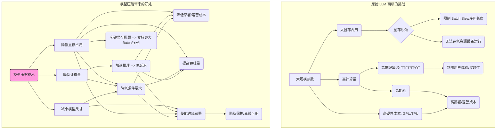

# 第9章：为模型"瘦身"：模型压缩核心技术 (Quantization, Pruning, Distillation) (Shrinking the Giant: Core Model Compression Techniques for Efficient Inference)

在上一章，我们掌握了如何引导 LLM 生成文本以及如何衡量其推理性能。我们了解到，尽管 LLM 功能强大，但其巨大的模型规模（动辄数十亿甚至上千亿参数）和计算需求给实际部署带来了严峻挑战：高昂的硬件成本、难以接受的推理延迟、巨大的显存占用以及较高的能耗。要在资源受限的环境（如移动设备、边缘端）或需要高吞吐量、低延迟的场景（如实时 API 服务）中有效利用 LLM，就必须为模型"瘦身"——这就是**模型压缩 (Model Compression)** 技术发挥作用的地方。

本章将深入探讨三种主流的模型压缩技术：**量化 (Quantization)**、**剪枝 (Pruning)** 和**知识蒸馏 (Knowledge Distillation)**。我们将逐一解析它们的原理、不同方法的优劣、前沿进展以及实践应用。

*   **量化**：通过使用更低精度的数据类型（如 8 位整数 INT8，甚至 4 位 INT4）来表示模型的权重和/或激活值，以减少显存占用、降低计算量并加速推理。
*   **剪枝**：识别并移除模型中冗余或不重要的参数（权重）或结构（如整个神经元、注意力头），以减小模型规模和计算量。
*   **知识蒸馏**：训练一个更小的"学生"模型，使其模仿一个更大、更强大的"教师"模型的行为，从而在保持较高性能的同时大幅缩小模型尺寸。

学完本章，您将能够：

*   理解模型压缩的动机和重要性。
*   掌握量化的基本原理、不同方法（PTQ vs QAT）及其适用场景。
*   了解主流的量化算法（如 GPTQ, AWQ）及其优势。
*   熟悉使用 BitsAndBytes 等工具进行模型量化的基本操作。
*   理解剪枝的基本概念、类型和挑战。
*   了解知识蒸馏的核心思想和过程。
*   为在实际应用中选择和应用合适的模型压缩技术打下基础。

让我们开始探索如何让这些庞大的语言模型变得更轻、更快、更高效。

## 9.1 优化的驱动力：速度、成本与边缘部署需求 (The Driving Force for Optimization: Speed, Cost, and Edge Deployment Needs)

为什么我们需要不遗余力地压缩 LLM？驱动力主要来自以下几个方面：

1.  **降低推理延迟 (Reducing Inference Latency)**：
    *   **更快的响应速度**：对于交互式应用（聊天机器人、实时翻译、代码助手），低延迟至关重要。用户无法忍受长时间的等待。压缩后的模型通常计算量更小，单次推理（尤其是 TPOT）所需时间更短。
    *   **满足实时性要求**：某些应用场景（如自动驾驶中的感知、金融交易中的风险评估）对延迟有极其严格的要求，原始 LLM 可能无法满足。

2.  **降低部署成本 (Lowering Deployment Costs)**：
    *   **硬件成本**：运行大型 LLM 需要昂贵的、配备大显存的 GPU 或专用 AI 加速器。压缩模型可以降低对硬件规格的要求，甚至可以在成本更低的硬件（如 CPU、中低端 GPU）上运行，从而大幅节省服务器和基础设施成本。
    *   **能耗成本**：更小的模型、更少的计算通常意味着更低的能耗。对于大规模部署的应用，累积的电费和散热成本不容忽视。压缩有助于构建更"绿色"的 AI。

3.  **提高吞吐量 (Increasing Throughput)**：
    *   **服务更多用户**：在相同的硬件上，压缩后的模型通常推理速度更快，这意味着单位时间内可以处理更多的用户请求，提高了系统的整体吞吐量和并发能力。
    *   **加速离线任务**：对于需要处理海量数据的离线批处理任务（如文档分析、内容生成），推理速度的提升可以显著缩短任务完成时间。

4.  **突破显存瓶颈 (Overcoming Memory Bottlenecks)**：
    *   **运行更大模型**：有时显存容量是运行特定 LLM 的硬性门槛。压缩技术（尤其是量化和剪枝）可以显著减少模型的显存占用，使得原本无法在特定硬件上加载的模型变得可行。
    *   **支持更大批处理/更长序列**：在显存有限的情况下，压缩模型可以释放出更多空间用于 KV Cache 或容纳更大的批处理大小，从而进一步提升吞吐量或支持更长的上下文处理。

5.  **使能边缘部署 (Enabling Edge Deployment)**：
    *   **隐私保护**：在用户设备（手机、笔记本电脑、智能家居设备）本地运行 LLM 可以避免将敏感数据上传到云端，增强数据隐私和安全性。
    *   **离线可用性**：边缘模型无需依赖网络连接即可运行，保证了应用的可用性。
    *   **低延迟**：数据在本地处理，避免了网络传输带来的延迟。
    *   **资源限制**：边缘设备通常计算能力、内存和功耗都非常有限。未经压缩的大模型几乎不可能直接在边缘设备上高效运行。模型压缩是实现 LLM 端侧部署的关键技术。



总之，模型压缩并非锦上添花，而是将 LLM 从实验室推向广泛实际应用、克服其固有"体重"问题的必要手段。接下来的小节，我们将深入探讨实现这些目标的核心技术。

## 9.2 量化（Quantization）：用低精度换取高效率 (Using Lower Precision for Higher Efficiency)

**量化 (Quantization)** 是目前应用最广泛、效果最显著的模型压缩技术之一。其核心思想是用**位数更少（精度更低）的数据类型**来存储和/或计算模型的**权重 (Weights)** 和/或**激活值 (Activations)**，从而达到减少模型大小、降低显存占用、加速计算并降低功耗的目的。

想象一下，我们通常使用 32 位浮点数（FP32）或 16 位浮点数（FP16/BF16）来表示模型中的数值。量化就是尝试用 8 位整数（INT8）、4 位整数（INT4）甚至更低位数（如 2 位、1 位）来近似表示这些数值。

**9.2.1 量化基础：数据类型与量化流程 (Quantization Basics: Data Types and Process)**

**常用数据类型：**

*   **FP32 (单精度浮点数)**：标准的 32 位浮点表示，精度高，动态范围广，但计算和存储开销最大。
*   **FP16 (半精度浮点数)**：16 位浮点表示，是混合精度训练和许多推理场景的常用格式。相比 FP32，显存和计算量减半，但精度和动态范围有所降低，可能需要特殊处理（如 Loss Scaling）来避免数值溢出或下溢。
*   **BF16 (BFloat16)**：另一种 16 位浮点表示，牺牲了部分精度位，保留了与 FP32 相似的动态范围。在现代硬件（如 NVIDIA A100/H100, Google TPU）上被广泛支持，对训练和推理都很有利。
*   **INT8 (8 位整数)**：用 8 个比特表示整数。相比 FP16/BF16，显存和计算量可以进一步减半（理论上）。需要一个**量化方案**将浮点数映射到 INT8 范围。
*   **INT4 (4 位整数)**：用 4 个比特表示整数。显存占用仅为 FP16 的 1/4，INT8 的 1/2。对硬件加速（如 NVIDIA Hopper 架构的 FP8/INT4 支持）非常友好，但精度损失可能较大，需要更精密的量化算法。
*   **更低位数 (Lower Bits)**：如 INT3, INT2, INT1 (二值化) 等，追求极致压缩，但通常伴随显著的精度下降，应用相对较少。
*   **FP8 (8 位浮点数)**：NVIDIA Hopper 架构引入的新格式，包括 E4M3 和 E5M2 两种变体，旨在结合 INT8 的低位数优势和浮点数的动态范围优势，是未来量化的一个重要方向。

**核心量化流程：**

将浮点数 $x$ 量化为低比特整数 $x_q$ 的过程通常涉及以下步骤：

1.  **确定量化范围 (Determine Clipping Range)**：找到需要量化的浮点数值（例如某个权重矩阵或激活张量）的最小值 $min(x)$ 和最大值 $max(x)$。有时会进行"裁剪 (Clipping)"，选择一个比 $min(x)$ 稍大、比 $max(x)$ 稍小的范围 $[-\alpha, \beta]$，以去除极端离群值，避免它们过度影响量化精度。
2.  **计算缩放因子 (Calculate Scale Factor, S)**：缩放因子决定了浮点数范围和整数范围之间的映射关系。对于对称量化（Symmetric Quantization，范围关于 0 对称），通常将浮点范围 $[-|\alpha|, |\alpha|]$ 映射到整数范围 $[-2^{b-1}+1, 2^{b-1}-1]$（对于 b 位有符号整数）。缩放因子 $S = \frac{|\alpha|}{2^{b-1}-1}$。对于非对称量化（Asymmetric Quantization），将浮点范围 $[\alpha, \beta]$ 映射到整数范围 $[0, 2^b-1]$（对于 b 位无符号整数）或 $[-2^{b-1}, 2^{b-1}-1]$（有符号）。需要一个额外的**零点 (Zero-Point, Z)** 来表示浮点数的 0 在整数域中的位置。
    *   非对称：$S = \frac{\beta - \alpha}{2^b - 1}$, $Z = round(-\alpha / S)$ (大致表示)
3.  **量化 (Quantize)**：将浮点数 $x$ 映射到整数 $x_q$。
    *   对称：$x_q = clip(round(x / S), -2^{b-1}+1, 2^{b-1}-1)$
    *   非对称：$x_q = clip(round(x / S + Z), 0, 2^b-1)$ （无符号为例）
    *   `round()` 表示舍入操作，`clip()` 表示将结果限制在目标整数范围内。
4.  **反量化 (Dequantize)**：在需要进行浮点计算时（或者为了模拟量化误差），可以将整数 $x_q$ 转换回浮点数 $\hat{x}$。
    *   对称：$\hat{x} = x_q * S$
    *   非对称：$\hat{x} = (x_q - Z) * S$

```mermaid
graph LR
    subgraph "量化过程 (Quantization)"
        A[浮点数 x] --> B{"确定范围 [α, β]"};
        B --> C{"计算缩放因子 S (和零点 Z)"};
        A & C --> D{量化函数 Q(x, S, Z)};
        D --> E(低比特整数 x_q);
    end
    subgraph "反量化过程 (Dequantization)"
        E --> F{"使用 S (和 Z)"};
        F --> G{反量化函数 D(x_q, S, Z)};
        G --> H(近似浮点数 x̂);
    end

    style D fill:#ccf,stroke:#333,stroke-width:2px
    style G fill:#fcc,stroke:#333,stroke-width:2px
```

**量化粒度 (Granularity)**：

量化可以在不同的粒度上进行：

*   **逐张量 (Per-Tensor)**：整个权重矩阵或激活张量共享同一个缩放因子 S 和零点 Z。最简单，但如果张量内数值分布不均匀，精度损失可能较大。
*   **逐通道 (Per-Channel) / 逐行 (Per-Row) / 逐列 (Per-Column)**：对于卷积层或线性层的权重，可以沿着输出通道、行或列计算不同的 S 和 Z。更灵活，能更好适应局部数值分布，精度通常更高，但需要存储更多的量化参数。
*   **逐组 (Per-Group)**：将权重或激活值分成小组，每组使用独立的 S 和 Z。是近年来平衡精度和复杂度的常用方法，尤其是在 GPTQ 等算法中。例如，将权重的某个维度每 64 或 128 个元素分为一组。

**权重和激活值的量化：**

*   **仅权重量化 (Weight-Only Quantization)**：只量化模型的权重，激活值在计算时仍然保持较高精度（如 FP16）。实现相对简单，因为权重是静态的，可以离线完成量化。对于 LLM 这种参数量巨大的模型，仅权重量化就能显著减少模型大小和显存占用。LLM 推理通常是访存密集型，降低权重读取的比特数能带来显著收益。
*   **权重和激活值量化 (Weight and Activation Quantization, W&A Quant)**：同时量化权重和激活值。这样可以在计算（如矩阵乘法）时直接使用低精度整数运算（需要硬件支持，如 INT8 GEMM），从而获得最大的计算加速。但激活值的分布是动态变化的，取决于输入，因此量化激活值更具挑战性，通常需要在线计算量化参数或通过 QAT 来学习。

**9.2.2 训练后量化 (PTQ) vs 量化感知训练 (QAT)：方法、优劣与选择 (Post-Training Quantization vs. Quantization-Aware Training)**

根据量化过程是否涉及模型重新训练，主要分为两种方法：

**1. 训练后量化 (Post-Training Quantization, PTQ)**

*   **原理**：在模型**已经训练完成**后，直接对其权重进行量化，或者使用少量校准数据（Calibration Data）来统计激活值的分布并确定量化参数，**无需重新训练**。
*   **流程**：
    *   加载预训练好的高精度模型（如 FP16）。
    *   （可选）准备少量有代表性的校准数据集。
    *   遍历模型，对权重进行量化（通常是静态量化）。
    *   （可选，用于 W&A 量化）通过在校准数据上运行模型，收集激活值的统计信息（如范围、分布），计算激活值的量化参数（动态或静态）。
    *   保存量化后的模型或量化参数。
*   **优点**：
    *   **简单快速**：不需要重新训练，实施成本低，开发周期短。
    *   **无需原始训练数据/流程**：只需要预训练模型和少量校准数据（有时甚至不需要）。
*   **缺点**：
    *   **精度损失可能较大**：由于没有在训练中适应量化误差，对于低比特量化（如 INT4 或更低）或对量化敏感的模型，性能下降可能比较明显。
    *   激活值的量化通常依赖于校准数据的代表性。
*   **适用场景**：
    *   对精度要求不是极高，或者模型本身对量化不敏感的场景。
    *   快速原型设计和部署。
    *   无法获取完整训练数据或训练流程的情况。
    *   仅权重量化通常采用 PTQ。INT8 W&A PTQ 也比较常见。

**2. 量化感知训练 (Quantization-Aware Training, QAT)**

*   **原理**：在**模型训练（或微调）过程**中**模拟量化操作**，让模型在训练时就学习适应量化带来的误差。
*   **流程**：
    *   在模型的前向传播中插入"伪量化"节点 (Fake Quantization Nodes)。这些节点模拟量化的过程（量化+反量化），即 $x \rightarrow Q(x) \rightarrow D(Q(x)) = \hat{x}$。
    *   模型权重和/或激活值在经过伪量化节点后，会带有量化误差，但仍然是浮点数形式，以便进行标准的反向传播。
    *   在训练过程中，模型会调整权重以最小化包含量化误差在内的损失函数。
    *   训练完成后，可以将伪量化模型的权重直接转换为真实的低比特整数权重。
*   **优点**：
    *   **精度更高**：通常能获得比 PTQ 好得多的量化后模型精度，尤其是在低比特（INT4 及以下）或 W&A 量化场景下，有时甚至能达到接近原始 FP16 模型的性能。
    *   模型对量化噪声更鲁棒。
*   **缺点**：
    *   **需要重新训练/微调**：计算成本高，开发周期长。
    *   **需要训练数据和训练流程**：需要原始或相关的训练数据集以及完整的训练基础设施。
    *   实现相对复杂。
*   **适用场景**：
    *   对模型精度要求非常高，无法接受 PTQ 带来的精度损失。
    *   需要进行低比特（INT4 及以下）W&A 量化的场景。
    *   有足够的计算资源和时间进行重新训练/微调。

**选择 PTQ 还是 QAT？**

| 特性         | PTQ (训练后量化)                  | QAT (量化感知训练)                  |
| ------------ | ----------------------------------- | ----------------------------------- |
| **时机**     | 训练完成后                        | 训练/微调过程中                   |
| **复杂度**   | 低                                  | 高                                  |
| **成本/时间**| 低                                  | 高                                  |
| **数据需求** | 无需或少量校准数据                | 需要训练数据                      |
| **精度**     | 可能有损失 (尤其低比特/W&A)        | 通常更高，接近原始模型            |
| **主要用途** | 快速部署，仅权重量化，INT8 W&A PTQ | 高精度要求，低比特 W&A 量化       |

**实践建议**：通常先尝试 PTQ，如果精度损失在可接受范围内，就选择 PTQ 因其简单高效。如果 PTQ 精度下降过多，再考虑投入资源进行 QAT。对于 LLM，由于其巨大的规模和训练成本，**PTQ（尤其是仅权重量化）是目前更主流和实用的选择**，后续介绍的 GPTQ、AWQ 等也属于 PTQ 的范畴。

**9.2.3 前沿量化算法剖析：GPTQ, AWQ, SmoothQuant 等 (Analysis of Advanced Quantization Algorithms)**

简单的 PTQ 方法（如逐张量最小最大值量化）在应用于 LLM 时，尤其是在进行 INT4/INT3 等极低比特量化时，往往会导致严重的性能下降。为了解决这个问题，研究者们提出了许多更先进的 PTQ 算法。

**1. GPTQ (Generative Pre-trained Transformer Quantization)**

*   **核心思想**：不仅仅是简单地对权重进行舍入量化，而是通过一种**逐层优化**的方式来确定量化后的权重，使得量化误差对模型输出的影响最小化。它将量化问题视为一个**优化问题**：找到量化后的权重 $W_q$，使得原始输出 $WX$ 和量化后输出 $W_qX$ 之间的差异尽可能小 (基于少量校准数据 X)。
*   **方法**：
    *   **逐层量化**：一次处理模型的一层（通常是线性层）。
    *   **逐列/逐组处理**：将权重矩阵 $W$ 按列（或按组）处理。
    *   **最优量化权重选择**：对于每一列（或组） $w$，不是简单地应用舍入 $round(w/S)$，而是寻找一个量化后的整数向量 $w_q$（其元素都在目标整数范围内），使得原始输出 $wX$ 和 $w_qX$ 的均方误差最小。这可以通过一种称为**最优脑量化 (Optimal Brain Quantization, OBQ)** 的思想及其变种（如 AdaRound）来近似求解，涉及到对 Hessian 矩阵逆的计算（或其近似）。GPTQ 提出了一种高效的计算方法。
    *   **更新剩余权重**：在量化完一列（或组）后，将量化误差 $(w - w_q)X$ "传播"到尚未量化的其他列上，以便后续的量化可以补偿之前的误差。
*   **优点**：
    *   在极低比特（如 INT4, INT3）下仍能保持相当高的模型性能，显著优于简单的舍入量化。
    *   仍然属于 PTQ，只需要少量校准数据，无需重新训练。
*   **缺点**：
    *   量化过程比简单 PTQ 复杂，需要更多的计算时间（但远低于 QAT）。
    *   实现细节较多。
*   **应用**：是目前最流行和效果最好的 LLM PTQ 方法之一，被广泛应用于将大型 LLM 量化到 INT4 等低比特。有成熟的开源实现库（如 `AutoGPTQ`）。

**2. AWQ (Activation-aware Weight Quantization)**

*   **核心思想**：观察到 LLM 中并非所有权重都同等重要。那些**对应于激活值幅度较大 (salient activations)** 的权重通道，对模型性能影响更大，量化时应更精确。因此，AWQ 的目标是**保护这些重要权重**。
*   **方法**：
    *   **识别重要权重**：通过分析少量校准数据上的激活值幅度，识别出那些具有较大激活值的权重通道（称为显著权重 "salient weights"）。
    *   **通道级缩放 (Per-channel Scaling)**：对权重矩阵进行通道级的缩放（类似于 SmoothQuant，见下文），使得重要权重的数值范围变小，从而减少量化误差，同时将这个缩放因子"吸收到"相邻的层（如 LayerNorm 或下一个线性层）中，以保持数学等价性。
    *   **量化**：对缩放后的权重进行量化（通常使用逐组量化）。由于重要权重的范围被压缩了，量化后的精度损失更小。
*   **优点**：
    *   思想简单直观，实现相对容易。
    *   量化速度非常快（比 GPTQ 快很多）。
    *   在低比特（如 INT4）下也能取得与 GPTQ 相当甚至更好的性能。
    *   对硬件友好，不需要特殊的 CUDA Kernel。
*   **缺点**：
    *   其性能可能依赖于激活值幅度与权重重要性之间的假设关系。
*   **应用**：作为 GPTQ 的一个有力竞争者，因其速度快、效果好而受到广泛关注，也有成熟的开源实现（如 `llm-awq`）。

**3. SmoothQuant**

*   **核心思想**：解决 W&A 量化（同时量化权重和激活值）中的一个主要挑战：权重和激活值的数值范围差异很大。通常激活值中存在一些幅度非常大的离群值 (outliers)，而权重的值相对较小。如果对两者使用相同的量化参数（或者即使分开量化），激活值的离群值会严重影响量化精度。SmoothQuant 提出一种**数学等价**的变换，将激活值的量化难度"平滑地"迁移一部分到权重上。
*   **方法**：
    *   考虑矩阵乘法 $Y = XW$。其中 $X$ 是激活值，$W$ 是权重。
    *   引入一个可学习的（或根据统计信息确定的）**逐通道**平滑因子 $s$。
    *   进行等价变换：$Y = XW = (X \text{diag}(s)^{-1}) (\text{diag}(s) W) = \hat{X} \hat{W}$。
    *   通过调整 $s$，可以使得**新的激活值** $\hat{X}$ 的离群值幅度减小（更容易量化），而**新的权重** $\hat{W}$ 的数值范围相应增大（但权重通常对量化不太敏感）。
    *   然后分别对 $\hat{X}$ 和 $\hat{W}$ 进行量化。
*   **优点**：
    *   显著提高了 W&A 量化（尤其是 INT8 W&A PTQ）的精度，使其接近 FP16 水平。
    *   可以作为一个即插即用的模块，与其他量化方法结合。
    *   保持了数学等价性，理论上不损失精度（除了量化本身带来的误差）。
*   **缺点**：
    *   主要解决 W&A 量化的问题。对于仅权重量化，其作用不如 GPTQ 或 AWQ 直接。
    *   需要确定合适的平滑因子 $s$。
*   **应用**：是提升 INT8 W&A PTQ 性能的关键技术，已被集成到 NVIDIA TensorRT 等推理引擎中。

**其他方法：**

*   **ZeroQuant**：来自 DeepSpeed 的一系列量化技术，结合了细粒度量化、量化感知训练和硬件优化。
*   **LLM.int8()**：一种早期的 LLM INT8 量化方法，使用向量级量化（Vector-wise Quantization）和混合精度分解来处理激活值离群值，主要用于 W&A 量化。

**总结对比：**

| 算法        | 主要思想                               | 目标场景      | 优点                                       | 缺点                          |
| ----------- | -------------------------------------- | ------------- | ------------------------------------------ | ----------------------------- |
| **GPTQ**    | 优化量化权重以最小化输出误差           | 低比特 PTQ (权) | 低比特下精度高                             | 量化较慢，实现复杂            |
| **AWQ**     | 保护重要权重（对应大激活值）           | 低比特 PTQ (权) | 量化快，精度高，硬件友好                 | 依赖假设                    |
| **SmoothQuant** | 平滑激活值离群值，迁移难度到权重     | W&A PTQ       | 提高 W&A 量化精度，数学等价，即插即用    | 主要用于 W&A，需确定因子      |

**9.2.4 MoE 模型量化的特殊挑战 (Specific Challenges in Quantizing MoE Models)**

专家混合模型 (MoE) 因其能够以较低的计算量扩展模型参数量而备受关注。然而，量化 MoE 模型带来了一些独特的挑战：

1.  **专家负载不均衡 (Expert Load Imbalance)**：不同的专家可能被激活的频率不同。如果直接对所有专家使用相同的量化方案（PTQ），那些被激活较少的专家可能因为校准数据不足而量化效果不佳。QAT 则可能因为梯度更新不频繁而训练不稳定。
2.  **门控网络敏感性 (Gating Network Sensitivity)**：门控网络负责将 Token 路由到不同的专家，其输出对模型的最终性能至关重要。对门控网络进行量化可能会影响路由的准确性，进而影响模型性能。
3.  **参数量巨大**：虽然 MoE 的计算量相对较低，但其总参数量（所有专家的参数之和）通常非常庞大。这意味着仅权重量化带来的显存节省尤为重要，但也对量化算法的效率提出了更高要求。
4.  **激活值分布差异**：不同专家的激活值分布可能存在差异。使用统一的激活值量化参数（对于 W&A 量化）可能不是最优的。

**应对策略：**

*   **专家感知的量化 (Expert-aware Quantization)**：为不同的专家（或专家组）使用不同的量化参数，或者在 QAT 中对不同专家的损失进行加权。
*   **门控保护 (Gating Protection)**：通常避免对门控网络进行量化，或者使用更高精度的量化，以保持路由的准确性。
*   **高效量化算法**：使用如 AWQ 这类量化速度快的算法，或者针对 MoE 的并行化量化策略，来处理巨大的参数量。
*   **负载均衡感知**：在量化（尤其是 QAT）时考虑专家的负载信息，给予负载较低的专家更多关注或调整。

量化 MoE 模型是一个活跃的研究领域，需要针对其稀疏激活和参数异构性进行专门的设计。

**9.2.5 实战：使用 BitsAndBytes 等工具进行模型量化 (Practice: Quantizing Models with Tools like BitsAndBytes)**

将量化理论付诸实践的最简单方法是使用现成的库。`BitsAndBytes` 是一个非常流行的库，尤其因为它被 Hugging Face `transformers` 库深度集成，可以让我们用极少的代码改动就实现模型的（主要是权重的）INT8 或 NF4（一种 4 位 NormalFloat 格式）量化加载。

**使用 BitsAndBytes 加载量化模型 (主要是 NF4 和 INT8 权重量化)**

```python
import torch
from transformers import AutoModelForCausalLM, AutoTokenizer, BitsAndBytesConfig

# --- 使用 4 位 NF4 量化加载 ---
model_name = "mistralai/Mistral-7B-Instruct-v0.1" # 示例模型

# 1. 配置 BitsAndBytesConfig for NF4
nf4_config = BitsAndBytesConfig(
   load_in_4bit=True,
   bnb_4bit_quant_type="nf4",      # 量化类型: nf4 (NormalFloat 4-bit) 或 fp4
   bnb_4bit_use_double_quant=True, # 使用二次量化减少额外量化参数的显存
   bnb_4bit_compute_dtype=torch.bfloat16 # 计算时使用的精度 (推荐 bfloat16 或 float16)
)

# 2. 加载模型时传入 quantization_config
print("Loading model with NF4 quantization...")
tokenizer_nf4 = AutoTokenizer.from_pretrained(model_name)
model_nf4 = AutoModelForCausalLM.from_pretrained(
    model_name,
    quantization_config=nf4_config,
    # device_map="auto" # 自动将模型分片加载到可用设备 (GPU, CPU, Disk)
    # trust_remote_code=True # 如果模型需要
)
print("NF4 Model Loaded. Memory footprint:")
model_nf4.print_memory_footprint()

# --- 使用 8 位 INT8 量化加载 ---
print("\nLoading model with INT8 quantization...")
int8_config = BitsAndBytesConfig(
    load_in_8bit=True,
    # llm_int8_threshold=6.0, # 可选：LLM.int8() 激活值离群值阈值
    # llm_int8_has_fp16_weight=False, # 可选
    # bnb_8bit_compute_dtype=torch.float16 # 计算精度
)
tokenizer_int8 = AutoTokenizer.from_pretrained(model_name)
model_int8 = AutoModelForCausalLM.from_pretrained(
    model_name,
    quantization_config=int8_config,
    # device_map="auto"
    # trust_remote_code=True
)
print("INT8 Model Loaded. Memory footprint:")
model_int8.print_memory_footprint()


# --- 使用量化后的模型进行推理 (与普通模型一样) ---
prompt = "What is the capital of France?"
# 使用 NF4 模型
inputs_nf4 = tokenizer_nf4(prompt, return_tensors="pt").to(model_nf4.device)
outputs_nf4 = model_nf4.generate(**inputs_nf4, max_new_tokens=20)
print("\nNF4 Model Response:", tokenizer_nf4.decode(outputs_nf4[0], skip_special_tokens=True))

# 使用 INT8 模型
inputs_int8 = tokenizer_int8(prompt, return_tensors="pt").to(model_int8.device)
outputs_int8 = model_int8.generate(**inputs_int8, max_new_tokens=20)
print("INT8 Model Response:", tokenizer_int8.decode(outputs_int8[0], skip_special_tokens=True))

# 注意：首次运行需要下载模型，可能耗时较长。
# 需要安装: pip install bitsandbytes accelerate transformers torch
# 可能需要根据你的 GPU 调整配置或模型大小。
```

**代码解释：**

*   `BitsAndBytesConfig`：用于配置量化参数。
    *   `load_in_4bit=True` 或 `load_in_8bit=True`：启用 4 位或 8 位量化加载。
    *   `bnb_4bit_quant_type`：指定 4 位量化类型，"nf4"（推荐）或 "fp4"。
    *   `bnb_4bit_use_double_quant`：对量化参数本身进行二次量化，进一步节省显存。
    *   `bnb_4bit_compute_dtype` / `bnb_8bit_compute_dtype`：指定在进行矩阵乘法等计算时，将量化的权重反量化到哪种浮点精度进行计算。通常是 `torch.float16` 或 `torch.bfloat16`。这是一种**混合精度推理**，权重以低比特存储，计算以高比特进行，以平衡速度/显存和精度。
*   `AutoModelForCausalLM.from_pretrained()`：在加载模型时传入 `quantization_config` 参数即可。`BitsAndBytes` 会在底层处理权重的量化和反量化。
*   `model.print_memory_footprint()`：可以方便地查看模型加载后的显存占用情况。你会发现量化后的模型显存占用显著降低（NF4 大约是 FP16 的 1/4，INT8 大约是 1/2）。
*   推理接口不变：加载量化模型后，调用 `model.generate()` 的方式与普通模型完全相同。

**使用 AutoGPTQ 或 AWQ 进行量化和推理**

对于 GPTQ 和 AWQ，通常需要一个单独的量化步骤来处理原始模型，生成量化后的模型权重和配置文件。然后可以使用相应的库（如 `auto-gptq`, `llm-awq`）加载这些预量化好的模型进行推理。

**量化 GPTQ 模型（示例流程）：**

```python
# 伪代码示例，具体 API 可能因库版本而异
from auto_gptq import AutoGPTQForCausalLM, BaseQuantizeConfig

model_name = "facebook/opt-125m" # 使用小模型示例
quantized_model_dir = "opt-125m-gptq"
tokenizer = AutoTokenizer.from_pretrained(model_name, use_fast=True)

# 准备少量校准数据 (示例)
calibration_data = ["auto-gptq is a useful tool for quantizing models.",
                    "quantization helps reduce model size and inference speed."]
calibration_dataset = [tokenizer(text, return_tensors="pt").input_ids for text in calibration_data]

# 配置量化参数
quantize_config = BaseQuantizeConfig(
    bits=4,                  # 量化比特数
    group_size=128,          # 逐组量化大小
    desc_act=False,          # 是否基于激活值顺序决定量化顺序 (AWQ 思想)
    damp_percent=0.01,       # OBQ 中的阻尼百分比
    dataset=calibration_dataset # 校准数据集
)

# 加载模型并进行量化
model = AutoGPTQForCausalLM.from_pretrained(model_name, quantize_config=quantize_config)
model.quantize(calibration_dataset) # 执行量化过程

# 保存量化后的模型和 tokenizer
model.save_quantized(quantized_model_dir)
tokenizer.save_pretrained(quantized_model_dir)

# --- 加载预量化的 GPTQ 模型进行推理 ---
quantized_model = AutoGPTQForCausalLM.from_quantized(quantized_model_dir, device="cuda:0")
# ... 后续推理过程与普通模型类似 ...
```

**量化 AWQ 模型（示例流程）：**

```python
# 伪代码示例
from awq import AutoAWQForCausalLM

model_name = "facebook/opt-125m"
quantized_model_dir = "opt-125m-awq"
quant_config = { "w_bit": 4, "q_group_size": 128, "zero_point": True } # AWQ 量化配置

# 加载模型并进行量化
model = AutoAWQForCausalLM.from_pretrained(model_name)
tokenizer = AutoTokenizer.from_pretrained(model_name, trust_remote_code=True)
model.quantize(tokenizer, quant_config=quant_config) # 执行量化

# 保存量化后的模型 (AWQ 通常直接修改原模型，然后用 save_pretrained)
# (注意：AWQ 的保存/加载方式可能与 GPTQ 不同，请参考具体库文档)
# model.save_pretrained(quantized_model_dir)
# tokenizer.save_pretrained(quantized_model_dir)

# --- 加载预量化的 AWQ 模型进行推理 ---
# awq_model = AutoAWQForCausalLM.from_quantized(quantized_model_dir, ...)
# ...
```

**注意**：GPTQ 和 AWQ 的量化过程通常需要 GPU 并且可能需要一些时间（取决于模型大小和校准数据量）。幸运的是，社区（如 TheBloke on Hugging Face）已经提供了大量预量化好的 GPTQ 和 AWQ 模型，可以直接下载使用，省去了自己量化的步骤。

量化是优化 LLM 推理效率的强大武器。通过选择合适的量化方法（PTQ/QAT）、算法（GPTQ/AWQ/SmoothQuant）和工具（BitsAndBytes/AutoGPTQ/AWQ），我们可以在精度损失可控的前提下，显著降低模型的显存占用和计算需求。

## 9.3 剪枝（Pruning）：移除模型中的冗余连接或结构 (Removing Redundant Connections or Structures)

**剪枝 (Pruning)** 是另一种重要的模型压缩技术，它的目标是**移除模型中不重要或冗余的部分**，以减小模型尺寸、降低计算量，同时尽量保持模型性能。其灵感来源于人脑神经元连接的稀疏性——并非所有神经元之间都有连接。

**9.3.1 剪枝的类型：非结构化 vs 结构化及其影响 (Types of Pruning: Unstructured vs. Structured and Their Impact)**

根据移除模型元素的粒度不同，剪枝主要分为两大类：

**1. 非结构化剪枝 (Unstructured Pruning) / 权重剪枝 (Weight Pruning)**

*   **原理**：移除模型中**单个的、独立的权重参数**。通常基于某种重要性评分标准（如权重的大小、梯度的幅度等），将得分最低的权重设置为零。
*   **过程**：
    *   训练一个稠密的原始模型。
    *   计算每个权重的重要性得分。
    *   设定一个稀疏度目标（如移除 50% 的权重）或一个阈值。
    *   将得分低于阈值（或低于目标稀疏度对应得分）的权重设置为 0。
    *   （可选但推荐）进行**微调 (Fine-tuning)**，让剩余的权重适应这种稀疏性，恢复模型性能。这个过程可以迭代进行（训练 -> 剪枝 -> 微调 -> 剪枝 ...）。
*   **优点**：
    *   **灵活性高**：可以移除任意位置的权重，理论上能达到很高的稀疏度（如 90%甚至更高）而对模型性能影响相对较小。
    *   实现相对简单。
*   **缺点**：
    *   **产生稀疏、不规则的权重矩阵**：权重矩阵中包含大量零元素，但零元素的位置是任意的。这种稀疏性**难以在通用硬件（如 GPU, CPU）上获得实际的计算加速**。标准的稠密矩阵运算库（BLAS, cuBLAS）无法有效利用这种稀疏性。需要专门的稀疏计算库和硬件支持才能将模型尺寸减小带来的理论计算量减少转化为实际的速度提升。
    *   **存储开销**：存储稀疏矩阵需要额外的索引信息（记录非零元素的位置），这会抵消一部分参数减少带来的存储优势。常用的稀疏格式如 CSR (Compressed Sparse Row) 或 COO (Coordinate List)。
*   **重要性评分标准示例**：
    *   **幅度剪枝 (Magnitude Pruning)**：最简单常用，直接移除绝对值最小的权重。假设值小的权重对模型输出影响小。
    *   **梯度剪枝 (Gradient Pruning)**：考虑权重梯度的大小或梯度与权重的乘积，认为对损失函数影响小的权重不重要。
    *   **二阶信息剪枝 (Second-order Pruning)**：如 Optimal Brain Damage (OBD), Optimal Brain Surgeon (OBS)，利用损失函数对权重的二阶导数（Hessian 矩阵信息）来评估移除权重的影响，通常更精确但计算复杂。

```mermaid
graph TD
    subgraph "非结构化剪枝 (Unstructured Pruning)"
        A[稠密权重矩阵 (Dense Weight Matrix)] -- "计算重要性得分" --> B{权重重要性图};
        B -- "设定阈值/稀疏度" --> C{识别要移除的权重};
        C -- "将权重设为 0" --> D[稀疏权重矩阵 (Sparse Weight Matrix)];
        D -- "需要特殊存储格式 (CSR/COO)" --> E(存储开销);
        D -- "需要稀疏计算库/硬件" --> F(难以在通用硬件加速);
        A --> G(微调 Fine-tuning);
        D --> G;
        G --> D;
    end
    style D fill:#eee,stroke:#333,stroke-width:1px,stroke-dasharray: 5 5
```

**2. 结构化剪枝 (Structured Pruning)**

*   **原理**：移除模型中**更大粒度的结构单元**，例如**整个神经元（行/列）、卷积核（滤波器）、注意力头，甚至整个层**。
*   **过程**：
    *   训练原始模型。
    *   评估结构单元的重要性（例如，计算某个神经元对应权重行的 L1/L2 范数，或者评估移除某个注意力头对模型性能的影响）。
    *   移除得分最低的结构单元（将其对应的所有权重都置零或直接从计算图中移除）。
    *   （可选但推荐）进行微调以恢复性能。
*   **优点**：
    *   **产生更小、但仍然是稠密的子网络**：移除整个行/列/通道/头后，剩余的权重矩阵（或张量）仍然是规则的稠密结构。
    *   **可以直接利用现有硬件和库加速**：由于保持了稠密结构，可以直接使用标准的 BLAS/cuBLAS 库进行计算，更容易获得实际的推理加速和显存节省。
    *   **无需特殊存储格式**。
*   **缺点**：
    *   **灵活性较低**：移除整个结构单元通常比移除单个权重对模型性能的影响更大。
    *   **可达到的稀疏度通常低于非结构化剪枝**：为了保持性能，往往不能移除过多的结构单元。
*   **重要性评分标准示例**：
    *   **范数基准 (Norm-based)**：计算权重向量（如某行、某列）或张量（如某个滤波器）的 L1 或 L2 范数，范数小的结构被认为不重要。
    *   **基于激活值的标准**：分析结构单元的激活值，例如平均激活值接近零的神经元可能不重要。
    *   **贡献度评估**：通过临时移除某个结构单元，评估其对模型损失或特定任务指标的影响。

```mermaid
graph TD
    subgraph "结构化剪枝 (Structured Pruning)"
        H[原始模型结构 (e.g., Linear Layer / Attention Head)] -- "评估结构单元重要性" --> I{结构重要性得分};
        I -- "设定阈值/稀疏度" --> J{识别要移除的结构};
        J -- "移除整个结构" --> K[更小、但仍稠密的子结构];
        K -- "无需特殊存储/计算库" --> L(易于在通用硬件加速);
        H --> M(微调 Fine-tuning);
        K --> M;
        M --> K;
    end
    style K fill:#dde,stroke:#333,stroke-width:1px
```

**非结构化 vs 结构化：总结**

| 特性         | 非结构化剪枝 (Unstructured)        | 结构化剪枝 (Structured)              |
| ------------ | ---------------------------------- | ------------------------------------ |
| **移除单元** | 单个权重                           | 整个神经元/滤波器/头/层              |
| **稀疏模式** | 任意位置，不规则                   | 规则，产生更小的稠密结构             |
| **硬件加速** | 困难 (需特殊支持)                  | 容易 (可利用标准库)                  |
| **存储格式** | 需要索引 (CSR/COO)                 | 标准稠密格式                         |
| **灵活性**   | 高                                 | 低                                   |
| **可达稀疏度** | 高                                 | 通常较低                           |
| **精度保持** | 在高稀疏度下相对较好             | 在同等参数量下可能精度损失更大         |

**9.3.2 常用剪枝方法与稀疏训练简介 (Common Pruning Methods and Introduction to Sparse Training)**

**常见剪枝流程：**

许多剪枝方法遵循类似的流程，主要区别在于如何定义重要性、何时剪枝以及如何恢复性能：

1.  **一次性剪枝 (One-shot Pruning)**：训练好稠密模型后，根据重要性评分，一次性移除所有目标权 重或结构，然后进行微调。简单直接，但可能因为一次移除过多而损害性能。
2.  **迭代剪枝 (Iterative Pruning)**：重复"剪枝少量元素 -> 微调"的过程。每次只移除一小部分不重要的元素，然后通过微调让模型适应，再进行下一轮剪枝。通常能达到更高的稀疏度且保持更好的性能，但需要更多的时间。Lottery Ticket Hypothesis（彩票假设）的研究表明，通过迭代剪枝和权重回溯（rewinding），可以在大型网络中找到性能与原始稠密网络相当甚至更好的"中奖彩票"子网络。
3.  **训练中剪枝 (Pruning during Training)**：在训练过程中动态地调整模型的稀疏性。例如，从一个稀疏的结构开始逐渐增加连接（如 RigL），或者在训练过程中周期性地移除不重要的连接并重新评估。

**稀疏训练 (Sparse Training)**：

不同于先训练稠密模型再剪枝的思路，稀疏训练旨在**直接训练出稀疏的模型**。

*   **静态稀疏训练 (Static Sparse Training)**：在训练开始前就固定模型的稀疏结构（哪些连接存在），只训练非零权重的值。
*   **动态稀疏训练 (Dynamic Sparse Training)**：在训练过程中，模型的稀疏结构（哪些连接是活跃的）可以动态变化。例如：
    *   **SET (Sparse Evolutionary Training)**：在训练过程中移除不重要的连接（按幅度），并随机添加新的连接。
    *   **RigL (Rigged Lottery)**：周期性地移除不重要的连接（按幅度），并根据梯度信息重新激活（"rig"）一些之前被置零的连接，让模型有机会探索更优的稀疏结构。
    *   **STR (Sparse Training with Redistribution)**：根据权重幅度进行剪枝，并将被剪掉的权重"重新分配"到剩余的连接上。

稀疏训练的目标是在训练结束时直接得到一个高性能的稀疏模型，可能比"训练-剪枝-微调"的流程更高效。然而，如何有效地在训练中管理和优化稀疏结构仍然是一个活跃的研究领域。

**LLM 剪枝的挑战与现状：**

将剪枝应用于 LLM 面临一些挑战：

*   **规模巨大**：对数十亿甚至上千亿参数的模型进行重要性评估和微调成本高昂。
*   **性能敏感**：LLM 的性能可能对参数移除比较敏感，尤其是结构化剪枝。
*   **硬件加速**：非结构化剪枝带来的理论优势难以转化为实际加速。

尽管存在挑战，LLM 剪枝的研究仍在进行中：

*   **关注结构化剪枝**：为了获得实际的推理加速，研究更多地集中在移除注意力头、FFN 层的一部分或整个层等结构化剪枝方法上。
*   **结合量化**：将剪枝与量化结合使用，例如对剪枝后的稀疏模型进行量化，以获得叠加的压缩效果。
*   **寻找更有效的评估指标**：研究超越简单幅度的、更能反映权重或结构对 LLM 功能（如特定知识、推理能力）重要性的指标。
*   **高效的稀疏训练方法**：开发适用于 LLM 规模的动态稀疏训练策略。

目前，相比于量化，剪枝在 LLM 压缩中的应用还不够成熟和广泛，尤其是在保证高性能的同时获得显著的实际加速方面。但它仍然是一个具有潜力的研究方向。

## 9.4 知识蒸馏（Knowledge Distillation）：让小模型学习大模型的智慧 (Learning Wisdom from Large Models)

**知识蒸馏 (Knowledge Distillation, KD)** 提供了一种不同的模型压缩思路：不是直接修改大模型，而是**训练一个参数量更少、结构更简单的"学生"模型 (Student Model)**，使其**模仿一个预训练好的、更大、性能更好的"教师"模型 (Teacher Model)** 的行为。目标是让学生模型在保持较小规模的同时，尽可能地学习到教师模型的"知识"，达到接近教师模型的性能。

**核心思想：**

教师模型在训练过程中学到了丰富的知识，这些知识不仅体现在它对正确答案的预测上（Hard Labels），更体现在它对**所有可能答案的概率分布**上（Soft Labels）。例如，对于一张图片，教师模型可能 90% 确定是"猫"，但同时给予"狗" 5% 的概率，"老虎" 2% 的概率等。这些"软标签"蕴含了类别之间的相似性等更丰富的信息。知识蒸馏的核心就是**利用教师模型的软标签来指导学生模型的训练**。

**经典知识蒸馏流程：**

1.  **训练教师模型**：首先，需要有一个性能强大的教师模型（通常是原始的大模型）。
2.  **准备传递集**：选择用于蒸馏的数据集（可以是原始训练集的一部分，或者是无标签的数据集）。
3.  **训练学生模型**：设计一个规模较小的学生模型。在训练学生模型时，其损失函数通常包含两部分：
    *   **蒸馏损失 (Distillation Loss)**：衡量学生模型的输出概率分布（使用较高温度 T 的 Softmax 获得软标签）与教师模型的软标签之间的差异。常用的损失函数是 KL 散度 (Kullback-Leibler Divergence)。
        *   教师软标签：$p_i^T = \frac{exp(z_i^T / T)}{\sum_j exp(z_j^T / T)}$ ( $z^T$ 是教师模型的 Logits)
        *   学生软标签：$p_i^S = \frac{exp(z_i^S / T)}{\sum_j exp(z_j^S / T)}$ ( $z^S$ 是学生模型的 Logits)
        *   $L_{Distill} = KL(p^T || p^S)$
    *   **学生损失 (Student Loss)**：衡量学生模型的预测（使用 T=1 的 Softmax）与真实标签（Hard Labels，如果可用）之间的差异。常用的损失函数是交叉熵 (Cross-Entropy)。
        *   $L_{Student} = CrossEntropy(y, p^S_{T=1})$
    *   **总损失 (Total Loss)**：将蒸馏损失和学生损失加权组合。
        *   $L_{Total} = \alpha L_{Distill} + (1 - \alpha) L_{Student}$
        *   $\alpha$ 是一个超参数，用于平衡两部分损失的权重。温度 T 也是一个重要的超参数，较高的 T 会产生更"软"的概率分布，强调负标签的信息。

```mermaid
graph TD
    subgraph "教师模型 (Teacher Model)"
        A[Input Data] --> T_Model{教师模型 (Large, Pre-trained)};
        T_Model -- Logits --> T_Softmax_T{Softmax (Temperature=T)};
        T_Softmax_T --> T_SoftLabels[教师软标签 pT];
    end

    subgraph "学生模型训练 (Student Model Training)"
        A --> S_Model{学生模型 (Small)};
        S_Model -- Logits --> S_Softmax_T{Softmax (Temperature=T)};
        S_Softmax_T --> S_SoftLabels[学生软标签 pS];

        S_Model -- Logits --> S_Softmax_1{Softmax (Temperature=1)};
        S_Softmax_1 --> S_HardPreds[学生硬预测];

        GroundTruth[真实标签 y (Optional)] --> Loss_Student{学生损失 (e.g., CE)};
        S_HardPreds --> Loss_Student;


        T_SoftLabels & S_SoftLabels --> Loss_Distill{蒸馏损失 (e.g., KL Divergence)};

        Loss_Distill -- Weight α --> TotalLoss(总损失);
        Loss_Student -- Weight (1-α) --> TotalLoss;

        TotalLoss -- Backpropagation --> S_Model;

    end
    style T_Model fill:#add,stroke:#333,stroke-width:2px
    style S_Model fill:#dda,stroke:#333,stroke-width:2px
    style Loss_Distill fill:#fcc,stroke:#333,stroke-width:1px
    style Loss_Student fill:#ccf,stroke:#333,stroke-width:1px
```

**知识蒸馏的变种：**

除了经典的基于 Logits/Soft Labels 的蒸馏，还有许多变种：

*   **中间层蒸馏 (Intermediate Layer Distillation)**：不仅匹配最终输出，还让学生模型学习模仿教师模型中间层的特征表示 (Feature Maps)。这有助于学生学习更丰富的层次化知识。
*   **关系蒸馏 (Relational Distillation)**：让学生学习模仿教师模型不同样本或不同层之间输出的关系，例如样本对之间的距离或角度。
*   **自蒸馏 (Self-Distillation)**：用模型自身（或其早期版本、集成版本）作为教师来指导训练，有时也能提升性能或鲁棒性。
*   **多教师蒸馏 (Multi-Teacher Distillation)**：使用多个教师模型共同指导一个学生模型。

**知识蒸馏在 LLM 中的应用：**

知识蒸馏是获得小型、高性能 LLM 的一个非常有前景的方法。例如：

*   **DistilBERT, TinyBERT**：早期成功将 BERT 蒸馏为更小、更快的模型的案例。
*   **蒸馏 GPT 系列模型**：研究者尝试将大型 GPT 模型蒸馏到参数量显著减少（如减少一个数量级）的学生模型，同时在特定任务或基准上保持相当高的性能。
*   **蒸馏特定能力**：不一定追求全面模仿，而是将教师模型在某个特定方面的能力（如下游任务性能、指令遵循能力、特定知识领域）蒸馏给学生模型。

**优点：**

*   可以显著**减小模型尺寸和计算量**，同时保持较高的性能。
*   产生的学生模型是**标准的稠密模型**，易于部署和使用现有硬件加速。
*   可以利用**无标签数据**进行蒸馏（只需要教师模型产生软标签）。

**缺点：**

*   **需要训练强大的教师模型**。
*   **蒸馏过程本身需要训练**，涉及超参数调整（如温度 T、损失权重 $\alpha$），需要计算资源。
*   学生模型的性能通常**难以完全达到**教师模型的水平，尤其是在需要广泛通用知识和复杂推理能力的场景下。
*   设计合适的学生模型架构和选择有效的蒸馏策略（匹配哪些知识）是关键。

**总结：**

知识蒸馏提供了一条通过"传授"而非"瘦身"来实现模型压缩的路径。它允许我们训练出更小、更高效的模型，这些模型继承了大型教师模型的"智慧"，使其在资源受限或对效率要求高的场景下成为有吸引力的选择。

---

本章我们深入探讨了模型压缩的三大核心技术：量化、剪枝和知识蒸馏。量化通过降低数值精度来减小模型和加速计算，是目前 LLM 压缩中最实用和广泛应用的技术，尤其是 PTQ 方法如 GPTQ 和 AWQ。剪枝通过移除冗余参数或结构来压缩模型，结构化剪枝更容易获得实际加速。知识蒸馏则通过训练小模型模仿大模型来实现压缩。在实践中，这些技术常常可以结合使用，以达到更好的压缩效果。

理解这些压缩技术，是优化 LLM 推理性能、降低部署成本、拓宽 LLM 应用范围的关键。在下一章，我们将更进一步，探索推理过程本身的优化技术以及专门为 LLM 设计的高性能推理系统。 