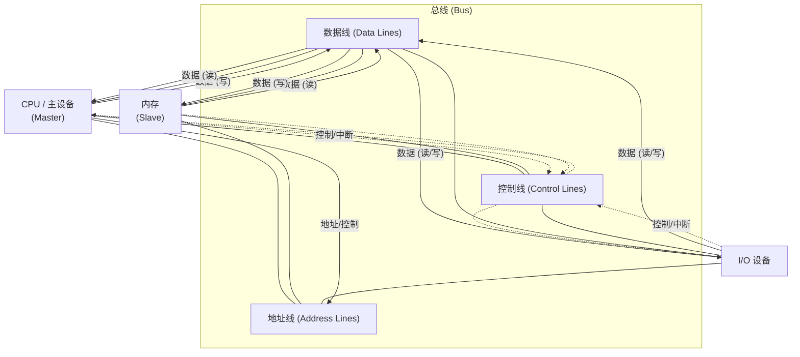
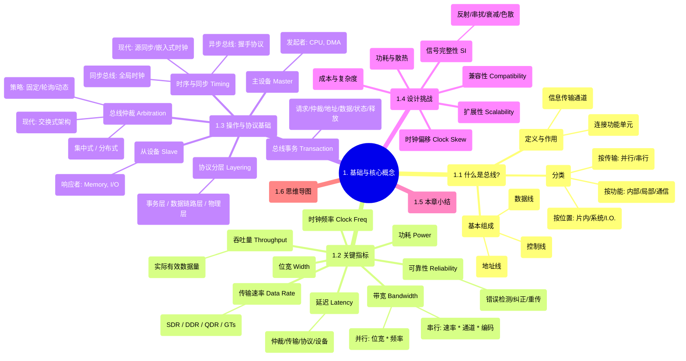

# 1. 基础与核心概念

总线（Bus）是贯穿现代计算系统各个层级的核心基础设施。无论是微观的芯片内部，还是宏观的数据中心集群，信息的流动都离不开总线的支撑。理解总线的基本原理、关键特性和设计挑战，是深入学习计算机体系结构、高性能计算以及AI硬件系统的必要前提。本章将系统介绍总线的核心概念，为后续章节对具体总线技术的深入探讨奠定基础。

## 1.1 什么是总线？

总线是连接计算机或数字系统中多个功能单元（如CPU、内存、I/O设备）并允许它们之间进行数据、地址和控制信息传输的共享通信链路。

### 1.1.1 总线的定义与作用

从本质上讲，总线是一组共享的导线（物理层面）以及一套管理这些导线使用权和信息传输的规则（协议层面）。它扮演着计算机内部的"高速公路"角色，使得不同部件能够协同工作，完成复杂的计算任务。

**主要作用:**

1.  **数据传输 (Data Transfer):** 在不同功能单元之间传递数据，如CPU从内存读取指令和数据，或将计算结果写入内存，以及与I/O设备交换信息。
2.  **地址传输 (Address Transfer):** 指定数据传输的目标位置，例如内存单元的地址或I/O设备的端口号。
3.  **控制信号传输 (Control Signal Transfer):** 协调总线操作，包括读/写命令、时钟信号、中断请求、总线仲裁信号等，确保数据传输的正确性和有序性。
4.  **连接性与扩展性 (Connectivity & Scalability):** 提供标准的接口，允许连接不同类型和数量的设备，并方便系统的升级和扩展。

### 1.1.2 总线的基本组成

一个典型的总线系统通常由以下三类信号线组成：

1.  **数据线 (Data Lines):**
    *   用于在源部件和目标部件之间双向传输数据。
    *   数据线的数量（称为**位宽 (Width)**）决定了总线一次能够传输的数据位数（例如，32位总线一次可传输32位数据）。位宽是影响总线带宽的关键因素之一。

2.  **地址线 (Address Lines):**
    *   由发起传输的部件（通常是CPU或DMA控制器）驱动，用于指定数据传输的目标内存地址或I/O端口地址。
    *   地址线的数量决定了总线能够寻址的内存空间大小或I/O端口数量。例如，N根地址线可以寻址 $2^N$ 个不同的地址单元。

3.  **控制线 (Control Lines):**
    *   用于传输控制和时序信号，管理总线的使用和协调各部件的操作。常见的控制信号包括：
        *   **读/写信号 (Read/Write Signals):** 指示当前操作是读取还是写入。
        *   **时钟信号 (Clock Signals):** （对于同步总线）提供统一的时序基准，同步总线上的所有操作。
        *   **总线请求/授权信号 (Bus Request/Grant Signals):** 用于总线仲裁，决定哪个部件可以使用总线。
        *   **中断请求/应答信号 (Interrupt Request/Acknowledge Signals):** 允许I/O设备向CPU发出中断请求。
        *   **状态信号 (Status Signals):** 如就绪（Ready）、错误（Error）等，指示设备状态或操作结果。
        *   **复位信号 (Reset Signal):** 初始化连接到总线上的所有设备。

**示意图:**

### 1.1.3 总线的分类

总线可以根据其位置、数据传输方式、连接范围等多个维度进行分类：

1.  **按位置划分:**
    *   **片内总线 (On-Chip Bus):** 位于集成电路芯片内部，连接芯片内的各个功能模块（如CPU内核、缓存、内存控制器、外设接口等）。例如ARM AMBA系列总线（AHB, APB, AXI）。片内总线速度快、位宽可以很宽，设计更灵活。
    *   **系统总线 (System Bus):** 连接计算机系统主要部件（CPU、内存、I/O控制器）的总线。早期的PC主板上的ISA、EISA、VESA以及后来的PCI总线都属于系统总线范畴。
    *   **I/O总线 (I/O Bus) 或 外部总线 (External Bus):** 用于连接计算机与外部设备（如硬盘、显卡、网络接口卡、USB设备等）。通常由系统总线通过桥接器（Bridge）扩展而来。例如PCIe、USB、SATA等。

2.  **按数据传输方式划分:**
    *   **并行总线 (Parallel Bus):** 同时传输多位数据，每一位数据都需要一根独立的数据线。优点是理论传输速率高（位宽 x 时钟频率），但缺点是需要大量导线，容易产生信号串扰和时钟偏移（Clock Skew），限制了频率的提高和传输距离。经典的例子有ISA、PCI、ATA(IDE)。
    *   **串行总线 (Serial Bus):** 数据按位顺序在少量（通常是一对差分）信号线上传输。虽然一次只传一位，但可以通过极高的时钟频率和先进的信号编码技术（如NRZ, PAM4）实现远超并行总线的有效数据传输速率。优点是所需引脚少、抗干扰能力强、易于布线、支持更长距离传输。现代高性能总线几乎都是串行总线，如PCIe、USB、SATA、Ethernet、NVLink、CXL。

3.  **按功能或连接范围划分:**
    *   **内部总线 (Internal Bus):** 通常指CPU内部连接寄存器、ALU等部件的总线。
    *   **局部总线 (Local Bus):** 高速总线，直接或通过较少中间环节连接CPU，用于连接高速设备（如内存、显卡）。例如早期的VESA Local Bus和后来的AGP。
    *   **通信总线 (Communication Bus):** 用于计算机之间或计算机与远程设备通信的总线，如Ethernet、InfiniBand。

需要注意的是，这些分类不是绝对互斥的，一种总线可能同时具备多种属性。例如，PCIe既是I/O总线，也是串行总线。

## 1.2 总线的关键指标

衡量总线性能和特性的关键指标对于理解、比较和选择合适的总线技术至关重要。

### 1.2.1 带宽 (Bandwidth)

带宽是总线最重要的性能指标之一，表示总线在单位时间内能够传输的最大数据量。通常以字节/秒（B/s）、兆字节/秒（MB/s）、吉字节/秒（GB/s）或太字节/秒（TB/s）为单位。

对于并行总线，理论峰值带宽计算公式为：
$$ \text{带宽} = \text{位宽 (Bytes)} \times \text{时钟频率 (Hz)} $$
例如，一个32位（4字节）、运行在33MHz的PCI总线，其理论峰值带宽为 $4 \, \text{B} \times 33 \times 10^6 \, \text{Hz} = 132 \, \text{MB/s}$。

对于串行总线，带宽计算更为复杂，需要考虑每条通道（Lane）的传输速率、通道数量以及编码效率：
$$ \text{带宽} = \text{每通道速率 (GT/s)} \times \text{通道数} \times \text{编码效率} $$
其中：
*   **每通道速率 (GT/s - GigaTransfers per second):** 表示每秒钟在线路上可以传输的比特数（或符号数），例如PCIe 3.0为8 GT/s，PCIe 5.0为32 GT/s。
*   **通道数 (Number of Lanes):** 现代串行总线通常由多条通道组成，以提高总带宽，例如PCIe x1, x4, x8, x16。
*   **编码效率 (Encoding Efficiency):** 为了保证时钟恢复和直流平衡，串行总线会采用特定的编码方案（如8b/10b, 128b/130b）。编码会引入额外的开销，降低有效数据传输比例。例如，8b/10b编码效率为80%，128b/130b编码效率约为98.5%。

**示例：** PCIe 4.0 x16 带宽计算
*   每通道速率: 16 GT/s
*   通道数: 16
*   编码: 128b/130b (效率 ≈ 128/130 ≈ 98.5%)
*   单向带宽: $16 \, \text{GT/s} \times 16 \times (128/130) \approx 251.7 \, \text{Gb/s}$
*   转换为GB/s: $251.7 \, \text{Gb/s} / 8 \, \text{bit/Byte} \approx 31.5 \, \text{GB/s}$
*   由于PCIe是全双工的（同时收发），总带宽通常指单向带宽的两倍，即约 63 GB/s。但在实际应用中，通常更关注单向带宽。

需要注意，**理论峰值带宽**是在理想条件下计算得出的最大值，实际应用中的**有效带宽 (Effective Bandwidth)** 会受到协议开销、总线争用、设备响应速度、驱动程序效率等多种因素的影响，通常低于理论峰值。

### 1.2.2 位宽 (Width)

如前所述，位宽指总线数据线的数量，决定了一次时钟周期内能够并行传输的数据位数。对于并行总线，位宽是决定带宽的核心因素。对于串行总线，虽然单条物理通道是串行的，但通过将多条通道捆绑使用（如PCIe x16有16条通道），可以实现逻辑上的"位宽"扩展，从而大幅提升总带宽。

### 1.2.3 时钟频率 (Clock Frequency)

时钟频率决定了总线操作的速度基准。对于同步总线，时钟信号协调所有的数据传输和控制操作。时钟频率越高，单位时间内可以完成的总线周期数就越多，理论数据传输速率也越高。单位通常是赫兹（Hz）、兆赫兹（MHz）或吉赫兹（GHz）。

提高时钟频率是提升并行总线带宽的直接方式，但会受到信号完整性、时钟偏移等物理限制。串行总线通过差分信号、嵌入式时钟等技术，可以在远高于并行总线的频率下可靠工作。

### 1.2.4 传输速率 (Data Rate)

传输速率指总线上每条信号线（或每对差分线）单位时间内传输的数据位数或符号数。

*   **SDR (Single Data Rate):** 在每个时钟周期的上升沿（或下降沿）传输一次数据。传输速率等于时钟频率。
*   **DDR (Double Data Rate):** 在每个时钟周期的上升沿和下降沿都传输一次数据。传输速率是时钟频率的两倍。现代内存总线（如DDR SDRAM）和一些高速I/O总线（如早期PCI-X）采用了DDR技术。
*   **QDR (Quad Data Rate):** 类似DDR，但可能利用独立的读写数据线对，在时钟的两个边沿都进行传输，实现四倍于时钟频率的数据速率。

对于串行总线，由于通常采用嵌入式时钟和特定编码，其速率通常用**GT/s (GigaTransfers per second)** 表示，指每秒传输的信号状态转换次数（符号数）。这不直接等同于有效数据比特率（Gb/s），需要考虑编码效率。

### 1.2.5 延迟 (Latency)

延迟指从发起总线请求（如读请求）到收到响应（如数据返回）所需的时间。它是衡量总线响应速度的重要指标，对于需要快速响应的应用（如缓存一致性、中断处理）尤为关键。单位通常是纳秒（ns）或微秒（μs）。

总线延迟主要由以下几部分组成：

1.  **仲裁延迟 (Arbitration Latency):** 主设备获取总线使用权所需的时间。
2.  **传输延迟 (Transmission Latency):** 信号在物理线路上传播的时间，与距离和介质有关。
3.  **协议开销延迟 (Protocol Overhead Latency):** 处理请求、地址解码、命令传输等协议本身引入的延迟。
4.  **设备响应延迟 (Device Response Latency):** 从设备（如内存、I/O设备）处理请求并准备好数据所需的时间。

降低延迟是总线设计的重要目标，尤其是在CPU与内存、CPU与高速外设（如GPU、加速器）之间的互联。现代总线如CXL（Compute Express Link）的一个关键目标就是提供低延迟的内存访问。

### 1.2.6 吞吐量 (Throughput)

吞吐量指在特定时间段内，总线成功传输的实际数据量。它反映了总线在实际工作负载下的性能，通常低于理论峰值带宽。吞吐量受到带宽、延迟、协议效率、总线争用、负载模式（大数据块传输 vs. 小数据包传输）等多种因素的综合影响。

优化吞吐量需要在提高带宽的同时，尽量减少延迟和协议开销，并采用高效的总线仲裁和流控机制。

### 1.2.7 功耗 (Power Consumption)

总线及其接口电路的功耗是系统设计中不可忽视的因素，尤其是在移动设备、高密度服务器和大型计算集群中。功耗主要来源于：

1.  **信号驱动 (Signal Driving):** 驱动信号在线路上传输所需的能量。高速、高频率、长距离传输会显著增加功耗。
2.  **收发器电路 (Transceiver Circuitry):** 包括SerDes（Serializer/Deserializer）、均衡器等复杂电路的静态和动态功耗。
3.  **终端电阻 (Termination Resistors):** 为保证信号完整性而使用的匹配电阻也会消耗一部分功率。

现代总线设计越来越注重能效比（Performance per Watt），通过采用低电压信号、动态电压频率调整（DVFS）、通道休眠（Lane Power Gating）、链路电源管理状态（Link Power Management, 如PCIe ASPM）等技术来降低功耗。

### 1.2.8 可靠性 (Reliability) 与错误处理

总线传输过程中可能因为噪声、信号失真、时序问题等原因发生数据错误。总线的可靠性指其在规定条件下无差错传输数据的能力。

为了提高可靠性，现代高速总线通常包含复杂的错误检测和纠正机制：

*   **奇偶校验 (Parity Check):** 简单错误检测机制，能检测单个比特错误。
*   **CRC (Cyclic Redundancy Check):** 更强大的错误检测机制，可以检测多位错误和突发错误。广泛应用于PCIe、Ethernet等。
*   **ECC (Error Correcting Code):** 不仅能检测错误，还能纠正一定程度的错误（如单比特纠正，双比特检测 - SECDED）。常用于内存总线和一些关键数据传输路径。
*   **重传机制 (Retry/Replay Mechanisms):** 检测到错误后，协议层会自动请求重新发送数据包（如PCIe的ACK/NAK机制和Replay Buffer）。
*   **通道冗余与降级 (Lane Redundancy and Degradation):** 对于多通道总线，如果某条通道出现永久性故障，系统可以禁用该通道并以降级模式（较少通道数）继续工作。

这些机制确保了即使在高速、复杂的环境中，数据传输也能达到极高的可靠性要求。

## 1.3 总线操作与协议基础

总线不仅仅是物理连线，更核心的是一套定义如何使用这些连线进行通信的规则——即**总线协议 (Bus Protocol)**。协议规定了设备如何获取总线控制权、如何发起和响应传输、如何处理时序、如何进行错误处理等。

### 1.3.1 总线事务 (Bus Transaction)

总线事务是总线上完成一次完整数据传输的基本操作单元。一个典型的总线事务通常涉及以下步骤：

1.  **请求总线 (Request):** 需要发起传输的设备（主设备）向总线仲裁器发出请求信号。
2.  **仲裁 (Arbitration):** 总线仲裁器根据预定策略（如优先级、轮询）决定将总线使用权授予哪个请求设备。
3.  **授予总线 (Grant):** 仲裁器向获得授权的设备发出授权信号。
4.  **地址传输 (Address Phase):** 获得总线控制权的主设备将目标地址（内存地址或I/O地址）放到地址线上，并发出相应的控制信号（如读/写命令）。
5.  **数据传输 (Data Phase):**
    *   **写操作:** 主设备将数据放到数据线上，目标设备（从设备）在合适的时机锁存数据。
    *   **读操作:** 从设备将请求的数据放到数据线上，主设备在合适的时机锁存数据。
6.  **确认/状态 (Acknowledge/Status):** 从设备通常会返回状态信号（如Ready, Acknowledge, Error）告知主设备操作是否成功完成。
7.  **释放总线 (Release):** 主设备完成事务后，撤销总线请求信号，释放总线控制权，以便其他设备可以使用。

不同的总线协议可能包含更复杂的事务类型，例如分离事务（Split Transaction，地址和数据阶段分离，允许总线用于其他事务）、突发传输（Burst Transfer，一次地址传输后连续传输多个数据块）等，以提高总线利用率。

### 1.3.2 主设备 (Master) 与 从设备 (Slave)

总线上的设备通常扮演两种角色：

*   **主设备 (Master):** 能够主动发起总线事务（请求总线、发送地址和控制信号）的设备。CPU通常是主设备。DMA（Direct Memory Access）控制器也是典型的主设备，它可以在CPU不干预的情况下，直接在内存和I/O设备之间传输数据。
*   **从设备 (Slave):** 只能响应主设备发起的总线事务（识别自己的地址、根据命令接收或发送数据）的设备。内存和大多数I/O设备（如串口、并口控制器）通常是从设备。

一个设备可能同时具备主、从能力（例如，一个智能网卡可能作为从设备接收CPU的配置命令，也可能作为主设备通过DMA将网络数据包直接写入内存）。

### 1.3.3 总线仲裁 (Bus Arbitration)

当多个主设备同时需要使用共享总线时，就需要一个机制来决定哪个设备获得总线控制权，这个过程称为**总线仲裁**。仲裁是避免冲突、保证总线有序高效运行的关键。

仲裁机制通常由一个称为**总线仲裁器 (Bus Arbiter)** 的逻辑单元实现，它可以是独立的芯片，也可以集成在CPU或芯片组中。

常见的仲裁策略包括：

1.  **固定优先级 (Fixed Priority):** 为每个主设备分配一个固定的优先级，总是将总线授予优先级最高的请求者。优点是实现简单，响应时间固定，但可能导致低优先级设备"饿死"。
2.  **轮询 (Round Robin):** 按顺序依次查询每个主设备是否有请求，授予请求者，然后从下一个设备继续轮询。优点是公平性好，不会饿死，但优先级无法体现。
3.  **动态优先级 (Dynamic Priority):** 设备的优先级可以根据等待时间、最近使用情况等动态调整，试图兼顾公平性和响应性。例如LRU（Least Recently Used）策略。

仲裁方式可分为：

#### 1.3.3.1 集中式仲裁 (Centralized Arbitration)

所有总线请求都发送给一个中央仲裁器，由它统一进行裁决并发出授权信号。
*   **优点:** 实现相对简单，易于管理和修改仲裁策略。
*   **缺点:** 仲裁器成为潜在瓶颈，其故障会导致整个总线瘫痪；布线可能较复杂（每个Master都需要连接请求和授权线到Arbiter）。
*   **常见的集中式仲裁方式:**
    *   **菊花链查询 (Daisy Chaining):** 授权信号按照设备优先级顺序串行传递。实现最简单，但对优先级低的设备不公平，且容易受单个设备故障影响。
    *   **独立请求 (Independent Request):** 每个设备有独立的请求线和授权线连接到仲裁器。速度快，灵活性高，但需要更多控制线。

#### 1.3.3.2 分布式仲裁 (Distributed Arbitration)

没有中央仲裁器，每个主设备内部都包含仲裁逻辑，它们通过共享的仲裁信号线相互协调，共同决定总线归属。
*   **优点:** 可靠性更高（没有单点故障），扩展性更好。
*   **缺点:** 仲裁逻辑更复杂，可能需要更多仲裁信号线。
*   **例子:** SCSI总线、一些早期的多处理器总线（如Futurebus+）。

现代高性能总线（如PCIe）采用了更先进的基于**交换 (Switched)** 的点对点连接架构，取代了传统的共享总线和集中/分布式仲裁。在交换式架构中，设备之间通过交换机建立临时点对点连接，可以同时进行多个传输，极大地提高了并发性和总带宽，从根本上避免了总线争用问题。但交换架构本身也需要内部的调度和流控机制。

### 1.3.4 时序与同步 (Timing and Synchronization)

总线上的所有操作都必须遵循严格的时序规定，以确保信号的稳定建立、正确采样和可靠传输。根据时序控制方式的不同，总线可分为同步总线和异步总线。

#### 1.3.4.1 同步总线 (Synchronous Bus)

*   使用一个全局的**时钟信号 (Clock)** 来同步所有总线事务。
*   所有设备都连接到该时钟线，并在时钟的特定边沿（上升沿或下降沿）进行操作（如发送地址、锁存数据）。
*   总线周期（完成一次基本操作所需时间）是时钟周期的整数倍。
*   **优点:** 设计相对简单，时序控制明确。
*   **缺点:**
    *   所有设备必须能以相同的时钟频率工作，限制了不同速度设备的混合使用。
    *   **时钟偏移 (Clock Skew):** 随着总线长度增加和频率提高，时钟信号到达不同设备的时间可能存在差异，导致同步困难，限制了总线的最大速度和长度。
    *   总线速度受最慢设备制约。
*   **例子:** 早期的系统总线（如ISA、部分PCI）、内存总线（如SDRAM）。

#### 1.3.4.2 异步总线 (Asynchronous Bus)

*   不使用全局时钟信号，而是采用**握手协议 (Handshake Protocol)** 来协调设备间的操作。
*   通过一组请求（Request/Strobe）和应答（Acknowledge/Ready）控制信号来实现设备间的时序同步。
    *   例如，主设备发出地址和读命令，然后发出一个"主同步"信号；从设备准备好数据后，发出一个"从同步"信号；主设备收到"从同步"后读取数据，然后撤销"主同步"；从设备检测到"主同步"撤销后，也撤销"从同步"。
*   **优点:**
    *   可以连接不同速度的设备，总线速度不受最慢设备限制。
    *   没有时钟偏移问题，可以支持更长的物理距离。
    *   灵活性更高。
*   **缺点:**
    *   协议相对复杂，每次传输都需要握手过程，可能引入额外延迟，理论峰值速度可能低于同频率同步总线。
*   **例子:** USB（虽然内部有位时钟，但设备间交互是异步握手的）、一些早期的I/O总线（如RS-232的部分握手线）。

现代高速串行总线（如PCIe、SATA、Ethernet）通常采用**源同步 (Source Synchronous)** 或**嵌入式时钟 (Embedded Clock)** 技术。源同步是指数据发送方同时发送一个伴随时钟（或频闪信号），接收方使用这个伴随时钟来锁存数据。嵌入式时钟则是通过特定的线路编码（如8b/10b、Manchester）将时钟信息编码到数据流本身中，接收方通过锁相环（PLL）从数据流中恢复出时钟。这些技术克服了传统同步总线的时钟偏移限制，也避免了纯异步握手的速度瓶颈。

### 1.3.5 总线协议分层 (Layered Protocol)

为了管理复杂性并实现模块化设计，现代高性能总线协议（尤其是串行总线）通常采用分层架构，类似于网络协议栈（如OSI或TCP/IP模型）。每一层负责特定的功能，并与其上下层通过明确定义的接口交互。

典型的分层结构（以PCIe为例）：

1.  **事务层 (Transaction Layer):**
    *   最高层，负责创建和解释事务层数据包（TLP - Transaction Layer Packet）。
    *   处理读/写请求、消息、地址路由、流控、服务质量（QoS）、事务排序等。
    *   与软件层（驱动程序）直接交互。

2.  **数据链路层 (Data Link Layer):**
    *   位于事务层和物理层之间，负责保证事务层数据包在链路上的可靠传输。
    *   添加序列号和CRC校验码到TLP，形成数据链路层数据包（DLLP - Data Link Layer Packet）。
    *   实现错误检测（基于CRC）和重传机制（基于ACK/NAK确认和Replay Buffer）。
    *   进行链路电源管理。

3.  **物理层 (Physical Layer):**
    *   最底层，负责实际的比特流在物理介质上的发送和接收。
    *   包括逻辑子层和电气子层。
        *   **逻辑子层:** 负责数据编码/解码（如8b/10b, 128b/130b）、加扰/解扰（Scrambling/Descrambling）、通道绑定/解绑定（Lane Bonding/Debonding）、链路训练和初始化。
        *   **电气子层:** 定义电气特性（电压、电流、差分信号）、连接器和线缆规范、收发器（SerDes）设计、信号均衡（Equalization）等。

这种分层结构使得各层可以独立演进（例如，物理层升级到更高速度，而上层协议保持兼容），简化了设计、验证和调试过程。

## 1.4 总线的设计挑战

设计高性能、高可靠性的总线系统面临诸多挑战，尤其是在速度、带宽和密度不断提升的今天。

### 1.4.1 信号完整性 (Signal Integrity - SI)

随着总线频率的提高和信号边沿越来越陡峭，保持信号在传输过程中的质量变得极其困难。信号完整性问题主要包括：

*   **反射 (Reflection):** 阻抗不匹配导致信号在传输路径的不连续点（如连接器、过孔、线宽变化处）发生反射，与原始信号叠加产生振铃和过冲/下冲。
*   **串扰 (Crosstalk):** 相邻信号线之间的电磁耦合，导致一条线上的信号变化干扰到另一条线，影响信号质量，尤其是在高密度并行总线或紧密布线的差分对中。
*   **衰减 (Attenuation):** 信号能量在传输过程中因导体电阻和介质损耗而逐渐减弱，导致信号幅度降低。
*   **色散 (Dispersion):** 信号的不同频率分量在介质中传播速度不同，导致信号波形失真，特别是对于宽带信号。
*   **地弹 (Ground Bounce) 与 电源噪声 (Power Noise):** 大量信号同时切换时，引起地平面和电源平面电压波动，影响信号参考电平的稳定性。

解决SI问题需要综合运用多种技术，包括阻抗控制、端接匹配、差分信号、信号均衡（预加重、去加重、判决反馈均衡）、优化的PCB材料和叠层设计、电源/地平面设计、连接器选型等。SI分析和仿真是高速总线设计不可或缺的一环。

### 1.4.2 时钟偏移 (Clock Skew)

在同步总线或源同步总线中，时钟信号（或伴随时钟）到达不同接收点或不同数据线之间的时间差称为时钟偏移。如果偏移过大，可能导致接收端在错误的时间采样数据，造成传输错误。

时钟偏移主要由以下因素引起：

*   时钟驱动器的延迟差异。
*   时钟布线长度和负载的差异。
*   芯片内部或PCB上的工艺、电压、温度（PVT）变化。

控制时钟偏移需要精心的时钟树设计、等长布线、使用低偏移时钟缓冲器等。嵌入式时钟技术从根本上消除了对独立时钟分配网络的需求，是克服时钟偏移挑战的关键技术。

### 1.4.3 功耗与散热

如前所述，高速总线是系统功耗的重要来源。设计挑战在于如何在提升性能的同时，将功耗控制在可接受范围内，并有效解决散热问题。低功耗设计技术（如电压调节、电源门控、链路状态管理）和先进的散热方案（如散热片、风扇、液冷）对于现代总线系统至关重要。能效比（性能/瓦特）已成为衡量总线技术先进性的重要指标。

### 1.4.4 扩展性与兼容性 (Scalability & Compatibility)

总线设计需要考虑未来的扩展需求。理想的总线应该能够：

*   支持连接不同数量和类型的设备。
*   方便地增加带宽（例如，通过增加通道数或提升单通道速率）。
*   保持向后兼容性，允许新旧设备在同一总线上共存或平滑过渡。

PCIe在扩展性和兼容性方面做得非常出色，其x1, x4, x8, x16的通道扩展机制以及各代协议之间的兼容性设计是其成功的关键因素。

### 1.4.5 成本与复杂度

高性能总线通常涉及复杂的物理层（高速SerDes、均衡电路）、复杂的协议层（错误处理、流控、电源管理）和严格的设计、制造、测试要求，这带来了显著的成本和设计复杂度。设计者需要在性能、功耗、可靠性、成本和上市时间之间做出权衡。标准化和生态系统的成熟度对于降低成本和复杂度至关重要。

## 1.5 本章小结

本章系统地介绍了总线技术的基础知识。我们首先明确了总线的定义及其在计算系统中的核心作用——连接功能单元并传输信息。总线由数据线、地址线和控制线构成，并可根据位置、传输方式等进行分类，其中并行与串行的区别是理解总线演进的关键。

接着，我们详细探讨了衡量总线性能的关键指标，包括带宽、位宽、时钟频率、传输速率（SDR/DDR/GTs）、延迟、吞吐量、功耗和可靠性。理解这些指标及其计算方式对于评估和比较不同总线技术至关重要。带宽是核心性能指标，但延迟和功耗同样关键，而可靠性则是通过错误检测与纠正机制来保障的。

随后，我们深入了解了总线操作的基本流程——总线事务，以及其中涉及的主从设备概念和总线仲裁机制（集中式 vs 分布式）。时序控制是总线协议的核心，我们区分了同步总线和异步总线，并介绍了现代高速总线采用的源同步和嵌入式时钟技术。最后，我们认识到现代复杂总线协议通常采用分层架构（如事务层、数据链路层、物理层），以简化设计和实现模块化。

最后，本章概述了总线设计面临的主要挑战，包括信号完整性、时钟偏移、功耗与散热、扩展性与兼容性以及成本与复杂度。这些挑战驱动着总线技术的不断创新。

掌握这些基础概念是理解后续章节中具体总线技术（如PCIe、CXL、NVLink等）的关键。下一章我们将回顾总线技术的历史演进，了解它们是如何从简单的并行总线发展到今天复杂的高速串行互联的。

## 1.6 本章思维导图

</rewritten_file>