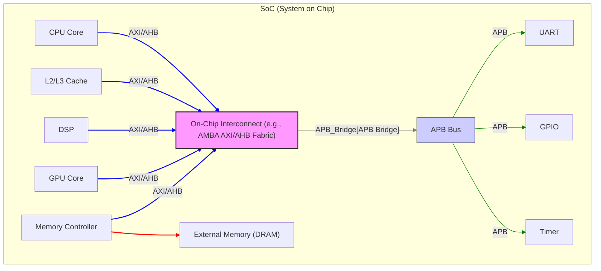
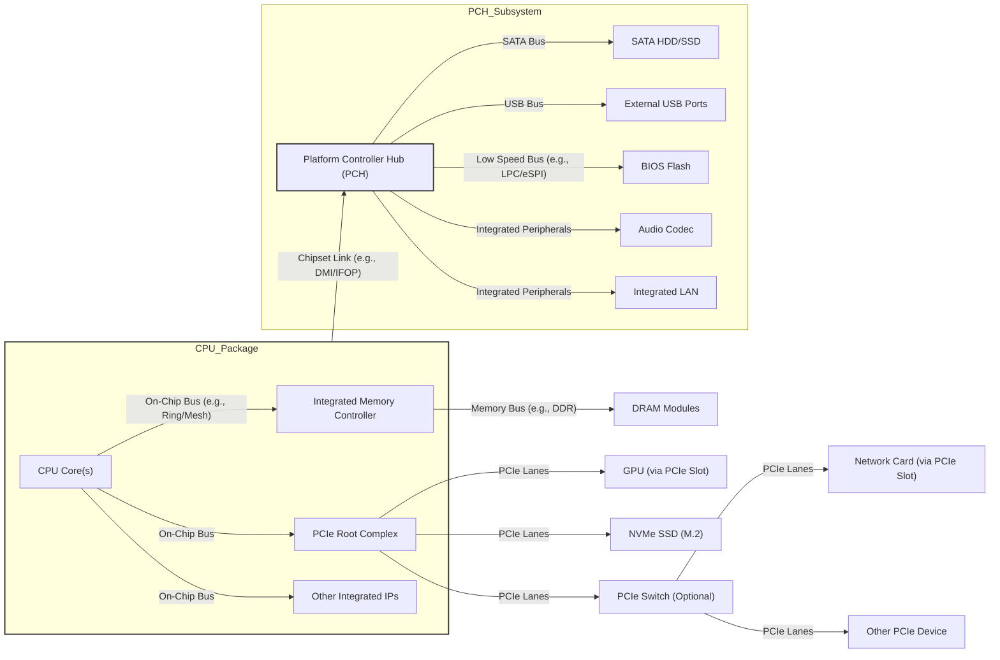
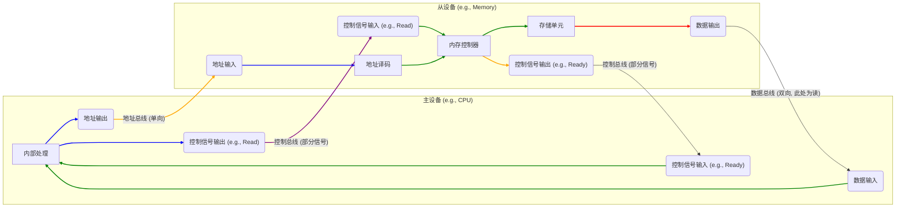
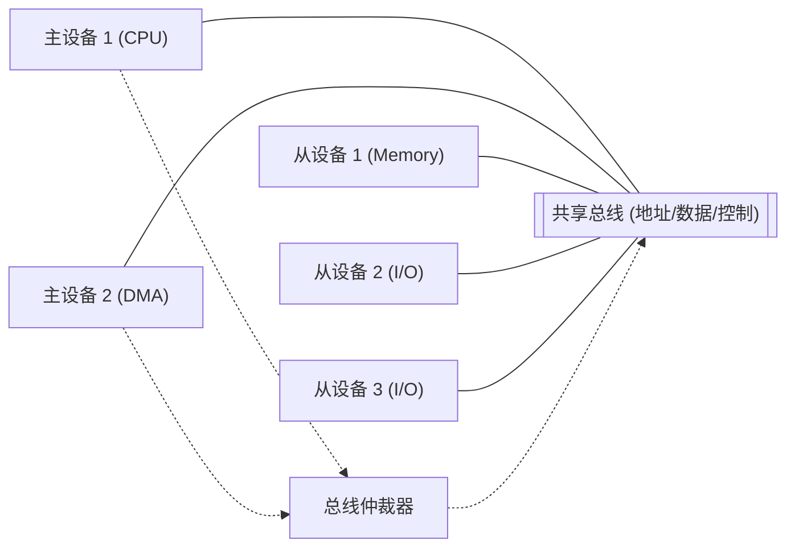
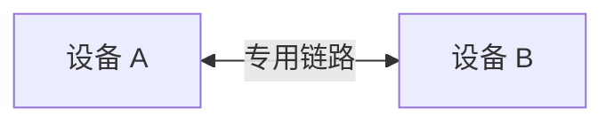
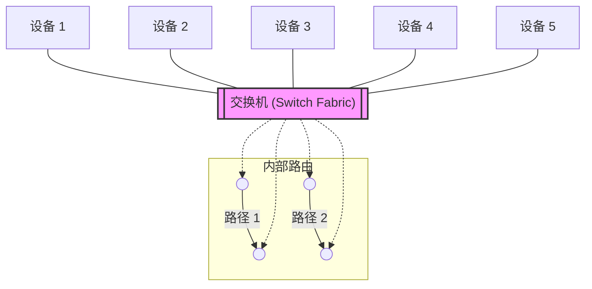
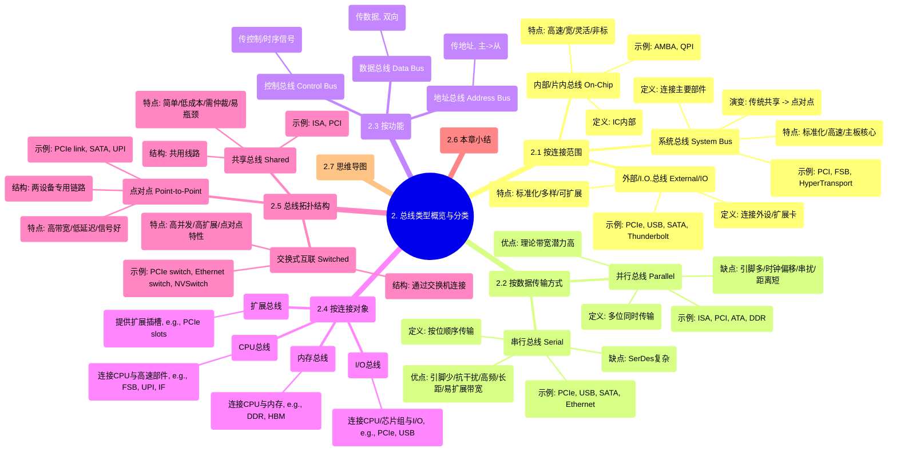

# 2. 总线类型概览与分类

在第一章中，我们已经了解了总线的基本定义、组成、关键指标和操作原理。然而，总线并非单一形态，为了适应不同的应用场景、性能需求和成本约束，总线技术演化出了多种多样的类型。对总线进行合理的分类，有助于我们更清晰地理解不同总线技术的特点和适用范围。

本章将从不同的维度对总线进行分类，包括连接范围、数据传输方式、功能以及连接对象，并介绍常见的总线拓扑结构。

## 2.1 按连接范围分类

根据总线在计算机系统中所处的位置以及连接的部件范围，可以将其分为内部总线、系统总线和外部总线。

### 2.1.1 内部总线 (Internal Bus) / 片内总线 (On-Chip Bus)

*   **定义:** 位于单个集成电路（IC）芯片内部，用于连接芯片内的各个功能单元的总线。
*   **连接对象:** CPU内核、缓存（L1, L2, L3）、寄存器堆、内存控制器、I/O控制器、DSP单元、GPU内核（在SoC中）等。
*   **特点:**
    *   **高速度、高带宽:** 由于传输距离极短（微米或毫米级），信号延迟小，可以运行在非常高的频率下（通常与芯片主频同步或有一定分频关系）。
    *   **宽位宽:** 芯片内部布线资源相对丰富，可以设计非常宽的数据位宽（如64位、128位、256位甚至更宽），以实现极高的数据吞吐量。
    *   **低功耗:** 短距离传输所需驱动功率较低。
    *   **设计灵活性:** 不受外部标准化接口的严格限制，可以根据芯片架构需求进行定制化设计。
    *   **非标准化:** 通常是芯片设计厂商专有的，不同厂商或不同系列的芯片内部总线可能完全不同。
*   **示例:**
    *   **ARM AMBA (Advanced Microcontroller Bus Architecture):** 广泛应用于ARM架构SoC的标准片内总线协议族。
        *   **AHB (AMBA High-performance Bus):** 用于连接高性能模块，如CPU核、DMA控制器、片上内存。
        *   **AXI (AMBA Extensible Interface):** 最新一代高性能总线，支持多主多从、分离事务、乱序传输等，提供更高带宽和并发性。
        *   **APB (AMBA Peripheral Bus):** 用于连接低速外设，如UART、GPIO、定时器，结构简单，功耗低。
    *   **Intel QPI/UPI (Quick Path Interconnect / Ultra Path Interconnect):** 虽然主要用于CPU间互联，但其片内部分也可视为内部总线。
    *   **IBM CoreConnect:** PowerPC架构中使用的片内总线标准。
    *   **Wishbone:** 一种开放源代码的片内总线规范。

*图：典型的SoC内部总线结构示意图*

### 2.1.2 系统总线 (System Bus)

*   **定义:** 连接计算机系统主要功能部件（如CPU、内存、芯片组/南桥/北桥、I/O控制器）的总线。它是计算机主板上的核心通信干线。
*   **连接对象:** CPU、内存（通过内存控制器）、芯片组（南桥/北桥，或现代的PCH）、高速I/O控制器（如PCIe控制器）。
*   **特点:**
    *   **标准化:** 通常遵循公开的标准，以确保不同厂商的部件可以互操作。
    *   **速度与带宽要求高:** 需要满足CPU访问内存和高速外设的需求。
    *   **相对片内总线较长:** 传输距离比片内总线长（厘米级），信号完整性和时钟同步面临更大挑战。
    *   **作为扩展基础:** 其他I/O总线通常通过桥接芯片连接到系统总线。
*   **演变:**
    *   **早期:** PC上的ISA、EISA、VESA、MCA等总线扮演了系统总线的角色，CPU、内存、扩展槽都直接或间接挂载其上。
    *   **PCI时代:** PCI总线成为主流系统总线，通过北桥芯片连接CPU和内存，通过南桥芯片连接低速外设。
    *   **现代架构:** 随着技术发展，系统总线的概念逐渐演变。内存控制器和高速I/O控制器（如PCIe Root Complex）被集成到CPU内部，CPU通过高速点对点接口（如Intel DMI/OPI、AMD IFOP）与芯片组（PCH）连接，而CPU与内存之间则通过专用的高速内存总线（如DDR）连接。严格意义上的"共享系统总线"在现代主流PC和服务器架构中已不多见，被更高效的点对点或交换式互联取代。
*   **示例:**
    *   **PCI (Peripheral Component Interconnect):** 一度是最重要的系统总线和I/O总线。
    *   **FSB (Front Side Bus):** 早期Intel架构中连接CPU与北桥芯片的总线，承载CPU与内存、I/O的数据交换。
    *   **HyperTransport:** AMD早期用于连接CPU、北桥、南桥的总线技术。

### 2.1.3 外部总线 (External Bus) / I/O 总线 (I/O Bus)

*   **定义:** 用于连接计算机主系统与外部设备或扩展卡的总线。
*   **连接对象:** 显卡、声卡、网卡、硬盘、SSD、USB设备、打印机、扫描仪等各种外部设备和扩展卡。
*   **特点:**
    *   **标准化:** 必须遵循严格的公开标准，以实现设备的即插即用和广泛兼容性。
    *   **多样性:** 存在多种不同的外部总线，以满足不同设备的速率、功耗和连接需求（如高速、低速、存储、图形等）。
    *   **可扩展性:** 通常设计为易于添加或移除设备。
    *   **速度范围广:** 从低速（如I2C, SPI用于简单传感器）到中速（如USB 2.0）再到极高速（如PCIe, Thunderbolt）。
    *   **通过桥接连接:** 通常通过芯片组（南桥/PCH）或专用的I/O控制器连接到系统内部。
*   **示例:**
    *   **PCI Express (PCIe):** 当前主流的高速串行I/O总线，用于连接显卡、NVMe SSD、高速网卡、Thunderbolt控制器等。
    *   **USB (Universal Serial Bus):** 最广泛使用的外部串行总线，用于连接各种外设。
    *   **SATA (Serial ATA):** 主要用于连接硬盘驱动器（HDD）和固态驱动器（SSD）。
    *   **Thunderbolt:** 基于PCIe和DisplayPort的高速外部接口，常用于连接显示器、外部存储、扩展坞等。
    *   **ISA, EISA, PCI:** （早期）既可作为系统总线，也可作为连接扩展卡的I/O总线。
    *   **SCSI (Small Computer System Interface):** 主要用于服务器和高端工作站的存储设备连接。
    *   **I2C (Inter-Integrated Circuit), SPI (Serial Peripheral Interface):** 低速串行总线，常用于主板上连接传感器、EEPROM、时钟芯片等低速设备，也可视为片上系统的一种外部总线。

**关系示意图 (简化):**

*图：现代计算机系统中不同总线的简化连接关系 (以Intel/AMD平台为例)*

## 2.2 按数据传输方式分类

这是总线最基本也是最重要的分类方式之一，直接关系到总线的性能、成本和物理实现。

### 2.2.1 并行总线 (Parallel Bus)

*   **定义:** 多位数据（通常是8位、16位、32位或64位）在同一时刻通过多条并行的物理数据线进行传输。
*   **原理:** 需要一组数据线（Data Lines）、一组地址线（Address Lines，如果需要寻址）和一组控制线（Control Lines）。在同步并行总线中，还需要一条时钟线。数据在时钟信号的驱动下，在多个数据线同时传输。
*   **优点:**
    *   **理论带宽潜力高:** 在相同的时钟频率下，带宽直接随位宽增加而增加 (带宽 = 位宽 × 频率)。
    *   **逻辑简单:** 相对于复杂的串行收发器（SerDes），并行接口的逻辑实现相对简单。
*   **缺点:**
    *   **引脚数量多:** 需要大量的物理引脚（数据线+地址线+控制线），增加了芯片封装成本和PCB布线复杂度。
    *   **时钟偏移 (Clock Skew):** 随着频率提高和线长增加，时钟信号到达不同数据线的时间不一致性（偏移）会变得严重，限制了最高工作频率。所有数据位必须在时钟边沿稳定，偏移使得这个窗口变窄。
    *   **信号串扰 (Crosstalk):** 并行靠得很近的信号线之间容易发生电磁干扰，影响信号质量。
    *   **信号完整性 (SI) 挑战大:** 高频时，反射、衰减等问题更突出。
    *   **传输距离受限:** 上述问题导致并行总线难以实现高速长距离传输。
    *   **功耗较高:** 驱动大量并行信号线需要较大功率。
*   **示例:** ISA, EISA, VESA Local Bus, PCI, AGP, ATA (IDE), SCSI (并行版本), IEEE-488 (GPIB), 传统DRAM接口 (SDRAM, DDR SDRAM - 虽然内部串行化程度提高，但外部接口仍是并行)。

### 2.2.2 串行总线 (Serial Bus)

*   **定义:** 数据按比特（bit）顺序在一条或少数几条（通常是一对差分信号线）上传输。
*   **原理:** 发送端将并行数据通过**串化器 (Serializer)** 转换成串行比特流，接收端通过**解串器 (Deserializer)** 将串行比特流恢复成并行数据。这一过程通常由**SerDes (Serializer/Deserializer)** 电路完成。为了能在高速下可靠传输，通常采用**差分信号 (Differential Signaling)** （一对信号线传输极性相反的信号，抗共模干扰能力强）和**嵌入式时钟 (Embedded Clock)** 技术（通过8b/10b, 128b/130b等编码方式将时钟信息编码到数据流中，接收端通过CDR电路恢复时钟）。
*   **优点:**
    *   **引脚数量少:** 大大减少了芯片引脚和连接器尺寸，降低了封装和PCB成本，简化了布线。
    *   **抗干扰能力强:** 差分信号能有效抵抗噪声干扰。
    *   **无时钟偏移问题:** 采用嵌入式时钟或源同步时钟，克服了并行总线的时钟偏移瓶颈。
    *   **更高时钟频率:** 由于上述优点，串行总线可以达到远高于并行总线的时钟频率和传输速率。
    *   **支持更长距离传输:** 信号质量更好，可以传输更远距离。
    *   **易于实现高带宽:** 虽然单线速率可能有限，但可以通过**通道捆绑 (Lane Bundling)**，即将多条串行通道并行使用，以线性增加总带宽（如PCIe x1, x4, x8, x16）。
    *   **功耗管理更灵活:** 可以对单个通道进行电源管理。
*   **缺点:**
    *   **复杂的收发器 (SerDes):** 需要高速、精密的SerDes电路，增加了芯片设计的复杂度和成本（但规模效应下成本可控）。
    *   **协议开销:** 编码（如8b/10b）会引入一定的带宽开销。
    *   **延迟可能稍高:** 串并转换和协议处理可能引入微小的额外延迟（但在高速下通常可忽略）。
*   **示例:** PCIe, USB, SATA, SAS (Serial Attached SCSI), Ethernet (物理层), HDMI, DisplayPort, MIPI, Fibre Channel, InfiniBand, NVLink, CXL, RapidIO。

**对比总结:**

| 特性         | 并行总线 (Parallel Bus)         | 串行总线 (Serial Bus)             |
| ------------ | ----------------------------- | ------------------------------- |
| **数据传输** | 多位同时传输 (e.g., 32-bit)    | 按位顺序传输 (1-bit per lane)     |
| **引脚/线数** | 多 (数据+地址+控制+时钟)     | 少 (通常1-2对差分线 per lane)   |
| **时钟同步** | 全局时钟，易受偏移影响        | 嵌入式/源同步时钟，无偏移问题    |
| **频率限制** | 较低 (受时钟偏移/串扰限制)    | 非常高                          |
| **抗干扰性** | 较差                          | 强 (差分信号)                   |
| **传输距离** | 短                            | 长                              |
| **带宽扩展** | 增加位宽/频率 (受限)          | 增加通道数/单通道速率 (灵活)   |
| **成本/复杂度**| PCB复杂，芯片接口简单        | PCB简单，芯片接口(SerDes)复杂   |
| **功耗**     | 相对较高                      | 可更灵活管理，高速下仍需关注     |
| **主要应用** | 早期系统/I.O., 内存接口      | 现代高速I/O, 网络, 内部互联等    |

## 2.3 按功能分类

从逻辑功能的角度，总线上传输的信号线可以分为三类。这种分类方式在第一章1.1.2节已经介绍过，这里再次强调并略作补充。

### 2.3.1 数据总线 (Data Bus)

*   **功能:** 传输实际的数据信息。
*   **方向:** 通常是双向的，主设备可以向从设备写入数据，也可以从从设备读取数据。
*   **位宽:** 数据总线的位数（宽度）是决定总线带宽的关键因素之一。例如，32位数据总线一次可以传输4个字节。

### 2.3.2 地址总线 (Address Bus)

*   **功能:** 指定数据传输的目标位置。当主设备要与某个从设备通信时，它会将该从设备的唯一地址（内存地址或I/O端口地址）放到地址总线上。
*   **方向:** 通常是单向的，由主设备驱动，所有从设备监听地址总线，看是否是自己的地址。
*   **寻址能力:** 地址总线的位数决定了总线能够寻址的最大范围。N位地址线可以寻址 $2^N$ 个不同的单元。

### 2.3.3 控制总线 (Control Bus)

*   **功能:** 传输控制信号和时序信号，管理总线操作，协调主从设备之间的通信。
*   **组成:** 包含多种不同功能的信号线，例如：
    *   **时钟信号 (Clock):** (同步总线) 提供时序基准。
    *   **读/写命令 (Read/Write):** 指示是读操作还是写操作。
    *   **总线请求/授权 (Bus Request/Grant):** 用于总线仲裁。
    *   **传输确认/就绪 (Acknowledge/Ready):** (异步总线) 从设备反馈操作状态。
    *   **中断请求/应答 (Interrupt Request/Acknowledge):** I/O设备请求CPU服务。
    *   **复位 (Reset):** 初始化总线上的设备。
    *   **错误信号 (Error):** 指示传输中发生错误。
    *   **总线锁定 (Bus Lock):** (多主系统) 独占总线以完成原子操作。
*   **方向:** 控制线根据其具体功能，可能是单向（如时钟、复位）或双向（如中断请求/应答）。

*图：数据、地址、控制总线协作示意图 (以CPU读内存为例)*

**注意:** 在物理实现上，尤其是在现代串行总线中，这三类"总线"的功能可能通过在同一物理通道上传输不同类型的数据包（Packet）来实现，而不是完全独立的物理线路。例如，PCIe的TLP（事务层数据包）中就包含了地址、数据（对于写操作）以及命令（控制信息）。但从逻辑概念上区分这三种功能对于理解总线工作原理仍然十分重要。

## 2.4 按连接对象分类

根据总线主要连接的设备类型，也可以进行分类，这有助于理解特定总线的设计目标。

### 2.4.1 CPU总线 (CPU Bus)

*   **定义:** 直接与CPU连接，用于CPU与系统其他高速部件（如缓存、内存控制器、芯片组）通信的总线。
*   **特点:** 速度极快，通常与CPU频率相关，延迟极低。其性能直接影响整个系统的性能。
*   **示例:**
    *   **FSB (Front Side Bus):** 连接CPU与北桥。
    *   **Intel QPI/UPI:** 连接CPU与CPU（多插槽系统）或CPU与芯片组。
    *   **AMD HyperTransport / Infinity Fabric:** 连接CPU与CPU、CPU与芯片组、以及CPU内部不同模块（如IODie与CCD）。
    *   CPU内部连接各核心、缓存的总线（如Ring Bus, Mesh）。

### 2.4.2 内存总线 (Memory Bus)

*   **定义:** 专门用于CPU（或内存控制器）与主内存（DRAM）之间进行数据交换的总线。
*   **特点:** 带宽要求极高，延迟要求极低。通常是同步并行总线（如DDR系列），位宽较宽（如64位 per channel）。
*   **示例:**
    *   **DDR SDRAM 总线 (DDR, DDR2, DDR3, DDR4, DDR5):** 主流内存总线标准。
    *   **HBM (High Bandwidth Memory) 接口:** 用于连接CPU/GPU与HBM堆栈，位宽极宽（如1024位），基于硅中介层短距离连接。
    *   **GDDR (Graphics DDR) 总线:** 专门为显卡优化的高速内存总线。

### 2.4.3 I/O 总线 (I/O Bus)

*   **定义:** 用于连接CPU（通常通过芯片组或I/O控制器）与各种I/O设备（包括外设和扩展卡）的总线。这个概念与2.1.3节的"外部总线"高度重合。
*   **特点:** 类型多样，速度范围广，注重标准化和兼容性。
*   **示例:** PCIe, USB, SATA, SAS, Thunderbolt, I2C, SPI。

### 2.4.4 扩展总线 (Expansion Bus)

*   **定义:** 提供标准插槽（Expansion Slot），允许用户插入扩展卡（Expansion Card）以增加系统功能的总线。扩展总线通常就是一种I/O总线。
*   **特点:** 目的是提供灵活性和可扩展性。
*   **示例:** ISA 插槽总线, EISA 插槽总线, PCI 插槽总线, AGP 插槽总线, PCIe 插槽总线。

## 2.5 总线拓扑结构 (Bus Topology)

总线拓扑结构描述了总线上的设备是如何物理或逻辑连接的。

### 2.5.1 共享总线 (Shared Bus)

*   **结构:** 所有设备（主设备和从设备）都连接到同一组共享的物理线路上。
*   **特点:**
    *   结构简单，成本低。
    *   同一时间只能有一个主设备控制总线进行一次传输，存在**总线争用 (Bus Contention)** 问题。
    *   需要**总线仲裁 (Bus Arbitration)** 机制来管理总线访问权。
    *   总线带宽被所有连接设备共享，容易成为性能瓶颈。
    *   总线长度和连接设备数量受电气负载限制。
*   **示例:** ISA, EISA, PCI (传统共享版本), SCSI (并行)。

*图：共享总线拓扑结构*

### 2.5.2 点对点 (Point-to-Point)

*   **结构:** 两个设备之间有专用的直接连接链路，不与其他设备共享。
*   **特点:**
    *   **高带宽:** 带宽专用于连接的两个设备，不受其他设备影响。
    *   **低延迟:** 直接连接，无需仲裁。
    *   **信号质量好:** 电气负载小，易于实现高速传输。
    *   **连接性受限:** 一个端口只能连接一个设备。构建多设备系统需要设备具备多个点对点接口或使用交换设备。
*   **示例:** PCIe (基本链路), NVLink, Intel UPI/QPI, AMD Infinity Fabric, SATA, USB (Host与Device之间), Ethernet (现代交换式网络中端口与设备/交换机之间)。

*图：点对点连接*

### 2.5.3 交换式互联 (Switched Interconnect)

*   **结构:** 设备不直接共享总线，而是连接到一个**交换机 (Switch)** 或**交换结构 (Fabric)**。交换机内部包含智能路由逻辑，可以在任意两个（或多对）连接的设备之间动态建立临时的点对点连接路径。
*   **特点:**
    *   **高并发性:** 允许多对设备同时进行通信，总带宽远超共享总线。
    *   **高可扩展性:** 可以通过增加交换机端口或级联交换机来扩展系统规模。
    *   **点对点特性:** 每个连接到交换机的链路本质上是点对点的，继承了点对点连接的优点（高带宽、信号好）。
    *   **无需全局仲裁:** 交换机内部处理路径建立和冲突（如果有）。
    *   **复杂度较高:** 交换机本身是复杂的设备，需要内部缓冲、路由表和调度逻辑。
*   **示例:** PCIe (通过Switch扩展), Ethernet (交换式局域网), InfiniBand, NVSwitch, CXL (支持Switch)。

*图：交换式互联拓扑结构 (允许多对设备同时通信)*

现代高性能系统（如服务器、数据中心、AI集群）普遍采用点对点和交换式互联拓扑，以克服共享总线的性能瓶颈。

## 2.6 本章小结

本章我们从多个维度对总线进行了分类，以更全面地认识其多样性：

1.  **按连接范围:**
    *   **内部/片内总线:** 芯片内部，高速、宽位宽、非标。
    *   **系统总线:** 连接系统主要部件（CPU、内存、芯片组），标准化，（传统概念，现代被点对点取代）。
    *   **外部/I.O.总线:** 连接外设和扩展卡，标准化，类型多样，速度范围广。
2.  **按数据传输方式:**
    *   **并行总线:** 多位并行传输，引脚多，受时钟偏移/串扰限制频率，适用于短距、内存等。
    *   **串行总线:** 按位传输，引脚少，抗干扰强，频率高，可通过通道捆绑扩展带宽，现代高速总线主流。
3.  **按功能:**
    *   **数据总线:** 传数据，双向。
    *   **地址总线:** 传地址，单向（主->从）。
    *   **控制总线:** 传控制/时序信号，管理操作。
4.  **按连接对象:**
    *   **CPU总线:** 连接CPU与高速部件。
    *   **内存总线:** 连接CPU/内存控制器与DRAM。
    *   **I/O总线:** 连接CPU/芯片组与I/O设备。
    *   **扩展总线:** 提供扩展插槽的I/O总线。
5.  **按拓扑结构:**
    *   **共享总线:** 所有设备共享线路，需仲裁，易瓶颈。
    *   **点对点:** 两设备专用链路，高带宽，低延迟。
    *   **交换式互联:** 通过交换机连接，高并发，高扩展性。

理解这些分类有助于在后续章节中更好地把握各种具体总线技术（如PCIe、DDR、USB、CXL）的设计背景、特点和应用场景。下一章我们将探讨总线设计中普遍面临的核心挑战。

## 2.7 本章思维导图

