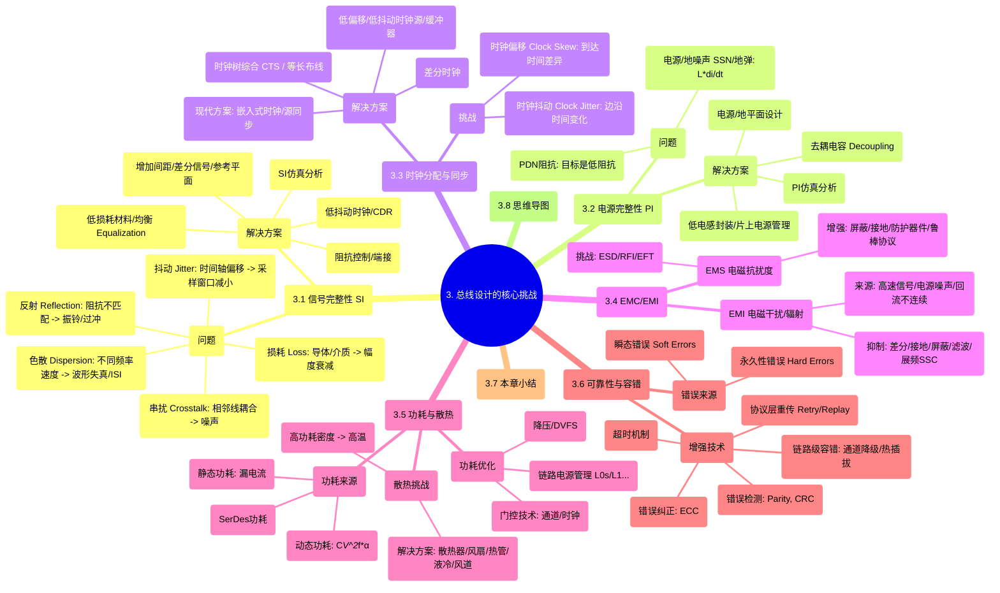

# 3. 总线设计的核心挑战

在前面的章节中，我们了解了总线的类型和基本工作原理。然而，将这些概念转化为实际的高性能、高可靠性总线系统，工程师们需要克服一系列严峻的技术挑战。尤其是在追求更高速度、更大带宽、更低功耗和更高密度的现代计算系统中，这些挑战变得尤为突出。

本章将深入探讨总线设计中普遍存在的几个核心挑战，包括信号完整性（SI）、电源完整性（PI）、时钟分配与同步、电磁兼容性（EMC/EMI）、功耗与散热，以及可靠性与容错。

## 3.1 信号完整性 (Signal Integrity - SI)

信号完整性可以说是高速总线设计中最核心、最具挑战性的问题。它关注的是信号在传输路径上保持其质量和时序的能力，确保接收端能够准确无误地识别信号的逻辑状态（0或1）。随着总线速度的不断提升（达到GHz甚至数十GHz级别），信号波形的微小失真都可能导致传输错误。

SI问题主要源于高速信号与传输介质（PCB走线、连接器、线缆、芯片封装等）之间的相互作用。

### 3.1.1 SI面临的主要问题

1.  **反射 (Reflection):**
    *   **原因:** 信号在传输路径中遇到阻抗不连续（Impedance Mismatch）时发生。阻抗不连续点可能出现在驱动器输出端、接收器输入端、PCB走线拐角、过孔（Via）、连接器、线宽变化处等。
    *   **现象:** 部分信号能量被反射回源端，与原始信号叠加，导致信号波形出现**振铃 (Ringing)**、**过冲 (Overshoot)** 和**下冲 (Undershoot)**。
    *   **影响:** 过冲可能超过接收器的最大输入电压，损坏器件；下冲可能低于逻辑阈值，导致误判；振铃则延长了信号稳定所需的时间，限制了最高传输速率，并可能在错误的时间点跨越逻辑阈值。
    *   **解决方案:**
        *   **阻抗控制 (Impedance Control):** 精确设计PCB走线宽度、介质厚度、参考平面距离，使传输线特性阻抗（通常为50欧姆单端或100欧姆差分）与驱动器输出阻抗、接收器输入阻抗匹配。
        *   **端接 (Termination):** 在传输线末端（有时在源端）添加匹配电阻（端接电阻），吸收到达的信号能量，减少反射。常见的端接方式有并联端接、戴维南端接、串联端接等。
        *   **优化布线:** 避免直角拐弯（使用45度角或圆弧），优化过孔设计减少阻抗突变。

2.  **串扰 (Crosstalk):**
    *   **原因:** 相邻信号线之间通过电场（容性耦合）和磁场（感性耦合）相互干扰。
    *   **现象:** 一条线（攻击线 Aggressor）上的信号跳变会在另一条线（受害线 Victim）上感应出噪声电压。
    *   **分类:**
        *   **近端串扰 (Near-End Crosstalk - NEXT):** 噪声出现在受害线的驱动端。
        *   **远端串扰 (Far-End Crosstalk - FEXT):** 噪声出现在受害线的接收端。
    *   **影响:** 串扰噪声叠加在正常信号上，可能导致信号幅度降低、边沿变缓、甚至逻辑错误。在并行总线和高密度布线中尤为严重。
    *   **解决方案:**
        *   **增加线间距:** 最直接有效的方法，但会降低布线密度。
        *   **使用差分信号:** 差分对本身对共模噪声有抑制作用，且其耦合产生的噪声极性相反，可以部分抵消。
        *   **参考平面控制:** 保证信号线下方有连续的参考平面（地或电源），提供最短的回流路径，减少耦合环路面积。
        *   **优化布线层叠:** 将敏感信号线与攻击信号线布置在不同层，或用地线/电源线进行隔离。
        *   **保护线 (Guard Trace):** 在信号线之间插入接地的走线。

3.  **损耗 (Loss):**
    *   **原因:** 信号能量在传输过程中因物理介质而损失。
    *   **分类:**
        *   **导体损耗 (Conductor Loss):** 由导线的电阻引起，与频率的平方根成正比（趋肤效应 Skin Effect - 高频电流集中在导体表面）。
        *   **介质损耗 (Dielectric Loss):** 由PCB板材（如FR-4）的绝缘介质吸收电磁能量引起，与频率和介质的损耗因子（Loss Tangent, tanδ）成正比。在高频时，介质损耗通常占主导地位。
    *   **现象:** 信号幅度随传输距离增加而衰减。
    *   **影响:** 信号幅度过低，接收端难以识别，信噪比下降。
    *   **解决方案:**
        *   **选用低损耗PCB材料:** 如Megtron, Rogers系列，但成本较高。
        *   **优化走线几何尺寸:** 适当加宽走线以降低导体损耗。
        *   **缩短传输距离:** 架构设计层面考虑。
        *   **使用信号均衡技术 (Equalization):** 在发送端（预加重/去加重）或接收端（CTLE/DFE）对信号进行补偿，抵消损耗影响（详见第15章）。

4.  **色散 (Dispersion):**
    *   **原因:** 传输介质的介电常数随频率变化，导致信号的不同频率分量传播速度不同。
    *   **现象:** 信号波形发生展宽和变形，特别是对于包含丰富频率分量的快速跳变边沿。
    *   **影响:** 导致**码间干扰 (Inter-Symbol Interference - ISI)**，即前一个符号的残留影响干扰到当前符号的判决，闭合眼图。
    *   **解决方案:** 与损耗类似，选用合适的介质材料、优化布线、使用均衡技术。

5.  **抖动 (Jitter):**
    *   **原因:** 信号边沿在时间轴上的不确定性或偏移，相对于理想时钟位置的变化。
    *   **来源:** 时钟源本身的不完美、电源噪声、串扰、反射、ISI等都可能引入抖动。
    *   **分类:** 随机抖动 (RJ)、确定性抖动 (DJ)（周期性抖动、数据相关抖动等）。
    *   **影响:** 减小了接收端采样窗口的有效宽度（眼图水平张开度），增加了误码率。
    *   **解决方案:** 使用低抖动时钟源、优化电源分配网络、控制SI问题（反射、串扰、ISI）、采用时钟数据恢复（CDR）电路。

### 3.1.2 SI仿真与分析

由于高速信号行为复杂，纯粹依赖设计规则难以保证信号完整性。**SI仿真 (Simulation)** 成为高速总线设计流程中必不可少的一环。

*   **工具:** ANSYS SIwave, Cadence Sigrity, Keysight ADS, HyperLynx等。
*   **流程:**
    1.  **建模 (Modeling):** 建立精确的驱动器/接收器模型（IBIS, Verilog-A）、PCB走线模型（基于几何尺寸和材料参数提取S参数）、过孔模型、连接器模型、封装模型等。
    2.  **仿真:** 运行瞬态仿真（Transient Simulation）观察时域波形（眼图 Eye Diagram），或频域仿真（Frequency Domain Simulation）分析S参数（插入损耗, 回波损耗, 串扰）。
    3.  **分析:** 评估眼图的张开度（高度、宽度）、抖动、噪声、反射、串扰等指标是否满足总线规范要求。
    4.  **优化:** 根据仿真结果调整设计（如修改布线、调整端接、选择不同材料）并重新仿真，直至满足要求。

## 3.2 电源完整性 (Power Integrity - PI)

电源完整性关注的是为电路（特别是高速总线的驱动器和接收器）提供稳定、干净的电源电压。电源噪声过大会严重影响信号质量，是SI问题的根源之一。

### 3.2.1 PI面临的主要问题

1.  **电源/地平面噪声 (Power/Ground Noise):**
    *   **原因:** 大量数字电路（尤其是I/O驱动器）同时开关时，会从电源分配网络（PDN - Power Delivery Network）瞬间抽取大电流，这些电流变化（di/dt）作用在PDN的电感（寄生电感）上，产生电压波动（V = L * di/dt）。
    *   **现象:** 电源电压和地参考电压出现波动，也称为**同步开关噪声 (Simultaneous Switching Noise - SSN)**、**地弹 (Ground Bounce)** 或**电源反弹 (Power Bounce)**。
    *   **影响:**
        *   降低信号的噪声容限。
        *   导致信号参考电平变化，引起逻辑错误。
        *   增加信号抖动。
        *   可能导致器件复位或工作异常。
        *   产生电磁辐射（EMI）。

2.  **PDN阻抗 (PDN Impedance):**
    *   **定义:** 电源分配网络在不同频率下的阻抗特性。
    *   **目标:** 在芯片/器件工作频率范围内，PDN阻抗应尽可能低（目标阻抗 Target Impedance），以抑制电压波动（ΔV = Z_pdn * ΔI）。
    *   **挑战:** PDN由电源、稳压器（VRM）、PCB电源/地平面、去耦电容、芯片封装、片上电源网络等组成，其阻抗在不同频率下表现复杂，容易在某些频率点（如谐振点）出现阻抗峰值。

### 3.2.2 PI设计与优化

*   **去耦电容 (Decoupling Capacitors):**
    *   **作用:** 在靠近芯片/器件电源引脚处放置电容，提供瞬时电流，滤除高频噪声，降低PDN在相应频率范围的阻抗。
    *   **策略:** 使用不同容值、不同封装（寄生电感不同）的电容组合（大电容提供低频大电流，小电容提供高频小电流），覆盖宽广的频率范围。电容布局（尽量靠近引脚，缩短连接路径）至关重要。
*   **电源/地平面设计 (Power/Ground Plane Design):**
    *   **作用:** 使用完整的、低电感的电源和地平面作为PDN的核心部分。
    *   **策略:** 尽量保证平面的连续性，避免分割；合理安排电源层和地层的位置，减小层间电感；优化过孔设计。
*   **封装设计:** 采用低电感的封装技术（如BGA, Flip-Chip），优化电源/地引脚分布。
*   **片上电源管理:** 在芯片内部设计电源网络和片上去耦电容。
*   **PI仿真:** 使用PI仿真工具（如ANSYS SIwave PI Advisor, Cadence Sigrity PowerSI）分析PDN阻抗、电压纹波、电流密度等，指导优化设计。

## 3.3 时钟分配与同步 (Clock Distribution & Synchronization)

如第一章所述，精确、稳定的时钟信号是同步总线和高速串行总线（用于SerDes和CDR）正常工作的基础。时钟分配网络的设计目标是以最小的**时钟偏移 (Clock Skew)** 和**时钟抖动 (Clock Jitter)** 将时钟信号传递到所有需要它的单元。

### 3.3.1 时钟偏移 (Clock Skew)

*   **定义:** 同一时钟信号到达不同接收点（如不同数据位的触发器）的时间差异。
*   **来源:** 时钟驱动器延迟差异、布线长度和负载差异、PVT（工艺、电压、温度）变化。
*   **影响:** 减小有效的数据传输窗口，限制最高时钟频率。在并行总线中尤为关键。
*   **控制方法:**
    *   **时钟树综合 (Clock Tree Synthesis - CTS):** 在芯片设计或PCB设计中，使用专门算法构建平衡的时钟树，通过插入缓冲器（Buffer）和调整布线长度，使时钟到达各叶子节点的延迟尽可能一致。
    *   **等长布线 (Matched Length Routing):** 在PCB上，确保时钟线和相关的数据/地址线走线长度严格匹配。
    *   **使用低偏移时钟缓冲器/驱动器。**
    *   **差分时钟信号:** 相比单端时钟，对共模噪声和电压波动不敏感，抖动更小。

### 3.3.2 时钟抖动 (Clock Jitter)

*   **定义:** 时钟信号边沿相对于其理想时间位置的短期、非累积性变化。
*   **来源:** 时钟源（晶振、PLL）本身的不完美、电源噪声、信号串扰、反射等。
*   **影响:** 减小数据采样窗口（眼图水平张开度），增加误码率。
*   **控制方法:**
    *   **选用高质量、低抖动的时钟源。**
    *   **优化PLL（锁相环）设计:** 保证其稳定性和噪声抑制能力。
    *   **保证电源完整性:** 干净的电源对降低时钟抖动至关重要。
    *   **良好的时钟信号布线:** 避免与其他高频或噪声信号线靠近，保证阻抗匹配和端接。

### 3.3.3 现代总线的时钟方案

*   **嵌入式时钟 (Embedded Clock):** 高速串行总线（如PCIe, SATA, USB 3.x）将时钟信息编码到数据流中，接收端通过CDR（Clock and Data Recovery）电路从数据中恢复时钟。这从根本上消除了对独立时钟分配网络的需求和时钟偏移问题，是实现Gbps级别传输速率的关键。
*   **源同步时钟 (Source Synchronous):** 发送端同时发送数据和伴随时钟（Strobe）。接收端使用伴随时钟来锁存数据。时钟和数据路径通常设计为等长，以最小化偏移。DDR内存接口是源同步的典型例子。

## 3.4 电磁兼容性 (Electromagnetic Compatibility - EMC) / 电磁干扰 (Electromagnetic Interference - EMI)

*   **EMC定义:** 设备或系统在其电磁环境中能正常工作，且不对该环境中的任何事物产生不能承受的电磁骚扰的能力。
*   **EMI定义:** 设备产生的电磁能量，可能对其他设备造成干扰。

高速总线是潜在的强大EMI源，其快速变化的电压和电流会产生电磁辐射。同时，它也可能受到外部电磁环境的干扰。

### 3.4.1 EMI来源与抑制

*   **主要来源:**
    *   高速信号线本身（特别是单端信号、时钟信号）的辐射。
    *   电源/地平面噪声导致的共模辐射。
    *   连接器、线缆、机箱缝隙的泄漏。
    *   信号回流路径不连续（如跨越分割地平面）形成的辐射环路。
*   **抑制方法:**
    *   **使用差分信号:** 差分对产生的对外辐射场可以部分抵消。
    *   **保证信号回流路径连续、最短:** 避免形成大的辐射环路。
    *   **良好的接地设计:** 将数字地、模拟地、保护地妥善处理。
    *   **电源完整性设计:** 抑制电源噪声即抑制共模辐射源。
    *   **屏蔽 (Shielding):** 使用金属外壳、屏蔽罩、屏蔽线缆将电磁能量限制在内部。
    *   **滤波 (Filtering):** 在电源线和信号线上使用滤波器（如磁珠、共模扼流圈）滤除高频噪声。
    *   **展频时钟 (Spread Spectrum Clocking - SSC):** 将时钟能量分散到一个较窄的频率范围，降低特定频率点的峰值辐射，更容易通过EMI法规测试（常用于PCIe, SATA, USB等）。

### 3.4.2 EMS (Electromagnetic Susceptibility) / 抗扰度

*   **挑战:** 确保总线在受到外部电磁干扰（如静电放电ESD、射频干扰RFI、电快速瞬变脉冲群EFT等）时仍能正常工作。
*   **增强方法:**
    *   良好的屏蔽和接地设计。
    *   在I/O端口增加防护器件（如TVS管、压敏电阻）。
    *   使用差分信号和鲁棒的编码方案。
    *   协议层具备错误检测和重传机制。

## 3.5 功耗与散热 (Power Consumption & Thermal Management)

随着总线速度和集成度的提高，功耗和随之而来的散热问题成为严峻挑战。

### 3.5.1 功耗来源

*   **动态功耗:** 主要来自信号线的充放电以及收发器内部逻辑的开关。
    *   $P_{dynamic} \approx C \cdot V^2 \cdot f \cdot \alpha$
    *   其中 C 是负载电容，V 是电压摆幅，f 是开关频率，α 是活动因子。
    *   高速、高频、宽位宽总线动态功耗显著。
*   **静态功耗 (漏电流功耗):** 晶体管关闭时仍然存在的漏电流引起的功耗。随着工艺尺寸缩小，漏电流问题日益严重。
*   **短路功耗:** CMOS电路开关瞬间，PMOS和NMOS可能同时导通造成的功耗。
*   **SerDes功耗:** 高速串行收发器（SerDes）本身包含复杂的模拟和数字电路（PLL, CDR, Equalizer等），功耗占比可观。
*   **端接电阻功耗:** (某些端接方案)。

### 3.5.2 功耗优化技术

*   **降低电压摆幅 (Voltage Swing):** 如LVDS（Low Voltage Differential Signaling）。
*   **动态电压频率调整 (Dynamic Voltage and Frequency Scaling - DVFS):** 根据负载情况动态调整总线的工作电压和频率。
*   **链路电源管理 (Link Power Management):**
    *   **通道休眠/门控 (Lane Power Gating/Sleeping):** 在低负载时关闭部分未使用的串行通道。
    *   **链路状态转换:** 定义不同的低功耗状态（如PCIe的L0s, L1, L2状态），在总线空闲时进入，牺牲一定的唤醒延迟换取功耗节省。
*   **时钟门控 (Clock Gating):** 关闭不活动模块的时钟。
*   **选用低功耗工艺和器件。**
*   **优化编码方案:** 某些编码可能比其他编码更节能。

### 3.5.3 散热挑战与解决方案

*   **挑战:** 高功耗导致芯片和系统温度升高，影响性能（高温下漏电流增加，器件速度可能下降）和可靠性（高温加速老化）。特别是在高密度计算系统（如刀片服务器、AI加速卡集群）中，散热成为主要瓶颈。
*   **解决方案:**
    *   **散热器 (Heat Sink):** 增加散热表面积，利用空气对流或风冷散热。
    *   **风扇 (Fan):** 强制风冷，提高散热效率。
    *   **热管 (Heat Pipe):** 高效传递热量。
    *   **液冷 (Liquid Cooling):** 使用液体作为冷却介质，散热效率更高，适用于极高功耗场景。
    *   **优化系统风道设计:** 保证冷空气顺畅流过发热部件。
    *   **热管理策略:** 根据温度传感器反馈，动态调整风扇转速或系统性能（降频）。

## 3.6 可靠性与容错 (Reliability & Fault Tolerance)

总线作为系统的数据通路，其可靠性至关重要。传输错误可能导致数据损坏、程序崩溃甚至系统宕机。

### 3.6.1 错误来源

*   **瞬态错误 (Transient Errors / Soft Errors):** 由噪声、辐射（如α粒子、宇宙射线）等引起的暂时性错误，通常不会损坏硬件。
*   **永久性错误 (Permanent Errors / Hard Errors):** 由硬件物理损坏（如静电击穿、老化、制造缺陷）导致的持续性错误。

### 3.6.2 可靠性增强技术

*   **错误检测码 (Error Detection Code):**
    *   **奇偶校验 (Parity Check):** 简单，只能检测单个比特错误。
    *   **CRC (Cyclic Redundancy Check):** 强大的多位错误检测能力，广泛应用于PCIe、SATA、Ethernet、USB等。
*   **错误纠正码 (Error Correction Code - ECC):**
    *   不仅能检测，还能纠正一定数量的错误（如SECDED - 单比特纠正、双比特检测）。
    *   常用于对可靠性要求极高的场景，如内存总线（ECC DRAM）、CPU缓存、某些高速互联。
*   **协议层重传机制 (Retry/Replay Mechanism):**
    *   检测到CRC错误后，接收端通知发送端重新发送出错的数据包。
    *   需要发送端具备重传缓冲区（Replay Buffer）。
    *   是保证串行总线（如PCIe）可靠传输的核心机制。
*   **链路级容错:**
    *   **通道冗余与降级 (Lane Redundancy & Degradation):** 对于多通道串行总线（如PCIe），如果某条通道出现永久故障，链路可以训练到使用较少通道数的降级模式下继续工作，而不是完全失效。
    *   **热插拔/热替换 (Hot-Plug/Hot-Swap):** 允许在系统运行时添加或移除设备，提高可用性。
*   **超时机制 (Timeout Mechanism):** 检测设备无响应等异常情况。

## 3.7 本章小结

本章深入探讨了总线设计中面临的六大核心挑战：

1.  **信号完整性 (SI):** 高速信号传输质量的保证，涉及反射、串扰、损耗、色散、抖动等问题，需要通过阻抗控制、端接、差分信号、均衡、优化布线以及仿真分析来解决。
2.  **电源完整性 (PI):** 提供稳定、干净电源，抑制电源/地噪声（SSN/地弹），关键在于低阻抗PDN设计，通过去耦电容、电源/地平面、封装优化和PI仿真实现。
3.  **时钟分配与同步:** 保证时钟信号的低偏移和低抖动，对于同步和高速串行总线至关重要。通过时钟树综合、等长布线、高质量时钟源以及现代的嵌入式/源同步时钟方案来应对。
4.  **EMC/EMI:** 控制总线自身的电磁辐射（EMI）并抵抗外部电磁干扰（EMS）。通过差分信号、屏蔽、滤波、接地、展频时钟等技术实现电磁兼容。
5.  **功耗与散热:** 在提升性能的同时控制功耗并有效散热。涉及低功耗设计技术（降压、电源管理、门控等）和散热方案（风冷、液冷、热管理策略）。
6.  **可靠性与容错:** 保证数据传输的准确性和系统的可用性。依赖于错误检测/纠正码（Parity/CRC/ECC）、协议层重传、链路级容错（通道降级、热插拔）等机制。

这些挑战相互关联、相互影响（例如PI问题影响SI和时钟，SI问题影响可靠性），需要在系统设计中进行综合考虑和权衡。理解这些挑战有助于我们更好地认识现代高性能总线技术（如PCIe、CXL）中各种复杂设计的目的和意义。下一部分我们将开始回顾总线技术的历史演进。

## 3.8 本章思维导图

