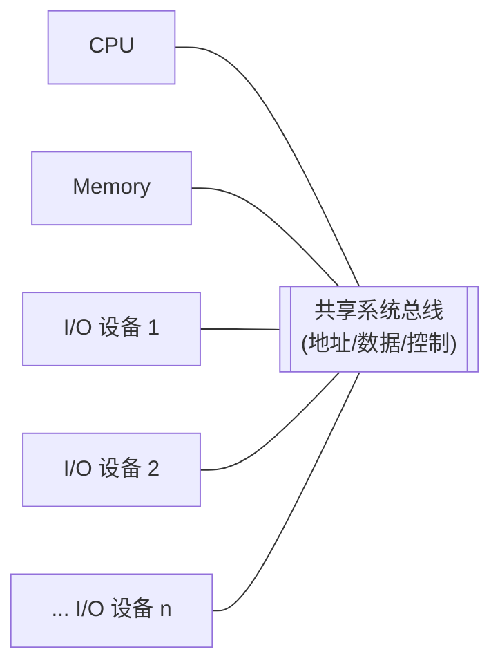
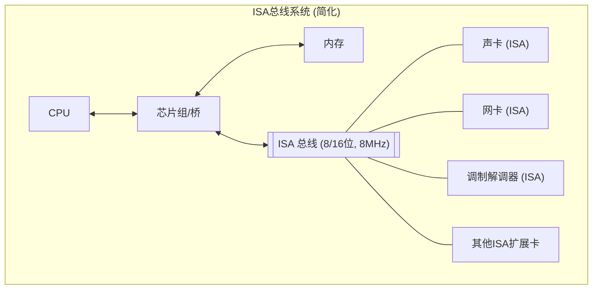
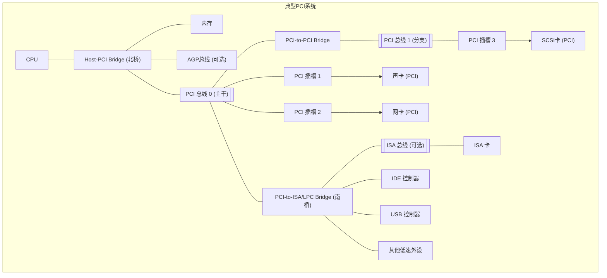

# 第二部分：总线技术的历史演进

在深入了解现代复杂的高速总线技术之前，回顾其发展历程至关重要。总线技术并非一蹴而就，而是随着计算机体系结构的发展、性能需求的提升以及半导体工艺的进步，经历了一个从简单到复杂、从并行到串行、从共享到交换的漫长演进过程。理解这段历史，有助于我们把握技术发展的脉络，认识到当前各种总线设计选择背后的驱动力与权衡。

本部分将追溯总线技术的演进足迹，重点关注个人计算机（PC）领域中具有里程碑意义的总线标准。

# 4. 早期总线：并行时代的开端

在个人计算机的黎明时期，系统结构相对简单，CPU速度不快，外设种类和数量也有限。最初的总线设计目标主要是解决基本的连接性问题，以相对简单和低成本的方式将CPU、内存和少量I/O设备连接起来。这个时代是**并行总线**占据主导地位的时期。

## 4.1 单总线架构的局限性

最早期的微型计算机（如Altair 8800及其使用的S-100总线）以及一些小型机采用了**单总线架构 (Single Bus Architecture)**。在这种结构中，CPU、内存和所有I/O设备都挂载在同一组共享的总线上。


*图：单总线架构示意图*

**优点:**
*   结构简单，成本低廉。
*   易于扩展，添加新设备只需将其连接到总线上即可（理论上）。

**缺点:**
*   **严重的性能瓶颈:** 所有设备共享总线带宽。CPU访问内存、CPU访问I/O、甚至I/O设备之间（通过CPU中转或DMA）的数据传输都需要争抢唯一的总线资源。随着CPU速度的提升和I/O设备数量的增加，总线迅速成为系统的瓶颈。
*   **速度受限于最慢设备:** 同步总线的速度通常需要迁就总线上最慢的设备。
*   **总线负载限制:** 连接的设备越多，总线的电气负载越大，会限制总线的最高频率和物理长度。

单总线架构的固有瓶颈促使计算机设计者寻求更优化的结构，例如引入多总线架构，将高速设备（如内存）和低速设备（如I/O）分离到不同的总线上。

## 4.2 ISA (Industry Standard Architecture) 总线：PC时代的标志

随着1981年IBM PC的发布，其采用的总线（后来被称为ISA总线）成为了事实上的工业标准，对个人计算机的发展产生了深远影响。

*   **起源:** 源自IBM PC/XT的8位总线和IBM PC/AT的16位扩展版本。
*   **标准化:** 最初是IBM专有，但由于IBM PC的巨大成功和开放策略，众多厂商开始生产兼容的扩展卡和主板，使其成为"工业标准"。
*   **技术特点:**
    *   **并行总线:** 最初为8位数据宽度（PC/XT），后来扩展到16位（PC/AT）。
    *   **地址线:** 8位版本有20条地址线（寻址1MB），16位版本有24条地址线（寻址16MB）。
    *   **时钟频率:** 最初4.77MHz，后来提高到6MHz或8MHz（名义上，实际可能略有不同）。
    *   **带宽:**
        *   8位ISA (8MHz): $1 \, \text{Byte} \times 8 \, \text{MHz} = 8 \, \text{MB/s}$ (理论峰值)
        *   16位ISA (8MHz): $2 \, \text{Bytes} \times 8 \, \text{MHz} = 16 \, \text{MB/s}$ (理论峰值，实际有效带宽远低于此，通常只有几MB/s)
    *   **共享总线拓扑:** 所有扩展卡共享总线。
    *   **同步总线:** 使用固定的时钟频率。
    *   **需要手动配置:** 扩展卡通常需要通过跳线（Jumper）或DIP开关来设置中断请求（IRQ）、DMA通道和I/O端口地址，容易发生资源冲突，即插即用（Plug and Play）能力差。
    *   **无总线主控 (Bus Mastering) 能力 (早期版本):** 所有数据传输（除DMA外）都需要CPU介入。
*   **连接器:** 包含两个部分，一个是原始的8位插槽，另一个是为16位卡增加的扩展槽。


*图：简化的ISA总线系统连接*

**贡献与局限:**
*   **贡献:** ISA的开放性和广泛采用极大地促进了PC软硬件生态系统的繁荣，使得用户可以方便地通过购买各种扩展卡来增强PC功能。
*   **局限:**
    *   **带宽严重不足:** 随着CPU速度的快速提升（从8MHz到几十MHz甚至更高）以及图形、网络、存储设备性能需求的增长，8/16 MB/s的理论带宽很快成为瓶颈。
    *   **CPU占用率高:** 缺乏有效的总线主控机制，数据传输严重依赖CPU。
    *   **配置困难:** 手动配置资源（IRQ, DMA, I/O地址）非常繁琐且容易出错。
    *   **16MB寻址限制:** 无法满足更大内存的需求。

ISA总线的这些局限性最终导致了其被更先进的总线技术所取代，但它作为PC早期最重要的扩展标准，其历史地位不可磨灭。它定义了PC扩展性的基本模式，并在市场上存在了非常长的时间（甚至在2000年后的某些工控主板上仍能看到）。

## 4.3 EISA (Extended ISA) 与 VESA Local Bus (VL-Bus)：向高性能的尝试

为了克服ISA总线的性能瓶颈，业界出现了几种改进型的总线标准，其中EISA和VL-Bus是两种重要的尝试。

### 4.3.1 EISA (Extended Industry Standard Architecture)

*   **背景:** 由康柏（Compaq）等九家IBM的主要竞争对手（被称为"Gang of Nine"）于1988年推出，旨在对抗IBM的专有MCA总线，同时保持对ISA的向后兼容性。
*   **技术特点:**
    *   **32位数据宽度:** 将数据通路扩展到32位。
    *   **32位地址宽度:** 寻址能力达到4GB。
    *   **时钟频率:** 仍然保持与ISA兼容的约8.33MHz。
    *   **带宽:** $4 \, \text{Bytes} \times 8.33 \, \text{MHz} = 33.3 \, \text{MB/s}$ (理论峰值)。相比ISA有提升，但仍显不足。
    *   **总线主控 (Bus Mastering):** 支持多个设备成为总线主控，可以在没有CPU干预的情况下直接传输数据，提高了效率。
    *   **自动配置:** 引入了软件配置机制，取代了跳线和DIP开关，简化了安装过程，是早期即插即用概念的尝试。
    *   **向后兼容ISA:** EISA插槽设计巧妙，可以插入8位或16位的ISA卡，也可以插入32位的EISA卡（通过两层触点实现）。
*   **市场表现:** EISA在技术上优于ISA，并保持了兼容性，但在成本上远高于ISA。主要应用于高端服务器和工作站市场，在主流PC市场并未普及。最终被PCI总线取代。

### 4.3.2 VESA Local Bus (VL-Bus)

*   **背景:** 由视频电子标准协会（VESA）在1992年推出，旨在解决ISA/EISA总线带宽对图形性能的严重制约。其核心思想是将高速设备（主要是显卡，有时也包括硬盘控制器）直接连接到CPU的**局部总线 (Local Bus)** 上，使其能以接近CPU的速度运行，绕过缓慢的ISA/EISA总线。
*   **技术特点:**
    *   **直接连接CPU:** 通常是486处理器的局部总线的一种延伸。
    *   **32位数据宽度:** 与当时的CPU匹配。
    *   **高时钟频率:** 运行频率与CPU的外部时钟频率（FSB）一致，通常是25MHz, 33MHz，甚至更高（如50MHz）。
    *   **高带宽:** $4 \, \text{Bytes} \times 33 \, \text{MHz} = 132 \, \text{MB/s}$ (理论峰值，在33MHz下)，远超ISA/EISA。
    *   **插槽形式:** 通常是在ISA或EISA插槽旁边增加一个额外的棕色连接器。
*   **优点:**
    *   **显著提升性能:** 特别是图形性能得到极大改善，满足了Windows图形界面和早期多媒体应用的需求。
    *   **成本相对较低:** 作为对现有主板设计的扩展，成本增加有限。
*   **缺点:**
    *   **电气负载问题:** 直接挂载在CPU局部总线上，对电气性能要求高，通常只能支持1-3个VL-Bus插槽。
    *   **与CPU耦合紧密:** 运行频率直接与CPU外频绑定，缺乏独立性。当CPU频率提高时，VL-Bus的稳定性可能出现问题。
    *   **缺乏标准化:** 虽然有VESA标准，但不同主板厂商的实现可能存在兼容性问题。
    *   **主要面向486:** 对奔腾（Pentium）等新一代CPU的适应性不佳。
*   **市场表现:** VL-Bus作为一种过渡性技术，在486时代获得了广泛应用，有效缓解了图形瓶颈。但其固有的电气和兼容性问题，以及与CPU的紧密耦合，使其很快被更通用、更健壮的PCI总线所取代。

## 4.4 MCA (Micro Channel Architecture)：IBM的创新与生态壁垒

在EISA联盟推出EISA的同时，IBM在其PS/2系列计算机中推出了全新的总线架构——MCA。

*   **背景:** IBM试图通过MCA重新夺回PC架构的主导权，并解决ISA的诸多问题。
*   **技术特点:**
    *   **全新设计:** 与ISA完全不兼容。
    *   **16位或32位数据宽度。**
    *   **32位地址宽度。**
    *   **异步总线 (Asynchronous):** 采用握手协议，理论上可以支持不同速度的设备（尽管早期实现的时钟频率约为10MHz）。
    *   **总线主控:** 支持多主控设备。
    *   **自动配置 (Plug and Play):** 通过"参考盘"进行软件配置，消除了跳线和开关。
    *   **更优的电气性能:** 对信号质量和接地设计有更好考虑。
    *   **理论带宽:** 32位版本理论可达40MB/s，后续有更高速度版本。
*   **优点:** 在技术上，MCA比ISA甚至EISA都要先进，解决了带宽、配置、多主控等多个问题。
*   **缺点:**
    *   **不兼容ISA:** 用户原有的ISA扩展卡无法使用，这是一个巨大的障碍。
    *   **专有与高授权费:** IBM对MCA采取了严格的控制和高昂的授权费用政策，阻碍了第三方厂商的支持。
*   **市场表现:** 由于不兼容和封闭的生态策略，MCA未能获得市场的广泛接受。尽管在IBM自家的PS/2和一些服务器产品中使用，但最终未能成为主流标准，被视为IBM在PC架构发展中的一次战略失误。其技术上的许多优点，后来被PCI等更开放的标准所借鉴和实现。

## 4.5 PCI (Peripheral Component Interconnect)：并行总线的黄金时代

在ISA、EISA、VL-Bus、MCA等标准相互竞争，各有优劣但都无法完美解决问题的情况下，Intel于1992年推出了PCI总线规范，并联合业界厂商共同推广。PCI凭借其优异的性能、良好的设计以及开放的策略，迅速终结了这场"总线战争"，成为了接下来十多年里PC系统中最重要、最普及的总线标准。

*   **设计目标:** 提供一个高性能、独立于处理器、支持即插即用、成本合理的通用I/O总线。
*   **技术特点:**
    *   **独立于CPU:** PCI总线有自己的时钟频率（通常为33MHz或66MHz），不直接与CPU的局部总线频率绑定。CPU通过**Host-PCI桥**（通常集成在北桥芯片组中）与PCI总线连接。
    *   **32位或64位数据宽度:** 主流是32位，服务器领域常用64位。
    *   **时钟频率:** 标准为33MHz，后续版本（PCI 2.1及以后）支持66MHz (PCI-X是其高性能扩展)。
    *   **同步总线:** 使用固定的时钟频率。
    *   **带宽:**
        *   32位, 33MHz: $4 \, \text{Bytes} \times 33 \, \text{MHz} = 132 \, \text{MB/s}$
        *   32位, 66MHz: $4 \, \text{Bytes} \times 66 \, \text{MHz} = 264 \, \text{MB/s}$
        *   64位, 33MHz: $8 \, \text{Bytes} \times 33 \, \text{MHz} = 264 \, \text{MB/s}$
        *   64位, 66MHz: $8 \, \text{Bytes} \times 66 \, \text{MHz} = 528 \, \text{MB/s}$
    *   **总线主控:** 支持多个设备成为总线主控器。
    *   **即插即用 (Plug and Play - PnP):** 规范定义了完善的设备发现、资源（IRQ, 内存地址, I/O端口）自动分配和配置机制，大大简化了用户安装扩展卡的过程。
    *   **分离事务 (Split Transaction):** 允许地址周期和数据周期分离，提高总线利用率（尤其是在慢速设备响应时）。
    *   **共享总线拓扑:** 仍然是共享总线，但通过桥接器可以构建层次化的PCI总线结构（PCI-to-PCI Bridge）。
    *   **电压规范:** 最初为5V信号，后来增加了3.3V信号规范以及通用卡（兼容两种电压）。


*图：包含PCI总线、桥接和传统总线的系统结构示意图*

**PCI的成功因素:**
*   **性能大幅提升:** 132MB/s的带宽相比ISA是巨大飞跃，满足了当时主流应用的需求。
*   **独立性:** 与CPU解耦，使得CPU和总线可以独立发展。
*   **即插即用:** 极大地改善了用户体验。
*   **开放标准:** 由PCI-SIG (Special Interest Group) 维护，众多厂商参与，形成了庞大的生态系统。
*   **成本适中:** 技术成熟，芯片和连接器成本相对合理。

**PCI的时代:** 从1990年代中期到2000年代中期，PCI总线是PC系统无可争议的主流I/O总线，承载了声卡、网卡、调制解调器、SCSI卡、视频采集卡等绝大多数扩展设备。直到图形处理对带宽提出更高要求（催生了AGP），以及CPU、内存、存储速度进一步提升，PCI的带宽才逐渐再次成为瓶颈，最终被更高性能的PCI Express（PCIe）所取代。

## 4.6 AGP (Accelerated Graphics Port)：为图形加速而生

随着3D图形应用（尤其是游戏）的兴起，显卡对内存带宽和数据传输速度提出了远超普通外设的需求。共享的PCI总线（即使是66MHz版本）也难以满足高端显卡的需求，成为图形性能的瓶颈。

为此，Intel于1996年推出了AGP，一个专为显卡设计的、基于PCI规范但性能增强的点对点接口。

*   **设计目标:** 提供比PCI更高的带宽，并允许显卡直接、快速地访问系统主内存。
*   **技术特点:**
    *   **点对点连接:** AGP端口直接连接到芯片组（北桥），显卡独享该端口带宽，不与其他设备共享。
    *   **基于PCI 66MHz规范:** 核心协议基于PCI，但增加了许多增强特性。
    *   **更高的数据传输模式:**
        *   AGP 1x: 66MHz, 32位, 带宽 266 MB/s (与PCI 66MHz/32bit相同)。
        *   AGP 2x: 采用**双泵浦 (Double Pumping)** 技术，在时钟的上升沿和下降沿都传输数据，等效频率133MHz，带宽 533 MB/s。
        *   AGP 4x: 采用**四泵浦 (Quad Pumping)** 技术，等效频率266MHz，带宽 1066 MB/s (1 GB/s)。
        *   AGP 8x: 等效频率533MHz，带宽 2133 MB/s (2.1 GB/s)。
    *   **直接内存执行 (Direct Memory Execute - DIME):** 允许显卡直接读取主内存中的纹理等数据，而无需先复制到显存，称为**AGP GART (Graphics Address Remapping Table)** 支持的**AGP纹理 (AGP Texturing)**。
    *   **边带寻址 (SideBand Addressing - SBA):** 将地址和命令信息通过额外的边带信号线传输，与数据传输并行，提高了效率。
    *   **不同的电压规范:** AGP 1.0 (3.3V), AGP 2.0 (1.5V), AGP 3.0 (0.8V)，插槽有防呆设计防止不兼容电压的显卡插入。
*   **优点:**
    *   **显著提升图形带宽:** AGP 4x/8x提供的GB级带宽远超PCI，满足了当时高端3D图形的需求。
    *   **改善纹理处理:** DIME/AGP纹理技术允许使用更大、更复杂的纹理，提升了图形质量。
*   **缺点:**
    *   **专用于显卡:** 无法用于其他类型的扩展卡。
    *   **点对点限制:** 主板通常只有一个AGP插槽。
    *   **最终带宽瓶颈:** 随着GPU性能的持续爆炸式增长，2.1GB/s的AGP 8x带宽最终也变得不足。
*   **市场表现:** AGP在其生命周期内（约1997年至2005年）非常成功，成为中高端显卡的标准接口。但随着PCI Express的出现，其提供的更高带宽、更好的扩展性（支持多卡）以及更通用的特性，最终使得AGP被PCIe x16插槽所取代。

## 4.7 本章小结

本章回顾了个人计算机早期总线技术的发展，这个阶段是并行总线的天下：

*   **单总线架构:** 最早期的简单结构，但存在严重性能瓶颈。
*   **ISA总线:** IBM PC带来的工业标准，8/16位，8MHz，带宽低，配置困难，但促进了PC生态。
*   **EISA总线:** 对ISA的32位扩展，支持总线主控和自动配置，但成本高，未普及。
*   **VL-Bus:** 直接连接CPU局部总线，显著提升图形性能（486时代），但电气限制和CPU耦合问题使其成为过渡技术。
*   **MCA总线:** IBM的技术创新，异步、32位、PnP，但因不兼容ISA和封闭策略而失败。
*   **PCI总线:** 并行总线的黄金时代。独立于CPU，32/64位，33/66MHz，支持PnP和总线主控，性能、成本和开放性俱佳，统治市场十余年。
*   **AGP总线:** 为解决PCI图形瓶颈而生。点对点连接，高达2.1GB/s带宽，支持直接访问主内存纹理，是PCIe出现前显卡的标准接口。

这些早期并行总线的发展历程清晰地展示了性能需求（尤其是图形处理）如何驱动总线技术的革新，以及标准化、兼容性、成本和开放性在技术竞争中的重要作用。然而，并行总线固有的频率限制、信号完整性等问题最终使其走向终结，下一章我们将探讨总线技术从并行到串行的革命性转变。

## 4.8 本章思维导图

```mermaid
mindmap
  root((第二部分：总线技术的历史演进))
    ::icon(fa fa-history)
    (第4章：早期总线：并行时代的开端)
      ::icon(fa fa-seedling)
      (4.1 单总线架构)
        (定义: CPU/内存/IO共享)
        (优点: 简单/低成本)
        (缺点: 性能瓶颈/速度受限)
      (4.2 ISA)
        (背景: IBM PC标准)
        (特点: 8/16位, 8MHz, 并行, 共享, 手动配置)
        (带宽: 8/16 MB/s)
        (贡献: 促进PC生态)
        (局限: 带宽低/CPU占用高/配置难)
      (4.3 EISA & VL-Bus)
        (EISA)
          (背景: 对抗MCA, 兼容ISA)
          (特点: 32位, 8.33MHz, 总线主控, 自动配置)
          (带宽: 33 MB/s)
          (市场: 高端服务器, 未普及)
        (VL-Bus)
          (背景: 解决图形瓶颈)
          (特点: 连接CPU局部总线, 32位, 高频(25-50MHz))
          (带宽: 132 MB/s @33MHz)
          (优点: 图形性能提升)
          (缺点: 电气限制/CPU耦合/兼容性差)
      (4.4 MCA)
        (背景: IBM PS/2, 取代ISA)
        (特点: 全新设计, 16/32位, 异步, 总线主控, PnP)
        (优点: 技术先进)
        (缺点: 不兼容ISA/专有/高授权费)
        (市场: 失败)
      (4.5 PCI)
        (背景: 终结总线战争)
        (特点: 独立于CPU, 32/64位, 33/66MHz, PnP, 总线主控, 分离事务)
        (带宽: 132/264/528 MB/s)
        (成功因素: 性能/独立/PnP/开放/成本)
        (时代: 90s中期-00s中期主流)
      (4.6 AGP)
        (背景: 解决PCI图形瓶颈)
        (特点: 点对点, 基于PCI增强, 高倍速(1x-8x), DIME/GART, SBA)
        (带宽: 266MB/s - 2.1GB/s)
        (优点: 图形带宽提升/纹理处理改善)
        (缺点: 专用于显卡/带宽最终瓶颈)
        (市场: PCIe出现前显卡标准)
      (4.7 本章小结)
        ::icon(fa fa-check-circle)
      (4.8 思维导图)
        ::icon(fa fa-project-diagram)
``` 