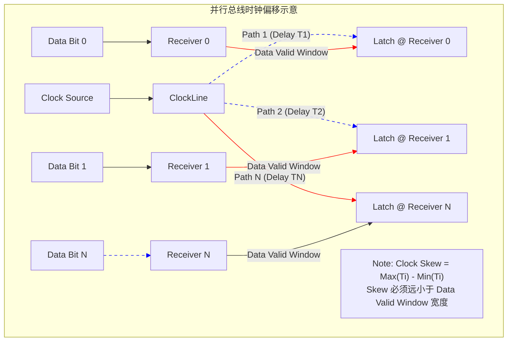
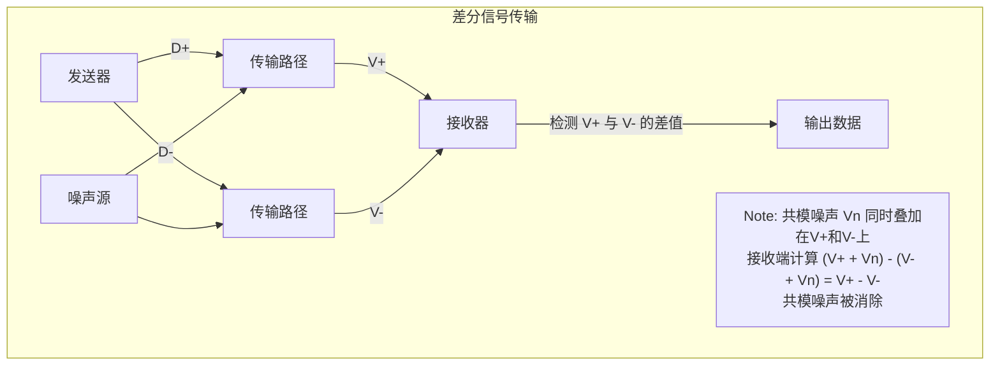
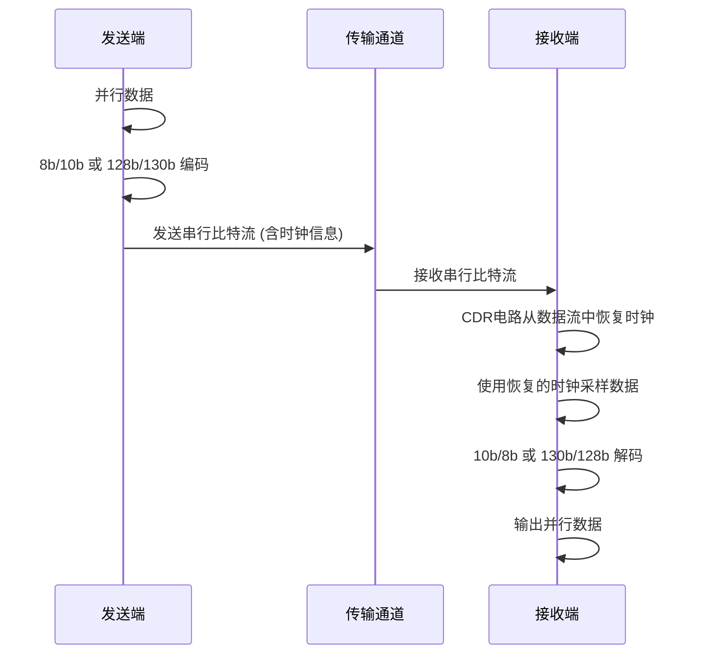

# 5. 从并行到串行：总线技术的革命

尽管PCI和AGP等并行总线在各自的时代取得了巨大成功，但随着CPU速度的持续攀升、外设性能的不断增强（尤其是存储和网络），以及系统集成度的提高，并行总线技术本身固有的物理限制逐渐暴露出来，难以满足日益增长的带宽需求和信号完整性要求。这最终引发了一场深刻的技术变革——总线技术从并行向串行的革命性转变。

本章将深入探讨并行总线面临的核心瓶颈，介绍串行传输的基本原理和关键技术，阐述串行总线相比于并行总线的优势，并解释其如何通过通道捆绑等方式实现极高的数据带宽。

## 5.1 并行总线的瓶颈

并行总线通过增加数据线数量来提高单周期传输的数据量，并在一定程度上通过提高时钟频率来提升带宽。然而，当速度和位宽达到一定程度后，多种物理限制开始显现，严重阻碍了其性能的进一步提升。

### 5.1.1 时钟偏移 (Clock Skew)

这是限制并行总线频率提升的最主要因素之一。

*   **问题:** 在同步并行总线中，所有数据线上的信号必须在时钟信号的有效边沿（上升沿或下降沿）稳定下来，以便接收端能够正确采样。然而，由于布线长度差异、负载不均、驱动器延迟不一致、温度变化等因素，时钟信号到达不同数据线对应触发器的时间点不可能完全一致，这种时间差就是时钟偏移。
*   **影响:** 时钟偏移会压缩有效的数据采样窗口。随着时钟频率的提高，时钟周期变短，允许的偏移量也随之减小。当偏移量大到一定程度，接收端就无法在同一个时钟边沿可靠地锁存所有并行数据位，导致传输错误。
*   **挑战:** 要控制数十甚至上百根高速并行信号线（数据+地址+控制）之间的时钟偏移在一个非常小的范围内（皮秒级），在PCB设计和芯片制造上面临巨大挑战且成本高昂。


*图：时钟偏移导致不同数据位的锁存时钟到达时间不一致*

### 5.1.2 信号串扰 (Crosstalk)

随着总线位宽增加和布线密度提高，信号线之间的距离被迫减小，串扰问题变得更加严重。

*   **问题:** 一条信号线（攻击线）上的快速电压跳变会通过电容和电感耦合，在相邻的信号线（受害线）上感应出噪声电压。
*   **影响:** 这种噪声会叠加在受害线的正常信号上，降低信号幅度，减慢信号边沿，甚至导致逻辑误判。在高频和高密度并行总线中，串扰是影响信号完整性的关键因素。
*   **挑战:** 要有效抑制串扰，需要增加线间距（牺牲密度）、优化布线层次和参考平面设计、或者降低信号边沿速率（牺牲速度）。

### 5.1.3 信号反射与端接 (Reflection & Termination)

高速信号在阻抗不匹配点会发生反射，这在并行总线中同样存在。

*   **问题:** 并行总线通常连接多个设备（插槽），每个设备连接点都会引入阻抗不连续性，导致信号反射，产生振铃、过冲/下冲。
*   **影响:** 影响信号质量，限制总线速度。
*   **挑战:** 为多负载的并行总线设计有效的端接方案比较复杂，且端接电阻会增加功耗。

### 5.1.4 引脚数量限制 (Pin Count Limitation)

并行总线需要大量的物理引脚。

*   **问题:** 一个32位的并行总线，除了32根数据线，还需要相应数量的地址线、控制线、电源和地线，总引脚数可能轻松过百。64位总线则需要更多。
*   **影响:**
    *   **增加芯片封装成本:** 引脚越多，芯片封装尺寸越大，成本越高。
    *   **增加PCB布线复杂度与成本:** 大量并行走线需要更宽的布线通道，可能需要更多PCB层数。
    *   **限制了小型化设备的应用:** 在笔记本电脑、移动设备等空间受限的场景中，大量引脚的并行总线难以应用。

### 5.1.5 功耗问题 (Power Consumption)

驱动大量高速并行信号线需要相当大的功率。

*   **问题:** 同时驱动数十根信号线进行快速切换会产生较大的动态功耗，并且可能引发严重的电源噪声（SSN/地弹）。
*   **挑战:** 在功耗和散热预算日益紧张的情况下，并行总线的高功耗成为一个制约因素。

上述这些瓶颈——特别是时钟偏移和信号完整性问题——使得并行总线技术在频率和带宽上难以进一步提升，成本效益也越来越低。业界迫切需要一种新的技术来突破这些限制，串行总线技术应运而生。

## 5.2 串行总线原理：新技术的引入

串行总线并非简单地将并行数据一位一位发送，而是采用了一系列先进的信号传输和处理技术，使其能够在极高的频率下实现可靠、高效的数据传输。

### 5.2.1 差分信号 (Differential Signaling)

这是高速串行通信的基石。

*   **原理:** 使用一对信号线（通常标记为 D+ 和 D- 或 TXP/TXN, RXP/RXN）传输信号。发送端驱动这对线产生大小相等、极性相反的电压。接收端检测的是**两根线之间的电压差**，而不是单根线相对于地的电压。
*   **优点:**
    *   **强抗共模干扰能力:** 在传输过程中，如果两根线上同时叠加了相同极性的噪声（共模噪声，如来自电源波动或外部EMI），接收端在计算电压差时，这个噪声会被抵消掉。这使得差分信号对噪声环境的适应性远强于单端信号。
    *   **减小电磁辐射 (EMI):** 由于两根线上的电流方向相反，它们产生的磁场可以相互抵消，向外辐射的电磁能量较小。
    *   **可以使用较低的电压摆幅:** 由于抗干扰能力强，差分信号可以使用更低的电压摆幅（如几百毫伏）来表示逻辑0和1，这有助于降低功耗并提高传输速度。
    *   **精确的过零点检测:** 差分信号的过零点（两线电压相等时）非常明确，有助于接收端进行精确的时钟恢复。
*   **实现:** LVDS (Low Voltage Differential Signaling) 是早期常用的一种差分信号标准。现代高速串行总线（如PCIe, USB 3.x, SATA, Ethernet）都采用差分信号。


*图：差分信号及其抗共模干扰原理*

### 5.2.2 嵌入式时钟 (Embedded Clock) 与 时钟数据恢复 (CDR)

为了克服并行总线的时钟偏移问题，高速串行总线不再发送独立的全局时钟信号，而是将时钟信息"嵌入"到数据流中。

*   **编码 (Encoding):** 发送端在发送数据前，会使用特定的编码方案（如**8b/10b编码**、**64b/66b编码**、**128b/130b编码**等）对数据进行处理。这些编码方案的主要目的有两个：
    1.  **保证信号跳变密度 (Transition Density):** 编码确保传输的比特流中有足够多的从0到1或从1到0的跳变。接收端的CDR电路需要利用这些跳变来锁定和跟踪数据流的频率和相位。
    2.  **维持直流平衡 (DC Balance):** 编码尽量保证传输的比特流中0和1的数量大致相等，避免信号出现长时间的恒定高电平或低电平。这有助于简化接收端电路设计，并减少某些传输介质（如交流耦合链路）的信号失真。
    *   **示例:** 8b/10b编码将8位数据映射为10位符号，提供了足够的跳变和良好的直流平衡，但引入了 (10-8)/10 = 20% 的带宽开销。PCIe Gen1/Gen2, SATA, USB 3.0/3.1 使用此编码。128b/130b编码将128位数据块加上2个同步头位，带宽开销仅为 2/130 ≈ 1.5%，效率更高，适用于更高速度的总线，如PCIe Gen3/Gen4/Gen5。
*   **时钟数据恢复 (Clock and Data Recovery - CDR):** 接收端包含一个精密的CDR电路（通常基于锁相环 PLL 或延迟锁定环 DLL）。CDR电路分析接收到的带有嵌入时钟信息的数据流，从中提取出时钟信号，并使用这个恢复出来的时钟来准确地采样数据比特。


*图：嵌入式时钟与CDR工作流程示意*

通过嵌入式时钟和CDR技术，串行总线彻底摆脱了对独立时钟线的依赖，消除了时钟偏移的瓶颈，使得传输速率可以大幅提升。

### 5.2.3 SerDes (Serializer/Deserializer) 技术

SerDes是实现串行通信的核心硬件模块。

*   **功能:**
    *   **发送端 (Serializer):** 接收来自上层逻辑的并行数据，进行编码，然后通过高速驱动器将数据串行化后发送到差分线上。
    *   **接收端 (Deserializer):** 接收来自差分线上的串行信号，进行信号调理（如均衡），通过CDR恢复时钟和数据，进行解码，最后将数据并行化后传递给上层逻辑。
*   **关键技术:** SerDes内部集成了高速时钟电路（PLL/DLL）、编码/解码逻辑、发送驱动器、接收放大器、CDR电路以及通常还包括**均衡器 (Equalizer)** 电路（用于补偿信号在通道中的损耗和失真，详见第15章）。
*   **挑战:** 设计能在极高频率（数Gbps甚至数十Gbps）下稳定工作的低功耗、低抖动SerDes是一项复杂且关键的技术，是衡量芯片厂商高速接口能力的重要指标。

## 5.3 串行总线的优势

基于上述技术，串行总线相比并行总线展现出显著的优势，推动了其在现代计算和通信领域的广泛应用：

1.  **极高的传输速率和带宽:**
    *   克服了时钟偏移瓶颈，可以达到远高于并行总线的单线传输速率（Gbps级别）。
    *   可以通过增加单线速率（如PCIe从Gen1的2.5GT/s到Gen6的64GT/s）和捆绑多条通道（Lane）来灵活扩展总带宽。
2.  **更少的引脚和线缆:**
    *   大大降低了芯片封装成本、PCB布线复杂度和成本。
    *   连接器尺寸更小，有利于设备小型化。
    *   简化了系统设计和制造。
3.  **更强的信号完整性和抗干扰能力:**
    *   差分信号能有效抵抗共模噪声和EMI。
    *   点对点连接避免了共享总线的反射和负载问题。
4.  **支持更长的传输距离:**
    *   信号质量更好，配合均衡技术，可以支持从芯片间短距连接到数米甚至更长的线缆连接。
5.  **更好的功耗管理:**
    *   可以使用更低的电压摆幅。
    *   可以对未使用的通道进行独立的电源门控。
    *   支持更精细的链路低功耗状态管理。
6.  **良好的可扩展性:**
    *   带宽可以通过增加通道数量方便地扩展，而无需改变基本协议或物理接口（如PCIe x1, x4, x8, x16使用相同的基本机制）。

当然，串行总线也有其代价，主要是SerDes电路的复杂度和设计成本。但随着技术成熟和规模化生产，这些成本已经变得可以接受，其带来的巨大性能和灵活性优势使其成为现代高速互联的首选。

## 5.4 串行总线如何实现高带宽：通道与链路的概念

单个串行通道（Lane）的带宽虽然可以很高，但有时仍不足以满足最高性能设备（如图形卡、高速网络接口）的需求。现代串行总线（如PCIe, NVLink, CXL）通过将多个通道捆绑在一起来实现极高的聚合带宽。

*   **通道 (Lane):** 通常指一对用于发送的差分信号线和一对用于接收的差分信号线（构成一个全双工通路）。例如，一个PCIe Lane包含TX+, TX- 和 RX+, RX- 四根信号线。
*   **链路 (Link):** 由一个或多个通道组成逻辑连接。链路的宽度（Width）由其包含的通道数量决定。
*   **带宽扩展:** 链路的总带宽约等于单个通道的带宽乘以通道数量。
    *   例如，PCIe Gen3 单通道带宽约为 1 GB/s (8 GT/s * 1 lane * 128/130 coding / 8 bit/Byte)。
    *   一个PCIe Gen3 x16链路包含16个通道，其单向总带宽约为 $1 \, \text{GB/s/lane} \times 16 \, \text{lanes} = 16 \, \text{GB/s}$。
*   **链路训练 (Link Training):** 在系统启动或设备插入时，链路两端的设备会进行一个协商过程，确定可以稳定工作的通道数量和最高速度。例如，一个物理上是x16的插槽，如果插入的卡只支持x8，或者部分通道信号质量不佳，链路可能会训练成x8或更低的宽度运行。

这种基于通道捆绑的带宽扩展机制为串行总线提供了极大的灵活性和可扩展性，使其能够满足从低速设备（x1）到超高性能设备（x16甚至更高）的各种需求。

## 5.5 本章小结

本章阐述了总线技术从并行向串行演进的驱动力、关键技术和核心优势：

*   **并行总线的瓶颈:** 时钟偏移、信号串扰、反射、引脚数量限制和功耗问题严重制约了并行总线的性能提升和应用范围。
*   **串行总线关键技术:**
    *   **差分信号:** 使用一对信号线传输差模信号，实现强抗干扰、低辐射、低电压摆幅。
    *   **嵌入式时钟 & CDR:** 通过编码将时钟信息嵌入数据流，接收端恢复时钟，消除时钟偏移问题。
    *   **SerDes:** 实现串并转换、编解码、信号调理的核心硬件模块。
*   **串行总线的优势:** 极高传输速率、更少引脚/线缆、更强信号完整性、更长传输距离、更好功耗管理、良好可扩展性。
*   **高带宽实现:** 通过捆绑多个串行通道（Lane）形成逻辑链路（Link），线性扩展总带宽（如PCIe x1, x4, x8, x16）。

这场从并行到串行的技术革命是计算机接口发展史上的一次重大飞跃，为后续各种高性能总线和互联技术（如PCIe, SATA, USB 3.x, CXL, NVLink等）的发展奠定了基础。下一部分我们将开始深入探讨现代通用计算领域的各种主流总线技术。

## 5.6 本章思维导图

```mermaid
mindmap
  root((5. 从并行到串行：总线技术的革命))
    ::icon(fa fa-sync-alt)
    (5.1 并行总线的瓶颈)
      ::icon(fa fa-ban)
      (时钟偏移 Clock Skew)
        (问题: 信号到达时间不一致)
        (影响: 压缩采样窗口, 限制频率)
      (信号串扰 Crosstalk)
        (问题: 相邻线干扰)
        (影响: 噪声/误判)
      (信号反射 Reflection)
        (问题: 阻抗不匹配)
        (影响: 振铃/过冲)
      (引脚数量限制 Pin Count)
        (问题: 线数过多)
        (影响: 成本/复杂度/小型化)
      (功耗问题 Power Consumption)
        (问题: 驱动功耗高/电源噪声)
    (5.2 串行总线原理)
      ::icon(fa fa-bolt)
      (差分信号 Differential Signaling)
        (原理: 一对线传相反信号, 检测差值)
        (优点: 抗共模干扰/低EMI/低电压摆幅)
      (嵌入式时钟 Embedded Clock & CDR)
        (原理: 编码(8b10b/128b130b)保证跳变/直流平衡)
        (CDR: 从数据恢复时钟)
        (优点: 消除时钟偏移)
      (SerDes 技术)
        (功能: 串化/解串/编解码/均衡/CDR)
        (核心硬件模块)
    (5.3 串行总线的优势)
      ::icon(fa fa-thumbs-up)
      (高传输速率/带宽)
      (更少引脚/线缆 -> 低成本/简化)
      (强信号完整性/抗干扰)
      (更长传输距离)
      (更好功耗管理)
      (良好可扩展性)
    (5.4 如何实现高带宽)
      ::icon(fa fa-link)
      (通道 Lane: 一对发送+一对接收差分线)
      (链路 Link: 一个或多个通道捆绑)
      (带宽扩展: 带宽 ≈ 单通道带宽 × 通道数)
      (链路训练 Link Training: 协商通道数和速度)
    (5.5 本章小结)
      ::icon(fa fa-check-circle)
    (5.6 思维导图)
      ::icon(fa fa-project-diagram)
``` 