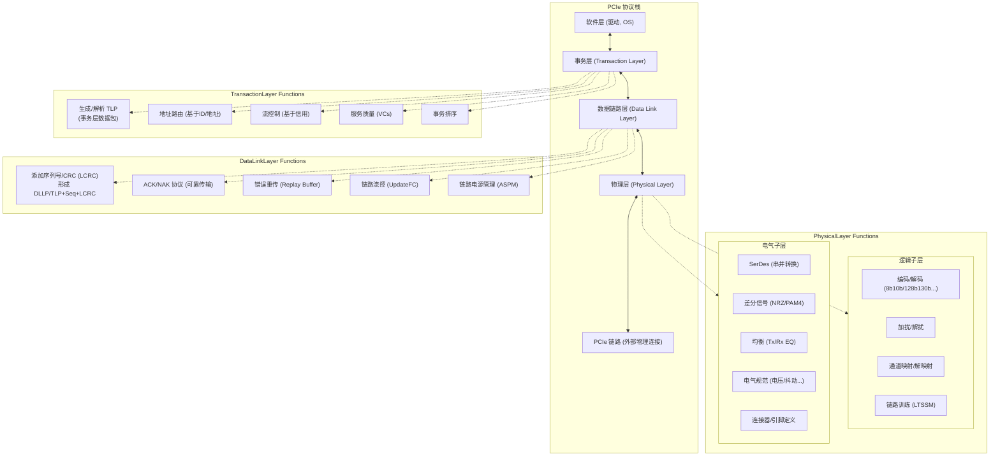

# 第三部分：现代通用计算领域的总线技术（当下热门技术聚焦）

随着并行总线遇到瓶颈，串行技术革命的到来为更高性能的互联打开了大门。在现代计算机系统中，特别是在通用计算领域（如PC、服务器、工作站），一系列基于高速串行技术的总线标准扮演着至关重要的角色，它们构成了连接CPU、内存、存储、网络和各种加速器的骨干网络。

本部分将聚焦于当前通用计算领域最热门、应用最广泛的总线技术，深入剖析其架构、特性、演进和应用。

# 6. PCI Express (PCIe)：通用互联的王者

**(本章为重要章节，将进行详细深入的探讨)**

PCI Express（通常缩写为PCIe或PCI-E）无疑是过去二十年中最成功的计算机扩展总线标准。它彻底取代了老旧的PCI、PCI-X和AGP总线，成为连接CPU与高速外设（如图形卡、固态硬盘、网络接口卡、加速器等）的事实标准。其卓越的可扩展性、持续提升的性能、对软件的兼容性以及开放的生态系统，使其在从消费级PC到大型数据中心的几乎所有计算领域都占据着统治地位。

本章将全面深入地介绍PCIe技术，涵盖其分层架构、关键特性、版本演进、应用场景、配置管理以及高级功能。

## 6.1 PCIe 架构概览：分层协议

与现代网络协议类似，PCIe规范定义了一个**分层协议栈 (Layered Protocol Stack)**。这种分层结构将复杂的功能分解到不同的逻辑层，每一层负责特定的任务，并通过明确定义的接口与相邻层交互。这极大地简化了设计、验证和实现，并允许各层独立演进。

PCIe协议栈主要分为三层：**事务层 (Transaction Layer)**、**数据链路层 (Data Link Layer)** 和**物理层 (Physical Layer)**。


*图：PCIe协议分层架构及其主要功能*

### 6.1.1 事务层 (Transaction Layer)

事务层是PCIe协议栈的最顶层，它直接与设备的核心逻辑和软件层（设备驱动程序、操作系统）交互。其主要职责是创建和接收**事务层数据包 (Transaction Layer Packets - TLPs)**，并处理与端到端数据传输相关的逻辑。

*   **TLP的生成与解析:** TLP是PCIe系统中信息交换的基本单元。事务层根据软件发起的请求（如内存读/写、I/O读/写、配置读/写）或设备自身产生的事件（如中断、错误消息）来生成TLP。它也负责解析从链路接收到的TLP，并将其信息传递给软件或设备核心逻辑。
*   **TLP结构:** 一个TLP通常包含：
    *   **头部 (Header):** 包含TLP类型、地址、长度、事务ID、流量类别（TC）、属性等关键控制信息。
    *   **数据载荷 (Data Payload):** (可选) 对于写请求或读完成响应，包含要传输的数据。
    *   **端到端CRC (ECRC - End-to-End CRC):** (可选) 提供对TLP（头部+数据）的端到端错误校验，独立于数据链路层的LCRC。
*   **事务类型:** TLP定义了多种事务类型，以支持不同的通信需求：
    *   **内存访问 (Memory):** 读 (MRd), 写 (MWr)。用于CPU与设备内存、设备与系统内存（DMA）之间的数据传输。
    *   **I/O访问 (I/O):** 读 (IORd), 写 (IOWr)。用于访问传统的I/O端口空间（主要为兼容旧设备）。
    *   **配置访问 (Configuration):** 读 (CfgRd), 写 (CfgWr)。用于读取和设置设备的配置寄存器（枚举和配置过程）。
    *   **消息 (Messages - Msg/MsgD):** 用于边带信号（如中断、电源管理事件、错误信号、供应商定义消息等）的传输。
    *   **完成 (Completions - Cpl/CplD):** 对非Posted请求（如读请求、非Posted写）的响应，用于返回状态或读取的数据。
*   **地址路由:** 事务层负责根据TLP头部中的地址或ID信息，决定TLP应该被发送到哪个下游端口（对于交换机）或是否应该被本地设备接收。
    *   **基于地址路由 (Address Routing):** 用于内存和I/O请求，通过地址范围判断目标。
    *   **基于ID路由 (ID Routing):** 通过总线号(Bus)/设备号(Device)/功能号(Function) (BDF)来定位目标设备，主要用于配置请求和完成包。
    *   **隐式路由 (Implicit Routing):** 用于消息，路由信息隐含在消息类型中（如广播、本地终止等）。
*   **流控制 (Flow Control):** PCIe采用基于**信用 (Credit)** 的端到端流控制机制，确保发送方不会因为发送过多TLP而淹没接收方的缓冲。接收方会定期向发送方通告其可用的缓冲区空间（信用额度），发送方只有在拥有足够信用时才能发送相应类型的TLP。这避免了数据丢失，并允许接收方根据资源情况管理流量。
*   **服务质量 (Quality of Service - QoS):** PCIe支持通过**流量类别 (Traffic Class - TC)** 和**虚拟通道 (Virtual Channel - VC)** 来提供差分服务。不同的TC可以映射到不同的VC，每个VC有自己独立的缓冲区和流控制信用。系统可以通过配置TC/VC映射和仲裁策略，为对延迟敏感或需要保证带宽的流量（如isochronous数据流）提供优先服务。
*   **事务排序 (Transaction Ordering):** PCIe定义了一套严格的事务排序规则，以确保系统行为的可预测性，特别是对于需要维持内存一致性的操作。例如，通常保证来自同一设备的Posted Write请求按照其发出的顺序到达目的地。

### 6.1.2 数据链路层 (Data Link Layer)

数据链路层位于事务层和物理层之间，其核心职责是确保TLP在PCIe链路两点之间的**可靠传输**。

*   **TLP序列化与校验和添加:** 从事务层接收TLP后，数据链路层为其添加一个**16位序列号 (Sequence Number)** 和一个**32位链路CRC (LCRC - Link CRC)**。
*   **DLLP (Data Link Layer Packet) 的生成与处理:** 数据链路层还负责生成和处理用于链路管理的小型、高优先级数据包，称为DLLP。DLLP不包含序列号和LCRC，而是自带16位CRC。常见的DLLP类型包括：
    *   **ACK/NAK:** 用于确认或否认已正确接收的TLP。
    *   **电源管理DLLP (Pm):** 用于请求或响应链路电源状态转换。
    *   **流控制DLLP (InitFC/UpdateFC):** 用于初始化和更新流控制信用。
    *   **供应商特定DLLP。**
*   **ACK/NAK协议与重传机制:** 这是保证可靠性的核心。
    1.  发送端每发送一个TLP，都会在本地的**重传缓冲区 (Replay Buffer)** 中保留一份副本，直到收到接收端对该TLP序列号的ACK确认为止。
    2.  接收端收到TLP后，会检查LCRC和序列号。如果LCRC正确且序列号符合预期，则向发送端回复ACK DLLP。
    3.  如果LCRC错误或序列号不匹配，接收端会回复NAK DLLP。
    4.  发送端收到NAK或在一定时间内未收到对应序列号的ACK（超时），就会从重传缓冲区中取出相应的TLP副本进行重传。
    *   这个基于序列号、LCRC校验和ACK/NAK确认的滑动窗口协议确保了即使物理层偶尔发生传输错误，事务层也能收到正确无误的数据包。
*   **链路流控制:** 独立于事务层的端到端流控制，数据链路层还进行链路级别的流控制，主要通过InitFC/UpdateFC DLLP来交换缓冲区可用信息。
*   **链路电源管理:** 与物理层协作，处理链路的低功耗状态转换请求（如进入或退出ASPM L0s/L1状态）。

### 6.1.3 物理层 (Physical Layer)

物理层是PCIe协议栈的最底层，负责处理链路上的实际比特流传输。它包含逻辑子层和电气子层。

#### 6.1.3.1 逻辑子层 (Logical Sublayer)

*   **接口:** 与数据链路层交互，接收或发送字节流。
*   **编码/解码 (Encoding/Decoding):** 根据PCIe版本进行相应的线路编码（如Gen1/2的8b/10b，Gen3/4/5的128b/130b，Gen6/7的FLIT模式下的编码）。目的是嵌入时钟、保证直流平衡、提供帧边界定界符。
*   **加扰/解扰 (Scrambling/Descrambling):** 使用线性反馈移位寄存器（LFSR）对数据进行加扰，目的是将数据随机化，避免出现长串的0或1（这可能影响CDR性能），并减少特定频率的EMI辐射。接收端使用相同的LFSR进行解扰以恢复原始数据。
*   **通道映射/解映射 (Lane Mapping/Demapping):** 对于多通道链路（如x4, x8, x16），将来自数据链路层的字节流分发到各个物理通道上，并在接收端重新组合。还需要处理通道间的偏移（Lane-to-Lane Skew）。
*   **链路训练与状态管理 (Link Training and Status State Machine - LTSSM):** 这是物理层最复杂的部分之一。LTSSM是一个有限状态机，负责链路的初始化、配置和状态管理。在系统启动或设备热插拔时，链路两端的物理层通过LTSSM定义的特定序列（Training Sets）进行交互，完成以下任务：
    *   建立比特锁定 (Bit Lock): 接收端CDR锁定发送端的比特率。
    *   建立符号锁定 (Symbol Lock): 识别编码后的符号边界。
    *   通道间对齐 (Lane-to-Lane Deskew): 补偿多通道链路中各通道的传输延迟差异。
    *   确定链路宽度 (Link Width): 协商双方都支持的最大可用通道数。
    *   确定链路速率 (Link Speed): 协商双方都支持的最高数据传输速率。
    *   进行均衡协商 (Equalization): (Gen3及以后) 动态调整发送端和接收端的均衡器参数，以优化高速信号质量。
    *   管理链路的各种状态：Detect, Polling, Configuration, Recovery, Loopback, Hot Reset, Disabled, L0 (正常工作状态), L0s, L1, L2 (低功耗状态)。

#### 6.1.3.2 电气子层 (Electrical Sublayer)

*   **接口:** 物理层的模拟部分，直接与物理介质（PCB走线、连接器、线缆）连接。
*   **SerDes (Serializer/Deserializer):** 执行高速串并转换。
*   **差分信号驱动器/接收器:** 负责发送和接收符合电气规范的差分信号。
*   **信号均衡 (Equalization):** (Gen3及以后需要) 为了补偿高速信号在通道中的损耗和失真，采用均衡技术：
    *   **发送端均衡 (Tx Equalization):** 预加重 (Pre-emphasis) / 去加重 (De-emphasis)。在信号跳变时增强高频分量，或抑制非跳变时的低频分量，预先补偿通道的高频损耗。
    *   **接收端均衡 (Rx Equalization):** 连续时间线性均衡器 (CTLE - Continuous Time Linear Equalizer) 和/或 判决反馈均衡器 (DFE - Decision Feedback Equalizer)。CTLE像一个滤波器，放大高频分量；DFE则根据先前判决的比特来消除当前比特受到的码间干扰 (ISI)。
    *   均衡系数在LTSSM的均衡阶段动态协商确定。
*   **电气规范:** 定义了详细的电压、电流、时序、抖动、眼图模板等参数要求，确保不同厂商设备间的互操作性。
*   **连接器与引脚定义:** 定义了标准的插槽（Slot）和卡边缘连接器（Card Edge Connector）的物理尺寸、引脚排列和功能（如TX/RX差分对、参考时钟、电源、地、边带信号如PERST#, WAKE#, SMBus等）。

这个分层架构使得PCIe能够适应不断提升的速度需求（主要通过物理层升级），同时保持对上层软件的向后兼容性。

## 6.2 PCIe 的关键特性

除了分层架构，PCIe还有许多关键特性使其成为现代互联的王者：

*   **点对点连接 (Point-to-Point Topology):** 每个PCIe设备通过一个专用的链路连接到Root Complex（CPU内部）或Switch。这与PCI的共享总线形成鲜明对比。点对点连接消除了总线争用，每个设备独享其链路带宽，极大地提高了系统总带宽和并发性。
*   **交换式架构 (Switched Architecture):** 可以使用PCIe Switch来扩展端口数量，构建复杂的拓扑结构。Switch内部可以同时路由多个TLP，允许多对设备并发通信，进一步提升系统吞吐量。Switch负责基于地址或ID的TLP路由。
*   **可扩展的链路宽度 (Scalable Link Width):** 链路可以由1, 2, 4, 8, 12, 16 或 32 (较少见) 个通道 (Lane) 组成，表示为 x1, x2, x4, x8, x12, x16, x32。带宽与通道数量成正比。这使得PCIe可以根据设备的需求（从低带宽的声卡到高带宽的显卡）灵活配置带宽，并允许在物理尺寸（插槽大小）和性能之间进行权衡。
*   **可扩展的链路速度 (Scalable Link Speed):** PCIe规范不断演进，每一代都将单通道的传输速率翻倍（或近似翻倍），同时保持向后兼容性。设备可以在其支持的最高速度和伙伴设备支持的最高速度之间协商确定工作速率。
*   **全双工通信 (Full-Duplex Communication):** 每个通道包含独立的发送（Tx）和接收（Rx）差分对，允许数据同时双向传输。例如，一个PCIe x16链路的标称带宽通常指单向带宽，其总的双向聚合带宽是标称值的两倍。
*   **数据包交换 (Packet-Based Communication):** 所有信息（数据、地址、控制、消息）都封装在数据包（TLP和DLLP）中进行传输。这使得协议更加灵活，易于添加新功能和管理复杂事务。
*   **可靠的传输机制:** 数据链路层的ACK/NAK协议和重传机制保证了数据的可靠交付。
*   **先进的电源管理:** 支持精细的链路低功耗状态（L0s, L1, L1.1, L1.2, L2），以及设备级的电源状态（D0-D3），有助于降低系统功耗。
*   **服务质量 (QoS):** 通过TC/VC机制，可以为不同类型的流量提供差异化服务。
*   **热插拔支持 (Hot-Plug Support):** 规范定义了支持设备在系统运行时安全插入或移除的机制（需要操作系统和硬件支持）。
*   **软件兼容性:** PCIe在软件层面（配置空间、内存映射I/O）保持了与PCI模型的高度兼容性，使得操作系统和驱动程序可以相对平滑地过渡。

## 6.3 PCIe 版本演进：从Gen1到Gen7的速度与技术飞跃

P CIe规范由PCI-SIG组织制定和发布，自2003年发布1.0版本以来，经历了多次重要的版本迭代，每一次迭代的核心目标都是在保持兼容性的前提下大幅提升带宽，并引入新技术以应对更高速度带来的挑战。

| PCIe 版本 | 发布年份 | 每通道速率 (GT/s) | 编码方案   | 带宽开销 | 单通道单向带宽 (GB/s) | x16链路单向带宽 (GB/s) | 主要技术特点/变化                                                                                                |
| :-------- | :------- | :---------------- | :--------- | :------- | :-------------------- | :--------------------- | :--------------------------------------------------------------------------------------------------------------- |
| **1.0/1.1** | 2003     | 2.5               | 8b/10b     | 20%      | 0.25                  | 4                      | 基础架构，串行替代PCI/AGP                                                                                        |
| **2.0/2.1** | 2007     | 5.0               | 8b/10b     | 20%      | 0.5                   | 8                      | 速率翻倍，改进电气规范，引入输入/输出虚拟化 (IOV) 相关特性                                                        |
| **3.0/3.1** | 2010     | 8.0               | 128b/130b  | ~1.54%   | ~0.985                | ~15.75                 | 速率提升，**高效128b/130b编码**，引入**发送/接收端均衡**协商，信号完整性挑战增大                                   |
| **4.0**     | 2017     | 16.0              | 128b/130b  | ~1.54%   | ~1.969                | ~31.51                 | 速率翻倍，对信号完整性要求更高（需要更好的PCB材料，更严格的损耗预算），均衡技术要求更高，扩展了LTSSM状态机       |
| **5.0**     | 2019     | 32.0              | 128b/130b  | ~1.54%   | ~3.938                | ~63.02                 | 速率再翻倍，信号完整性挑战极大，损耗和串扰非常严重，需要更强的均衡技术（如DFE），对连接器和线缆要求更高      |
| **6.0**     | 2022     | 64.0              | **PAM4** 信令<br>**FLIT** 模式<br>1b/1b (逻辑) | 可变(CRC+FEC) | ~7.877 (payload)      | ~126.03 (payload)      | **PAM4信令** (四电平取代NRZ二电平)，**FLIT模式** (固定大小流控单元取代TLP/DLLP)，**前向纠错 (FEC)**，**L0p低功耗状态** |
| **7.0**     | (预计2025) | 128.0             | PAM4 信令<br>FLIT 模式 | 可变(CRC+FEC) | ~15.754 (payload)     | ~252.06 (payload)      | 速率再翻倍，继续优化PAM4信令、FEC效率、功耗和通道参数                                                            |

**关键技术演进解读：**

*   **从Gen1到Gen2:** 主要是在8b/10b编码下将比特率从2.5GT/s翻倍到5GT/s。技术挑战相对可控。
*   **从Gen2到Gen3:** 这是一个重要的里程碑。速率提升至8GT/s，同时为了降低开销，采用了**128b/130b编码**。更高的速率使得信号损耗、反射和串扰问题变得非常突出，因此引入了**动态均衡协商机制**，允许链路两端在LTSSM过程中自动优化Tx和Rx的均衡设置，以获得最佳信号质量。这是PCIe首次需要复杂的自适应均衡。
*   **从Gen3到Gen4/Gen5:** 继续在128b/130b编码和NRZ（Non-Return-to-Zero，二电平）信令下将速率翻倍至16GT/s和32GT/s。挑战在于以可接受的成本和功耗实现如此高速的信号传输。对PCB材料（需要超低损耗材料）、连接器设计、线缆质量、以及SerDes中的均衡器性能（特别是DFE的应用）提出了极高的要求。通道损耗预算变得非常紧张。
*   **从Gen5到Gen6:** 这是另一个革命性的变化。为了在不将奈奎斯特频率（Nyquist Frequency）提高一倍（这会使损耗问题更加恶化）的情况下实现带宽翻倍，PCIe 6.0引入了**PAM4（Pulse Amplitude Modulation - 4 levels）信令**。PAM4在每个符号周期内传输2个比特（使用四个电压电平表示00, 01, 10, 11），而NRZ只传输1个比特（两个电压电平）。这意味着在相同的波特率（Baud Rate, 符号速率）下，PAM4的数据率（Data Rate, 比特率）是NRZ的两倍。例如，PCIe 6.0的波特率仍是32 Gbaud（与Gen5类似），但数据率达到64 GT/s。
    *   **PAM4的代价:** PAM4信号的垂直眼高只有NRZ的三分之一，对噪声更敏感，误码率（BER - Bit Error Rate）远高于NRZ。为了解决这个问题，PCIe 6.0引入了**轻量级前向纠错（FEC - Forward Error Correction）** 机制，可以在接收端纠正一定数量的比特错误，同时与链路层的CRC和重传机制结合，保证整体传输的可靠性。FEC的引入也带来了一定的延迟。
    *   同时，为了优化FEC效率和降低延迟，PCIe 6.0引入了**FLIT（Flow Control Unit）模式**。数据不再以可变长度的TLP为基本单位在物理层传输，而是被分割或聚合成固定大小的FLIT（通常是256字节）进行传输和CRC/FEC保护。这简化了缓冲区管理，提高了带宽利用率，并允许实现更低的延迟（因为FEC可以基于FLIT进行，无需等待整个TLP）。
    *   Gen6还引入了新的低功耗状态**L0p**，允许在链路活动时动态调整通道数量，以节省功耗。
*   **从Gen6到Gen7:** 目标是将速率再次翻倍至128 GT/s，继续沿用PAM4信令、FLIT模式和FEC。主要的挑战在于进一步优化信号完整性（可能需要更强的均衡和新型连接技术）、提高FEC效率、降低功耗和延迟。

**向后兼容性:** PCIe的一个重要优点是保持了良好的向后兼容性。一个较高版本的设备（如PCIe 4.0显卡）可以插入到较低版本的主板插槽（如PCIe 3.0 x16），反之亦然。在这种情况下，链路会自动协商到双方都支持的最低版本和最高速度进行工作。物理插槽尺寸（x1, x4, x8, x16）也通常是兼容的（例如，一个x1卡可以插入x16插槽）。

## 6.4 PCIe 的应用场景

凭借其高性能和通用性，PCIe已成为连接各种高速设备的标准接口：

*   **图形卡 (Graphics Cards / GPUs):** 这是PCIe最初取代AGP的关键驱动力。现代高性能GPU需要极高的带宽与CPU和内存进行通信，通常使用PCIe x16链路（目前主流是PCIe 4.0 x16或5.0 x16）。
*   **固态硬盘 (Solid State Drives - SSDs):** NVMe (Non-Volatile Memory Express) 协议利用PCIe取代了传统的SATA接口，极大地提升了SSD的读写速度。NVMe SSD通常使用PCIe x2或x4链路（通过M.2接口或U.2接口）。
*   **网络接口卡 (Network Interface Cards - NICs):** 从千兆以太网到10GbE, 25GbE, 40GbE, 100GbE甚至更高速的网络连接，都需要PCIe提供足够的带宽。高速NIC可能使用x8或x16链路。
*   **RAID控制器和主机总线适配器 (HBAs):** 用于连接高性能存储阵列（SAS/SATA/SCSI）。
*   **AI加速器 / FPGA卡:** 各种用于AI训练/推理、科学计算、视频处理等的专用加速卡也广泛采用PCIe作为与主机系统连接的接口。
*   **Thunderbolt 控制器:** Thunderbolt 3/4 通过内部封装PCIe和DisplayPort信号，提供高速外部连接。
*   **其他扩展卡:** 声卡、视频采集卡、无线网卡、USB扩展卡等，根据带宽需求使用不同宽度的PCIe链路（通常是x1或x4）。
*   **芯片间互联:** PCIe协议也被用于一些芯片内部或芯片之间的互联场景（虽然可能不是其主要设计目标）。例如，CXL.io协议就基于PCIe。

## 6.5 PCIe 的配置、枚举与资源管理

为了实现即插即用，PCIe定义了一套标准的设备发现、配置和资源分配流程，很大程度上继承自PCI。

*   **配置空间 (Configuration Space):** 每个PCIe功能（一个物理设备可以包含多个功能，如一个显卡可能包含图形功能和音频功能）都拥有一块标准化的配置空间（早期为256字节，PCIe扩展到4KB）。操作系统或BIOS可以通过配置读/写事务（CfgRd/CfgWr）访问这块空间。
*   **配置空间寄存器:** 配置空间包含一系列标准寄存器，用于：
    *   **设备识别:** Vendor ID (VID), Device ID (DID), Class Code, Subsystem ID等。
    *   **资源请求与分配:** BARs (Base Address Registers) 用于声明设备所需的内存或I/O地址空间大小和类型，系统软件负责为其分配实际的基地址。
    *   **状态与控制:** Command寄存器（启用/禁用内存访问、I/O访问、总线主控等），Status寄存器（报告错误、能力等）。
    *   **能力指针 (Capability Pointer):** 指向一个链表结构，用于访问标准化的扩展能力（如电源管理能力、MSI/MSI-X中断能力、PCIe能力块等）。
    *   **PCIe能力块 (PCIe Capability Structure):** 包含PCIe特定的信息，如链路状态、链路控制、设备能力（支持的速度、宽度）、插槽信息等。
*   **枚举过程 (Enumeration):** 系统启动时，BIOS或操作系统会执行枚举过程来发现连接在PCIe总线（包括Switch下的分支）上的所有设备。
    1.  从Root Complex开始，扫描总线0。
    2.  尝试读取总线0上每个设备号（0-31）的设备0、功能0的VID/DID。如果读到有效值（非FFFFh），则发现一个设备。
    3.  检查该设备的Header Type寄存器。如果是普通Endpoint设备，记录其信息。如果是PCI-to-PCI Bridge（连接到下游总线，如Switch），则为其分配一个下游总线号范围（主总线号、次总线号、从属总线号），并递归地扫描该下游总线。
    4.  重复此过程，直到扫描完所有总线和设备。
*   **资源分配:** 在枚举过程中或之后，系统软件（通常是操作系统）会读取每个设备的BAR寄存器了解其资源需求，然后为其分配不冲突的内存地址范围、I/O端口地址范围以及中断资源（传统IRQ或MSI/MSI-X）。并将分配的基地址写回BAR寄存器。
*   **设备启用:** 最后，软件通过设置设备配置空间中的Command寄存器，启用其内存访问、I/O访问和总线主控功能，设备即可开始正常工作。

这个标准的枚举和配置流程是PCIe实现跨平台、跨厂商互操作性的关键。

## 6.6 PCIe 高级功能

除了基本的I/O传输，PCIe规范还定义了许多高级功能，以支持更复杂的应用场景，尤其是在虚拟化和高性能计算领域。

*   **中断机制 (Interrupts):**
    *   **传统中断 (Legacy Interrupts - INTA/B/C/D):** 兼容PCI的边带中断信号，通过中断控制器（APIC）路由给CPU。存在中断共享、效率低等问题。
    *   **消息信号中断 (Message Signaled Interrupts - MSI):** 设备通过向指定的内存地址执行一次特殊的写事务（MWr TLP）来产生中断。避免了边带信号和中断共享，效率更高。
    *   **扩展消息信号中断 (MSI-X):** MSI的增强版本，支持更多中断向量（最多2048个），每个向量可以独立配置目标地址和数据，并且可以独立屏蔽。非常适合需要大量中断源的设备（如多队列网卡）。
*   **地址转换服务 (Address Translation Services - ATS):** 允许设备（如网卡、GPU）直接使用虚拟地址进行DMA操作。设备将虚拟地址发送给Root Complex中的IOMMU（Input/Output Memory Management Unit），IOMMU负责将其转换为物理地址，然后再发起内存访问。这避免了驱动程序进行耗时的缓冲区锁定（Pinning）和虚拟到物理地址转换，提高了DMA效率和安全性。
*   **页请求接口 (Page Request Interface - PRI):** (需要ATS支持) 当设备尝试访问一个未映射或已换出的虚拟地址时，允许设备向操作系统请求页面错误处理，而不是简单地失败。
*   **访问控制服务 (Access Control Services - ACS):** 提供一组机制，用于控制PCIe设备之间的点对点（Peer-to-Peer）DMA传输。例如，可以强制P2P流量必须经过Root Complex进行地址转换和权限检查，防止恶意设备绕过保护访问系统内存或其他设备。
*   **单根I/O虚拟化 (Single Root I/O Virtualization - SR-IOV):** 允许一个物理PCIe设备（如网卡）在配置空间中呈现出多个轻量级的虚拟功能（Virtual Functions - VFs），每个VF可以被直接分配给一个虚拟机（VM）。虚拟机可以直接与分配给它的VF进行交互（收发数据包、配置等），绕过了Hypervisor的软件交换层，大大提高了I/O性能和降低了CPU开销。物理设备本身对应一个物理功能（Physical Function - PF），PF负责管理和配置VF。
*   **多根I/O虚拟化 (Multi-Root I/O Virtualization - MR-IOV):** SR-IOV的扩展，允许多个根复合物（Root Complex，对应不同的物理服务器或分区）共享同一个物理I/O设备。更为复杂，应用相对较少。
*   **精确时间测量/协议 (Precision Time Measurement/Protocol - PTM):** 允许PCIe设备之间以及设备与Root Complex之间进行精确的时间同步，时间信息可以通过TLP传输。可用于分布式系统、金融交易、测试测量等需要精确时间戳的应用。
*   **数据对象交换 (Data Object Exchange - DOE):** 提供一个通用的协议，允许通过配置空间访问（CfgRd/CfgWr）来发现和访问设备定义的标准化的数据对象。CXL协议就利用DOE来发现和协商CXL相关的能力。

这些高级功能进一步增强了PCIe的灵活性和适用性，使其能够满足虚拟化、网络功能虚拟化（NFV）、高性能计算等现代数据中心应用的需求。

## 6.7 本章小结

P CI Express作为现代计算机系统中最核心的I/O互联技术，其重要性不言而喻。本章我们对其进行了全面深入的探讨：

1.  **分层架构:** PCIe采用事务层、数据链路层、物理层（逻辑子层+电气子层）的结构。事务层负责TLP生成/解析、路由、流控、QoS；数据链路层负责ACK/NAK、重传、LCRC，保证链路可靠性；物理层负责编码、加扰、链路训练（LTSSM）、SerDes、差分信号、均衡等，处理物理传输。
2.  **关键特性:** 点对点连接、交换式架构、可扩展的链路宽度（x1-x16）和速度（Gen1-Gen7+）、全双工、数据包交换、可靠传输、高级电源管理、QoS、热插拔、软件兼容性。
3.  **版本演进:** 从Gen1 (2.5GT/s, 8b10b) 到 Gen3 (8GT/s, 128b130b, 均衡) 再到 Gen6 (64GT/s, PAM4, FLIT, FEC)，带宽持续翻倍，并引入关键技术应对信号完整性挑战。
4.  **应用场景:** GPU、NVMe SSD、NIC、AI加速器、FPGA、Thunderbolt等几乎所有高速外设的标准接口。
5.  **配置与枚举:** 继承并扩展了PCI的配置空间模型，通过标准的枚举流程实现即插即用和资源分配。
6.  **高级功能:** MSI/MSI-X中断、ATS/PRI虚拟地址DMA、ACS访问控制、SR-IOV虚拟化、PTM时间同步、DOE数据对象交换等，满足复杂应用需求。

P CIe的成功在于其性能、灵活性、可扩展性和开放生态的完美结合。虽然面临着来自CXL等新兴协议在特定领域的补充甚至竞争，但可以预见，PCIe在未来很长一段时间内仍将是通用计算领域不可或缺的基础互联技术，并将继续向更高速度、更高效率和更低功耗的方向演进。

## 6.8 本章思维导图

```mermaid
mindmap
  root((6. PCIe：通用互联的王者 (重要章节)))
    ::icon(fa fa-crown)
    (6.1 架构概览：分层协议)
      ::icon(fa fa-layer-group)
      (事务层 Transaction Layer)
        (功能: TLP生成/解析, 路由(ID/地址), 流控(信用), QoS(TC/VC), 排序)
        (TLP类型: MemRd/Wr, IORd/Wr, CfgRd/Wr, Msg, Cpl)
      (数据链路层 Data Link Layer)
        (功能: 保证可靠传输)
        (机制: 序列号/LCRC, ACK/NAK, 重传(Replay Buffer), DLLP(链路管理))
        (其他: 链路流控, 电源管理(ASPM))
      (物理层 Physical Layer)
        (逻辑子层: 编码(8b10b/128b130b/FLIT), 加扰, 通道映射, LTSSM(链路训练))
        (电气子层: SerDes, 差分信号(NRZ/PAM4), 均衡(Tx/Rx EQ), 电气规范, 连接器)
    (6.2 关键特性)
      ::icon(fa fa-key)
      (点对点连接)
      (交换式架构 (Switch))
      (可扩展链路宽度 (x1-x16))
      (可扩展链路速度 (Gen1-Gen7+))
      (全双工通信)
      (数据包交换 (TLP/DLLP))
      (可靠传输 (ACK/NAK/Retry))
      (高级电源管理 (L0s/L1...))
      (服务质量 (QoS - TC/VC))
      (热插拔支持)
      (软件兼容性 (PCI模型))
    (6.3 版本演进 (Gen1-Gen7))
      ::icon(fa fa-rocket)
      (Gen1: 2.5 GT/s, 8b10b)
      (Gen2: 5.0 GT/s, 8b10b)
      (Gen3: 8.0 GT/s, **128b130b**, **均衡**)
      (Gen4: 16.0 GT/s, 128b130b)
      (Gen5: 32.0 GT/s, 128b130b, 信号挑战大)
      (Gen6: 64.0 GT/s, **PAM4**, **FLIT**, **FEC**, L0p)
      (Gen7: 128.0 GT/s (目标), PAM4, FLIT, FEC)
      (向后兼容性)
    (6.4 应用场景)
      ::icon(fa fa-plug)
      (图形卡 GPU (x16))
      (固态硬盘 NVMe SSD (x2/x4))
      (网络接口卡 NIC (x1-x16))
      (RAID控制器 / HBA)
      (AI加速器 / FPGA)
      (Thunderbolt 控制器)
      (其他扩展卡)
    (6.5 配置、枚举与资源管理)
      ::icon(fa fa-cog)
      (配置空间 (4KB per Function))
      (标准寄存器: VID/DID, BAR, Cmd/Status, Capabilities Ptr, PCIe Cap)
      (枚举过程: 总线扫描, 发现设备/桥)
      (资源分配: BAR地址, IRQ/MSI)
      (设备启用)
    (6.6 高级功能)
      ::icon(fa fa-star)
      (中断: Legacy INTx, MSI, MSI-X)
      (地址转换服务 ATS (IOMMU支持))
      (页请求接口 PRI)
      (访问控制服务 ACS (P2P控制))
      (I/O虚拟化: SR-IOV (VF/PF), MR-IOV)
      (精确时间测量 PTM)
      (数据对象交换 DOE)
    (6.7 本章小结)
      ::icon(fa fa-check-circle)
    (6.8 思维导图)
      ::icon(fa fa-project-diagram)
``` 