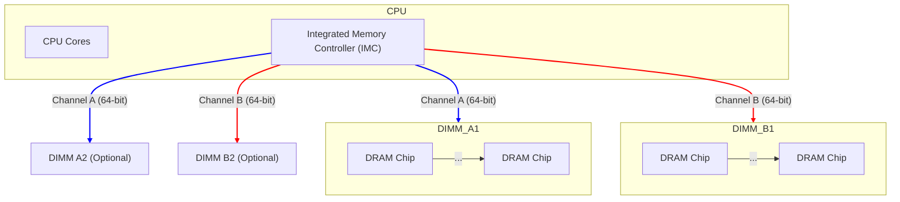
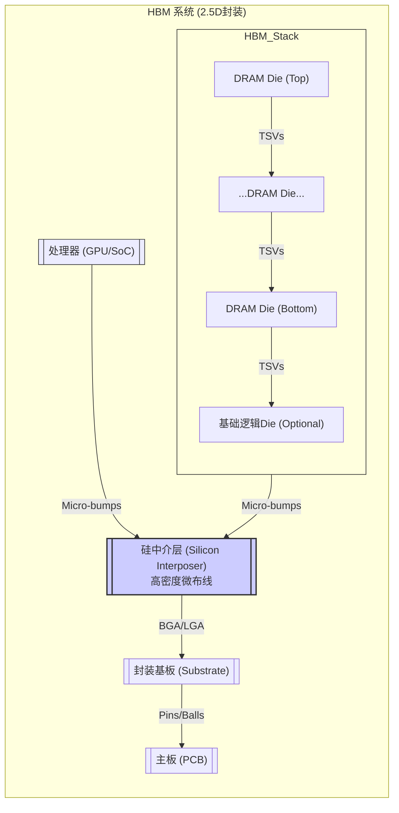

# 7. 内存总线：DRAM与高带宽内存

**(本章为重要章节，将进行详细深入的探讨)**

在现代计算系统中，CPU（以及GPU等加速器）的处理速度飞速提升，但如果不能及时、高效地获取指令和数据，再强大的处理器也无法发挥其全部潜力。连接处理器与主存储器（通常是动态随机存取存储器 - DRAM）的**内存总线 (Memory Bus)**，就成为了决定系统整体性能的关键瓶颈之一，常被称为"内存墙 (Memory Wall)"。

内存总线的设计目标是在极高的带宽和极低的延迟之间取得平衡。随着应用对内存容量和带宽需求的爆炸式增长，特别是AI、HPC和图形处理等领域的发展，内存总线技术也在不断演进，形成了以DDR SDRAM为主流，同时辅以HBM、GDDR等面向特定领域的高性能解决方案的格局。

本章将深入探讨现代内存总线技术，重点介绍主流的DDR系列（特别是DDR4到DDR5/DDR6的演进）和面向高性能计算与AI的HBM技术，并对GDDR进行简要介绍和比较。

## 7.1 DDR (Double Data Rate) SDRAM 系列：主流内存技术的演进

同步动态随机存取存储器 (Synchronous Dynamic Random-Access Memory - SDRAM) 通过使用系统时钟来同步输入输出操作，相比早期的异步DRAM，显著提高了性能。而DDR SDRAM则在SDRAM的基础上，通过在时钟的上升沿和下降沿都传输数据，实现了数据传输速率的翻倍，即所谓的**双倍数据速率 (Double Data Rate)**。

DDR系列已成为过去二十多年来PC、服务器和许多嵌入式系统主内存接口的主流标准，由JEDEC（固态技术协会）负责制定和标准化。它经历了多次重要的代际更新，每一代都在速度、容量、功耗和功能上有所提升。

### 7.1.1 DDR总线的基本原理与架构

理解DDR系列演进的基础是掌握其核心工作原理：

*   **同步操作:** 所有操作（地址、命令、数据）都与一个外部提供的差分时钟信号（CK_t / CK_c）同步。
*   **双倍数据速率 (DDR):** 数据在数据选通信号（DQS - Data Strobe）的上升沿和下降沿都被传输和锁存。DQS信号是与数据信号伴随的**源同步 (Source Synchronous)** 信号，由发送方（内存控制器或DIMM）驱动，用于接收方精确锁存数据，克服了长距离并行总线的时钟偏移问题。
*   **内存组织结构:** DRAM芯片内部由多个**存储体 (Bank)** 组成，现代DRAM进一步引入了**Bank组 (Bank Group)** 的概念。可以将对不同Bank或Bank Group的操作进行流水线处理（交错访问 Interleaving），隐藏部分延迟，提高总线利用率。
    *   访问过程：`Activate` (选中某一行 Row)，`Read/Write` (在选中的行内读写某一列 Column)，`Precharge` (关闭当前行，准备访问其他行)。
*   **预取 (Prefetch):** 为了匹配内存核心的内部数据位宽与外部I/O接口的数据位宽，并提高外部数据传输速率，DDR采用了预取技术。DDR1预取位数为2n（n为核心位宽），DDR2为4n，DDR3/DDR4为8n，DDR5为16n（但分为两个独立的32位子通道，每个子通道仍是8n预取）。预取位数增加意味着一次核心访问可以支持更多次的外部I/O传输，从而提高了外部数据速率。
    *   例如，DDR4的内部核心可能是64位，预取8n，一次核心访问可以提供 $64 \times 8 = 512$ 位数据到I/O缓冲；外部接口是64位（对于一个DIMM通道），运行时钟频率为 $f_{CK}$，数据速率为 $2 \times f_{CK}$，需要 $frac{512}{64} = 8$ 个时钟周期（4个 $f_{CK}$ 周期）来传输这些数据。核心频率是 $f_{CK}/4$。
*   **DIMM (Dual In-line Memory Module):** DRAM芯片通常焊接在DIMM印刷电路板上，通过金手指插入主板上的内存插槽。一个DIMM通常提供64位的数据接口宽度（不包括ECC位）。
*   **通道 (Channel):** 现代CPU的内存控制器通常支持多个独立的内存通道（如双通道、四通道、六通道、八通道甚至更多）。每个通道可以独立访问连接在其上的一个或多个DIMM，并行工作可以使总内存带宽加倍。


*图：典型的双通道DDR内存系统架构*

### 7.1.2 DDR4 SDRAM：成熟的主流技术

DDR4于2014年左右开始进入市场，在过去近十年中是PC和服务器领域最主流的内存技术。

*   **主要特点:**
    *   **更高的数据速率:** JEDEC标准速率从DDR4-1600 (1600 MT/s) 到 DDR4-3200 (3200 MT/s)。超频市场则远超此范围。
    *   **更低的工作电压:** 标准电压从DDR3的1.5V/1.35V降低到1.2V，有助于降低功耗。
    *   **更高的密度:** 支持更高容量的DRAM芯片（如8Gb, 16Gb），使得单条DIMM容量可以达到32GB, 64GB甚至更高（使用3DS堆叠技术）。
    *   **Bank组 (Bank Groups - BG):** 引入了Bank Group的概念（通常是4个Bank构成一个BG，共2或4个BG）。可以更快地在不同BG之间切换访问（tCCD_S vs tCCD_L），提高了总线效率。
    *   **8n预取:** 与DDR3相同。
    *   **内部VrefDQ校准:** 用于改善数据接收的信号裕度。
    *   **DBI (Data Bus Inversion):** 一种可选功能，通过反转数据总线状态来减少同时开关的输出数量，有助于降低功耗和电源噪声。
    *   **CRC校验:** 在命令/地址总线上增加了CRC校验，提高了可靠性。
    *   **点对点连接拓扑改进:** 虽然DIMM内部或通道上可能连接多个Rank，但相比DDR3，DDR4对点对点拓扑（每个通道只连一个DIMM或特定Rank）的支持更好，有利于更高频率下的信号完整性。
*   **接口:** 288-pin DIMM (台式机) / 260-pin SO-DIMM (笔记本)。
*   **市场地位:** DDR4技术成熟，成本效益高，生态系统完善。虽然DDR5已发布并逐渐普及，但DDR4在许多成本敏感和对性能要求不是极致的领域仍将继续使用一段时间。

### 7.1.3 DDR5 SDRAM：性能与架构的显著革新

DDR5是最新一代的DDR标准，于2020年正式发布，带来了相比DDR4显著的性能提升和架构变化。

*   **核心目标:** 大幅提升带宽、提高通道效率、改善电源管理、增加容量。
*   **关键革新:**
    1.  **更高的数据速率:** 起始速率即为DDR5-4800 (4800 MT/s)，JEDEC标准规划到DDR5-8400甚至更高。相比DDR4的上限3200 MT/s，带宽潜力巨大。
    2.  **更低的工作电压:** VDD/VDDQ电压进一步降低至1.1V。
    3.  **电源架构改变:** 将电源管理集成电路（**PMIC - Power Management IC**）从主板移到了**DIMM模块上**。每个DIMM独立管理其电源，可以提供更稳定、更精细的电压调节，有助于在低电压下实现高频率，并降低主板设计复杂度。
    4.  **通道架构革新:** 这是DDR5最显著的变化之一。一个DDR5 DIMM仍然提供64位的数据接口，但内部被划分为**两个独立的32位子通道 (Sub-channel / Channel A & B)**。每个子通道有自己的地址/命令总线和DQS信号。虽然物理接口宽度不变，但这在逻辑上将单个DIMM变成了"双通道"访问模式。
        *   **优势:** 提高了内存访问的并行度和通道利用率。内存控制器可以同时向同一个DIMM的两个子通道发送不同的命令，或者在一个子通道进行读写的同时，另一个子通道进行刷新等操作，大大减少了操作冲突，提高了有效带宽和效率。
    5.  **预取位数增加:** 预取位数从8n增加到**16n**。结合两个32位子通道，每个子通道的核心访问仍然是 $32 \times 8 = 256$ 位。
    6.  **突发长度 (Burst Length - BL) 增加:** 最小突发长度从DDR4的BL8增加到**BL16**。结合16n预取和双子通道，一次突发传输（BL16）需要的数据量（对于单个32位子通道）是 $32 text{ bits/cycle} \times 16 text{ cycles} = 512 text{ bits} = 64 text{ Bytes}$。这正好是一个典型的CPU缓存行（Cache Line）的大小，使得内存控制器可以更高效地填充缓存行。
    7.  **更多的Bank和Bank Group:** Bank数量增加到32个（8个Bank Group，每个BG 4个Bank），进一步提高了内部并行性和交错访问效率。
    8.  **同Bank刷新 (Same Bank Refresh):** 允许在对一个Bank进行刷新操作时，仍然可以访问同一Bank Group内的其他Bank，减少了刷新操作对性能的影响。
    9.  **片上ECC (On-die ECC):** DDR5 DRAM芯片内部集成了ECC逻辑，可以检测并纠正芯片内部存储单元发生的单比特错误。这主要是为了应对随着工艺缩小和密度增加，DRAM单元本身可靠性下降的问题，提高良品率。**注意：片上ECC不保护数据在内存总线传输过程中的错误**，它不同于传统的、在内存控制器端进行、可以纠正整个数据通路错误的**模块级ECC (Module-level ECC)**。支持模块级ECC的DDR5 DIMM（如UDIMM with ECC, RDIMM, LRDIMM）会额外增加ECC校验位（通常是8位，使总位宽达到72位）。
    10. **决策反馈均衡器 (Decision Feedback Equalizer - DFE):** 为了应对更高频率下的信号完整性挑战（码间干扰ISI），DDR5在DRAM芯片的接收端引入了DFE电路，这是首次在主流DRAM标准中集成如此复杂的均衡技术。
    11. **其他改进:** 优化的命令/地址定时（Timing），新的低功耗特性等。
*   **接口:** 288-pin DIMM / 262-pin SO-DIMM （引脚定义与DDR4不兼容）。

**DDR5 vs DDR4 总结:**

| 特性             | DDR4                      | DDR5                                   |
| ---------------- | ------------------------- | -------------------------------------- |
| **数据速率 (MT/s)** | 1600 - 3200 (JEDEC)       | 4800 - 8400+ (JEDEC)                     |
| **电压 (VDD)**     | 1.2V                      | 1.1V                                   |
| **电源管理**     | 主板 PMIC                 | **DIMM 片上 PMIC**                       |
| **通道架构**     | 单通道 (64-bit)           | **双子通道 (2 x 32-bit)**               |
| **预取 (Prefetch)**| 8n                        | **16n**                                |
| **突发长度 (BL)**  | BL8                       | **BL16**                               |
| **Bank Groups**  | 2 or 4                    | **8**                                  |
| **Banks**        | 16                        | **32**                                 |
| **刷新机制**     | All Bank Refresh          | All Bank + **Same Bank Refresh**         |
| **片上ECC**      | 无                        | **有 (On-die ECC)**                    |
| **均衡 (Rx)**    | 无 (或控制器端)           | **DFE**                                |
| **DIMM Pin**     | 288 / 260 (SO-DIMM)       | 288 / 262 (SO-DIMM) - 不兼容DDR4       |

**DDR5的优势与挑战:** DDR5带来了显著的带宽提升和效率改进，特别是双子通道架构和BL16对于提高实际应用性能非常有益。然而，其高频率也带来了更严峻的信号完整性挑战，需要更复杂的均衡技术（DFE）和更优化的主板/DIMM设计。同时，更高的起始频率和新技术（如PMIC, On-die ECC）也意味着初期成本相对较高，且可能伴随更高的延迟（虽然有效带宽提升往往能弥补）。随着技术的成熟和普及，DDR5将逐渐取代DDR4成为市场主流。

### 7.1.4 DDR6及未来：技术展望

JEDEC已经在积极制定DDR6标准，预计将继续沿着提升速率、提高效率、优化功耗的方向发展。

*   **预期目标:**
    *   **更高数据速率:** 预计起始速率可能在DDR6-8800左右，最高可能达到DDR6-12800甚至更高（可能超过17000 MT/s的规划）。
    *   **信令技术:** 为了实现如此高的速率，是否会继续使用NRZ（二电平）信令，还是会像PCIe Gen6那样转向PAM4（四电平）信令，是业界关注的焦点。PAM4可以在相同波特率下实现双倍比特率，但信号裕度更小，对噪声更敏感，需要更强的均衡和可能的FEC。目前看来，DDR6初期可能仍以NRZ为主，但更高速度下转向PAM是潜在选项。
    *   **通道架构:** 可能会继续沿用DDR5的双子通道架构，或者探索更灵活的通道划分方式。
    *   **效率提升:** 可能引入更智能的刷新机制、更优化的时序参数、更低的功耗状态。
    *   **可靠性增强:** 可能进一步改进片上ECC或探索新的可靠性技术。
*   **挑战:** 信号完整性将是最大的挑战，需要在SerDes、均衡、封装、PCB材料、连接器等各个环节持续创新。功耗和成本也是关键考虑因素。

除了DDR6，业界还在探索更长远的内存技术，例如是否需要引入光学互连、或者在内存架构上进行更根本性的变革（如近内存计算 Processing-In-Memory）。

## 7.2 HBM (High Bandwidth Memory)：AI与高性能计算的新宠

虽然DDR系列内存提供了良好的通用性能，但对于那些需要极致内存带宽的应用，如图形处理、高性能计算（HPC）和人工智能（AI）训练/推理，即使是最新的DDR5也常常显得力不从心。这些应用通常需要处理器（GPU或专用加速器）在短时间内访问海量的参数和数据，对内存带宽的需求远超传统应用。

为了突破DDR接口的带宽瓶颈（主要是受限于引脚数量和并行总线频率），**高带宽内存 (High Bandwidth Memory - HBM)** 技术应运而生。

### 7.2.1 HBM的起源与核心特点

HBM由AMD和SK Hynix等公司合作开发，并由JEDEC标准化 (JESD235)。其核心思想是通过**先进的封装技术**，将多个DRAM Die（裸片）垂直堆叠起来，并通过极宽的、短距离的接口与处理器连接，从而实现前所未有的内存带宽。

*   **垂直堆叠 (Vertical Stacking):** 多个（通常是4个、8个或更多）特制的DRAM Die垂直堆叠在一起。Die之间通过**硅通孔 (Through-Silicon Via - TSV)** 技术进行内部连接。TSV允许信号垂直穿过硅片，大大缩短了连接距离并增加了连接密度。
*   **基础逻辑Die (Base Logic Die):** 在DRAM堆栈的底部通常有一个基础逻辑Die，它不包含存储单元，而是集成了内存控制器接口逻辑、PHY（物理接口）、测试电路等。这有助于简化DRAM Die本身的设计并提高良率。
*   **硅中介层 (Silicon Interposer):** HBM堆栈和处理器（GPU或SoC）通常不是直接焊接在PCB上，而是共同封装在一个**硅中介层**之上。硅中介层是一块包含高密度微细布线的硅片，它提供了连接HBM堆栈和处理器之间数千根信号线的超短距离、超高密度互连通路。
*   **2.5D封装:** 这种将多个芯片（HBM堆栈、处理器）并排安放在硅中介层上，再整体封装到基板（Substrate）上的技术被称为**2.5D封装**（区别于将芯片直接堆叠的3D封装）。
*   **极宽的接口 (Ultra-Wide Interface):** 这是HBM实现高带宽的关键。单个HBM堆栈通过硅中介层可以提供非常宽的数据接口，通常是**1024位**。相比之下，一个DDR4/DDR5 DIMM通道只有64位。
*   **较低的时钟频率:** 由于接口极宽，HBM不需要像DDR那样追求极高的时钟频率即可实现高带宽。HBM的时钟频率通常比同期DDR低（例如，HBM2的时钟频率约为1GHz，数据速率2GT/s）。较低的频率有助于降低功耗并简化信号完整性设计（尽管接口极宽本身也带来挑战）。
*   **独立的通道:** 1024位的接口通常被划分为多个独立的通道（例如，HBM2/HBM2E通常分为8个独立的128位通道），每个通道可以独立操作，提高了访问并行度和效率。
*   **低功耗:** 相比GDDR等其他高带宽方案，HBM通常具有更好的能效比（带宽/瓦特），这得益于其较低的工作电压、较低的时钟频率和超短的传输距离。


*图：HBM与处理器通过硅中介层进行2.5D封装的示意图*

### 7.2.2 HBM版本演进

HBM标准同样经历了多代发展，每一代都在带宽、容量和功耗上有所提升。

| HBM 版本 | 发布年份 | 每个Die容量 | 堆叠Die数 | 每堆栈容量 | 每Pin速率 (GT/s) | 接口位宽 | 每堆栈带宽 (GB/s) | 通道数 | 电压 (VDD/VDDQ) |
| :------- | :------- | :---------- | :-------- | :--------- | :------------- | :------- | :---------------- | :----- | :-------------- |
| **HBM1**   | ~2013    | 1-2 Gb      | 4         | 4-8 GB     | 1.0            | 1024     | 128               | 8      | 1.3V            |
| **HBM2**   | ~2016    | 2-8 Gb      | 4 / 8     | 8-32 GB    | 1.6 - 2.4      | 1024     | 205 - 307         | 8      | 1.2V            |
| **HBM2E**  | ~2018    | 8-16 Gb     | 4 / 8 / 12| 16-96 GB   | 2.8 - 3.6      | 1024     | 358 - 461         | 8      | 1.2V / 1.35V    |
| **HBM3**   | 2022     | 8-32 Gb     | 4/8/12/16 | 16-128+ GB | 5.6 - 6.4      | 1024     | 717 - 819         | **16** | 1.1V            |
| **HBM3E** (或 HBM3 Gen2) | ~2023+   | 16-32+ Gb   | 8/12/16   | 32-192+ GB | 7.2 - 9.2+     | 1024     | 921 - 1177+       | 16     | ~1.1V           |

**关键演进趋势:**
*   **速率持续提升:** 每引脚的数据速率不断提高，是带宽增长的主要驱动力。HBM3E的速率已达HBM1的数倍。
*   **堆叠层数和容量增加:** 支持堆叠更多的DRAM Die，结合单Die容量的提升，使得单个HBM堆栈的总容量大幅增加，满足大模型等应用对内存容量的需求。
*   **通道数翻倍:** HBM3将独立通道数量从8个（每个128位）增加到16个（每个64位），进一步提高了访问粒度和并行效率。
*   **电压降低:** 工作电压逐步降低，以控制功耗。
*   **可靠性增强:** 新版本通常也包含增强的RAS（Reliability, Availability, Serviceability）特性，如改进的ECC机制。

HBM3E是当前（截至编写时）最先进的已部署或即将部署的HBM标准，单堆栈带宽已突破1TB/s大关。未来HBM4等标准将继续在这些方向上探索。

### 7.2.3 HBM的应用场景

HBM的高带宽、高容量密度和相对较低的功耗使其成为以下带宽密集型应用的首选内存解决方案：

*   **高端图形处理器 (GPUs):** 无论是游戏显卡（如NVIDIA GeForce RTX 高端系列, AMD Radeon 高端系列）还是计算卡（如NVIDIA A100/H100/B100, AMD Instinct MI系列），都广泛采用HBM作为显存，以满足高分辨率渲染、复杂着色器运算和大规模并行计算的带宽需求。
*   **人工智能 (AI) 加速器:** AI训练和推理（特别是大语言模型LLM）涉及海量参数的加载和频繁的数据移动，对内存带宽极为敏感。几乎所有主流的AI训练和高性能推理芯片（来自NVIDIA, Google (TPU), Cerebras, SambaNova等）都严重依赖HBM提供所需的带宽。
*   **高性能计算 (HPC):** 超级计算机和HPC集群中的某些处理器或协处理器也采用HBM来加速科学模拟、数据分析等内存带宽受限的应用。
*   **网络设备:** 高端交换机和路由器需要极高的包处理能力，HBM可以作为高速查找表或数据包缓冲区的内存。
*   **高端FPGA:** 一些面向数据中心和高性能计算的FPGA也开始集成HBM，以提升其处理带宽密集型任务的能力。

### 7.2.4 HBM与DDR/GDDR的对比与互补

| 特性         | HBM (e.g., HBM3E)                 | DDR (e.g., DDR5)                | GDDR (e.g., GDDR6X)           |
| ------------ | --------------------------------- | ------------------------------- | ----------------------------- |
| **主要目标** | **极致带宽**, 低功耗, 高密度      | 通用性, 成本效益, 容量          | 高带宽 (介于DDR/HBM间), 成本 | 
| **接口位宽** | **极宽 (1024-bit)**             | 窄 (64-bit per channel)         | 较窄 (32-bit per chip)        |
| **时钟频率** | **较低** (e.g., ~800MHz for 6.4GT/s)| 较高 (e.g., 2400-4200MHz)     | **极高** (e.g., >2GHz)        |
| **数据速率/pin**| 高 (e.g., 6.4-9.2+ GT/s)        | 高 (e.g., 4.8-8.4+ GT/s)        | **极高** (e.g., 19-24 GT/s)   |
| **单封装带宽**| **极高 (>1 TB/s)**              | 中等 (几十 GB/s per DIMM)     | 高 (几十 GB/s per chip)       |
| **封装形式** | **2.5D/3D (需中介层)**            | DIMM / SO-DIMM                  | 独立芯片 (BGA封装)           |
| **连接距离** | **极短 (μm-mm)**                | 长 (cm, 主板布线)               | 中等 (mm-cm, 卡上布线)        |
| **功耗/能效**| **低 / 高**                     | 中等 / 中等                   | 高 / 中低                   |
| **成本**     | **高** (封装复杂)               | 低                              | 中等                          |
| **容量扩展** | 有限 (堆叠层数)                 | 灵活 (DIMM数量/容量)          | 有限 (芯片数量)               |
| **主要应用** | 高端GPU, AI加速器, HPC          | PC/服务器主内存, 通用计算     | 中高端GPU, 网络, 汽车       |

**总结:**
*   **HBM:** 通过牺牲部分灵活性和增加大量成本（主要在封装），换取了无与伦比的带宽密度和能效，是当前满足顶级计算芯片带宽需求的最佳方案。
*   **DDR:** 作为通用主内存，提供了成本、容量、性能和灵活性的最佳平衡点。
*   **GDDR:** 介于两者之间，通过极高的单引脚速率和相对简单的封装，为GPU等应用提供了比DDR更高带宽、但比HBM成本更低的解决方案。GDDR6X甚至采用了PAM4信令来进一步提升速率。

这三种技术并非完全竞争，而是在不同的应用场景和性能/成本需求下各有侧重，形成了互补的格局。

## 7.3 GDDR (Graphics Double Data Rate) SDRAM：为图形优化的高速内存

GDDR是专门为图形处理优化的一类DRAM技术，广泛用于独立显卡的显存。它与主流的DDR SDRAM同源，但也发展出了自己独特的技术特点，以在成本可控的前提下实现比标准DDR更高的带宽。

### 7.3.1 GDDR系列的关键特点

*   **更高的时钟频率和数据速率:** GDDR通常运行在比同期DDR更高的时钟频率下，以实现更高的单引脚数据传输速率。
*   **更宽的预取:** 为了支持高频率，GDDR也采用较宽的预取（如GDDR5为8n，GDDR6为16n）。
*   **通常使用点对点接口:** 显存芯片（通常采用BGA封装）直接焊接在显卡PCB上，通过较短的点对点连接与GPU通信，有利于信号完整性。
*   **不同的电压和信令:** GDDR通常使用与DDR不同的电压标准，并且为了追求更高速度，可能采用更激进的信令技术。
*   **面向带宽优化:** GDDR的设计更侧重于最大化带宽，有时会牺牲一些延迟或功耗特性。
*   **成本低于HBM:** 相比需要复杂2.5D/3D封装的HBM，GDDR采用传统BGA封装，成本显著降低。

### 7.3.2 GDDR版本演进简介

*   **GDDR3:** 基于DDR2技术，但时钟频率更高。
*   **GDDR5:** 引入差分时钟，数据速率大幅提升（可达5-8 Gbps/pin），成为一代经典显存。
*   **GDDR5X:** GDDR5的改进版，首次在显存中引入QDR（Quad Data Rate）模式（16n预取，每个时钟周期传输4位），将速率提升至10-12 Gbps/pin。
*   **GDDR6:** 基于DDR4/DDR5技术，将接口分成两个独立的16位通道（类似DDR5），标准速率达到14-18 Gbps/pin。
*   **GDDR6X:** 由NVIDIA和Micron合作开发，在GDDR6基础上引入了**PAM4信令**，实现了更高的传输速率（19-21 Gbps/pin甚至更高），但功耗和设计复杂度也相应增加。

### 7.3.3 GDDR与DDR/HBM的区别

*   **与DDR相比:** GDDR追求更高的单引脚带宽，时钟频率更高，电压可能不同，通常不使用DIMM模块而是直接焊接。DDR更注重通用性、成本和容量扩展性。
*   **与HBM相比:** GDDR带宽低于HBM，但成本远低于HBM，封装简单。HBM通过极宽接口和先进封装实现极致带宽和能效。

GDDR在性能和成本之间提供了一个良好的折中，使其成为中高端GPU显存以及一些需要高带宽但对成本敏感的应用（如网络设备、汽车电子）的理想选择。

## 7.4 本章小结

内存总线是连接处理器与主存储器的关键通路，其带宽和延迟直接影响系统性能。本章我们深入探讨了现代主要的内存总线技术：

1.  **DDR SDRAM 系列:**
    *   **基本原理:** 同步操作、双倍数据速率（DDR）、Bank/Bank Group、预取、DIMM模块、多通道架构。
    *   **DDR4:** 成熟主流技术，1.2V电压，最高3200 MT/s，Bank Group，8n预取。
    *   **DDR5:** 显著革新。更高速率（4800+ MT/s），1.1V电压，**DIMM片上PMIC**，**双32位子通道架构**，16n预取，BL16突发长度，更多Bank/BG，片上ECC，DFE均衡。
    *   **DDR6及未来:** 追求更高速度（可能引入PAM4），继续优化效率和功耗。
    *   **定位:** 通用主内存市场，平衡性能、成本、容量和灵活性。
2.  **HBM (High Bandwidth Memory):**
    *   **核心技术:** DRAM Die垂直堆叠（TSV），基础逻辑Die，**硅中介层**，**2.5D封装**，**1024位超宽接口**，多独立通道。
    *   **版本演进:** HBM1 -> HBM2 -> HBM2E -> HBM3 -> HBM3E，速率、容量、通道数持续提升，HBM3E单堆栈带宽已超1TB/s。
    *   **应用场景:** 带宽极其敏感领域，如高端GPU、AI加速器、HPC、高端网络设备。
    *   **定位:** 极致带宽和高能效，但成本高昂，容量扩展性有限。
3.  **GDDR SDRAM 系列:**
    *   **特点:** 专为图形优化，比DDR频率/速率更高，接口相对较窄（32位/芯片），直接焊接，成本低于HBM。
    *   **版本演进:** GDDR3 -> GDDR5 -> GDDR5X (QDR) -> GDDR6 (双通道) -> GDDR6X (PAM4)。
    *   **定位:** 中高端GPU显存，以及部分需要较高带宽且对成本敏感的应用。

这三种内存技术各有优势，共同构成了现代计算系统的内存层级结构，满足了从通用计算到特定领域高性能计算的多样化需求。选择哪种内存技术取决于应用对带宽、延迟、容量、功耗和成本的具体要求。

## 7.5 本章思维导图

```mermaid
mindmap
  root((7. 内存总线：DRAM与高带宽内存 (重要章节)))
    ::icon(fa fa-memory)
    (7.1 DDR SDRAM 系列)
      ::icon(fa fa-microchip)
      (基本原理)
        (同步操作, 双倍数据速率(DDR), 源同步DQS)
        (内存组织: Bank / Bank Group)
        (预取 Prefetch: 2n/4n/8n/16n)
        (DIMM模块, 多通道架构)
      (DDR4: 成熟主流)
        (特点: 1.2V, 最高3200MT/s, Bank Group, 8n预取, CRC)
      (DDR5: 性能与架构革新)
        (特点: 1.1V, 4800MT/s+, **片上PMIC**, **双32位子通道**, 16n预取, BL16, 更多Bank/BG, SameBankRefresh, **片上ECC**, **DFE**)
      (DDR6及未来)
        (目标: 更高速率(或引入PAM4?), 提效率, 降功耗)
        (挑战: SI, 功耗, 成本)
    (7.2 HBM: AI与HPC新宠)
      ::icon(fa fa-cubes)
      (起源与核心特点)
        (目标: 极致带宽)
        (技术: **垂直堆叠(TSV)**, 基础逻辑Die, **硅中介层**, **2.5D封装**, **1024位宽接口**, 多独立通道, 低功耗)
      (版本演进 (HBM1-HBM3E))
        (趋势: 速率提升, 容量增加(堆叠层数), 通道数增加(HBM3), 电压降低)
        (HBM3E: >1 TB/s 带宽)
      (应用场景)
        (高端GPU, AI加速器, HPC, 高端网络/FPGA)
      (与DDR/GDDR对比)
        (HBM: 带宽王, 高成本)
        (DDR: 通用性, 低成本)
        (GDDR: 中间地带)
    (7.3 GDDR: 图形优化高速内存)
      ::icon(fa fa-gamepad)
      (关键特点)
        (目标: 比DDR更高带宽, 成本低于HBM)
        (技术: 高频率/速率, 宽预取, 点对点接口, BGA封装)
      (版本演进 (GDDR3-GDDR6X))
        (GDDR5X: QDR)
        (GDDR6: 双通道)
        (GDDR6X: PAM4)
      (与DDR/HBM区别)
        (vs DDR: 更快, 更专)
        (vs HBM: 更慢, 更便宜)
    (7.4 本章小结)
      ::icon(fa fa-check-circle)
    (7.5 本章思维导图)
      ::icon(fa fa-project-diagram)

``` 