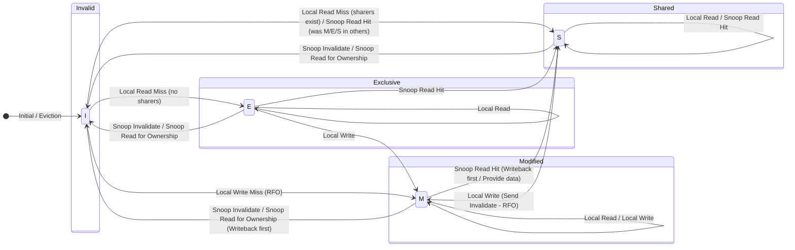
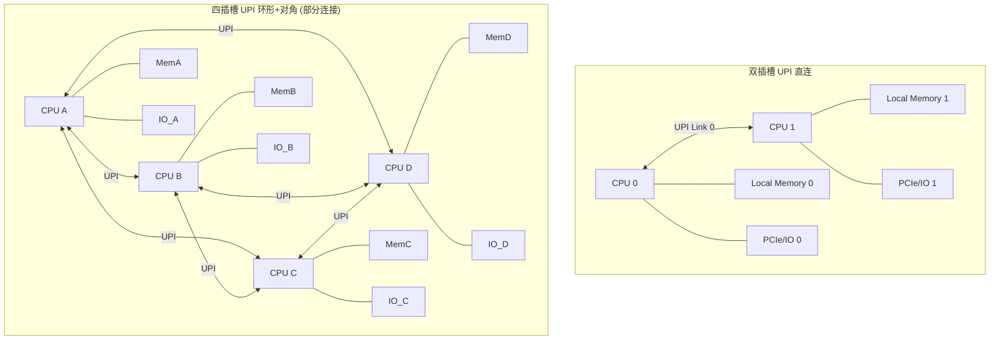
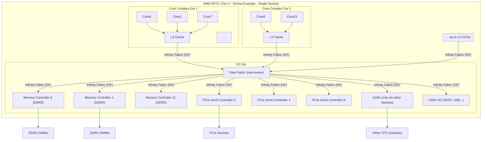

# 8. CPU互联总线：多核与多插槽的挑战

随着摩尔定律驱动单芯片集成的晶体管数量持续增加，多核（Multi-Core）处理器已成为提高计算性能的主流方式。然而，仅仅将多个CPU核心集成到同一芯片上是不够的，如何让这些核心高效地协同工作，共享数据，并与内存和I/O系统进行通信，成为了关键挑战。此外，在高端服务器和工作站领域，为了获得更强大的计算能力，常常需要使用多个CPU插槽（Multi-Socket）构成一个系统。

无论是单芯片内的多核通信，还是多插槽系统中的CPU间通信，都需要专门的高速、低延迟、支持缓存一致性的**CPU互联总线 (CPU Interconnect Bus)**。这类总线的设计直接关系到多核/多处理器系统的性能、扩展性和能效。

本章将探讨CPU互联面临的核心挑战——缓存一致性，介绍其基本概念和常用协议（如MESI），并重点讨论现代主流处理器（Intel和AMD）采用的高速互联技术：Intel UPI和AMD Infinity Fabric。

## 8.1 缓存一致性 (Cache Coherency) 与总线协议

在多核或多处理器系统中，每个核心通常拥有自己私有的高速缓存（如L1, L2 Cache），同时也可能共享较低级别的缓存（如L3 Cache）和主内存。当多个核心缓存了同一内存地址的数据副本时，如果某个核心修改了其本地副本，就必须有一种机制确保其他核心能够知道这个修改，并获得最新的数据，避免使用过时（Stale）的数据。这种确保所有缓存副本和主内存中数据保持一致状态的机制，就是**缓存一致性**。

### 8.1.1 缓存一致性问题

缺乏一致性机制会导致严重问题：
*   **数据不一致:** 不同核心读取同一内存地址，可能得到不同的（过时的）值。
*   **写操作丢失:** 一个核心的写操作可能被另一个核心后续对同一地址的写操作覆盖，而其他核心可能仍然持有更早的值。
*   **程序执行错误:** 依赖共享数据进行同步或计算的并行程序将无法正确执行。

### 8.1.2 缓存一致性协议 (Cache Coherency Protocol)

为了解决一致性问题，系统需要实现缓存一致性协议。这些协议定义了每个缓存行（Cache Line）可能处于的状态，以及在发生本地读/写或总线（互联网络）上的读/写事件时，缓存行状态如何转换，以及需要采取哪些动作（如使无效、更新、写回主存等）。

常见的两类协议是：

1.  **监听协议 (Snooping Protocol):**
    *   **原理:** 所有缓存控制器都会监听（Snoop）共享总线（或互联网络）上的地址和命令事务。当一个缓存控制器检测到可能影响其本地缓存数据一致性的事务时（例如，其他缓存要读取或写入该缓存已缓存的地址），它会根据协议采取相应的动作（如提供数据、使本地副本无效）。
    *   **特点:** 实现相对简单，适用于基于共享总线的系统。但随着核心数量增加，总线监听流量会成为瓶颈。
    *   **代表协议:** **MESI协议**及其变种（如MESIF, MOESI）是目前最广泛使用的监听协议。

2.  **目录协议 (Directory Protocol):**
    *   **原理:** 不再依赖所有缓存监听总线，而是维护一个**目录 (Directory)** 结构（通常与主内存或共享缓存关联）。目录记录了每个内存块（通常对应一个缓存行）的状态以及哪些缓存持有该块的副本。
    *   **特点:** 当一个缓存需要访问某个内存块时，它会向目录发送请求。目录根据块的状态和共享信息，向相关的缓存或主内存发送必要的命令（如请求数据、使副本无效）。避免了广播式的总线监听，扩展性更好，适用于大规模多处理器系统（如大型NUMA服务器）。但目录结构本身带来了额外的存储开销和查找延迟。

### 8.1.3 MESI协议简介

MESI是最经典的缓存一致性监听协议之一，它为每个缓存行定义了四种状态：

*   **M (Modified - 修改):**
    *   缓存行的数据已被本地核心修改，与主内存中的数据不一致。
    *   该缓存拥有此数据的**独占权 (Exclusive Ownership)**。
    *   任何其他缓存都不能持有该数据的副本。
    *   当其他缓存请求读取该数据时，此缓存必须先将修改后的数据**写回 (Write Back)** 主内存（或直接提供给请求者），然后状态可能变为S或I。
    *   当其他缓存请求写入该数据（获取独占权）时，此缓存必须先写回数据，然后将本地副本**无效 (Invalidate)**，状态变为I。
*   **E (Exclusive - 独占):**
    *   缓存行的数据与主内存一致。
    *   只有该缓存持有此数据的副本（独占）。
    *   本地核心可以自由读取该数据。
    *   当本地核心要**写入**该数据时，可以直接修改并将状态变为**M**，无需通知其他缓存（因为没有其他缓存持有副本）。
    *   当其他缓存请求**读取**该数据时，此缓存状态变为**S**。
    *   当其他缓存请求**写入**该数据时，此缓存状态变为**I**。
*   **S (Shared - 共享):**
    *   缓存行的数据与主内存一致。
    *   可能有**多个**缓存同时持有该数据的副本。
    *   本地核心可以自由读取该数据。
    *   当本地核心要**写入**该数据时，不能直接修改。必须先发出一个**使无效 (Invalidate)** 命令到总线上，通知所有其他持有副本的缓存将它们的状态变为**I**。写入完成后，本地缓存状态变为**M**（这种请求独占权的写操作通常称为 RFO - Request For Ownership）。
    *   当其他缓存请求读取该数据时，状态保持为S。
    *   当其他缓存发出Invalidate命令（请求写入）时，本地状态变为**I**。
*   **I (Invalid - 无效):**
    *   缓存行的数据是无效的，或者说该缓存不持有此数据的有效副本。
    *   本地核心**读取**该数据时，会发生**缓存未命中 (Cache Miss)**，需要从主内存或其他缓存（状态为M或E或S）获取数据。获取后状态可能变为E或S。
    *   本地核心**写入**该数据时，也会发生缓存未命中。需要先获取数据的独占权（发出RFO），然后写入数据，状态变为M。

**MESI状态转换图 (简化):**


*图：简化的MESI协议状态转换示意图（箭头表示事件和状态变化）*

**MESI的变种:**
*   **MESIF:** 增加一个**F (Forward)** 状态，表示在多个共享者（S状态）中，由F状态的缓存负责响应其他缓存的读请求，减少不必要的内存访问。
*   **MOESI:** 增加一个**O (Owned)** 状态，表示缓存数据已被修改（脏数据），但可能有其他缓存持有共享副本（S状态）。处于O状态的缓存负责响应读请求（提供脏数据），并在必要时写回内存。这可以避免在共享读时必须先写回内存。

现代CPU互联协议（如UPI、Infinity Fabric）通常实现了基于MESI变种的缓存一致性协议，并通过高速的点对点链路来传递一致性消息（探听Snoop、使无效Invalidate、数据响应等）。

## 8.2 Intel UPI (Ultra Path Interconnect)：NUMA架构下的CPU互联

UPI是Intel用于其至强（Xeon）可扩展处理器（Scalable Processors）的多插槽服务器平台的高速点对点互联技术，取代了之前的QPI (QuickPath Interconnect)。

*   **背景:** 随着CPU核心数量增加和多插槽系统成为常态，CPU之间需要极高带宽、极低延迟的互联通路来传输数据和维持缓存一致性，尤其是在**非一致性内存访问 (NUMA - Non-Uniform Memory Access)** 架构下。
    *   在NUMA系统中，每个CPU插槽（及其连接的内存）构成一个**NUMA节点 (Node)**。CPU访问本地内存（连接到同一插槽的内存）的速度快、延迟低，而访问远程内存（连接到其他插槽的内存）则需要通过CPU互联总线，速度较慢、延迟较高。
    *   高效的CPU互联对于降低远程内存访问延迟、实现跨节点缓存一致性至关重要。
*   **技术特点:**
    *   **点对点链路:** 每个UPI链路直接连接两个CPU插槽或CPU与芯片组（部分场景）。
    *   **高速串行:** 采用高速差分信号传输，速度随处理器代数提升（例如，早期UPI为9.6 GT/s或10.4 GT/s，后续提升至11.2 GT/s甚至更高）。
    *   **多链路支持:** 高端处理器通常支持多个UPI链路（如2个、3个、甚至6个），以构建不同的多插槽拓扑（如2路直连、4路/8路环形或全连接等），提供更高的聚合带宽和冗余。
    *   **分层协议:** UPI也采用分层协议架构：
        *   **物理层 (Physical Layer):** 负责电气信号传输、SerDes、链路训练等。与PCIe物理层有相似之处但电气特性不同。
        *   **链路层 (Link Layer):** 负责可靠传输（CRC校验、重传机制）、流控制（基于信用的流控）。数据以固定大小的**FLIT (Flow Control Unit)**（通常80位或更大）为单位进行传输。
        *   **协议层 (Protocol Layer):** 负责处理缓存一致性协议（基于MESIF的变种）、地址/命令路由、事务排序、NUMA优化等。
    *   **缓存一致性:** 实现基于目录（Directory-based）辅助的监听协议（Directory-Assisted Snooping）。每个节点维护一个目录信息（可能在L3缓存或专用结构中），用于跟踪哪些远程节点可能缓存了本地内存的数据，从而可以进行目标性的探听（Targeted Snooping），而不是向所有节点广播，提高了扩展性。
    *   **低延迟:** 协议和物理层都为低延迟做了优化。
    *   **高带宽:** 多条高速UPI链路提供了CPU间TB/s级别的聚合带宽。


*图：Intel UPI在不同多插槽系统中的连接拓扑示例*

**UPI的重要性:** UPI是构建高性能、可扩展Intel服务器平台的基石，它直接决定了多插槽系统的NUMA性能和整体计算能力。

## 8.3 AMD Infinity Fabric (IF)：灵活可扩展的片上/片间互联

Infinity Fabric是AMD自Zen架构开始引入的一种模块化、可扩展的互联技术，不仅用于连接CPU核心、缓存、内存控制器、I/O控制器等**片上 (On-Chip)** 部件，也用于实现多芯片模块（MCM）中的**芯片间 (Die-to-Die)** 互联以及多插槽系统中的**CPU间 (Socket-to-Socket)** 互联。

*   **设计理念:** 提供一种统一的、可伸缩的互联架构，适应从消费级APU到高端服务器CPU（EPYC -霄龙）的各种产品形态。
*   **核心组成:** Infinity Fabric 包含两个主要部分：
    *   **数据结构 (Data Fabric - DF):** 负责传输数据。它连接CPU核心（通过L3缓存）、内存控制器、PCIe控制器、SATA/USB等I/O控制器。在片上，DF通常与内存时钟频率（MCLK）同步或成一定比例（UCLK = MCLK/2 或 MCLK），以优化内存访问性能。
    *   **控制结构 (Control Fabric - CF):** 负责传输控制信号，包括配置、电源管理、安全、时钟等。通常运行在一个较低的、固定的频率。
*   **技术特点:**
    *   **可扩展性:** IF链路的位宽和频率可以根据需求进行配置。
    *   **低延迟:** 设计注重降低通信延迟。
    *   **高带宽:** 通过调整位宽和频率提供高数据传输能力。
    *   **模块化:** 基于IF可以方便地集成不同的IP模块（核心、IO、内存控制器等）。
    *   **缓存一致性:** 实现基于MOESI变种的监听协议。在MCM设计（如EPYC的多CCD/IOD结构）和多插槽系统中，IF负责传递一致性消息。
    *   **NUMA支持:** 在多插槽EPYC系统中，IF构成了节点间的互联网络，支持NUMA架构。
    *   **物理层:** 物理层实现根据应用场景不同而有所差异：
        *   **片上互联:** 使用短距离、低功耗的并行或串行物理接口。
        *   **芯片间/CPU间互联 (xGMI - Global Memory Interconnect):** 使用高速串行差分信号，类似于UPI，速度不断提升（例如，早期EPYC为~18 GT/s，EPYC Genoa/Bergamo提升至更高）。同样采用分层协议，支持多条链路构建不同拓扑。
*   **在EPYC处理器中的应用:** AMD EPYC处理器采用MCM设计，将多个CPU核心晶片（CCD - Core Complex Die）和一个I/O晶片（IOD - I/O Die）封装在一起。CCD内部核心间、CCD与IOD之间、以及IOD上的内存控制器/PCIe控制器之间都通过Infinity Fabric（主要是Data Fabric）连接。IOD还负责提供连接其他插槽的xGMI链路。


*图：AMD EPYC处理器内部基于Infinity Fabric的互联架构示意图*

**Infinity Fabric的优势:** 其统一、模块化的设计理念使得AMD能够灵活地构建从低功耗APU到拥有大量核心和内存通道的高性能服务器CPU。IF的性能直接影响着AMD处理器的核心间通信效率、内存访问性能以及多插槽扩展能力。

## 8.4 其他处理器互联技术

除了Intel UPI和AMD Infinity Fabric，还有一些其他的处理器互联技术值得关注，尤其是在ARM架构服务器和HPC领域：

*   **ARM Neoverse CMN (Coherent Mesh Network):** ARM为Neoverse系列服务器核心设计的片上可扩展网状互联（Mesh Interconnect）技术，支持大规模核心数量（如64核、128核甚至更多）的连接，并实现缓存一致性（基于AMBA CHI - Coherent Hub Interface 协议）。CMN注重可配置性、高带宽和低延迟。
*   **NVIDIA NVLink-C2C:** 虽然NVLink主要用于GPU间互联（详见第12章），但NVIDIA也推出了NVLink-C2C (Chip-to-Chip) 技术，用于连接CPU（如NVIDIA Grace CPU）和GPU（如Hopper GPU）或其他加速器，构建高性能异构计算平台。它提供极高的带宽（如900 GB/s）和统一的内存地址空间，并支持缓存一致性。
*   **开放标准互联 (如 CXL - Compute Express Link):** CXL不仅仅是内存扩展和设备互联协议（详见第14章），其CXL.cache和CXL.mem协议也定义了CPU与加速器之间、甚至未来可能CPU与CPU之间实现缓存一致性互联的方式。CXL作为一种开放标准，有望在未来的异构计算和多处理器系统中扮演越来越重要的角色。

## 8.5 本章小结

CPU互联总线是现代多核、多插槽处理器系统发挥性能的关键，本章我们探讨了其核心挑战和主流技术：

1.  **缓存一致性:** 是多核/多处理器系统面临的核心问题，确保不同缓存中同一数据的副本保持一致。主要通过**监听协议 (Snooping)** 或**目录协议 (Directory)** 来实现。
2.  **MESI协议:** 最经典的监听协议之一，定义了缓存行的Modified, Exclusive, Shared, Invalid四种状态及其转换规则。现代协议通常是其变种（MESIF, MOESI）。
3.  **Intel UPI:** 用于Intel Xeon可扩展处理器的多插槽互联。采用高速点对点串行链路，分层协议，实现基于目录辅助的监听缓存一致性协议，支持NUMA架构。
4.  **AMD Infinity Fabric:** AMD的统一、模块化互联技术，用于片上（核心、IO、内存）和片间/CPU间（xGMI）连接。包含数据结构（DF）和控制结构（CF），实现基于MOESI变种的监听协议。
5.  **其他技术:** ARM Neoverse CMN（用于大规模ARM核心互联），NVIDIA NVLink-C2C（用于CPU-GPU等异构互联），以及开放标准CXL在一致性互联方面的潜力。

高效的CPU互联技术对于提升系统整体性能、降低内存访问延迟、支持更大规模的并行计算至关重要。随着核心数量的持续增加和异构计算的普及，CPU互联技术将继续向更高带宽、更低延迟、更好扩展性和更灵活一致性模型的方向发展。

## 8.6 本章思维导图

```mermaid
mindmap
  root((8. CPU互联总线：多核与多插槽的挑战))
    ::icon(fa fa-network-wired)
    (8.1 缓存一致性 Cache Coherency)
      ::icon(fa fa-sync)
      (问题: 多核缓存副本数据不一致)
      (协议 Protocols)
        (监听协议 Snooping)
          (原理: 监听总线/网络事务)
          (特点: 简单, 总线瓶颈)
          (代表: MESI及其变种)
        (目录协议 Directory)
          (原理: 维护目录跟踪副本状态)
          (特点: 扩展性好, 开销/延迟)
      (MESI协议)
        (状态: Modified, Exclusive, Shared, Invalid)
        (核心: 定义状态转换规则)
        (变种: MESIF, MOESI)
    (8.2 Intel UPI (Ultra Path Interconnect))
      ::icon(fa fa-server)
      (背景: Xeon多插槽互联, 取代QPI, NUMA)
      (技术特点)
        (点对点高速串行链路)
        (多链路支持不同拓扑)
        (分层协议 (物理/链路/协议))
        (FLIT传输)
        (一致性: 目录辅助监听 (MESIF变种))
      (重要性: 构建可扩展Intel服务器平台基石)
    (8.3 AMD Infinity Fabric (IF))
      ::icon(fa fa-infinity)
      (设计理念: 统一/模块化/可扩展互联)
      (核心组成)
        (数据结构 Data Fabric (DF): 传数据, 片上/片间)
        (控制结构 Control Fabric (CF): 传控制信号)
      (技术特点)
        (可扩展/低延迟/高带宽)
        (一致性: MOESI变种监听)
        (NUMA支持)
        (物理层: 片上/芯片间(xGMI高速串行))
      (应用: EPYC (CCD/IOD互联, Socket互联))
      (优势: 灵活构建不同产品)
    (8.4 其他处理器互联技术)
      ::icon(fa fa-microchip)
      (ARM Neoverse CMN: 片上Mesh互联, AMBA CHI)
      (NVIDIA NVLink-C2C: CPU-GPU异构互联, 高带宽, 一致性)
      (开放标准 CXL: CXL.cache/mem潜力)
    (8.5 本章小结)
      ::icon(fa fa-check-circle)
    (8.6 思维导图)
      ::icon(fa fa-project-diagram)

``` 