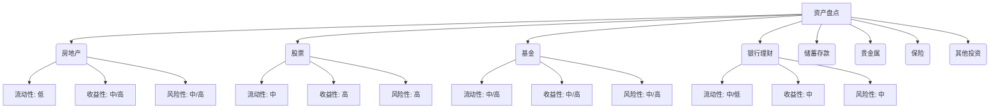

# 第一章：审视家底——中国资产盘点与优化

在开启为期三年的加拿大工作旅程之前，首要且至关重要的一步便是对您在中国的现有资产进行一次全面、细致的"体检"。这不仅能帮助您清晰了解当前的财务状况，更能为后续的跨境资产配置、风险管理以及税务规划奠定坚实的基础。本章将指导您如何系统地盘点和优化您在中国的各类资产，确保在您远赴他乡之际，国内的"大后方"能够稳健运作，甚至持续增值。

## 1.1 境内资产梳理：流动性、收益性、风险性评估（房产、股票、基金、理财等）

全面梳理境内资产是后续所有规划的前提。我们需要从流动性、收益性和风险性三个核心维度，对每一类资产进行深入剖析。

### 1.1.1 资产分类与信息收集

首先，列出您在中国持有的所有资产类别，并收集相关详细信息。常见的资产类别包括：

*   **房地产：**
    *   **信息收集：** 房产证（或购房合同）、当前市场估值（可参考近期同小区成交价或咨询中介）、贷款合同（如有）、月供金额、剩余贷款年限、租金收入（如有）、物业费、取暖费等持有成本。
    *   **关注点：** 房产的地理位置、房龄、户型、学区、周边配套、未来升值潜力、变现难易程度。

*   **股票：**
    *   **信息收集：** 股票代码、持股数量、买入成本、当前市值、所属行业、上市公司基本面情况。
    *   **关注点：** 个股的波动性、成长性、分红政策，以及整体A股市场的宏观趋势。

*   **基金：**
    *   **信息收集：** 基金代码、持有份额、买入净值、当前净值、基金类型（股票型、债券型、混合型、货币型、QDII等）、基金经理、基金公司、历史业绩。
    *   **关注点：** 基金的投资策略、风险等级、费率结构（申购费、赎回费、管理费、托管费）。

*   **银行理财产品：**
    *   **信息收集：** 产品名称、购买金额、预期收益率、产品期限、风险等级、资金投向、赎回规则。
    *   **关注点：** 产品的发行机构、是否保本、流动性安排（如提前赎回条款）。

*   **储蓄存款：**
    *   **信息收集：** 银行名称、账户类型（活期、定期）、存款金额、利率、到期日（定期）。
    *   **关注点：** 流动性极佳，但收益性较低，主要作为应急备用金。

*   **贵金属（黄金、白银等）：**
    *   **信息收集：** 持有形式（实物黄金、纸黄金、黄金ETF等）、购买克重/盎司、购买价格、当前市场价格。
    *   **关注点：** 避险属性，但价格波动受全球经济、政治因素影响较大。

*   **保险产品（具有现金价值的）：**
    *   **信息收集：** 保单号、保险类型（如增额终身寿、年金险）、当前现金价值、缴费年限、保障利益。
    *   **关注点：** 保险的核心功能是保障，但部分产品兼具储蓄和投资属性。

*   **其他投资：** 如信托产品、P2P（需谨慎评估风险）、股权投资、收藏品等。
    *   **信息收集：** 投资合同、当前估值、退出机制。
    *   **关注点：** 此类投资通常风险较高，流动性较差，需要特别关注。

### 1.1.2 流动性评估

流动性是指资产转换为现金的速度和难易程度，以及转换过程中的成本。在您即将开始跨境生活时，保持一定的资产流动性至关重要，以应对突发状况或抓住新的投资机会。

*   **高流动性资产：** 现金、活期存款、货币基金、短期银行理财（如T+0或7天内可赎回）。这类资产可以快速变现，损失本金的风险极低。
*   **中等流动性资产：** 股票（交易活跃）、部分开放式基金、定期存款（可提前支取但损失利息）。变现相对容易，但可能面临一定的价格波动或利息损失。
*   **低流动性资产：** 房地产、非上市股权、部分长期理财产品、信托产品、收藏品。这类资产变现周期长，交易成本高，且市场价格不确定性大。

**思考与行动：**
*   评估您未来3-6个月在加拿大初期可能需要的应急资金，确保有足够的高流动性资产覆盖。
*   对于低流动性资产，特别是房产，如果您预计在加拿大工作期间或期满后有变现需求，应提前规划，了解市场行情和交易流程。

### 1.1.3 收益性评估

收益性是指资产在一定时期内产生回报的能力，通常用年化收益率来衡量。不同的资产类别具有不同的收益潜力。

*   **低收益资产：** 活期存款、大部分货币基金。收益稳定，但难以跑赢通货膨胀。
*   **中等收益资产：** 定期存款、银行理财产品、债券基金。收益相对稳定，风险适中。
*   **高收益潜力资产：** 股票、股票型基金、部分混合型基金、房地产（考虑租金回报和增值）。收益潜力大，但同时伴随较高风险。

**思考与行动：**
*   对比您各项资产的实际收益率与市场同类产品的平均收益水平，判断是否有优化空间。
*   结合您的风险承受能力和财务目标（详见第三章），审视当前的资产配置是否过于保守或过于激进。

### 1.1.4 风险性评估

风险性是指资产价值发生不利变动的可能性，以及可能造成的损失程度。风险与收益往往成正比。

*   **低风险资产：** 国债、政策性金融债、银行存款（50万以内受存款保险保护）、保本型理财。本金损失的风险极低。
*   **中等风险资产：** 信用债、债券基金、部分混合基金、黄金。存在一定的市场风险、信用风险或利率风险。
*   **高风险资产：** 股票、股票型基金、非保本浮动收益理财、信托产品、P2P、非上市股权。可能面临较大的本金损失风险。

**思考与行动：**
*   识别您资产组合中风险最高的资产，评估其潜在下行空间以及您是否能够承受。
*   考虑资产之间的相关性，避免风险过于集中在某一类资产或某一特定行业。例如，如果您的主要收入来源和大部分投资都集中在房地产行业，则风险集中度较高。
*   思考地缘政治风险、政策风险等宏观因素对您资产的影响。

**资产评估汇总表示例 (Mermaid Diagram):**

*（注：上图仅为示例，具体评估需结合资产实际情况）*

## 1.2 负债情况分析：房贷、消费贷等处理策略

清晰了解资产状况的同时，全面审视负债也同样重要。合理的负债管理可以优化现金流，降低财务风险。

### 1.2.1 负债梳理

列出您所有的负债项目及其详细信息：

*   **住房贷款：**
    *   **信息收集：** 贷款银行、贷款总额、剩余本金、贷款利率（LPR加点情况）、还款方式（等额本息/等额本金）、月供金额、剩余还款年限。
    *   **关注点：** 是否为家庭主要负债，利率水平是否具有竞争力。

*   **汽车贷款：**
    *   **信息收集：** 贷款机构、贷款总额、剩余本金、贷款利率、月供金额、剩余还款年限。
    *   **关注点：** 利率通常高于房贷，是否考虑提前还款。

*   **信用卡欠款：**
    *   **信息收集：** 各张信用卡的账单日、还款日、当前欠款总额、分期付款情况（如有）及其手续费率。
    *   **关注点：** 避免产生高额的循环利息和滞纳金。

*   **消费贷款（如蚂蚁借呗、京东白条等）：**
    *   **信息收集：** 贷款平台、借款金额、利率（通常以日利率或月利率显示，需转换为年化利率进行比较）、还款期限。
    *   **关注点：** 此类贷款利率通常较高，应优先处理。

*   **个人经营性贷款（如适用）：**
    *   **信息收集：** 贷款用途、贷款机构、利率、还款方式、抵押/担保情况。

*   **民间借贷（如有）：**
    *   **信息收集：** 债权人、借款金额、约定利率、还款期限、有无借据或合同。
    *   **关注点：** 风险较高，需谨慎处理，避免法律纠纷。

### 1.2.2 负债处理策略思考

在出国前，根据负债的性质、利率高低以及对您现金流的影响，制定相应的处理策略：

*   **高利率负债优先偿还：** 如信用卡透支未分期部分、部分消费贷款、民间高利贷等。这些负债的年化利率可能非常高，长期拖欠会侵蚀您的资产。动用部分流动性资产提前清偿这类债务，可以有效降低财务成本。
*   **房贷处理：**
    *   **持续还款：** 如果房产计划长期持有并出租，租金收入可以覆盖或部分覆盖月供，那么可以维持正常还款。确保在国内银行账户留有充足资金用于自动扣款，并设置提醒。
    *   **提前部分还款或一次性还清：** 如果手头有充裕资金，且房贷利率相对较高（例如，早期的商业贷款利率或LPR转换时选择了固定利率且当前LPR较低），可以考虑提前还款以节省利息。但需注意银行关于提前还款的规定（如是否需要支付违约金，每年可提前还款的次数和金额限制）。
    *   **考虑因素：** 提前还房贷意味着这部分资金失去了其他投资机会的可能。需要比较房贷利率与您能获得的稳健投资回报率。如果您的投资回报率有把握持续高于房贷利率，则不必急于提前还款。对于三年后可能回国发展的人士，保留一定的优质负债（如低利率房贷）有时也是一种财务杠杆。
*   **消费贷和车贷：** 评估其利率水平。如果利率不高，且不影响您的现金流，可以按计划还款。如果利率较高，可考虑提前结清。
*   **设立自动还款与监控机制：** 对于所有需要按期偿还的贷款，务必设置自动还款，并定期检查还款情况，避免因疏忽导致逾期，影响个人信用记录。这对于跨境人士尤为重要，因为您可能无法及时收到国内银行的纸质账单或短信提醒。

**思考：** 您的"债务健康度"如何？总负债占总资产的比例是否合理（一般建议低于50%）？每月还款总额占您（或家庭）国内总收入（或预期租金收入）的比例是否在可控范围内（一般建议低于30-40%）？

## 1.3 人民币资产的短期与长期规划：是否需要调整配置？

在对资产和负债有了清晰的认识后，接下来需要思考的是，鉴于您即将在加拿大工作生活三年，现有的人民币资产配置是否需要进行调整。调整的出发点应围绕您的短期（未来3年）和长期（3年后，无论回国还是其他打算）规划。

### 1.3.1 短期规划（未来3年，加拿大工作期）

*   **流动性优先：** 确保有足够的人民币现金或高流动性资产（如货币基金）用于：
    *   支付国内的必要开销（如留守家庭的生活费、未结清的账单、物业费等）。
    *   应对突发事件（如家人健康问题需要用钱）。
    *   作为潜在的换汇资金储备，在汇率合适时购汇。
*   **稳健为主：** 对于在3年内可能需要动用的人民币资金，投资策略应以稳健、低风险为主。例如，可以配置部分短期银行理财、中短期纯债基金等。避免将这部分资金投入高波动性的股票市场或长期锁定的产品。
*   **远程管理便利性：** 选择那些易于通过网上银行、手机App进行远程管理的金融产品。确保您的银行账户、证券账户等已开通相应的电子渠道服务，并熟悉操作流程。

### 1.3.2 长期规划（3年后）

长期规划需要结合您对3年后个人发展的初步设想：

*   **计划回国发展：**
    *   **人民币核心资产的保留与增值：** 如果计划回国，那么人民币资产仍是您未来生活的基础。对于具有长期增长潜力的优质资产（如核心地段房产、优质公司股票、指数基金定投），可以考虑长期持有。
    *   **关注国内投资机会：** 即使身在加拿大，也应适当关注中国经济发展和资本市场动态，适时调整长期投资组合。
*   **可能考虑移民或继续在海外发展：**
    *   **逐步增加外币资产比重：** 如果有此倾向，那么在国内人民币资产的配置上，可能需要考虑逐步降低不易跨境转移或管理成本较高的资产（如部分房产可考虑在合适时机出售）。
    *   **为资产跨境转移做准备：** 了解相关的外汇政策和合规路径（详见第二章）。
*   **尚未决定：**
    *   **保持灵活性：** 如果未来计划不确定，资产配置应兼顾稳健性和一定的灵活性。避免进行大规模、长期且不可逆的投资决策。
    *   **多元化配置：** 适当分散投资于不同类型的资产，以应对未来不同情境下的需求。

### 1.3.3 是否需要调整配置的考量因素

*   **当前资产配置的合理性：** 通过1.1的评估，您的资产配置是否过于集中？风险是否过高或过低？流动性是否充足？
*   **对未来现金流的需求：** 您在加拿大期间，国内是否仍有稳定的现金流入（如房租）？这些流入能否覆盖国内的支出和债务？
*   **个人风险承受能力的变化：** 即将远赴异国他乡，不确定性增加，您的风险偏好是否会变得更加保守？
*   **对中加两国经济和市场的预期：** 您对未来几年人民币汇率、中国股市/楼市以及加拿大经济的看法，也会影响您的配置决策。

**大师建议：** 启程前的资产配置调整，不宜进行"翻天覆地"式的剧烈变动，尤其是在您对加拿大生活和金融环境尚不熟悉的情况下。首要目标是**优化结构、保障流动性、控制风险**。可以将一部分原本用于激进投资的资金，调整到更稳健或更具流动性的产品上。对于长期看好的核心资产，不必急于卖出，但要确保有妥善的远程管理方案。

## 1.4 中国金融账户管理：银行卡、证券账户、支付工具的跨境适用性

在您离开中国之前，妥善安排好各类金融账户的跨境管理至关重要，这将直接影响您在加拿大期间处理国内事务的便捷性和安全性。

### 1.4.1 银行账户

*   **保留必要的借记卡：**
    *   至少保留一张常用的国有大行或股份制银行的借记卡，作为国内资金的主要归集和支付账户。
    *   **开通网银和手机银行：** 确保已开通最高权限的网上银行和手机银行服务，包括转账、查询、理财购买/赎回等功能。测试并熟悉其操作流程。
    *   **预留手机号码：** 务必确保银行预留的手机号码是您在加拿大期间能够正常接收短信（包括验证码）的号码。可以考虑开通国际漫游，或使用国内副号（如通过某些App实现）接收短信。这是进行网银操作、接收银行通知的关键。
    *   **了解跨境取现/查询手续费：** 了解该银行卡在加拿大ATM取现或查询余额的收费标准。虽然不建议作为主要取现方式（成本高），但应急时可能用到。
    *   **提升转账限额（如需）：** 根据您的需要，提前到银行柜台调整网银或手机银行的单日/单笔转账限额。
*   **信用卡：**
    *   **保留1-2张全币种或多币种信用卡：** Visa或Mastercard标识的信用卡在加拿大通用性较好。选择那些境外消费返现、免货币转换费或提供航空里程的卡片。
    *   **通知银行出行计划：** 在出国前，主动联系信用卡发卡行，告知您的出行时间和目的地，避免因触发银行的风控机制而被暂停使用。
    *   **设置消费提醒：** 开通短信或App消费提醒，及时掌握信用卡消费情况。
    *   **了解盗刷处理流程：** 了解银行关于信用卡境外盗刷的处理政策和联系方式。
    *   **自动还款设置：** 确保信用卡已绑定国内借记卡进行自动还款，避免逾期。

### 1.4.2 证券账户

*   **确认交易权限与方式：**
    *   如果您持有A股、基金等，确认您的证券账户是否支持通过官方App或网上交易系统进行远程操作。
    *   测试登录和交易流程，确保在境外网络环境下依然可以顺畅使用。
    *   同样注意预留手机号接收验证码的问题。
*   **资金密码与交易密码：** 牢记并妥善保管，避免混淆。
*   **长期不操作账户的激活：** 如果有长期未使用的证券账户，且计划未来可能使用，建议在出国前激活，避免届时需要本人到柜台办理的麻烦。

### 1.4.3 支付工具（支付宝、微信支付）

*   **实名认证与绑定银行卡：** 确保支付宝和微信支付已完成高级别的实名认证，并绑定了您计划在加拿大期间仍能正常使用的国内银行卡。
*   **跨境支付功能：**
    *   支付宝和微信支付在部分加拿大商家可以使用，尤其是在华人聚集区。了解其境外使用的汇率计算方式和有无手续费。
    *   它们也可以用于向国内亲友转账或支付国内的一些在线服务费用。
*   **安全性：** 保护好登录密码和支付密码，开启设备锁、指纹/面容支付等安全设置。警惕在境外连接不安全的Wi-Fi网络时使用支付工具。
*   **预留手机号：** 支付宝和微信支付的许多安全验证也依赖手机短信。

### 1.4.4 其他注意事项

*   **重要文件备份：** 将身份证、护照、银行卡正反面、重要合同等文件进行扫描或拍照，存储在安全的云端或随身携带的U盘中，以备不时之需。
*   **销户或账户降级：** 对于不再使用或余额极少的银行账户，可以考虑在出国前进行销户处理，避免产生不必要的年费或管理费，也降低被盗用的风险。对于一些睡眠户，银行可能会自动进行账户降级或限制非柜面交易。
*   **授权家人处理（谨慎选择）：** 在极端情况下，如果有些事务必须本人或持授权书在国内办理，可以考虑是否需要提前办理相关授权公证，授权您信任的家人代为处理。但这涉及较大风险，需非常谨慎。

**跨境账户管理核心：确保通讯畅通（手机能收短信）、熟悉电子渠道操作、做好安全防范。**

## 1.5 实操流程：制定个人/家庭资产负债表（中国部分）

理论学习的最终目的是实践。制定一份清晰的个人或家庭资产负债表，是审视家底、优化配置的第一步，也是后续所有财务规划的数据基础。

### 1.5.1 什么是资产负债表？

资产负债表（Balance Sheet）是一张在特定时间点（例如，2024年X月X日）反映个人或家庭财务状况的快照。它主要由三部分构成：
*   **资产（Assets）：** 你所拥有的有价值的东西。
*   **负债（Liabilities）：** 你所欠别人的钱。
*   **净资产（Net Worth）：** 资产减去负债的差额，代表你真正的"家底"。
    $Net Worth = Assets - Liabilities$

### 1.5.2 制定步骤

1.  **确定统计时点：** 选择一个具体的日期作为你资产负债表的"截止日期"，例如出国前一周的某一天。
2.  **列出所有资产项目并估值：**
    *   **流动资产：**
        *   现金及活期存款：记录准确金额。
        *   货币基金：记录当前市值。
        *   短期理财产品：记录当前本息总额或预计可赎回金额。
        *   股票账户可用余额：记录准确金额。
    *   **投资资产：**
        *   股票：按统计时点的收盘价计算市值。
        *   基金：按统计时点的基金净值计算市值。
        *   银行理财（中长期）：记录购买本金及应计利息（或当前估值）。
        *   贵金属：按统计时点的市场价格计算价值。
        *   投资性房产：参考近期市场成交价或专业评估价（需注明估值方法和来源，可以取一个相对保守的估值）。
    *   **自用资产：**
        *   自用房产：同投资性房产估值方法。
        *   汽车：参考二手车市场估值（折旧较快，可不计入或象征性计入，除非价值很高）。
        *   其他有价值的个人物品（如收藏品，估值较难，谨慎计入）。
    *   **保险资产：**
        *   具有现金价值的保单：查询并记录当前的现金价值。
3.  **列出所有负债项目并记录金额：**
    *   **短期负债（一年内到期）：**
        *   信用卡应付款：记录账单总额。
        *   消费贷款（一年内到期部分）：记录剩余本金。
    *   **长期负债（一年以上到期）：**
        *   住房贷款：记录剩余贷款本金。
        *   汽车贷款：记录剩余贷款本金。
        *   其他长期贷款：记录剩余本金。
4.  **计算总资产、总负债和净资产：**
    *   总资产 = 各项资产金额之和。
    *   总负债 = 各项负债金额之和。
    *   净资产 = 总资产 - 总负债。

### 1.5.3 资产负债表示例模板 (Excel/Numbers 格式更佳)

| **资产 (Assets)**             | **金额 (RMB)** | **负债 (Liabilities)**        | **金额 (RMB)** |
| :---------------------------- | :------------- | :---------------------------- | :------------- |
| **一、流动资产**              |                | **一、短期负债**              |                |
| 现金及活期存款                |                | 信用卡应付款                  |                |
| 货币基金                      |                | 短期消费贷款（一年内）        |                |
| 短期理财产品                  |                | 其他短期负债                  |                |
| 股票账户余额                  |                | *短期负债合计*                |                |
| *流动资产合计*                |                | **二、长期负债**              |                |
| **二、投资资产**              |                |                               |                |
| 股票市值                      |                | 住房贷款余额                  |                |
| 基金市值                      |                | 汽车贷款余额                  |                |
| 中长期理财产品                |                | 其他长期负债                  |                |
| 贵金属                        |                | *长期负债合计*                |                |
| 投资性房产（估值）            |                |                               |                |
| 保单现金价值                  |                |                               |                |
| 其他投资                      |                |                               |                |
| *投资资产合计*                |                |                               |                |
| **三、自用资产**              |                |                               |                |
| 自用房产（估值）              |                |                               |                |
| 汽车（估值，可选）            |                |                               |                |
| *自用资产合计*                |                |                               |                |
|                               |                |                               |                |
| **资产总计 (A)**              |                |                               |                |

**（请根据个人实际情况调整项目）**

### 1.5.4 定期更新与分析

*   **首次编制后：** 这份资产负债表将成为您出国前财务状况的基准。
*   **动态调整：** 在加拿大工作期间，虽然主要精力在加元资产积累，但仍建议定期（如每半年或一年）更新一次国内部分的资产负债表，特别是当发生重大资产处置（如卖房）或新增大额负债时。
*   **分析指标：**
    *   **净资产增长率：** 衡量财富积累速度。
    *   **资产负债率：** 总负债 / 总资产。反映债务压力，一般低于50%较健康。
    *   **流动比率：** 流动资产 / 短期负债。反映短期偿债能力，一般大于1较好。
    *   **资产结构：** 各类资产占总资产的比例，是否过于集中等。

通过编制和分析资产负债表，您可以更直观地看到自己的财务全貌，识别潜在风险点（如负债过高、流动性不足），并为后续的资产优化和跨境配置决策提供数据支持。这不仅仅是一张表格，更是您进行科学财务管理的有力工具。

---

本章详细阐述了启程前对中国境内资产进行全面盘点、评估和优化的方法与策略，包括对各类资产的流动性、收益性和风险性分析，负债情况的梳理与处理建议，人民币资产的短期与长期规划，以及国内金融账户的跨境管理要点。最后，通过实操流程指导您制定个人/家庭资产负债表。做好了这一步，您就为成功的跨境财富之旅打下了坚实的第一块基石。下一章，我们将聚焦中国的外汇与跨境法规政策解读。 